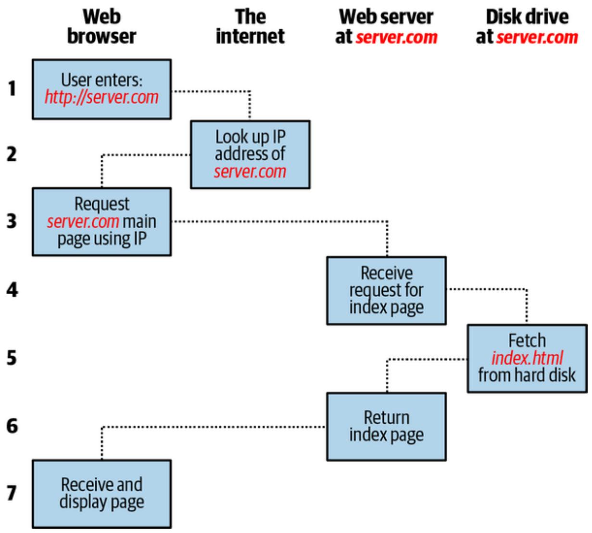
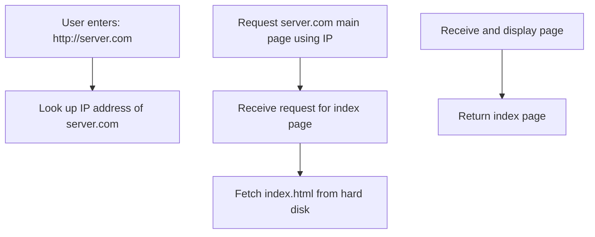
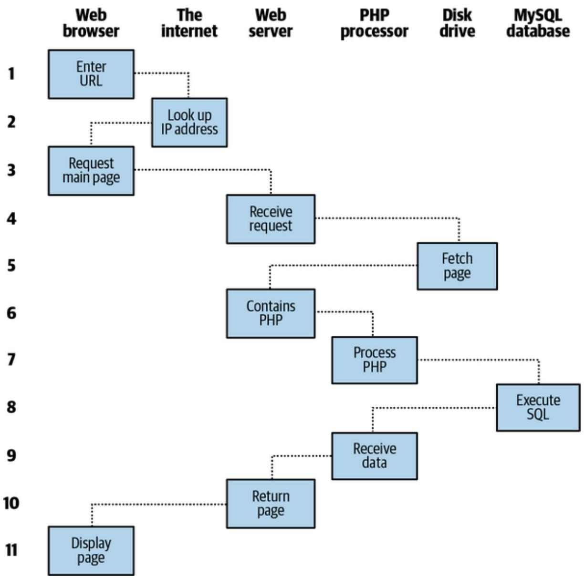
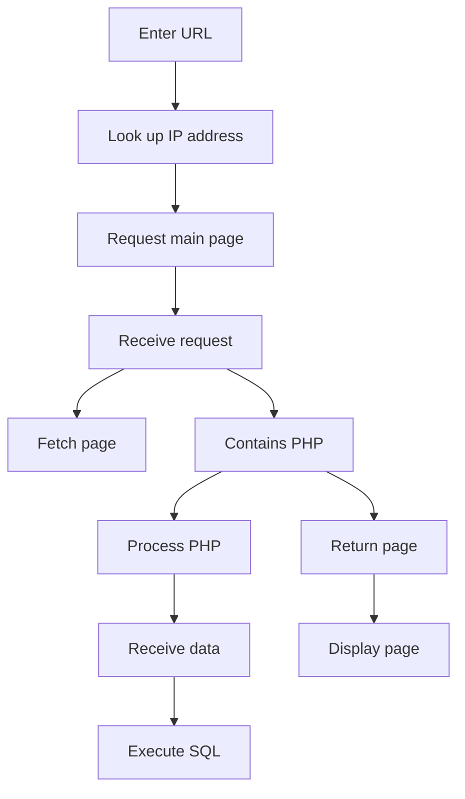

# Chapter 1. Introduction to Dynamic Web Content

The World Wide Web is a constantly evolving network that has already traveled far beyond its conception in the early 1990s, when it was created to solve a specific problem. State-of-the-art experiments at CERN (the European Laboratory for Particle Physics, now best known as the operator of the Large Hadron Collider) were producing incredible amounts of data— so much that the data was proving unwieldy to distribute to the participating scientists, who were spread out across the world.

At this time, the internet was already in place, connecting several hundred thousand computers, so Tim Berners-Lee (a CERN fellow) devised a method of navigating between them using a hyperlinking framework, which came to be known as Hypertext Transfer Protocol, or HTTP. He also created a markup language called Hypertext Markup Language, or HTML. To bring these together, he wrote the first web browser and web server.

**THE ADVENT OF WEB 1.0**

Web 1.0 was given its name only when the term Web 2.0 was coined. During the 1.0 era, most users were content consumers, and although there were some personal web pages, there were no social networks. Guestbooks were used instead of comment sections. Some sites had already used databases but server resources and bandwidth were very limited. Navigation and layout in Web 1.0 was managed with simple buttons and graphics, while interaction was very limited.

Today we take these simple tools for granted, but back then, the concept was revolutionary. The most connectivity experienced by at-home modem users at that time was dialing up and connecting to a bulletin board where you could communicate and swap data only with other users of that service. Consequently, you needed to be a member of many bulletin board systems in order to effectively communicate electronically with your colleagues and friends.

But Berners-Lee changed all that in one fell swoop, and by the mid-1990s, three major graphical web browsers were competing for the attention of five million users. It soon became obvious, though, that something was missing. Yes, pages of text and graphics with hyperlinks to take you to other pages was a brilliant concept, but the results didn’t reflect the instantaneous potential of computers and the internet to meet the particular needs of each user with dynamically changing content. Using the web was a very dry, plain experience, even if we did have scrolling text and animated GIFs!

Shopping carts, search engines, and social networks have clearly altered how we use the web. In this chapter, we’ll look briefly at the various components that make up the web and the software that helps make using it a rich, dynamic experience.

**NOTE**

It is necessary to start using some acronyms more or less right away. I have tried to clearly explain them before proceeding, but don’t worry too much about what they stand for or what these names mean, because the details will become clear as you read on.

## HTTP and HTML: Berners-Lee’s Basics

HTTP is a communication standard governing the requests and responses that are sent between the browser running on the end user’s computer and the web server. The server’s job is to accept a request from the client and attempt to reply to it in a meaningful way, usually by serving up a requested web page—that’s why the term server is used. The natural counterpart to a server is a client, so that term is applied both to the web browser and the computer on which it’s running.

Between the client and the server there can be several other devices, such as routers, proxies, gateways, and so on. They serve different roles in ensuring that the requests and responses are correctly transferred between the client and server. Typically, they use the internet to send this information. Some of these in-between devices can also help speed up the internet by storing pages or information locally in what is called a cache and then serving this content up to clients directly from the cache rather than fetching it all the way from the source server.

A web server can usually handle multiple simultaneous connections, and when not communicating with a client, it spends its time listening for an incoming connection. When one arrives, the server sends back a response.

## The Request/Response Procedure

At its most basic level, the request/response process consists of a web browser or other client asking the web server to send it a web page and the server sending back the page. The browser then takes care of displaying or rendering the page (see Figure 1-1).



<details>
<summary>flowchart</summary>


</details>

Figure 1-1. The basic client/server request/response sequence

The steps in the request and response sequence are:

1. You enter http://server.com into your browser’s address bar.  
2. Your browser looks up the Internet Protocol (IP) address for server.com.  
3. Your browser issues a request for the home page at server.com.  
4. The request crosses the internet and arrives at the server.com web server.  
5. The web server, having received the request, looks for the web page on its disk.

6. The web server retrieves the page and returns it to the browser.  
7. Your browser displays the web page.

For an average web page, this process also takes place once for each object within the page such as a graphic, an embedded video, or a CSS stylesheet.

In step 2, notice that the browser looks up the IP address of server.com. Every machine attached to the internet has an IP address—your computer included—but we generally access web servers by name, such as google.com. The browser consults an additional internet service called the Domain Name System (DNS) to find the server’s associated IP address and then uses it to communicate with the computer.

For dynamic web pages, the procedure is a little more involved, because it may bring both PHP and MySQL into the mix. For instance, you may click a picture of a raincoat. Then PHP will put together a request using the standard database language, SQL—many of whose commands you will learn in this book—and send the request to the MySQL server. The MySQL server will return information about the raincoat you selected, and the PHP code will wrap it all up in some HTML, which the server will send to your browser (see Figure 1-2).



<details>
<summary>flowchart</summary>


</details>

Figure 1-2. A dynamic client/server request/response sequence

The steps in the dynamic sequence are:

1. You enter http://server.com into your browser’s address bar.  
2. Your browser looks up the IP address for server.com.  
3. Your browser issues a request to that address for the web server’s home page.  
4. The request crosses the internet and arrives at the server.com web server.

5. The web server, having received the request, fetches the home page from its hard disk.  
6. With the home page now in memory, the web server notices that it is a file incorporating PHP scripting and passes the page to the PHP interpreter.  
7. The PHP interpreter executes the PHP code.  
8. Some of the PHP contains SQL statements, which the PHP interpreter now passes to the MySQL database engine.  
9. The MySQL database returns the results of the statements to the PHP interpreter.  
10. The PHP interpreter returns the results of the executed PHP code, along with the results from the MySQL database, to the web server.  
11. The web server returns the page to the requesting client, which displays it.

Although it’s helpful to be aware of this process so that you know how the three elements work together, in practice you don’t really need to concern yourself with these details, because they all happen automatically.

The HTML pages returned to the browser in each example may contain JavaScript, which will be interpreted locally by the client, and which could initiate another request.

## The Benefits of PHP, MySQL, JavaScript, CSS, and HTML

At the start of this chapter, I introduced the world of Web 1.0, but it wasn’t long before the rush was on to create Web 1.1, with the development of such browser enhancements as Java, JavaScript, Flash, and ActiveX. On the server side, progress was being made on the Common Gateway Interface (CGI) using scripting languages such as Perl (an alternative to the PHP

language) and server-side scripting—inserting the contents of one file (or the output of running a local program) into another one dynamically.

Once the dust had settled, three main technologies stood head and shoulders above the others. Although Perl was still a popular scripting language with a strong following, PHP’s simplicity and built-in links to the MySQL database program had earned it more than double the number of users. And JavaScript, which had become an essential part of the equation for dynamically manipulating HTML, now took on the even more muscular task of handling the client side of asynchronous communication (exchanging data between a client and server after a web page has loaded). Using asynchronous communication, web pages perform data handling and send requests to web servers in the background—without the web user being aware that this is going on.

No doubt the symbiotic nature and the open source licenses of PHP and MySQL helped propel them both forward, but what attracted developers to them in the first place? The simple answer is the ease with which you can use them to quickly create dynamic elements on websites. MySQL is a fast and powerful yet easy-to-use database system that offers just about anything a website would need to find and serve up data to browsers.

And when you bring JavaScript and CSS into the mix, you have a recipe for building highly dynamic and interactive websites—especially as there is now a wide range of sophisticated frameworks of JavaScript functions you can call on to speed up web development. These include the well-known jQuery, which until recently was one of the most common ways programmers accessed asynchronous communication features.

The more recent React JavaScript library has also been growing quickly in popularity, and is now one of the most widely downloaded and implemented frameworks, so much so that at the time of writing the Indeed job site lists many more positions for React developers than for jQuery.

React provides state-of-the-art functionality for building complex UI interactions that communicate with the server in real time with JavaScriptdriven pages. It lets you create components that are the building blocks of the React application.

A React component can be anything in your web application. It can be as simple as a Button, Text, Label, or Grid, or even as complex as a Login widget or a popup modal with control buttons. React also supports server rendering of its components using tools like Next.js. You can even use React in your existing apps (it was designed with this in mind). You can change a small part of your existing application by using React, and if that change works, then you can start converting your whole application over to React.js. However, other frameworks such as Vue.js may be more suitable for this sort of iterative implementation.

### MariaDB: The MySQL Clone

After Oracle (the database management corporation) purchased Sun Microsystems (the owners of MySQL), the community became wary that MySQL might not remain fully open source, so MariaDB was forked from it to keep it free under the GNU GPL, the software license that guarantees users the freedom to run, study, share, and modify the software. Development of MariaDB is led by some of the original developers of MySQL, and it retains exceedingly close compatibility with MySQL. Therefore, you may well encounter MariaDB on some servers in place of MySQL—but not to worry, everything in this book works equally well on both MySQL and MariaDB. For all intents and purposes, you can swap one with the other and notice no difference.

Fortunately, many of the initial fears appear to have been allayed as MySQL remains open source, with Oracle simply charging for support and for editions that provide additional features such as geo-replication and automatic scaling. However, unlike MariaDB, MySQL is no longer community driven, so knowing that MariaDB will always be there if needed will reassure many developers and likely ensure that MySQL itself will remain open source.

### Using PHP

With PHP, it’s a simple matter to embed dynamic activity in web pages. When you give pages the .php extension, they have instant access to the scripting language. From a developer’s point of view, all you have to do is write code such as:

```php
<?php echo "Today is ". date("l") . "; "; ?> Here's the latest news.
```

The opening <?php tells the web server to allow the PHP program to interpret all of the following code up to the ?> tag. Outside of this construct, everything is sent to the client as direct HTML. So, the text Here's the latest news. is simply output to the browser; within the PHP tags, the built-in date function displays the current day of the week according to the server’s system time.

The final output of the two parts looks like this:

Today is Wednesday. Here's the latest news.

PHP is a flexible language, and some people prefer to place the PHP construct directly next to PHP code, like this:

Today is <?php echo date("l"); ?>. Here's the latest news.

There are even more ways of formatting and outputting information, which I’ll explain in the chapters on PHP. The point is that with PHP, web developers have a scripting language that, although not as fast as compiling your code in C or a similar language, is incredibly speedy and also integrates seamlessly with HTML markup.

**NOTE**

If you intend to enter the PHP examples in this book into a program editor to follow along with me, you must remember to add <?php in front and ?> after them to ensure that the PHP interpreter processes them. To facilitate this, you may wish to prepare a file called example.php with those tags in place.

Using PHP, you have unlimited control over your web server. Whether you need to modify HTML on the fly, process a credit card, add user details to a database, or fetch information from a third-party website, you can do it all from within the same PHP files in which the HTML itself resides.

### Using MySQL

Of course, there’s not much point in being able to change HTML output dynamically unless you also have a means to track the information users provide to your website as they use it. In the early days of the web, many sites used “flat” text files to store data such as usernames and passwords. But this approach could cause problems if the file wasn’t correctly locked against corruption from multiple simultaneous accesses. Also, a flat file can get only so big before it becomes unwieldy to manage—not to mention the difficulty of trying to merge files and perform complex searches in a reasonable time.

That’s where relational databases with structured querying become essential. And MySQL, being free to use and installed on vast numbers of internet web servers, rises superbly to the occasion. It is a robust, exceptionally fast database management system that uses English-like commands.

The highest level of MySQL structure is a database, within which you can have one or more tables that contain your data. This is similar to let’s say an Excel spreadsheet file that consists of multiple sheets: the spreadsheet file can be viewed as a database and the individual sheets as tables.

Let’s suppose you are working on a table called users, within which you have created columns for surname, firstname, and email, and you now wish to add another user. One command you might use to do this is:

INSERT INTO users VALUES('Smith', 'John', 'jsmith@mysite.com');

You will previously have issued other commands to create the database and table and to set up all the correct fields, but the SQL INSERT command here shows how simple it can be to add new data to a database.

It’s equally easy to look up data. Let’s assume that you have a user’s email address and need to look up that person’s name. To do this, you could issue a MySQL query such as:

SELECT surname,firstname FROM users WHERE email='jsmith@mysite.com';

MySQL will then return Smith, John and any other pairs of names associated with that email address in the database.

As you’d expect, there’s quite a bit more that you can do with MySQL than just simple INSERT and SELECT commands. For example, you can combine related data sets to bring related pieces of information together, ask for results in a variety of orders, make partial matches when you know only part of the string that you are searching for, return only the nth result, and a lot more.

Using PHP, you can make all these calls to MySQL without having to directly access the MySQL command-line interface. This means you can save the results in arrays for processing and perform multiple lookups, each dependent on the results returned from earlier ones, to drill down to the item of data you need.

For even more power, as you’ll see later, additional functions are built right into MySQL so you can call up to efficiently run common operations within MySQL, rather than creating them out of multiple PHP calls to MySQL.

### Using JavaScript

JavaScript was created to enable scripting access to all the elements of an HTML document. In other words, it provides a means for dynamic user interaction such as checking email address validity in input forms and displaying prompts such as “Did you really mean that?” (although it cannot be relied upon for security, which should always be performed on the web server).

Combined with CSS (see “Using CSS”), JavaScript is the power behind dynamic web pages that change in front of your eyes rather than when a new page is returned by the server.

However, JavaScript used to be tricky to use, due to the way the language was initially designed and to some major differences in how different browsers have chosen to implement it. This came about when some manufacturers tried to put additional functionality into their browsers at the expense of compatibility with their rivals.

Thankfully, the language evolves, and the browser developers have mostly come to their senses, realizing the need for full compatibility with one another, so it is less necessary these days to have to optimize your code for different browsers.

For now, let’s look at how to use basic JavaScript, accepted by all browsers:

```txt
<script>
document.write("Today is " + Date());
</script>
```

This code snippet tells the web browser to interpret everything within the <script> tags as JavaScript, which the browser does by writing the text Today is to the current document, along with the date, using the JavaScript function Date. The result will look something like this:

**WALKING BEFORE RUNNING**

The document.write function is deliberately being used here in the way it was originally intended, for the sake of simplicity in very small code snippets. However, there are better ways to write into web pages and for issuing feedback while debugging, all of which will be revealed at the right times in this book, as well as explanations for when and why the other options will work better for you.

As previously mentioned, JavaScript was originally developed to offer dynamic control over the various elements within an HTML document, and that is still its main use. But increasingly, JavaScript is being used as the primary language for web application development, with features such as Ajax, the process of accessing the web server in the background.

Asynchronous communication allows web pages to begin to resemble standalone programs, because they don’t have to be reloaded in their entirety to display new content. Instead, an asynchronous call can pull in and update a single element on a web page, such as changing your photograph on a social networking site or replacing a button that you click with the answer to a question. This subject is fully covered in Chapter 17.

### Using CSS

CSS is the crucial companion to HTML, ensuring that the HTML text and embedded images are laid out consistently and appropriately for the user’s screen. With the emergence of the CSS3 standard in recent years, CSS now offers a level of dynamic interactivity previously supported only by JavaScript. For example, not only can you style any HTML element to change its dimensions, colors, borders, spacing, and so on, but now you can also add animated transitions and transformations to your web pages, using only a few lines of CSS.

By the way, the numbering standard for CSS releases (such as CSS2 or CSS3) has now been dropped, so Cascading Style Sheets are now referred to as simply CSS, but various submodules have their own numbering such as CSS Selectors Level 4 and CSS Images Level 3.

Using CSS can be as simple as inserting a few rules between <style> and </style> tags in the head of a web page, like this:

```vue
<style>
p {
    text-align:justify;
    font-family:Helvetica;
}
</style>
```

These rules change the default text alignment of the <p> tag so that paragraphs contained in it are justified, the content exactly fills the box, and paragraphs use the Helvetica font.

The many different ways you can lay out CSS rules are discussed in Supplemental Chapter 1, “Introduction to CSS”, and you can also include them directly within tags or save a set of rules to an external file to be loaded in separately. This flexibility not only lets you style your HTML precisely but can also (for example) provide built-in hover functionality to animate objects as the mouse passes over them. You will also learn how to access all of an element’s CSS properties from JavaScript as well as HTML.

In the main body of the book you’ll also learn all the new, more advanced features that come with CSS, such as borders, shadows, text effects, transitions, transformations, and the tremendous power of the flexbox and CSS Grid technologies.

## And Then There’s HTML5

As useful as all these additions to the web standards became, they were not enough for ever-more ambitious developers. For example, there was still no simple way to manipulate graphics in a web browser without resorting to plug-ins such as Flash (which is now no longer supported or widely used). And the same went for inserting audio and video into web pages. Plus, several annoying inconsistencies had crept into HTML during its evolution.

To clear all this up and take the internet beyond Web 2.0 and into its next iteration, a new standard for HTML was created to address all these shortcomings: HTML5. Its development began as long ago as 2004, when the first draft was drawn up by the Mozilla Foundation and Opera Software, developers of two popular web browsers. Today, the HTML5 standard is maintained by WHATWG (Web Hypertext Application Technology Working Group) and is officially called HTML Living Standard.

It’s a never-ending cycle of development, though, and more functionality is sure to be built into it over time. Some of the best features in HTML5 for handling and displaying media include the <audio>, <video>, and <canvas> elements, which add sound, video, and advanced graphics. Everything you need to know about these and all other aspects of HTML5 is covered in detail starting in the PDF of Supplemental Chapter 4, “Introduction to HTML5”, available in the book’s GitHub repository.

**NOTE**

One of the little things I like about the HTML5 specification is that XHTML syntax is no longer required for self-closing elements. In the past, you could display a line break using the <br> element. Then, to ensure future compatibility with XHTML (the planned replacement for HTML that never happened), this was changed to <br />, in which a closing / character was added (since all elements were expected to include a closing tag featuring this character). But now things have gone full circle, and you can use either version of these types of elements. In this book I have reverted to the former style of <br>, <hr>, and so on, as this is also what the HTML standard now recommends. Do note, however, that frameworks such as React use an extension to JavaScript called JSX, which does require the preceding / character, and where such examples occur in this book, the preceding / is used.

## The Apache Web Server

In addition to PHP, MySQL, JavaScript, CSS, and HTML, there’s a sixth hero in the dynamic web: the web server. For this book, that means the Apache web server. We’ve discussed a little of what a web server does during the HTTP server/client exchange, but it does much more behind the scenes.

For example, Apache doesn’t serve up just HTML files—it handles a wide range of files, from images to MP3 audio files, RSS (Really Simple Syndication) feeds, and so on. And these objects don’t have to be static files such as GIF images. They can all be generated by programs such as PHP scripts. That’s right: PHP can even create images and other files for you, either on the fly or in advance to serve up later.

To do this, you normally have modules either precompiled into Apache or PHP or called up at runtime. One such module is the GD (Graphics Draw) library, which PHP uses to create and handle graphics.

Apache also supports a huge range of modules of its own. In addition to the PHP module, the most important for your purposes as a web programmer are the modules that handle security. Other examples are the Rewrite module, which enables the web server to handle a range of URL types and rewrite them to its own internal requirements, and the Proxy module, which you can use to serve up often-requested pages from a cache to ease the load on the server.

Later in the book, you’ll see how to use some of these modules to enhance the features provided by the three core technologies.

## Node.js: An Alternative to Apache

In 2009 developer Ryan Dahl was dissatisfied with Apache and its difficulties with handling large numbers of concurrent connections, and came up with a solution he called Node.js, which uses Google’s V8 JavaScript engine to allow developers to use JavaScript for server-side scripting. Shortly after, a package manager was introduced for the Node.js environment called npm, which made it easier for programmers to publish and share source code of Node.js packages, simplifying installation, updating, and uninstallation of packages.

As of 2024 Node.js has reached version 22.6.0 and has become a fully mainstream alternative to the Apache web server. This book’s new edition would be remiss to not detail its benefits and provide enough information to get you up and running with it, if you choose. You might make that choice, for the three reasons discussed next.

Node.js uses an event-driven, nonblocking I/O model, allowing it to handle a large number of concurrent connections efficiently. This nonblocking nature enables scalable and high-performance applications, making it ideal for building real-time web applications, chat applications, and streaming services, for example.

It allows developers to use JavaScript on both the frontend and backend, making it a full-stack development environment. This eliminates the need to switch between different programming languages, enabling better code reusability and streamlining the development process. Yes, that means you won’t have to keep up-to-date with PHP if you make the switch, and indeed Node.js will not be able to run your PHP scripts. However, a rather complex app can still use both Node.js and Apache with PHP each for different parts or tasks.

Being built on the V8 JavaScript engine, Node.js provides exceptional performance, executing JavaScript code quickly and efficiently, resulting in faster response times and improved overall application performance. Additionally, Node.js has a small memory footprint, making it resource efficient and suitable for deploying on cloud platforms.

As you will learn, there are many other solid reasons for using Node.js, but just these few are already highly persuasive. PHP remains a very important language prevalent across the internet, is actively developed, has active communities and is often used together with other languages and environments such as Node.js.

## About Open Source

The technologies in this book are open source: anyone is allowed to read and change the code. Whether this status is the reason these technologies are so popular has often been debated, but PHP, MySQL, and Apache are the three most commonly used tools in their categories. What can be said definitively, though, is that their being open source means that they have been developed in the community by teams of programmers writing the features they themselves want and need, with the original code available for all to see and change. Bugs can be found quickly, and security breaches can be prevented before they happen.

There’s another benefit: all of these programs are usually free to use, although it depends on the particular license. There’s no worry about having to purchase additional licenses if you have to scale up your website and add more servers, and you don’t need to check the budget before deciding whether to upgrade to the latest versions of these products.

## Bringing It All Together

The real beauty of PHP, MySQL, JavaScript, CSS, and HTML is the wonderful way they all work together to produce dynamic web content: PHP handles all the main work on the web server, MySQL manages all the data, and the combination of CSS and JavaScript looks after web page presentation. JavaScript can also talk with your PHP code on the web server whenever it needs to update something (either on the server or on the web page). And with powerful HTML features like the canvas, audio and video, and geolocation, you can make your web pages highly dynamic, interactive, and multimedia-packed.

Without using program code, let’s summarize the contents of this chapter by looking at the process of combining some of these technologies into an everyday asynchronous communication feature that many websites use: checking whether a desired username already exists on the site when a user is signing up for a new account. A good example of this can be seen with Gmail (see Figure 1-3).

**Google**

**How you’l sign in**

Create a Gmail address for signing in to your Google Account

Username

arthurjohnson

@gmail.com

That username is taken. Try another.

Available:aj8245778

Next

Figure 1-3. Gmail uses asynchronous communication to check the availability of usernames

The steps involved in this asynchronous process will be similar to these:

1. The server outputs the HTML to create the web form, which asks for the necessary details, such as username, first name, last name, and email address.  
2. At the same time, the server attaches some JavaScript to the HTML to monitor the username input box and check for two things: whether some text has been typed into it, and whether the input has been deselected because the user has clicked another input box or tabbed away.

3. Once the text has been entered and the field deselected, in the background the JavaScript code passes the username that was entered back to a software on the web server and awaits a response.

4. The web server looks up the username and replies to the JavaScript about whether that name has been taken.  
5. The JavaScript then places an indication next to the username input box to show whether the name is available to the user—perhaps a green checkmark or a red cross graphic, along with some text.  
6. If the username is not available and the user still submits the form, the JavaScript interrupts the submission and reemphasizes (perhaps with a larger graphic and/or an alert box) that the user needs to choose another username.  
7. Optionally, an improved version of this process could look at the username requested by the user and suggest an alternative that is currently available.

All of this takes place quietly in the background and makes for a comfortable and seamless user experience. Without asynchronous communication, the entire form would have to be submitted to the server, which would then send back HTML, highlighting any mistakes. It would be a workable solution but nowhere near as tidy or pleasurable as on-the-fly form field processing.

Asynchronous communication can be used for a lot more than simple input verification and processing, though; we’ll explore many additional things that you can do with it later in this book.

In this chapter, you have read an introduction to the core technologies of PHP, MySQL, JavaScript, CSS, and HTML (as well as Apache) and have learned how they work together. In Chapter 2, we’ll look at how you can install your own web development server on which to practice everything that you will be learning. Now, as in all this book’s chapters, I recommend you see whether you can answer the following questions to check that you have absorbed its contents.

## Questions

1. What four components (at the minimum) are needed to create a fully dynamic web page?  
2. What does HTML stand for?  
3. Why does the name MySQL contain the letters SQL?  
4. PHP and JavaScript are both programming languages that generate dynamic results for web pages. What is their main difference, and why would you use both?  
5. What does CSS stand for?  
6. List three major new elements introduced in HTML5.  
7. If you encounter a bug (which is rare) in one of the open source tools, how do you think you could get it fixed?  
8. Why is a framework such as jQuery or React so important for developing modern websites and web apps?  
9. Why is the event-driven model of Node.js superior to the Apache web server?

See “Chapter 1 Answers” in the Appendix A for the answers to these questions.