# Chapter 2. Setting Up a Development Server

If you wish to develop internet applications but don’t have your own development server, you will have to upload every modification you make to a server somewhere else on the web before you can test it.

Even on a fast broadband connection, this can represent a significant slowdown in development time. On a local computer, however, testing can be as easy as saving an update (usually just a matter of clicking once on an icon) and then hitting the Refresh button in your browser.

Another advantage of a development server is that you don’t have to worry about embarrassing errors or security problems while you’re writing and testing, whereas you need to be aware of what people may see or do with your application when it’s on a public website. It’s best to iron everything out while you’re still on a home or small office system, presumably protected by firewalls and other safeguards.

Once you have your own development server, you’ll wonder how you ever managed without one, and it’s easy to set one up. Just follow the steps in the following sections, using the appropriate instructions for a PC, a Mac, or a Linux system.

In this chapter, we cover just the server side of the web experience, as described in Chapter 1. But to test the results of your work—particularly when we start using JavaScript, CSS, and HTML later in this book—you should ideally have an instance of every major web browser running on some system convenient to you. Sometimes, testing on two different browsers may be sufficient but whenever possible, the list of browsers should include at least Mozilla Firefox, Safari, and Google Chrome.

Even though there are multiple other browsers based on the Google Chromium browser there may still be minor differences in their

implementation that make it worthwhile testing your code on all possible browsers before final release. You may need all these once you have a product ready to release, just to ensure everything runs as expected on all browsers and platforms.

If you plan to ensure that your sites look good on mobile devices too, you should try to arrange access to a wide range of iOS and Android devices, and services like BrowserStack will help you with that. Browser developer tools also offer mobile device emulation to help you verify the site is responsive and viewable on those smaller screens.

## What Is a WAMP, MAMP, or LAMP?

WAMP, MAMP, and LAMP are abbreviations for “Windows, Apache, MySQL, PHP,” “Mac, Apache, MySQL, and PHP,” and “Linux, Apache, MySQL, PHP.” These abbreviations each describe a fully functioning setup used for developing dynamic internet web pages.

WAMPs, MAMPs, and LAMPs come in the form of packages that bind the bundled programs together so that you don’t have to install and set them up separately. This means you can simply download and install a single program and follow a few easy prompts to get your web development server up and running fast, with minimal hassle.

During installation, several default settings are created for you. The security configurations of such an installation will not be as tight as on a production web server, because it is optimized for local use. For these reasons, you should never install such a setup as a production server.

However, for developing and testing websites and applications, one of these installations should be entirely sufficient.

**WARNING**

If you choose not to go the WAMP/MAMP/LAMP route for building your own development system, you should know that downloading and integrating the various parts yourself can be very time-consuming and may require a lot of research to configure everything fully. But if you already have all the components installed and integrated with one another, they should work with the examples in this book.

## Installing AMPPS on Windows

There are several available WAMP servers, each offering slightly different configurations. Different editions of this book have recommended different WAMP products according to which seems to offer the best features and appears the most reliable at the time. Currently AMPPS looks like the best option (although you could choose other alternatives if you preferred and still be able to follow the examples in this book). You can download AMPPS by clicking the download button on the website’s home page. (There are also Mac and Linux versions available; see “Installing AMPPS on macOS” and “Installing a LAMP on Linux”.)

I recommend that you always download the latest stable release (as I write this, it’s 4.4, the installer for which is about 46 MB in size). The various Windows, macOS, and Linux installers are listed on the download page.

Once you’ve downloaded the installer, run it to bring up the window shown in Figure 2-1. Before arriving at that window, though, if you use an antivirus program or have User Account Control activated on Windows, you may first be shown one or more advisory notices and will have to click Yes and/or OK to continue with the installation.

Click Next, after which you must accept the agreement. Click Next once again, and then once more to move past the information screen. You will now need to confirm the installation location. This will probably be suggested as something like the following, depending on the letter of your main hard drive, but you can change this if you wish:

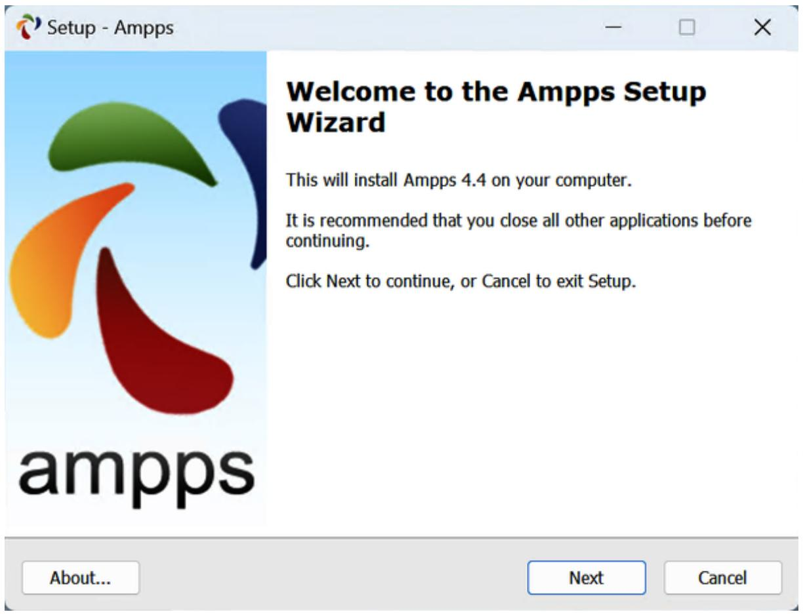

<details>
<summary>text_image</summary>

Setup - Ampps
Welcome to the Ampps Setup Wizard
This will install Ampps 4.4 on your computer.
It is recommended that you close all other applications before continuing.
Click Next to continue, or Cancel to exit Setup.
ampps
About...
Next
Cancel
</details>

Figure 2-1. The opening window of the installer

**NOTE**

During the lifetime of this edition, some of the screens and options shown in the following walk-through may change. If so, just use your common sense to proceed as similarly as possible to the sequence of actions described.

You must accept the agreements in the following screen and click Next, then after reading the information summary click Next once more and you will be asked which folder you wish to install AMPPS into.

Once you have decided where to install AMPPS, click Next, decide where shortcuts should be saved (the default shown is usually just fine), and click

Next again to choose which icons you wish to install, as shown in Figure 2- 2. On the screen that follows, click the Install button to start the process.

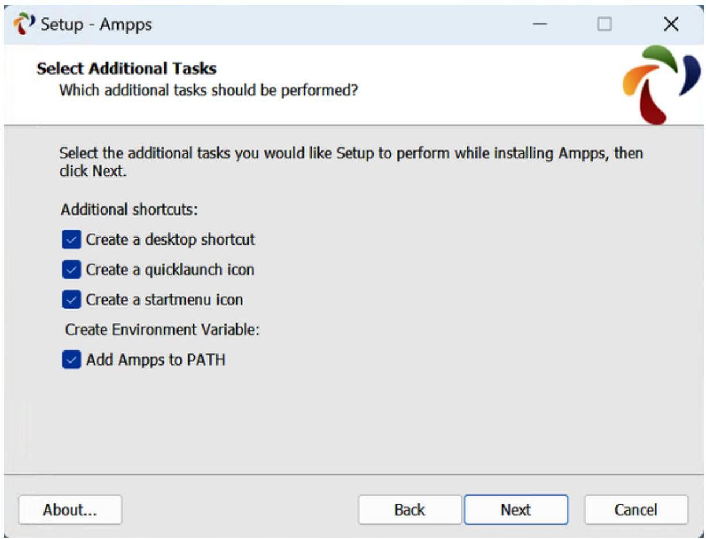

<details>
<summary>text_image</summary>

Setup - Ampps
Select Additional Tasks
Which additional tasks should be performed?
Select the additional tasks you would like Setup to perform while installing Ampps, then click Next.
Additional shortcuts:
✓ Create a desktop shortcut
✓ Create a quicklaunch icon
✓ Create a startmenu icon
Create Environment Variable:
✓ Add Ampps to PATH
About...
Back	Next	Cancel
</details>

Figure 2-2. Choose which icons to install

Installation will take a few minutes, after which you should see the completion screen in Figure 2-3, and you can click Finish.

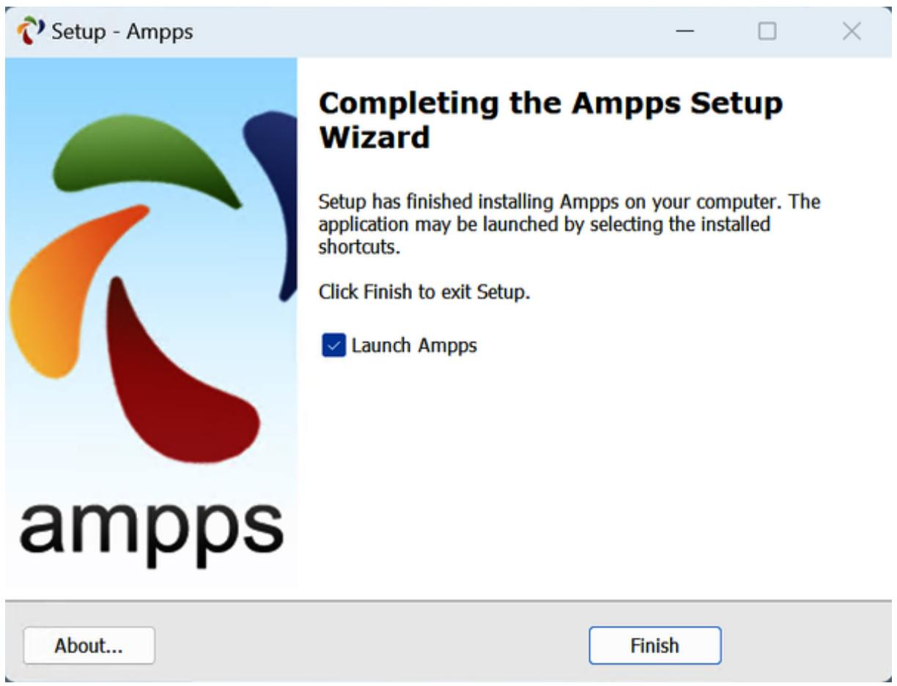

<details>
<summary>text_image</summary>

Setup - Ampps
Completing the Ampps Setup Wizard
Setup has finished installing Ampps on your computer. The application may be launched by selecting the installed shortcuts.
Click Finish to exit Setup.
✓ Launch Ampps
About...
Finish
</details>

Figure 2-3. AMPPS is now installed

The final thing you must do is install Microsoft Visual C++ Redistributable, if you haven’t already. A window will pop up to prompt you, as shown in Figure 2-4. Click Install to start the installation and if you already have it you will be told whether you need to reinstall it, which you can skip.

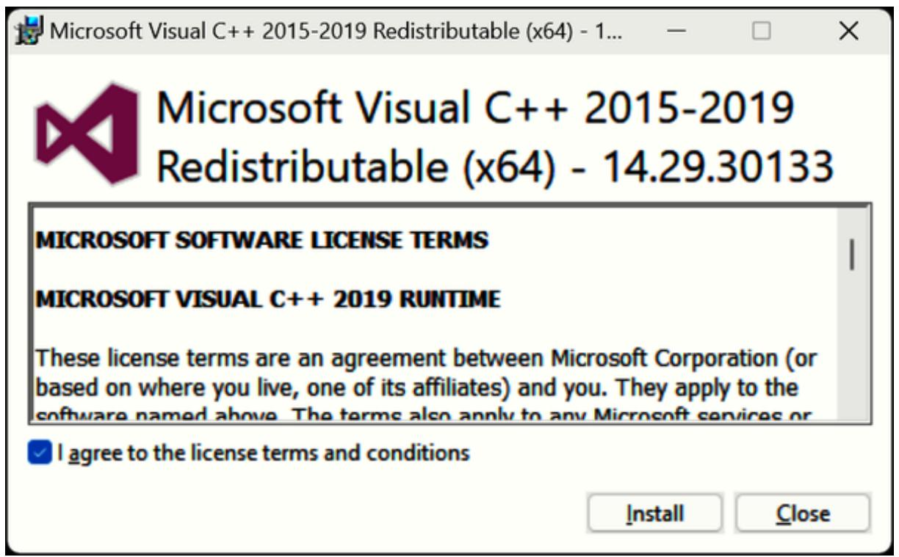

<details>
<summary>text_image</summary>

Microsoft Visual C++ 2015-2019 Redistributable (x64) - 1...
Microsoft Visual C++ 2015-2019
Redistributable (x64) - 14.29.30133
MICROSOFT SOFTWARE LICENSE TERMS
MICROSOFT VISUAL C++ 2019 RUNTIME
These license terms are an agreement between Microsoft Corporation (or based on where you live, one of its affiliates) and you. They apply to the software named above. The terms also apply to any Microsoft services or
✓ I agree to the license terms and conditions
Install	Close
</details>

Figure 2-4. Install the Visual C++ Redistributable if you don’t already have it

If you choose to go ahead and install, you will have to agree to the terms and conditions in the pop-up window that appears and then click Install. Installation of this should be fairly fast. Click Close to finish.

Once AMPPS is installed, the control window shown in Figure 2-5 should appear at the bottom right of your desktop. You can also call up this window using the AMPPS application shortcut in the Start menu or on the desktop, if you allowed these icons to be created.

Before proceeding, if you have any further questions, I recommend you acquaint yourself with the AMPPS documentation; otherwise, you are set to go—there’s always a Support link at the bottom of the control window that will take you to the AMPPS website, where you can open a trouble ticket if needed.

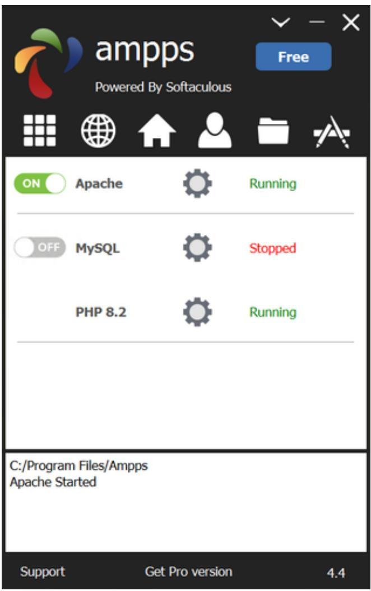

<details>
<summary>text_image</summary>

ampps
Powered By Softaculous
Free
ON Apache Running
OFF MySQL Stopped
PHP 8.2 Running
C:/Program Files/Ampps
Apache Started
Support Get Pro version 4.4
</details>

Figure 2-5. The AMPPS control window

You may notice that the default version of PHP in AMPPS is 8.2. If you wish to try other versions for any reason, click the Options button (nine white boxes in a square) within the AMPPS control window and then select Change PHP Version; a new menu will appear from which you can choose to install a different version.

### Testing the Installation

The first thing to do at this point is verify that everything is working correctly. To do this, enter the following URL into the address bar of your browser:

http://localhost

This will call up an introductory screen, where you can secure AMPPS by giving it a password (see Figure 2-6). It is up to you now whether or not to secure the program. If only you will have access to the PC you may choose not to. But if there could be any security implications then you probably should password protect the installation.

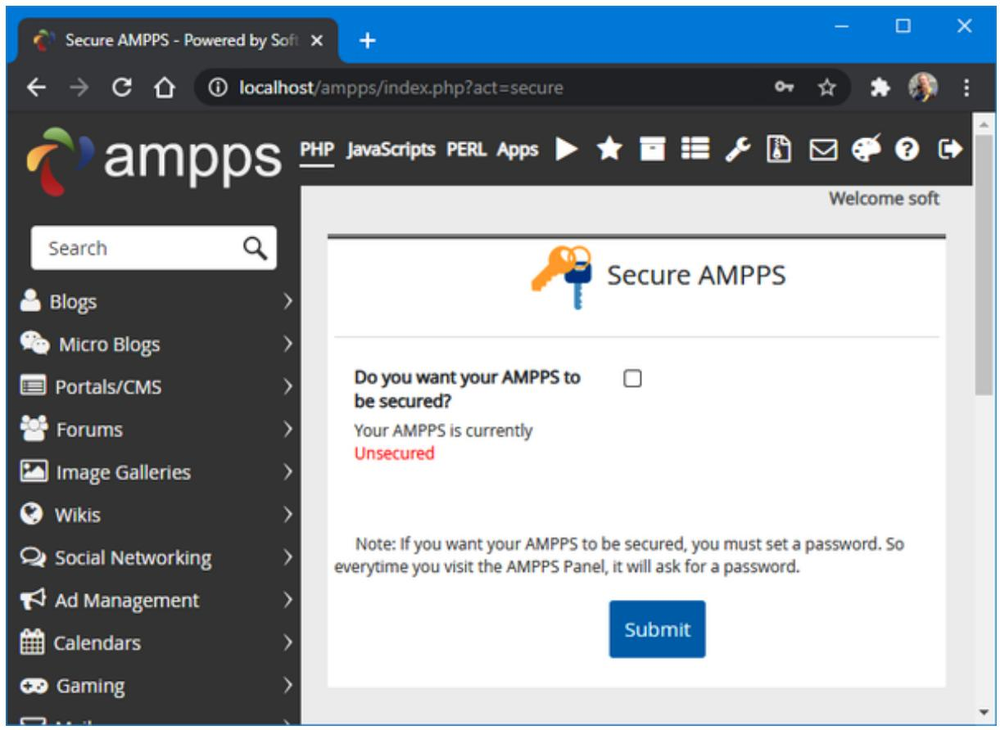

<details>
<summary>text_image</summary>

Secure AMPPS - Powered by Soft
localhost/ampps/index.php?act=secure
ampps PHP JavaScripts PERL Apps
Welcome soft
Search
Blogs
Micro Blogs
Portals/CMS
Forums
Image Galleries
Wikis
Social Networking
Ad Management
Calendars
Gaming
Secure AMPPS
Do you want your AMPPS to be secured?
Your AMPPS is currently Unsecured
Note: If you want your AMPPS to be secured, you must set a password. So everytime you visit the AMPPS Panel, it will ask for a password.
Submit
</details>

Figure 2-6. The initial security setup screen

Once this has been completed you will be taken to the main control page at http://localhost/ampps/. From here you can configure and control all aspects of the AMPPS stack, so note this for future reference or set a bookmark in your browser.

Next, type the following to view the document root (described in the following section) of your new Apache web server:

http://localhost

This time, rather than seeing the initial screen about setting up security, you should see something similar to Figure 2-7, although the files shown may be different.

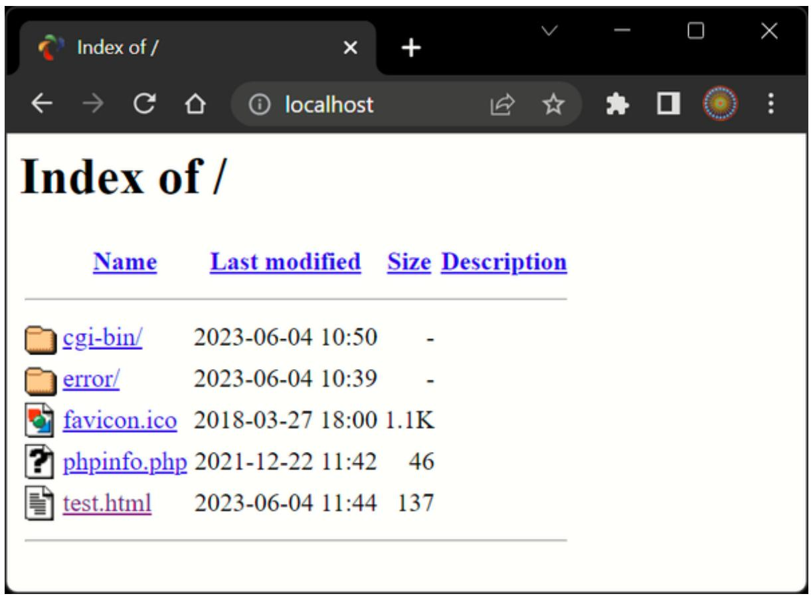

<details>
<summary>text_image</summary>

Index of /
Name Last modified Size Description
cgi-bin/ 2023-06-04 10:50 -
error/ 2023-06-04 10:39 -
favicon.ico 2018-03-27 18:00 1.1K
phpinfo.php 2021-12-22 11:42 46
test.html 2023-06-04 11:44 137
</details>

Figure 2-7. Viewing the document root

### Accessing the Document Root (Windows)

The document root is the directory that contains the main web documents for a domain. This directory is the one that the server uses when a basic URL without a path is typed into a browser, such as http://yahoo.com or, for your local server, http://localhost.

By default AMPPS will use the following location as the document root:

C:\Program Files\Ampps\www

To ensure that you have everything correctly configured, you should now create the obligatory “Hello World” file. So, create a small HTML file along the following lines using a plain-text editor such as Windows Notepad (which will work just fine, although better suited applications called code editors are discussed later in this chapter):

```txt
<!DOCTYPE html>
<html lang="en">
<head>
    <title>A quick test</title>
</head>
<body>
    Hello World!
</body>
</html>
```

Once you have typed this, save the file into the document root directory, using the filename test.html.

You can now call up this page in your browser by entering the following URL in its address bar (see Figure 2-8):

http://localhost/test.html

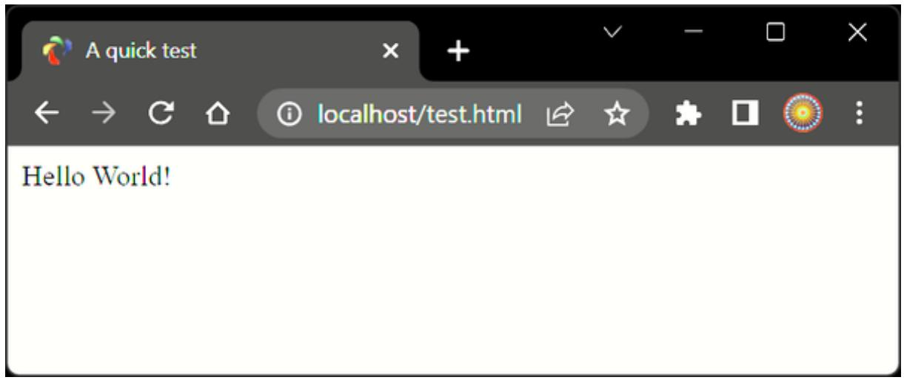

<details>
<summary>text_image</summary>

Hello World!
</details>

Figure 2-8. Your first web page

Remember that serving a web page from the document root (or a subfolder) is different from loading one into a web browser from your computer’s filesystem. The former will ensure access to PHP, MySQL, and all the features of a web server, while the latter will simply load the file into the browser, which will do its best to display it but will be unable to process any PHP or other server instructions. So, you should generally run examples using the localhost preface from your browser’s address bar, unless you are certain that the file doesn’t rely on web server functionality.

### Alternative WAMPs

When software is updated, it sometimes works differently from how you expect, and bugs can even be introduced. So, if you encounter difficulties that you cannot resolve in AMPPS, you may prefer one of the other solutions available on the web.

You will still be able to use all the examples in this book, but you’ll have to follow the instructions supplied with each WAMP, which may not be as easy to follow as the preceding guide.

Here’s a selection of some of the best alternatives, in my opinion:

EasyPHP  
XAMPP

**NOTE**

Over the life of this edition of the book, it is very likely that the developers of AMPPS will improve the software, and therefore the installation screens and method of use may evolve over time, as may versions of Apache, PHP, or MySQL. So, please don’t assume something is wrong if the screens and operation look different. The AMPPS developers take every care to ensure it is easy to use, so just follow any prompts given and refer to the documentation on the AMPPS website.

## Installing AMPPS on macOS

AMPPS is also available on macOS, and you can download it from the AMPPS website (as I write, the current version is 4.3, and the installer size is around 38 MB).

If your browser doesn’t open it automatically once it has downloaded, double-click the .dmg file, and then drag the AMPPS folder over to your Applications folder (see Figure 2-9).


<details>
<summary>text_image</summary>

ampps
</details>

To install,drag AMPPS folder to Applications folder.

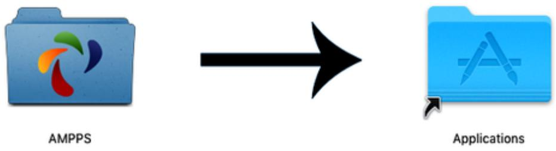

<details>
<summary>flowchart</summary>

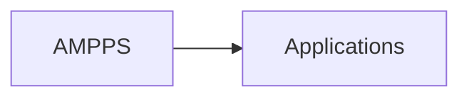
</details>

Figure 2-9. Drag the AMPPS folder to Applications

Open your Applications folder as usual, and double-click the AMPPS program. If your security settings prevent the file being opened, hold down the Control key and click the icon once. A new window will pop up asking if you are sure you wish to open it. Click Open to do so. When the app starts, you may have to enter your macOS password to proceed.

Once AMPPS is up and running, a control window similar to the one shown in Figure 2-5 will appear at the bottom left of your desktop.

**NOTE**

You may notice that the default version of PHP in AMPPS is 8.2. If you wish to try a different version for any reason, click the Options button (nine white boxes in a square) within the AMPPS control window, then select Change PHP. A new menu will appear in which you can choose to install other versions of PHP.

By default, AMPPS will use the following location as the document root:

/Applications/Ampps/www

To ensure that you have everything correctly configured, you should now create the obligatory “Hello World” file. So, create a small HTML file along the following lines using the TextEdit program (which will work just fine, although better suited applications called code editors are discussed later in this chapter):

```txt
<!DOCTYPE html>
<html lang="en">
<head>
    <title>A quick test</title>
</head>
<body>
    Hello World!
</body>
</html>
```

Once you have typed this, save the file into the document root directory using the filename test.html.

You can now call up this page in your browser by entering the following URL in its address bar (to see a similar result to Figure 2-8):

http://localhost/test.html

**NOTE**

Remember that serving a web page from the document root (or a subfolder) is different from loading one into a web browser from your computer’s filesystem. The former will ensure access to PHP, MySQL, and all the features of a web server, while the latter will simply load the file into the browser, which will do its best to display it but will be unable to process any PHP or other server instructions. So, you should generally run examples using the localhost preface from your browser’s address bar, unless you are certain that the file doesn’t rely on web server functionality.

## Installing a LAMP on Linux

This book is aimed mostly at PC and Mac users, but its contents will work equally well on a Linux computer. However, there are dozens of popular flavors of Linux, and each may require installing a LAMP in a slightly different way, so I can’t cover them all in this book.

That said, some Linux versions come preinstalled with a web server and MySQL, and chances are that you may already be all set. To find out, try entering the following into a browser and see whether you get a default document root web page:

http://localhost

If this works, you probably have the Apache server installed and may well have MySQL up and running too; check with your system administrator to be sure.

## Working Remotely

If you have access to a web server already configured with PHP and MySQL, you can always use that for your web development. But unless you have a high-speed connection, it is not always your best option. Developing locally allows you to test modifications with little or no upload delay.

Accessing MySQL remotely may not be easy either. You should use the secure SSH protocol to log in to your server to manually create databases and set permissions from the command line. Your web hosting company will advise you on how best to do this and provide you with any password it has set for your MySQL access (as well as, of course, for getting into the server in the first place).

### Logging In

I recommend that Windows users should install a program such as PuTTY for SSH access (SSH is much more secure than the Telnet protocol). Although modern Windows come with SSH preinstalled, PuTTY’s user interface may be a bit easier to use especially if you’re a beginner.

On a Mac, you already have SSH available as well. Just select the Applications folder, followed by Utilities, and then launch Terminal. In the Terminal window, log in to a server using SSH like this:

ssh mylogin@server.com

where server.com is the name of the server you wish to log in to and mylogin is the username you will log in under. You will then be prompted for the correct password for that username and, if you enter it correctly, you will be logged in.

### Transferring Files

To transfer files to and from your web server, you will need a file transfer program that implements an FTPS or SFTP protocol, to ensure proper security on your web server. If you go searching the web for a good client, you’ll find so many that it could take you quite a while to locate one with all the right features for you.

**DON’T USE FTP**

FTP is insecure and should not be used. There are far safer methods than FTP for transferring files, such as SSH-based SFTP (SSH File Transfer Protocol or Secure File Transfer Protocol) and SCP (Secure Copy Protocol) are gaining traction. Good FTP programs, however, will also support SFTP and FTPS (FTP-SSL). Often the means of file transfer you use will be determined by the policies of the company you work for, but for personal use an FTP program such as FileZilla (discussed next) will provide most (if not all) of the functionality and security you require.

My preferred SFTP program is the open source FileZilla, for Windows, Linux, and macOS 10.5 or newer (see Figure 2-10). Full instructions on how to use FileZilla are available on the FileZilla Wiki.

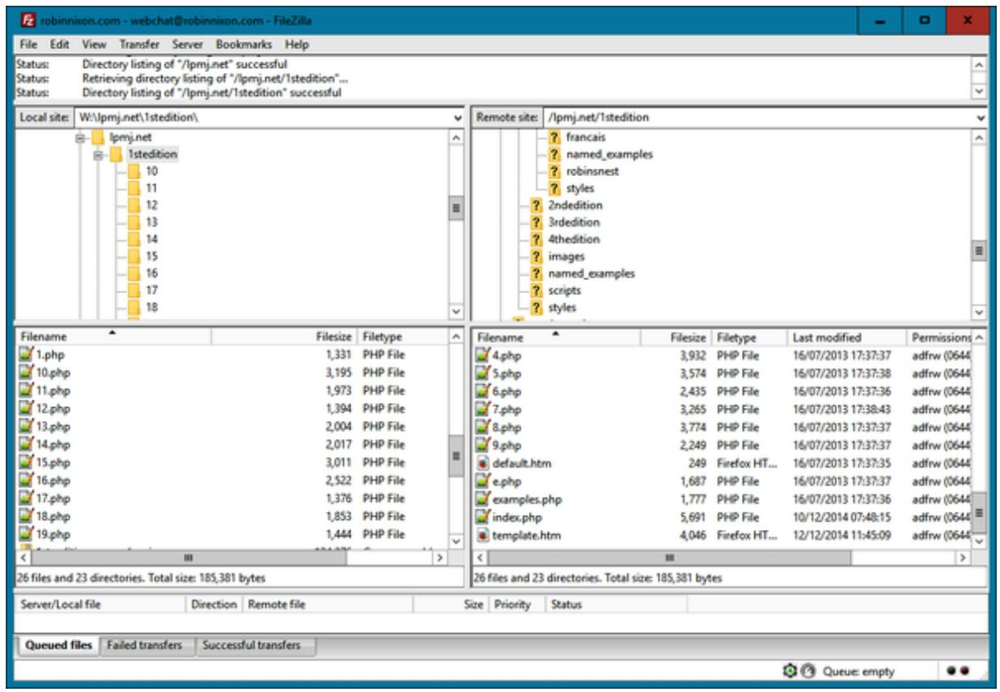

<details>
<summary>text_image</summary>

robinnixon.com - webchat@robinnixon.com - FileZilla
File Edit View Transfer Server Bookmarks Help
Status: Directory listing of "/lpmj.net" successful
Status: Retrieving directory listing of "/lpmj.net/1stedition"...
Status: Directory listing of "/lpmj.net/1stedition" successful
Local site: W:\lpmj.net\1stedition\
1lpmj.net
1stedition
10
11
12
13
14
15
16
17
18
Remote site: /lpmj.net/1stedition
? français
? named_examples
? robinsnest
? styles
? 2ndedition
? 3rdedition
? 4thedition
? images
? named_examples
? scripts
? styles
Filename Filesize Filetype
1.php 1,331 PHP File
10.php 3,195 PHP File
11.php 1,973 PHP File
12.php 1,394 PHP File
13.php 2,004 PHP File
14.php 2,017 PHP File
15.php 3,011 PHP File
16.php 2,522 PHP File
17.php 1,376 PHP File
18.php 1,853 PHP File
19.php 1,444 PHP File
Filename Filesize Filetype Last modified Permissions
4.php 3,932 PHP File 16/07/2013 17:37:37 adfrw (0644)
5.php 3,574 PHP File 16/07/2013 17:37:38 adfrw (0644)
6.php 2,435 PHP File 16/07/2013 17:37:36 adfrw (0644)
7.php 3,265 PHP File 16/07/2013 17:38:43 adfrw (0644)
8.php 3,774 PHP File 16/07/2013 17:37:37 adfrw (0644)
9.php 2,249 PHP File 16/07/2013 17:37:37 adfrw (0644)
default.htm 249 Firefox HT... 16/07/2013 17:37:35 adfrw (0644)
e.php 1,687 PHP File 16/07/2013 17:37:37 adfrw (0644)
examples.php 1,777 PHP File 16/07/2013 17:37:36 adfrw (0644)
index.php 5,691 PHP File 10/12/2014 07:48:15 adfrw (0644)
template.htm 4,046 Firefox HT... 12/12/2014 11:45:09 adfrw (0644)
26 files and 23 directories. Total size: 185,381 bytes
26 files and 23 directories. Total size: 185,381 bytes
Server/Local file Direction Remote file Size Priority Status
Queued files Failed transfers Successful transfers
Queue: empty
</details>

Figure 2-10. FileZilla is a full-featured SFTP program

Another well-known tool is WinSCP which, despite its name, also supports SFTP and FTP. Of course, if you already have an FTPS or SFTP program, all the better—stick with what you know.

## Using a Code Editor

Although a plain-text editor works for editing HTML, PHP, and JavaScript, there have been some tremendous improvements in dedicated code editors, which now incorporate very handy features such as colored syntax highlighting. Today’s program editors are smart and can show your syntax errors before you even run a program. Once you’ve used a modern editor, you’ll wonder how you ever managed without one.

There are a number of good programs available, but I have settled on Visual Studio Code (VSC) from Microsoft because it’s powerful; runs on all of Windows, Mac, and Linux; and is free (see Figure 2-11). It is also a comprehensive developing environment and is becoming ever more standard in the industry.

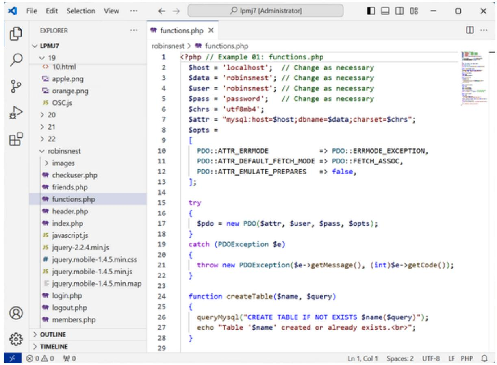

<details>
<summary>text_image</summary>

EXPLORER
✓ LPMU7
✓ 19
<> 10.html
apple.png
orange.png
JS OSC.js
> 20
> 21
> 22
✓ robinsnest
> images
checkuser.php
friends.php
functions.php
header.php
index.php
js javascript.js
js jquery-2.2.4.min.js
jquery.mobile-1.4.5.min.css
jquery.mobile-1.4.5.min.js
jquery.mobile-1.4.5.min.map
login.php
logout.php
members.php
> OUTLINE
> TIMELINE
robinsnest > functions.php
<?php // Example 01: functions.php
$host = 'localhost'; // Change as necessary
$data = 'robinsnest'; // Change as necessary
$user = 'robinsnest'; // Change as necessary
ENT= 'password'; // Change as necessary
$chrs = 'utf8mb4';
ATTR = "mysql:host=$host;dbname=$data;charset=$chrs";
$opts =
[
PDO::ATTR_ERRMODE => PDO::ERRMODE_EXCEPTION,
PDO::ATTR_DEFAULT_FETCH_MODE => PDO::FETCH_ASSOC,
PDO::ATTR_EMULATE_PREPARES => false,
];
try
{$pdo = new PDO($attr, $user, $pass, $opts);
}
catch (PDOException $e)
{
throw new PDOException($e->getMessage(), (int)$e->getCode());
}
function createTable($name, $query)
{
queryMysql("CREATE TABLE IF NOT EXISTS $name($query)");
echo "Table '$name' created or already exists.<br>";
}
Ln 1, Col 1 Spaces: 2 UTF-8 LF PHP
</details>

Figure 2-11. Program editors (like Visual Studio Code) are superior to plain-text editors

As you can see in Figure 2-11, VSC highlights the syntax appropriately, using colors to help clarify what’s going on. What’s more, you can place the cursor next to brackets or braces, and it will highlight the matching ones so that you can check whether you have too many or too few. In fact, VSC does a lot more in addition, which you will discover and enjoy as you use it. You can download a copy from the Visual Studio website.

Again, if you have a different preferred program editor, use that; it’s always a good idea to use programs you’re already familiar with. However, you will be hard pressed to find something better than the now industry standard

VSC, and you should know how to use this product as many job positions will require it.

Having reached the end of this chapter you will have everything set up and installed, ready to commence your journey into mastering the various development technologies in this book, beginning with a solid introduction to PHP in the following chapter. But before you go, take a couple of minutes to answer the following questions to ensure you have remembered the main points.

## Questions

1. What is the difference between a WAMP, a MAMP, and a LAMP?  
2. What is the purpose of an SFTP program?  
3. Name the main disadvantage of working on a remote web server.  
4. Why is it better to use a code editor instead of a plain-text editor?

See “Chapter 2 Answers” in the Appendix A for the answers to these questions.