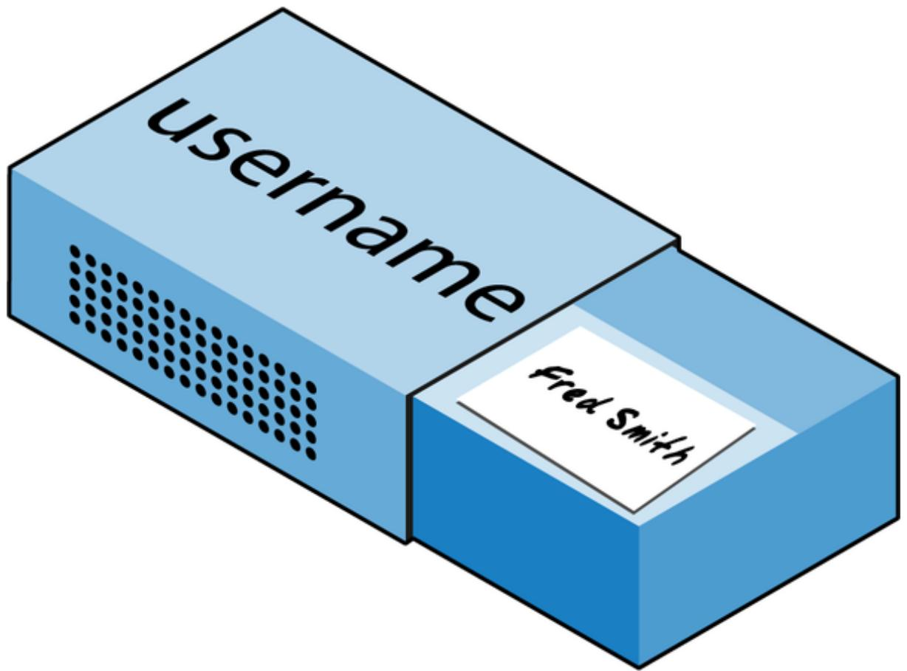

# Chapter 3. Introduction to PHP

In Chapter 1, I explained that PHP is the language you use to make the server generate dynamic output—output that is potentially different each time a browser requests a page. In this chapter, you’ll start learning this simple but powerful language; it will be the topic of the following chapters through Chapter 7.

In production, your web pages will be a combination of HTML, CSS, JavaScript, PHP, and SQL. Furthermore, each page can lead to other pages to provide users with ways to click through links and fill out forms.

We can avoid all that complexity while learning each language, though. Let’s focus, for now, on just writing PHP code and making sure that you get the output you expect—or at least that you understand the output you actually get!

## Incorporating PHP Within HTML

By default, PHP documents end with the extension .php. When a web server encounters this extension in a requested file, it automatically passes it to the PHP processor. Of course, web servers are highly configurable, and some web developers choose to force files ending with .htm or .html to also get parsed by the PHP processor, usually because they want to hide their use of PHP.

Your PHP program is responsible for passing back a clean file suitable for display in a web browser. At its very simplest, a PHP document will output only HTML. To prove this, you can take any normal HTML document and save it as a PHP document (for example, saving index.html as index.php), and it will display identically to the original (as long as the file is being served with Apache and not directly from your filesystem).

To trigger the PHP commands, you need to learn a new tag. Here is the first part:

```txt
<?php
```

The first thing you may notice is that the tag has not been closed. This is because entire sections of PHP can be placed inside this tag, and they finish only when the closing part is encountered, which looks like this:

```txt
?>
```

A small PHP “Hello World” program might look like Example 3-1.

Example 3-1. Invoking PHP

```php
<?php echo "Hello world";
?>
```

Use of this tag can be quite flexible. Some programmers open the tag at the start of a document and close it right at the end, outputting any HTML directly from PHP commands. Others, however, choose to insert only the smallest possible fragments of PHP within these tags wherever dynamic scripting is required, leaving the rest of the document in standard HTML.

The latter type of programmer generally argues that their style of coding results in faster code, while the former says that the speed increase is so minimal that it doesn’t justify the additional complexity of dropping in and out of PHP many times in a single document.

As you learn more, you will discover your preferred style of PHP development, but for the sake of making the examples in this book easier to follow, I have adopted the approach of keeping the number of transfers between PHP and HTML to a minimum—generally only once or twice in a document.

By the way, there is a slight variation to the PHP syntax. If you browse the internet for PHP examples, you may also encounter code where the opening and closing syntax looks like this:

```php
<? echo "Hello world";
?>
```

Although it’s not as obvious that the PHP parser is being called, this is a valid, alternative syntax that also works. But I discourage its use, as it is incompatible with XML and is now deprecated (meaning that it is no longer recommended and support could be removed in future versions).

**NOTE**

If you have only PHP code in a file, you may omit the closing ?>. This can be a good practice, as it will ensure that you have no excess whitespace leaking from your PHP files. It is especially important when you’re writing and including object-oriented code; otherwise, a trailing newline character inserted after the closing part may be sent to the browser when it’s not expected.

## This Book’s Examples

To save you the time it would take to type them all in, you can find all the examples from this book in the repo at GitHub.

In addition to listing all the examples by chapter and example number, some of the examples may require explicit filenames, in which case copies of the example(s) are also saved using the filename(s) in the same folder (such as the upcoming Example 3-4, which should be saved as test1.php).

## The Structure of PHP

We’re going to cover a lot of ground in this section, and I recommend that you work your way through it carefully, as it lays the foundation for everything else in this book. As always, there are some useful questions at the end of the chapter that you can use to test how much you’ve learned.

### Using Comments

There are two ways to add comments to your PHP code. The first turns a single line into a comment by preceding it with a pair of forward slashes:

// This is a comment

This version of the comment feature is a great way to temporarily remove a line of code from a program that is giving you errors. For example, you could use such a comment to hide a debugging line of code until you need it, like this:

// echo "X equals \$x";

You can also use this type of comment directly after a line of code to describe its action, like this:

\$ x + = 1 0;

**SINGLE-LINE # COMMENTS**

As well as using // to signify the start of a single-line comment, you can use the # symbol. However, this is less common and, as of PHP version 8, single-line comments starting with #[ now have a special meaning (being treated as attributes). Consequently I prefer to stick with the // style.

When you need to use multiple lines, there’s a second type of comment, which looks like Example 3-2.

```php
<?php
/* This is a section of multiline comments which will not be interpreted */
?>
```

You can use the $/ { \star }$ and $^ { \star } /$ pairs of characters to open and close comments almost anywhere you like inside your code. Most programmers use this construct to temporarily comment out entire sections of code that do not work or that, for one reason or another, they do not wish to be interpreted.

**WARNING**

A common error is to use /\* and \*/ to comment out a large section of code that already contains a commented-out section that uses those characters. You can’t nest comments this way; the PHP interpreter won’t know where a comment ends and will display an error message. However, if you use an editor or IDE with syntax highlighting, this type of error is easier to spot.

### Basic Syntax

PHP is quite a simple language with roots in C and Perl (if you have ever come across these), yet it looks more like Java. It is also very flexible, but you need to learn a few rules about its syntax and structure.

**Semicolons**

You may have noticed in the previous examples that the PHP commands ended with a semicolon, like this:

```txt
$x += 10;
```

One of  the most common causes of errors you will encounter with PHP is forgetting this semicolon. This causes PHP to treat multiple statements like one statement, which it is unable to understand, prompting it to produce a Parse error message.

**The \$ symbol**

The \$ symbol is used in many different ways by different programming languages. For example, in the BASIC language, it was used to terminate variable names to denote them as strings.

In PHP, however, you must place a \$ in front of all variables. This is required to make the PHP parser faster, as it instantly knows whenever it comes across a variable. Whether your variables are numbers, strings, or arrays, they should all look something like those in Example 3-3.

Example 3-3. Three different types of variable assignment

```perl
$mycounter = 1;
$mystring = "Hello";
$myarray = array("One", "Two", "Three");
```

That’s pretty much all the syntax you have to remember. Unlike languages such as Python, which are very strict about how you indent and lay out your code, PHP leaves you completely free to use (or not use) all the indenting and spacing you like. In fact, sensible use of whitespace is generally encouraged (along with comprehensive commenting) to help you understand your code when you come back to it. It also helps other programmers when they have to maintain your code.

### Variables

A simple metaphor will help you understand what PHP variables are all about. Just think of them as little (or big) matchboxes! That’s right— matchboxes that you’ve painted over and written names on.

**String variables**

Imagine you have a matchbox on which you have written the word username. You then write Fred Smith on a piece of paper and place it into the box (see Figure 3-1). That’s the same process as assigning a string value to a variable, like this:

```perl
$username = "Fred Smith";
```

The quotation marks indicate that “Fred Smith” is a string of characters. You must enclose each string in either quotation marks or apostrophes (single quotes), although there is a subtle difference between the two types of quote, as explained later. When you want to see what’s in the box, you open it, take out the piece of paper, and read it. In PHP, doing so looks like this (which displays the contents of the variable):

```txt
echo $username;
```

Or you can assign it to another variable (photocopy the paper and place the copy in another matchbox), like this:

$current_user = $username;$



<details>
<summary>text_image</summary>

username
fred Smith
</details>

Figure 3-1. You can think of variables as matchboxes containing items

Let’s bring all these variables together to form a complete program, as in Example 3-4.

Example 3-4. Your first PHP program

```php
<?php // test1.php
    $username = "Fred Smith";
    echo $username;
    echo "<br>";
    $current_user = $username;
    echo $current_user;
?>
```

Now you can call it up by entering the following into your browser’s address bar:

http://localhost/test1.php

**NOTE**

In the unlikely event that during the installation of your web server (as detailed in Chapter 2) you changed the port assigned to the server to anything other than 80, then you must place that port number within the URL in this and all other examples in this book. So, for example, if you changed the port to 8080, the preceding URL would become this:

http://localhost:8080/test1.php

I won’t mention this again, so just remember to use the port number (if required) when trying examples or writing your own code.

The result of running this code should be two occurrences of the name Fred Smith: the first is the result of the echo \$username command and the second is the result of the echo \$current\_user command.

**Numeric variables**

Variables don’t have to contain just strings—they also can contain numbers. If we return to the matchbox analogy, to store the number 17 in the variable \$count, the equivalent would be placing, say, 17 beads in a matchbox on which you have written the word count:

```txt
$count = 17;
```

You could also use a floating-point number (containing a decimal point). The syntax is the same:

```txt
$count = 17.5;
```

If you want to use the number in PHP, you can assign the value of \$count to another variable or perhaps just echo it to the web browser. Either of those would be the equivalent to opening the matchbox and counting the beads.

**Arrays**

You can think of arrays as several matchboxes glued together. For example, say we want to store the player names for a five-person soccer team in an array called \$team. To do this, we could glue five matchboxes side by side and write the names of all the players on separate pieces of paper, placing one in each matchbox.

Across the top of the whole matchbox assembly we would write the word team (see Figure 3-2). The equivalent of this in PHP would be:

```javascript
$team = array('Bill', 'Mary', 'Mike', 'Chris', 'Anne');
```


<details>
<summary>text_image</summary>

team
</details>

Figure 3-2. An array is like several matchboxes glued together

This syntax is more complicated than the examples you’ve seen so far. The array-building code consists of the following construct:

array();

with five strings inside. Each string is enclosed in apostrophes or quotes, and strings must be separated with commas.

**SHORT ARRAY SYNTAX**

An alternative short array syntax uses [...] instead of the array(...) construct. The previous array could also be written as:

```txt
$team = ['Bill', 'Mary', 'Mike', 'Chris', 'Anne'];
```

If we then wanted to know who player 4 is, we could use this command:

echo \$team[3];

The reason the previous statement has the number 3, not 4, is that the first element of a PHP array is actually the zeroth element, so the player numbers will therefore be 0 through 4.

**Two-dimensional arrays**

There’s a lot more you can do with arrays. For example, instead of being single-dimensional lines of matchboxes, they can be two-dimensional matrixes or have even more dimensions.

As an example of a two-dimensional array, say we want to keep track of a game of tic-tac-toe, which requires a data structure of nine cells arranged in a 3 × 3 square. To represent this with matchboxes, imagine nine of them glued to one another in a matrix of three rows by three columns  using an array named \$oxo (see Figure 3-3).


<details>
<summary>natural_image</summary>

Illustration of stacked blue server racks with 'O' and 'X' symbols, representing data storage or system architecture (no text or labels)
</details>

Figure 3-3. A multidimensional array simulated with matchboxes

You can now place a piece of paper with either an x or an o on it in the correct matchbox for each move played. To do this in PHP code, you have to set up an array containing three more arrays, as in Example 3-5, in which the array is set up with a game already in progress.

Example 3-5. Defining a two-dimensional array  
```php
<?php
$oxo = array(array('x', ' ', 'o'),
    array('o', 'o', 'x'),
    array('x', 'o', ''));
?>
```

Once again, we’ve moved up a step in complexity, but it’s easy to understand if you grasp the basic array syntax. There are three array() constructs nested inside the outer array() construct. We’ve filled each row with an array consisting of just one character: an x, an o, or a blank space. (We use a blank space so that all the cells will be the same width when they are displayed.)

To then return the third element in the second row of this array, you would use the following PHP command, which will display an x:

echo \$oxo[1][2];

**NOTE**

Remember that array indexes (pointers at elements within an array) start from zero, not one, so the [1] in the previous command refers to the second of the three arrays, and the [2] references the third position within that array. This command will return the contents of the matchbox three along and two down.

As mentioned, we can support arrays with even more dimensions by simply creating more arrays within arrays. However, we will not be covering arrays of more than two dimensions in this book.

And don’t worry if you’re still having difficulty coming to grips with using arrays, as the subject is explained in detail in Chapter 6.

**Variable-naming rules**

When creating PHP variables, you must follow these four rules:

Variable names, after the dollar sign, must start with a letter of the alphabet or the \_ (underscore) character.  
Variable names can contain only the characters a–z, A–Z, 0–9, and \_ (underscore).

Variable names may not contain spaces. If a variable name must comprise more than one word, separate the words with the \_ (underscore) character (e.g., \$user\_name).  
Variable names are case-sensitive. The variable \$High\_Score is not the same as the variable \$high\_score.

**NOTE**

To allow extended ASCII characters that include accents, PHP also supports the bytes from 127 through 255 in variable names as well as Unicode characters. However, be aware that programmers using English keyboards will have difficulty accessing any you use.

### Operators

Operators let you specify mathematical operations to perform, such as addition, subtraction, multiplication, and division. But several other types of operators also exist, such as the string, comparison, and logical operators. Math in PHP looks a lot like plain arithmetic—for instance, the following statement outputs 8:

echo 6 + 2;

Before moving on to learn what PHP can do for you, let’s take a moment to examine the various operators it provides.

**Arithmetic operators**

Arithmetic operators do what you would expect—they are used to perform mathematics. You can use them for the main four operations (add, subtract, multiply, and divide) as well as to find a modulus (the remainder after a division) and to increment or decrement a value (see Table 3-1).

Table 3-1. Arithmetic operators

<table><tr><td>Operator</td><td>Description</td><td>Example</td></tr><tr><td>+</td><td>Addition</td><td> $j + 1$ </td></tr><tr><td>-</td><td>Subtraction</td><td> $j - 6$ </td></tr><tr><td>*</td><td>Multiplication</td><td> $j * 11$ </td></tr><tr><td>/</td><td>Division</td><td> $j / 4$ </td></tr><tr><td>%</td><td>Modulus (the remainder after a division is performed)</td><td> $j \% 9$ </td></tr><tr><td>++</td><td>Increment</td><td> $++j$ </td></tr><tr><td>--</td><td>Decrement</td><td> $--j$ </td></tr><tr><td>**</td><td>Exponentiation (or power)</td><td> $j**2$ </td></tr></table>

**Assignment operators**

Assignment operators assign values to variables. They start with the very simple = and move on to +=, -=, and so on (see Table 3-2). The operator += adds the value on the right side to the variable on the left, instead of totally replacing the value on the left. Thus, if \$count starts with the value 5, the statement:

```txt
$count += 1;
```

sets \$count to 6, just like the more familiar assignment statement:

$count = count + 1;$

The /= and \*= operators are similar, but for division and multiplication, the .= operator concatenates variables, such that \$a .= "." will append a period to the end of \$a:

```perl
$a = "Hello";
$a .= "."; // Equivalent to writing $a = $a . ".";
echo $a; // The output is Hello.
```

The %= operator assigns the modulus:

```txt
\(number = 12;\)
\(number %= 10; // Equivalent to writing \(number = \(number % 10;\)
echo \(number; // Echoes 2, the remainder of 12 divided by 10.\)
```

Table 3-2. Assignment operators

<table><tr><td>Operator</td><td>Example</td><td>Equivalent to</td></tr><tr><td>=</td><td> $j = 15$ </td><td> $j = 15$ </td></tr><tr><td>+=</td><td> $j += 5$ </td><td> $j = j + 5$ </td></tr><tr><td>-=</td><td> $j -= 3$ </td><td> $j = j - 3$ </td></tr><tr><td>*=</td><td> $j *= 8$ </td><td> $j = j * 8$ </td></tr><tr><td>/=</td><td> $j /= 16$ </td><td> $j = j / 16$ </td></tr><tr><td>.=</td><td> $j .= k$ </td><td> $j = j . k$ </td></tr><tr><td>%=</td><td> $j %= 4$ </td><td> $j = j % 4$ </td></tr></table>

Comparison operators

Comparison operators are generally used inside a construct such as an if statement in which you need to compare two items. For example, you may wish to know whether a variable you have been incrementing has reached a specific value, or whether another variable is less than a set value, and so on (see Table 3-3).

Table 3-3. Comparison operators

<table><tr><td>Operator</td><td>Description</td><td>Example</td></tr><tr><td>==</td><td>Is equal to</td><td> $j == 4$ </td></tr><tr><td>!=</td><td>Is not equal to</td><td> $j != 21$ </td></tr><tr><td>&gt;</td><td>Is greater than</td><td> $j > 3$ </td></tr><tr><td>&lt;</td><td>Is less than</td><td> $j < 100$ </td></tr><tr><td>&gt;=</td><td>Is greater than or equal to</td><td> $j >= 15$ </td></tr><tr><td>&lt;=</td><td>Is less than or equal to</td><td> $j <= 8$ </td></tr><tr><td>&lt;&gt;</td><td>Is not equal to</td><td> $j <> 23$ </td></tr><tr><td>===</td><td>Is identical to</td><td> $j === "987"$ </td></tr><tr><td>!==</td><td>Is not identical to</td><td> $j !== "1.2e3"$ </td></tr></table>

Note the difference between = and ==. The first is an assignment operator, and the second is a comparison operator. Also remember that == compares the two values for being equivalent, while === requires them to be identical. Even advanced programmers can sometimes confuse the use of these when coding hurriedly, so be careful.

**Logical operators**

If you haven’t used them before, logical operators may at first seem a little daunting. But just think of them the way you would use logic in English. For example, you might say to yourself, “If the time is later than 12 p.m. and earlier than 2 p.m., have lunch.” In PHP, the code for this might look something like this (using military, twenty-four-hour time):

if ( $hour > 12 && hour < 14$ ) dolunch();

Here we have moved the set of instructions for actually going to lunch into a function that we will have to create later called dolunch.

As the previous example shows, you generally use a logical operator to combine the results of two of the comparison operators shown in “Comparison operators”. A logical operator can also be input to another logical operator: “If the time is later than 12 p.m. and earlier than 2 p.m., or if the smell of a roast is permeating the hallway and there are plates on the table.” As a rule, if something has a TRUE or FALSE value, it can be input to a logical operator. A logical operator takes two true or false inputs and produces a true or false result.

Table 3-4 shows the logical operators according to precedence, which is discussed in Chapter 4.

Table 3-4. Logical operators

<table><tr><td>Operator</td><td>Description</td><td>Example</td></tr><tr><td>&amp;&amp;</td><td>And</td><td> $j == 3$  &amp;&amp;  $k == 2$ </td></tr><tr><td>and</td><td>Low-precedence and</td><td> $j == 3$  and  $k == 2$ </td></tr><tr><td>||</td><td>Or</td><td> $j < 5$  ||  $j > 10$ </td></tr><tr><td>or</td><td>Low-precedence or</td><td> $j < 5$  or  $j > 10$ </td></tr><tr><td>!</td><td>Not</td><td>!( $j == k$ )</td></tr><tr><td>xor</td><td>Exclusive or</td><td> $j xor$   $k$ </td></tr></table>

Note that && is usually interchangeable with and; the same is true for || and or. However, because and and or have a lower precedence, you should avoid using them except when they are the only option, as in the following statement, which must use the or operator (|| cannot be used to force a second statement to execute if the first fails):

```txt
<html = file_get_contents($site) or die("Cannot download from $site");
```

**Operator precedence**

Operator precedence determines how particular expressions are grouped together. The concept is also used in common math as illustrated by the following statement:

```txt
5 + 2 * 3
```

The result is 11, because multiplication has a higher precedence than addition, so the result is computed as 2 multiplied by 3, which equals to 6,

plus 5. It can be rewritten as:

$$
5 + (2 * 3)
$$

The parentheses in this case are optional but they help to illustrate the precedence. In other cases, parentheses can be used to change or force precedence, for example the result of the following statement is 21:

$$
(5 + 2) * 3
$$

You’ll learn more about operator precedence in Chapter 4.

The most unusual of these operators is xor, which stands for exclusive or and returns a TRUE value if either value is TRUE but a FALSE value if both inputs are TRUE or both inputs are FALSE. To understand this, imagine that you want to concoct your own cleaner for household items. Ammonia makes a good cleaner and so does bleach, so you want your cleaner to have one of these. But the cleaner must not have both, because the combination is hazardous. In PHP, you could represent this as follows (using parentheses because xor has a lower precedence than =):

```txt
$ammonia = true;
$bleach = false;
$safe = ($ammonia xor $bleach);
echo $safe; // output 1 which is true
```

In this example, if either \$ammonia or \$bleach is TRUE, \$safe will also be set to TRUE. But if both are TRUE or both are FALSE, \$safe will be set to FALSE.

### Variable Assignment

The syntax to assign a value to a variable is always \$variable = value. Or, to reassign the value to another variable, it is \$other\_variable = \$variable, remembering to preface variable names with \$ symbols in PHP. There are a couple of other assignment operators that you will find useful. For example, we’ve already seen this:

$$
\$ x + = 10;
$$

which tells the PHP parser to add the value on the right (in this instance, the value 10) to the variable \$x. Likewise, we could subtract:

$$
\$ y - = 10;
$$

**Variable incrementing and decrementing**

Adding or subtracting 1 (known as incrementing and decrementing) is such a common operation that PHP provides special operators for it. You can use one of the following in place of the += and -= operators:

$$
^{++}x; \]\[ --y;
$$

In conjunction with a test (an if statement), you could use this code:

$$
\text { if } (+ + x = = 1 0) \text { echo } x;
$$

which tells PHP to first increment the value of \$x and then to test whether it has the value 10 and, if it does, to output its value. But you can also require PHP to increment (or, as in the following example, decrement) a variable after it has tested the value, like this:

$$
\text { if } (y - - = 0) \text { echo } y;
$$

which gives a subtly different result. Suppose \$y starts out as 0 before the statement is executed. The comparison will return a TRUE result, but \$y will be set to –1 after the comparison is made. So what will the echo statement display: 0 or –1? Try to guess, and then try out the statement in a PHP processor to confirm. Because this combination of statements is confusing, it should be taken as an educational example and not as a guide to good programming style.

In short, a variable is incremented or decremented before the test if the operator is placed before the variable, whereas the variable is incremented or decremented after the test if the operator is placed after the variable.

By the way, the correct answer to the previous question is that the echo statement will display the result –1, because \$y was decremented right after it was accessed in the if statement, and before the echo statement.

**String concatenation**

Concatenation is a somewhat arcane term for putting something after another thing. So, in PHP, string concatenation uses the period (.) to append one string of characters to another. The simplest way to do this is:

echo "You have " . \$msgs . 1 messages.";

Assuming that the variable \$msgs is set to the value 5, the output from this line of code will be:

You have 5 messages.

Just as you can add a value to a numeric variable with the += operator, you can append one string to another using .=, like this:

\$bulletin = "This is a test of the broadcast system.";

\$newsflash = "Houston, we have a problem.";

```txt
\(bulletin .= " " . \(newsflash; echo $bulletin;
```

In this case, if \$bulletin contains a news bulletin and \$newsflash has a news flash, the command appends the news flash to the news bulletin so that \$bulletin now comprises both strings of text.

**String types**

PHP supports two types of strings that are denoted by the type of quotation mark that you use. If you wish to assign a literal string, preserving the exact contents, you should use single quotation marks (apostrophes), like this:

$info = 'Preface variables with a $ like this: $variable';$

In this case, every character within the single-quoted string is assigned to \$info. If you had used double quotes, PHP would have attempted to evaluate \$variable as a variable.

On the other hand, when you want to include the value of a variable inside a string, you do so by using double-quoted strings. You can wrap the variable name in curly braces { and } to explicitly specify the end of the variable name:

```txt
echo "This week {$count} people have viewed your profile";
```

As you can see, this syntax also offers a simpler option to concatenation in which you don’t need to use a period, or close and reopen quotes, to append one string to another. This is called variable substitution or variable interpolation, and some programmers use it extensively, whereas others don’t use it at all.

**Escaping characters**

Sometimes a string needs to contain characters with special meanings that might be interpreted incorrectly. For example, the following line of code will not work, because the second quotation mark encountered in the word spelling’s will tell the PHP parser that the string’s end has been reached. Consequently, the rest of the line will be rejected as an error:

```txt
\$text = 'My spelling's atroshus'; // Erroneous syntax
```

To correct this, you can add a backslash directly before the offending quotation mark to tell PHP to treat the character literally and not to interpret it:

```javascript
\$text = 'My spelling\'s still atroshus';
```

And you can perform this trick in almost all situations in which PHP would otherwise return an error by trying to interpret a character. For example, the following double-quoted string will be correctly assigned:

```javascript
\$text = "She wrote upon it, \"Return to sender\".";
```

Additionally, you can use escape characters to insert various special characters into strings, such as tabs, newlines, and carriage returns. These are represented, as you might guess, by \t, \n, and \r. Here is an example using tabs to lay out a heading—it is included here merely to illustrate escapes, because in web pages there are always better ways to do layout:

```txt
$heading = "Date\tName\tPayment";
```

These special backslash-preceded characters work only in double-quoted strings. In single-quoted strings, the preceding string would be displayed with the ugly \t sequences instead of tabs. Within single-quoted strings, only the escaped apostrophe (\') and escaped backslash itself (\\) are recognized as escaped characters.

### Multiline Strings

There are times when you need to output quite a lot of text from PHP, and using several echo (or print) statements would be time-consuming and messy. To overcome this, PHP offers two conveniences. The first is just to put multiple lines between quotes, as in Example 3-6. Variables can also be assigned, as in Example 3-7.

Example 3-6. A multiline string  statement  
```php
<?php
    $author = "Steve Ballmer";

echo "Developers, developers, developers, developers, developers, developers, developers, developers, developers, developers!"
- $author.";
?>
```  
Example 3-7. A multiline string assignment

```php
<?php
    $author = "Bill Gates";
    $text = "Measuring programming progress by lines of code is like Measuring aircraft building progress by weight.
    - $author.";
?>
```

PHP also offers a multiline sequence using the <<< operator—commonly referred to as a here-document or heredoc—as a way of specifying a string literal, preserving the line breaks and other whitespace (including indentation) in the text. Its use can be seen in Example 3-8.

Example 3-8. Alternative multiline  statement  
```txt
<?php
```

$author = "Brian W. Kernighan";$ echo <<<_END Debugging is twice as hard as writing the code in the first place. Therefore, if you write the code as cleverly as possible, you are, by definition, not smart enough to debug it. - $author. _END; ?>

This code tells PHP to output everything between the two \_END tags as if it were a double-quoted string (except that quotes in a heredoc do not need to be escaped). This means it’s possible, for example, for a developer to write entire sections of HTML directly into PHP code and then just replace specific dynamic parts with PHP variables.

It is important to remember that the closing \_END; must appear right at the start of a new line, and it must be the only thing on that line—not even a comment is allowed to be added after it (nor even a single space). Once you have closed a multiline block, you are free to use the same tag name again.

**NOTE**

Remember: using the <<<\_END...\_END; heredoc construct, you don’t have to add \n linefeed characters to send a linefeed—just press Return and start a new line. Also, unlike in either a double-quote-delimited or single-quote-delimited string, you are free to use all the single and double quotes you like within a heredoc, without escaping them by preceding them with a backslash (\).

Example 3-9 shows how to use the same syntax to assign multiple lines to a variable.

Example 3-9. A multiline string variable assignment

```php
<?php
$author = "Scott Adams";
```

```php
$out = <<<_END
Normal people believe that if it ain't broke, don't fix it.
Engineers believe that if it ain't broke, it doesn't have enough features yet.

- $author.
_END;
echo $out;
?>
```

The variable \$out will then be populated with the contents between the two tags. If you were appending, rather than assigning, you also could have used .= in place of = to append the string to \$out.

Be careful not to place a semicolon directly after the first occurrence of \_END, as that would terminate the multiline block before it had even started and cause a Parse error message.

By the way, the \_END tag is simply one I chose for these examples because it is unlikely to be used anywhere else in PHP code and is therefore unique. You can use any tag you like, such as \_SECTION1 or \_OUTPUT and so on. Also, to help differentiate tags such as this from variables or functions, the general practice is to preface them with an underscore.

**Using a nowdoc**

If you wish to prevent PHP from parsing any variables encountered within a heredoc, you can use a nowdoc instead. It works in almost the same way, except that the name you choose for your end tag should be enclosed in single quotes at the start of the nowdoc, as in Example 3-10, where the difference between it and Example 3-9 is shown in bold.

Example 3-10. A nowdoc multiline assignment  
```php
<?php
    $author = "Scott Adams";
$out = <<<'_END'
Normal people believe that if it ain't broke, don't fix it.
Engineers believe that if it ain't broke, it doesn't have enough features yet.
```

```txt
- $author.
_END;
echo $out;
?>
```

In this instance \$author will not be replaced with the string Scott Adams and will simply remain displayed as \$author.

**NOTE**

Laying out text over multiple lines is usually just a convenience to make your PHP code easier to read, because once it is displayed in a web page, HTML formatting rules take over and whitespace is suppressed (but in a heredoc, \$author in our example will still be replaced with the variable’s value, unlike in a nowdoc).

So, for example, if you load these multiline output examples into a browser, they will not display over several lines, because all browsers treat newlines just like spaces. However, if you use the browser’s View Source feature, you will find that the newlines are correctly placed and that PHP preserved the line breaks.

### Variable Typing

PHP is a loosely typed language. This means variables do not have to be declared before they are used and PHP always converts variables to the type required by their context when they are accessed.

For example, you can create a multiple-digit number and extract the nth digit from it simply by assuming it to be a string. In Example 3-11, the numbers 12345 and 67890 are multiplied together, returning a result of 838102050, which is then placed in the variable \$number.

Example 3-11. Automatic conversion from a number to a string

```php
<?php
    $number = 12345 * 67890;
    echo substr($number, 3, 1);
?>
```

At the point of the assignment, \$number is a numeric variable. But on the second line, a call is placed to the PHP function substr, which asks for one character to be returned from \$number, starting at the fourth position (remember that PHP offsets start from zero). To do this, PHP turns \$number into a nine-character string so that substr can access it and return the character, which in this case is 1.

The same goes for turning a string into a number, and so on. In Example 3- 12, the variable \$pi is set to a string value, which is then automatically turned into a floating-point number in the third line by the equation for calculating a circle’s area, which outputs the value 78.5398175.

Example 3-12. Automatically converting a string to a number

```php
<?php
$pi = "3.1415927";
$radius = 5;
echo $pi * ($radius * $radius);
?>
```

In practice, what this means is that you don’t have to worry too much about your variable types, although it is possible for type declarations to be added to function arguments, return values, and (as of PHP 7.4.0) class properties, ensuring that the value is of the specified type at call time; otherwise, a TypeError is thrown.

Assuming type declarations are not being used, just assign them values that make sense to you, and PHP will convert them if necessary. Then, when you want to retrieve values, just ask for them—for example, with an echo statement, but do remember that sometimes automatic conversions do not operate quite as you might expect.

If type declarations are being used to make the code behave more predictably, you can change the type of the variable by prefixing it with the chosen type in parentheses, like this:

```perl
$string = (string)$number;
#number = (int)$string;
$boolean = (bool)$integer;
```

Sometimes, it may not be clear at the first sight how the type conversion (sometimes called type casting) will go and what will be the result. The PHP manual has all the  conversion rules nicely documented.

### Constants

Constants are similar to variables, holding information to be accessed later, except that they are what they sound like—constant. In other words, once you have defined a constant, its value is set for the remainder of the program and cannot be altered.

For example, you can use a constant to hold the location of your server root (the folder with the main files of your website). You would define such a constant like this:

```javascript
define("ROOT_LOCATION", "/usr/local/www/");
```

Then, to read the contents of the variable, you just refer to it like a regular variable (but it isn’t preceded by a dollar sign):

```javascript
$directory = ROOT_LOCATION;
```

Now, whenever you need to run your PHP code on a different server with a different folder configuration, you have only a single line of code to change.

**NOTE**

The two things you have to remember about constants are that they must not be prefaced with a \$ (unlike regular variables) and that you can define them only using the define function.

It is standard practice to use only uppercase letters for constant variable names, especially if other people will also read your code.

### Predefined Constants

PHP comes ready-made with dozens of predefined constants that you won’t generally use as a beginner. However, there are a few—known as the magic constants—that you will find useful. The names of the magic constants always have two underscores at the beginning and two at the end so that you won’t accidentally try to name one of your own constants with a name that is already taken. These are detailed in Table 3-5. The concepts referred to in the table will be introduced in future chapters.

Table 3-5. PHP’s magic constants

<table><tr><td>Magic constant</td><td>Description</td></tr><tr><td>__LINE__</td><td>The current line number of the file.</td></tr><tr><td>__FILE__</td><td>The full path and filename of the file. If used inside an i nclude, the name of the included file is returned. Some operating systems allow aliases for directories, called symbolic links; in __FILE__ these are always changed to the actual directories.</td></tr><tr><td>__DIR__</td><td>The directory of the file. If used inside an include, the directory of the included file is returned. This is equivalent to dirname(__FILE__). This directory name does not have a trailing slash unless it is the root directory.</td></tr><tr><td>__FUNCTION__</td><td>The function name. Returns the function name as it was declared (case-sensitive).</td></tr><tr><td>__CLASS__</td><td>The class name. Returns the class name as it was declared (case-sensitive).</td></tr><tr><td>__METHOD__</td><td>The class method name. The method name is returned as it was declared (case-sensitive).</td></tr><tr><td>__NAMESPACE__</td><td>The name of the current namespace. This constant is defined at compile time (case-sensitive).</td></tr></table>

One handy use of these variables is for debugging, when you need to insert a line of code to see whether the program flow reaches it:

echo "This is line . \_\_LINE\_\_ . " of file " . \_\_FILE\_\_;

This prints the current program line in the current file (including the path) to the web browser.

### The Difference Between the echo and print Commands

So far, you have seen the echo command used in a number of ways to output text from the server to your browser. In some cases, a string literal has been output. In others, strings have first been concatenated or variables have been evaluated. I’ve also shown output spread over multiple lines.

But there is an alternative to echo: print. The two commands are quite similar, but print is a function-like construct that takes a single parameter and has a return value (which is always 1), whereas echo is purely a PHP language construct. Since both commands are constructs, neither requires parentheses.

By and large, the echo command will be a tad faster than print, because it doesn’t set a return value. On the other hand, because it isn’t implemented like a function, echo cannot be used as part of a more complex expression, whereas print can. Here’s an example to output whether the value of a variable is TRUE or FALSE using print—something you could not perform in the same manner with echo, because it would display a Parse error message as the ternary operator expects an expression that returns a value and while for example echo "TRUE" doesn’t, print "TRUE" returns 1:

\$b ? print "TRUE" : print "FALSE";

The question mark is simply a way of interrogating whether variable \$b is TRUE or FALSE. Whichever command is on the left of the following colon is executed if \$b is TRUE, whereas the command to the right of the colon is executed if \$b is FALSE.

Generally, though, the examples in this book use echo, and I recommend that you do so as well until you reach the point in your PHP development that you discover the need for using print.

### Functions

Functions separate out and encapsulate sections of code that perform a particular task more than once. For example, maybe you often need to look up a date and return it in a certain format. That would be a good example to turn into a function. The code doing it might be only three lines long, but if you have to paste it into your program a dozen times, you’re making your program unnecessarily large and complex if you don’t use a function. And if you decide to change the date format later, putting it in a function means having to change it in only one place.

Placing code into a function not only shortens your program and makes it more readable but also adds extra functionality (pun intended), because functions can be passed parameters to make them perform differently. They can also return values to the calling code.

To create a function, declare it as shown in Example 3-13.

Example 3-13. A simple function declaration

```php
<?php
function longdate($timestamp)
{
    return date("l F jS Y", $timestamp);
}
?>
```

This function returns a date in the format Sunday May 2nd 2027. Any number of parameters can be passed between the initial parentheses; we have chosen to accept just one. The curly braces enclose all the code that is executed when you later call the function. Note that the first letter within the date function call in this example is a lowercase letter L, not to be confused with the number 1.

To output today’s date using this function, place the following call in your code:

echo longdate(time());

If you need to print out the date 17 days ago, you now just have to issue this call:

echo longdate(time() - 17 \* 24 \* 60 \* 60);

which passes to longdate the current time less the number of seconds since 17 days ago (17 days × 24 hours × 60 minutes × 60 seconds).

Functions can also accept multiple parameters and return multiple results, using techniques that I’ll introduce over the following chapters.

### Variable Scope

If you have a very long program, it’s possible that you could start to run out of good variable names, but with PHP you can decide the scope of a variable. In other words, you can, for example, tell it that you want the variable \$temp to be used only inside a particular function and to forget it was ever used when the function returns. In fact, this is the default scope for PHP variables.

Alternatively, you could inform PHP that a variable is global in scope and thus can be accessed by every other part of your program.

**Local variables**

Local variables are variables that are created within, and can be accessed only by, a function. They are generally temporary variables used to store partially processed results prior to the function’s return.

One set of local variables is the list of arguments to a function. In “Functions”, we defined a function that accepted a parameter named \$timestamp. This is meaningful only in the body of the function; you can’t get or set its value outside the function.

For another example of a local variable, take another look at the longdate function, which is modified slightly in Example 3-14.

Example 3-14. An expanded version of the  function  
```php
<?php
function longdate($timestamp)
{
    $temp = date("l F jS Y", $timestamp);
    return "The date is $temp";
}
?>
```

Here we have assigned the value returned by the date function to the temporary variable \$temp, which is then inserted into the string returned by the function. As soon as the function returns, the \$temp variable and its contents disappear, as if they had never been used at all.

To see the effects of variable scope making an outside variable invisible inside a function, let’s look at some similar code in Example 3-15. Here \$temp has been created before we call the longdate function.

Example 3-15. This attempt to access  in function  will fail  
```php
<?php
$temp = "The date is ";
echo longdate(time());
function longdate($timestamp)
{
    return $temp . date("l F jS Y", $timestamp);
}
?>
```

However, because \$temp was neither created within the longdate function nor passed to it as a parameter, longdate cannot access it. Therefore, this code snippet outputs only the date, not the preceding text. In fact, depending on how PHP is configured, it may first display the error message

Notice: Undefined variable: temp, something you don’t want your users to see. The reason for this is, by default, variables created within a function are local to that function, and variables created outside of any functions can be accessed only by nonfunction code.

Some ways to repair Example 3-15 appear in Examples 3-16 and 3-17.

Example 3-16. Rewriting to refer to  within its local scope fixes the problem

```php
<?php
$temp = "The date is ";
echo $temp . longdate(time());
function longdate($timestamp)
{
    return date("l F jS Y", $timestamp);
}
?>
```

Example 3-16 moves the reference to \$temp out of the function. The reference appears in the same scope where the variable was defined.

Example 3-17. An alternative solution: passing  as an argument

```php
<?php
$temp = "The date is ";
echo longdate($temp, time());
function longdate($text, $timestamp)
{
    return $text . date("l F jS Y", $timestamp);
}
?>
```

The solution in Example 3-17 passes \$temp to the longdate function as an extra argument. longdate reads it into a temporary variable that it creates called \$text and outputs the desired result.

**NOTE**

Forgetting the scope of a variable is a common programming error, so remembering how variable scope works will help you debug some quite obscure problems. Suffice it to say that unless you have declared a variable otherwise, its scope is limited to being local: either to the current function or to the code outside of any functions, depending on whether it was first created or accessed inside or outside a function.

**Global variables**

In some cases you need a variable to have global scope, because you want all your code to be able to access it. Also, some data may be large and complex, and you don’t want to keep passing it as arguments to functions.

To access variables from global scope, add the keyword global. Let’s assume that you have a way of logging your users in to your website and want all your code to know whether it is interacting with a logged-in user or a guest. One way to do this is to use the global keyword before a variable, such as \$IS\_LOGGED\_IN:

global \$IS\_LOGGED\_IN;

Now your login function simply has to set that variable to 1 upon a successful login attempt or 0 upon failure. Because the scope of the variable is set to global, every line of code in your program can access it.

You should use variables given global access with caution, though. I recommend that you create them only when you absolutely cannot find another way of achieving the result you desire. In general, programs that are broken into small parts and segregated data are less buggy and easier to maintain. If you have a thousand-line program (and some day you will) in which you discover that a global variable has the wrong value, how long will it take you to find the code that set it incorrectly?

Also, if you have too many variables with global scope, you run the risk of using one of those names again locally, or at least thinking you have used it locally, when in fact it has already been declared as global. All manner of strange bugs can arise from such situations.

**NOTE**

I generally adopt the convention of making all variable names that require global access uppercase (just as it’s recommended that constants should be uppercase, except constants are not prefixed with \$) so that I can see at a glance the scope of a variable.

**Static variables**

In “Local variables”, I mentioned that the value of a local variable is wiped out when the function ends. If a function runs many times, it starts with a fresh copy of the variable, and the previous setting has no effect.

Here’s an interesting case. What if you have a local variable inside a function that you don’t want any other parts of your code to have access to, but you would also like to keep its value for the next time the function is called? Why? Perhaps because you want a counter to track how many times a function is called. The solution is to declare a static variable, as shown in Example 3-18.

Example 3-18. A function using a static variable

```php
<?php
function test()
{
    static $count = 0;
    echo $count;
    $count++;
}
?>
```

Here, the very first line of the function test creates a static variable called \$count and initializes it to a value of 0. The next line outputs the variable’s value; the final one increments it.

The next time the function is called, because \$count has already been declared, the first line of the function is skipped. Then the previously incremented value of \$count is displayed before the variable is again incremented.

If you plan to use static variables, you should note that you cannot assign the result of an expression in their definitions. They can be initialized only with predetermined values (see Example 3-19). Generally, however, like global variables, static variables make functions less deterministic, meaning that the function can have a different output given the same input, and they are best avoided in preference for functions with no side effects like changing a static variable.

Example 3-19. Allowed and disallowed static variable declarations  
```php
<?php
static $int = 0; // Allowed
static $int = 1 + 2; // Correct (as of PHP 5.6)
static $int = sqrt(144); // Disallowed
?>
```

**Superglobal variables**

Several predefined variables are also available. These are known as superglobal variables, which means they are provided by the PHP environment but are global within the program, accessible absolutely everywhere.

These superglobals contain lots of useful information about the currently running program and its environment (see Table 3-6). They are structured as associative arrays, a topic discussed in Chapter 6.

Table 3-6. PHP’s superglobal variables

<table><tr><td>Superglobal name</td><td>Contents</td></tr><tr><td>$GLOBALS</td><td>All variables that are currently defined in the global scope of the script. The variable names are the keys of the array.</td></tr><tr><td>$_SERVER</td><td>Information such as headers, paths, and locations of scripts. The entries in this array are created by the web server, and there is no guarantee that every web server will provide any or all of these.</td></tr><tr><td>$_GET</td><td>Variables passed to the current script via the HTTP GET method.</td></tr><tr><td>$_POST</td><td>Variables passed to the current script via the HTTP POST method.</td></tr><tr><td>$_FILES</td><td>Items uploaded to the current script via the HTTP POST method.</td></tr><tr><td>$_COOKIE</td><td>Variables passed to the current script via HTTP cookies.</td></tr><tr><td>$_SESSION</td><td>Session variables available to the current script.</td></tr><tr><td>$_REQUEST</td><td>Contents of information passed from the browser; by default, $_GET, $_POST, and $_COOKIE.</td></tr><tr><td>$_ENV</td><td>Variables passed to the current script via the environment method.</td></tr></table>

All of the superglobals (except for \$GLOBALS) are named with a single initial underscore and only capital letters; therefore, you should avoid naming your own variables in this manner to avoid potential confusion.

To illustrate how you use them, let’s look at a common example. Among the many nuggets of information supplied by superglobal variables is the URL of the page that referred the user to the current web page. This referring page information can be accessed like this:

```txt
$came_from = $_SERVER['HTTP_REFERER'];
```

It’s that simple. Oh, and if the user came straight to your web page, such as by typing its URL directly into a browser, \$came\_from will be set to an empty string.

**DIFFERENCE BETWEEN SUPERGLOBALS AND CONSTANTS**

Superglobals are regular variables that have the full scope of a program during runtime, are visible and usable everywhere, whereas constants, while also visible inside functions, have no scope whatsoever, because they are accessed early on at compile time and “baked” as fixed values into the runtime code before any scope is created.

**Superglobals and security**

A word of caution is in order before you start using superglobal variables, because they are often used by hackers trying to find exploits to break into your website. What they do is load up \$\_POST, \$\_GET, or other superglobals with malicious code, such as Unix or MySQL commands that can damage or display sensitive data if you naively access them.

Therefore, you should always sanitize superglobals before using them. One way to do this is via the PHP htmlentities function, which converts all characters into HTML entities. For example, less-than and greater-than characters (< and >) are transformed into the strings &lt; and &gt; so that they are rendered harmless, as are all quotes and backslashes, and so on.

Therefore, a much better way to access \$\_SERVER (and other superglobals) is:

```txt
$came_from = htmlentities($_SERVER['HTTP_REFERER']);
```

**WARNING**

Using the htmlentities function for sanitizing is an important practice in any circumstance where user or other third-party data is being processed for output, not just with superglobals.

This chapter has provided you with a solid introduction to using PHP. In Chapter 4, you’ll start using what you’ve learned to build expressions and control program flow—in other words, do some actual programming.

But before moving on, I recommend that you test yourself with some (if not all) of the following questions to ensure that you have fully digested the contents of this chapter.

## Questions

1. What tag is used to invoke PHP to start interpreting program code? And what is the short form of the tag?  
2. What are the two types of comment tags?  
3. Which character must be placed at the end of every PHP statement?  
4. Which symbol is used to preface all PHP variables?  
5. What can a variable store?  
6. What is the difference between \$variable = 1, \$variable == 1, and \$variable === 1?

7. Why is an underscore allowed in variable names (\$current\_user), whereas hyphens are not (\$current-user)?

8. Are variable names case-sensitive?

9. Can you use spaces in variable names?

10. How do you convert one variable type to another (say, a string to a number)?

11. What is the difference between ++\$j and \$j++?

12. Are the operators && and and interchangeable?

13. How can you create a multiline echo or assignment?

14. Can you redefine a constant?

15. How do you escape a quotation mark?

16. What is the difference between the echo and print commands?

17. What is the purpose of functions?

18. How can you make a variable accessible to all parts of a PHP program?

19. If you generate data within a function, what are a couple of ways to convey the data to the rest of the program?

20. What is the result of combining a string with a number?

See “Chapter 3 Answers” in the Appendix A for the answers to these questions.