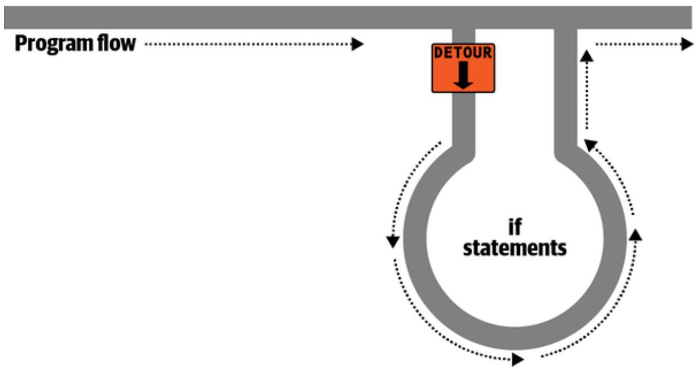
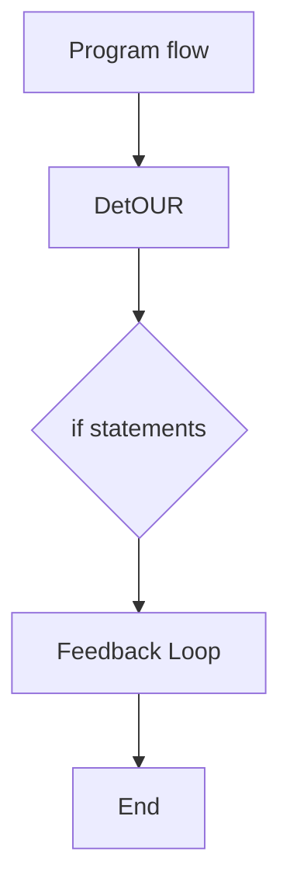
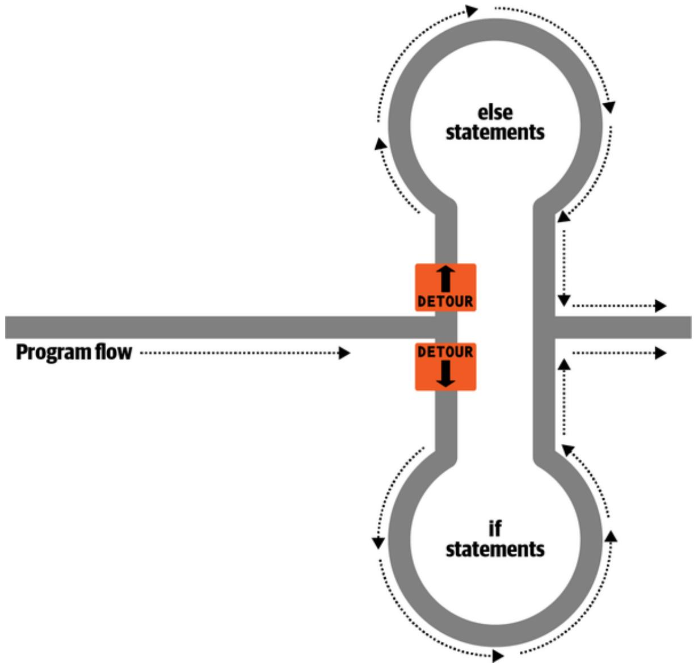
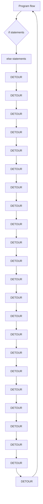
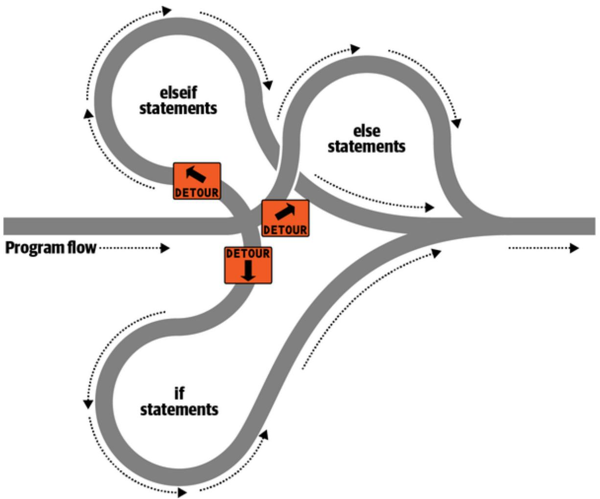
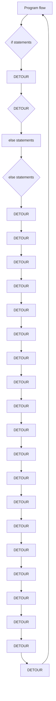
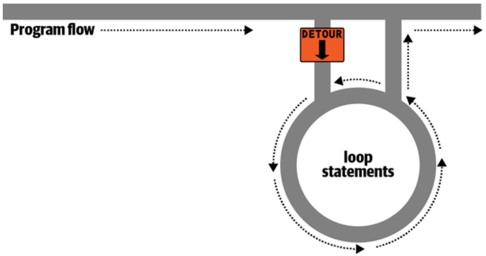
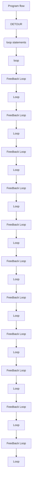

# Chapter 4. Expressions and Control Flow in PHP

Chapter 3 introduced several topics in passing that this chapter covers more fully, such as making choices (branching) and creating complex expressions. In Chapter 3, I wanted to focus on the most basic syntax and operations in PHP, but I couldn’t avoid touching on more advanced topics. Now I can fill in the background that you need to use these powerful PHP features properly.

In this chapter, you will get a thorough grounding in how PHP programming works in practice and how to control the flow of the program.

## Expressions

Let’s start with the most fundamental part of any programming language: expressions.

An expression is a combination of values, variables, operators, and functions that results in a value. It’s familiar to anyone who has studied algebra. Here’s an example:

$$
y = 3 (| 2 x | + 4)
$$

Which in PHP would be:

$$
\mathbf {y} = 3 * (\text { abs } (2 * \mathbf {x}) + 4);
$$

The value returned (y in this mathematical statement, or \$y in the PHP code) can be a number, a string, or a Boolean value (named after George Boole, a 19th-century English mathematician and philosopher). By now, you should be familiar with the first two value types, but I’ll explain the third.

### TRUE or FALSE?

A basic Boolean value can be either TRUE or FALSE. For example, the expression 20 > 9 (20 is greater than 9) is TRUE, and the expression 5 == 6 (5 is equal to 6) is FALSE. (You can combine such operations using other classic Boolean operators such as AND, OR, and XOR, which are covered later in this chapter.)

**NOTE**

Note that I am using uppercase letters for the names TRUE and FALSE. This is because they are predefined constants in PHP. You can use the lowercase versions if you prefer, as they are also predefined.

PHP doesn’t actually print the predefined constants if you ask it to do so as in Example 4-1. For each line, the example prints out a letter followed by a colon and a predefined constant. Only strings can be printed in PHP, and conversion rules have been defined for other types, like numbers or Boolean values. When converting to string, PHP arbitrarily assigns a string value of "1" to TRUE, so 1 is displayed after a: when the example runs. Even more mysteriously, the line starting with b: doesn’t print 0 as you may expect. That’s because during the conversion, FALSE is converted to an empty string "". The constant FALSE is different than NULL, another predefined constant that denotes nothing, even though both are converted to an empty string when printed.

Example 4-1. Outputting the values of  and

// test2.php

echo "a: [" . TRUE . "]<br>";

echo "b: [" . FALSE . "]<br>";

The <br> tags are there to create line breaks and thus separate the output into two lines in HTML. Here is the output:

```txt
a: [1]
b: []
```

Turning to Boolean expressions, Example 4-2 shows some simple expressions: the two I mentioned earlier, plus a couple more.

Example 4-2. Four simple Boolean expressions  
```txt
echo "a: [" . (20 > 9) . "]<br>";
echo "b: [" . (5 == 6) . "]<br>";
echo "c: [" . (1 == 0) . "]<br>";
echo "d: [" . (1 == 1) . "]<br>";
```

The output from this code is:

```yaml
a: [1]
b: []
c: []
d: [1]
```

By the way, in some languages FALSE may be defined as 0 or even –1, so it’s worth checking on its definition in each language you use. Luckily, you normally don’t have to worry about what TRUE and FALSE look like internally.

### Literals and Variables

These are the most basic elements of programming and the building blocks of expressions. A literal simply means something that evaluates to itself, such as the number 73 or the string "Hello". A variable, which as we’ve already seen has a name beginning with a dollar sign, evaluates to the value that has been assigned to it. The simplest expression is just a single literal or variable, because both return a value.

Example 4-3 shows two literals and two variables, all of which return values, albeit of different types.

Example 4-3. Literals and variables  
```txt
$myname = "Brian";
$myage = 37;
echo "a: " . 73 . "<br>"; // Numeric literal
echo "b: " . "Hello" . "<br>"; // String literal
echo "c: " . $myname . "<br>"; // String variable
echo "d: " . $myage . "<br>"; // Numeric variable
```

**ABOUT LITERALS AND NON-LITERALS**

The difference between a literal and a non-literal is that if you assign a literal to a variable, the variable will have the same value as the literal, even if you assign it repeatedly. However, if you assign a function output to a variable, for example, the function can have a different output each time it is called, making the variable content non-literal.

And, as you’d expect, you see a return value from all of these in the following output:

```txt
a: 73  
b: Hello  
c: Brian  
d: 37
```

In conjunction with operators, it’s possible to create more complex expressions that evaluate to useful results.

Programmers combine expressions with other language constructs, such as the assignment operators we saw earlier, to form statements. Example 4-4 shows two statements. The first assigns the result of the expression 366 - \$day\_number to the variable \$days\_to\_new\_year, and the second outputs a friendly message only if the expression \$days\_to\_new\_year < 30 evaluates to TRUE.

Example 4-4. An expression and a statement  
$days_to_new_year = 366 - day_number; // Expression$ if ( $days_to_new_year < 30$ )  
{ echo "Not long now till new year"; // Statement}

## Operators

PHP offers a lot of powerful operators of different types—arithmetic, string, logical, assignment, comparison, and more (see Table 4-1).

Table 4-1. PHP operator types

<table><tr><td>Operator</td><td>Description</td><td>Example</td></tr><tr><td>Arithmetic</td><td>Basic mathematics</td><td>$a + $b</td></tr><tr><td>Array</td><td>Array union</td><td>$a + $b</td></tr><tr><td>Assignment</td><td>Assign values</td><td>$a = $b + 23</td></tr><tr><td>Bitwise</td><td>Manipulate bits within bytes</td><td>12 ^ 9</td></tr><tr><td>Comparison</td><td>Compare two values</td><td>$a &lt; $b</td></tr><tr><td>Execution</td><td>Execute contents of backticks</td><td>`ls -al`</td></tr><tr><td>Increment/decrement</td><td>Add or subtract 1</td><td>$a++</td></tr><tr><td>Logical</td><td>Boolean</td><td>$a and $b</td></tr><tr><td>String</td><td>Concatenation</td><td>$a . $b</td></tr></table>

Each operator takes a different number of operands:

Unary operators, such as incrementing (\$a++) or negation (!\$a), take a single operand.  
Binary operators, which represent the bulk of PHP operators (including addition, subtraction, multiplication, and division), take two operands.  
The one ternary operator, which takes the form expr ? x : y, requires three operands. It’s a terse, single-line if statement that returns x if expr is TRUE and y if expr is FALSE.

**ABOUT EXECUTION OPERATORS**

Although the execution operators are powerful, you should avoid using them unless strictly necessary and you know precisely what you are doing, because you could potentially expose a massive vulnerability in your project.

### Operator Precedence

If all operators had the same precedence, they would be processed in the order in which they are encountered (from left to right in English). In fact, many operators do have the same precedence. Take a look at Example 4-5.

Example 4-5. Three equivalent expressions

$$
\begin{array}{l} 1 + 2 + 3 - 4 + 5 \quad / / 7 \\ 2 - 4 + 5 + 3 + 1 \quad / / 7 \\ 5 + 2 - 4 + 1 + 3 \quad / / 7 \\ \end{array}
$$

Here you will see that although the numbers (and their preceding operators) have been moved around, the result of each expression is the value 7, because the plus and minus operators have the same precedence. We can try the same thing with multiplication and division (see Example 4-6).

Example 4-6. Three expressions that are also equivalent

$$
\begin{array}{l} 1 * 2 * 3 / 4 * 5 \quad / / 7. 5 \\ 2 / 4 * 5 * 3 * 1 \quad / / 7. 5 \\ 5 * 2 / 4 * 1 * 3 \quad / / 7. 5 \\ \end{array}
$$

Here the resulting value is always 7.5. But things change when we mix operators with different precedences in an expression, as in Example 4-7.

Example 4-7. Three expressions using operators of mixed precedence

```diff
2 - 4 * 5 * 3 + 1 // Without precedence would be -29
5 + 2 - 4 + 1 * 3 // Without precedence would be 12
```

If there were no operator precedence, these three expressions would evaluate to 25, –29, and 12, respectively. But because multiplication and division take precedence over addition and subtraction, the expressions are evaluated as if there were parentheses around these parts of the expressions, just like mathematical notation (see Example 4-8).

Example 4-8. Three expressions showing implied parentheses  
```txt
1 + (2 * 3) - (4 * 5) // With precedence: -13
2 - (4 * 5 * 3) + 1 // With precedence: -57
5 + 2 - 4 + (1 * 3) // With precedence: 6
```

PHP evaluates the subexpressions within parentheses first to derive the semi-completed expressions in Example 4-9.

Example 4-9. After evaluating the subexpressions in parentheses  
```txt
1 + (6) - (20) // With precedence: -13
2 - (60) + 1 // With precedence: -57
5 + 2 - 4 + (3) // With precedence: 6
```

The final results of these expressions are –13, –57, and 6, respectively (quite different from the results of 25, –29, and 12 had there been no operator precedence).

Of course, you can override the default operator precedence by inserting your own parentheses and forcing whatever order you want (see Example 4- 10).

Example 4-10. Forcing left-to-right evaluation  
```txt
((1 + 2) * 3 - 4) * 5 // With forced precedence: 25
(2 - 4) * 5 * 3 + 1 // With forced precedence: -29
(5 + 2 - 4 + 1) * 3 // With forced precedence: 12
```

With parentheses correctly inserted, we now see the values 25, –29, and 12, respectively.

Table 4-2 lists PHP’s operators in order of precedence from high to low.

Table 4-2. Precedence of PHP operators (high to low)

<table><tr><td>Operator(s)</td><td>Type</td></tr><tr><td>()</td><td>Parentheses</td></tr><tr><td>++ --</td><td>Increment/decrement</td></tr><tr><td>!</td><td>Logical</td></tr><tr><td>* / %</td><td>Arithmetic</td></tr><tr><td>+ - .</td><td>Arithmetic and string</td></tr><tr><td>&lt;&lt; &gt;&gt;</td><td>Bitwise</td></tr><tr><td>&lt; &lt;= &gt; &gt;= &lt;&gt;</td><td>Comparison</td></tr><tr><td>== != === !==</td><td>Comparison</td></tr><tr><td>&amp;</td><td>Bitwise (and references)</td></tr><tr><td>^</td><td>Bitwise</td></tr><tr><td>|</td><td>Bitwise</td></tr><tr><td>&amp;&amp;</td><td>Logical</td></tr><tr><td>||</td><td>Logical</td></tr><tr><td>? :</td><td>Ternary</td></tr><tr><td>= += -= *= /= .= %= &amp;= != ^= &lt;&lt;= &gt;&gt;=</td><td>Assignment</td></tr><tr><td>and</td><td>Logical</td></tr><tr><td>xor</td><td>Logical</td></tr><tr><td>or</td><td>Logical</td></tr></table>

The order in this table is not arbitrary but carefully designed so that the most common and intuitive precedences are the ones you can get without parentheses. For instance, you can separate two comparisons with an and or or and get what you’d expect.

### Associativity

We’ve been looking at processing expressions from left to right, except where operator precedence is in effect. But some operators require processing from right to left, and this direction of processing is called the operator’s associativity. For some operators, there is no associativity.

Associativity (as detailed in Table 4-3) becomes important in cases in which you do not explicitly force precedence, so you need to be aware of the default actions of operators.

Table 4-3. Operator associativity

<table><tr><td>Operator</td><td>Description</td><td>Associativity</td></tr><tr><td>&lt; &lt;= &gt;= == != === !== &lt; &gt;</td><td>Comparison</td><td>None</td></tr><tr><td>!</td><td>Logical NOT</td><td>Right</td></tr><tr><td>~</td><td>Bitwise NOT</td><td>Right</td></tr><tr><td>++ --</td><td>Increment and decrement</td><td>Right</td></tr><tr><td>(int)</td><td>Cast to an integer</td><td>Right</td></tr><tr><td>(double) (float) (real)</td><td>Cast to a floating-point number</td><td>Right</td></tr><tr><td>(string)</td><td>Cast to a string</td><td>Right</td></tr><tr><td>(array)</td><td>Cast to an array</td><td>Right</td></tr><tr><td>(object)</td><td>Cast to an object</td><td>Right</td></tr><tr><td>@</td><td>Inhibit error reporting</td><td>Right</td></tr><tr><td>= += -= *= /=</td><td>Assignment</td><td>Right</td></tr><tr><td>.= %= &amp;= |= ^= &lt;&lt;= &gt;&gt;=</td><td>Assignment</td><td>Right</td></tr><tr><td>+</td><td>Addition and unary plus</td><td>Left</td></tr><tr><td>-</td><td>Subtraction and negation</td><td>Left</td></tr><tr><td>*</td><td>Multiplication</td><td>Left</td></tr><tr><td>/%</td><td>DivisionModulus</td><td>LeftLeft</td></tr><tr><td>.</td><td>String concatenation</td><td>Left</td></tr><tr><td>&lt;&lt; &gt;&gt; &amp; ^ |</td><td>Bitwise</td><td>Left</td></tr><tr><td>?:</td><td>Ternary</td><td>Left</td></tr><tr><td>|| &amp;&amp; and or xor</td><td>Logical</td><td>Left</td></tr><tr><td>,</td><td>Separator</td><td>Left</td></tr></table>

For example, let’s look at the assignment operator in Example 4-11, where three variables are all set to the value 0.

Example 4-11. A multiple-assignment statement

```php
<?php
    $level = $score = $time = 0;
?>
```

This multiple assignment is possible only if the rightmost part of the expression is evaluated first and then processing continues in a right-to-left direction.

**NOTE**

As a newcomer to PHP, you should avoid the potential pitfalls of operator associativity by always nesting your subexpressions within parentheses to force the order of evaluation. This will also help other programmers who have to maintain your code to understand what is happening.

### Relational Operators

Relational operators answer questions such as “Does this variable have a value of zero?” and “Which variable has a greater value?” These operators test two operands and return a Boolean result of either TRUE or FALSE. There are three types of relational operators: equality, comparison, and logical.

**Equality operators**

As we’ve seen, the equality operator is == (two equals signs). It is important not to confuse it with the = (single equals sign) assignment operator. In Example 4-12, the first statement assigns a value and the second tests it for equality.

Example 4-12. Assigning a value and testing for equality

```txt
$month = "March";
```

```javascript
if ($month == "April") echo "A quarter of a year has passed";
```

As you see, by returning either TRUE or FALSE, the equality operator enables you to test for conditions using, for example, an if statement. But that’s not the whole story, because PHP is a loosely typed language. If the two operands of an equality expression are of different types, PHP will convert them to whatever type makes the best sense to it. The identity operator, which consists of three equals signs in a row, can be used to compare items without doing conversion.

For example, any strings composed entirely of numbers will be converted to numbers whenever compared with a number. In Example 4-13, \$a and \$b are two different strings, and we might therefore expect neither of the if statements to output a result.

Example 4-13. The equality and identity operators

```txt
$a = "1000";
```

```javascript
$b = "+1000";
```

if ( $a == b$ ) echo "1";
if ( $a === b$ ) echo "2";

However, if you run the example, you will see that it outputs the number 1, which means that the first if statement evaluated to TRUE. This is because both strings were first converted to numbers, and 1000 is the same numerical value as +1000. In contrast, the second if statement uses the identity operator, so it compares \$a and \$b as strings, sees that they are different, and thus doesn’t output anything.

As with forcing operator precedence, whenever you have any doubt about how PHP will convert operand types, you can use the identity operator to turn this behavior off. And although the equality operator == looks useful in the previous example, it’s the identity operator === that’s recommended for comparisons especially in any new code to reduce risk of unintended behavior from type conversions.

In the same way that you can use the equality operator to test for operands being equal, you can test for them not being equal using !=, the inequality operator. In Example 4-14, which is a rewrite of Example 4-13, the equality and identity operators have been replaced with their inverses.

Example 4-14. The inequality and not-identical operators

$a = "1000";$ $b = "+1000";$ if ( $a != b$ ) echo "1";
if ( $a !== b$ ) echo "2";

And, as you might expect, the first if statement does not output the number 1, because the code is asking whether \$a and \$b are not equal to each other numerically.

Instead, this code outputs the number 2, because the second if statement is asking whether \$a and \$b are not identical to each other in their actual

string type, and the answer is TRUE; they are not the same.

**Comparison operators**

Using comparison operators, you can test for more than just equality and inequality. PHP also gives you > (is greater than), < (is less than), >= (is greater than or equal to), and <= (is less than or equal to) to play with. Example 4-15 shows these in use.

Example 4-15. The four comparison operators  
```perl
$a = 2; $b = 3;
if ($a > $b) echo "$a is greater than $b<br>";
if ($a < $b) echo "$a is less than $b<br>";
if ($a >= $b) echo "$a is greater than or equal to $b<br>";
if ($a <= $b) echo "$a is less than or equal to $b<br>";
```

In this example, where \$a is 2 and \$b is 3, the output is:

```txt
2 is less than 3
2 is less than or equal to 3
```

Try this example yourself, altering the values of \$a and \$b, to see the results. Try setting them to the same value and see what happens.

**Logical operators**

Logical operators produce true or false results and therefore are also known as Boolean operators. There are four of them (see Table 4-4).

Table 4-4. The logical operators

<table><tr><td>Logical operator</td><td>Description</td></tr><tr><td>AND</td><td>TRUE if both operands are TRUE</td></tr><tr><td>OR</td><td>TRUE if either operand is TRUE</td></tr><tr><td>XOR</td><td>TRUE if one of the two operands is TRUE</td></tr><tr><td>!</td><td>TRUE if operand is FALSE, or FALSE if operand is TRUE (NOT operator)</td></tr></table>

You can see these operators used in Example 4-16. Note that the ! symbol is required by PHP in place of NOT. Furthermore, the operators can be lowercase or uppercase (as in the case of or in this example, which is in lowercase rather than uppercase).

Example 4-16. The logical operators in use

```perl
$a = 1; $b = 0;
echo ($a AND $b) . "<br>";
echo ($a or $b) . "<br>";
echo ($a XOR $b) . "<br>";
echo !$a . "<br>";
```

Line by line, this example outputs nothing, 1, 1, and nothing, meaning that only the second and third echo statements evaluate as TRUE. (Remember that NULL—or nothing—represents a value of FALSE.) This is because the AND statement requires both operands to be TRUE for it to return a value of TRUE, while the fourth statement performs a NOT on the value of \$a, turning it from TRUE (a value of 1) to FALSE. If you wish to experiment with this, try out the code, giving \$a and \$b varying values of 1 and 0.

**NOTE**

When coding, remember that AND and OR have lower precedence than the other versions of the operators, && and ||.

The OR operator can cause unintentional problems in if statements, because the second operand will not be evaluated if the first is evaluated as TRUE. In Example 4-17, the function getnext will never be called if \$finished has a value of 1.

Example 4-17. A statement using the  operator

```perl
if ($finished == 1 OR getNext() == 1) exit;
```

If you need getnext to be called at each if statement, you could rewrite the code as in Example 4-18.

Example 4-18. The  statement modified to ensure calling of getnext

```javascript
$gn = getnext();
```

```perl
if ($finished == 1 OR $gn == 1) exit;
```

In this case, the code executes the getnext function and stores the value returned in \$gn before executing the if statement. While this has now ensured that getnext is called as required, if \$finished equals 1 then the value in \$gn will not be tested due to the or operator.

**NOTE**

Another solution is to switch the two clauses to make sure that getnext is executed, as it will then appear first in the expression.

Table 4-5 shows all the possible variations of using the logical operators. You should also note that !TRUE equals FALSE, and !FALSE equals TRUE.  
Table 4-5. All possible PHP logical expressions

<table><tr><td colspan="2">Inputs</td><td colspan="3">Operators and results</td></tr><tr><td>a</td><td>b</td><td>AND</td><td>OR</td><td>XOR</td></tr><tr><td>TRUE</td><td>TRUE</td><td>TRUE</td><td>TRUE</td><td>FALSE</td></tr><tr><td>TRUE</td><td>FALSE</td><td>FALSE</td><td>TRUE</td><td>TRUE</td></tr><tr><td>FALSE</td><td>TRUE</td><td>FALSE</td><td>TRUE</td><td>TRUE</td></tr><tr><td>FALSE</td><td>FALSE</td><td>FALSE</td><td>FALSE</td><td>FALSE</td></tr></table>

## Conditionals

Conditionals alter program flow. They enable you to ask questions about certain things and respond to the answers you get in different ways. Conditionals are central to creating dynamic web pages—the goal of using PHP in the first place—because they make it easy to render different output each time a page is viewed.

I’ll present three basic conditionals in this section: the if statement, the switch statement, and the ? operator. In addition, looping conditionals (which we’ll get to shortly) execute code over and over until a condition is met.

### The if Statement

One way of thinking about program flow is to imagine it as a single-lane highway that you are driving along. It’s pretty much a straight line, but now and then you encounter various signs telling you where to go.

In the case of an if statement, imagine encountering a detour sign that you have to follow if a certain condition is TRUE. If so, you drive off and follow the detour until you return to the main road and continue on your way in your original direction. Or, if the condition isn’t TRUE, you ignore the detour and carry on driving (see Figure 4-1).



<details>
<summary>flowchart</summary>


</details>

Figure 4-1. Program flow is like a single-lane highway

The contents of the if condition can be any valid PHP expression, including tests for equality, comparison expressions, tests for 0 and NULL, and even function calls (either to built-in functions or to ones that you write).

The actions to take when an if condition is TRUE are generally placed inside curly braces ({ }). You can but should not ignore the braces even if you have only a single statement to execute, because if you always use curly braces, you’ll avoid having to hunt down difficult-to-trace bugs, such as when you add an extra line to a condition and it doesn’t get evaluated due to the lack of braces.

**NOTE**

A notorious security vulnerability known as the “goto fail” bug haunted the Secure Sockets Layer (SSL) code in Apple’s products for many years because a programmer had forgotten the curly braces around an if statement, causing a function to sometimes report a successful connection when that was not the case. This allowed a malicious attacker to get a secure certificate accepted when it should have been rejected. If in doubt, place braces around your if statements, although for brevity and clarity, and where the code is small and the intention clear and obvious, some examples in this book do omit the braces for single statements.

In Example 4-19, imagine it is the end of the month and all your bills have been paid, so you are performing some bank account maintenance.

Example 4-19. An  statement with curly braces

```perl
if ($bank_balance < 100)
{
    $money = 1000;
    $bank_balance += $money;
}
```

In this example, you are checking your balance to see whether it is less than \$100 (or whatever your currency is). If so, you pay yourself \$1,000 and then add it to the balance. (If only making money were that simple!)

If the bank balance is \$100 or greater, the conditional statements are ignored and the program flow skips to the next line (not shown).

In this book, opening curly braces generally start on a new line. Some people like to place the first curly brace to the right of the conditional expression; others start a new line with it. Either of these is fine, because PHP allows you to set out your whitespace characters (spaces, newlines, and tabs) any way you choose. However, you will find your code easier to read and debug if you indent each level of conditionals with a tab.

### The else Statement

Sometimes when a conditional is not TRUE, you may not want to continue on to the main program code immediately but to do something else instead. This is where the else statement comes in. With it, you can set up a second detour on your highway, as in Figure 4-2.

With an if...else statement, the first conditional statement is executed if the condition is TRUE. But if it’s FALSE, the second one is executed. One of the two choices must be executed. Under no circumstance can both (or neither) be executed. Example 4-20 shows the use of the if...else structure.



<details>
<summary>flowchart</summary>


</details>

Figure 4-2. Highway now has an  detour and an  detour

```perl
if ($bank_balance < 100)
{
    $money = 1000;
    $bank_balance += $money;
}
else
{
    $savings += 50;
    $bank_balance -= 50;
}
```

In this example, if you’ve ascertained that you have \$100 or more in the bank, the else statement is executed, placing some of this money into your savings account.

As with the if statements, curly braces are always recommended for the else statement as well. First, they make the code easier to understand. Second, they let you easily add more statements to the branch later.

### The elseif Statement

There are also times when you want one of a number of different possibilities to occur, based upon a sequence of conditions. You can achieve this using the elseif statement. As you might imagine, it is like an else statement, except that you place a further conditional expression prior to the conditional code. In Example 4-21, you can see a complete if...elseif...else construct.

Example 4-21. An  statement with curly braces

```perl
if ($bank_balance < 100)
{
    $money = 1000;
    $bank_balance += $money;
}
elseif ($bank_balance > 200)
```

```perl
{
    $savings += 100;
    $bank_balance -= 100;
}
else
{
    $savings += 50;
    $bank_balance -= 50;
}
```

In the example, an elseif statement has been inserted between the if and else statements. It checks whether your bank balance exceeds \$200 and, if so, decides that you can afford to save \$100 this month.

Although I’m starting to stretch the metaphor a bit, you can imagine this as a multiway set of detours (see Figure 4-3).

**NOTE**

An else statement closes either an if...else or an if...elseif...else statement. You can leave out a final else if it is not required, but you cannot have one before an elseif; you also cannot have an elseif before an if statement.



<details>
<summary>flowchart</summary>


</details>

Figure 4-3. The highway with , , and  detours

You may have as many elseif statements as you like. But as the number of elseif statements increases, you are advised to consider a switch statement if it fits your needs. We’ll look at that next.

### The switch Statement

The switch statement is useful where one variable, or the result of an expression, can have multiple values, each of which should trigger a different activity.

For example, consider a PHP-driven menu system that passes a single string to the main menu code according to what the user requests. Let’s say the options are Home, About, News, Login, and Links, and we set the variable \$page to one of these, according to the user’s input.

If we write the code for this using if...elseif...else, it might look like Example 4-22.

Example 4-22. A multiline  statement

```perl
if ($page == "Home") echo "You selected Home";
elseif ($page == "About") echo "You selected About";
elseif ($page == "News") echo "You selected News";
elseif ($page == "Login") echo "You selected Login";
elseif ($page == "Links") echo "You selected Links";
else echo "Unrecognized selection";
```

If we use a switch statement, the code might look like Example 4-23.

Example 4-23. A  statement

```txt
switch ($page)
{
    case "Home":
    echo "You selected Home";
    break;
    case "About":
    echo "You selected About";
    break;
    case "News":
    echo "You selected News";
    break;
    case "Login":
    echo "You selected Login";
    break;
    case "Links":
    echo "You selected Links";
    break;
}
```

As you can see, \$page is mentioned only once at the start of the switch statement. Thereafter, the case command checks for matches. When one occurs, the matching conditional statement is executed. Of course, in a real program you would have code here to display or jump to a page, rather than simply telling the user what was selected.

**NOTE**

With switch statements, you do not use curly braces inside case commands. Instead, they commence with a colon and end with the break statement. However, the entire list of cases in the switch statement is enclosed in a set of curly braces.

**Breaking out**

If you wish to break out of the switch statement because a condition has been fulfilled, use the break command. This command tells PHP to exit the switch and jump to the following statement.

If you were to leave out the break commands in Example 4-23 and the case of Home evaluated to be TRUE, all five cases would then be executed due to what is known as fall-through. Or, if \$page had the value News, all the case commands from then on would execute. This is deliberate and allows for some advanced programming, but generally you should remember to issue a break command every time a set of case conditionals has finished executing. In fact, leaving out the break statement is a common error.

**Default action**

A typical requirement in switch statements is to fall back on a default action if none of the case conditions are met. For example, in the case of the menu code in Example 4-23, you could add the code in Example 4-24 immediately before the final curly brace.

Example 4-24. A default statement to add to Example 4-23

```txt
default:
echo "Unrecognized selection";
break;
```

This replicates the effect of the else statement in Example 4-22.

Although a break command is not required here because the default is the final substatement and program flow will automatically continue to the closing curly brace, should you decide to move the default statement higher up (not generally recommended practice), it would definitely need a break command to prevent program flow from dropping into the following statements. Generally, the safest practice is to always include the break command.

**Alternative syntax**

If you prefer, you can replace the first curly brace in a switch statement with a single colon and the final curly brace with an endswitch command, as in Example 4-25. However, this approach is not commonly used and is mentioned here only in case you encounter it in third-party code.

Example 4-25. Alternate  statement syntax  
```txt
switch ($page):
    case "Home":
    echo "You selected Home";
    break;
    // etc
    case "Links":
    echo "You selected Links";
    break;
endswitch;
```

### The ? (or Ternary) Operator

One way of avoiding the verbosity of if and else statements is to use the more compact ternary operator, ?, which is unusual in that it takes three operands rather than the typical two.

We briefly discussed this in Chapter 3 about the difference between the print and echo statements as an example of an operator type that works well with print but not echo.

The ? operator is passed an expression that it must evaluate, along with two expressions to execute: one for when the expression evaluates to TRUE, the other for when it is FALSE. Example 4-26 shows code we might use for writing a warning about the fuel level of a car to its digital dashboard.

Example 4-26. Using the  operator

echo \$fuel <= 1 ? "Fill tank now" : "There's enough fuel";

In this statement, if there is one gallon or less of fuel (in other words, \$fuel is set to 1 or less), the string Fill tank now is returned to the preceding echo statement. Otherwise, the string There's enough fuel is returned. You can also assign the value returned in a ? statement to a variable (see Example 4-27).

Example 4-27. Assigning a  conditional result to a variable

\$enough = \$fuel <= 1 ? FALSE : TRUE;

Here, \$enough will be assigned the value TRUE only when there is more than a gallon of fuel; otherwise, it is assigned the value FALSE.

If you find the ? operator confusing, you are free to stick to if statements, but you should be familiar with the operator because you’ll see it in other people’s code. It can be hard to read, because it often mixes multiple occurrences of the same variable. For instance, code such as the following is quite popular:

\$saved = \$saved >= \$new ? \$saved : \$new;

If you take it apart carefully, you can figure out what this code does:

\$saved =

// Set the value of \$saved to...

```txt
\(saved >= new // Check $saved against $new
? // Yes, comparison is true...
\(saved // ... so assign the current value of $saved
: // No, comparison is false...
\(new; // ... so assign the value of $new
```

It’s a concise way to keep track of the largest value that you’ve seen as a program progresses. You save the largest value in \$saved and compare it to \$new each time you get a new value. Programmers familiar with the ? operator find it more convenient than if statements for such short comparisons. When not used for writing compact code, it is typically used to make some decision inline, such as when you are testing whether a variable is set before passing it to a function.

## Looping

One of the great things about computers is that they can repeat tasks quickly and tirelessly. You might want a program to repeat the same sequence of code again and again until something happens, such as a user inputting a value or the program reaching a natural end. PHP’s loop structures provide the perfect way to do this.

To picture how this works, look at Figure 4-4. It is much the same as the highway metaphor used to illustrate if statements, except the detour also has a loop section that—once a vehicle has entered it—can be exited only under the right program conditions.



<details>
<summary>flowchart</summary>


</details>

Figure 4-4. Imagining a loop as part of a program highway layout

### while Loops

Let’s turn the digital car dashboard in Example 4-26 into a loop that continuously checks the fuel level as you drive, using a while loop (Example 4-28).

Example 4-28. A  loop

$fuel = 10$ ;

while ( $fuel > 1$ )
{
    // Keep driving...
    echo "There's enough fuel";
}

Actually, you might prefer to keep a green light lit rather than output text, but the point is that whatever positive indication you wish to make about the fuel level is placed inside the while loop. By the way, if you try this example for yourself, note that it will keep printing the string until you exit the program.

**NOTE**

As with if statements, curly braces are required to hold the statements inside the while statements, unless there’s only one.

For another example of a while loop that displays the 12 times table, see Example 4-29.

Example 4-29. A  loop to print the 12 times table

```txt
count = 1;
while ($count <= 12)
{
    echo "$count times 12 is " . $count * 12 . "<br>";
    ++$count;
}
```

Here the variable \$count is initialized to a value of 1, and then a while loop starts with the comparative expression \$count <= 12. This loop will continue executing until the variable is greater than 12. The output from this code is:

```txt
1 times 12 is 12
2 times 12 is 24
3 times 12 is 36
and so on...
```

Inside the loop, a string is printed along with the value of \$count multiplied by 12. For neatness, this is followed with a <br> tag to force a new line. Then \$count is incremented, ready for the final curly brace that tells PHP to return to the start of the loop.

At this point, \$count is again tested to see whether it is greater than 12. It isn’t, but it now has the value 2, and after another 11 times around the loop, it will have the value 13. When that happens, the code within the while

loop is skipped and execution passes to the code following the loop, which, in this case, is the end of the program.

If the ++\$count statement (which equally could have been \$count++) had not been there, this loop would be like the first one in this section. It would never end, and only the result of 1 \* 12 would be printed over and over.

But there is a much neater way to write this loop. Take a look at Example 4- 30.

Example 4-30. A shortened version of Example 4-29

```txt
count = 0;
while (++count <= 12)
    echo "$count times 12 is " . $count * 12 . "<br>";
```

In this example, it was possible to move the ++\$count statement from the statements inside the while loop into the conditional expression of the loop. What now happens is that PHP encounters the variable \$count at the start of each iteration of the loop and, noticing that it is prefaced with the increment operator, first increments the variable and only then compares it to the value 12. You can therefore see that \$count now has to be initialized to 0, not 1, because it is incremented as soon as the loop is entered. If you keep the initialization at 1, only results between 2 and 12 will be output.

**MULTILINE STATEMENTS**

In the preceding example, no braces are placed around the code following the while statement, and therefore only that line will be executed. If you wish to add more commands at this point then ensure curly braces are used to surround them.

### do...while Loops

A slight variation of the while loop is the do...while loop, used when you want a block of code to be executed at least once and made conditional only after that. Example 4-31 shows a modified version of the code for the 12 times table that uses such a loop.

Example 4-31. A  loop for printing the 12 times table

```txt
count = 1;
do
    echo "$count times 12 is " . $count * 12 . "<br>";
while (++$count <= 12);
```

Notice how we are back to initializing \$count to 1 (rather than 0) because of the loop’s echo statement being executed before we have an opportunity to increment the variable. Other than that, though, the code looks pretty similar.

Of course, if you have more than a single statement inside a do...while loop, remember to use curly braces, as in Example 4-32.

Example 4-32. Expanding Example 4-31 to use curly braces

```javascript
count = 1;
do {
    echo "$count times 12 is " . $count * 12;
    echo "<br>";
} while (++$count <= 12);
```

### for Loops

The final kind of loop statement, the for loop, combines the abilities to set up variables as you enter the loop, test for conditions while iterating loops, and modify variables after each iteration.

Example 4-33 shows how to write the multiplication table program with a for loop.

Example 4-33. Outputting the 12 times table from a  loop

```perl
for ($count = 1 ; $count <= 12 ; ++$count)
echo "$count times 12 is " . $count * 12 . "<br>";
```

See how the code has been reduced to a single for statement containing a single conditional statement? Here’s what is going on. Each for statement takes three parameters:

An initialization expression  
A condition expression  
A modification expression

These are separated by semicolons like this: for (expr1 ; expr2 ; expr3). At the start of the first iteration of the loop, the initialization expression is executed. In the case of the times table code, \$count is initialized to the value 1. Then, each time around the loop, the condition expression (in this case, \$count <= 12) is tested, and the loop is entered only if the condition is TRUE. Finally, at the end of each iteration, the modification expression is executed. In the case of the times table code, the variable \$count is incremented.

All this structure neatly removes any requirement to place the controls for a loop within its body, freeing it up just for the statements you want the loop to perform.

Remember to use curly braces with a for loop if it contains more than one statement, as in Example 4-34.

Example 4-34. The  loop from Example 4-33 with added curly braces

```txt
for ($count = 1 ; $count <= 12 ; ++$count)
{
    echo "$count times 12 is " . $count * 12;
    echo "<br>";
}
```

Let’s compare when to use for and while loops. The for loop is explicitly designed around a single value that changes regularly. Usually you have a value that increments, as when you are passed a list of user choices and want to process each choice in turn. But you can transform the variable any way you like. A more complex form of the for statement even lets you perform multiple operations in each of the three parameters:

for ( $i = 1$ , $j = 1$ ; $i + j < 10$ ; $i++$ , $j++)$ {
    // ...
}

That’s complicated and not recommended for first-time users, though. The key is to distinguish commas from semicolons. The three parameters must be separated by semicolons. Within each parameter, multiple statements can be separated by commas. Thus, in the previous example, the first and third parameters each contain two statements:

$i = 1, j = 1$ // Initialize $i$ and $j$ $i + j < 10$ // Terminating condition $i++, j++$ // Modify $i$ and $j$ at the end of each iteration

The main thing to take from this example is that you must separate the three parameter sections with semicolons, not commas (which should be used only to separate statements within a parameter section).

So, when is a while statement more appropriate than a for statement? When your condition doesn’t depend on a simple, regular change to a variable. For instance, if you want to check for some special input or error and end the loop when it occurs, use a while statement.

### Breaking Out of a Loop

Just as you saw how to break out of a switch statement, you can also break out of a for loop (or any loop) using the same break command. This step can be necessary when, for example, one of your statements returns an error and the loop cannot continue executing safely. One case in which this might occur is when writing a file returns an error, possibly because the disk is full (see Example 4-35).

Example 4-35. Writing a file using a  loop with error trapping  
```javascript
\(fp = fopen("text.txt", 'wb');\)
for (\(j = 0 ; j < 100 ; ++j\))
{
    \(written = fwrite(\(fp, "data");\)
    if (\(written == FALSE\) break;
}
fclose(\(fp\));
```

This is the most complicated piece of code that you have seen so far, but you’re ready for it. We’ll look into the file-handling commands in Chapter 7, but for now all you need to know is that the first line opens the file text.txt for writing in binary mode and then returns a pointer to the file in the variable \$fp, which is used later to refer to the open file.

The loop then iterates 100 times (from 0 to 99), writing the string data to the file. After each write, the variable \$written is assigned a value by the fwrite function representing the number of characters correctly written. But if there is an error, the fwrite function assigns the value FALSE.

The behavior of fwrite makes it easy for the code to check the variable \$written to see whether it is set to FALSE and, if so, to break out of the loop to the following statement that closes the file.

The break command is even more powerful than you might think, because if you have loops nested more than one layer deep that you need to break out of, you can follow the break command with a number to indicate how many levels to break out of:

break 2;

### The continue Statement

The continue statement is a little like a break statement, except that it instructs PHP to stop processing the current iteration of the loop and move right to its next iteration. So, instead of breaking out of the whole loop, PHP exits only the current iteration.

This approach can be useful in cases where you know there is no point continuing execution within the current loop and you want to prevent an error from occurring by moving right along to the next iteration of the loop. In Example 4-36, a continue statement is used to prevent a division-byzero error from being issued when the variable \$j has a value of 0.

Example 4-36. Trapping division-by-zero errors using

$j = 11;$ while ( $j > -10$ )
{ $j--;$ if ( $j == 0$ ) continue;
    echo (10 / $j$ ). "<br>";
}

For all values of \$j between 10 and –10, with the exception of 0, the result of calculating 10 divided by \$j is displayed. But for the case of \$j being 0, the continue statement is issued, and execution skips immediately to the next iteration of the loop.

## Implicit and Explicit Casting

PHP is a loosely typed language that allows you to declare a variable and its type simply by using it. It also automatically converts values from one type to another whenever required. This is called implicit casting.

However, at times PHP’s implicit casting may not be what you want. In Example 4-37, note that the inputs to the division are integers. By default, PHP converts the output to floating point so it can give the most precise value—4.66 recurring.

Example 4-37. This expression returns a floating-point number

```perl
$a = 56;
$b = 12;
$c = $a / $b;
echo $c;
```

But what if we wanted \$c to be an integer instead? There are various ways to achieve this, one of which is to force the result of \$a / \$b to be cast to an integer value using the integer cast type (int), like this:

```txt
$c = (int) ($a / $b);
```

This is called explicit casting. Note that to ensure that the value of the entire expression is cast to an integer, we place the expression within parentheses. Otherwise, only the variable \$a would be cast to an integer—a pointless exercise, as the division by \$b would still have returned a floating-point number.

You can explicitly cast variables and literals to the types shown in Table 4- 6.

Table 4-6. PHP’s cast types

<table><tr><td>Cast type</td><td>Description</td></tr><tr><td>(int) (integer)</td><td>Cast to an integer by dropping the decimal portion.</td></tr><tr><td>(bool) (boolean)</td><td>Cast to a Boolean.</td></tr><tr><td>(float) (double) (real)</td><td>Cast to a floating-point number.</td></tr><tr><td>(string)</td><td>Cast to a string.</td></tr><tr><td>(array)</td><td>Cast to an array.</td></tr><tr><td>(object)</td><td>Cast to an object.</td></tr></table>

**NOTE**

PHP also has built-in functions that do the same thing. For example, to obtain an integer value, you could use the intval function. But those functions often do more than just casting; for example, the intval function supports specifying the base for the conversion. Usually, simple casting as mentioned previously is enough to change the type.

## PHP Modularization

Because PHP is a programming language, and the output from it can be completely different for each user, it’s possible for an entire website to run from a single PHP web page. Each time the user clicks something, the details can be sent back to the same web page, which decides what to do next according to the various cookies and/or other session details it may have stored.

But although it is possible to build an entire website this way, it’s not recommended, because your source code will grow and grow and start to become unwieldy, as it has to account for every possible action a user could take.

Instead, it’s much more sensible to split your website development into different parts, or modules, that are dynamically called up (or linked) as required. For example, one distinct process is signing up for a website, along with all the checking this entails to validate an email address, determine whether a username is already taken, and so on.

A second module might be one that logs users in before handing them off to the main part of your website. Then you might have a messaging module with the facility for users to leave comments, a module containing links and useful information, another to allow uploading of images, and more.

As long as you have created a way to track your user through your website by means of cookies or session variables (both of which we’ll look at more closely in later chapters), you can split up your website into sensible sections of PHP code, each one self-contained, and therefore treat yourself to a much easier future, developing each new feature and maintaining old ones. If you have a team, different people can work on different modules so that each programmer needs to learn just one part of the program thoroughly. In Chapter 5, you’ll learn to use functions and objects to create reusable code components; but before that, let’s repeat what you’ve learned in this chapter.

## Questions

1. When printing data that contains TRUE and FALSE constants, what’s displayed instead of those two constants and why?  
2. What are the simplest two forms of expressions?  
3. What is the difference between unary, binary, and ternary operators?

4. What is the best way to force your own operator precedence?  
5. What is meant by operator associativity?  
6. When would you use the === (identity) operator?  
7. Name the three conditional statement types.  
8. What command can you use to skip the current iteration of a loop and move on to the next one?  
9. What’s the difference between the for loop and the while loop?  
10. How do if and while statements interpret conditional expressions of different data types?

See “Chapter 4 Answers” in the Appendix A for the answers to these questions.