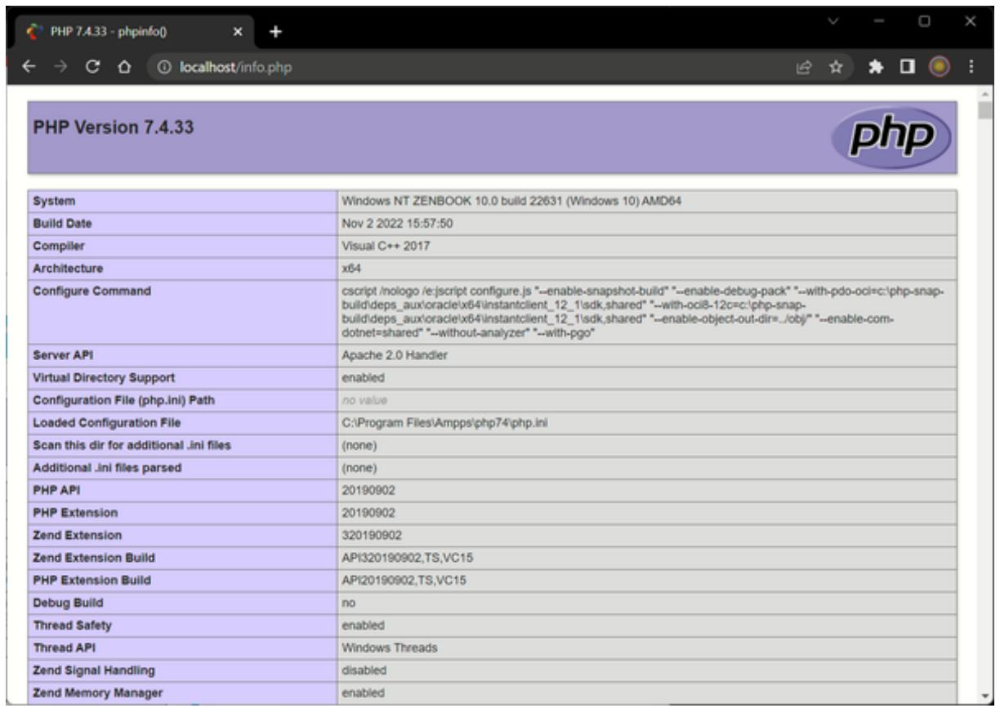
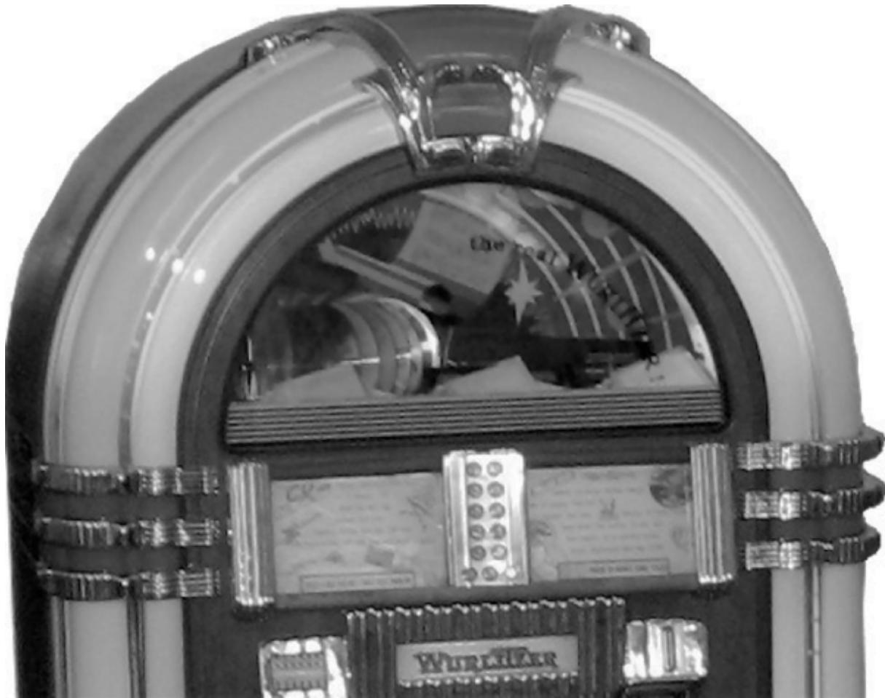
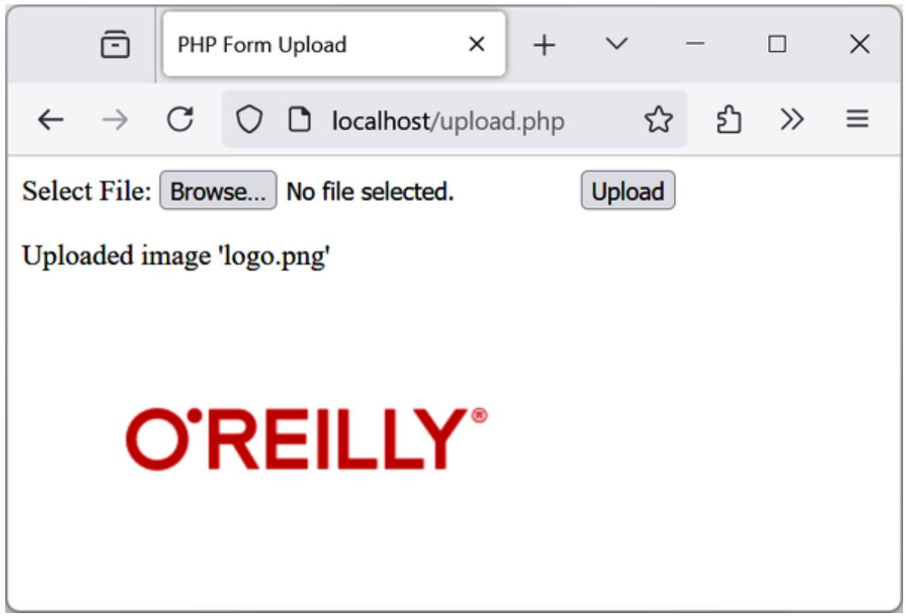

# Chapter 5. PHP Functions and Objects

The basic requirements of any programming language include somewhere to store data, a means of directing program flow with statements like if and else, and a few bits and pieces such as expression evaluation, file management, and text output. PHP has all these to make life easier. But even with all these in your toolkit, programming can be clumsy and tedious, especially if you have to rewrite portions of very similar code each time you need them.

That’s where functions and objects come in. As you might guess, a function is a set of statements that performs a particular function and—optionally— returns a value. You can pull out a section of code that you have used more than once, place it into a function, and call the function by name when you want to call the code.

In PHP functions have many advantages over contiguous, inline code. For example, they:

Involve less typing  
Reduce syntax and other programming errors  
Decrease the loading time of program files  
Accept arguments and can therefore be used for general as well as specific cases  
Are easier to write tests for

Object-oriented programming takes this concept a step further. A class is like a template that allows you to create objects, which encapsulate one or more functions and the data they use.

In this chapter, you’ll learn all about using functions, from defining and calling them to passing arguments. With that knowledge under your belt, you’ll start creating functions and using them in your own objects (where they will be referred to as methods).

**NOTE**

It is now highly unusual (and definitely not recommended) to use any version of PHP lower than 5.4. Therefore, this chapter assumes this release is the bare minimum version you will be working with, and I would strongly recommend you stick with a minimum of version 8.2 (the version supplied with AMPPS as described in Chapter 2). Should you need to use a different version such as the newer 8.x releases, you can install one from the AMPPS control panel, as described in Chapter 2.

## PHP Functions

PHP comes with hundreds of ready-made, built-in functions, making it a very rich language. To use a function, call it by name. For example, you can see the date function in action here:

echo date('l');

The parentheses tell PHP that you’re referring to a function. Otherwise, it thinks you’re referring to a constant or variable.

Functions can take any number of arguments, including zero. For example, phpinfo, as shown next, displays lots of information about the current installation of PHP and requires no argument:

phpinfo();

The result of calling this function can be seen in Figure 5-1.

**WARNING**

The phpinfo function is extremely useful for obtaining information about your current PHP installation, but that information could also be very useful to potential hackers.

Therefore, never leave a call to this function in any production code.



<details>
<summary>text_image</summary>

PHP Version 7.4.33
System	Windows NT ZENBOOK 10.0 build 22631 (Windows 10) AMD64
Build Date	Nov 2 2022 15:57:50
Compiler	Visual C++ 2017
Architecture	x64
Configure Command	cscript /nologo /e:cjscript configure.js "--enable-snapshot-build" "--enable-debug-pack" "--with-pdo-oci=c:\php-snap-build\deps_aux\oracle\x64\instantclient_12_1sdk,shared" "--with-oci8-12c=c:\php-snap-build\deps_aux\oracle\x64\instantclient_12_1sdk,shared" "--enable-object-out-dir=../obj/" "--enable-com-dotnet=shared" "--without-analyzer" "--with-pgo"
Server API	Apache 2.0 Handler
Virtual Directory Support	enabled
Configuration File (php.ini) Path	nov value
Loaded Configuration File	C:\Program Files\Ampps/php74\php.ini
Scan this dir for additional .ini files	(none)
Additional .ini files parsed	(none)
PHP API	20190902
PHP Extension	20190902
Zend Extension	320190902
Zend Extension Build	API320190902,TS,VC15
PHP Extension Build	API20190902,TS,VC15
Debug Build	nov
Thread Safety	enabled
Thread API	Windows Threads
Zend Signal Handling	disabled
Zend Memory Manager	enabled
</details>

Figure 5-1. The output of PHP’s built-in   function

Some of the built-in functions that use one or more arguments appear in Example 5-1.

Example 5-1. Three string functions

```php
<?php
echo strrev(' .dlrow olleH'); // Reverse string
echo str_repeat('Hip ', 2); // Repeat string
echo strtoupper('hooray!'); // String to uppercase
?>
```

This example uses three string functions to output the following text:

Hello world. Hip Hip HOORAY!

As you can see, the strrev function reversed the order of characters in the string, str\_repeat repeated the string "Hip " twice (as required by the second argument), and strtoupper converted "hooray!" to uppercase.

### Defining a Function

The general syntax for a function is:

```c
function function_name(parameter, parameter 2...)
{
    // Statements
}
```

The first line of the syntax indicates:

A definition starts with the word function.  
A name follows, which must start with a letter or underscore, followed by any number of letters, numbers, or underscores; the same requirements are used for variable naming.  
The parentheses are required.  
One or more parameters, separated by commas, are optional.

Function names are case-insensitive, so all of the following strings can refer to the print function: PRINT, Print, and PrInT, but whichever style you or your supervisor sets up should be adhered to for consistency.

The opening curly brace starts the statements that will execute when you call the function; a matching curly brace must close it. These statements may include one or more return statements, which force the function to cease execution and return to the calling code. If a value is attached to the return statement, the calling code can retrieve it, as we’ll see next.

### Returning a Value

Let’s look at a simple function to convert a person’s full name to lowercase and then capitalize the first letter of each part of the name.

We’ve already seen an example of PHP’s built-in strtoupper function in Example 5-1. For our current function, we’ll use its counterpart, strtolower:

```scss
$lowered = strtolower('aNY # of Letters and Punctuation you WANT');
echo $lowered;
```

The output of this experiment is:

any # of letters and punctuation you want

We don’t want names all lowercase, though; we want the first letter of each part of the sentence capitalized. (We’re not going to deal with subtle cases such as Mary-Ann or Jo-En-Lai for this example.) Luckily, PHP also provides a ucfirst function that sets the first character of a string to uppercase:

```txt
$ucfixed = ucfirst('any # of letters and punctuation you want');
echo $ucfixed;
```

The output is:

Any # of letters and punctuation you want

Now we can do our first bit of program design: to get a word with its initial letter capitalized, we call strtolower on the string first and then ucfirst. The way to do this is to nest a call to strtolower within ucfirst. Let’s see why, because it’s important to understand the order in which code is evaluated.

Say you make a simple call to the print function:

print(5-8);

The expression 5-8 is evaluated first, and the output is –3. (As you saw in Chapter 4, PHP converts the result to a string in order to display it.) If the expression contains a function, that function is evaluated as well:

print(abs(5-8));

PHP is doing several things in executing that short statement:

1. Evaluate 5-8 to produce –3.  
2. Use the abs function to turn –3 into 3.  
3. Convert the result to a string and output it using the print function.

This all works because PHP evaluates each element from the inside out. The same procedure is in operation when we call the following:

ucfirst(strtolower('aNY # of Letters and Punctuation you WANT'))

PHP passes our string to strtolower and then to ucfirst, producing (as we’ve already seen when we played with the functions separately):

Any # of letters and punctuation you want

Now let’s define a function (shown in Example 5-2) that takes three names and makes each one lowercase, with an initial capital letter.

Example 5-2. Cleaning up a full name  
```php
<?php
function fix_names($n1, $n2, $n3)
{
    $n1 = ucfirst(strtolower($n1));
    $n2 = ucfirst(strtolower($n2));
    $n3 = ucfirst(strtolower($n3));

    return $n1 . ' ' . $n2 . ' ' . $n3;
}

echo fix_names('WILLIAM', 'henry', 'gatES');
?>
```

You may well find yourself writing this type of code, because users often leave their Caps Lock key on, accidentally insert capital letters in the wrong places, and even forget capitals altogether. The output from this example is:

William Henry Gates

### Returning an Array

We just saw a function returning a single value. There are also ways of getting multiple values from a function.

The first method is to return them within an array. As you saw in Chapter 3, an array is like a bunch of variables stuck together in a row. Example 5-3 shows how you can use an array to return function values.

Example 5-3. Returning multiple values in an array  
```php
<?php
$names = fix_names('WILLIAM', 'henry', 'gatES');
echo $names[0] . '' . $names[1] . '' . $names[2];
```

```perl
function fix_names($n1, $n2, $n3)
{
    $n1 = ucfirst(strtolower($n1));
    $n2 = ucfirst(strtolower($n2));
    $n3 = ucfirst(strtolower($n3));

    return array($n1, $n2, $n3);
}
?>
```

This method has the benefit of keeping all three names separate, rather than concatenating them into a single string, so you can refer to any user simply by first or last name without having to extract either name from the returned string.

### Returning Global Variables

Another way, although not recommended, to give a function access to an externally created variable that is not passed as an argument is by declaring it to have global access from within the function. The global keyword followed by the variable name gives every part of your code full access to it (see Example 5-4).

Example 5-4. Returning values in global variables  
```php
<?php
$a1 = 'WILLIAM';
$a2 = 'henry';
$a3 = 'gatES';

function fix_names()
{
    global $a1; $a1 = ucfirst(strtolower($a1));
    global $a2; $a2 = ucfirst(strtolower($a2));
    global $a3; $a3 = ucfirst(strtolower($a3));
}

echo $a1 . ' ' . $a2 . ' ' . $a3 . '<br>';
fix_names();
echo $a1 . ' ' . $a2 . ' ' . $a3;
?>
```

Now you don’t have to pass parameters to the function, and it doesn’t have to accept them. Once declared, these variables retain global access and are available to the rest of your program, including its functions. You may spot this approach in legacy code but is strongly not recommended for any new development as it introduces a hidden side effect to the fix\_names function that is not clear. It also makes testing the function much harder and safe renaming of the variables almost impossible.

### Recap of Variable Scope

A quick reminder of what you know from Chapter 3:

Local variables are accessible just from the part of your code where you define them. If a variable is inside a function, only that function can access the variable, and its value is lost when the function returns.  
Global variables are accessible from all parts of your code, whether within or outside of functions.  
Static variables are accessible only within the function that declared them but retain their value over multiple calls.

## Including and Requiring Files

As you progress in your use of PHP programming, you are likely to start building a library of functions that you think you will need again. You’ll also probably start using libraries created by other programmers.

There’s no need to copy and paste these functions into your code. You can save them in separate files and use commands to pull them in. There are two commands to perform this action: include and require.

### The include Statement

Using include, you can tell PHP to fetch a particular file and load all its contents. It’s as if you pasted the included file into the current file at the insertion point. Example 5-5 shows how you would include a file called library.php.

Example 5-5. Including a PHP file  
```php
<?php
include "library.php";
// Your code goes here
?>
```

### Using include\_once

Each time you issue the include directive, it includes the requested file again, even if you’ve already inserted it. For instance, suppose that library.php contains a lot of useful functions, so you include it in your file, but you also include another library that includes library.php. Through nesting, you’ve inadvertently included library.php twice. This will produce error messages, because you’re trying to define the same constant or function multiple times. So, you should use include\_once instead (see Example 5-6).

Example 5-6. Including a PHP file only once  
```php
<?php
include_once "library.php";
// Your code goes here
?>
```

Then, any further attempts to include the same file (with include or include\_once) will be ignored. To determine whether the requested file has already been executed, the absolute filepath is matched after all relative paths are resolved (to their absolute paths) and the file is found in your include path.

**NOTE**

In general, it’s best to stick with include\_once and ignore the basic include statement. That way, you will never have the problem of files being included multiple times.

### Using require and require\_once

A potential problem with include and include\_once is that PHP will only attempt to include the requested file. Program execution continues even if the file is not found.

When it is absolutely essential to include a file, require it. For the same reasons I gave for using include\_once, I recommend that you stick with require\_once whenever you need to require a file (see Example 5-7).

Example 5-7. Requiring a PHP file only once

```php
<?php
require_once "library.php";
// Your code goes here
?>
```

## PHP Version Compatibility

PHP is in an ongoing process of development, and there are multiple versions. If you need to check whether a particular function is available to your code, you can use the function\_exists function, which checks all predefined and user-created functions.

Example 5-8 checks for array\_combine, a function specific to only some versions of PHP.

```php
<?php
if (function_exists("array_combine"))
{
    echo "Function exists";
}
else
{
    echo "Function does not exist - better write our own";
}
?>
```

Using code such as this, you can take advantage of features in newer versions of PHP and yet still have your code run on earlier versions where the newer features are unavailable, as long as you replicate any features that are missing (called polyfills). Your functions may be slower than the builtin ones, but at least your code will be much more portable.

## PHP Objects

In much the same way that functions represent a huge increase in programming power over the early days of computing, object-oriented programming (OOP) takes the use of functions in a different direction.

Once you get the hang of condensing reusable bits of code into functions, it’s not that great a leap to consider bundling the functions and their data into objects.

Let’s take a social networking site that has many parts. One handles all user functions—that is, code to enable new users to sign up and existing users to modify their details. In standard PHP, you might create a few functions to handle this and embed some calls to the MySQL database to keep track of all the users.

To create an object to represent the current user, you could create a class, perhaps called User, that would contain all the code required for handling users and all the variables needed for manipulating the data within the class.

Then, whenever you need to manipulate a user’s data, you could simply create a new object with the User class.

You could treat this new object as if it were the actual user. For example, you could pass the object a name, password, and email address; ask it whether such a user already exists; and, if not, have it create a new user with those attributes. You could even have an instant messaging object or one for managing whether two users are friends.

### Terminology

When creating an object-oriented program, you need to design a composite of data and code called a class. Each new object based on this class is called an instance (or occurrence) of that class.

The data associated with an object is called its properties; the functions it uses are called methods. In defining a class, you supply the names of its properties and the code for its methods. See Figure 5-2 for a jukebox metaphor for an object. Think of the CDs that it holds in the carousel as its properties; the method of playing them is to press buttons on the front panel. There is also a slot for inserting coins (the method used to activate the object) and a laser disc reader (the method used to retrieve the music, or properties, from the CDs), or software to download and play an online file.

When you’re creating objects, it is best to use encapsulation, or writing a class in such a way that only its methods can be used to manipulate its properties. In other words, you deny outside code direct access to its data. The methods you supply are known as the object’s interface.



<details>
<summary>natural_image</summary>

Black-and-white photo of a vintage U.S. radio with arched frame and decorative bands (no visible text or symbols)
</details>

Figure 5-2. A jukebox: a great example of a self-contained object

This approach makes debugging easy: you have to fix faulty code only within a class. Additionally, when you want to upgrade a program, if you have used proper encapsulation and maintained the same interface, you can simply develop new replacement classes, debug them fully, and then swap them in for the old ones. If they don’t work, you can swap the old ones back in to immediately fix the problem before further debugging the new classes.

Once you have created a class, you may find that you need another class that is similar to it but not quite the same. The quick and easy thing to do is to define a new class using inheritance. When you do this, your new class has all the properties of the one it has inherited from. The original class is now called the parent (or occasionally the superclass), and the new one is the subclass (or derived class).

In our jukebox example, if you invent a new jukebox that can play a video along with the music, you can inherit all the properties and methods from the original jukebox superclass and add some new properties (videos) and new methods (a movie player).

An excellent benefit of this system is that if you improve the speed or any other aspect of the superclass, its subclasses will receive the same benefit. On the other hand, any change made to the parent/superclass could break the subclass.

### Declaring a Class

Before you can use an object, you must define a class with the class keyword. Class definitions contain the class name (which is caseinsensitive), its properties, and its methods. Example 5-9 defines the class User with two properties, which are \$name and \$password (indicated by the public keyword—see “Property and Method Scope”). It also creates a new instance (called \$object) of this class.

Example 5-9. Declaring a class and examining an object  
```php
<?php
class User
{
    public $name, $password;

    function save_user()
    {
    echo "Save User code goes here";
    }
}

$object = new User;
print_r($object);
?>
```

Here I have also used an invaluable function called print\_r. It asks PHP to display information about a variable in human-readable form. (The \_r

stands for human-readable.) In the case of the new object \$object, it displays this:

```txt
User Object
(
    [name] => 
    [password] => 
)
```

However, a browser compresses all the whitespace, so the output in a browser is slightly harder to read (although you can always display output within <pre> and </pre> tags to display all the whitespace):

```txt
User Object ([name] => [password] => )
```

In any case, the output says that \$object is a user-defined object that has the properties name and password.

### Creating an Object

To create an object with a specified class, use the new keyword, like this: \$object = new Class. Here are a couple of ways we could do this:

$object = new User;$ $temp = new User('name', 'password');$

On the first line, we create an instance of the User class and assign it to a variable called \$object.  In the second line, we provide arguments to the class constructor, a special method explained later in the chapter, when we create the instance of the User class and assign the instance to the variable \$temp.

A class may require or prohibit arguments in its constructor; it may also allow arguments without explicitly requiring them.

### Accessing Objects

Let’s add a few lines to Example 5-9 and check the results. Example 5-10 extends the previous code by setting object properties and calling a method.

Example 5-10. Creating and interacting with an object  
```php
<?php
    $object = new User;
    print_r($object); echo "<br>";
    $object->name    = "Joe";
    $object->password = "mypass";
    print_r($object); echo "<br>";
    $object->save_user();

class User
{
    public $name, $password;

    function save_user()
    {
    echo "Save User code goes here";
    }
}
?>
```

As you can see, the syntax for accessing an object’s property is \$object->property. Likewise, you call a method like this: \$object->method().

You should note that the example property and method do not have \$ signs in front of them. If you were to preface them with \$ signs, the code would not work, as it would try to reference the value inside a variable. For example, the expression \$object->\$property would attempt to look up the value assigned to a variable named \$property (let’s say that value is the string brown) and then attempt to reference the property \$object->brown. If \$property is undefined, an attempt to reference \$object->NULL would occur and cause an error.

When looked at using a browser’s View Source facility, the output from Example 5-10 is:

```txt
User Object
(
    [name] => 
    [password] => 
)
User Object
(
    [name] => Joe
    [password] => mypass
)
Save User code goes here
```

Again, print\_r shows its utility by providing the contents of \$object before and after property assignment. From now on, I’ll omit print\_r statements, but if you are working along with this book on your development server, you can put some in to see exactly what is happening.

You can also see that the code in the method save\_user was executed via the call to that method. It printed the string reminding us to create some code.

**NOTE**

You can place functions and class definitions anywhere in your code, before or after statements that use them. Generally, though, it is considered good practice to place them in their own files, or in shorter pieces of code where extra files are not required, toward the end of a file.

### Cloning Objects

Once you have created an object, it is passed by reference when you pass it as a parameter. In the matchbox metaphor, this is like keeping several threads attached to an object stored in a matchbox so that you can follow any attached thread to access it.

In other words, making object assignments does not copy objects in their entirety; only a new reference to an existing object is created. You’ll see how this works in Example 5-11, where we define a very simple User class with no methods and only the property name.

Example 5-11. Copying an object  
```php
<?php
    $object1 = new User();
    $object1->name = "Alice";
    $object2 = $object1;
    $object2->name = "Amy";

echo "object1 name = " . $object1->name . "<br>";
echo "object2 name = " . $object2->name;

class User
{
    public $name;
}
?>
```

Here, we first create the object \$object1 and assign the value Alice to the name property. Then we create \$object2, assigning it the value of \$object1, and assign the value Amy just to the name property of \$object2 —or so we might think. But this code outputs the following:

```txt
object1 name = Amy
object2 name = Amy
```

What has happened? Both \$object1 and \$object2 refer to the same object, so changing the name property of \$object2 to Amy also sets that property for \$object1.

To avoid this confusion, you can use the clone operator, which creates a new instance of the class and copies the property values from the original instance to the new instance. Example 5-12 illustrates this usage.

```php
<?php
class User
{
    public $name;
}
$object1 = new User();
$object1->name = "Alice";
$object2 = clone $object1;
$object2->name = "Amy";

echo "object1 name = " . $object1->name . "<br>";
echo "object2 name = " . $object2->name;
?>
```

Voilà! The output from this code is what we initially wanted:

```txt
object1 name = Alice
object2 name = Amy
```

### Constructors

When creating a new object, you can pass a list of arguments to a special method within the class, called the constructor, which initializes various object properties.

To do this you use the function name \_\_construct (that is, construct preceded by two underscore characters), as in Example 5-13. The constructor in the example takes two arguments \$name and \$password and initializes two properties name and password. A special variable \$this is used to set the current object’s properties: the name property declared as public \$name is accessed as \$this->name in the class methods including the constructor.

Example 5-13. Creating a constructor method

```php
<?php
class User
{
    public $name, $password;

    function __construct($name, $password)
    {
    $this->name = $name;
    $this->password = $password;
    }
}
?>
```

### Destructors

You also have the ability to create destructor methods, useful for when code has made the last reference to an object or when a script reaches the end.

Example 5-14 shows how to create a destructor method. The destructor can do clean-up such as releasing a connection to a database or some other resource that you reserved within the object. Because you reserved the resource within the object, you have to release it here, or it will stick around indefinitely. Many system-wide problems are caused by programs reserving resources and forgetting to release them.

Example 5-14. Creating a destructor method  
```php
<?php
class User
{
    function __destruct()
    {
    // Destructor code goes here
    }
}
?>
```

### Writing Methods

As you have seen, declaring a method is similar to declaring a function, but there are a few differences. For example, method names beginning with a double underscore (\_\_) are reserved (for example, \_\_construct and \_\_destruct).

You also have access to a special variable called \$this, which can be used to access the current object’s properties. To see how it works, see Example 5-15, which contains a different method from the User class definition called get\_password.

Example 5-15. Using the variable  in a method  
```php
<?php
class User
{
    public $name, $password;

    function get_password()
    {
    return $this->password;
    }
}
?>
```

get\_password uses the \$this variable to access the current object and then return the value of that object’s password property. Note how the preceding \$ of the property \$password is omitted when we use the -> operator.

Leaving the \$ in place is a typical error you may run into, particularly when you first use this feature.

Here’s how you would use the class defined in Example 5-15:

$object$ = new User; $object->password$ = "secret";
echo $object->get_password()$ ;

This code prints the password secret.

### Declaring Properties

It is not necessary to explicitly declare properties within classes, as they can be implicitly defined when first used, but this technique has been deprecated since PHP 8.2. To illustrate this, in Example 5-16 the class User has no properties and no methods but is legal code.

Example 5-16. Defining a property implicitly  
```php
<?php
    $object1 = new User();
    $object1->name = "Alice";

echo $object1->name;

class User {}
?>
```

This code correctly outputs the string Alice without a problem, because PHP implicitly declares the property \$object1->name for you. But this kind of programming can lead to bugs that are infuriatingly difficult to discover, because name was declared from outside the class.

To help yourself and anyone else who will maintain your code, I advise that you get into the habit of always declaring your properties explicitly within classes. You’ll be glad you did.

### Static Methods

You can define a method as static, which means that it is called on a class, not on an object. A static method has no access to any object properties and is created and accessed as in Example 5-17.

Example 5-17. Creating and accessing a static method  
```php
<?php
User::pwd_string();
```

```txt
class User
{
    static function pwd_string()
    {
    echo "Please enter your password";
    }
}
?>
```

Note how we call the class itself, along with the static method, using a double colon (also known as the scope resolution operator), not ->. Static functions are useful for performing actions relating to the class itself but not to specific instances of the class. You can see another example of a static method in Example 5-18.

**NOTE**

If you try to access \$this->property, or other object properties from within a static function, you will receive an error message.

### Declaring Constants

In the same way that you can create a global constant with the define function, you can define constants inside classes. The generally accepted practice is to use uppercase letters to make them stand out, as in Example 5- 18.

Example 5-18. Defining constants within a class

```php
<?php
Translate::lookup();
class Translate
{
    const ENGLISH = 0;
    const SPANISH = 1;
    const FRENCH = 2;
    const GERMAN = 3;
    // ...
```

```txt
static function lookup()
{
    echo self::SPANISH;
}
?>
```

You can reference constants directly, using the self keyword and double colon operator. Note that this code calls the class directly, using the double colon operator at line 1, without creating an instance of it first. As you would expect, the value printed when you run this code is 1.

Outside of the class, you can access the constant directly by the class name:

```txt
print_r(Translate::GERMAN);
```

Remember that once you define a constant, you can’t change it.

### Property and Method Scope

PHP provides three keywords for controlling the scope of properties and methods (members):

public

Public members can be referenced anywhere, including by other classes and instances of the object. This is the default when variables are declared with the var or public keywords, or when a variable is implicitly declared the first time it is used.

The keywords var and public are interchangeable because, although deprecated, var is retained for compatibility with previous versions of PHP. Methods are assumed to be public by default.

protected

These members can be referenced only by the object’s class methods and those of any subclasses.

**private**

These members can be referenced only by methods within the same class, not by subclasses.

Here’s how to decide which you need to use:

Use public when outside code should access this member and extending classes should also inherit it.  
Use protected when outside code should not access this member but extending classes should inherit it.  
Use private when outside code should not access this member and extending classes also should not inherit it.

Example 5-19 illustrates the use of these keywords.

Example 5-19. Changing property and method scope

```php
<?php
class Example
{
    var $name = "Michael"; // Same as public but deprecated
    public $age = 23; // Public property
    protected $usercount; // Protected property

    private function admin() // Private method
    {
    // Admin code goes here
    }
}
?>
```

### Static Properties

Most data and methods apply to instances of a class. For example, in a User class, you will want to do such things as set a particular user’s password or check when the user has been registered. These facts and operations apply separately to each user and therefore use instance-specific properties and methods.

But occasionally you’ll want to maintain data about a whole class. For instance, to report how many users are registered, you will store a variable that applies to the whole User class. PHP provides static properties and methods for such data.

As shown briefly in Example 5-17, declaring members of a class static makes them accessible without an instantiation of the class. A property declared static cannot be directly accessed within an instance of a class, but a static method can.

Example 5-20 defines a class called Test with a static property and a public method.

Example 5-20. Defining a class with a static property  
```php
<?php
$temp = new Test();

echo "Test A: " . Test::$static_property . "<br>";
echo "Test B: " . $temp->get_sp() . "<br>";
echo "Test C: " . $temp->static_property . "<br";

class Test
{
    static $static_property = "I'm static";

    function get_sp()
    {
    return self::$static_property;
    }
}
?>
```

When you run this code, it returns the following output:

```yaml
Test A: I'm static
Test B: I'm static
Notice: Undefined property: Test::$static_property
Test C:
```

This example shows that the property \$static\_property could be directly referenced from the class itself via the double colon operator in Test A. Also, Test B could obtain its value by calling the get\_sp method of the object \$temp, created from class Test. But Test C failed, because the static property \$static\_property was not accessible to the object \$temp.

Note how the method get\_sp accesses \$static\_property using the keyword self. This is how a static property or constant can be directly accessed within a class.

### Inheritance

Once you have written a class, you can derive subclasses from it. This can save lots of painstaking code rewriting: you can take a class similar to the one you need to write, extend it to a subclass, and modify just the parts that are different. You achieve this using the extends keyword.

**USE INHERITANCE WITH CAUTION**

Inheritance should be approached with caution and used sparingly. If overused, it can make testing, refactoring, and reasoning more difficult. A common error is to create a class (for example a Mailer class) that extends the Database class because the Mailer class needs the Database class. A better approach is class composition, where the Mailer class uses, but does not extend, multiple other classes, like the Database class, the Email class, and the User class. Objects created from the other classes can be passed to the Mailer object as constructor arguments or can be created in the constructor. Consider inheritance a more advanced design pattern with some downsides to factor in when deciding whether to use it.

In Example 5-21, the class Subscriber is declared a subclass of User by means of the extends keyword.

Example 5-21. Inheriting and extending a class  
```php
<?php
    $object = new Subscriber;
    $object->name = "Fred";
    $object->password = "pword";
    $object->phone = "012 345 6789";
    $object->email = "fred@bloggs.com";
    $object->display();

class User
{
    public $name, $password;

    function save_user()
    {
    echo "Save User code goes here";
    }
}

class Subscriber extends User
{
    public $phone, $email;

    function display()
    {
    echo "Name: " . $this->name . "<br>";
    echo "Pass: " . $this->password . "<br>";
    echo "Phone: " . $this->phone . "<br>";
    echo "Email: " . $this->email;
    }
}

?>
```

The original User class has two properties, \$name and \$password, and a method to save the current user to the database. Subscriber extends this class by adding an additional two properties, \$phone and \$email, and includes a method of displaying the properties of the current object using the variable \$this, which refers to the current values of the object being accessed. The output from this code is:

```txt
Name: Fred  
Pass: pword  
Phone: 012 345 6789  
Email: fred@bloggs.com
```

**The parent keyword**

If you write a method in a subclass with the same name as one in its parent class, its statements will override those of the parent class. Sometimes this is not the behavior you want, and you need to access the parent’s method. To do this, you can use the parent operator, as in Example 5-22.

Example 5-22. Overriding a method and using the  operator  
```php
<?php
    $object = new Son;
    $object->test();
    $object->test2();

class Dad
{
    function test()
    {
    echo "[Class Dad] I am your Father<br>";
    }
}

class Son extends Dad
{
    function test()
    {
    echo "[Class Son] I am Luke<br>";
    }

    function test2()
    {
    parent::test();
    }
```

```txt
}
?>
```

This code creates a class called Dad and a subclass called Son that inherits its properties and methods and then overrides the method test. Therefore, when line 2 calls the method test, the new method is executed. The only way to execute the overridden test method in the Dad class is to use the parent operator, as shown in function test2 of class Son. The code outputs this:

```txt
[Class Son] I am Luke
[Class Dad] I am your Father
```

If you wish to ensure that your code calls a method from the current class, you can use the self keyword, like this:

```txt
self::method();
```

Using self to call static methods is very common, but it is rarely used to call the object ones. The difference between using self and \$this to call an object method is that if the method would be overridden in a subclass and you’d call it using the self keyword in the parent class, then the method from the parent class would be called, not the overridden one, unlike when you’d use \$this to call it.

**Subclass constructors**

When you extend a class and declare your own constructor, you should be aware that PHP will not automatically call the constructor method of the parent class. If you want to be certain that all initialization code is executed, subclasses should always call the parent constructors, as in Example 5-23.

Example 5-23. Calling the parent class constructor

```php
<?php
    $object = new Tiger();

echo "Tigers have...<br>";
echo "Fur: " . $object->fur . "<br>";
echo "Stripes: " . $object->stripes;

class Wildcat
{
    public $fur; // Wildcats have fur

    function __construct()
    {
    $this->fur = "TRUE";
    }
}

class Tiger extends Wildcat
{
    public $stripes; // Tigers have stripes

    function __construct()
    {
    parent::_construct(); // Call parent constructor first
    $this->stripes = "TRUE";
    }
}

?>
```

This example takes advantage of inheritance in the typical manner. The Wildcat class has created the property \$fur, which we’d like to reuse, so we create the Tiger class to inherit \$fur and additionally create another property, \$stripes. To verify that both constructors have been called, the program outputs:

Tigers have...

Fur: TRUE

Stripes: TRUE

**Final methods**

When you wish to prevent a subclass from overriding a superclass method, you can use the final keyword. Example 5-24 shows how.

Example 5-24. Creating a  method  
```php
<?php
class User
{
    final function copyright()
    {
    echo "This class was written by Joe Smith";
    }
}
?>
```

If you tried to override the copyright method in a subclass of the User class, you’d get an error message saying you cannot override the final method.

Private methods, except for the constructor, cannot use the final keyword. It would make little sense as they are never overridden by other classes.

Once you have digested the contents of this chapter, you should have a strong feel for what PHP can do for you. You should be able to use functions with ease and, if you wish, write object-oriented code. In Chapter 6, we’ll complete our initial exploration of PHP by looking at the workings of PHP arrays, but first test your understanding of this chapter using the following questions.

## Questions

1. What is the main benefit of using a function?  
2. How many values can a function return?  
3. What is the difference between accessing a variable by name and by reference?

4. What is the meaning of scope in PHP?  
5. How can you incorporate one PHP file within another?  
6. How is an object different from a function?  
7. How do you create a new object in PHP?  
8. What syntax would you use to create a subclass from an existing one?  
9. How can you cause an object to be initialized when you create it?  
10. Why is it a good idea to explicitly declare properties within a class?

See “Chapter 5 Answers” in the Appendix A for the answers to these questions.

In Chapter 3, I gave a very brief introduction to PHP’s arrays, just enough for a little taste of their power. In this chapter, I’ll show you many more things you can do with arrays, some of which—if you have ever used a strongly typed language such as C—may surprise you with their elegance and simplicity.

Not only do arrays remove the tedium of writing code to deal with complicated data structures, but they also provide numerous ways to access data while remaining amazingly fast.

## Basic Access

We’ve already looked at arrays as if they were clusters of matchboxes glued together. Another way to think of an array is like a string of beads, with the beads representing variables that can be numbers, strings, or even other arrays. They are like bead strings because each element has its own location and (with the exception of the first and last ones) each has other elements on either side.

Some arrays are referenced by numeric indexes; others allow alphanumeric identifiers. Built-in functions let you sort them, add or remove sections, and walk through them to handle each item through a special kind of loop. By placing one or more arrays inside another, you can create arrays of two, three, or any number of dimensions.

### Numerically Indexed Arrays

Let’s assume that you’ve been tasked with creating a simple website for a local office supply company and you’re currently working on the section devoted to paper. One way to manage the various items of stock in this category would be to place them in a numeric array. You can see the simplest way of doing so in Example 6-1.

Example 6-1. Adding items to an array  
```php
<?php
$paper[] = "Copier";
$paper[] = "Inkjet";
$paper[] = "Laser";
$paper[] = "Photo";
print_r($paper);
?>
```

In this example, each time you assign a value to the array \$paper, the first empty location within that array is used to store the value, and a pointer internal to PHP is incremented to point to the next free location, ready for future insertions. The familiar print\_r function (which prints out the contents of a variable, array, or object) is used to verify that the array has been correctly populated. It prints out the following:

```txt
Array
(
[0] => Copier
[1] => Inkjet
[2] => Laser
[3] => Photo
)
```

The previous code also could have been written as shown in Example 6-2, where the exact location of each item within the array is specified. But, as you can see, that approach requires extra typing and makes your code harder to maintain if you want to insert supplies into or remove them from the array. So, unless you wish to specify a different order, it’s better to let PHP handle the actual location numbers.

Example 6-2. Adding items to an array using explicit locations

```php
<?php
$paper[0] = "Copier";
$paper[1] = "Inkjet";
$paper[2] = "Laser";
$paper[3] = "Photo";
print_r($paper);
?>
```

The output from these examples is identical, but you are not likely to use print\_r in a developed website, so Example 6-3 shows how you might print out the various types of paper the website offers using a for loop.

Example 6-3. Adding items to an array and retrieving them  
```php
<?php
$paper[] = "Copier";
$paper[] = "Inkjet";
$paper[] = "Laser";
$paper[] = "Photo";

for ($j = 0; $j < 4; ++$j)
    echo "$j: {paper[$j]}<br>";
?>
```

This example prints out:

0: Copier  
1: Inkjet  
2: Laser  
3: Photo

So far, you’ve seen a couple of ways you can add items to an array and one way of referencing them. PHP offers many more, which I’ll get to shortly. But first, we’ll look at another type of array.

### Associative Arrays

Keeping track of array elements by numeric index works just fine but can require extra work in terms of remembering which number refers to which product. It can also make code hard for other programmers to follow.

This is where associative arrays come in. Using them, you can reference the items in an array by name rather than by number. Example 6-4 expands on the previous code by giving each element in the array an identifying name and a longer, more explanatory string value.

Example 6-4. Adding items to an associative array and retrieving them  
```php
<?php
$paper['copier'] = "Copier & Multipurpose";
$paper['inkjet'] = "Inkjet Printer";
$paper['laser'] = "Laser Printer";
$paper['photo'] = "Photographic Paper";

echo $paper['laser'];
?>
```

In place of a number (which doesn’t convey any useful information, aside from the position of the item in the array), each item now has a unique name that you can use to reference it elsewhere, as with the echo statement, which simply prints out Laser Printer. The names (copier, inkjet, and so on) are called indexes or keys, and the items assigned to them (such as Laser Printer) are called values.

This very powerful PHP feature is often used when you are extracting information from XML and HTML. For example, an HTML parser such as those used by a search engine could place all the elements of a web page into an associative array whose names reflect the page’s structure:

```txt
<html['title'] = "My web page";
<html['body'] = "... body of web page ...";
```

The program would also break down all the links found within a page into another array, and all the headings and subheadings into another. When you use associative rather than numeric arrays, the code to refer to all of these items is easy to write and debug.

**NOTE**

PHP’s associative arrays are similar to maps, dictionaries, or objects in other languages.

### Assignment Using the array Keyword

So far, you’ve seen how to assign values to arrays by adding new items one at a time. Whether you specify keys, specify numeric identifiers, or let PHP assign numeric identifiers implicitly, this is a long-winded approach. A more compact and faster assignment method uses the array keyword.

Example 6-5 shows both a numeric and an associative array assigned using this method.

Example 6-5. Adding items to an array using the  keyword

```php
<?php
$p1 = array("Copier", "Inkjet", "Laser", "Photo");
echo "p1 element: " . $p1[2] . "<br>";
$p2 = array('copier' => "Copier & Multipurpose",
    'inkjet' => "Inkjet Printer",
    'laser' => "Laser Printer",
    'photo' => "Photographic Paper");
echo "p2 element: " . $p2['inkjet'] . "<br>";
?>
```

The first half of this snippet assigns the old, shortened product descriptions to the array \$p1. There are four items, so they will occupy slots 0 through 3. Therefore, the echo statement prints out:

p1 element: Laser

The second half assigns associative identifiers and accompanying longer product descriptions to the array \$p2 using the format key => value. The use of => is similar to the regular = assignment operator, except that you are assigning a value to an index and not to a variable. The index is then linked with that value, unless it is assigned a new value. The echo command therefore prints out:

**p2 element: Inkjet Printer**

You can verify that \$p1 and \$p2 are different types of array, because both of the following commands, when appended to the code, will cause an Undefined index or Undefined offset error, as the array identifier for each is incorrect:

```shell
echo $p1['inkjet']; // Undefined index
echo $p2[3]; // Undefined offset
```

## The foreach...as Loop

The creators of PHP have gone to great lengths to make the language easy to use. So, not content with the loop structures already provided, they added another one especially for arrays: the foreach...as loop. Using it, you can step through all the items in an array, one at a time, and do something with them.

The process starts with the first item and ends with the last one, so you don’t even have to know how many items are in an array. Example 6-6 shows how foreach...as can be used to rewrite Example 6-3.

Example 6-6. Walking through a numeric array using

```php
<?php
$paper = array("Copier", "Inkjet", "Laser", "Photo");
$j = 0;
```

```shell
foreach($paper as $item)
{
    echo "$j: $item<br>";
    ++$j;
}
?>
```

When PHP encounters a foreach statement, it takes the first item of the array and places it in the variable following the as keyword; each time control flow returns to the foreach, the next array element is placed in the as keyword. In this case, the variable \$item is set to each of the four values in turn in the array \$paper. Once all values have been used, execution of the loop ends. The output from this code is exactly the same as in Example 6-3.

Now let’s see how foreach works with an associative array in Example 6- 7, which is a rewrite of the second half of Example 6-5.

Example 6-7. Walking through an associative array using

```php
<?php
$paper = array('copier' => "Copier & Multipurpose",
    'inkjet' => "Inkjet Printer",
    'laser' => "Laser Printer",
    'photo' => "Photographic Paper");

foreach($paper as $item => $description)
echo "$item: $description<br>";
?>
```

Remember that associative arrays do not require numeric indexes, so the variable \$j is not used in this example. Instead, each item of the array \$paper is fed into the key/value pair of variables \$item and \$description, from which they are printed out. The displayed result of this code is:

copier: Copier & Multipurpose

```yaml
inkjet: Inkjet Printer
laser: Laser Printer
photo: Photographic Paper
```

There are some alternative ways to walk through an associative array. I once used the list and each functions, but each has since been removed from PHP. Luckily, it is possible to write a replacement function, which I have named myEach, to be used with the list function in conjunction with a while loop, as in Example 6-8.

Example 6-8. Walking through an associative array using  and  
```php
<?php
$paper = array('copier' => "Copier & Multipurpose",
    'inkjet' => "Inkjet Printer",
    'laser' => "Laser Printer",
    'photo' => "Photographic Paper");

while (list($item, $description) = myEach($paper))
    echo "$item: $description<br>";
function myEach(&$array) // Replacement for deprecated 'each' function
{
    $key    = key($array);
    $result = ($key === null) ? false :
    [($key, current($array), 'key', 'value' => 
    current($array)];
    next($array);
    return $result;
}
?>
```

In this example, a while loop is set up and will continue looping until the myEach function returns a value of FALSE. The myEach function acts like foreach in that it returns an array containing a key/value pair from the array \$paper and then moves its built-in pointer to the next pair in that array. When there are no more pairs to return, myEach returns FALSE.

Unlike with foreach, calling myEach modifies the internal array pointer because it uses next, which is something you should be aware of. You can spot the difference when you add print\_r(current(\$paper)); after both the foreach and while loops. Using foreach to walk through arrays is more common as it doesn’t have this side effect and is also marginally faster.

The list function takes an array as its argument (in this case, the key/value pair returned by the function myEach) and then assigns the values of the array to the variables listed within parentheses.

You can see how list works a little more clearly in Example 6-9, where an array is created out of the two strings Alice and Bob and then passed to the list function, which assigns those strings as values to the variables \$a and \$b.

Example 6-9. Using the  function  
```php
<?php
list($a, $b) = array('Alice', 'Bob');
echo "a=$a b=$b";
?>
```

The output from this code is:

```txt
a=Alice b=Bob
```

## Multidimensional Arrays

A simple design feature in PHP’s array syntax makes it possible to create arrays of more than one dimension. In fact, they can be as many dimensions as you like (although it’s a rare application that goes beyond three).

That feature is the ability to include an entire array as a part of another one and to be able to keep doing so, just like the old rhyme by Augustus De Morgan, the British mathematician and logician: “Big fleas have little fleas upon their backs to bite ’em. Little fleas have lesser fleas and so ad infinitum.”

Let’s look at how this works by extending the associative array in the previous example; see Example 6-10.

Example 6-10. Creating a multidimensional associative array

```php
<?php
$products = array(
'paper' => array(
'copier' => "Copier & Multipurpose",
'inkjet' => "Inkjet Printer",
'laser' => "Laser Printer",
'photo' => "Photographic Paper"),
'pens' => array(
'ball' => "Ball Point",
'hilite' => "Highlighters",
'marker' => "Markers"),
'misc' => array(
'tape' => "Sticky Tape",
'glue' => "Adhesives",
'clips' => "Paperclips"
)
);
echo "<pre>";
foreach($products as $section => $items)
foreach($items as $key => $value)
echo "$section:\tkey\t($value)<br>";
echo "</pre>";
?>
```

To make things clearer now that the code is starting to grow, I’ve renamed some of the elements. For example, because the previous array \$paper is now just a subsection of a larger array, the main array is now called \$products. Within this array, there are three items—paper, pens, and misc —each of which contains another array with key/value pairs.

If necessary, these subarrays could contain even further arrays. For example, under ball there might be many different types and colors of ballpoint pens available in the online store. But for now, I’ve restricted the code to a depth of just two.

Once the array data has been assigned, I use a pair of nested foreach...as loops to print out the various values. The outer loop extracts the main sections from the top level of the array, and the inner loop extracts the key/value pairs for the categories within each section.

As long as you remember that each level of the array works the same way (it’s a key/value pair), you can easily write code to access any element at any level.

The echo statement uses the PHP escape character \t, which outputs a tab. Although tabs are not normally significant to the web browser, I let them be used for layout through the <pre>...</pre> tags, which tell the web browser to format the text as preformatted and monospaced, and not to ignore whitespace characters such as tabs and line feeds. The output from this code looks like this:

```txt
paper: copier (Copier & Multipurpose)
paper: inkjet (Inkjet Printer)
paper: laser (Laser Printer)
paper: photo (Photographic Paper)
pens: ball (Ball Point)
pens: hilite (Highlighters)
pens: marker (Markers)
misc: tape (Sticky Tape)
misc: glue (Adhesives)
misc: clips (Paperclips)
```

You can directly access a particular element of the array by using square brackets:

```txt
echo $products['misc']['glue'];
```

This outputs the value Adhesives.

You can also create numeric multidimensional arrays that are accessed directly by indexes rather than by alphanumeric identifiers. Example 6-11 creates the board for a chess game with the pieces in their starting positions.

Example 6-11. Creating a multidimensional numeric array  
```php
<?php
$chessboard = array(
    array('r', 'n', 'b', 'q', 'k', 'b', 'n', 'r'),
    array('p', 'p', 'p', 'p', 'p', 'p', 'p'),
    array(' ', ', ', ', ', ', ', ', ', ', ', ''),
    array(' ', ', ', ', ', ', ', ', ', ', ', ''),
    array(' ', ', ', ', ', ', ', ', ', ', ', ''),
    array(' P', 'P', 'P', 'P', 'P', 'P', 'P'),
    array('R', 'N', 'B', 'Q', 'K', 'B', 'N', 'R')
);

echo "<pre>";

foreach($chessboard as $row)
{
    foreach ($row as $piece)
    echo "$piece";

    echo "<br>";
}

echo "</pre>";
?>
```

In this example, the lowercase letters represent black pieces, and the uppercase white. The key is r = rook, n = knight, b = bishop, k = king, q = queen, and p = pawn. Again, a pair of nested foreach...as loops walks through the array and displays its contents. The outer loop processes each row into the variable \$row, which itself is an array, because the

\$chessboard array uses a subarray for each row. This loop has two statements within it, so curly braces enclose them.

The inner loop then processes each square in a row, outputting the character (\$piece) stored in it, followed by a space (to square up the printout). This loop has a single statement, so curly braces are not required to enclose it. The <pre> and </pre> tags ensure that the output displays correctly, like this:

```txt
r n b q k b n r
p p p p p p p p
```

```txt
P P P P P P P P R N B Q K B N R
```

You can also directly access any element within this array by using square brackets:

echo \$chessboard[7][3];

This statement outputs the uppercase letter Q, the eighth element down and the fourth along (remember that array indexes start at 0, not 1).

## Using Array Functions

You’ve already seen the list and each functions, but PHP comes with numerous other functions for handling arrays. You can find the full list in the documentation. However, some of these functions are so fundamental that it’s worth taking the time to discuss them here.

### is\_array

Arrays and variables share the same namespace (as arrays are types of variable). This means you cannot have a string variable called \$fred and an array also called \$fred. If you’re in doubt and your code needs to check whether a variable is an array, you can use the is\_array function, like this:

echo is\_array(\$fred) ? "Is an array" : "Is not an array";

Note that if \$fred has not yet been assigned a value, an Undefined variable message will be generated.

### count

Although the each function and foreach...as loop structure are excellent ways to walk through an array’s contents, sometimes you need to know exactly how many elements are in your array, particularly if you will be referencing them directly. To count all the elements in the top level of an array, use a command such as:

echo count(\$fred);

Should you wish to know how many elements altogether are in a multidimensional array, you can use a statement such as:

echo count(\$fred, 1);

The second parameter is optional and sets the mode to use. It should be either 0 to limit counting to only the top level or 1 to force recursive counting of all subarray elements.

### sort

Sorting is so common that PHP provides a built-in function for it. In its simplest form, you would use it like this (to sort items normally: the

default):

sort(\$fred);

It is important to remember that, unlike some other functions, sort will act directly on the supplied array rather than returning a new array of sorted elements. It returns TRUE on success and FALSE on error and also supports a few flags—the main two flags you might wish to use force items to be sorted either numerically or as strings, like this:

```txt
sort($fred, SORT_NUMERIC);
sort($fred, SORT_STRING);
```

You can also sort an array in reverse order using the rsort function, like this:

```perl
rsort($fred, SORT_NUMERIC);
rsort($fred, SORT_STRING);
```

### shuffle

There may be times when you need the elements of an array to be put in random order, such as when you’re creating a game of playing cards:

shuffle(\$cards);

Like sort, shuffle acts directly on the supplied array and returns TRUE on success or FALSE on error.

### explode

explode is a very useful function; you can take a string containing several items separated by a single character (or string of characters) and then place each of these items into an array. One handy example is to split up a sentence into an array containing all its words, as in Example 6-12.

Example 6-12. Exploding a string into an array using spaces  
```php
<?php
    $temp = explode(' ', "This is a sentence with seven words");
    print_r($temp);
?>
```

This example prints out the following (on a single line when viewed in a browser):

```txt
Array
(
[0] => This
[1] => is
[2] => a
[3] => sentence
[4] => with
[5] => seven
[6] => words
)
```

The first parameter, the delimiter, need not be a space or even a single character. Example 6-13 shows a slight variation.

Example 6-13. Exploding a string delimited with  into an array  
```php
<?php
$temp = explode('***', "A***sentence***with***asterisks");
print_r($temp);
?>
```

The code in Example 6-13 prints this:

```txt
Array (
```

```txt
[0] => A
[1] => sentence
[2] => with
[3] => asterisks
)
```

### compact

At times you may want to use compact, the inverse of extract, to create an array from variables and their values. Example 6-14 shows how to use this function by passing variable names without the preceding \$ characters.

Example 6-14. Using the  function  
```php
<?php
    $fname = "Doctor";
    $sname = "Who";
    $planet = "Gallifrey";
    $system = "Gridlock";
    $constellation = "Kasterborous";

    $contact = compact('fname', 'sname', 'planet', 'system', 'constellation');

    print_r($contact);
?>
```  
The result of running Example 6-14 is:

```txt
Array
(
    [fname] => Doctor
    [sname] => Who
    [planet] => Gallifrey
    [system] => Gridlock
    [constellation] => Kasterborous
)
```

Note how compact requires the variable names to be supplied in quotes, not preceded by a \$ symbol. This is because compact is looking for a list of

variable names, not their values.

Another use of this function is for debugging, when you wish to quickly view several variables and their values, as in Example 6-15.

Example 6-15. Using  to help with debugging  
<?php $j = 23$ ; $temp = "Hello"$ ; $address = "1 Old Street"$ ; $age = 61$ ;

print_r(compact(explode(' ', 'j temp address age'));?>

This works by using the explode function to extract all the words from the string into an array, which is then passed to the compact function, which in turn returns an array to print\_r, which finally shows its contents.

If you copy and paste the print\_r line of code, you only need to alter the variables named there for a quick printout of a group of variables’ values. In this example, the output is:

```txt
Array
(
    [j] => 23
    [temp] => Hello
    [address] => 1 Old Street
    [age] => 61
)
```

### reset

When calling the next function (as seen in the myEach function earlier in the chapter), PHP’s internal array pointer, which makes a note of which element of the array it should return next, advances one place forward. If your code ever needs to return to the start of an array, you can issue reset, which also returns the value of that element. Examples of how to use this function are:

```scss
reset($fred); // Throw away return value
$item = reset($fred); // Keep first element of the array in $item
```

It’s important to note that the foreach...as construct does not modify the internal array pointer, so if you’re using it to walk through an array, you don’t need to care about the pointer, or resetting it.

### end

As with reset, you can move PHP’s internal array pointer to the final element in an array using the end function, which also returns the value of the element and can be used as in these examples:

```txt
end($fred);
$item = end($fred);
```

This chapter concludes your basic introduction to PHP, and you should now be able to write quite complex programs using the skills you have learned. In Chapter 7, we’ll look at using PHP for common, practical tasks, but before you go, test your understanding of PHP arrays by answering these questions.

## Questions

1. What is the difference between a numeric and an associative array?  
2. What is the main benefit of the array keyword?  
3. What are some alternative ways of walking through an associative array as compared to foreach?  
4. How can you create a multidimensional array?

5. How can you determine the number of elements in an array?  
6. What is the purpose of the explode function?  
7. How can you set PHP’s internal pointer into an array back to the first element of the array?

See “Chapter 6 Answers” in the Appendix A for the answers to these questions.

The previous chapters discussed and illustrated the elements of the PHP language. This chapter builds on your new programming skills to teach you how to perform some common but important practical tasks. You will learn the best ways to handle strings in order to achieve clear and concise code that displays in web browsers exactly how you want it to, including advanced date and time management. You’ll also learn how to create and modify files, including those uploaded by users.

## Using printf

You’ve already seen the print and echo functions, which simply output text to the browser. But a much more powerful function, printf, controls the format of the output by letting you put special formatting characters in a string. For each formatting character, printf expects you to pass an argument that it will display using that format. For instance, the following example uses the %d conversion specifier to display the value 3 in decimal:

printf("There are %d items in your basket", 3);

If you replace the %d with %b, the value 3 will be displayed in binary (11). Table 7-1 shows the conversion specifiers supported.

Table 7-1. The  conversion specifiers

<table><tr><td>Specifier</td><td>Conversion action on argument arg</td><td>Example (for an arg of 123)</td></tr><tr><td>%</td><td>Display a % character (no arg required)</td><td>%</td></tr><tr><td>b</td><td>Display arg as a binary integer</td><td>1111011</td></tr><tr><td>c</td><td>Display ASCII character for arg</td><td>{</td></tr><tr><td>d</td><td>Display arg as a signed decimal integer</td><td>123</td></tr><tr><td>e</td><td>Display arg using scientific notation</td><td>1.23000e+2</td></tr><tr><td>f</td><td>Display arg as floating point</td><td>123.000000</td></tr><tr><td>o</td><td>Display arg as an octal integer</td><td>173</td></tr><tr><td>s</td><td>Display arg as a string</td><td>123</td></tr><tr><td>u</td><td>Display arg as an unsigned decimal</td><td>123</td></tr><tr><td>x</td><td>Display arg in lowercase hexadecimal</td><td>7b</td></tr><tr><td>x</td><td>Display arg in uppercase hexadecimal</td><td>7B</td></tr></table>

If you need a percent sign in the output, just use a double percent sign (%%). The following code will print "The rate is 5 %":

printf("The rate is %d %%", 5);

You can have as many specifiers as you like in a printf function, as long as you pass a matching number of arguments and as long as each specifier is prefaced by a % symbol. Therefore, the following code is valid and will output "My name is Simon. I'm 33 years old, which is 21 in hexadecimal":

printf("My name is %s. I'm %d years old, which is %X in hexadecimal", 'Simon', 33, 33);

If you leave out any arguments, you will receive a parse error informing you that a right bracket, ), was unexpectedly encountered or that there are too few arguments.

A more practical example of printf sets colors in HTML using decimal values. For example, suppose you know you want a color that has a triplet value of 65 red, 127 green, and 245 blue but don’t want to convert this to hexadecimal yourself. Here’s a simple solution:

printf("<span style='color:#%X%X%X'>Hello</span>", 65, 127, 245);

Check the format of the color specification between the apostrophes ('') carefully. First comes the pound, or hash, sign (#) expected by the color specification. Then come three %X format specifiers, one for each of your numbers. The resulting output from this command is:

<span style='color:#417FF5'>Hello</span>

Usually, you’ll find it convenient to use variables or expressions as arguments to printf. For instance, if you stored values for your colors in the three variables \$r, \$g, and \$b, you could create a darker color with these simple mathematical expressions (as long as \$r, \$g, and \$b are greater than 19):

```txt
printf("<span style='color:#%X%X%X'>Hello</span>", $r-20, $g-20, $b-20);
```

### Precision Setting

Not only can you specify a conversion type, but you also can set the precision of the displayed result. For example, amounts of currency are usually displayed with only two digits of precision. However, after a calculation, a value may have a greater precision than this, such as 123.42 / 12, which results in 10.285. To ensure that such values are displayed with only two digits of precision, you can insert the string ".2" between the % symbol and the conversion specifier:

```txt
printf("The result is: $%.2f", 123.42 / 12);
```

The output from this command is:

**The result is \$10.29**

But you actually have even more control, because you also can specify whether to pad output with either zeros or spaces by prefacing the specifier with certain values. Example 7-1 shows four possible combinations.

**Example 7-1. Precision setting**

```php
<?php
echo "<pre>"; // Enables viewing of the spaces

// Pad to 15 spaces
printf("The result is $%15f\n", 123.42 / 12);

// Pad to 15 spaces, fill with zeros
printf("The result is $%015f\n", 123.42 / 12);
```

```txt
// Pad to 15 spaces, 2 decimal places precision
printf("The result is $%15.2f\n", 123.42 / 12);

// Pad to 15 spaces, 2 decimal places precision, fill with zeros
printf("The result is $%015.2f\n", 123.42 / 12);

// Pad to 15 spaces, 2 decimal places precision, fill with # symbol
printf("The result is $%'#15.2f\n", 123.42 / 12);
?>
```

The output from this example looks like this:

```txt
The result is $ 10.285000
The result is $00000010.285000
The result is $ 10.29
The result is $000000000010.29
The result is $#######10.29
```

The way it works is simple if you go from right to left (see Table 7-2). Notice that:

The rightmost character is the conversion specifier: in this case, f for floating point.  
Just before the conversion specifier, if there is a period and a number together, then the precision of the output is specified as the value of the number.  
Regardless of whether there’s a precision specifier, if there is a number, then that represents the number of characters to which the output should be padded. In the previous example, this is 15 characters. It represents the total minimum width of the output, not the number of pad characters to add. If the output is already equal to or greater than the padding length, then this argument is ignored.  
The leftmost parameter allowed after the % symbol is a 0, which is ignored unless a padding value has been set, in which case the output is padded with zeros instead of spaces. If a pad character

other than zero or a space is required, you can use any one of your choice as long as you preface it with a single quotation mark, like this: '#.

On the left is the % symbol, which starts the conversion.

Table 7-2. Conversion specifier components

<table><tr><td>Start conversion</td><td>Pad character</td><td>Number of pad characters</td><td>Display precision</td><td>Con&#x27;s spec</td></tr><tr><td>%</td><td></td><td>15</td><td></td><td>f</td></tr><tr><td>%</td><td>0</td><td>15</td><td>.2</td><td>f</td></tr><tr><td>%</td><td>&#x27;#</td><td>15</td><td>.4</td><td>f</td></tr></table>

### String Padding

You can also pad strings to required lengths (as you can with numbers), select different padding characters, and even choose between left and right justification. Example 7-2 shows various examples.

Example 7-2. String padding  
```php
<?php
echo "<pre>"; // Enables viewing of the spaces

$h = 'Rasmus';

printf("[%s]\n",    $h); // Standard string output
printf("[%12s]\n",    $h); // Right justify with spaces to width 12
printf("[%-12s]\n",    $h); // Left justify with spaces
printf("[%012s]\n",    $h); // Pad with zeros
printf("[%'#12s]\n\n",    $h); // Use the custom padding character '#'

$d = 'Rasmus Lerdorf';    // The original creator of PHP
```

```txt
printf("[%12.8s]\n", $d); // Right justify, cutoff of 8 characters
printf("[%-12.12s]\n", $d); // Left justify, cutoff of 12 characters
printf("[%-'@12.10s]\n", $d); // Left justify, pad '@', cutoff of 10 chars
?>
```

Note how for purposes of web page layout, I’ve used the <pre> HTML tag to preserve all the spaces and the \n newline character after each of the lines to be displayed. The output from this example is:

```ini
[Rasmus]
[ Rasmus]
[Rasmus ]
[000000Rasmus]
[######Rasmus]
[ Rasmus L]
[Rasmus Lerdo]
[Rasmus Ler@@]
```

When you specify a padding value, strings of a length equal to or greater than that value will be ignored and preserved entirely, unless a cutoff value is given that shortens the strings back to less than the padding value.

Table 7-3 shows the components available to string conversion specifiers.

Table 7-3. String conversion specifier components

<table><tr><td>Start conversion</td><td>Left/right justify</td><td>Padding character</td><td>Number of pad characters</td><td>Cuts</td></tr><tr><td>%</td><td></td><td></td><td></td><td></td></tr><tr><td>%</td><td>-</td><td></td><td>10</td><td></td></tr><tr><td>%</td><td></td><td>&#x27;#</td><td>8</td><td>.4</td></tr></table>

### Using sprintf

Often, you don’t want to output the result of a conversion but need it to use elsewhere in your code. This is where the sprintf function (which stands for string print) comes in. With it, you can send the output to another variable rather than to the browser.

You might use it to make a conversion, as in the following example, which returns the hexadecimal string value for the RGB color group 65, 127, 245 in \$hexstring:

```txt
$hexstring = sprintf("%X%X%X", 65, 127, 245);
```

Or you can store output in a variable for other use or display:

```perl
$out = sprintf("The result is: $%.2f", 123.42 / 12);
echo $out;
```

## Date and Time Functions

To keep track of the date and time, PHP uses standard Unix timestamps, which are simply the number of seconds since the start of January 1, 1970 (sometimes referred to as the Unix epoch). To determine the current timestamp, you can use the time function:

```javascript
echo time();
```

Because the value is stored as seconds, to obtain the timestamp for this time next week, you would use the following, which adds the result of 7 days × 24 hours × 60 minutes × 60 seconds to the returned value:

```txt
echo time() + 7 * 24 * 60 * 60;
```

If you wish to create a timestamp for a given date, you can use the mktime function. Its output is the timestamp 1827619200 for the first second of the first minute of the first hour of the first day of December in 2027:

```javascript
echo mktime(0, 0, 0, 12, 1, 2027);
```

The parameters to pass are, in order from left to right:

The number of the hour (0–23)  
The number of the minute (0–59)  
The number of seconds (0–59)  
The number of the month (1–12)  
The number of the day (1–31)  
The year (1970–2038, or 1901–2038 with PHP 5.1.0+ on 32-bit signed systems)

**THE Y2K38 BUG**

You may ask why you are limited to 1970 through 2038. Well, it’s because the original developers of Unix chose the start of 1970 as the earliest date that any programmer would ever need to reference!

Luckily, as of version 5.1.0, PHP supports systems using a signed 32-bit integer for the timestamp, allowing dates from 1901 to 2038. However, that introduces a problem even worse than the original one, because the Unix designers also decided that nobody would still be using Unix after about 70 years or so and therefore believed they could get away with storing the timestamp as a 32-bit value—which will run out on January 19, 2038!

This will create what has come to be known as the Y2K38 bug (much like the millennium bug, which was caused by storing years as twodigit values and also had to be fixed). PHP introduced the DateTime class in version 5.2 to overcome this issue, but it will work only on 64- bit architecture, which most computers will be these days (but do check before you use it).

To display the date, use the date function, which supports a plethora of formatting options enabling you to display the date any way you wish. The format is:

date(\$format, \$timestamp);

The parameter \$format should be a string containing formatting specifiers as detailed in Table 7-4, and \$timestamp should be a Unix timestamp. For the complete list of specifiers, please see the documentation.

The following command will output the current date and time in the format "Monday February 17th, 2027 - 1:38pm":

e c h o  d a t e ( " l  F  j S ,  Y  -  g : i a " ,  t i m e ( ) ) ;

Table 7-4. The major date function format specifiers

<table><tr><td>Format</td><td>Description</td><td>Returned value</td></tr><tr><td colspan="3">Day specifiers</td></tr><tr><td>d</td><td>Day of month, two digits, with leading zeros</td><td>01 to 31</td></tr><tr><td>D</td><td>Day of the week, three letters</td><td>Mon to Sun</td></tr><tr><td>j</td><td>Day of month, no leading zeros</td><td>1 to 31</td></tr><tr><td>l</td><td>Day of week, full names</td><td>Sunday to Saturday</td></tr><tr><td>N</td><td>Day of week, numeric, Monday to Sunday</td><td>1 to 7</td></tr><tr><td>S</td><td>Suffix for day of month (useful with specifier j)</td><td>st, nd, rd, Or th</td></tr><tr><td>w</td><td>Day of week, numeric, Sunday to Saturday</td><td>0 to 6</td></tr><tr><td>z</td><td>Day of year</td><td>0 to 365</td></tr><tr><td colspan="3">Week specifier</td></tr><tr><td>W</td><td>Week number of year</td><td>01 to 52</td></tr><tr><td colspan="3">Month specifiers</td></tr><tr><td>F</td><td>Month name</td><td>January to December</td></tr><tr><td>m</td><td>Month number with leading zeros</td><td>01 to 12</td></tr><tr><td>M</td><td>Month name, three letters</td><td>Jan to Dec</td></tr><tr><td>n</td><td>Month number, no leading zeros</td><td>1 to 12</td></tr><tr><td>t</td><td>Number of days in given month</td><td>28 to 31</td></tr><tr><td colspan="3">Year specifiers</td></tr><tr><td>L</td><td>Leap year</td><td>1 = Yes, 0 = No</td></tr><tr><td>y</td><td>Year, 2 digits</td><td>00 to 99</td></tr><tr><td>Y</td><td>Year, 4 digits</td><td>0000 to 9999</td></tr><tr><td colspan="3">Time specifiers</td></tr><tr><td>a</td><td>Before or after midday, lowercase</td><td>am Or pm</td></tr><tr><td>A</td><td>Before or after midday, uppercase</td><td>AM OR PM</td></tr><tr><td>g</td><td>Hour of day, 12-hour format, no leading zeros</td><td>1 to 12</td></tr><tr><td>G</td><td>Hour of day, 24-hour format, no leading zeros</td><td>0 to 23</td></tr><tr><td>h</td><td>Hour of day, 12-hour format, with leading zeros</td><td>01 to 12</td></tr><tr><td>H</td><td>Hour of day, 24-hour format, with leading zeros</td><td>00 to 23</td></tr><tr><td>i</td><td>Minutes, with leading zeros</td><td>00 to 59</td></tr><tr><td>s</td><td>Seconds, with leading zeros</td><td>00 to 59</td></tr><tr><td>e</td><td>Timezone identifier</td><td>For example UTC or Europe/Prague</td></tr><tr><td>0</td><td>Difference to GMT, no colon between hours and minutes</td><td>For example +0200</td></tr><tr><td>P</td><td>Difference to GMT, with colon</td><td>For example +02:00</td></tr><tr><td>T</td><td>Timezone abbreviation, if known, or the GMT offset</td><td>For example CEST or GMT-0500</td></tr></table>

Timezone specifiers

### Date Constants

You can use a number of constants with the date command to return the date in specific formats. For example, date(DATE\_RSS) returns the current date and time in the valid format for an RSS feed. Some of the more commonly used constants are:

DATE\_ATOM

This is the format for Atom feeds. The PHP format is $" Y - m$ -

${ \mathsf { d } } \backslash \mathsf { T H } : \mathsf { i } : \mathsf { s P } ^ { \prime \prime }$ , and example output is $^ { " } 2 \Theta 2 5 - \Theta 5 - 1 5 \mathsf { T } 1 2 : \Theta \Theta : \Theta \Theta + \Theta \Theta : \Theta \Theta ^ { " } .$

DATE\_RFC3339 uses the same format.

DATE\_COOKIE

This is the format for cookies set from a web server or JavaScript. The

PHP format is "l, d-M-y H:i:s T", and example output is

"Thursday, 15-May-25 12:00:00 UTC".

DATE\_RSS

This is the format for RSS feeds. The PHP format is "D, d M Y H:i:s O", and example output is "Thu, 15 May 2025 12:00:00 +0000".

DATE\_W3C

This is the format defined by the World Wide Web Consortium for use in World Wide Web–related standards. The PHP format is "Y-md\TH:i:sP", and example output is "2025-05-15T12:00:00+00:00". It is the same format as DATE\_ATOM and DATE\_RFC3339.

You can find the complete list in the documentation.

### Using checkdate

You’ve seen how to display a valid date in a variety of formats. But how can you check whether a user has submitted a valid date to your program? The answer is to pass the month, day, and year to the checkdate function, which returns a value of TRUE if the date is valid or FALSE if it is not.

For example, if September 31 of any year is input, it will always be an invalid date. Example 7-3 shows code that you could use for this. As it stands, it will find the given date invalid.

Example 7-3. Checking for the validity of a date  
```php
<?php
    $month = 9;    // September (only has 30 days)
    $day = 31;    // 31st
    $year = 2025;

if (checkdate($month, $day, $year)) echo "Date is valid";
else echo "Date is invalid";
?>
```

## File Handling

Powerful as it is, MySQL, discussed later in the book, is not the only (or necessarily the best) way to store all data on a web server. Sometimes it can be quicker and more convenient to directly access files on the hard disk. Cases in which you might need to do this are when modifying images such as uploaded user avatars or with a logfile that you wish to process.

First, though, a note about file naming: if you are writing code that might be used on various PHP installations, there is no way of knowing whether these systems are case-sensitive. For example, Windows and macOS filenames are not case-sensitive (unless the file format has been specifically changed to be case-sensitive), but Linux and Unix filenames are. Therefore, you should always assume that the system is case-sensitive and stick to a convention such as all-lowercase filenames.

### Checking Whether a File Exists

To determine whether a file already exists, you can use the file\_exists function, which returns either TRUE or FALSE and is used like this:

```javascript
if (file_exists("testfile.txt")) echo "File exists";
```

### Creating a File

At this point, testfile.txt doesn’t exist, so let’s create it and write a few lines to it. Type Example 7-4 and save it as testfile.php.

Example 7-4. Creating a simple text file  
```txt
<?php // testfile.php
$fh = fopen("testfile.txt", 'w') or die("Failed to create file");
$text = <<<_END
Line 1
Line 2
Line 3
```

```perl
_END;
fwrite($fh, $text) or die("Could not write to file");
fclose($fh);
echo "File 'testfile.txt' written successfully";
?>
```

Should a program call the die function, the open file will be automatically closed as part of terminating the program.

When you run this in a browser, all being well, you will receive the message File 'testfile.txt' written successfully. If you receive an error message, your hard disk may be full or, more likely, you may not have permission to create or write to the file, in which case you should modify the attributes of the destination folder according to your operating system. Otherwise, the file testfile.txt should now be residing in the same folder in which you saved the testfile.php program. Try opening the file in a text or program editor—the contents will look like this:

```txt
Line 1
Line 2
Line 3
```

This simple example shows the sequence that all file handling takes:

1. Always start by opening the file. You do this through a call to fopen.  
2. Then you can call other functions; here we write to the file (fwrite), but you can also read from an existing file (fread or fgets) and do other things.  
3. Finish by closing the file (fclose). Although the program does this for you when it ends, you should clean up by closing the file when you’re finished.

Every open file requires a file resource so that PHP can access and manage it. The preceding example sets the variable \$fh (which I chose to stand for file handle) to the value returned by the fopen function. Thereafter, each file-handling function that accesses the opened file, such as fwrite or fclose, must be passed \$fh as a parameter to identify the file being accessed. Don’t worry about the content of the \$fh variable; it’s a number PHP uses to refer to internal information about the file—you just pass the variable to other functions.

Upon failure, FALSE will be returned by fopen. The previous example shows a simple way to capture and respond to the failure: it calls the die function to end the program and give the user an error message. A web application would never abort in this crude way (you would create a web page with an error message instead), but this is fine for our testing purposes.

Notice the second parameter to the fopen call. It is simply the character w, which tells the function to open the file for writing. The function creates the file if it doesn’t already exist. Be careful when playing around with these functions: if the file already exists, the w mode parameter causes the fopen call to delete the old contents (even if you don’t write anything new!).

There are several different mode parameters that can be used here, as detailed in Table 7-5. The modes that include a + symbol are further explained in “Updating Files”.

Table 7-5. The supported  modes

<table><tr><td>Mode</td><td>Action</td><td>Description</td></tr><tr><td>&#x27;r&#x27;</td><td>Read from file&#x27;s beginning</td><td>Open for reading only; place the file pointer at the beginning of the file. Return FALSE if the file doesn&#x27;t already exist.</td></tr><tr><td>&#x27;r+&#x27;</td><td>Read from file&#x27;s beginning and allow writing</td><td>Open for reading and writing; place the file pointer at the beginning of the file. Return FALSE if the file doesn&#x27;t already exist.</td></tr><tr><td>&#x27;w&#x27;</td><td>Write from file&#x27;s beginning and truncate file</td><td>Open for writing only; place the file pointer at the beginning of the file and truncate the file to zero length. If the file doesn&#x27;t exist, attempt to create it.</td></tr><tr><td>&#x27;w+&#x27;</td><td>Write from file&#x27;s beginning, truncate file, and allow reading</td><td>Open for reading and writing; place the file pointer at the beginning of the file and truncate the file to zero length. If the file doesn&#x27;t exist, attempt to create it.</td></tr><tr><td>&#x27;a&#x27;</td><td>Append to file&#x27;s end</td><td>Open for writing only; place the file pointer at the end of the file. If the file doesn&#x27;t exist, attempt to create it.</td></tr></table>

'a+'

**Append to file’s end and allow reading**

**Open for reading and writing; place the file pointer at the end of the file. If the file doesn’t exist, attempt to create it.**

### Reading from Files

The easiest way to read from a text file is to grab a whole line through fgets (think of the final s as standing for string), as in Example 7-5.

Example 7-5. Reading a file with  
```php
<?php
$fh = fopen("testfile.txt", 'r') or
die("File does not exist or you lack permission to open it");
;line = fgets($fh);
fclose($fh);
echo $line;
?>
```

If you created the file as shown in Example 7-4, you’ll get the first line:

**Line 1**

You can retrieve multiple lines or portions of lines through the fread function, as in Example 7-6.

Example 7-6. Reading a file with  
```php
<?php
$fh = fopen("testfile.txt", 'r') or
die("File does not exist or you lack permission to open it");
"text = fread($fh, 3);
fclose($fh);
```

```txt
echo $text;
?>
```

I’ve requested three bytes in the fread call, so the program displays this:

Lin

The fread function is commonly used with binary data. If you use it on text data that spans more than one line, remember to count newline characters.

### Copying Files

Let’s try out the PHP copy function to create a clone of testfile.txt. Type Example 7-7, save it as copyfile.php, and then call up the program in your browser.

Example 7-7. Copying a file  
```php
<?php // copyfile.php
copy('testfile.txt', 'testfile2.txt') or die("Could not copy file");
echo "File successfully copied to 'testfile2.txt'";
?>
```

If you check your folder again, you’ll see it contains the new file testfile2.txt. By the way, if you don’t want your programs to exit on a failed copy attempt, you could try the alternate syntax in Example 7-8. This uses the ! (NOT) operator as a quick-and-easy shorthand. Placed in front of an expression, it applies the NOT operator, so the equivalent statement here in English would begin “If not able to copy...”.

Example 7-8. Alternate syntax for copying a file  
```php
<?php // copyfile2.php
if (!copy('testfile.txt', 'testfile2.txt')) echo "Could not copy file";
else echo "File successfully copied to 'testfile2.txt'";
?>
```

### Moving a File

To move a file, rename it with the rename function, as in Example 7-9.

Example 7-9. Moving a file

```php
<?php // movefile.php
if (!rename('testfile2.txt', 'testfile2.new'))
    echo "Could not rename file";
else echo "File successfully renamed to 'testfile2.new'";
?>
```

You can use the rename function on directories, too. To avoid any warning messages if the original file doesn’t exist, you can call the file\_exists function first to check.

### Deleting a File

Deleting a file is just a matter of using the unlink function to remove it from the filesystem, as in Example 7-10.

Example 7-10. Deleting a file

```php
<?php // deletefile.php
if (!unlink('testfile2.new')) echo "Could not delete file";
else echo "File 'testfile2.new' successfully deleted";
?>
```

**WARNING**

Whenever you directly access files on your hard disk, you must always ensure that it is impossible for your filesystem to be compromised. For example, if you are deleting a file based on user input, you must make absolutely certain it is a file that can be safely deleted and that the user is allowed to delete it.

As with moving a file, a warning message will be displayed if the file doesn’t exist, which you can avoid by using file\_exists to first check for

its existence before calling unlink.

### Updating Files

Often, you will want to add more data to a saved file, which you can do in many ways. You can use one of the append write modes (see Table 7-5), or you can simply open a file for reading and writing with one of the other modes that supports writing, and move the file pointer to the correct place within the file that you wish to write to or read from.

The file pointer is the position within a file at which the next file access will take place, whether it’s a read or a write. It is not the same as the file handle (as stored in the variable \$fh in Example 7-4), which contains details about the file being accessed.

You can see this in action by typing Example 7-11 and saving it as update.php. Then call it up in your browser.

Example 7-11. Updating a file  
```php
<?php // update.php
$fh = fopen("testfile.txt", 'r+') or die("Failed to open file");
"text = fgets($fh);

fseek($fh, 0, SEEK_END);
fwrite($fh, "\n变速") or die("Could not write to file");
fclose($fh);

echo "File 'testfile.txt' successfully updated";
?>
```

This program opens testfile.txt, as created in Example 7-4, for both reading and writing by setting the mode with 'r+', which puts the file pointer right at the start. It then uses the fgets function to read in a single line from the file (up to the first line feed). After that, the fseek function is called to move the file pointer right to the file end, at which point the line of text that was extracted from the start of the file (stored in \$text) is then appended to the file’s end (preceded by a \n line feed) and the file is closed. The resulting file now looks like this:

```c
Line 1
Line 2
Line 3
Line 1
```

The first line has successfully been copied and then appended to the file’s end.

As used here, in addition to the \$fh file handle, the fseek function was passed two other parameters, 0 and SEEK\_END. SEEK\_END tells the function to move the file pointer to the end of the file, and 0 tells it how many positions it should then be moved backward from that point. In the case of Example 7-11, a value of 0 is used because the pointer is required to remain at the file’s end.

Two other seek options available to the fseek function are: SEEK\_SET and SEEK\_CUR. The SEEK\_SET option tells the function to set the file pointer to the exact position given by the preceding parameter. Thus, the following example moves the file pointer to position 18:

```txt
fseek($fh, 18, SEEK_SET);
```

SEEK\_CUR sets the file pointer to the current position plus the value of the given offset. Therefore, if the file pointer is currently at position 18, the following call will move it to position 23:

```txt
fseek($fh, 5, SEEK_CUR);
```

### Locking Files for Multiple Accesses

Web programs are often called by many users at the same time. If more than one person tries to write to a file simultaneously, it can become corrupted. And if one person writes to it while another is reading from it, the file is all right, but the person reading it can get odd results. To handle simultaneous users, you must use the file-locking flock function. This function queues up all other requests to access a file until your program releases the lock. So, whenever your programs use write access on files that may be accessed concurrently by multiple users, you should also add file locking to them, as in Example 7-12, which is an updated version of Example 7-11.

Example 7-12. Updating a file with file locking  
```php
<?php
$fh = fopen("testfile.txt", 'r+') or die("Failed to open file");
-Co text = fgets($fh);

if (flock($fh, LOCK_EX))
{
    fseek($fh, 0, SEEK_END);
    fwrite($fh, "$text") or die("Could not write to file");
    flock($fh, LOCK_UN);
}

fclose($fh);
echo "File 'testfile.txt' successfully updated";
?>
```

There is a trick to file locking to preserve the best possible response time for your website visitors: perform it directly before a change you make to a file, and then unlock it immediately afterward. Having a file locked for any longer than this will slow your application unnecessarily. This is why the calls to flock in Example 7-12 are directly before and after the fwrite call.

The first call to flock sets an exclusive file lock on the file referred to by \$fh using the LOCK\_EX parameter:

```txt
flock($fh, LOCK_EX);
```

From this point, no other processes can write to (or even read from) the file until you release the lock by using the LOCK\_UN parameter, like this:

flock(\$fh, LOCK\_UN);

As soon as the lock is released, other processes are again allowed access to the file. This is one reason you should reseek to the point you wish to access in a file each time you need to read or write data—another process could have changed the file since the last access.

However, did you notice that the call to request an exclusive lock is nested as part of an if statement? This is because flock is not supported on all systems; thus, it is wise to check whether you successfully secured a lock, just in case one could not be obtained.

Something else you must consider is that flock is what is known as an advisory lock. This means that it locks out only other processes that call the function. If you have any code that goes right in and modifies files without implementing flock file locking, it will always override the locking and could wreak havoc on your files.

By the way, implementing file locking and then accidentally leaving it out in one section of code can lead to an extremely hard-to-locate bug.

**WARNING**

flock will not work on NFS and many other networked filesystems. Also, when using a multithreaded server like ISAPI, you may not be able to rely on flock to protect files against other PHP scripts running in parallel threads of the same server instance.

Additionally, flock is not supported on any system using the old FAT filesystem, such as older versions of Windows, although you are unlikely to come across such systems (hopefully).

If in doubt, try making a quick lock on a test file at the start of a program to see whether you can obtain a lock on the file. Don’t forget to unlock it (and maybe delete it if not needed) after checking.

Also remember that any call to the die function automatically unlocks a lock and closes the file as part of ending the program.

### Reading an Entire File

A handy function for reading in an entire file without having to use file handles is file\_get\_contents, as shown in Example 7-13.

Example 7-13. Using  
```php
<?php
echo "<pre>"; // Enables display of line feeds
echo file_get_contents("testfile.txt");
echo "</pre>"; // Terminates <pre> tag
?>
```

But the function is actually a lot more useful, because you also can use it to fetch a file from a server across the internet, as in Example 7-14, which requests the HTML from the O’Reilly home page and then displays it as if the user had surfed to the page itself. The result will be similar to Figure 7- 1 (at the time of writing).

Example 7-14. Grabbing the O’Reilly home page  
```txt
<?php
```

```txt
echo file_get_contents("http://oreilly.com");
?>
```


<details>
<summary>text_image</summary>

O'REILLY®
SIGN IN Try Now >
Laura Baldwin announces new O'Reilly Answers that leverages GenAI to cite sources. Read now >
Build your team's tech skills
for real business impact
More than 5,000 organizations count on our digital courses and more to help their teams
learn the tools and technologies that drive business outcomes. We can help yours too.
Request a demo > Try it free >
</details>

Figure 7-1. O’Reilly home page grabbed with

### Uploading Files

Uploading files to a web server is a subject that seems daunting to many people, but it actually is very straightforward. All you need to do to upload a file from a form is choose a special type of encoding called

multipart/form-data, and your browser will handle the rest. To see how this works, type the program in Example 7-15 and save it as upload.php.

When you run it, you’ll see a form in your browser that lets you upload a file of your choice.

Example 7-15. Image uploader upload.php

```php
<?php // upload.php
echo <<<_END
<html><head><title>PHP Form Upload</title></head><body>
<form method='post' action='upload.php' enctype='multipart/form-data'>
Select File: <input type='file' name='filename' size='10'>
<input type='submit' value='Upload'>
</form>
_END;

if ($_FILES)
{
    $name = $_FILES['filename']['name'];
    move_uploaded_file($_FILES['filename']['tmp_name'], $name);
    echo "Uploaded image '$name'<br>";
}
echo "</body></html>";
?>
```

Let’s examine this program a section at a time. The first line of the multiline echo statement starts an HTML document, displays the title, and then starts the document’s body.

Next we come to the form, which selects the POST method of form submission, sets the target for posted data to the program upload.php (the program itself), and tells the web browser that the data posted should be encoded via the content type of multipart/form-data, the mime type used for file uploads.

With the form set up, the next lines display the prompt Select File: and then request two inputs. The first request is for a file; it uses an input type of file, a name of filename, and an input field with a width of 10 characters. The second requested input is a submit button given the label Upload (which replaces the default button text of submit query). And then the form is closed.

This short program shows a common technique in web programming in which a single program is called twice: once when the user first visits a page (which is an HTTP GET method request) and again when the user clicks the submit button (an HTTP POST method request that offers some extras over a GET request, for example, the file uploads).

The PHP code to receive the uploaded data is fairly simple, because information about all uploaded files is placed into the associative system array \$\_FILES. Therefore, a quick check to see whether \$\_FILES contains anything is sufficient to determine whether the user has uploaded a file. This is done with the statement if (\$\_FILES).

The first time the user visits the page (using a GET method request), before uploading a file, \$\_FILES is empty, so the program skips this block of code. When the user uploads a file (a POST method request), the program runs again and discovers an element in the \$\_FILES array.

Once the program realizes that a file was uploaded, the actual name, as read from the uploading computer, is retrieved and placed into the variable \$name. Now all that’s needed is to move the uploaded file from the temporary location in which PHP stored it to a more permanent one. We do this using the built-in move\_uploaded\_file function, passing it the original name of the file, with which it is saved to the current directory.

**WARNING**

If you run this program and receive a warning message such as Permission denied for the move\_uploaded\_file function call, then you may not have the correct permissions set for the folder the program is running in.

Finally, the uploaded image is displayed within an IMG tag, and the result should look like Figure 7-2.



<details>
<summary>text_image</summary>

PHP Form Upload
localhost/upload.php
Select File: Browse... No file selected. Upload
Uploaded image 'logo.png'
O'REILLY®
</details>

Figure 7-2. Uploading an image as form data

**Using \$\_FILES**

Five things are stored in the \$\_FILES array when a file is uploaded, as shown in Table 7-6 (where file is the file upload field name supplied by the submitting form).

Table 7-6. The contents of the  array

<table><tr><td>Array element</td><td>Contents</td></tr><tr><td>$_FILES[&#x27;file&#x27;][&#x27;name&#x27;]</td><td>The name of the uploaded file (e.g.,smiley.jpg)</td></tr><tr><td>$_FILES[&#x27;file&#x27;][&#x27;type&#x27;]</td><td>The content type of the file (e.g.,image/jpeg)</td></tr><tr><td>$_FILES[&#x27;file&#x27;][&#x27;size&#x27;]</td><td>The file&#x27;s size in bytes</td></tr><tr><td>$_FILES[&#x27;file&#x27;][&#x27;tmp_name&#x27;]</td><td>The name of the temporary file stored on the server</td></tr><tr><td>$_FILES[&#x27;file&#x27;][&#x27;error&#x27;]</td><td>The error code resulting from the file upload</td></tr></table>

Content types used to be known as MIME (Multipurpose Internet Mail Extension) types, but because their use later expanded to the whole internet, now they are often called internet media types. Table 7-7 shows some of the more frequently used types that turn up in $\$ 123,456,7$ .

Table 7-7. Some common internet media content types

<table><tr><td>application/pdf</td><td>image/gif</td><td>multipart/form-data</td><td>text/xml</td></tr><tr><td>application/zip</td><td>image/jpeg</td><td>text/css</td><td>video/mpeg</td></tr><tr><td>audio/mpeg</td><td>image/png</td><td>text/html</td><td>video/mp4</td></tr><tr><td>audio/x-wav</td><td>application/json</td><td>text/plain</td><td>audio/webm</td></tr></table>

**Validation**

It’s important to stress here that form data validation is of the utmost importance, due to the possibility of users attempting to hack into your server.

In addition to maliciously formed input data, you also have to check whether a file was actually received and, if so, whether the right type of data was sent.

Taking all these things into account, Example 7-16, upload2.php, is a more secure rewrite of upload.php.

Example 7-16. A more secure version of upload.php  
```php
<?php // upload2.php
echo <<<_END
<html><head><title>PHP Form Upload</title></head><body>
<form method='post' action='upload2.php' enctype='multipart/form-data'>
Select a JPG, GIF or PNG File:
<input type='file' name='filename' size='10'>
<input type='submit' value='Upload'></form>
_END;

if ($_FILES)
{
    $name = $_FILES['filename']['name']

    switch($_FILES['filename']['type'])
    {
    case 'image/jpeg': $ext = 'jpg'; break;
    case 'image/gif': $ext = 'gif'; break;
    case 'image/png': $ext = 'png'; break;
    default: $ext = ''; break;
    }
    if ($ext)
    {
    $n = "image.$ext";
    move_uploaded_file($_FILES['filename']['tmp_name'], $n);
    echo "Uploaded image '$name' as '$n':<br>";
    echo "";
    }
    else echo "'$name' is not an accepted image file";
    }
    else echo "No image has been uploaded";

echo "</body></html>";
?>
```

The non-HTML section of code has been expanded from the half-dozen lines of Example 7-15 to more than 20 lines, starting at if (\$\_FILES).

As with the previous version, this if line checks whether any data was actually posted, but there is now a matching else near the bottom of the program that echoes a message to the screen when nothing has been uploaded.

Within the if statement, the variable \$name is assigned the value of the filename as retrieved from the uploading computer (just as before), but this time we won’t rely on the user having sent us valid data. Instead, a switch statement checks the uploaded content type against the four types of image this program supports. If a match is made, the variable \$ext is set to the three-letter file extension for that type. Should no match be found, the file uploaded was not of an accepted type, and the variable \$ext is set to the empty string "".

**NOTE**

In this example the file type still comes from the browser and can be modified or changed by the user uploading the file. In this instance such user manipulation is not of concern as the files are only being treated as images. But if the file ever could be executable, you should not rely on information you have not ascertained to be absolutely correct.

The next section of code then checks the variable \$ext to see whether it contains a string and, if so, creates a new filename called \$n with the base name image and the extension stored in \$ext. This means the program has full control over the file type of the file to be created, as it can be only one of image.jpg, image.gif, image.png, or image.tif.

Safe in the knowledge that the program has not been compromised, the rest of the PHP code is much the same as in the previous version. It moves the uploaded temporary image to its new location and then displays it while also displaying the old and new image names.

**NOTE**

Don’t worry about having to delete the temporary file that PHP creates during the upload process, because if the file has not been moved or renamed, it will be automatically removed when the program exits.

After the if statement, there is a matching else, which is executed only if an unsupported image type was uploaded (in which case it displays an appropriate error message).

When you write your own file-uploading routines, I strongly advise you to use a similar approach and have prechosen names and locations for uploaded files. That way, no attempts to add pathnames and other malicious data to the variables you use can get through. If this means more than one user could end up having a file uploaded with the same name, you could prefix such files with their user’s usernames, or save them to individually created folders for each user.

But if you must use a supplied filename, you should sanitize it by allowing only alphanumeric characters and the period, which you can do with the following command, using a regular expression (see Chapter 17) to perform a search and replace on \$name:

```txt
$name = preg_replace("/[^A-Za-z0-9.]/", "", $name);
```

This leaves only the characters A–Z, a–z, 0–9 and periods in the string \$name, and strips out everything else.

Even better, to ensure that your program will work on all systems, regardless of whether they are case-sensitive or case-insensitive, you should use the following command instead, which changes all uppercase characters to lowercase at the same time:

```txt
$name = strtolower(preg_replace("[^A-Za-z0-9.]", "", $name));
```

**NOTE**

Sometimes you may encounter the media type of image/pjpeg, which indicates a progressive JPEG, but you can safely add this to your code as an alias of image/jpeg, like this:

```javascript
case 'image/pjpeg':
case 'image/jpeg': $ext = 'jpg'; break;
```

## System Calls

Sometimes PHP will not have the function you need to perform a certain action, but the operating system it is running on may. In such cases, you can use the exec system call to do the job.

For example, to quickly view the contents of the current directory, you can use a program such as Example 7-17. If you are on a Windows system, it will run as is using the Windows dir command. On Linux, Unix, or macOS, comment out or remove the first line and uncomment the second to use the ls system command. You may wish to type this program, save it as exec.php, and call it up in your browser.

Example 7-17. Executing a system command  
```php
<?php // exec.php
$cmd = "dir";    // Windows, Linux
// $cmd = "ls"; // Linux, Unix & Mac

exec(escapeshellcmd($cmd), $output, $status);

if ($status) echo "Exec command failed";
else 
{
    echo "<pre>";
    foreach($output as $line) echo htmlspecialchars("$line\n");
    echo "</pre>";
```

```txt
}
?>
```

The htmlspecialchars function is called to turn any special characters returned by the system into ones that HTML can understand and properly display, not only neatening the output (as for example the < symbol is replaced with the entity &lt;) but also providing a very important security measure preventing HTML injection attacks. Although such attacks are less of a concern when listing a directory contents, you should make it a habit to always secure your output.

Depending on the system you are using, the result of running this program will look something like this (from a Windows dir command):

Volume in drive C is Hard Disk Volume Serial Number is DC63-0E29  
Directory of C:\Program Files (x86)\Ampps\www  
```csv
11/04/2025 11:58 <DIR> .  
11/04/2025 11:58 <DIR> ..  
28/01/2025 16:45 <DIR> 7th_edition_examples  
08/01/2025 10:34 <DIR> cgi-bin  
08/01/2025 10:34 <DIR> error  
29/01/2025 16:18 1,150 favicon.ico  
1 File(s) 1,150 bytes  
5 Dir(s) 1,611,387,486,208 bytes free
```

exec takes three arguments:

The command itself (in the previous case, \$cmd)  
An array in which the system will put the output from the command (in the previous case, \$output)  
A variable to contain the returned status of the call (which, in the previous case, is \$status)

If you wish, you can omit the \$output and \$status parameters, but you will not know the output created by the call or even whether it completed successfully.

You should also note the use of the escapeshellcmd function. It is a good habit to always use this when issuing an exec call, because it sanitizes the command string, preventing the execution of arbitrary commands should you supply user input to the call.

**WARNING**

The system call functions are typically disabled on shared web hosts, as they pose a security risk. You should always try to solve your problems within PHP if you can and go to the system directly only if it is necessary. Also, going to the system is relatively slow, and you need to code two implementations if your application is expected to run on both Windows and Linux/Unix systems.

Now that you have mastered programming in PHP, the following chapter will introduce the MySQL database, with which you can process all the data a website could ever need to handle. First, though, test your knowledge on the practical PHP tips in this chapter with the following questions.

## Questions

1. Which printf conversion specifier would you use to display a floating-point number?  
2. What printf statement could be used to take the input string "Happy Birthday" and output the string "\*\*Happy"?  
3. To send the output from printf to a variable instead of to a browser, what alternative function would you use?  
4. How would you create a Unix timestamp for 7:11 a.m. on May 2, 2025?

5. Which file access mode would you use with fopen to open a file in write and read mode, with the file truncated and the file pointer at the start?

6. What is the PHP command for deleting the file file.txt?

7. Which PHP function is used to read in an entire file in one go, even from across the web?

8. Which PHP superglobal variable holds the details on uploaded files?

9. Which PHP function enables the running of system commands?

10. Which function is used to turn any special characters returned by the system into ones that HTML can understand and properly display?

See “Chapter 7 Answers” in the Appendix A for the answers to these questions.