# Chapter 8. Introduction to MySQL

With well over 10 million installations, MySQL is probably the most popular database management system for web servers. Developed in the mid-1990s, it’s now a mature technology that powers many of today’s mostvisited internet destinations.

One reason for its success is that, like PHP, it’s free to use. But it’s also extremely powerful and exceptionally fast. MySQL is also highly scalable, which means that it can grow with your website; the latest benchmarks are kept up-to-date online.

## MySQL Basics

A database is a structured collection of records or data stored in a computer system and organized in such a way that it can be quickly searched and information rapidly retrieved.

The SQL in MySQL stands for Structured Query Language. This language is loosely based on English and also used in other databases such as Oracle and Microsoft SQL Server. It is designed to allow simple requests from a database via commands such as:

SELECT title FROM publications WHERE author = 'Charles Dickens';

A MySQL database contains one or more tables, each of which contains records or rows. Within these rows are various columns or fields that contain the data itself. Table 8-1 shows the contents of an example database of five publications, detailing the author, title, type, and year of publication.

Table 8-1. Example of a simple database

<table><tr><td>Author</td><td>Title</td><td>Type</td><td>Year</td></tr><tr><td>Mark Twain</td><td>The Adventures of Tom Sawyer</td><td>Fiction</td><td>1876</td></tr><tr><td>Jane Austen</td><td>Pride and Prejudice</td><td>Fiction</td><td>1811</td></tr><tr><td>Charles Darwin</td><td>On the Origin of Species</td><td>Nonfiction</td><td>1856</td></tr><tr><td>Charles Dickens</td><td>The Old Curiosity Shop</td><td>Fiction</td><td>1841</td></tr><tr><td>William Shakespeare</td><td>Romeo and Juliet</td><td>Play</td><td>1594</td></tr></table>

Each row in the table is the same as a row in a MySQL table, a column in the table corresponds to a column in MySQL, and each element within a row is the same as a MySQL field.

To uniquely identify this database, I’ll refer to it as the publications database in the examples that follow. And, as you will have observed, all these publications are considered to be classics of literature, so I’ll call the table within the database that holds the details classics.

## Key Database Terms

The main terms you need to acquaint yourself with for now are:

Database

The overall container for a collection of data

Table

A subcontainer within a database that stores the actual data Row

A single record within a table, which may contain several fields Column

The name of a field within a row

Note that I’m not trying to reproduce the precise terminology used about relational databases but just to provide simple, everyday terms to help you quickly grasp basic concepts and get started with a database.

## Accessing MySQL via the Command Line

There are three main ways you can interact with MySQL: using a command line, via a web interface such as phpMyAdmin, and through a programming language like PHP. We’ll start doing the third option in Chapter 10, but for now, let’s look at the first two.

**GRAPHICAL USER INTERFACES**

You can also use a visual or graphical tool like the MySQL Workbench, or DBeaver and a MySQL addon is also available for favorite IDEs including Visual Studio Code and PhpStorm.

### Starting the Command-Line Interface

The following sections describe relevant instructions for Windows, macOS, and Linux.

**Windows users**

If you installed AMPPS (as explained in Chapter 2) in the usual way, you will be able to access the MySQL executable from the following directory:

C:\Program Files\Ampps\mysql\bin

**NOTE**

If you installed AMPPS in any other place, you will need to use that directory instead, such as the following for 32-bit installations of AMPPS:

C:\Program Files (x86)\Ampps\mysql\bin

By default, the initial AMPPS MySQL user is root, and it will have a default password of mysql. So, to enter MySQL’s command-line interface, select Start→Run, enter CMD into the Run box, and press Return. This will call up a Windows command prompt. From there, enter the following (making any appropriate changes as just discussed):

cd C:\"Program Files\Ampps\mysql\bin" mysql -u root -pmysql

The first command changes to the MySQL directory, and the second tells MySQL to log you in as user root, with the password mysql. You will now be logged in to MySQL and can start entering commands.

If you are using Windows PowerShell (rather than a command prompt), it will not load commands from the current location as you must explicitly specify where to load a program from, in which case you would, instead, enter the following (note the preceding ./ before the mysql command):

cd C:\"Program Files\Ampps\mysql\bin" ./mysql -u root -pmysql

To be sure everything is working as it should be, enter the following; the results should be similar to Figure 8-1:

SHOW databases;  
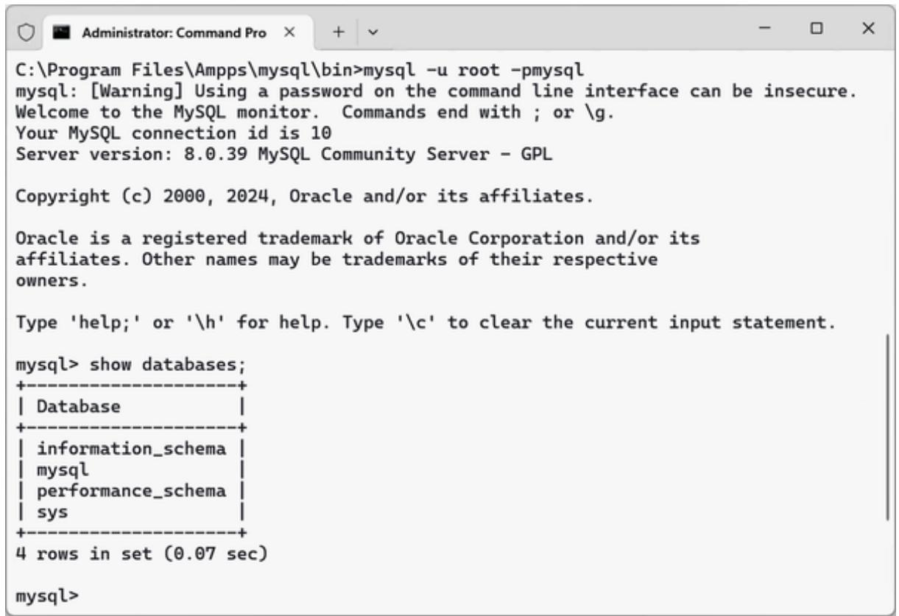

<details>
<summary>text_image</summary>

C:\Program Files\Ampps\mysql\bin>mysql -u root -pmysql
mysql: [Warning] Using a password on the command line interface can be insecure.
Welcome to the MySQL monitor. Commands end with ; or \g.
Your MySQL connection id is 10
Server version: 8.0.39 MySQL Community Server - GPL

Copyright (c) 2000, 2024, Oracle and/or its affiliates.

Oracle is a registered trademark of Oracle Corporation and/or its
affiliates. Other names may be trademarks of their respective
owners.

Type 'help;' or '\h' for help. Type '\c' to clear the current input statement.

mysql> show databases;
+----+
| Database    |
+----+
| information_schema |
| mysql        |
| performance_schema |
| sys         |

+----+
4 rows in set (0.07 sec)

mysql>
</details>

Figure 8-1. Accessing MySQL from a Windows command prompt

You are now ready to move to the next section, “Using the Command-Line Interface”.

**macOS users**

To proceed with this chapter, you should have installed AMPPS as detailed in Chapter 2. You also should have the web server running and the MySQL server started.

To enter the MySQL command-line interface, start the Terminal program (which should be available in Finder→Utilities). Then call up the MySQL program, which will have been installed in the directory /Applications/ampps/mysql/bin.

By default, the initial AMPPS MySQL user is root, and it will have a password of mysql. So, to start the program, type:

/Applications/ampps/mysql/bin/mysql -u root -pmysql

This command tells MySQL to log you in as user root using the password mysql. To verify that all is well, type the following (Figure 8-2 should be the result):

SHOW databases;

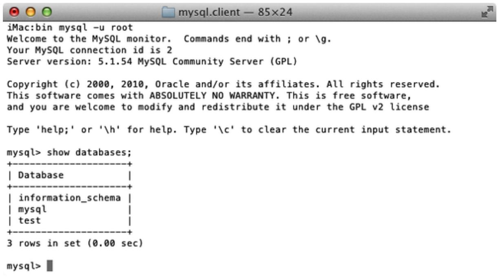

<details>
<summary>text_image</summary>

iMac:bin mysql -u root
Welcome to the MySQL monitor.  Commands end with ; or \g.
Your MySQL connection id is 2
Server version: 5.1.54 MySQL Community Server (GPL)

Copyright (c) 2000, 2010, Oracle and/or its affiliates. All rights reserved.
This software comes with ABSOLUTELY NO WARRANTY. This is free software,
and you are welcome to modify and redistribute it under the GPL v2 license

Type 'help;' or '\h' for help. Type '\c' to clear the current input statement.

mysql> show databases;
+----+
| Database    |
+----+
| information_schema |
| mysql        |
| test         |
+----+
3 rows in set (0.00 sec)

mysql>
</details>

Figure 8-2. Accessing MySQL from the macOS Terminal program

If you receive an error such as Can't connect to local MySQL server through socket, you may need to first start the MySQL server as described in Chapter 2.

You should now be ready to move to the next section, “Using the Command-Line Interface”.

**Linux users**

On a system running a Unix-like operating system such as Linux, you may already have PHP and MySQL installed and running, and be able to enter the examples in this and the following chapters. First, you should type the following to log in to your MySQL system:

mysql -u root -p

This tells MySQL to log you in as the user root and to request your password. If you have a password, enter it; otherwise, just press Return.

Once you are logged in, type the following to test the program—you should see something like Figure 8-3 in response:

SHOW databases;

```markdown
robnix:~$ mysql -u root -p
Enter password:
Welcome to the MySQL monitor. Commands end with ; or \g.
Your MySQL connection id is 1264
Server version: 8.0.39-0ubuntu0.22.04.1 (Ubuntu)

Copyright (c) 2000, 2024, Oracle and/or its affiliates.

Oracle is a registered trademark of Oracle Corporation and/or its affiliates. Other names may be trademarks of their respective owners.

Type 'help;' or '\h' for help. Type '\c' to clear the current input statement.

mysql> show databases;
+----+
| Database    |
+----+
| information_schema |
| mysql        |
| performance_schema |
| sys         |
+----+
4 rows in set (0.02 sec)

mysql>
```  
Figure 8-3. Accessing MySQL using Linux

If this procedure fails at any point, please refer to Chapter 2 to ensure that you have MySQL properly installed. Otherwise, you should now be ready to move to the next section, “Using the Command-Line Interface”.

**MySQL on a remote server**

If you are accessing MySQL on a remote server, it will probably be a Linux/FreeBSD/Unix type of box, and you will connect to it via the secure SSH protocol. Once in there, you might find that things are a little different, depending on how the system administrator has set up the server, especially if it’s a shared hosting server. Therefore, you need to ensure that you have been given access to MySQL and that you have your username and password. Then you can type the following, where username is the name supplied:

Enter your password when prompted. Then enter the following command, which should result in something like Figure 8-3:

SHOW databases;

Other databases already may be created, and the test database may not be there.

Bear in mind also that system administrators have ultimate control over everything and that you can encounter some unexpected setups. For example, you may find that you are required to preface all database names that you create with a unique identifying string to ensure that your names do not conflict with those of databases created by other users.

Therefore, if you have any problems, talk with your system administrator, who will get you sorted out. Just let the sysadmin know that you need a username and password. You should also ask for the ability to create new databases or, at a minimum, to have at least one database created for you ready to use. You can then create all the tables you require within that database.

### Using the Command-Line Interface

From here on, it makes no difference whether you are using Windows, macOS, or Linux to access MySQL directly, as all the commands used (and errors you may receive) are identical.

**The semicolon**

Let’s start with the basics. Did you notice the semicolon (;) at the end of the SHOW databases; command that you typed? The semicolon is used by MySQL to separate or end commands. If you forget to enter it, MySQL will issue a prompt and wait for you to do so. The required semicolon was made part of the syntax to let you enter multiline commands, which can be convenient because some commands get quite long. It also allows you to issue more than one command at a time by placing a semicolon after each one. The interpreter gets them all in a batch when you press the Enter (or Return) key and executes them in order.

**NOTE**

It’s very common to receive a MySQL prompt instead of the results of your command; it means that you forgot the final semicolon. Just enter the semicolon and press the Enter key, and you’ll get what you want.

There are six different prompts that MySQL may present you with (see Table 8-2), so you will always know where you are during a multiline input.

Table 8-2. MySQL’s six command prompts

<table><tr><td>MySQL prompt</td><td>Meaning</td></tr><tr><td>mysql&gt;</td><td>Ready and waiting for a command</td></tr><tr><td>-&gt;</td><td>Waiting for the next line of a command</td></tr><tr><td>&#x27;&gt;</td><td>Waiting for the next line of a string started with a single quote</td></tr><tr><td>&quot;&gt;</td><td>Waiting for the next line of a string started with a double quote</td></tr><tr><td>&#x27;&gt;</td><td>Waiting for the next line of a string started with a backtick</td></tr><tr><td>/&gt;</td><td>Waiting for the next line of a comment started with /*</td></tr></table>

Canceling a command

If you are partway through entering a command and decide you don’t wish to execute it, you can enter \c and press Return. This is handy if you are within a set of multiline statements or simply to save you backspacing a lot. Example 8-1 shows how to use the command.

Example 8-1. Canceling a line of input

meaningless gibberish \c

When you type that line, MySQL will ignore everything you typed and issue a new prompt. Without the \c, it would have displayed an error message. Be careful, though: if you have opened a string or comment, close it first before using the \c or MySQL will think the \c is just part of the string. Example 8-2 shows the right way to do this.

Example 8-2. Canceling input from inside a string

this is "meaningless gibberish" \c

Also note that using \c after a semicolon will not cancel the preceding command, as it is then a new statement.

### MySQL Commands

You’ve already seen the SHOW command, which lists tables, databases, and many other items. The commands you’ll use most often are listed in Table 8-3.

Table 8-3. Common MySQL commands

<table><tr><td>Command</td><td>Action</td></tr><tr><td>ALTER</td><td>Alter a database or table</td></tr><tr><td>BACKUP</td><td>Back up a table</td></tr><tr><td>\c</td><td>Cancel input</td></tr><tr><td>CREATE</td><td>Create a database, table, or index</td></tr><tr><td>DELETE</td><td>Delete a row from a table</td></tr><tr><td>DESCRIBE</td><td>Describe a table's columns</td></tr><tr><td>DROP</td><td>Delete a database or table</td></tr><tr><td>EXIT (Ctrl-C)</td><td>Exit (on some systems)</td></tr><tr><td>GRANT</td><td>Change user privileges</td></tr><tr><td>HELP (\h, \?)</td><td>Display help</td></tr><tr><td>INSERT</td><td>Insert data</td></tr><tr><td>LOCK</td><td>Lock table(s)</td></tr><tr><td>QUIT (\q)</td><td>Same as EXIT</td></tr><tr><td>RENAME</td><td>Rename a table</td></tr><tr><td>SHOW</td><td>List details about database(s), table(s), column(s), or server status</td></tr><tr><td>SOURCE</td><td>Execute a file</td></tr><tr><td>STATUS (\s)</td><td>Display the current status</td></tr><tr><td>TRUNCATE</td><td>Empty a table</td></tr><tr><td>UNLOCK</td><td>Unlock table(s)</td></tr><tr><td>UPDATE</td><td>Update an existing record</td></tr><tr><td>USE</td><td>Use a database</td></tr></table>

I’ll cover most of these as we proceed, but first, you need to remember a couple of points about MySQL commands:

SQL commands and keywords are case-insensitive. CREATE, create, and CrEaTe all mean the same thing. However, for the sake of clarity, you may prefer to use uppercase.  
Table names are case-sensitive on Linux and macOS but caseinsensitive on Windows. For the sake of portability, you should always choose a case and stick to it. The recommended style is to use lowercase for table names.

**Creating a database**

If you are working on a remote server and have only a single user account and access to a single database that was created for you, move on to “Creating a table”. Otherwise, get the ball rolling by issuing the following command to create a new database called publications:

CREATE DATABASE publications;

A successful command will return a message that doesn’t mean much yet— Query OK, 1 row affected (0.00 sec)—but will make sense soon.

Now that you’ve created the database, you want to work with it, so issue the following command:

USE publications;

You should now see the message Database changed, and you will be set to proceed with the following examples.

**Creating users**

Now that you’ve seen how to use MySQL and create your first database, it’s time to look at how you create users, as you probably won’t want to grant your PHP scripts root access to MySQL—it could cause a real headache should you get hacked.

To create a user, issue the CREATE USER command, which takes the following form (don’t type this in; it’s not an actual working command):

CREATE USER 'username'@'hostname' IDENTIFIED BY 'password'; GRANT PRIVILEGES ON database.object TO 'username'@'hostname';

This should all look pretty straightforward, with the possible exception of the database.object part, which refers to the database itself and the objects it contains, such as tables (see Table 8-4).

Table 8-4. Example parameters for the  command

<table><tr><td>Arguments</td><td>Meaning</td></tr><tr><td>*.*</td><td>All databases and all their objects</td></tr><tr><td>database.*</td><td>Only the database called database and all its objects</td></tr><tr><td>database.object</td><td>Only the database called database and its object called object</td></tr></table>

So, let’s create a user who can access just the new publications database and all its objects, by entering the following commands (replacing the username jim and also the password password with ones of your choosing):

CREATE USER 'jim'@'localhost' IDENTIFIED BY 'password';

GRANT ALL ON publications.\* TO 'jim'@'localhost';

This allows the user jim@localhost full access to the publications database using the password password. You can test whether this step has worked by entering quit to exit and then rerunning MySQL the way you did before, but instead of logging in as root, log in with whatever username you created. See Table 8-5 for the correct command for your operating system. Modify it as necessary if the mysql client program is installed in a different directory on your system.

Table 8-5. Starting MySQL and logging in as jim@localhost

<table><tr><td>OS</td><td>Example command</td></tr><tr><td>Windows</td><td>C:\&quot;Program Files\Ampps\mysql\bin\mysql&quot; -u jim -p</td></tr><tr><td>macOS</td><td>/Applications/ampps/mysql/bin/mysql -u jim -p</td></tr><tr><td>Linux</td><td>mysql -u jim -p</td></tr></table>

All you have to do now is enter your password when prompted, and you will be logged in.

If you choose to, you can place your password immediately following the - p (without any spaces) to avoid having to enter it when prompted, but this is considered poor practice because if other people are logged in to your system, there may be ways for them to look at the command you entered and find out your password.

**NOTE**

You can grant only privileges that you already have, and you must also have the privilege to issue GRANT commands. There are a whole range of privileges you can choose to grant if you are not granting all privileges. For further details on the GRANT command and the REVOKE command, which can remove privileges once granted, see the documentation. Also, be aware that if you create a new user but do not specify an IDENTIFIED BY clause, the user will have no password, a situation that is very insecure and should be avoided.

**Creating a table**

At this point, you should be logged in to MySQL with ALL privileges granted for the database publications (or a database that was created for you), so you’re ready to create your first table. Make sure the correct database is in use by typing the following (replacing publications with the name of your database if it is different):

USE publications;

Now enter the command in Example 8-3 one line at a time.

Example 8-3. Creating a table called classics

```sql
CREATE TABLE classics (
author VARCHAR(128),
title VARCHAR(128),
type VARCHAR(16),
year CHAR(4)) ENGINE InnoDB;
```

**NOTE**

The final two words in this command require a little explanation. MySQL can process queries in many different ways internally, and these different ways are supported by different engines. From version 5.6 onward InnoDB is the default storage engine for MySQL, and we use it here because it supports FULLTEXT searches. As long as you have a relatively up-to-date version of MySQL, you can omit the ENGINE InnoDB section of the command when creating a table, but I have kept it in for now to emphasize that this is the engine being used.

InnoDB is generally more efficient and the recommended option. If you installed the AMPPS stack as detailed in Chapter 2, you should have at least version 5.6.35 of MySQL.

**NOTE**

You could also issue the previous command on a single line, like this:

CREATE TABLE classics (author VARCHAR(128), title VARCHAR(128), type VARCHAR(16), year CHAR(4)) ENGINE InnoDB;

But MySQL commands can be long and complicated, so I recommend using the format shown in Example 8-3 until you are comfortable with longer ones.

MySQL should then issue the response Query OK, 0 rows affected, along with how long it took to execute the command. If you see an error message instead, check your syntax carefully. Every parenthesis and comma counts, and typing errors are easy to make.

To check whether your new table has been created, type:

DESCRIBE classics;

All being well, you will see the sequence of commands and responses shown in Example 8-4, where you should particularly note the table format

```txt
mysql> USE publications;
Database changed
mysql> CREATE TABLE classics (
-> author VARCHAR(128),
-> title VARCHAR(128),
-> type VARCHAR(16),
-> year CHAR(4)) ENGINE InnoDB;
Query OK, 0 rows affected (0.03 sec)
```

```txt
mysql> DESCRIBE classics;
| Field | Type | Null | Key | Default | Extra |
| author | varchar(128) | YES | | NULL | |
| title | varchar(128) | YES | | NULL | |
| type | varchar(16) | YES | | NULL | |
| year | char(4) | YES | | NULL | |
+----+----+----+----+----+
4 rows in set (0.00 sec)
```

The DESCRIBE command is an invaluable debugging aid when you need to ensure that you have correctly created a MySQL table. You can also use it to remind yourself about a table’s field or column names and the types of data in each one. Let’s look at each of the headings:

**Field**

The name of each field or column within a table

**Type**

The type of data being stored in the field

**Null**

Whether the field is allowed to contain a value of NULL

**Key**

What type of key, if any, has been applied (keys or indexes in MySQL are quick ways to look up and search for data)

**Default**

The default value that will be assigned to the field if no value is specified when a new row is created

**Extra**

Additional information, such as whether a field is set to auto-increment

### Data Types

In Example 8-3, you may have noticed that three of the table’s fields were given the data type of VARCHAR, and one was given the type CHAR. The term VARCHAR stands for VARiable length CHARacter string, and the command takes a numeric value that tells MySQL the maximum length allowed for a string stored in this field.

Both CHAR and VARCHAR accept text strings and impose a limit on the size of the field. The difference is that every string in a CHAR field has the specified size. If you put in a smaller string, it is padded with spaces. A VARCHAR field does not pad the text; it lets the size of the field vary to fit the text that is inserted. But VARCHAR requires a small amount of overhead to keep track of the size of each value. So, CHAR is slightly more efficient if the sizes are similar in all records, whereas VARCHAR is more efficient if sizes can vary a lot and get large. In addition, the overhead causes access to VARCHAR data to be slightly slower than to CHAR data, but in most use cases that’s not a concern as the performance difference will not be noticeable.

Another feature of character and text columns, important for today’s global web reach, is character sets. These assign particular binary values to particular characters. The character set you use for English is obviously different from the one you’d use for Russian. You can assign the character set to a character or text column when you create it.

VARCHAR is useful in our example, because it can accommodate author names and titles of different lengths while helping MySQL plan the size of the database and perform lookups and searches more easily. Just be aware that if you ever attempt to assign a string value longer than the length allowed, it will be truncated to the maximum length declared in the table definition.

The year field, however, has predictable values, so instead of VARCHAR we use the more efficient CHAR(4) data type. The parameter of 4 allows for 4 bytes of data, supporting all years from –999 to 9999; a byte comprises 8 bits and can have the values 00000000 through 11111111, which are 0 to 255 in decimal.

You could, of course, just store two-digit values for the year, but if your data is still going to be needed in the following century, or may otherwise wrap around, it will have to be sanitized first. Think of the “millennium bug” that would have caused dates beginning on January 1, 2000, to be treated as 1900 on many of the world’s biggest computer installations.

**NOTE**

I didn’t use the YEAR data type in the classics table because it supports only the years 0000 and 1901 through 2155. This is because MySQL stores the year in a single byte for reasons of efficiency, but it means that only 256 years are available, and the publication years of the titles in the classics table are well before 1901. I used the CHAR type instead, but another option is to use either the INT or the SMALLINT data type.

**The CHAR data type**

Table 8-6 lists the CHAR data types. Both types offer a parameter that sets the maximum (or exact) length of the string allowed in the field. As the table shows, each type has a built-in maximum number of bytes it can occupy.

Table 8-6. MySQL’s  data types

<table><tr><td>Data type</td><td>Bytes used</td><td>Examples</td></tr><tr><td>CHAR(n)</td><td>Exactly n (&lt;= 255)</td><td>CHAR(5) “Hello” uses 5 bytesCHAR(57) “Goodbye” uses 57 bytes</td></tr><tr><td>VARCHAR(n)</td><td>Up to n (&lt;= 65535)</td><td>VARCHAR(7) “Hello” uses 5 bytesVARCHAR(100) “Goodbye” uses 7 bytes</td></tr></table>

**The BINARY data type**

The BINARY data types (see Table 8-7) store strings of bytes that do not have an associated character set. For example, you might use the BINARY data type to store a GIF image.

Table 8-7. MySQL’s  data types

<table><tr><td>Data type</td><td>Bytes used</td><td>Examples</td></tr><tr><td>BINARY(n)</td><td>Exactly n (&lt;= 255)</td><td>As CHAR but contains binary data</td></tr><tr><td>VARBINARY(n)</td><td>Up to n (&lt;= 65535)</td><td>As VARCHAR but contains binary data</td></tr></table>

**The TEXT data types**

Character data can also be stored in one of the TEXT fields. The differences between these fields and VARCHAR fields are small:

TEXT fields cannot have default values.  
MySQL indexes only the first n characters of a TEXT column (you specify n when you create the index).

What this means is that VARCHAR is the better and faster data type to use if you need to search the entire contents of a field. If you will never search more than a certain number of leading characters in a field, use a TEXT data type (see Table 8-8).

Table 8-8. MySQL’s  data types

<table><tr><td>Data type</td><td>Bytes used</td><td>Attributes</td></tr><tr><td>TINYTEXT(n)</td><td>Up to n (&lt;= 255)</td><td>Treated as a string with a character set</td></tr><tr><td>TEXT(n)</td><td>Up to n (&lt;= 65535)</td><td>Treated as a string with a character set</td></tr><tr><td>MEDIUMTEXT(n)</td><td>Up to n (&lt;= 1.67e + 7)</td><td>Treated as a string with a character set</td></tr><tr><td>LONGTEXT(n)</td><td>Up to n (&lt;= 4.29e + 9)</td><td>Treated as a string with a character set</td></tr></table>

The data types that have smaller maximums are also more efficient; therefore, you should use the one with the smallest yet reasonable maximum that you know is enough for any string you will be storing in the field.

**The BLOB data types**

The term BLOB stands for Binary Large Object, and therefore, as you would think, the BLOB data type is most useful for binary data in excess of 65,536 bytes. The main other difference between the BLOB and BINARY data types is that BLOBs cannot have default values. The BLOB data types are listed in Table 8-9.

Table 8-9. MySQL’s  data types

<table><tr><td>Data type</td><td>Bytes used</td><td>Attributes</td></tr><tr><td>TINYBLOB(n)</td><td>Up to n (&lt;= 255)</td><td>Treated as binary data—no character set</td></tr><tr><td>BLOB(n)</td><td>Up to n (&lt;= 65535)</td><td>Treated as binary data—no character set</td></tr><tr><td>MEDIUMBLOB(n)</td><td>Up to n (&lt;= 1.67e + 7)</td><td>Treated as binary data—no character set</td></tr><tr><td>LONGBLOB(n)</td><td>Up to n (&lt;= 4.29e + 9)</td><td>Treated as binary data—no character set</td></tr></table>

**Numeric data types**

MySQL supports various numeric data types, from a single byte up to double-precision floating-point numbers. Although the most memory that a numeric field can use up is 8 bytes, you are well advised to choose the smallest data type that will adequately handle the largest value you expect. This will help keep your databases small and quickly accessible.

Table 8-10 lists the numeric data types supported by MySQL and the ranges of values they can contain. In case you are not acquainted with the terms, a signed number is one with a possible range from a minus value, through 0, to a positive one. An unsigned number has a value ranging from 0 to a positive one. They can both hold the same number of values; just picture a signed number as being shifted halfway to the left so that half its values are negative and half are positive. Note that floating-point values (of any precision) may only be signed.

Table 8-10. MySQL’s numeric data types

<table><tr><td rowspan="2">Data type</td><td rowspan="2">Bytes used</td><td colspan="2">Minimum value</td><td>Maxi</td></tr><tr><td>Signed</td><td>Unsigned</td><td>Sign</td></tr><tr><td>TINYINT</td><td>1</td><td>-128</td><td>0</td><td>127</td></tr><tr><td>SMALLINT</td><td>2</td><td>-32768</td><td>0</td><td>32767</td></tr><tr><td>MEDIUMINT</td><td>3</td><td>-8.38e + 6</td><td>0</td><td>8.38e</td></tr><tr><td>INT / INTEGER</td><td>4</td><td>-2.15e + 9</td><td>0</td><td>2.15e</td></tr><tr><td>BIGINT</td><td>8</td><td>-9.22e + 18</td><td>0</td><td>9.22e</td></tr><tr><td>FLOAT</td><td>4</td><td>-3.40e + 38</td><td>n/a</td><td>3.4e -</td></tr><tr><td>DOUBLE / REAL</td><td>8</td><td>-1.80e + 308</td><td>n/a</td><td>1.80e</td></tr></table>

To specify whether a data type is unsigned, use the UNSIGNED qualifier. The following example creates a table called tablename with a field in it called fieldname of the data type UNSIGNED INTEGER:

CREATE TABLE tablename (fieldname INT UNSIGNED);

When creating a numeric field, you can also pass an optional number as a parameter, like this:

CREATE TABLE tablename (fieldname INT(4));

But you must remember that, unlike with the BINARY and CHAR data types, this parameter does not indicate the number of bytes of storage to use. It may seem counterintuitive, but what the number actually represents is the display width of the data in the field when it is retrieved. It is commonly used with the ZEROFILL qualifier, like this:

CREATE TABLE tablename (fieldname INT(4) ZEROFILL);

What this does is cause any numbers with a width of less than four characters to be padded with one or more zeros, sufficient to make the display width of the field four characters long. When a field is already of the specified width or greater, no padding takes place.

**DATE and TIME types**

The main remaining data types supported by MySQL relate to the date and time and can be seen in Table 8-11.

Table 8-11. MySQL’s  and  data types

<table><tr><td>Data type</td><td>Time/date format</td></tr><tr><td>DATETIME</td><td>&#x27;0000-00-00 00:00:00&#x27;</td></tr><tr><td>DATE</td><td>&#x27;0000-00-00&#x27;</td></tr><tr><td>TIMESTAMP</td><td>&#x27;0000-00-00 00:00:00&#x27;</td></tr><tr><td>TIME</td><td>&#x27;00:00:00&#x27;</td></tr><tr><td>YEAR</td><td>0000 (Only years 0000 and 1901–2155)</td></tr></table>

The DATETIME and TIMESTAMP data types display the same way. The main difference is that TIMESTAMP has a very narrow range (from the years 1970 through 2037), whereas DATETIME will hold just about any date you’re likely to specify, unless you’re interested in ancient history or science fiction.

TIMESTAMP is useful, however, because you can let MySQL set the value for you. If you don’t specify the value when adding a row, the current time is automatically inserted. You can also have MySQL update a TIMESTAMP column each time you change a row.

**The AUTO\_INCREMENT attribute**

Sometimes you need to ensure that every row in your database is guaranteed to be unique. You could do this in your program by carefully checking the data you enter and making sure there is at least one value that differs in any two rows, but this approach is error-prone and works only in certain circumstances. In the classics table, for instance, an author may appear multiple times. Likewise, the year of publication will also be frequently duplicated, and so on. It would be hard to guarantee that you have no duplicate rows. It is also difficult to guarantee unique rows when multiple scripts can insert rows into the same table in parallel.

The general solution is to use an extra column just for this purpose. In a while, we’ll look at using a publication’s ISBN (International Standard Book Number), but first I’d like to introduce the AUTO\_INCREMENT data attribute.

As its name implies, a column given this attribute will set the value of its contents to that of the column entry in the previously inserted row, plus 1. Example 8-5 shows how to add a new column called id to the table classics with auto-incrementing.

Example 8-5. Adding the auto-incrementing column id

ALTER TABLE classics ADD id INT UNSIGNED NOT NULL AUTO\_INCREMENT KEY;

This is your introduction to the ALTER command, which is very similar to CREATE. ALTER operates on an existing table and can add, change, or delete columns. Our example adds a column named id with the following characteristics:

**INT UNSIGNED**

Makes the column take an integer large enough for us to store more than 4 billion records in the table.

**NOT NULL**

Ensures that every column has a value. Many programmers use NULL in a field to indicate that it doesn’t have any value. But that would allow duplicates, which would violate the whole reason for this column’s existence, so we disallow NULL values.

**AUTO\_INCREMENT**

Causes MySQL to set a unique value for this column in every row, as described earlier. We don’t really have control over the value that this column will take in each row, but we don’t care: all we care about is that we are guaranteed a unique value.

**KEY**

An auto-increment column is useful as a key, because you will tend to search for rows based on this column. This will be explained in “Indexes”.

Each entry in the column id will now have a unique number, with the first starting at 1 and the others counting upward from there. And whenever a new row is inserted, its id column will automatically be given the next number in the sequence.

Rather than applying the column retroactively, you could have included it by issuing the CREATE command in a slightly different format. In that case, the command in Example 8-3 would be replaced with Example 8-6. Check the final line in particular.

Example 8-6. Adding the auto-incrementing id column at table creation

```sql
CREATE TABLE classics (
    author VARCHAR(128),
    title VARCHAR(128),
    type VARCHAR(16),
    year CHAR(4),
    id INT UNSIGNED NOT NULL AUTO_INCREMENT KEY) ENGINE InnoDB;
```

If you wish to check whether the column has been added, use the following command to view the table’s columns and data types:

DESCRIBE classics;

Now that we’ve finished with it, the id column is no longer needed, so if you created it using Example 8-5, you should now remove the column using the command in Example 8-7.

Example 8-7. Removing the id column

ALTER TABLE classics DROP id;

**Adding data to a table**

To add data to a table, use the INSERT command. Let’s see this in action by populating the table classics with the data from Table 8-1, using one form of the INSERT command repeatedly (Example 8-8).

Example 8-8. Populating the classics table

```sql
INSERT INTO classics(author, title, type, year)
VALUES('Mark Twain', 'The Adventures of Tom Sawyer', 'Fiction', '1876');
INSERT INTO classics(author, title, type, year)
VALUES('Jane Austen', 'Pride and Prejudice', 'Fiction', '1811');
INSERT INTO classics(author, title, type, year)
VALUES('Charles Darwin', 'The Origin of Species', 'Nonfiction', '1856');
INSERT INTO classics(author, title, type, year)
VALUES('Charles Dickens', 'The Old Curiosity Shop', 'Fiction', '1841');
INSERT INTO classics(author, title, type, year)
VALUES('William Shakespeare', 'Romeo and Juliet', 'Play', '1594');
```

After every second line, you should see a Query OK message. Once all lines have been entered, type the following command, which will display the table’s contents. The result should look like Figure 8-4:

SELECT \* FROM classics;

Don’t worry about the SELECT command for now—we’ll come to it in “Querying a MySQL Database”. Suffice it to say that, as typed, it will display all the data you just entered.

Also, don’t worry if you see the returned results in a different order; this is normal because the order is unspecified at this point. Later in this chapter we will learn how to use ORDER BY to choose the order in which we want results to be returned, but for now, they can appear in any order.

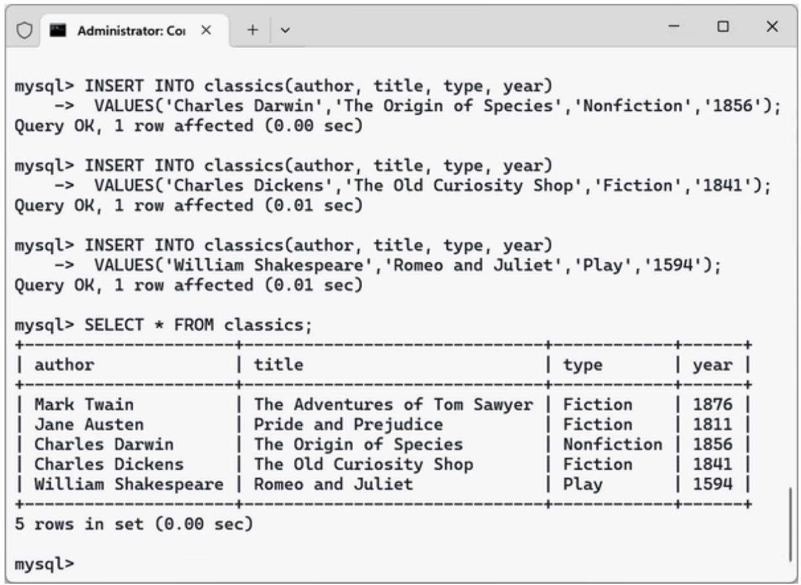

<details>
<summary>text_image</summary>

mysql> INSERT INTO classics(author, title, type, year)
    -> VALUES('Charles Darwin','The Origin of Species','Nonfiction','1856');
Query OK, 1 row affected (0.00 sec)

mysql> INSERT INTO classics(author, title, type, year)
    -> VALUES('Charles Dickens','The Old Curiosity Shop','Fiction','1841');
Query OK, 1 row affected (0.01 sec)

mysql> INSERT INTO classics(author, title, type, year)
    -> VALUES('William Shakespeare','Romeo and Juliet','Play','1594');
Query OK, 1 row affected (0.01 sec)

mysql> SELECT * FROM classics;
+----+----+----+----+
| author | title | type | year |
+----+----+----+----+
| Mark Twain | The Adventures of Tom Sawyer | Fiction | 1876 |
| Jane Austen | Pride and Prejudice | Fiction | 1811 |
| Charles Darwin | The Origin of Species | Nonfiction | 1856 |
| Charles Dickens | The Old Curiosity Shop | Fiction | 1841 |
| William Shakespeare | Romeo and Juliet | Play | 1594 |
+----+----+----+----+
5 rows in set (0.00 sec)

mysql>
</details>

Figure 8-4. Populating the classics table and viewing its contents

Let’s go back and look at how we used the INSERT command. The first part, INSERT INTO classics, tells MySQL where to insert the following data. Then, within parentheses, the four column names are listed—author, title, type, and year—all separated by commas. This tells MySQL that these are the fields into which the data is to be inserted.

The second line of each INSERT command contains the keyword VALUES followed by four strings within parentheses, separated by commas. This supplies MySQL with the four values to be inserted into the four columns previously specified. (As always, my choice of where to break the lines was arbitrary.)

Each item of data will be inserted into the corresponding column, in a oneto-one correspondence. If you accidentally listed the columns in a different order from the data, the data would go into the wrong columns. Also, the number of columns must match the number of data items. (There are safer ways of using INSERT, which we’ll see soon.)

**Renaming a table**

Renaming a table, like any other change to the structure or metainformation about a table, is achieved via the ALTER command. So, for example, to change the name of the table classics to pre1900, you would use this command:

ALTER TABLE classics RENAME pre1900;

If you tried the command, you should revert the table name by entering the following so that later examples in this chapter will work as printed:

ALTER TABLE pre1900 RENAME classics;

Changing the data type of a column

Changing a column’s data type also uses the ALTER command, this time in conjunction with the MODIFY keyword. To change the data type of the column year from CHAR(4) to SMALLINT (which requires only 2 bytes of storage and so will save disk space), enter:

**ALTER TABLE classics MODIFY year SMALLINT;**

When you do this, if the conversion of data type makes sense to MySQL, it will automatically change the data while keeping the meaning. In this case, it will change each string to a comparable integer, so long as the string is recognizable as referring to an integer.

**Adding a new column**

Let’s suppose that you have created a table and populated it with plenty of data, only to discover you need an additional column. Not to worry. Here’s how to add the new column pages, which will be used to store the number of pages in a publication:

**ALTER TABLE classics ADD pages SMALLINT UNSIGNED;**

This adds the new column with the name pages using the UNSIGNED SMALLINT data type, sufficient to hold a value of up to 65,535—hopefully that’s more than enough for any book ever published!

If you ask MySQL to describe the updated table by using the DESCRIBE command, as follows, you will see the change has been made (see Figure 8- 5):

DESCRIBE classics;

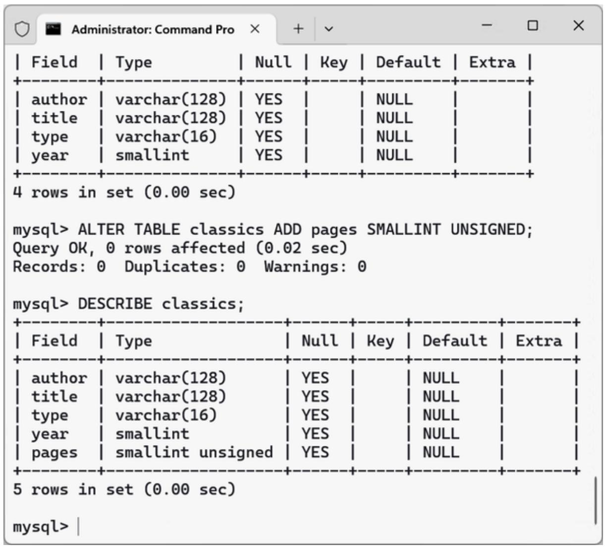

<details>
<summary>text_image</summary>

| Field | Type | Null | Key | Default | Extra |
+----+----+----+----+----+
| author | varchar(128) | YES | | NULL | |
| title | varchar(128) | YES | | NULL | |
| type | varchar(16) | YES | | NULL | |
| year | smallint | YES | | NULL | |
+----+----+----+----+----+
4 rows in set (0.00 sec)
mysql> ALTER TABLE classics ADD pages SMALLINT UNSIGNED;
Query OK, 0 rows affected (0.02 sec)
Records: 0 Duplicates: 0 Warnings: 0
mysql> DESCRIBE classics;
+----+----+----+----+----+
| Field | Type | Null | Key | Default | Extra |
+----+----+----+----+----+
| author | varchar(128) | YES | | NULL | |
| title | varchar(128) | YES | | NULL | |
| type | varchar(16) | YES | | NULL | |
| year | smallint | YES | | NULL | |
| pages | smallint unsigned | YES | | NULL | |
+----+----+----+----+----+
5 rows in set (0.00 sec)
mysql>
</details>

Figure 8-5. Adding the new pages column and viewing the table

**Renaming a column**

Looking again at Figure 8-5, you may decide that having a column named type is confusing, because that is the name used by MySQL to identify data types. Again, no problem—let’s change its name to category, like this:

ALTER TABLE classics CHANGE type category VARCHAR(16);

Note the addition of VARCHAR(16) on the end of this command. That’s because the CHANGE keyword requires the data type to be specified, even if you don’t intend to change it, and VARCHAR(16) was the data type specified when that column was initially created as type.

**Removing a column**

Actually, upon reflection, you might decide that the page count column pages isn’t all that useful for this particular database, so here’s how to remove that column by using the DROP keyword:

ALTER TABLE classics DROP pages;

**WARNING**

Remember that DROP is irreversible. You should always use it with caution, because you could inadvertently delete entire tables (and even databases) if you are not careful!

**Deleting a table**

Deleting a table is very easy indeed. But because I don’t want you to have to reenter all the data for the classics table, let’s quickly create a new table, verify its existence, and then delete it. You can do this by typing the commands in Example 8-9. The result of these four commands should look like Figure 8-6.

Example 8-9. Creating, viewing, and deleting a table

CREATE TABLE disposable(trash INT);

DESCRIBE disposable;

DROP TABLE disposable;

SHOW tables;

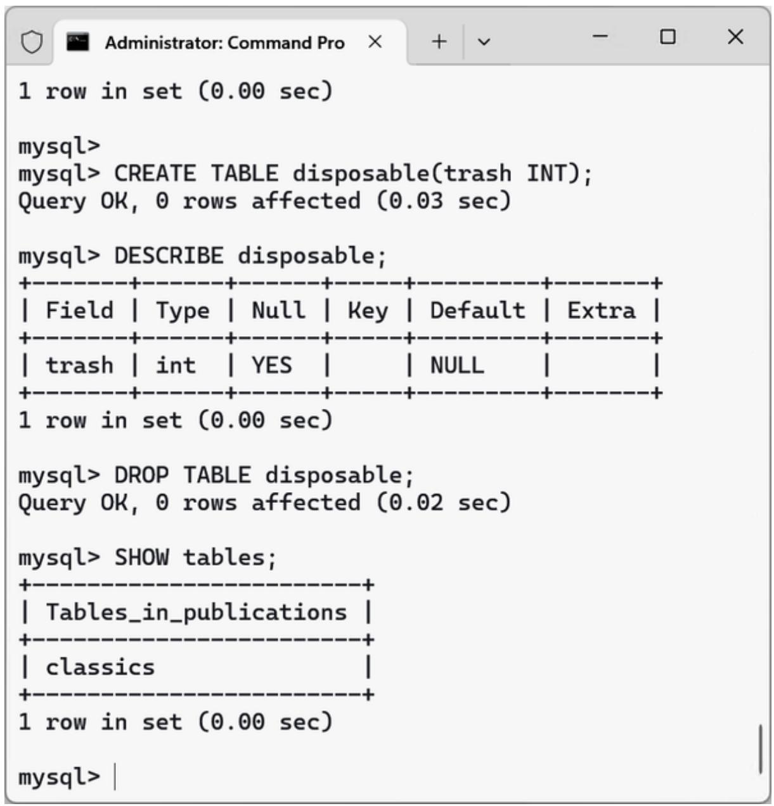

<details>
<summary>text_image</summary>

1 row in set (0.00 sec)

mysql>

mysql> CREATE TABLE disposable(trash INT);
Query OK, 0 rows affected (0.03 sec)

mysql> DESCRIBE disposable;
+----+----+----+----+----+
| Field | Type | Null | Key | Default | Extra |
+----+----+----+----+----+
| trash | int | YES |    | NULL    |
+----+----+----+----+----+
1 row in set (0.00 sec)

mysql> DROP TABLE disposable;
Query OK, 0 rows affected (0.02 sec)

mysql> SHOW tables;
+----+----+
| Tables_in_publications |
+----+----+
| classics            |
+----+----+
1 row in set (0.00 sec)

mysql>
</details>

Figure 8-6. Creating, viewing, and deleting a table

## Indexes

As things stand, the table classics works and can be searched without problem by MySQL—until it grows to more than a couple of hundred rows. At that point, database accesses will get slower and slower with every new row added, because MySQL has to search through every row whenever a query is issued. This is like searching through every book in a library whenever you need to look something up.

Of course, you don’t have to search libraries that way, because they have either a card index system or, most likely, a database of their own. And the same goes for MySQL, because at the expense of a slight overhead in memory and disk space, you can create a “card index” for a table that MySQL will use to conduct lightning-fast searches.

### Creating an Index

The way to achieve fast searches is to add an index, either when creating a table or at any time afterward. But the decision is not so simple. For example, there are different index types, such as a regular INDEX, a PRIMARY KEY, or a FULLTEXT index. Also, you must decide which columns require an index, a judgment that requires you to predict whether you will be searching any of the data in each column. Indexes can get more complicated too, because you can combine multiple columns in one index. And even when you’ve decided that, you still have the option of reducing index size by limiting the amount of each column to be indexed.

If we imagine the searches that might be made on the classics table, it becomes apparent that all of the columns may need to be searched.

However, if the pages column created in “Adding a new column” had not been deleted, it would probably not have needed an index, as most people would be unlikely to search for books by the number of pages they have. Anyway, go ahead and add an index to each of the columns, using the commands in Example 8-10.

Example 8-10. Adding indexes to the classics table

```sql
ALTER TABLE classics ADD INDEX(author(20));
ALTER TABLE classics ADD INDEX(title(20));
ALTER TABLE classics ADD INDEX(category(4));
ALTER TABLE classics ADD INDEX(year);
DESCRIBE classics;
```

The first two commands create indexes on the author and title columns, limiting each index to only the first 20 characters. For instance, when MySQL indexes the following title:

The Adventures of Tom Sawyer

it will actually store in the index only the first 20 characters:

The Adventures of To

This is done to minimize the size of the index and to optimize database access speed. I chose 20 because it’s likely to be sufficient to ensure uniqueness for most strings in these columns. If MySQL finds two indexes with the same contents, it will have to waste time going to the table itself and checking the column that was indexed to find out which rows really matched.

With the category column, currently only the first character is required to identify a string as unique (F for Fiction, N for Nonfiction, and P for Play), but I chose an index of four characters to allow for future categories that may share the first three characters. You can also reindex this column later, when you have a more complete set of categories. And finally, I set no limit to the year column’s index, because it has a clearly defined length of four characters.

The results of issuing these commands (and a DESCRIBE command to confirm that they worked) can be seen in Figure 8-7, which shows the key MUL for each column. This key means that multiple occurrences of a value may occur within that column, which is exactly what we want, as authors may appear many times, the same book title could be used by multiple authors, and so on.

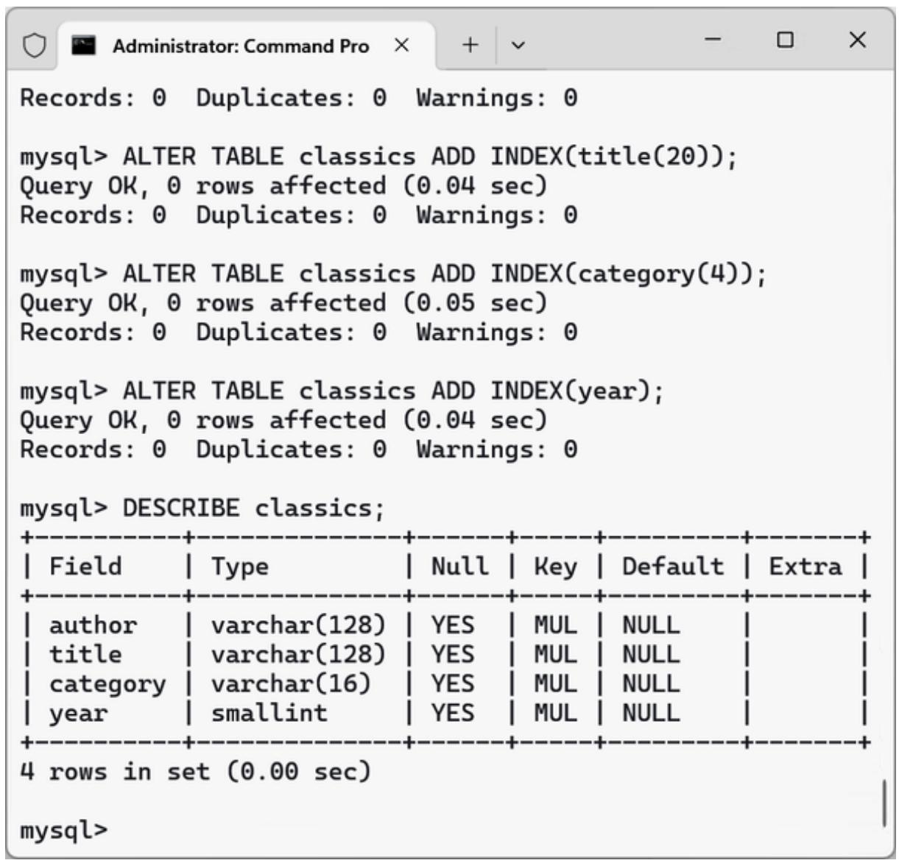

<details>
<summary>text_image</summary>

Records: 0 Duplicates: 0 Warnings: 0

mysql> ALTER TABLE classics ADD INDEX(title(20));
Query OK, 0 rows affected (0.04 sec)
Records: 0 Duplicates: 0 Warnings: 0

mysql> ALTER TABLE classics ADD INDEX(category(4));
Query OK, 0 rows affected (0.05 sec)
Records: 0 Duplicates: 0 Warnings: 0

mysql> ALTER TABLE classics ADD INDEX(year);
Query OK, 0 rows affected (0.04 sec)
Records: 0 Duplicates: 0 Warnings: 0

mysql> DESCRIBE classics;
+----+----+----+----+----+
| Field | Type | Null | Key | Default | Extra |
+----+----+----+----+----+
| author | varchar(128) | YES | MUL | NULL |
| title | varchar(128) | YES | MUL | NULL |
| category | varchar(16) | YES | MUL | NULL |
| year | smallint | YES | MUL | NULL |
+----+----+----+----+----+
4 rows in set (0.00 sec)

mysql>
</details>

Figure 8-7. Adding indexes to the classics table

**Using CREATE INDEX**

An alternative to using ALTER TABLE to add an index is to use the CREATE INDEX command. They are equivalent, except that CREATE INDEX cannot be used for creating a PRIMARY KEY (see “Primary keys”). The format of this command is shown in the second line of Example 8-11.

Example 8-11. These two commands are equivalent

**Adding indexes when creating tables**

You don’t have to wait until after creating a table to add indexes. In fact, doing so can be time-consuming, as adding an index to a large table can take a very long time. In fact, you can start planning your tables on paper or using a diagram tool before you write even a single SQL query. Therefore, let’s look at a command that creates the table classics with indexes already in place.

Example 8-12 is a reworking of Example 8-3 in which the indexes are created at the same time as the table. Note that to incorporate the modifications made in this chapter, this version uses the new column name category instead of type and sets the data type of year to SMALLINT instead of CHAR(4). If you want to try it out without first deleting your current classics table, change the word classics in line 1 to something else like classics1, and then drop classics1 after you have finished with it.

Example 8-12. Creating the table classics with indexes

```sql
CREATE TABLE classics (
author VARCHAR(128),
title VARCHAR(128),
category VARCHAR(16),
year SMALLINT,
INDEX(author(20)),
INDEX(title(20)),
INDEX(category(4)),
INDEX(year)) ENGINE InnoDB;
```

**Primary keys**

So far, you’ve created the table classics and ensured that MySQL can search it quickly by adding indexes, but there’s still something missing. All the publications in the table can be searched, but there is no single unique key for each publication to enable instant accessing of a row. The importance of having a key with a unique value for each row will come up when we start to combine data from different tables.

“The AUTO\_INCREMENT attribute” briefly introduced the idea of a primary key when creating the auto-incrementing column id, which could have been used as a primary key for this table. However, I wanted to reserve that task for a more appropriate column: the internationally recognized ISBN.

So let’s go ahead and create a new column for this key. Now, bearing in mind that ISBNs are 13 characters long, you might think that the following command would do the job:

**ALTER TABLE classics ADD isbn CHAR(13) PRIMARY KEY;**

But it doesn’t. If you try it, you’ll get an error similar to Duplicate entry for key 1. The reason is that the table is already populated with some data, and this command is trying to add a column with the value NULL to each row, which is not allowed, as all values must be unique in any column having a primary key index. If there were no data already in the table, this command would work just fine, as would adding the primary key index upon table creation.

In our current situation, we have to create the new column without an index, populate it with data, and then add the index retrospectively using the commands in Example 8-13. Luckily, each of the years is unique in the current set of data, so we can use the year column to identify each row for updating. Note that this example uses the UPDATE command and WHERE keyword, which are explained in more detail in “Querying a MySQL Database”.

Example 8-13. Populating the isbn column with data and using a primary key

```sql
ALTER TABLE classics ADD isbn CHAR(13);
UPDATE classics SET isbn='9781598184891' WHERE year='1876';
UPDATE classics SET isbn='9780582506206' WHERE year='1811';
UPDATE classics SET isbn='9780517123201' WHERE year='1856';
UPDATE classics SET isbn='9780099533474' WHERE year='1841';
```

UPDATE classics SET isbn='9780192814968' WHERE year='1594'; ALTER TABLE classics ADD PRIMARY KEY(isbn); DESCRIBE classics;

Once you have typed these commands, the results should look like Figure 8-8. Note that the keywords PRIMARY KEY replace the keyword INDEX in the ALTER TABLE syntax (compare Examples 8-10 and 8-13).

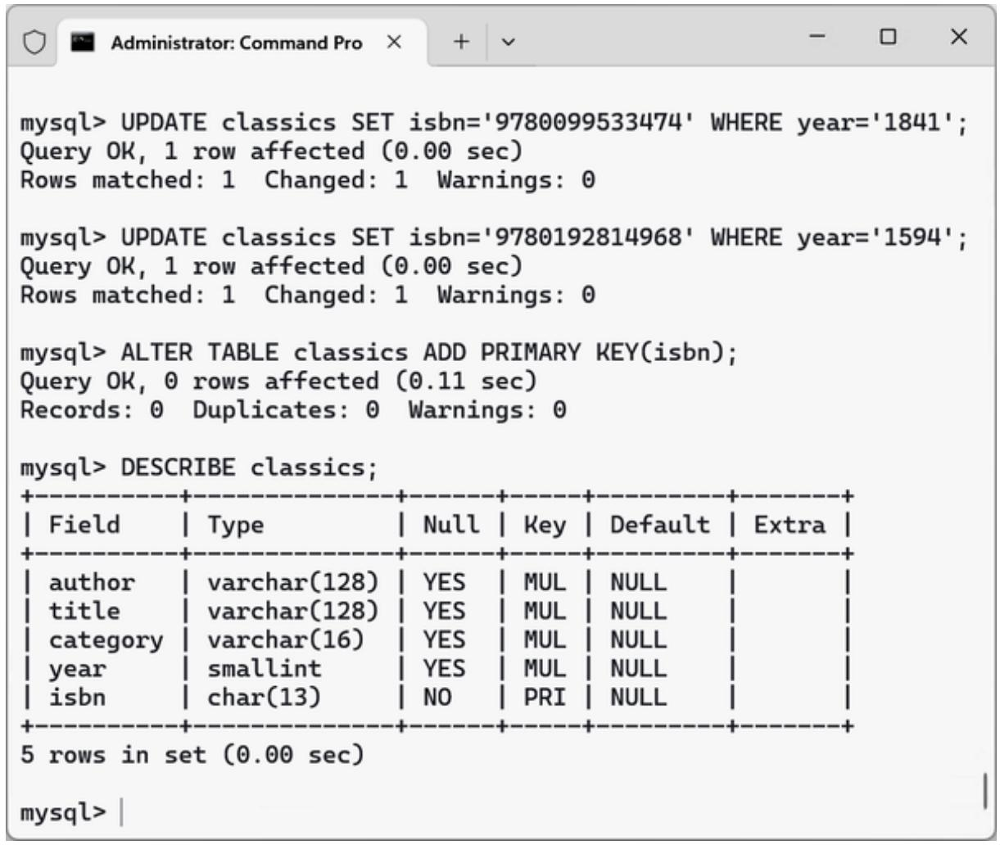

<details>
<summary>text_image</summary>

mysql> UPDATE classics SET isbn='9780099533474' WHERE year='1841';
Query OK, 1 row affected (0.00 sec)
Rows matched: 1 Changed: 1 Warnings: 0

mysql> UPDATE classics SET isbn='9780192814968' WHERE year='1594';
Query OK, 1 row affected (0.00 sec)
Rows matched: 1 Changed: 1 Warnings: 0

mysql> ALTER TABLE classics ADD PRIMARY KEY(isbn);
Query OK, 0 rows affected (0.11 sec)
Records: 0 Duplicates: 0 Warnings: 0

mysql> DESCRIBE classics;
+----+----+----+----+----+
| Field | Type | Null | Key | Default | Extra |
+----+----+----+----+----+
| author | varchar(128) | YES | MUL | NULL |
| title | varchar(128) | YES | MUL | NULL |
| category | varchar(16) | YES | MUL | NULL |
| year | smallint | YES | MUL | NULL |
| isbn | char(13) | NO | PRI | NULL |
+----+----+----+----+----+
5 rows in set (0.00 sec)

mysql>
</details>

Figure 8-8. Retrospectively adding a primary key to the classics table

To have created a primary key when the table classics was created, you could have used the commands in Example 8-14. Again, rename classics in line 1 to something else if you wish to try this example, and then delete the test table afterward.

Example 8-14. Creating the table classics with a primary key

```sql
CREATE TABLE classics (
author VARCHAR(128),
title VARCHAR(128),
category VARCHAR(16),
year SMALLINT,
isbn CHAR(13),
INDEX(author(20)),
INDEX(title(20)),
INDEX(category(4)),
INDEX(year),
PRIMARY KEY (isbn)) ENGINE InnoDB;
```

**Creating a FULLTEXT index**

Unlike a regular index, MySQL’s FULLTEXT allows super-fast searches of entire columns of text. It stores every word in every data string in a special index that you can search using “natural language,” in a similar manner to using a search engine.

**NOTE**

It’s not strictly true that MySQL stores all the words in a FULLTEXT index, because it has a built-in list of more than 500 words that it chooses to ignore because they are so common that they aren’t very helpful for searching anyway—so-called stopwords. This list includes the, as, is, of, and so on. The list helps MySQL run much more quickly when performing a FULLTEXT search and keeps database sizes down.

Here are some things that you should know about FULLTEXT indexes:

Since MySQL 5.6, InnoDB tables can use FULLTEXT indexes, but prior to that FULLTEXT indexes could be used only with MyISAM tables. If you need to convert a table to MyISAM, you can usually use the MySQL command ALTER TABLE tablename ENGINE = MyISAM;.  
FULLTEXT indexes can be created for CHAR, VARCHAR, and TEXT columns only.

A FULLTEXT index definition can be given in the CREATE TABLE statement when a table is created or added later using ALTER TABLE (or CREATE INDEX).  
For large data sets, it is much faster to load your data into a table that has no FULLTEXT index and then create the index to avoid constant index updates.

To create a FULLTEXT index, apply it to one or more records, as in Example 8-15, which adds a FULLTEXT index to the pair of columns author and title in the classics table (this index is in addition to the ones already created and does not affect them).

Example 8-15. Adding a  index to the table classics

ALTER TABLE classics ADD FULLTEXT(author,title);

You can now perform FULLTEXT searches across this pair of columns. This feature could really come into its own if you could now add the entire text of these publications to the database (particularly as they’re out of copyright protection) and they would be fully searchable. See “MATCH...AGAINST” for a description of searches using FULLTEXT.

**NOTE**

If you find that MySQL is running slower than you think it should be when accessing your database, the problem is usually related to your indexes. Either you don’t have an index where you need one or the indexes are not optimally designed. Tweaking a table’s indexes will often solve such a problem. Performance is beyond the scope of this book, but in Chapter 9 I’ll give you a few tips so you know what to look for.

### Querying a MySQL Database

So far, we’ve created a MySQL database and tables, populated them with data, and added indexes to make them fast to search. Now it’s time to look at how these searches are performed and the various commands and qualifiers available.

**SELECT**

As you saw in Figure 8-4, the SELECT command is used to extract data from a table. In that section, I used its simplest form to select all data and display it—something you will never want to do on anything but the smallest tables, because all the data will scroll by at an unreadable pace.

Alternatively, on Unix/Linux computers, you can tell MySQL to page output a screen at a time by issuing this command:

pager less;

This pipes output to the less program. To restore standard output and turn paging off, you can issue this command:

nopager;

Let’s now examine SELECT in more detail. The basic syntax is:

SELECT something FROM tablename;

The something can be an \* (asterisk) as you saw before, which means every column, or you can choose to select only certain columns. For instance, Example 8-16 shows how to select just the author and title and just the title and isbn. The result of typing these commands can be seen in Figure 8-9.

Example 8-16. Two different  statements

SELECT author,title FROM classics;

SELECT title,isbn FROM classics;

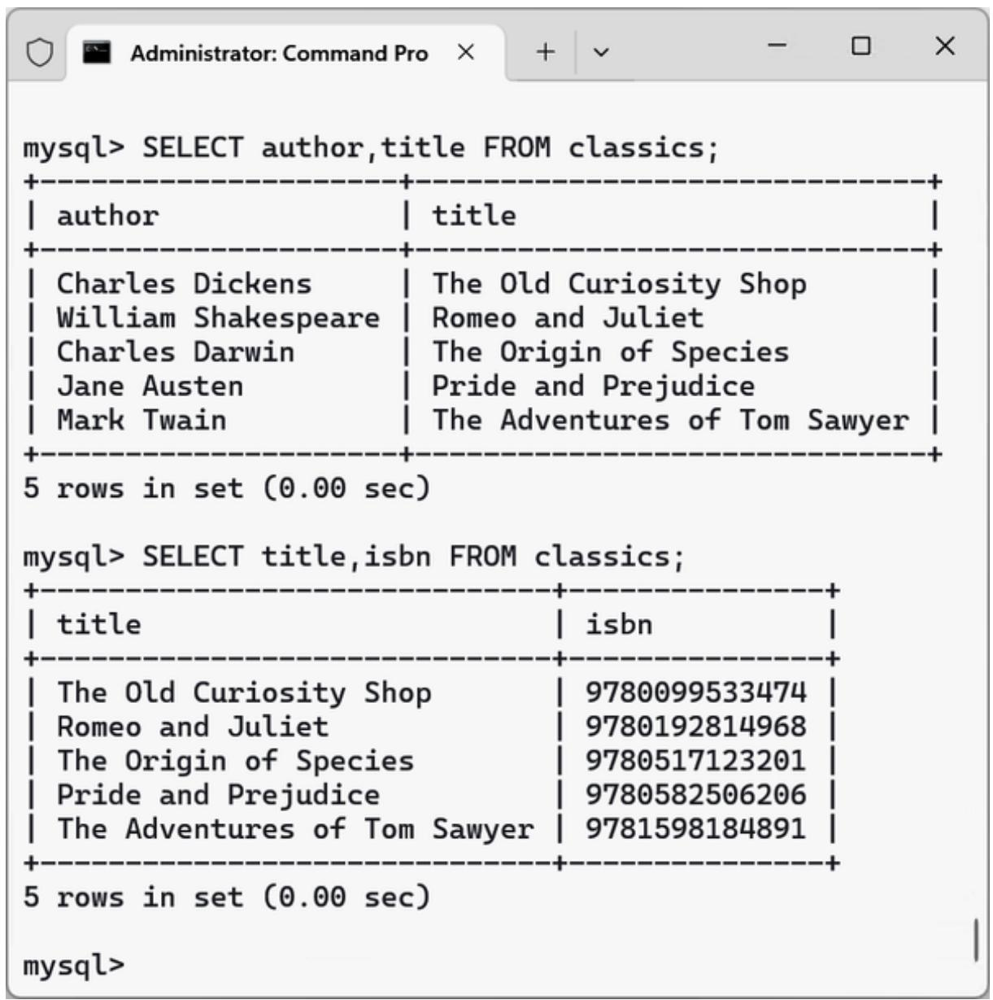

<details>
<summary>text_image</summary>

mysql> SELECT author, title FROM classics;
+----+
|    author        |    title    |
+----+
|    Charles Dickens |    The Old Curiosity Shop |
|    William Shakespeare |    Romeo and Juliet |
|    Charles Darwin |    The Origin of Species |
|    Jane Austen   |    Pride and Prejudice |
|    Mark Twain   |    The Adventures of Tom Sawyer |
+----+
5 rows in set (0.00 sec)
mysql> SELECT title,isbn FROM classics;
+----+
|    title        |    isbn    |
+----+
|    The Old Curiosity Shop |    9780099533474 |
|    Romeo and Juliet |    9780192814968 |
|    The Origin of Species |    9780517123201 |
|    Pride and Prejudice |    9780582506206 |
|    The Adventures of Tom Sawyer |    9781598184891 |
+----+
5 rows in set (0.00 sec)
mysql>
</details>

Figure 8-9. The output from two different  statements

**SELECT COUNT**

Another replacement for the something parameter is COUNT, which can be used in many ways. In Example 8-17, it displays the number of rows in the table by passing \* as a parameter, which means all rows. As you’d expect, the result returned is 5, as there are five publications in the table.

Example 8-17. Counting rows

SELECT COUNT(\*) FROM classics;

**SELECT DISTINCT**

The DISTINCT qualifier (and its partner DISTINCTROW) allows you to weed out multiple entries when they contain the same data. For instance, suppose that you want a list of all authors in the table. If you select just the author column from a table containing multiple books by the same author, you’ll normally see a long list with the same author names over and over. But by adding the DISTINCT keyword, you can show each author just once. Let’s test that out by adding another row that repeats one of our existing authors (Example 8-18).

Example 8-18. Duplicating data

INSERT INTO classics(author, title, category, year, isbn) VALUES('Charles Dickens','Little Dorrit','Fiction','1857', '9780141439969');

Now that Charles Dickens appears twice in the table, we can compare the results of using SELECT with and without the DISTINCT qualifier. Example 8-19 and Figure 8-10 show that the simple SELECT lists Dickens twice, and the command with the DISTINCT qualifier shows him only once.

Example 8-19. With and without the  qualifier

SELECT author FROM classics; SELECT DISTINCT author FROM classics;

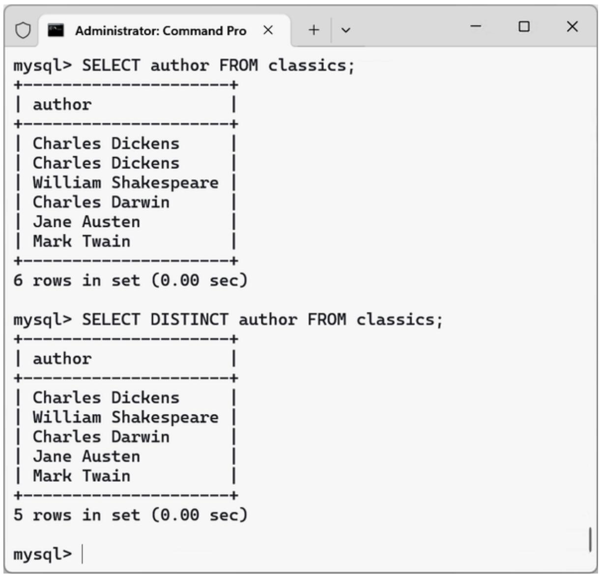

<details>
<summary>text_image</summary>

mysql> SELECT author FROM classics;
+----+
|    author
+----+
|    Charles Dickens |
|    Charles Dickens |
|    William Shakespeare |
|    Charles Darwin |
|    Jane Austen |
|    Mark Twain
+----+
6 rows in set (0.00 sec)

mysql> SELECT DISTINCT author FROM classics;
+----+
|    author
+----+
|    Charles Dickens |
|    William Shakespeare |
|    Charles Darwin |
|    Jane Austen |
|    Mark Twain
+----+
5 rows in set (0.00 sec)

mysql>
</details>

Figure 8-10. Selecting data with and without

**DELETE**

When you need to remove a row from a table, use the DELETE command. Its syntax is similar to the SELECT command and allows you to narrow down the exact row or rows to delete using qualifiers such as WHERE and LIMIT.

Now that you’ve seen the effects of the DISTINCT qualifier, if you typed Example 8-18, you should remove Little Dorrit by entering the commands in Example 8-20.

Example 8-20. Removing the new entry

DELETE FROM classics WHERE title='Little Dorrit';

This example issues a DELETE command for all rows whose title column contains the exact string Little Dorrit.

The WHERE keyword is very powerful and important to enter correctly; an error could lead a command to the wrong rows (or have no effect in cases where nothing matches the WHERE clause). So now we’ll spend some time on that clause, which is the heart and soul of SQL.

**WHERE**

The WHERE keyword enables you to narrow queries by returning only those where a certain expression is true. Example 8-20 returns only the rows where the column exactly matches the string Little Dorrit, using the equality operator =. Example 8-21 shows a couple more examples of using WHERE with the = operator.

Example 8-21. Using the  keyword

SELECT author,title FROM classics WHERE author="Mark Twain"; SELECT author,title FROM classics WHERE isbn="9781598184891";

Given our current table, the two commands in Example 8-21 display the same results. But we could easily add more books by Mark Twain, in which case the first line would display all the titles he wrote and the second line would continue (because we know the ISBN is unique) to display The Adventures of Tom Sawyer. In other words, searches using a unique key are more predictable, and you’ll see further evidence later of the value of unique and primary keys.

You can also do pattern matching for your searches using the LIKE qualifier, which allows searches on parts of strings. This qualifier should be used with a % character before or after some text. When placed before a keyword, % means anything before. After a keyword, it means anything after.

Example 8-22 performs three different queries, one for the start of a string, one for the end, and one for anywhere in a string.

Example 8-22. Using the  qualifier

```sql
SELECT author, title FROM classics WHERE author LIKE "Charles%;
SELECT author, title FROM classics WHERE title LIKE "%Species";
SELECT author, title FROM classics WHERE title LIKE "%and%";
```

You can see the results of these commands in Figure 8-11. The first command outputs the publications by both Charles Darwin and Charles Dickens because the LIKE qualifier was set to return anything matching the string Charles followed by any other text. Then just The Origin of Species is returned, because it’s the only row whose column ends with the string Species. Last, both Pride and Prejudice and Romeo and Juliet are returned, because they both matched the string and anywhere in the column. The % will also match if there is nothing in the position it occupies; in other words, it can match an empty string.

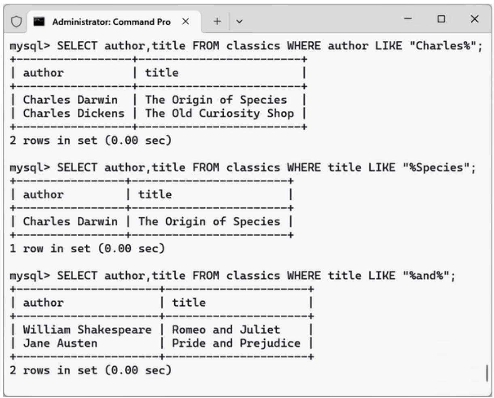

<details>
<summary>text_image</summary>

mysql> SELECT author, title FROM classics WHERE author LIKE "Charles%";
+----+
| author        | title                |
+----+
| Charles Darwin  | The Origin of Species |
| Charles Dickens | The Old Curiosity Shop |
+----+
2 rows in set (0.00 sec)

mysql> SELECT author, title FROM classics WHERE title LIKE "%Species";
+----+
| author        | title                |
+----+
| Charles Darwin  | The Origin of Species |
+----+
1 row in set (0.00 sec)

mysql> SELECT author, title FROM classics WHERE title LIKE "%and%";
+----+
| author        | title                |
+----+
| William Shakespeare | Romeo and Juliet    |
| Jane Austen    | Pride and Prejudice |
+----+
2 rows in set (0.00 sec)
</details>

Figure 8-11. Using  with the  qualifier

**LIMIT**

The LIMIT qualifier enables you to choose how many rows to return in a query and where in the table to start returning them. When passed a single parameter, it tells MySQL to start at the beginning of the results and return just the number of rows given in that parameter. If you pass it two parameters, the first indicates the offset from the start of the results where MySQL should start the display, and the second indicates how many to return. You can think of the first parameter as saying, “Skip this number of results at the start.”

Example 8-23 includes three commands. The first returns the first three rows from the table. The second returns two rows starting at position 1 (skipping one row). The last command returns a single row starting at position 3 (skipping the first three rows). Figure 8-12 shows the results of issuing these three commands.

Example 8-23. Limiting the number of results returned

```sql
SELECT author, title FROM classics LIMIT 3;
SELECT author, title FROM classics LIMIT 1, 2;
SELECT author, title FROM classics LIMIT 3, 1;
```

**WARNING**

Be careful with the LIMIT keyword, because offsets start at 0, but the number of rows to return starts at 1. So, LIMIT 1,3 means return three rows starting from the second row. You could look at the first argument as stating how many rows to skip, so that in English the instruction would be “Return 3 rows, skipping the first 1.”

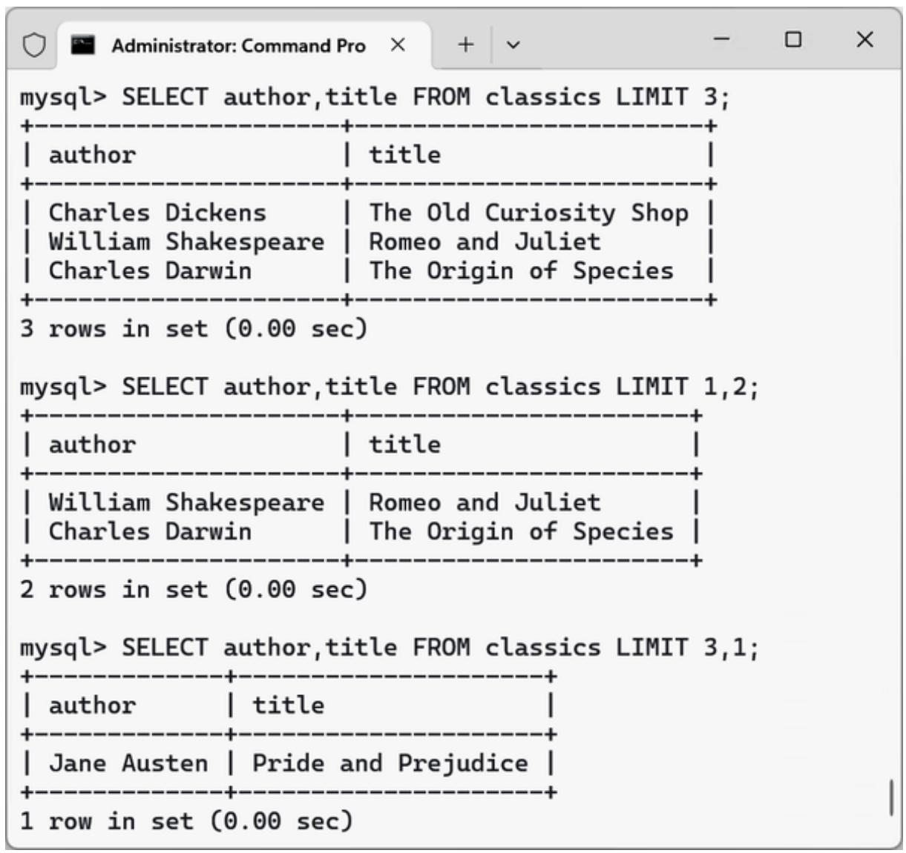

<details>
<summary>text_image</summary>

mysql> SELECT author, title FROM classics LIMIT 3;
+----+
| author        | title    |
+----+
| Charles Dickens | The Old Curiosity Shop |
| William Shakespeare | Romeo and Juliet |
| Charles Darwin   | The Origin of Species |
+----+
3 rows in set (0.00 sec)

mysql> SELECT author, title FROM classics LIMIT 1,2;
+----+
| author        | title    |
+----+
| William Shakespeare | Romeo and Juliet |
| Charles Darwin   | The Origin of Species |
+----+
2 rows in set (0.00 sec)

mysql> SELECT author, title FROM classics LIMIT 3,1;
+----+
| author        | title    |
+----+
| Jane Austen    | Pride and Prejudice |
+----+
1 row in set (0.00 sec)
</details>

Figure 8-12. Restricting the rows returned with

**MATCH...AGAINST**

The MATCH...AGAINST construct can be used on columns that have been given a FULLTEXT index (see “Creating a FULLTEXT index”). With it, you can make natural-language searches as you would in an internet search engine. Unlike the use of WHERE...= or WHERE...LIKE, MATCH...AGAINST lets you enter multiple words in a search query and checks them against all words in the FULLTEXT columns. FULLTEXT indexes are case-insensitive, so it makes no difference what case is used in your queries.

Assuming that you have added a FULLTEXT index to the author and title columns, enter the three queries shown in Example 8-24. The first asks for any rows that contain the word and to be returned. If you are using the MyISAM storage engine, then because and is a stopword in that engine, MySQL will ignore it and the query will always produce an empty set—no matter what is stored in the column. Otherwise, if you are using InnoDB, and is an allowed word. The second query asks for any rows that contain both of the words curiosity and shop anywhere in them, in any order, to be returned. And the last query applies the same kind of search for the words tom and sawyer. Figure 8-13 shows the results of these queries.

Example 8-24. Using  on  indexes

```sql
SELECT author, title FROM classics
WHERE MATCH(author, title) AGAINST('and');
SELECT author, title FROM classics
WHERE MATCH(author, title) AGAINST('curiosity shop');
SELECT author, title FROM classics
WHERE MATCH(author, title) AGAINST('tom sawyer');
```

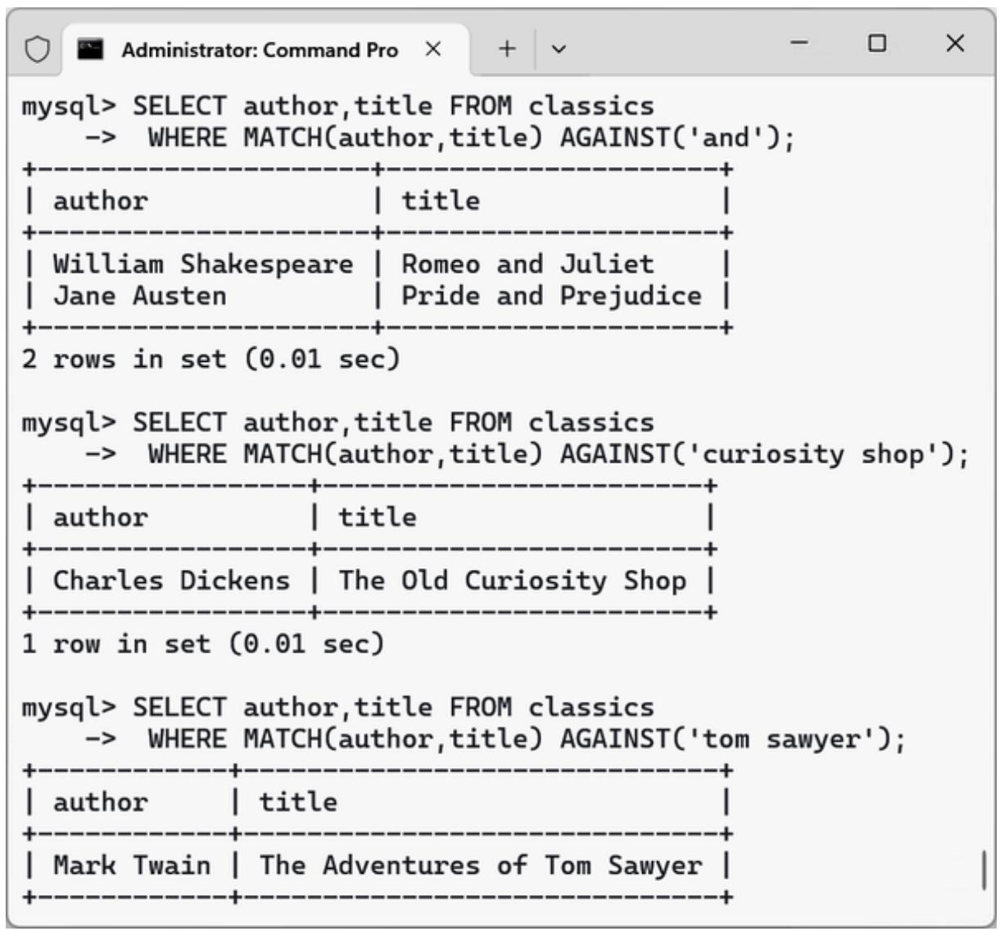

<details>
<summary>text_image</summary>

mysql> SELECT author, title FROM classics
    -> WHERE MATCH(author, title) AGAINST('and');
+----+----+
| author        | title            |
+----+----+
| William Shakespeare | Romeo and Juliet  |
| Jane Austen    | Pride and Prejudice |
+----+----+
2 rows in set (0.01 sec)

mysql> SELECT author, title FROM classics
    -> WHERE MATCH(author, title) AGAINST('curiosity shop');
+----+----+
| author        | title            |
+----+----+
| Charles Dickens | The Old Curiosity Shop |
+----+----+
1 row in set (0.01 sec)

mysql> SELECT author, title FROM classics
    -> WHERE MATCH(author, title) AGAINST('tom sawyer');
+----+----+
| author        | title            |
+----+----+
| Mark Twain    | The Adventures of Tom Sawyer |
+----+----+
</details>

Figure 8-13. Using  on  indexes

**MATCH...AGAINST in Boolean mode**

If you wish to give your MATCH...AGAINST queries even more power, use Boolean mode. This changes the effect of the standard FULLTEXT query so that it searches for any combination of search words, instead of requiring all search words to be in the text. The presence of a single word in a column causes the search to return the row.

Boolean mode also allows you to preface search words with a + or – sign to indicate whether they must be included or excluded. If normal Boolean mode says, “Any of these words will do,” a plus sign means, “This word must be present; otherwise, don’t return the row.” A minus sign means,

“This word must not be present; its presence disqualifies the row from being returned.”

Example 8-25 illustrates Boolean mode through two queries. The first asks for all rows containing the word charles and not the word species to be returned. The second uses double quotes to request that all rows containing the exact phrase origin of be returned. Figure 8-14 shows the results of these queries.

Example 8-25. Using  in Boolean mode

```sql
SELECT author, title FROM classics
WHERE MATCH(author, title)
AGAINST('+charles -species' IN BOOLEAN MODE);
SELECT author, title FROM classics
WHERE MATCH(author, title)
AGAINST('origin of'' IN BOOLEAN MODE);
```

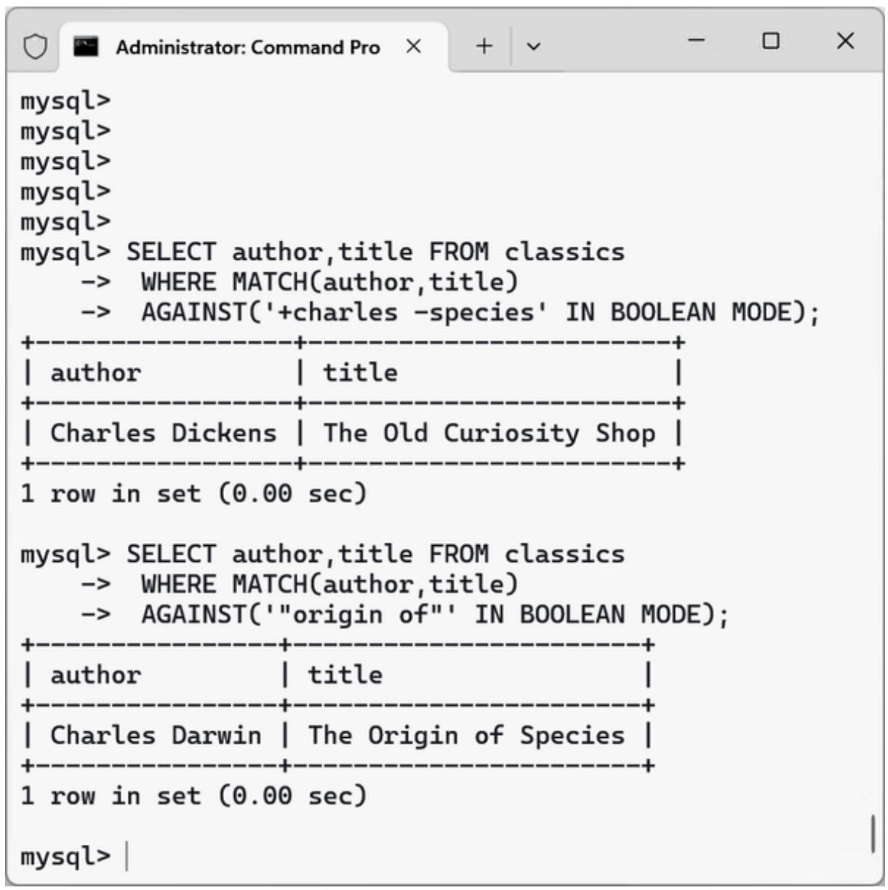

<details>
<summary>text_image</summary>

mysql>
mysql>
mysql>
mysql>
mysql>
mysql> SELECT author, title FROM classics
-> WHERE MATCH(author, title)
-> AGAINST('+charles -species' IN BOOLEAN MODE);
+----+----+
| author        | title            |
+----+----+
| Charles Dickens | The Old Curiosity Shop |
+----+----+
1 row in set (0.00 sec)

mysql> SELECT author, title FROM classics
-> WHERE MATCH(author, title)
-> AGAINST('"origin of"' IN BOOLEAN MODE);
+----+----+
| author        | title            |
+----+----+
| Charles Darwin | The Origin of Species |
+----+----+
1 row in set (0.00 sec)

mysql>
</details>

Figure 8-14. Using  in Boolean mode

As you would expect, the first request returns only The Old Curiosity Shop by Charles Dickens; any rows containing the word species have been excluded, so Charles Darwin’s publication is ignored.

**NOTE**

Something of interest to note in the second query: the stopword of is part of the search string, but it is still used by the search because the double quotation marks override stopwords.

**UPDATE...SET**

This construct allows you to update the contents of a field. If you wish to change the contents of one or more fields, you first need to focus on just the field or fields to be changed, in much the same way you use the SELECT command. Example 8-26 shows the use of UPDATE...SET in two different ways. You can see the results in Figure 8-15.

Example 8-26. Using

```sql
UPDATE classics SET author='Mark Twain (Samuel Langhorne Clemens)'
WHERE author='Mark Twain';
UPDATE classics SET category='Classic Fiction'
WHERE category='Fiction';
```

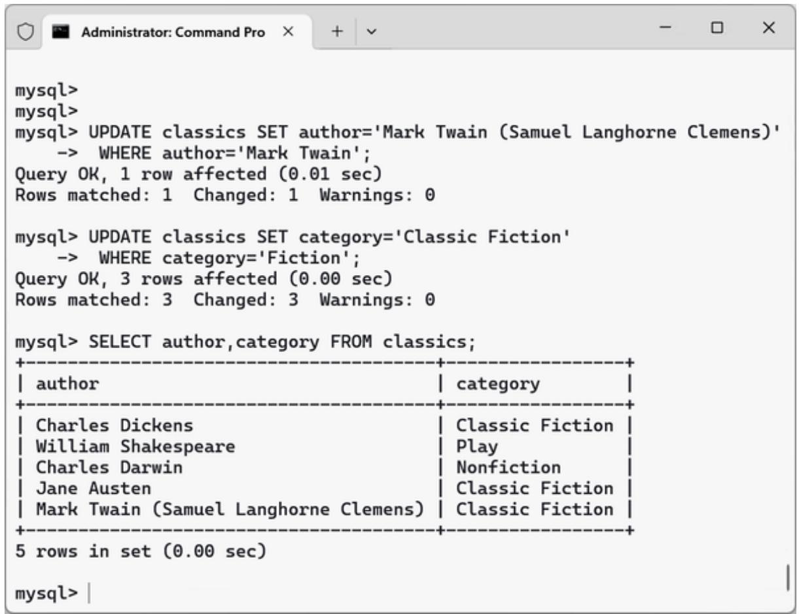

<details>
<summary>text_image</summary>

mysql>
mysql>
mysql> UPDATE classics SET author='Mark Twain (Samuel Langhorne Clemens)'
    -> WHERE author='Mark Twain';
Query OK, 1 row affected (0.01 sec)
Rows matched: 1 Changed: 1 Warnings: 0

mysql> UPDATE classics SET category='Classic Fiction'
    -> WHERE category='Fiction';
Query OK, 3 rows affected (0.00 sec)
Rows matched: 3 Changed: 3 Warnings: 0

mysql> SELECT author,category FROM classics;
+----+
| author                  | category |
+----+
| Charles Dickens           | Classic Fiction |
| William Shakespeare       | Play          |
| Charles Darwin           | Nonfiction     |
| Jane Austen              | Classic Fiction |
| Mark Twain (Samuel Langhorne Clemens) | Classic Fiction |
+----+
5 rows in set (0.00 sec)

mysql>
</details>

Figure 8-15. Updating columns in the classics table

In the first query, Mark Twain’s real name of Samuel Langhorne Clemens was appended to his pen name in parentheses, which affected only one row. The second query, however, affected three rows, because it changed all occurrences of Fiction in the category column to the term Classic Fiction.

When performing an update, you can also use the qualifiers you have already seen, such as LIMIT, and the following ORDER BY and GROUP BY keywords.

**ORDER BY**

ORDER BY sorts returned results by one or more columns in ascending or descending order. Example 8-27 shows two such queries, the results of which can be seen in Figure 8-16.

Example 8-27. Using

SELECT author,title FROM classics ORDER BY author; SELECT author,title FROM classics ORDER BY title DESC;

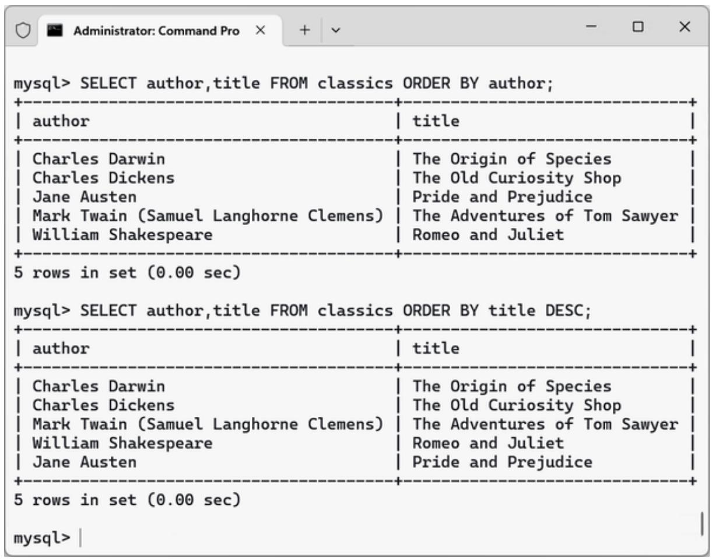

<details>
<summary>text_image</summary>

mysql> SELECT author, title FROM classics ORDER BY author;
+----+
| author                 | title |
+----+
| Charles Darwin         | The Origin of Species |
| Charles Dickens       | The Old Curiosity Shop |
| Jane Austen           | Pride and Prejudice |
| Mark Twain (Samuel Langhorne Clemens) | The Adventures of Tom Sawyer |
| William Shakespeare     | Romeo and Juliet |
+----+
5 rows in set (0.00 sec)
mysql> SELECT author, title FROM classics ORDER BY title DESC;
+----+
| author                 | title |
+----+
| Charles Darwin         | The Origin of Species |
| Charles Dickens       | The Old Curiosity Shop |
| Mark Twain (Samuel Langhorne Clemens) | The Adventures of Tom Sawyer |
| William Shakespeare     | Romeo and Juliet |
| Jane Austen           | Pride and Prejudice |
+----+
5 rows in set (0.00 sec)
mysql>
</details>

Figure 8-16. Sorting the results of requests

As you can see, the first query returns the publications by author in ascending alphabetical order (the default), and the second returns them by title in descending order.

If you wanted to sort all the rows by category and then by descending year of publication (to view the most recent first), you would issue this query:

SELECT author,title,category,year FROM classics ORDER BY category,year DESC;

This shows that each ascending and descending qualifier applies to a single column. The DESC keyword applies only to the preceding column, year. Because you allow category to use the default sort order, it is sorted in ascending order. You could also have explicitly specified ascending order for that column, with the same results:

SELECT author,title,category,year FROM classics ORDER BY category ASC,year DESC;

**GROUP BY**

In a similar fashion to ORDER BY, you can group results returned from queries using GROUP BY, which is good for retrieving information about a group of data. For example, if you want to know how many publications of each category are in the classics table, you can issue the query:

SELECT category,COUNT(author) FROM classics GROUP BY category;

which returns this output:

<table><tr><td colspan="2">| category | COUNT(author) |</td></tr><tr><td colspan="2">| Classic Fiction | 3 | Nonfiction | 1 | Play | 1 |</td></tr><tr><td colspan="2">+----+----+----+----+----+----+----+----+----+----+----+----+----+----+----+----+----+----+----+----+----+----+----+----+----+----+----+----+----+----+----+----+----+----+----+----+----+----+----+----+----+----+----+----+----+----+----+----+----+----+</td></tr><tr><td colspan="2">3 rows in set (0.00 sec)</td></tr></table>

### Joining Tables

It is quite normal to maintain multiple tables within a database, each holding a different type of information. For example, consider the case of a customers table that needs to be able to be cross-referenced with publications purchased from the classics table. Enter the commands in Example 8-28 to create this new table and populate it with three customers and their purchases. Figure 8-17 shows the result.

**NOTE**

Joining tables is a really big topic that we’re going to cover very quickly here. In Chapter 9, you’ll also learn more about database design, which includes a process called database normalization.

Example 8-28. Creating and populating the customers table  
```sql
CREATE TABLE customers (
    name VARCHAR(128),
    isbn VARCHAR(13),
    PRIMARY KEY (isbn)) ENGINE InnoDB;
INSERT INTO customers(name,isbn)
VALUES('Joe Bloggs','9780099533474');
INSERT INTO customers(name,isbn)
VALUES('Mary Smith','9780582506206');
INSERT INTO customers(name,isbn)
VALUES('Jack Wilson','9780517123201');
SELECT * FROM customers;
```

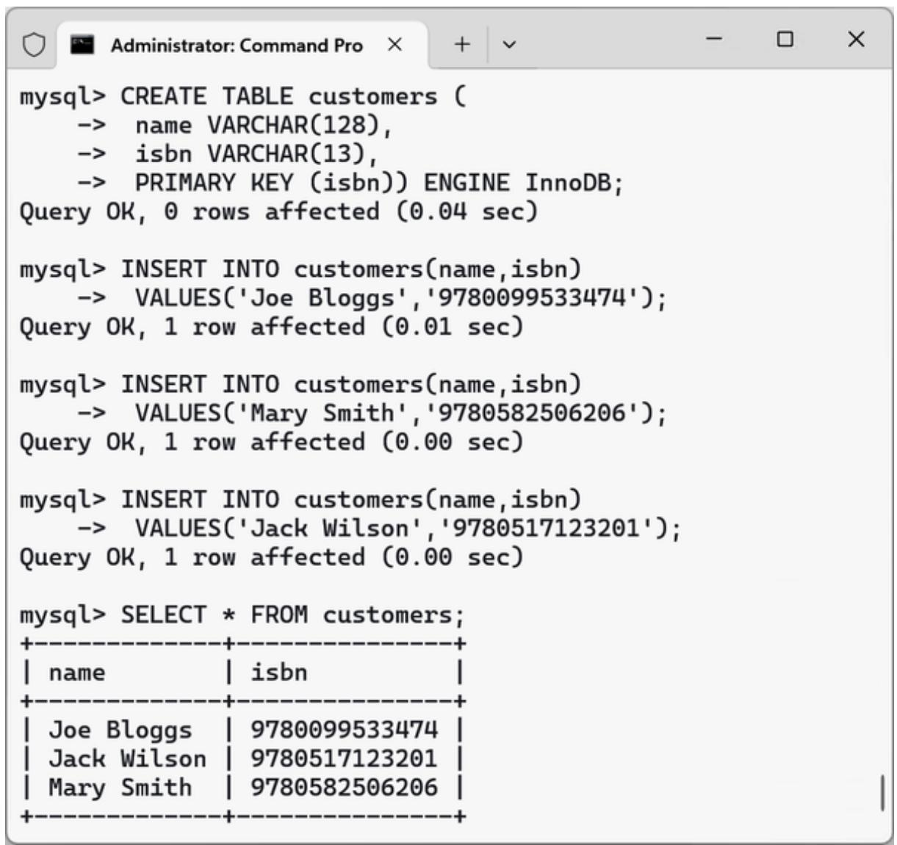

<details>
<summary>text_image</summary>

mysql> CREATE TABLE customers (
    -> name VARCHAR(128),
    -> isbn VARCHAR(13),
    -> PRIMARY KEY (isbn)) ENGINE InnoDB;
Query OK, 0 rows affected (0.04 sec)

mysql> INSERT INTO customers(name,isbn)
    -> VALUES('Joe Bloggs','9780099533474');
Query OK, 1 row affected (0.01 sec)

mysql> INSERT INTO customers(name,isbn)
    -> VALUES('Mary Smith','9780582506206');
Query OK, 1 row affected (0.00 sec)

mysql> INSERT INTO customers(name,isbn)
    -> VALUES('Jack Wilson','9780517123201');
Query OK, 1 row affected (0.00 sec)

mysql> SELECT * FROM customers;
+----+----+
| name | isbn |
+----+----+
| Joe Bloggs | 9780099533474 |
| Jack Wilson | 9780517123201 |
| Mary Smith | 9780582506206 |
+----+----+
</details>

Figure 8-17. Creating the customers table

**NOTE**

There’s also a shortcut for inserting multiple rows of data, as in Example 8-28, in which you can replace the three separate INSERT INTO queries with a single one listing the data to be inserted, separated by commas, like this:

```sql
INSERT INTO customers(name,isbn) VALUES
('Joe Bloggs', '9780099533474'),
('Mary Smith', '9780582506206'),
('Jack Wilson', '9780517123201');
```

Of course, in a proper table containing customers’ details there also would be addresses, phone numbers, email addresses, and so on, but they aren’t necessary for this explanation. While creating the new table, you should have noticed that it has something in common with the classics table: a column called isbn. Because it has the same meaning in both tables (an ISBN refers to a book, and always the same book), we can use this column to tie the two tables together into a single query, as in Example 8-29.

Example 8-29. Joining two tables into a single

SELECT name,author,title FROM customers,classics

WHERE customers.isbn=classics.isbn;

The result of this operation is:

<table><tr><td>| name | author | title |</td></tr><tr><td>| Joe Bloggs | Charles Dickens | The Old Curiosity Shop |Mary Smith | Jane Austen | Pride and Prejudice |Jack Wilson | Charles Darwin | The Origin of Species |</td></tr></table>

3 rows in set (0.00 sec)

See how this query has neatly linked the tables to show the publications purchased from the classics table by the people in the customers table?

**NATURAL JOIN**

Using NATURAL JOIN, you can save yourself some typing and make queries a little clearer. This kind of join takes two tables and automatically joins columns that have the same name. So, to achieve the same results as from Example 8-29, you would enter:

SELECT name,author,title FROM customers NATURAL JOIN classics;

**JOIN...ON**

If you wish to specify the column on which to join two tables, use the JOIN...ON construct, as follows, to achieve results identical to those of Example 8-29:

SELECT name,author,title FROM customers JOIN classics ON customers.isbn=classics.isbn;

**Using AS**

You can also save yourself some typing and improve query readability by creating aliases using the AS keyword. Simply follow a table name with AS and the alias to use. The following code, therefore, is also identical in action to Example 8-29:

SELECT name,author,title FROM customers AS cust, classics AS class WHERE cust.isbn=class.isbn;

The result of this operation is:

<table><tr><td colspan="4">+----+----+----+</td></tr><tr><td>| name</td><td>| author</td><td>| title</td><td>|</td></tr></table>

<table><tr><td colspan="3">| Joe Bloggs | Charles Dickens | The Old Curiosity Shop | Mary Smith | Jane Austen | Pride and Prejudice | Jack Wilson | Charles Darwin | The Origin of Species |</td></tr><tr><td colspan="3">3 rows in set (0.00 sec)</td></tr></table>

You can also use AS to assign an alias to a column for the current query (whether or not joining tables), like this:

SELECT name AS customer FROM customers ORDER BY customer;

which results in the output:

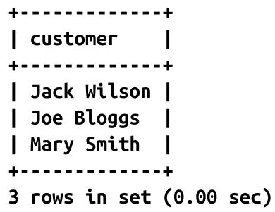

<details>
<summary>text_image</summary>

+----+
| customer |
+----+
| Jack Wilson |
| Joe Bloggs |
| Mary Smith |
+----+
3 rows in set (0.00 sec)
</details>

Aliases can be particularly useful when you have long queries that reference the same table names many times.

### Using Logical Operators

You can also use the logical operators AND, OR, and NOT in your MySQL WHERE queries to further narrow your selections. Example 8-30 shows one instance of each, but you can mix and match them in any way you need.

Example 8-30. Using logical operators

```sql
SELECT author, title FROM classics WHERE
author LIKE "Charles%" AND author LIKE "%Darwin";
SELECT author, title FROM classics WHERE
author LIKE "%Mark Twain%" OR author LIKE "%Samuel Langhorne Clemens%";
```

I’ve chosen the first query because Charles Darwin might be listed in some rows by his full name, Charles Robert Darwin. The query returns any publications for which the author column starts with Charles and ends with Darwin. The second query searches for publications written using either Mark Twain’s pen name or his real name, Samuel Langhorne Clemens. The third query returns publications written by authors with the first name Charles but not the surname Darwin.

## MySQL Functions

You might wonder why anyone would want to use MySQL functions when PHP comes with a whole bunch of powerful functions of its own. The answer is very simple: the MySQL functions work on the data right there in the database. If you were to use PHP, you would first have to extract raw data from MySQL, manipulate it, and then perform the database query you wanted.

Having functions built into MySQL substantially reduces the time needed for performing complex queries, as well as their complexity. You can learn more about all the available string and date/time functions from the documentation.

## Accessing MySQL via phpMyAdmin

Although to use MySQL you have to learn these main commands and how they work, once you understand them, it can be much quicker and simpler to use a program such as phpMyAdmin to manage your databases and tables.

To do this, assuming you have installed AMPPS as described in Chapter 2, type the following to open the program (see Figure 8-18):

http://localhost/phpmyadmin

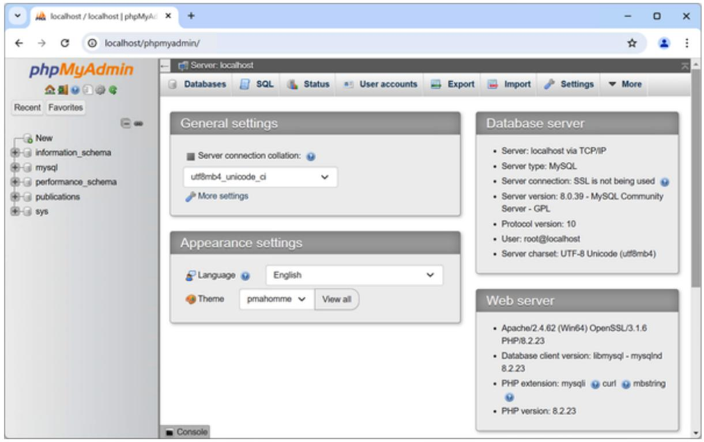

<details>
<summary>text_image</summary>

localhost / localhost | phpMyAdmin
localhost/phpmyadmin/
phpMyAdmin
Recent Favorites
New
information_schema
mysql
performance_schema
publications
sys
Server: localhost
Databases SQL Status User accounts Export Import Settings More
General settings
Server connection collation:
utf8mb4_unicode_ci
More settings
Database server
• Server: localhost via TCP/IP
• Server type: MySQL
• Server connection: SSL is not being used
• Server version: 8.0.39 - MySQL Community
Server - GPL
• Protocol version: 10
• User: root@localhost
• Server charset: UTF-8 Unicode (utf8mb4)
Appearance settings
Language English
Theme pmahomme View all
Web server
• Apache/2.4.62 (Win64) OpenSSL/3.1.6
PHP/8.2.23
• Database client version: libmysql - mysqInd
8.2.23
• PHP extension: mysqli curl mbstring
• PHP version: 8.2.23
Console
</details>

Figure 8-18. The phpMyAdmin main screen

If prompted (and you haven’t changed them), the default login and password to enter are root and mysql.

In the lefthand pane of the main phpMyAdmin screen, you can click to select any tables you wish to work with (although none will be available until created). You can also click New to create a new database.

From here, you can perform all the main operations, such as creating new databases, adding tables, creating indexes, and much more. To find out more about phpMyAdmin, consult the documentation.

If you worked with me through the examples in this chapter, congratulations—it has been quite a journey. You’ve come all the way from learning how to create a MySQL database, through issuing complex queries that combine multiple tables, to using Boolean operators and leveraging MySQL’s various qualifiers.

In Chapter 9, we’ll start looking at how to approach efficient database design, advanced SQL techniques, and MySQL functions and transactions, but first test your knowledge of what you have learned in this chapter with the following questions.

## Questions

1. What is the purpose of the semicolon in MySQL queries?  
2. Which command would you use to view the available databases or tables?  
3. How would you create a new MySQL user on the local host called newuser with a password of newpass and with access to everything in the database newdatabase?  
4. How can you view the structure of a table?  
5. What is the purpose of a MySQL index?  
6. What benefit does a FULLTEXT index provide?  
7. What is a stopword?  
8. Both SELECT DISTINCT and GROUP BY cause the display to show only one output row for each value in a column, even if multiple rows contain that value. What are the main differences between SELECT DISTINCT and GROUP BY?  
9. Using the SELECT...WHERE construct, how would you return only rows containing the word Langhorne somewhere in the author column of the classics table used in this chapter?  
10. What needs to be defined in two tables to make it possible for you to join them together?

See “Chapter 8 Answers” in the Appendix A for the answers to these questions.

Chapter 8 provided you with a good grounding in the practice of using relational databases with the Structured Query Language. You’ve learned about creating databases and the tables they comprise, as well as inserting, looking up, changing, and deleting data.

Next, we now need to look at how to design databases for maximum speed and efficiency. For example, how do you decide what data to place in which table? Over the years, a number of guidelines have been developed that—if you follow them—ensure that your databases will be efficient and capable of growing as you feed them more and more data.

## Database Design

It’s very important that you design a database correctly before you start to create it; otherwise, you are almost certainly going to have to go back and change it by splitting up some tables, merging others, and moving various columns to achieve sensible relationships that MySQL can easily use.

Sitting down with a sheet of paper and a pencil (or a digital equivalent) and writing a selection of the queries that you think you and your users are likely to ask is an excellent starting point. In the case of an online bookstore’s database, some of your questions could be:

How many authors, books, and customers are in the database?  
Which author wrote a certain book?  
Which books were written by a certain author?  
What is the most expensive book?  
What is the best-selling book?

Which books have not sold this year?  
Which books did a certain customer buy?  
Which books have been purchased at the same time as other books?

Of course, you could make many more queries on such a database, but even this small sample will begin to give you insights into how to lay out your tables. For example, books and ISBNs can probably be combined into one table, because they are closely linked (we’ll examine some of the subtleties later). In contrast, books and customers should be in separate tables, because their connection is very loose. A customer can buy any book, and even multiple copies of a book, yet a book can be bought by many customers and be ignored by still more potential customers.

When you plan to do a lot of searches on something, a search can often benefit from having its own table. And when couplings between things are loose, it’s best to put them in separate tables.

Taking into account those simple rules, we can guess we’ll need at least three tables to accommodate all these queries:

**Authors**

There will be lots of searches for authors, many of whom have collaborated on titles, and many of whom will be featured in collections. Listing all the information about each author together, linked to that author, will produce optimal results for searches—hence an Authors table.

**Books**

Many books appear in different editions. Sometimes they change publisher, and sometimes they have the same titles as other unrelated books. So, the links between books and authors are complicated enough to call for a separate table.

**Customers**

It’s even more clear why customers should get their own table, as they are free to purchase any book by any author.

## Primary Keys: The Keys to Relational Databases

Using the power of relational databases, we can define information for each author, book, and customer in just one place. Obviously, what interests us is the links between them—such as who wrote each book and who purchased it—but we can store that information just by making links between the three tables. I’ll show you the basic principles, and then it just takes practice for it to feel natural.

The magic involves giving every author a unique identifier. We’ll do the same for every book and for every customer. We saw the means of doing that in Chapter 8: the primary key. For a book, it makes sense to use the ISBN, although you then have to deal with multiple editions that have different ISBNs. For authors and customers, you can just assign arbitrary keys, which the AUTO\_INCREMENT feature that you saw in the last chapter makes easy.

In short, every table will be designed around some object that you’re likely to search for a lot—an author, book, or customer, in this case—and that object will have a primary key. Don’t choose a key that could possibly have the same value for different objects. The ISBN is a rare case for which an industry has provided a primary key that you can rely on to be unique for each product. Most of the time, you’ll create an arbitrary key for this purpose, using AUTO\_INCREMENT.

**GLOBALLY UNIQUE IDENTIFIERS**

Some databases and tables may also use globally unique identifiers called UUIDs (Universally Unique Identifiers) or GUIDs (Globally Unique Identifiers), a 128-bit label usually formatted as 189aa781-5d03-11ef-ac40-00155d7f2216. They take up more storage space and may negatively impact performance if not used correctly and thus are not common in MySQL databases.

## Normalization

The process of separating your data into tables and creating primary keys is called normalization. Its main goal is to make sure each piece of information appears in the database only once. The presence of duplicates creates a strong risk that you’ll update only one row of duplicated data, creating inconsistencies in a database and potentially causing serious errors.

For example, if you list the titles of books in the Authors table as well as the Books table, and you have to correct a typographic error in a title, you’ll have to search through both tables and make sure you make the same change every place the title is listed. It’s better to keep the title in one place and use the ISBN in other places.

But in the process of splitting a database into multiple tables, it’s important not to go too far and create more tables than is necessary, which would also lead to inefficient design and slower access.

Luckily, E. F. Codd, the inventor of the relational model, analyzed the concept of normalization and came up with a series of so-called normal forms: First, Second, and Third Normal Form. If you modify a database to satisfy each of these forms in order, you will ensure that your database is optimally balanced for fast access and minimum memory and disk space usage.

To see how the normalization process works, let’s start with the rather monstrous database in Table 9-1, which shows a single table containing all of the author names, book titles, and (fictional) customer details. You could consider it a first attempt at a table intended to keep track of which customers have ordered books. Obviously this is an inefficient design, because data is duplicated all over the place (duplications are highlighted in bold), but it represents a starting point. Also, to make this and the following tables less cluttered, ISBN-10 numbers are used in place of ISBN-13.

Table 9-1. A highly inefficient design for a database table

<table><tr><td>Author 1</td><td>Author 2</td><td>Title</td><td>ISBN</td><td>Price</td></tr><tr><td>David Sklar</td><td>Adam Trachtenberg</td><td>PHP Cookbook</td><td>0596101015</td><td>44.99</td></tr><tr><td>Danny Goodman</td><td></td><td>Dynamic HTML</td><td>0596527403</td><td>59.99</td></tr><tr><td>Hugh E. Williams</td><td>David Lane</td><td>PHP and MySQL</td><td>0596005436</td><td>44.95</td></tr><tr><td>David Sklar</td><td>Adam Trachtenberg</td><td>PHP Cookbook</td><td>0596101015</td><td>44.99</td></tr><tr><td>Rasmus Lerdorf</td><td>Kevin Tatroe &amp; Peter MacIntyre</td><td>Programming PHP</td><td>0596006815</td><td>39.99</td></tr></table>

In the following three sections, we will examine this database design, and you’ll see how we can improve it by removing the various duplicate entries and splitting the single table into multiple tables, each containing one type of data.

### First Normal Form

For a database to satisfy the First Normal Form, it must fulfill three requirements:

There should be no repeating columns containing the same kind of data.  
All columns should contain a single value.  
There should be a primary key to uniquely identify each row.

Looking at these requirements in order, you should notice straightaway that both the Author 1 and Author 2 columns constitute repeating data types. So we already have a target column for pulling into a separate table, as the repeated Author columns violate Rule 1.

Second, there are three authors listed for the final book, Programming PHP. I’ve handled that by making Kevin Tatroe and Peter MacIntyre share the Author 2 column, which violates Rule 2—yet another reason to transfer the Author details to a separate table.

However, Rule 3 is satisfied, because the primary key of ISBN has already been created.

Table 9-2 shows the result of removing the Author columns from Table 9-1. Already it looks a lot less cluttered, although duplications remain (highlighted in bold).

Table 9-2. The result of stripping the Author columns from Table 9-1

<table><tr><td>Title</td><td>ISBN</td><td>Price</td><td>Customer name</td><td>Cust addr</td></tr><tr><td>PHP Cookbook</td><td>0596101015</td><td>44.99</td><td>Emma Brown</td><td>1565 Road Ange 9001</td></tr><tr><td>Dynamic HTML</td><td>0596527403</td><td>59.99</td><td>Darren Ryder</td><td>4758 Drive Rich VA 2</td></tr><tr><td>PHP and MySQL</td><td>0596005436</td><td>44.95</td><td>Earl B. Thurston</td><td>862 Lane Franl 4060</td></tr><tr><td>PHP Cookbook</td><td>0596101015</td><td>44.99</td><td>Darren Ryder</td><td>4758 Drive Rich VA 2</td></tr><tr><td>Programming PHP</td><td>0596006815</td><td>39.99</td><td>David Miller</td><td>3647 Lane Waltl 0215</td></tr></table>

The new Authors table shown in Table 9-3 is small and simple. It just lists the ISBN of a title along with an author. If a title has more than one author, additional authors get their own rows. At first, you may feel ill at ease with this table, because you can’t tell which author wrote which book. But don’t worry: MySQL can quickly tell you. All you have to do is tell it which book you want information for, and MySQL will use its ISBN to search the Authors table in a matter of milliseconds.

Table 9-3. The new Authors table

<table><tr><td>ISBN</td><td>Author</td></tr><tr><td>0596101015</td><td>David Sklar</td></tr><tr><td>0596101015</td><td>Adam Trachtenberg</td></tr><tr><td>0596527403</td><td>Danny Goodman</td></tr><tr><td>0596005436</td><td>Hugh E. Williams</td></tr><tr><td>0596005436</td><td>David Lane</td></tr><tr><td>0596006815</td><td>Rasmus Lerdorf</td></tr><tr><td>0596006815</td><td>Kevin Tatroe</td></tr><tr><td>0596006815</td><td>Peter MacIntyre</td></tr></table>

As I mentioned earlier, the ISBN will be the primary key for the Books table, when we get around to creating that table. I mention that here to emphasize that the ISBN is not, however, the primary key for the Authors table. In the real world, the Authors table would deserve a primary key, too, so that each author would have a key to uniquely identify them.

So, in the Authors table, ISBN is just a column that—for the purposes of speeding up searches—we’ll probably make a key, but not the primary key. In fact, it cannot be the primary key in this table because it’s not unique: the same ISBN appears multiple times whenever two or more authors have collaborated on a book.

Because we’ll use it to link authors to books in another table, this column is called a foreign key.

**NOTE**

Keys (also called indexes) have several purposes in MySQL. The fundamental reason for defining a key is to make searches faster. You’ve seen examples in Chapter 8 in which keys are used in WHERE clauses for searching. But a key can also be useful to uniquely identify an item. Thus, a unique key is often used as a primary key in one table and as a foreign key to link rows in that table to rows in another table.

### Second Normal Form

The First Normal Form deals with duplicate data (or redundancy) across multiple columns. The Second Normal Form is all about redundancy across multiple rows. To achieve Second Normal Form, your tables must already be in First Normal Form. Once this has been done, you achieve Second Normal Form by identifying columns whose data repeats in different places and then removing them to their own tables.

So, let’s look again at Table 9-2. Notice how Darren Ryder bought two books, and therefore his details are duplicated. This tells us that the Customer columns need to be pulled into their own table. Table 9-4 shows the result of removing the Customer columns from Table 9-2.

Table 9-4. The new Titles table

<table><tr><td>ISBN</td><td>Title</td><td>Price</td></tr><tr><td>0596101015</td><td>PHP Cookbook</td><td>44.99</td></tr><tr><td>0596527403</td><td>Dynamic HTML</td><td>59.99</td></tr><tr><td>0596005436</td><td>PHP and MySQL</td><td>44.95</td></tr><tr><td>0596006815</td><td>Programming PHP</td><td>39.99</td></tr></table>

As you can see, all that’s left in Table 9-4 are the ISBN, Title, and Price columns for four unique books, so this now constitutes an efficient and selfcontained table that satisfies the requirements of both the First and Second Normal Forms. Along the way, we’ve managed to reduce the information to data closely related to book titles. This table could also include years of publication, page counts, numbers of reprints, and so on, as these details are also closely related. The only rule is that we can’t put in any column that could have multiple values for a single book, because then we’d have to list the same book in multiple rows and would thus violate Second Normal Form. Restoring an Author column, for instance, would violate this normalization.

However, looking at the extracted Customer columns, now in Table 9-5, we can see that there’s more normalization work to do, because Darren Ryder’s details are still duplicated. And it could also be argued that First Normal Form Rule 2 (all columns should contain a single value) has not been properly complied with, because the addresses really need to be broken into separate columns for Address, City, State, and Zip.

Table 9-5. The customer details from Table 9-2

<table><tr><td>ISBN</td><td>Customer name</td><td>Customer address</td><td>Purchase date</td></tr><tr><td>0596101015</td><td>Emma Brown</td><td>1565 Rainbow Road, Los Angeles, CA 90014</td><td>Mar 03 2009</td></tr><tr><td>0596527403</td><td>Darren Ryder</td><td>4758 Emily Drive, Richmond, VA 23219</td><td>Dec 19 2008</td></tr><tr><td>0596005436</td><td>Earl B. Thurston</td><td>862 Gregory Lane, Frankfort, KY 40601</td><td>Jun 22 2009</td></tr><tr><td>0596101015</td><td>Darren Ryder</td><td>4758 Emily Drive, Richmond, VA 23219</td><td>Dec 19 2008</td></tr><tr><td>0596006815</td><td>David Miller</td><td>3647 Cedar Lane, Waltham, MA 02154</td><td>Jan 16 2009</td></tr></table>

What we have to do is split this table further to ensure that each customer’s details are entered only once. Because the ISBN is not and cannot be used as a primary key to identify customers (or authors), a new key must be created.

Table 9-6 is the result of normalizing the Customers table into both First and Second Normal Forms. Each customer now has a unique customer number called CustNo that is the table’s primary key and that will most likely have been created via AUTO\_INCREMENT. All the parts of customer addresses have also been separated into distinct columns to make them easily searchable and updatable.

Table 9-6. The new Customers table

<table><tr><td>CustNo</td><td>Name</td><td>Address</td><td>City</td><td>State</td></tr><tr><td>1</td><td>Emma Brown</td><td>1565 Rainbow Road</td><td>Los Angeles</td><td>CA</td></tr><tr><td>2</td><td>Darren Ryder</td><td>4758 Emily Drive</td><td>Richmond</td><td>VA</td></tr><tr><td>3</td><td>Earl B. Thurston</td><td>862 Gregory Lane</td><td>Frankfort</td><td>KY</td></tr><tr><td>4</td><td>David Miller</td><td>3647 Cedar Lane</td><td>Waltham</td><td>MA</td></tr></table>

At the same time, to normalize Table 9-6, we had to remove the information on customer purchases, because otherwise there would be multiple instances of customer details for each book purchased. Instead, the purchase data is now placed in a new table called Purchases (see Table 9-7).

Table 9-7. The new Purchases table

<table><tr><td>CustNo</td><td>ISBN</td><td>Date</td></tr><tr><td>1</td><td>0596101015</td><td>Mar 03 2009</td></tr><tr><td>2</td><td>0596527403</td><td>Dec 19 2008</td></tr><tr><td>2</td><td>0596101015</td><td>Dec 19 2008</td></tr><tr><td>3</td><td>0596005436</td><td>Jun 22 2009</td></tr><tr><td>4</td><td>0596006815</td><td>Jan 16 2009</td></tr></table>

Here the CustNo column from Table 9-6 is reused as a key to tie the Customers and Purchases tables together. Because the ISBN column is also repeated here, this table can be linked with the Authors and Titles tables, too.

The CustNo column may be a useful key in the Purchases table, but it’s not a primary key. A single customer can buy multiple books (and even multiple copies of one book), so the CustNo column is not a primary key. In fact, the Purchases table has no primary key. That’s all right, because we don’t expect to need to keep track of unique purchases. If one customer buys two copies of the same book on the same day, we’ll just allow two rows with the same information. For easy searching, we can define both CustNo and ISBN as keys—just not as primary keys.

**NOTE**

There are now four tables, one more than the three we had initially assumed would be needed. We arrived at this decision through the normalization process, by methodically following the First and Second Normal Form rules, which made it plain that a fourth table called Purchases would also be required.

The tables we now have are Authors (Table 9-3), Titles (Table 9-4), Customers (Table 9-6), and Purchases (Table 9-7), and we can link each table to any other using either the CustNo or the ISBN key.

For example, to see which books Darren Ryder has purchased, you can look him up in Table 9-6, the Customers table, where you will see his CustNo is 2. Armed with this number, you can now go to Table 9-7, the Purchases table; looking at the ISBN column here, you will see that he purchased titles 0596527403 and 0596101015 on December 19, 2008. This looks like a lot of trouble for a human, but it’s not so hard for MySQL.

To determine what these titles were, you can then refer to Table 9-4, the Titles table, and see that the books he bought were Dynamic HTML and PHP Cookbook. Should you wish to know the authors of these books, you could also use the ISBNs you just looked up on Table 9-3, the Authors

table, and you would see that ISBN 0596527403, Dynamic HTML, was written by Danny Goodman, and that ISBN 0596101015, PHP Cookbook, was written by David Sklar and Adam Trachtenberg.

### Third Normal Form

Once you have a database that complies with both the First and Second Normal Forms, it is in pretty good shape, and you might not have to modify it any further. However, if you wish to be very strict with your database, you can ensure that it adheres to the Third Normal Form, which requires moving data that is not directly dependent on the primary key but is dependent on another value in the table. Such data should be moved into separate tables, according to the dependence.

For example, in Table 9-6, the Customers table, it could be argued that the State, City, and Zip keys are not directly related to each customer, because many other people will have the same details in their addresses, too. However, they are directly related to each other, in that the Address relies on the City, and the City relies on the State.

Therefore, to satisfy Third Normal Form for Table 9-6, you would need to split it into Tables 9-8 through 9-11.

Table 9-8. Third Normal Form Customers table

<table><tr><td>CustNo</td><td>Name</td><td>Address</td><td>Zip</td></tr><tr><td>1</td><td>Emma Brown</td><td>1565 Rainbow Road</td><td>90014</td></tr><tr><td>2</td><td>Darren Ryder</td><td>4758 Emily Drive</td><td>23219</td></tr><tr><td>3</td><td>Earl B. Thurston</td><td>862 Gregory Lane</td><td>40601</td></tr><tr><td>4</td><td>David Miller</td><td>3647 Cedar Lane</td><td>02154</td></tr></table>

Table 9-9. Third Normal Form Zip codes table

<table><tr><td>Zip</td><td>CityID</td></tr><tr><td>90014</td><td>1234</td></tr><tr><td>23219</td><td>5678</td></tr><tr><td>40601</td><td>4321</td></tr><tr><td>02154</td><td>8765</td></tr></table>

Table 9-10. Third Normal Form Cities table

<table><tr><td>CityID</td><td>Name</td><td>StateID</td></tr><tr><td>1234</td><td>Los Angeles</td><td>5</td></tr><tr><td>5678</td><td>Richmond</td><td>46</td></tr><tr><td>4321</td><td>Frankfort</td><td>17</td></tr><tr><td>8765</td><td>Waltham</td><td>21</td></tr></table>

Table 9-11. Third Normal Form States table

<table><tr><td>StateID</td><td>Name</td><td>Abbreviation</td></tr><tr><td>5</td><td>California</td><td>CA</td></tr><tr><td>46</td><td>Virginia</td><td>VA</td></tr><tr><td>17</td><td>Kentucky</td><td>KY</td></tr><tr><td>21</td><td>Massachusetts</td><td>MA</td></tr></table>

So, how would you use this set of four tables instead of the single Table 9- 6? Well, you would look up the Zip code in Table 9-8 and then find the matching CityID in Table 9-9. Given this information, you could look up the city Name in Table 9-10 and then also find the StateID, which you could use in Table 9-11 to look up the state’s Name.

Although using the Third Normal Form in this way may seem like overkill, it can have advantages. For example, look at Table 9-11, where it has been possible to include both a state’s name and its two-letter abbreviation. It could also contain population details and other demographics, if you desired.

**NOTE**

Table 9-10 could also contain even more localized demographics that could be useful to you and/or your customers. By splitting up these pieces of data, you can make it easier to maintain your database in the future, should it be necessary to add columns.

Deciding whether to use the Third Normal Form can be tricky. Your evaluation should rest on what data you may need to add at a later date. If you are absolutely certain that the name and address of a customer is all that you will ever require, you probably will want to leave out this final normalization stage.

On the other hand, suppose you are writing a database for a large organization such as the US Postal Service. What would you do if a city were to be renamed? With a table such as Table 9-6, you would need to perform a global search-and-replace on every instance of that city. But if you have your database set up according to the Third Normal Form, you would have to change only a single entry in Table 9-10 for the change to be reflected throughout the entire database.

Therefore, I suggest that you ask yourself two questions to help you decide whether to perform a Third Normal Form normalization on any table:

Is it likely that many new columns will need to be added to this table?  
Could any of this table’s fields require a global update at any point?

If either of the answers is yes, you should consider performing this final stage of normalization.

### When Not to Use Normalization

Now that you know all about normalization, I’m going to tell you why you should not implement these rules on high-traffic sites. That’s right—you should never fully normalize your tables on sites that will cause MySQL to thrash.

Normalization generally requires spreading data across multiple tables, and multi-table queries and joins are, by nature, less efficient than single-table queries, and that might produce challenges at scale. On a very popular site, if you have normalized tables, your database access will slow down considerably once you get above a few dozen concurrent users, because they will be creating hundreds of database accesses between them. In fact, I would go so far as to say you should denormalize any commonly looked-up data as much as you can.

You see, if you have data duplicated across your tables, you can substantially reduce the number of additional requests that need to be made, because most of the data you want is available in each table. This means that you can simply add an extra column to a query and that field will be available for all matching results.

Of course, you have to deal with the downsides previously mentioned, such as using large amounts of disk space and ensuring that you update every single duplicate copy of the data when it needs modifying.

Multiple updates can be computerized, though. MySQL provides a feature called triggers that make automatic changes to the database in response to changes you make. (Triggers are, however, beyond the scope of this book.) Another way to propagate redundant data is to set up a PHP program to run regularly and keep all copies in sync. The program reads changes from a “main” table and updates all the others. (You’ll see how to access MySQL from PHP in Chapter 10.)

However, until you are very experienced with MySQL, I recommend that you fully normalize all your tables (at least to First and Second Normal Form), as this will instill the habit and help you create effective structure. Only when you start to see MySQL logjams should you consider looking at denormalization.

## Relationships

MySQL is called a relational database management system because its tables store not only data but also the relationships among the data. There are three categories of relationships.

### One-to-One

A one-to-one relationship is like a monogamous marriage: each item has a relationship to only one item of the other type. This is surprisingly rare. For instance, an author can write multiple books, a book can have multiple authors, and even an address can be associated with multiple customers. The best example of a one-to-one relationship in this chapter thus far is the relationship between the name of a state and its two-character abbreviation.

However, for the sake of argument, let’s assume there can always be only one customer at any address. In such a case, the Customers–Addresses relationship in Figure 9-1 is a one-to-one relationship: only one customer lives at each address, and each address can have only one customer.

Table 9-8a (Customers)

<table><tr><td>CustNo</td><td>Name</td><td>Address</td><td>Zip</td></tr><tr><td>1</td><td>Emma Brown</td><td>1565 Rainbow Road</td><td>90014</td></tr><tr><td>2</td><td>Darren Ryder</td><td>4758 Emily Drive</td><td>23219</td></tr><tr><td>3</td><td>Earl B. Thurston</td><td>862 Gregory Lane</td><td>40601</td></tr><tr><td>4</td><td>David Miller</td><td>3647 Cedar Lane</td><td>02154</td></tr></table>

Table 9-8b(Addresses)  
Figure 9-1. The Customers table, Table 9-8, split into two tables

Usually, when two items have a one-to-one relationship, you just include them as columns in the same table. There are two reasons for splitting them into separate tables:

You want to be prepared in case the relationship changes later and is no longer one-to-one.  
The table has a lot of columns, and you think that performance or maintenance would be improved by splitting it.

Of course, when you build your own databases in the real world, you will have to create one-to-many Customer–Address relationships (one address, many customers).

### One-to-Many

One-to-many (or many-to-one) relationships occur when one row in one table is linked to many rows in another table. You have already seen how Table 9-8 would take on a one-to-many relationship if multiple customers were allowed at the same address, which is why it would have to be split up if that were the case.

So, looking at Table 9-8a within Figure 9-1, you can see that it shares a oneto-many relationship with Table 9-7 because there is only one of each customer in Table 9-8a. However Table 9-7, the Purchases table, can (and does) contain more than one purchase from a given customer. Therefore, one customer has a relationship with many purchases.

You can see these two tables alongside each other in Figure 9-2, where the dashed lines joining rows in each table start from a single row in the lefthand table but can connect to more than one row in the righthand table. This one-to-many relationship is also the preferred scheme to use when describing a many-to-one relationship, in which case you would normally swap the left and right tables to view them as a one-to-many relationship.

Table 9-8a (Customers)

<table><tr><td>CustNo</td><td>Name</td><td>CustNo</td><td>ISBN</td><td>Date</td></tr><tr><td>1</td><td>Emma Brown</td><td>1</td><td>0596101015</td><td>Mar 03 2009</td></tr><tr><td rowspan="2">2</td><td rowspan="2">Darren Ryder (etc...)</td><td>2</td><td>0596527403</td><td>Dec 19 2008</td></tr><tr><td>2</td><td>0596101015</td><td>Dec 19 2008</td></tr><tr><td>3</td><td>Earl B. Thurston</td><td>3</td><td>0596005436</td><td>Jun 22 2009</td></tr><tr><td>4</td><td>David Miller</td><td>4</td><td>0596006815</td><td>Jan 16 2009</td></tr></table>

Table 9-7. (Purchases)  
Figure 9-2. Illustrating the relationship between two tables

To represent a one-to-many relationship in a relational database, create a table for the “many” and a table for the “one.” The table for the “many” must contain a column that lists the primary key from the “one” table. Thus, the Purchases table will contain a column that lists the primary key of the customer.

### Many-to-Many

In a many-to-many relationship, many rows in one table are linked to many rows in another table. To create this relationship, add a third table containing the same key column from each of the other tables. This third table contains nothing else, as its sole purpose is to link the other tables.

Table 9-12 is such a table. It was extracted from Table 9-7, the Purchases table but omits the purchase date information. It contains a copy of the ISBN of every title sold, along with the customer number of each purchaser.

Table 9-12. An intermediary table

<table><tr><td>CustNo</td><td>ISBN</td></tr><tr><td>1</td><td>0596101015</td></tr><tr><td>2</td><td>0596527403</td></tr><tr><td>2</td><td>0596101015</td></tr><tr><td>3</td><td>0596005436</td></tr><tr><td>4</td><td>0596006815</td></tr></table>

With this intermediary table in place, you can traverse all the information in the database through a series of relations. You can take an address as a starting point and find out the authors of any books purchased by the customer living at that address.

For example, let’s suppose that you want to find out about purchases in the 23219 zip code. Look up that zip code in Table 9-8b, and you’ll find that customer number 2 has bought at least one item from the database. At this point, you can use Table 9-8a to find out that customer’s name or use the new intermediary Table 9-12 to see the book(s) purchased.

From here, you can see that two titles were purchased and follow them back to Table 9-4 to find the titles and prices of these books or to Table 9-3 to see the authors.

If you’re thinking this is really combining multiple one-to-many relationships, you are absolutely correct. To illustrate, Figure 9-3 brings three tables together.

<table><tr><td colspan="2">Columns from Table 9-8 (Customers)</td><td colspan="2">Intermediary Table 9-12 (Customer/ISBN)</td><td colspan="2">Columns from Table 9-4 (Titles)</td></tr><tr><td>Zip</td><td>CustNo</td><td>CustNo</td><td>ISBN</td><td>ISBN</td><td>Title</td></tr><tr><td>90014</td><td>1</td><td>1</td><td>0596101015</td><td>0596101015</td><td>PHP Cookbook</td></tr><tr><td>23219</td><td>2</td><td>2</td><td>0596101015</td><td>(etc...)</td><td></td></tr><tr><td>(etc...)</td><td></td><td>2</td><td>0596527403</td><td>0596527403</td><td>Dynamic HTML</td></tr><tr><td>40601</td><td>3</td><td>3</td><td>0596005436</td><td>0596005436</td><td>PHP and MySQL</td></tr><tr><td>02154</td><td>4</td><td>4</td><td>0596006815</td><td>0596006815</td><td>Programming PHP</td></tr></table>

Figure 9-3. Creating a many-to-many relationship via a third table

Follow any zip code in the lefthand table to the associated customer IDs. From there, you can link to the middle table, which joins the left and right tables by linking customer IDs and ISBNs. Now all you have to do is follow an ISBN over to the righthand table to see which book it relates to.

You can also use the intermediary table to work your way backward from book titles to zip codes. The Titles table can tell you the ISBN, which you can use in the middle table to find the ID numbers of customers who bought the book, and finally you can use the Customers table to match the customer ID numbers to the customers’ zip codes.

### Databases and Privacy

An interesting aspect of using relations is that you can accumulate a lot of information about some item—such as a customer—without actually

knowing who that customer is. Note that in the previous example we went from customers’ zip codes to customers’ purchases, and back again, without knowing the name of a customer. Databases can be used to track people, but they also can be used to help preserve people’s privacy while still finding useful information, by returning information about a purchase without revealing other customer details, for example.

## Transactions

In some applications, it is vitally important that a sequence of queries runs in the correct order and that every single query successfully completes. For example, suppose you are creating a sequence of queries to transfer funds from one bank account to another. You would not want either of the following events to occur:

You add the funds to the second account, but when you try to subtract them from the first account, the update fails, and now both accounts have the funds.  
You subtract the funds from the first bank account, but the update request to add them to the second account fails, and the funds have disappeared into thin air.

As you can see, not only is it important how you order queries in this type of transaction but it is also vital that all parts of the transaction complete successfully. But how can you ensure this happens, because surely after a query has occurred, it cannot be undone? Do you have to keep track of all parts of a transaction and then undo them all one at a time if any one fails? The answer is absolutely not, because MySQL comes with powerful transaction-handling features to cover just these types of eventualities.

In addition, transactions allow concurrent access to a database by many users or programs at the same time. MySQL handles this seamlessly by ensuring that all transactions are queued and that users or programs take their turns and don’t tread on each other’s toes.

### Transaction Storage Engines

To be able to use MySQL’s transaction facility, you have to be using MySQL’s InnoDB storage engine (which is the default from version 5.5 onward). If you are not sure which version of MySQL your code will be running on, rather than assuming InnoDB is the default engine, you can force its use when creating a table, as follows.

Create a table of bank accounts by typing the commands in Example 9-1. (Remember that to do this, you will need access to the MySQL command line or a graphical tool, and you must also have already selected a suitable database in which to create this table.)

Example 9-1. Creating a transaction-ready table

```sql
CREATE TABLE accounts (
    number INT, balance INT, PRIMARY KEY(number)
) ENGINE InnoDB;
DESCRIBE accounts;
```

The final line of this example displays the contents of the new table so you can ensure that it was correctly created. The output from it should look like this:

```txt
| Field | Type | Null | Key | Default | Extra |
| number | int(11) | NO | PRI | NULL | |
| balance | int(11) | YES | | NULL | |
+----+----+----+----+----+
2 rows in set (0.00 sec)
```

Now let’s create two rows within the table so that you can practice using transactions. Type the commands in Example 9-2.

Example 9-2. Populating the accounts table

INSERT INTO accounts(number, balance) VALUES(67890, 140); SELECT \* FROM accounts;

The third line displays the contents of the table to confirm that the rows were correctly inserted. The output should look like this:

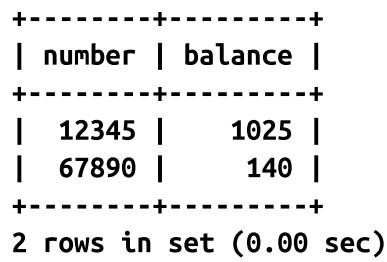

<details>
<summary>text_image</summary>

+----+----+
| number | balance |
+----+----+
| 12345 | 1025 |
| 67890 | 140 |
+----+----+
2 rows in set (0.00 sec)
</details>

With this table created and prepopulated, you are ready to start using transactions.

### Using START TRANSACTION

Transactions in MySQL start with either a START TRANSACTION or a BEGIN statement, where the former is a standard SQL syntax. Type the commands in Example 9-3 to send a transaction to MySQL.

Example 9-3. A MySQL transaction

START TRANSACTION; UPDATE accounts SET balance=balance+25 WHERE number=12345; COMMIT; SELECT \* FROM accounts;

The result of this transaction is displayed by the final line and should look like this:

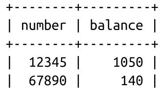

<details>
<summary>text_image</summary>

+----+----+
| number | balance |
+----+----+
| 12345 | 1050 |
| 67890 | 140 |
</details>

```txt
+----+
2 rows in set (0.00 sec)
```

As you can see, the balance of account number 12345 was increased by 25 and is now 1050. You also may have noticed the COMMIT command in Example 9-3, which is explained next.

### Using COMMIT

When you are satisfied that a series of queries in a transaction has successfully completed, issue a COMMIT command to commit all the changes to the database. Until it receives a COMMIT, MySQL considers all the changes you make to be temporary. This feature gives you the opportunity to cancel a transaction by not sending a COMMIT but issuing a ROLLBACK command instead.

### Using ROLLBACK

Using the ROLLBACK command, you can tell MySQL to forget all the queries made since the start of a transaction and to cancel the transaction. See this in action by entering the funds transfer transaction in Example 9-4.

Example 9-4. A funds transfer transaction

```sql
START TRANSACTION;
UPDATE accounts SET balance=balance-250 WHERE number=12345;
UPDATE accounts SET balance=balance+250 WHERE number=67890;
SELECT * FROM accounts;
```

Once you have entered these lines, you should see this result:

```txt
| number | balance |
| 12345 | 800 |
| 67890 | 390 |
```

```txt
+----+
2 rows in set (0.00 sec)
```

The first bank account now has a value that is 250 less than before, and the second has been incremented by 250; you have transferred a value of 250 between them. But let’s assume that something went wrong and you wish to undo this transaction. All you have to do is issue the commands in Example 9-5.

Example 9-5. Canceling a transaction using

```sql
ROLLBACK;
SELECT * FROM accounts;
```

You should now see the following output, showing that the two accounts have had their previous balances restored, due to the entire transaction being canceled via the ROLLBACK command:

```txt
+----+----+
| number | balance |
+----+----+
| 12345 | 1050 |
| 67890 | 140 |
+----+----+
2 rows in set (0.00 sec)
```

## Using EXPLAIN

MySQL comes with a powerful tool for investigating how the queries you issue to it are interpreted. Using EXPLAIN, you can get a snapshot of any query to find out whether you could issue it in a better or more efficient way. Example 9-6 shows how to use this command with the accounts table you created earlier.

Example 9-6. Using the  command

The results of this EXPLAIN command should look like:

```sql
+----+----+----+----+----+----+----+----+----+
|id|select|table    |part-  |type  |possible|key    |key  |ref  |rows|fil-|Extra|
|    |_type  |    |itions|    |_keys   |    |_len|    |    |tered |
|
+----+----+----+----+----+----+----+----+----+
|1  |SIMPLE|accounts|NULL    |const|PRIMARY  |PRIMARY|4    |const|1    |100.00|NULL
|
+----+----+----+----+----+----+----+----+----+
1 row in set (0.00 sec)
```

Here is an explanation of the information that MySQL is giving you:

select\_type

The selection type is SIMPLE. If you were joining tables together, this would show the join type.

table

The current table being queried is accounts.

type

The query type is const. From the least efficient to the most efficient type, the possible values can be ALL, index, range, ref, eq\_ref, const, system, and NULL.

possible\_keys

There is a possible PRIMARY key, which means that accessing should be fast.

key

The key actually used is PRIMARY. This is good.

key\_len

The key length is 4. This is the number of bytes of the index that MySQL will use.

ref

The ref column displays which columns or constants are used with the key. In this case, a constant key is being used.

rows

The number of rows that need to be searched by this query is 1. This is good.

**PARTITIONS**

Partitioning allows you to store parts of individual tables in separate files called partitions, used to store more data in one table than one disk can handle.

Whenever you have a query that seems to be taking longer to execute than you think it should, try using EXPLAIN to see where you can optimize it. You will discover which keys (if any) are being used, their lengths, and so on, and you will be able to adjust your query or the design of your table(s) accordingly.

**NOTE**

When you have finished experimenting with the temporary accounts table, you can remove it by entering the following command:

DROP TABLE accounts;

## Backing Up and Restoring

Whatever kind of data you are storing in your database, it has some value, even if it’s only the cost of the time for reentering it should the hard disk fail. Therefore, it’s important that you keep backups to protect your investment. In addition, there will be times when you have to migrate your database to a new server; the best way to do this is to back it up first. It is important that you test your backups from time to time to ensure they are valid and will work if they need to be used.

Thankfully, backing up and restoring MySQL data is easy with the mysqldump command.

### Using mysqldump

With mysqldump, you can dump a database or collection of databases into one or more files containing all the instructions necessary to re-create all your tables and repopulate them with your data. This command can also generate files in CSV (comma-separated values) and other delimited text formats, or even in XML. Its main drawback is that you must make sure that no one writes to a table while you’re backing it up. There are various ways to do this, but the easiest is to shut down the MySQL server before running mysqldump and start the server again after mysqldump finishes.

Alternatively, you can lock the tables you are backing up before running mysqldump. To lock tables for reading (as we want to read the data), from the MySQL command line issue this command:

LOCK TABLES tablename1 READ, tablename2 READ ...

Then, to release the lock(s), enter:

UNLOCK TABLES;

By default, the output from mysqldump is simply printed out, but you can capture it in a file through the > redirect symbol.

The basic format of the mysqldump command is:

mysqldump -u user -ppassword database

However, before you can dump the contents of a database, you must make sure that mysqldump is in your path or else specify its location as part of your command. Table 9-13 shows the likely locations of the program for the different installations and operating systems covered in Chapter 2. If you have a different installation, it may be in a slightly different location.

Table 9-13. Likely locations of  for different installations

<table><tr><td>Operating system and program</td><td>Likely folder location</td></tr><tr><td>Windows AMPPS</td><td>C:\ProgramFiles\Ampps\mysql\bin</td></tr><tr><td>macOS AMPPS</td><td>/Applications/ampps/mysql/bin</td></tr><tr><td>Linux</td><td>/usr/bin</td></tr></table>

So, to dump the contents of the publications database that you created in Chapter 8 to the screen, first exit MySQL and then enter the command in Example 9-7 (specifying the full path to mysqldump if necessary).

Example 9-7. Dumping the publications database to screen

mysqldump -u user -ppassword publications

Make sure that you replace user and password with the correct details for your installation of MySQL. If no password is set for the user, you can omit that part of the command, but the -u user part is mandatory unless you have root access without a password and are executing as root (not recommended). The result of issuing this command will look something like Figure 9-4.

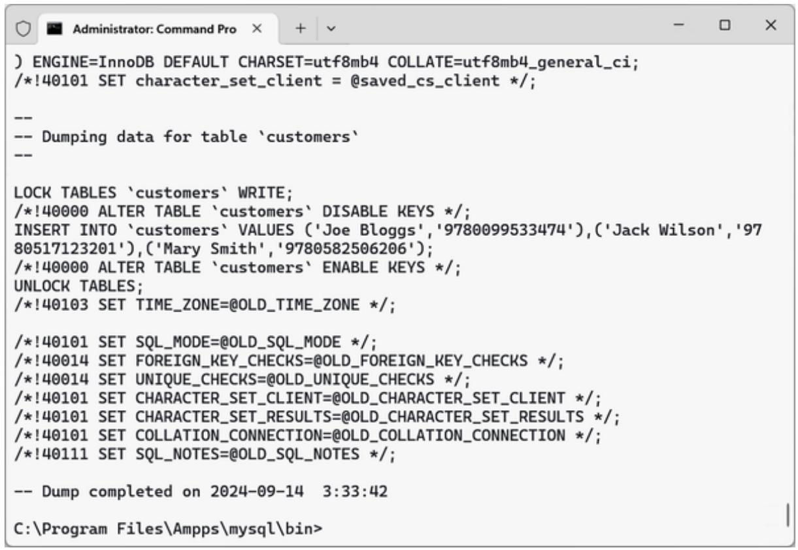

<details>
<summary>text_image</summary>

) ENGINE=InnoDB DEFAULT CHARSET=utf8mb4 COLLATE=utf8mb4_general_ci;
/*!40101 SET character_set_client = @saved_cs_client */;
--
-- Dumping data for table `customers`
--
LOCK TABLES `customers` WRITE;
/*!40000 ALTER TABLE `customers` DISABLE KEYS */;
INSERT INTO `customers` VALUES ('Joe Bloggs','9780099533474'),('Jack Wilson','9780517123201'),('Mary Smith','9780582506206');
/*!40000 ALTER TABLE `customers` ENABLE KEYS */;
UNLOCK TABLES;
/*!40103 SET TIME_ZONE=@OLD_TIME_ZONE */;
/*!40101 SET SQL_MODE=@OLD_SQL_MODE */;
/*!40014 SET FOREIGN_KEY_CHECKS=@OLD_FOREIGN_KEY_CHECKS */;
/*!40014 SET UNIQUE_CHECKS=@OLD_UNIQUE_CHECKS */;
/*!40101 SET CHARACTER_SET_CLIENT=@OLD_CHARACTER_SET_CLIENT */;
/*!40101 SET CHARACTER_SET_RESULTS=@OLD_CHARACTER_SET_RESULTS */;
/*!40101 SET COLLATION_CONNECTION=@OLD_COLLATION_CONNECTION */;
/*!40111 SET SQL_NOTES=@OLD_SQL_NOTES */;
-- Dump completed on 2024-09-14  3:33:42
C:\Program Files\Ampps\mysql\bin>
</details>

Figure 9-4. Dumping the publications database to the screen

### Creating a Backup File

Now that you have mysqldump working and have verified it outputs correctly to the screen, you can send the backup data directly to a file using the > redirect symbol. Assuming that you wish to call the backup file publications.sql, type the command in Example 9-8 (remembering to replace user and password with the correct details).

**NOTE**

The command in Example 9-8 stores the backup file into the current directory. If you need it to be saved elsewhere, you should insert a filepath before the filename. You must also ensure that the directory you are backing up to has the right permissions set to allow the file to be written but not to be accessed by any unprivileged user!

**Example 9-8. Dumping the publications database to a file**

mysqldump -u user -ppassword publications > publications.sql

**NOTE**

Sometimes you may get errors accessing MySQL using Windows PowerShell, which you will not see in a standard Command Prompt window.

If you echo the backup file to screen or load it into a text editor, you will see that it comprises sequences of SQL commands such as:

```sql
DROP TABLE IF EXISTS 'classics';
CREATE TABLE 'classics' (
    'author' varchar(128) default NULL,
    'title' varchar(128) default NULL,
    'category' varchar(16) default NULL,
    'year' smallint(6) default NULL,
    'isbn' char(13) NOT NULL default '',
    PRIMARY KEY ('isbn'),
    KEY 'author' ('author'(20)),
    KEY 'title' ('title'(20)),
```

```txt
KEY 'category' ('category'(4)),
KEY 'year' ('year'),
FULLTEXT KEY 'author_2' ('author', 'title')
) ENGINE=InnoDB DEFAULT CHARSET=latin1;
```

This is smart code that can be used to restore a database from a backup, even if it currently exists; it will first drop any tables that need to be recreated, thus avoiding potential MySQL errors.

**Backing up a single table**

To back up only a single table from a database (such as the classics table from the publications database), you should first lock the table from within the MySQL command line, by issuing a command such as:

LOCK TABLES publications.classics READ;

This ensures that MySQL remains running for read purposes but that writes cannot be made. Then, while keeping the MySQL command line open, use another terminal window to issue the following command from the operating system command line:

mysqldump -u user -ppassword publications classics > classics.sql

You must now release the table lock by entering the following command from the MySQL command line in the first terminal window, which unlocks all tables that have been locked during the current session:

UNLOCK TABLES;

**Backing up all databases**

If you want to back up all your MySQL databases at once (including the system databases such as mysql), you can use a command such as the one in

Example 9-9, which would enable you to restore an entire MySQL database installation. Remember to use locking where required.

Example 9-9. Dumping all the MySQL databases to file

mysqldump -u user -ppassword --all-databases > all\_databases.sql

**NOTE**

Of course, there’s a lot more than just a few lines of SQL code in backed-up database files. I recommend that you take a few minutes to examine a couple to familiarize yourself with the types of commands that appear in backup files and how they work.

### Restoring from a Backup File

To perform a restore from a file, call the mysql executable, passing it the file to restore from using the < symbol. So, to recover all databases that you dumped using the --all-databases option, use a command such as that in Example 9-10.

Example 9-10. Restoring an entire set of databases

mysql -u user -ppassword < all\_databases.sql

To restore a single database, use the -D option followed by the name of the database, as in Example 9-11, where the publications database is being restored from the backup made in Example 9-8.

Example 9-11. Restoring the publications database

mysql -u user -ppassword -D publications < publications.sql

To restore a single table to a database, use a command such as that in Example 9-12, where just the classics table is being restored to the

publications database.

Example 9-12. Restoring the classics table to the publications database

mysql -u user -ppassword -D publications < classics.sql

### Dumping Data in CSV Format

As previously mentioned, the mysqldump program is very flexible and supports various types of output, such as the CSV format, which contains just the data and no commands. You might use it to import data into a spreadsheet or an analytical tool, among other purposes. Example 9-13 shows how you can dump the data from the classics and customers tables in the publications database to the files classics.txt and customers.txt in the folder c:/temp. On macOS or Linux systems, you should modify the destination path to an existing folder.

Example 9-13. Dumping data to CSV-format files

mysqldump -u user -ppassword --no-create-info --tab=c:/temp --fields-terminated-by=',' publications

This command is quite long and is shown here wrapped over two lines, but you must type it all as a single line. The result is:

```txt
Mark Twain (Samuel Langhorne Clemens)', 'The Adventures of Tom Sawyer', 'Classic Fiction', '1876', '9781598184891
Jane Austen', 'Pride and Prejudice', 'Classic Fiction', '1811', '9780582506206
Charles Darwin', 'The Origin of Species', 'Nonfiction', '1856', '9780517123201
Charles Dickens', 'The Old Curiosity Shop', 'Classic
Fiction', '1841', '9780099533474
William Shakespeare', 'Romeo and Juliet', 'Play', '1594', '9780192814968
```

Mary Smith','9780582506206 Jack Wilson','9780517123201

### Planning Your Backups

The more valuable your data, the more often you should back it up, and the more copies you should make. If your database gets updated at least once a day, you should back it up daily. If, on the other hand, it is not updated very often, you can get by with less frequent backups.

**NOTE**

Consider making multiple backups and storing them in different locations. If you have several servers, it is a simple matter to copy your backups between them. You also should make physical backups on removable hard disks, thumb drives, and so on, and keep these in separate locations—preferably somewhere like a fireproof safe.

It’s important to test restoring a database once in a while, too, to make sure your backups are done correctly. You also want to be familiar with restoring a database because you may have to do so when you are stressed and in a hurry, such as after a power failure that takes down the website. You can restore a database to a private server and run a few SQL commands to make sure the data is as it should be.

Once you’ve digested the contents of this chapter, you will be proficient in using both PHP and MySQL. You can check your understanding using the following questions. Chapter 10 introduces you to accessing MySQL using PHP.

## Questions

1. What does the word relationship mean in reference to a relational database?  
2. What is the term for the process of removing duplicate data and optimizing tables?  
3. What are the three rules of the First Normal Form?  
4. How can you make a table satisfy the Second Normal Form?  
5. What do you put in a column to tie together two tables that contain items having a one-to-many relationship?

6. How can you create a database with a many-to-many relationship?  
7. What commands initiate and end a MySQL transaction?  
8. What feature does MySQL provide to enable you to examine how a query will work in detail?  
9. What command would you use to back up the database publications to a file called publications.sql?

See “Chapter 9 Answers” in the Appendix A for the answers to these questions.