# Chapter 10. Accessing MySQL Using PHP

If you worked through the previous chapters, you’re now proficient in using both MySQL and PHP. In this chapter, you will learn how to integrate the two by using PHP’s built-in functions to access MySQL.

## Querying a MySQL Database with PHP

The reason for using PHP as an interface to MySQL is to format the results of SQL queries in a form visible in a web page. As long as you can log in to your MySQL installation using your username and password, you can also do so from PHP.

However, instead of using MySQL’s command line to enter instructions and view output, you will create query strings that are passed to MySQL. When MySQL returns its response, it will come as a data structure that PHP can recognize instead of the formatted output you see when you work on the command line. Further PHP commands can retrieve the data and format it for the web page.

### The Process

The process of using MySQL with PHP is:

1. Connect to MySQL and select the database to use.  
2. Build a query string.  
3. Execute the query.  
4. Fetch the results and output them to a web page.  
5. Repeat steps 2 to 4 until all desired data has been retrieved.

**6. Disconnect from MySQL.**

We’ll work through these steps in turn, but first it’s important to set up your login details securely so people snooping around on your system won’t have access to your database.

### Creating a Login File

Most websites developed with PHP contain multiple program files that will require access to MySQL and will thus need the login and password details. Therefore, it’s sensible to create a single file to store these and then include that file wherever it’s needed. Example 10-1 shows such a file, which I’ve called login.php.

Example 10-1. The login.php file  
```php
<?php // login.php
$host = 'localhost';    // Change as necessary
$db    = 'publications';    // Change as necessary
$user = 'root';    // Change as necessary
ENT    = 'mysql';    // Change as necessary
$chrs = 'utf8mb4';
$attr = "mysql:host=$host;dbname=$db;charset=$chrs";
$opts =
[
    PDO::ATTR_ERRMODE => PDO::ERRMODE_EXCEPTION,
    PDO::ATTR_DEFAULT_FETCH_MODE => PDO::FETCH_ASSOC,
    PDO::ATTR_EMULATE_PREPARES => false,
];
?>
```

Either type the example or edit the file (from the GitHub repo), replacing the username root and password of mysql with the values you use for your MySQL database (and the host and database name too, if necessary), and save it to the document root directory you set up in Chapter 2. We’ll be using the file shortly.

PDO, as seen in the \$opts array, stands for PHP Data Objects and is a builtin data access library that uses the same functions regardless of which

database you’re using.

The hostname localhost should work as long as you’re using a MySQL database on your local system, and the database publications should work if you’re using the same examples I’ve used so far.

The enclosing <?php and ?> tags are especially important for the login.php file in Example 10-1, because they mean that the lines between can be interpreted only as PHP code. If you were to leave them out and someone were to call up the file directly from your website, it would display as text and reveal your secrets. But, with the tags in place, all that person will see is a blank page. The file will correctly include your other PHP files.

**DIRECT INCLUSION OF LOGIN DETAILS**

This chapter includes placing a username and password in the login.php file to make the following short examples work as-is from the repo. At this point you are simply learning about MySQL itself and how it works on a very simple set of non-valuable data in a nonproduction environment. Please be aware that real-world projects must never place secure information anywhere that it might be discovered and compromise your web server or data. Hacking prevention and security are covered toward the end of this chapter, and better ways of handling, storing, and processing sensitive information are provided in Chapter 12, once you have learned the information and techniques needed to understand how to do this.

The \$host variable will tell PHP which computer to use when connecting to a database. This is required because you can access MySQL databases on any computer connected to your PHP installation, and that potentially includes any host anywhere on the web. However, the examples in this chapter will be working on the local server. So, in place of specifying a domain such as mysql.myserver.com, you can use the word localhost (or the IP address 127.0.0.1).

The database we’ll be using, in the string variable \$db, is the one called publications that we created in Chapter 8 (if you’re using a different

database—one provided by your server administrator—you’ll have to modify login.php accordingly).

\$chrs stands for character set, and in this case we are using utf8mb4, a Unicode character set that includes Latin letters, digits, punctuation signs, European and Middle East script letters as well as Korean, Chinese, and Japanese ideographs, and emoji. Characters are encoded using UTF-8 and can take up to 4 bytes per character. utf8mb4 is the recommended UTF-8 character set in MySQL.

**NOTE**

In earlier versions of the book we used direct access to MySQL, which was not at all secure, and later switched to using mysqli, which was more secure. But, as they say, time marches on, and now the most secure and easiest way yet to access a MySQL database from PHP is PDO, which we now use by default in this edition of the book as a lightweight, consistent interface for accessing databases in PHP. Each database driver that implements the PDO interface can expose database-specific features as regular extension functions.

Finally, \$attr and \$opts contain additional options needed to access the database.

**WARNING**

Never store usernames and passwords in the clear on any production project. Refer to Chapter 12 for more on encryption, salting, and security.

### Connecting to a MySQL Database

Now that you have saved the login.php file, you can include it in any PHP files that will need to access the database by using the require\_once statement. This is preferable to an include statement, as it will generate a fatal error if the file is not found—and believe me, not finding the file containing the login details to your database is a fatal error.

Also, using require\_once instead of require means that the file will be read in only when it has not previously been included, which prevents wasteful duplicate disk accesses. Example 10-2 shows the code to use.

Example 10-2. Connecting to a MySQL server using PDO  
```php
<?php
require_once 'login.php';

try
{
    $pdo = new PDO($attr, $user, $pass, $opts);
}
catch (PDODException $e)
{
    throw new PDOException($e->getMessage(), (int)$e->getCode());
}
?>
```

**NOTE**

Resist the temptation to output the contents of any error message received from MySQL in your production project. Rather than helping your users, you could give away sensitive information to hackers, such as login details. Instead, just guide the user with information on how to overcome their difficulty based on what the error message reports to your code. The examples use \$e->getMessage(), which you should replace with a custom message. The exception message as returned by the getMessage method can be stored in a logfile, for example. Also, by throwing a new exception we ensure that the stack trace will be different and won’t contain login details present in the arguments of the original exception stack trace.

This example creates a new PDO object called \$pdo, passing all the values retrieved from the login.php file to the constructor. We achieve error checking by using the try...catch pair of commands.

The PDO object is used in the following examples to access the MySQL database.

#### Building and Executing a Query

Sending a query to MySQL from PHP is as simple as including the relevant SQL in the query method of a connection object. Example 10-3 shows you how to do this.

Example 10-3. Querying a database with PDO  
```php
<?php
$query = "SELECT * FROM classics";
$result = $pdo->query($query);
?>
```

As you can see, the MySQL query looks just like what you would type directly at the command line, except there is no trailing semicolon inside the string, as none is needed when you are accessing MySQL from PHP. Here the variable \$query is assigned a string containing the query to be made and then passed to the query method of the \$pdo object, which returns a result that we place in the object \$result. All the data returned by MySQL is now stored in an easily interrogable format in the \$result object.

Selecting all columns with SELECT \* FROM ... instead of listing only the columns you’ll need is used here for brevity, but in general it should be avoided especially when querying tables with many large columns, to avoid exhausting server memory.

#### Fetching a Result

Once you have an object returned in \$result, you can use it to extract the data you want, one item at a time, using the fetch method of the object. Example 10-4 combines and extends the previous examples into a program that you can run yourself to retrieve the results (as depicted in Figure 10-1). Type this script and save it using the filename query.php, or download it from the example repository.

Example 10-4. Fetching results one row at a time  
```txt
<?php // query.php
```

```php
require_once 'login.php';

try
{
    $pdo = new PDO($attr, $user, $pass, $opts);
}
catch (PDOException $e)
{
    throw new PDOException($e->getMessage(), (int)$e->getCode());
}

$query = "SELECT * FROM classics";
$result = $pdo->query($query);

while ($row = $result->fetch())
{
    echo 'Author: '.htmlspecialchars($row['author']) ."<br>";
    echo 'Title: '.htmlspecialchars($row['title']) ."<br>";
    echo 'Category: '.htmlspecialchars($row['category'])."<br>";
    echo 'Year: '.htmlspecialchars($row['year']) ."<br>";
    echo 'ISBN: '.htmlspecialchars($row['isbn']) ."<br><br>";
}
?>
```

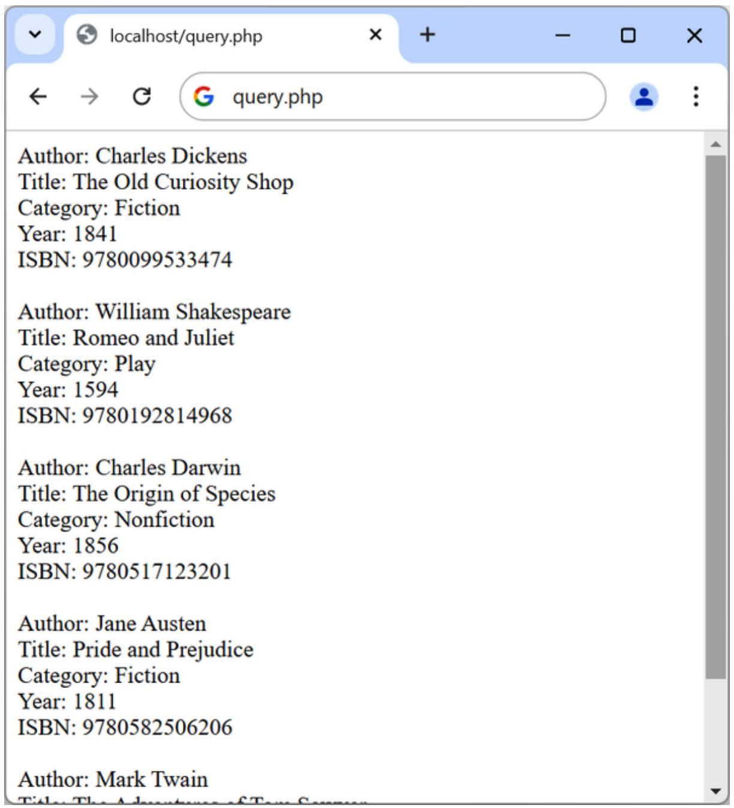

<details>
<summary>text_image</summary>

Author: Charles Dickens
Title: The Old Curiosity Shop
Category: Fiction
Year: 1841
ISBN: 9780099533474

Author: William Shakespeare
Title: Romeo and Juliet
Category: Play
Year: 1594
ISBN: 9780192814968

Author: Charles Darwin
Title: The Origin of Species
Category: Nonfiction
Year: 1856
ISBN: 9780517123201

Author: Jane Austen
Title: Pride and Prejudice
Category: Fiction
Year: 1811
ISBN: 9780582506206

Author: Mark Twain
</details>

Figure 10-1. The output from query.php

Here, each time around the loop, we call the fetch method of the \$pdo object to retrieve the value stored in each row and output the result using echo statements. Don’t worry if you see the results in a different order. This is because we have not used an ORDER BY command to specify the order in which they should be returned, so the order will be unspecified.

When displaying data in a browser whose source was (or may have been) user input, there’s always a risk of sneaky HTML characters being embedded within it—even if you believe it to have been previously sanitized—which could potentially be used for a cross-site scripting (XSS) attack. The simple way to prevent this possibility is to embed all such output within a call to the function htmlspecialchars, which replaces all such characters with harmless HTML entities in which, for example, the < character is replaced with the entity &lt;, and so forth. This technique was implemented in the preceding example and will be used in many of the following examples.

In Chapter 9, I talked about First, Second, and Third Normal Form. You may have noticed that the classics table doesn’t satisfy these, because both author and book details are included within the same table. That’s because we created this table before encountering normalization. However, for the purposes of illustrating access to MySQL from PHP, reusing this table prevents the hassle of typing in a new set of test data, so we’ll stick with it for the time being.

#### Fetching a Row While Specifying the Style

The fetch method can return data in various styles, including the following (where anonymous means unnamed):

PDO::FETCH\_ASSOC

Returns the next row as an array indexed by column name

PDO::FETCH\_BOTH (default)

Returns the next row as an array indexed by both column name and number

PDO::FETCH\_LAZY

Returns the next row as an anonymous object with names as properties

PDO::FETCH\_OBJ

Returns the next row as an anonymous object with column names as properties

PDO::FETCH\_NUM

Returns an array indexed by column number

For the full list of PDO fetch styles, please refer to the online reference.

Therefore, the following (slightly changed) example (shown in Example 10-5) shows more clearly the intention of the fetch method in this case. You may wish to save this revised file using the name fetchrow.php.

Example 10-5. Fetching results one row at a time  
```php
<?php //fetchrow.php
require_once 'login.php';

try
{
    $pdo = new PDO($attr, $user, $pass, $opts);
}
catch (PDOException $e)
{
    throw new PDOException($e->getMessage(), (int)$e->getCode());
}

$query = "SELECT * FROM classics";
$result = $pdo->query($query);

while ($row = $result->fetch(PDO::FETCH_ASSOC)) // Style of fetch
{
    echo 'Author: '.htmlspecialchars($row['author']) ."<br>";
    echo 'Title: '.htmlspecialchars($row['title']) ."<br>";
    echo 'Category: '.htmlspecialchars($row['category'])."<br>";
    echo 'Year: '.htmlspecialchars($row['year']) ."<br>";
    echo 'ISBN: '.htmlspecialchars($row['isbn']) ."<br><br>";
```

```txt
}
?>
```

The fetch method in this example returns only an associative array, leaving out the numeric indexes that would be returned when the fetch style wouldn’t be specified, or if PDO::FETCH\_BOTH would be used. Associative arrays can be more useful than numeric ones because you can refer to each column by name, such as \$row['author'], instead of trying to remember where it is located in the column order. The numeric indexes are often unused so the fetch method does not need to return them.

#### Closing a Connection

PHP will eventually return the memory it has allocated for objects after you have finished with the script, so in small scripts, you don’t usually need to worry about releasing memory yourself. However, should you wish to close a PDO connection manually, you simply set it to null like this:

```txt
$pdo = null;
```

## A Practical Example

It’s time to write our first example of inserting data in and deleting it from a MySQL table using PHP. I recommend that you type Example 10-6 and save it to your web development directory using the filename sqltest.php. You can see an example of the program’s output in Figure 10-2.

**NOTE**

Example 10-6 creates a standard HTML form. Chapter 11 explains forms in detail, but in this chapter I take form handling for granted and just deal with database interactions.

Example 10-6. Inserting and deleting using sqltest.php

```php
<?php // sqltest.php
require_once 'login.php';

try
{
    $pdo = new PDO($attr, $user, $pass, $opts);
}
catch (PDOException $e)
{
    throw new PDOException($e->getMessage(), (int)$e->getCode());
}

if (isset($_POST['delete']) && isset($_POST['isbn'])) 
{
    $isbn = sanitize_post_value($pdo, 'isbn');
    $query = "DELETE FROM classics WHERE isbn=$isbn";
    $result = $pdo->query($query);
}

if (isset($_POST['author']) &&
    isset($_POST['title']) &&
    isset($_POST['category']) &&
    isset($_POST['year']) &&
    isset($_POST['isbn'])) 
{
    $author = sanitize_post_value($pdo, 'author');
    $title = sanitize_post_value($pdo, 'title');
    $category = sanitize_post_value($pdo, 'category');
    $year = sanitize_post_value($pdo, 'year');
    $isbn = sanitize_post_value($pdo, 'isbn');

    $query = "INSERT INTO classics VALUES" .
    "$(author, $title, $category, $year, $isbn)";
    $result = $pdo->query($query);
}

echo <<<_END
<form action="sqltest.php" method="post"><pre>
    Author <input type="text" name="author">
    Title <input type="text" name="title">
    Category <input type="text" name="category">
    Year <input type="text" name="year">
    ISBN <input type="text" name="isbn">
    <input type="submit" value="ADD RECORD">
</pre></form>
_END;
```

```php
$query = "SELECT * FROM classics";
$result = $pdo->query($query);

while ($row = $result->fetch())
{
    $r0 = htmlspecialchars($row['author']);
    $r1 = Arkansas($row['title']);
    $r2 = Arkansas($row['category']);
    $r3 = Arkansas($row['year']);
    $r4 = Arkansas($row['isbn'])

echo <<<_END
<pre>
    Author $r0
    Title $r1
Category $r2
    Year $r3
    ISBN $r4
</pre>
<form action='sqltest.php' method='post'>
<input type='hidden' name='delete' value='yes'>
<input type='hidden' name='isbn' value='$r4'>
<input type='submit' value='DELETE RECORD'></form>
_END;
}

function sanitize_post_value($pdo, $var)
{
    return $pdo->quote($_POST[$var]);
}
?>
```

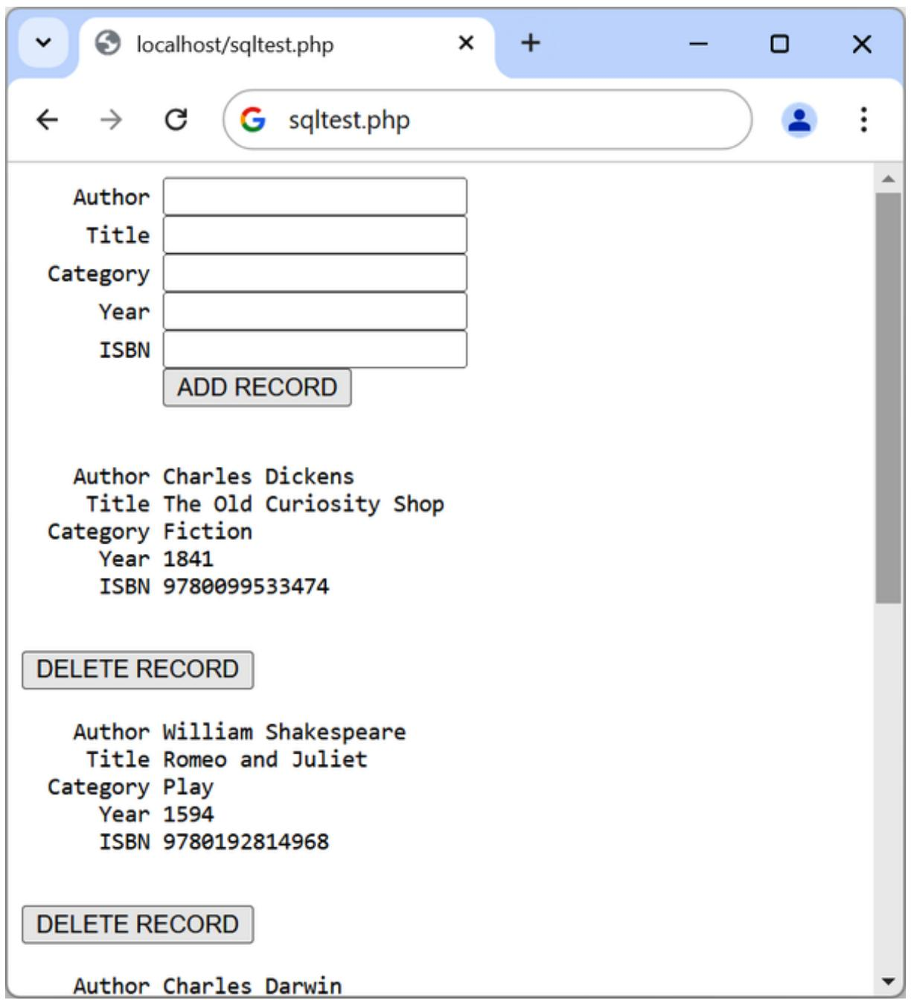

<details>
<summary>text_image</summary>

Author
Title
Category
Year
ISBN
ADD RECORD
Author Charles Dickens
Title The Old Curiosity Shop
Category Fiction
Year 1841
ISBN 9780099533474
DELETE RECORD
Author William Shakespeare
Title Romeo and Juliet
Category Play
Year 1594
ISBN 9780192814968
DELETE RECORD
Author Charles Darwin
</details>

Figure 10-2. The output from Example 10-6, sqltest.php

At almost 80 lines of code, this program may appear daunting, but don’t worry—you’ve already covered many of those lines in Example 10-4, and what the code does is actually quite simple.

It first checks for any inputs that may have been made and then either inserts new data into the table classics of the publications database or deletes a row from it, according to the input supplied. Regardless of whether there was input, the program then outputs all rows in the table to the browser. Let’s see how it works.

The first section of new code starts by using the isset function to check whether values for all the fields have been posted to the program. Upon confirmation, each line within the if statement calls the function sanitize\_post\_value, which appears at the end of the program. This function has one small but critical job: fetching input from the browser.

**NOTE**

For clarity and brevity, and to explain things as simply as possible, many of the following examples omit sensible security precautions that would have made them longer and could detract from clearly explaining their function. Don’t skip past “Preventing Hacking Attempts” on preventing your database from being hacked, where you will learn about additional actions you can take to secure your code.

### The \$\_POST Array

I mentioned in an earlier chapter that a browser sends user input through either a GET request or a POST request. Form data is almost always sent using the POST method as putting all the form data in GET request URLs would be unsightly as well as a potential security and privacy risk. Once a POST method form has been submitted, the web server bundles up all of the user input and puts it into an array named \$\_POST.

Whether a form has been set to use either the GET or POST method, the \$\_GET associative array will always be populated with URL query parameters, if present, from the form’s action attribute. Additionally, the \$\_GET array will also contain form field values if the GET method has been used. If the form was submitted using the POST method, the form field data will be returned in the \$\_POST array.

Each field has an element in the array named after that field. So, if a form contains a field named isbn, the \$\_POST array contains an element keyed by the word isbn. The PHP program can read that field by referring to either \$\_POST['isbn'] or \$\_POST["isbn"] (single and double quotes have the same effect in this case).

If the \$\_POST syntax still seems complex to you, remember you can just use the convention shown in Example 10-6: copy the user’s input to other variables and forget about \$\_POST after that. This is normal in PHP programs: they retrieve all the fields from \$\_POST at the beginning of the program and then ignore it.

**NOTE**

There is no reason to write to an element in the \$\_POST array. Its only purpose is to communicate information from the browser to the program, and you’re better off copying data to your own variables before altering it.

The sanitize\_post\_value function from Example 10-6 passes each item it retrieves through the quote method of the PDO object to escape any quotes that a hacker may have inserted to break into or alter your database, like this, and it adds quotes around each string for you:

```perl
function sanitize_post_value($pdo, $var)
{
    return $pdo->quote($_POST[$var]);
}
```

### Deleting a Record

Prior to checking whether new data has been posted, the program checks whether the variable \$\_POST['delete'] has a value. If so, the user has clicked the DELETE RECORD button to erase a record. In this case, the value of \$isbn will also have been posted.

As you will recall, the ISBN uniquely identifies each record. The script receives the identifier as the value of the hidden HTML form field named isbn in \$\_POST['isbn']. The sanitize\_post\_value function is then used to escape any dangerous characters and add quotes. The returned value is stored in \$isbn, which is then used in the DELETE FROM query created in the variable \$query, which is then passed to the query method of the pdo object to issue it to MySQL.

If \$\_POST['delete'] is not set (and there is no record to be deleted), \$\_POST['author'] and other posted values are checked. If they have all been given values, \$query is set to an INSERT INTO command, followed by the five values to be inserted. The string is then passed to the query method.

**HELPFUL ERROR MESSAGES**

If any query fails, PHP will throw an error. On a production website, you will not want these very programmer-oriented error messages to show, so you will need to add more try...catch commands and replace the existing catch statement, which handles connection errors only, with one in which you handle the error yourself neatly and decide what sort of error message (if any) to give to your users.

### Displaying the Form

Before displaying the little form (as shown in Figure 10-2), the program sanitizes copies of the elements we will be outputting from the \$row array into the variables \$r0 through \$r4 by passing them to the htmlspecialchars function, to replace any potentially dangerous HTML characters with harmless HTML entities.

Then the part of code that displays the output follows, using a heredoc echo <<<\_END...\_END structure as seen in previous chapters, which outputs everything between the \_END tags.

The HTML form section simply sets the form’s action to sqltest.php. This means that when the form is submitted, the contents of the form fields will be sent to the file sqltest.php, which is the program itself. The form is also set up to send the fields as a POST rather than a GET request. This is

because GET requests are appended to the URL being submitted and can look messy in your browser. They also allow users to easily modify submissions and try to hack your server (although that also can be achieved with in-browser developer tools). Additionally, avoiding GET requests prevents too much information appearing in server logfiles. Therefore, whenever possible, you should use POST submissions, which also have the benefit of revealing less posted data.

Having output the form fields, the HTML displays a submit button with the name ADD RECORD and closes the form. Note the <pre> and </pre> tags here, which have been used to force a monospaced font that lines up all the inputs neatly. The carriage returns at the end of each line are also output when inside <pre> tags.

**NOTE**

Instead of using the echo command, the program could drop out of PHP using ?>, issue the HTML, and then reenter PHP processing with <?php. Which style is used is a matter of programmer preference.

### Querying the Database

Next, the code returns to the familiar territory of Example 10-4, where a query is sent to MySQL asking to see all the records in the classics table, like this:

```perl
$query = "SELECT * FROM classics";
$result = $pdo->query($query);
```

A while loop is then entered to display the contents of each row. Then the program populates the array \$row with a row of results by calling the fetch method of \$result.

With the data in \$row, it’s now a simple matter to display it within the heredoc echo statement that follows, in which I have chosen to use a <pre> tag to line up the display of each record in a pleasing manner. After the display of each record, a second form also posts to sqltest.php (the program itself) but this time contains two hidden fields: delete and isbn. The delete field is set to yes and isbn to the value held in \$row[isbn], which contains the ISBN for the record.

Then a submit button with the name DELETE RECORD is displayed, and the form is closed. A curly brace then completes the while loop, which will continue until all records have been displayed.

Finally, you see the definition for the function sanitize\_post\_value, which we’ve already looked at. And that’s it—our first PHP program to manipulate a MySQL database. So, let’s check out what it can do.

Once you’ve typed the program (and corrected any errors), enter this data into the various input fields to add a new record for the book Moby Dick to the database:

Herman Melville

Moby Dick

Fiction

1851

9780199535729

### Running the Program

When you have submitted this data using the ADD RECORD button, scroll down the web page to see the new addition. It should look something like Figure 10-3, although since we have not ordered the results using ORDER BY, the position in which it appears is undetermined.

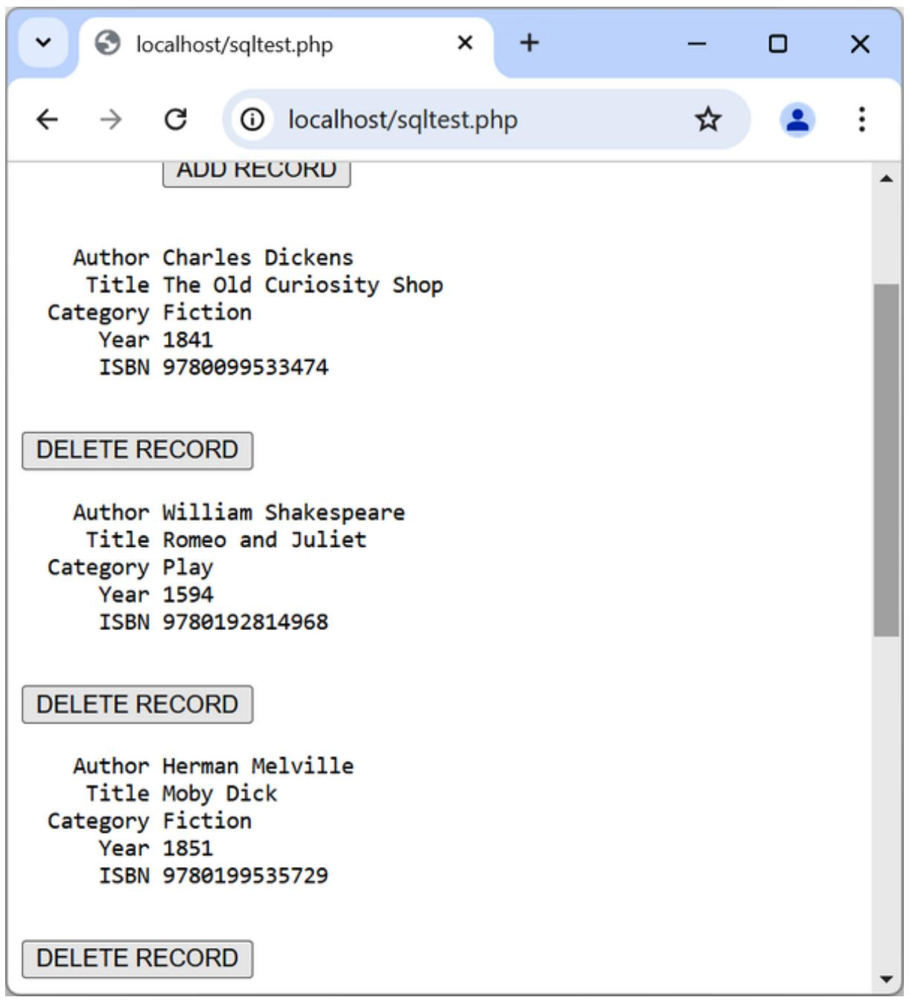

<details>
<summary>text_image</summary>

localhost/sqltest.php
localhost/sqltest.php
ADD RECORD
Author Charles Dickens
Title The Old Curiosity Shop
Category Fiction
Year 1841
ISBN 9780099533474
DELETE RECORD
Author William Shakespeare
Title Romeo and Juliet
Category Play
Year 1594
ISBN 9780192814968
DELETE RECORD
Author Herman Melville
Title Moby Dick
Category Fiction
Year 1851
ISBN 9780199535729
DELETE RECORD
</details>

Figure 10-3. The result of adding Moby Dick to the database

Now let’s look at how deleting a record works by creating a dummy record. Try entering just the number 1 in each of the five fields and clicking the ADD RECORD button. If you scroll down, you’ll see a new record consisting just of 1s. Obviously, this record isn’t useful in this table, so now click the DELETE RECORD button and scroll down again to confirm that the record has been deleted.

**NOTE**

Assuming that everything worked, you now can add and delete records at will. Try doing this a few times, but leave the main records in place (including the new one for Moby Dick), as we’ll be using them later. You also can try adding the record with all 1s again a couple of times and if you haven’t already deleted it, note the error message that you receive the second time, indicating that there is already an ISBN with the number 1.

## Practical MySQL

You are now ready for some practical techniques you can use in PHP to access the MySQL database, including tasks such as creating and dropping tables; inserting, updating, and deleting data; and protecting your database and website from malicious users. The following examples assume that you’ve already created the login.php program discussed earlier in this chapter.

### Creating a Table

Let’s assume that you are working for a wildlife park and need to create a database to hold details about all the types of cats it houses. You know there are nine families of cats—Lion, Tiger, Jaguar, Leopard, Cougar, Cheetah, Lynx, Caracal, and Domestic—so you’ll need a column for that. Then each cat has been given a name, so that’s another column, and you also want to keep track of their ages, which is another. Of course, you will probably need more columns later, perhaps to hold dietary requirements, inoculations, and other details, but for now that’s enough to get going. A unique identifier is also needed for each animal, so you also decide to create a column for that called id.

Example 10-7 shows the code you might use to create a MySQL table to hold this data, with the main query assignment in bold text.

Example 10-7. Creating a table called cats

```php
<?php
require_once 'login.php';

try
{
    $pdo = new PDO($attr, $user, $pass, $opts);
}
catch (PDOException $e)
{
    throw new PDOException($e->getMessage(), (int)$e->getCode());
}

$query = "CREATE TABLE cats (
    id SMALLINT NOT NULL AUTO_INCREMENT,
    family VARCHAR(32) NOT NULL,
    name VARCHAR(32) NOT NULL,
    age TINYINT NOT NULL,
    PRIMARY KEY (id)
)|";

$result = $pdo->query($query);
?>
```

As you can see, the MySQL query looks just like what you would type directly at the command line, except without the trailing semicolon.

### Describing a Table

When you aren’t logged in to the MySQL command line, here’s a handy piece of code that you can use to verify that a table has been correctly created from inside a browser. It simply issues the query DESCRIBE cats and then outputs an HTML table with four headings—Column, Type, Null, and Key—underneath which all columns within the table are shown. To use it with other tables, simply replace the name cats in the query with that of the new table (see Example 10-8).

**Example 10-8. Describing the cats table**

```php
<?php
require_once 'login.php';
```

```txt
try
{
    \(pdo = new PDO($attr, $user, $pass, $opts);
\)
}
catch (PDOException \(e\))
{
    throw new PDOException(\(e->getMessage(), (int)\) \(e->getCode());
\)
\(query = "DESCRIBE cats";
\(result = $pdo->query($query);\)

echo "<table><tr><th>Column</th><th>Type</th>";
echo "<th>Null</th><th>Key</th></tr<|im_start|>

while (\(row = result->fetch(PDO::FETCH_NUM)\))
{
    echo "<tr>";
    for (\(k = 0 ; k < 4 ; ++k\))
    echo "<td>" . htmlspecialchars(\(row[\(k\)] ) . "</td>";
    echo "</tr>";
}

echo "</table>";
?>
```

See how the PDO fetch style of FETCH\_NUM is used to return a numeric array so that it is easy to display the contents of the returned data without using names. The output from the program should look like this:

```txt
Column Type Null Key
id smallint(6) NO PRI
family varchar(32) NO
name varchar(32) NO
age tinyint(4) NO
```

### Dropping a Table

Dropping a table is very easy to do and therefore very dangerous, so be careful. It is not something you would usually do in a PHP project, but Example 10-9 shows the code that you’d use if needed. However, I don’t recommend that you try it until you have been through the other examples (up to “Performing Additional Queries”), as it will drop the table cats and you’ll have to re-create it using Example 10-7.

Example 10-9. Dropping the cats table  
```php
<?php
require_once 'login.php';

try
{
    $pdo = new PDO($attr, $user, $pass, $opts);
}
catch (PDODException $e)
{
    throw new PDOException($e->getMessage(), (int)$e->getCode());
}

$query = "DROP TABLE cats";
$result = $pdo->query($query);
?>
```

### Adding Data

Let’s add some data to the table, using the code in Example 10-10.

Example 10-10. Adding data to the cats table  
```php
<?php
require_once 'login.php';

try
{
    $pdo = new PDO($attr, $user, $pass, $opts);
}
catch (PDODEcception $e)
{
    throw new PDOException($e->getMessage(), (int)$e->getCode());
}

$query = "INSERT INTO cats VALUES(NULL, 'Lion', 'Leo', 4)";
$result = $pdo->query($query);
?>
```

You may wish to add a couple more items of data by modifying \$query as follows and calling up the program in your browser again:

```sql
$query = "INSERT INTO cats VALUES(NULL, 'Cougar', 'Growler', 2)";
$query = "INSERT INTO cats VALUES(NULL, 'Cheetah', 'Charly', 3);
```

By the way, did you notice the NULL value passed as the first parameter? This is because the id column is of type AUTO\_INCREMENT, and MySQL will decide what value to assign according to the next available number in sequence. So, we simply pass a NULL value, which will be ignored.

Of course, the most efficient way to populate MySQL with data is to create an array and insert the data with a single query using multiple lists of column values specified within parentheses and separated by commas:

**INSERT INTO cats VALUES**

(NULL, 'Cougar', 'Growler', 2), (NULL, 'Cheetah', 'Charly', 3)

**NOTE**

At this point, I am concentrating on showing you how to directly insert data into MySQL (and providing some security precautions to keep the process safe). However, later in the book we’ll move on to a better method you can employ that involves placeholders (see “Using Placeholders”), which make it virtually impossible for users to inject malicious hacks into your database. So, as you read this section, understand that these are the basics of how MySQL insertion works and remember that we will improve on it later.

### Retrieving Data

Now that some data has been entered into the cats table, Example 10- 11 shows how you can check that it was correctly inserted.

Example 10-11. Retrieving rows from the cats table

```txt
<?php
```

```perl
require_once 'login.php';

try
{
    $pdo = new PDO($attr, $user, $pass, $opts);
}
catch (PDOException $e)
{
    throw new PDOException($e->getMessage(), (int)$e->getCode());
}

$query = "SELECT * FROM cats";
$result = $pdo->query($query);

echo "<table><tr> <th>Id</th> <th>Family</th>";
echo "<th{Name</th><th>Age</th></tr<|im_start|>

while ($row = $result->fetch(PDO::FETCH_NUM))
{
    echo "<tr>";
    for ($k = 0 ; $k < 4 ; ++$k)
    echo "<td>" . htmlspecialchars($row[$k]) . "</td>";
    echo "</tr>";
}

echo "</table>";
?>
```

This code simply issues the MySQL query SELECT \* FROM cats and then displays all the rows returned by requiring them in the form of numerically accessed arrays with the style of PDO::FETCH\_NUM. Its output is:

```txt
Id Family Name Age  
1 Lion Leo 4  
2 Cougar Growler 2  
3 Cheetah Charly 3
```

Here you can see that the id column has correctly auto-incremented.

### Updating Data

Changing data that you have already inserted is also quite simple. Did you notice the spelling of Charly for the cheetah’s name? Let’s correct that to

```php
<?php
require_once 'login.php';

try
{
    $pdo = new PDO($attr, $user, $pass, $opts);
}
catch (PDODEcception $e)
{
    throw new PDOException($e->getMessage(), (int)$e->getCode());
}

$query = "UPDATE cats SET name='Charlie' WHERE name='Charly'";
$result = $pdo->query($query);
?>
```

If you run Example 10-11 again, you’ll see that it now outputs:

```txt
Id Family Name Age  
1 Lion Leo 4  
2 Cougar Growler 2  
3 Cheetah Charlie 3
```

### Deleting Data

Growler the cougar has been transferred to another zoo, so it’s time to remove him from the database; see Example 10-13.

Example 10-13. Removing Growler the cougar from the cats table

```php
<?php
require_once 'login.php';
try
{
    $pdo = new PDO($attr, $user, $pass, $opts);
}
```

```php
catch (PDODException $e)
{
    throw new PDOException($e->getMessage(), (int)$e->getCode());
}

$query = "DELETE FROM cats WHERE name='Growler'";
$result = $pdo->query($query);
?>
```

This uses a standard DELETE FROM query, and when you run Example 10- 11, you can see that the row has been removed:

```txt
Id Family Name Age  
1 Lion Leo 4  
3 Cheetah Charlie 3
```

### Using AUTO\_INCREMENT

When using AUTO\_INCREMENT, you cannot know what value has been given to a column before a row is inserted. Instead, if you need to know it, you must ask MySQL afterward by calling \$pdo->lastInsertId(). This need is common: for instance, when you process a purchase, you might insert a new customer into a Customers table and then refer to the newly created CustId when inserting a purchase into the Purchases table.

**NOTE**

Using AUTO\_INCREMENT is recommended instead of selecting the highest ID in the id column and incrementing it by one, because concurrent queries could change the values in that column after the highest value has been fetched and before the calculated value is stored.

Example 10-10 can be rewritten as Example 10-14 to display this value after each insert.

Example 10-14. Adding data to the cats table and reporting the insert ID

```php
<?php
require_once 'login.php';

try
{
    $pdo = new PDO($attr, $user, $pass, $opts);
}
catch (PDODEcption $e)
{
    throw new PDOException($e->getMessage(), (int)$e->getCode());
}

$query = "INSERT INTO cats VALUES(NULL, 'Lynx', 'Stumpy', 5)";
$result = $pdo->query($query);

echo "The Insert ID was: " . $pdo->lastInsertId();
?>
```

The contents of the table should now look like the following (note how the previous id value of 2 is not reused, as this could cause complications in some instances):

<table><tr><td>Id</td><td>Family</td><td>Name</td><td>Age</td></tr><tr><td>1</td><td>Lion</td><td>Leo</td><td>4</td></tr><tr><td>3</td><td>Cheetah</td><td>Charlie</td><td>3</td></tr><tr><td>4</td><td>Lynx</td><td>Stumpy</td><td>5</td></tr></table>

**Using insert IDs**

It’s very common to insert data in multiple tables: a book followed by its author, a customer followed by their purchase, and so on. When doing this with an auto-increment column, you will need to retain the insert ID returned for storing in the related table.

For example, let’s assume that these cats can be “adopted” by the public as a means of raising funds, and that when a new cat is stored in the cats table, we also want to create a key to tie it to the animal’s adoptive owner. The code to do this is similar to that in Example 10-14, except that the returned insert ID is stored in the variable \$insertID and is then used as part of the subsequent query:

```perl
$query = "INSERT INTO cats VALUES(NULL, 'Lynx', 'Stumpy', 5)";
$result = $pdo->query($query);
(insertID = $pdo->lastInsertId();

$query = "INSERT INTO owners VALUES($insertID, 'Ann', 'Smith'";
$result = $pdo->query($query);
```

Now the cat is connected to its “owner” through the cat’s unique ID, which was created automatically by AUTO\_INCREMENT. This example, and especially the last two lines, is theoretical code showing how to use an insert ID as a key if we had created a table called owners.

### Performing Additional Queries

Okay, that’s enough feline fun. To explore some slightly more complex queries, we need to revert to using the customers and classics tables that you created in Chapter 8. There will be three customers in the customers table, while the classics table holds the details of a few books. They also share a common column of ISBNs, called isbn, that you can use to perform additional queries.

For example, to display all of the customers along with the titles and authors of the books they have bought, you can use the code in Example 10- 15.

Example 10-15. Performing a secondary query

```php
<?php
require_once 'login.php';

try
{
    $pdo = new PDO($attr, $user, $pass, $opts);
}
catch (PDODException $e)
{
    throw new PDOException($e->getMessage(), (int)$e->getCode());
}
```

```php
$query = "SELECT * FROM customers";
$result = $pdo->query($query);

while ($row = $result->fetch())
{
    $custname = htmlspecialchars($row['name']);
    $custisbn = htmlspecialchars($row['isbn']);
    echo "$custname purchased ISBN $custisbn: <br>";
    $subquery = "SELECT * FROM classics WHERE isbn='custisbn'";
    $subresult = $pdo->query($subquery);
    $subrow = $subresult->fetch();

    $custbook = htmlspecialchars($subrow['title']);
    $custauth = htmlspecialchars($subrow['author']);
    echo "&nbsp;&nbsp; '$custbook' by $custauth<br><br>";
}
?>
```

This program uses an initial query to the customers table to look up all the customers and then, given the ISBNs of the books each customer purchased, makes a new query to the classics table to find out the title and author for each. The output from this code should be similar to:

```txt
Joe Bloggs purchased ISBN 9780099533474: 'The Old Curiosity Shop' by Charles Dickens
Jack Wilson purchased ISBN 9780517123201: 'The Origin of Species' by Charles Darwin
Mary Smith purchased ISBN 9780582506206: 'Pride and Prejudice' by Jane Austen
```

**NOTE**

Of course, although it wouldn’t illustrate performing additional queries, in this particular case you could also return the same information using a NATURAL JOIN query (see Chapter 8), like this:

SELECT name,isbn,title,author FROM customers NATURAL JOIN classics;

## Preventing Hacking Attempts

You might at first find it difficult to understand just how dangerous it is to pass user input unchecked to MySQL. For example, suppose you have a simple piece of code to verify a user, and it looks like this:

```txt
$user = $_POST['user'];
ENT
$pass = $_POST['pass'];
$query = "SELECT * FROM users WHERE user='user' AND pass='pass'";
```

At first glance, you might think this code is perfectly fine. If the user enters values of fredsmith and mypass for \$user and \$pass, respectively, then the query string, as passed to MySQL, will be:

SELECT \* FROM users WHERE user='fredsmith' AND pass='mypass'

This is all well and good, but what if someone enters the following for \$user (and doesn’t even enter anything for \$pass)?

admin' #

Here’s the string that would be sent to MySQL:

SELECT \* FROM users WHERE user='admin' #' AND pass=''

Do you see the problem? An SQL injection attack has occurred. In MySQL, the # symbol represents the start of a comment. Therefore, the user will be logged in as admin (assuming there is a user admin), without having to enter a password. In the following, the part of the query that will be executed is shown in bold; the rest will be ignored:

SELECT \* FROM users WHERE user='admin' #' AND pass=''

Count yourself very lucky if that’s all a malicious user does to you. You might still be able to go into your application and undo any changes the user makes as admin. But what if your application code removes a user from the database? The code might look something like this:

```txt
$user = $_POST['user'];
ENT
$pass = $_POST['pass'];
$query = "DELETE FROM users WHERE user='user' AND pass='pass'";
```

Again, this looks quite normal at first glance, but what if someone entered the following for \$user?

anything' OR 1=1 #

This would be interpreted by MySQL as:

DELETE FROM users WHERE user='anything' OR 1=1 #' AND pass=''

Ouch—because any statement followed by OR 1=1 is always TRUE, that SQL query will always be TRUE, and therefore, since the rest of the statement is ignored due to the # character, you’ve now lost your whole users database! So what can you do about this kind of attack?

### Steps You Can Take

First, don’t rely on PHP’s built-in magic quotes, used to automatically escape any characters such as single and double quotes by prefacing them with a backslash (\). The feature was removed in PHP 5.4.0.

Instead, as we showed earlier, you could use the quote method of the PDO object to escape all characters and surround strings with quotation marks. Example 10-16 is a function you can use that will properly sanitize a userinputted string for you.

Example 10-16. How to properly sanitize user input for MySQL

```php
<?php
function mysql_fix_string($pdo, $string)
{
    return $pdo->quote($string);
}
?>
```

Example 10-17 illustrates how you would incorporate mysql\_fix\_string within your own code.

You could also call \$pdo->quote(\$string) directly instead of wrapping it in a function like mysql\_fix\_string.

Example 10-17. How to safely access MySQL with user input

```php
<?php
require_once 'login.php';

try
{
    $pdo = new PDO($attr, $user, $pass, $opts);
}
catch (PDODEcception $e)
{
    throw new PDOException($e->getMessage(), (int)$e->getCode());
}
```

```php
$user = mysql_fix_string($pdo, $_POST['user']);
ENT$pass = mysql_fix_string($pdo, $_POST['pass']);
$query = "SELECT * FROM users WHERE user=$user AND pass=$pass";
// Etc...
function mysql_fix_string($pdo, $string)
{
    return $pdo->quote($string);
}
?>
```

**NOTE**

Remember: because the quote method automatically adds quotes around strings, you should not use them in any query that uses these sanitized strings. So, in place of using this:

```txt
$query = "SELECT * FROM users WHERE user='user' AND pass='pass'"; you should enter:
```

```sql
$query = "SELECT * FROM users WHERE user=$user AND pass=$pass";
```

These precautions are becoming less important, however, because there’s a much easier and safer way to access MySQL, which obviates the need for these types of functions— the use of placeholders, which is explained next.

### Using Placeholders

All the methods shown thus far work with MySQL but have security implications, with strings constantly requiring escaping to prevent security risks. So, now that you know the basics, let me introduce the best and recommended way to interact with MySQL that is pretty much bulletproof in terms of security. Once you have read this section, you should no longer use direct inserting of data into MySQL but instead always use

placeholders. It was still important to show you how to do it without placeholders because a lot of existing or older code doesn’t use them.

So what are placeholders? They are positions within prepared statements in which data is transferred directly to the database, without the possibility of user-submitted (or other) data being interpreted as MySQL statements (and the potential for hacking that could result).

The technology requires that you first prepare the statement you wish to be executed in MySQL but leave all the parts of the statement that refer to data as simple question marks.

In plain MySQL, prepared statements look like Example 10-18.

Example 10-18. MySQL placeholders

PREPARE statement FROM "INSERT INTO classics VALUES(?,?,?,?,?)";

```txt
SET @author = "Emily Brontë",
@title = "Wuthering Heights",
@category = "Classic Fiction",
@year = "1847",
@isbn = "9780553212587";
```

EXECUTE statement USING @author,@title,@category,@year,@isbn; DEALLOCATE PREPARE statement;

This can be cumbersome to submit to MySQL, so the PDO extension makes handling placeholders easier with a ready-made method called prepare, which you call like this:

\$stmt = \$pdo->prepare('INSERT INTO classics VALUES(?,?,?,?,?)');

The object \$stmt (shorthand for statement) returned by this method is then used for sending the data to the server in place of the question marks. Its first use is to bind some PHP variables to each of the question marks (the placeholder parameters) in turn, like this:

```perl
stmt->bindParam(1, $author, PDO::PARAM_STR, 128);
stmt->bindParam(2, $title, PDO::PARAM_STR, 128);
stmt->bindParam(3, $category, PDO::PARAM_STR, 16);
stmt->bindParam(4, $year, PDO::PARAM_INT);
stmt->bindParam(5, $isbn, PDO::PARAM_STR, 13);
```

The first argument to bindParam is a number representing the position in the query string of the value to insert (in other words, which question mark placeholder is being referred to). This is followed by the variable that will supply the data for that placeholder, and then the type of data the variable must be and, if a string, another value follows stating its maximum length.

With the variables bound to the prepared statement, it is now necessary to populate them with the data to be passed to MySQL, like this:

$author = 'Emily Brontë';$ $title = 'Wuthering Heights';$ $category = 'Classic Fiction';$ $year = '1847';$ $isbn = '9780553212587';$

At this point, PHP has everything it needs to execute the prepared statement, so you can issue the following command, which calls the execute method of the \$stmt object created earlier:

```txt
$stmt->execute();
```

Before going any further, it makes sense to verify whether the command was executed successfully. You can do that by calling the rowCount method of \$stmt:

```txt
printf("%d Row inserted.\n", $stmt->rowCount());
```

In this case, the output should indicate that one row was inserted.

When using the bindParam method, you need to correctly specify the position, the type, and need to use a variable. Luckily, there’s an easier and clearer way to use placeholders. Instead of specifying positions and using question marks, you can use named values (for example :name), and instead of binding variables with bindParam, you can pass values directly to the execute method:

```txt
stmt = $pdo->prepare('INSERT INTO classics VALUES(:author, :title, :category, :year, :isbn)');
stmt->execute([
    'author' => 'Emily Brontë',
    'title' => 'Wuthering Heights',
    'category' => 'Classic Fiction',
    'year' => 1847,
    'isbn' => '9780553212587'
]);
```

Note how the keys in the array passed to execute have the same names as the named parameters in the query passed to the prepare method. The order of the array items is irrelevant; the key is what binds the value to the named parameter.

The colon prefix (:) is optional in the execute call (the array keys can be named either author or :author) but required in the prepare call. PHP will guess the data types from the array values, which can be type-casted if needed; you don’t need to specify them.

When you put all this together, the result is Example 10-19.

Example 10-19. Issuing prepared statements

```php
<?php
require_once 'login.php';
try
{
    $pdo = new PDO($attr, $user, $pass, $opts);
}
catch (PDOException $e)
```

```php
{
    throw new PDOException($e->getMessage(), (int)$e->getCode());
}

$stmt = $pdo->prepare('INSERT INTO classics
VALUES(:author, :title, :category, :year, :isbn)');
$stmt->execute([
    'author' => 'Emily Brontë',
    'title' => 'Wuthering Heights',
    'category' => 'Classic Fiction',
    'year' => 1847,
    'isbn' => '9780553212587'
]);
printf("%d Row inserted.\n", $stmt->rowCount());
?>
```

Every time you use prepared statements in place of nonprepared ones, you will be closing a potential security hole, so it’s worth spending some time getting to know how to use them.

### Preventing JavaScript Injection into HTML

There’s another type of injection you need to be concerned about—not for the safety of your own websites but for your users’ privacy and protection. That’s cross-site scripting, also referred to as an XSS attack.

This occurs when you allow HTML or, more often, JavaScript code to be input by a user and then displayed by your website. One place this is common is in a comment form. What happens most often is that a malicious user will try to write code that steals cookies from your site’s users, which even allows them to discover username and password pairs if those are poorly handled or other information that could enable session hijacking (in which a user’s login is taken over by a hacker, who could then take over that person’s account!). Or the malicious user might launch a phishing attack to steal login credentials from a fake login form.

Preventing this is as simple as calling the htmlentities function, which strips out all HTML markup and replaces it with a form that displays the characters but does not allow a browser to act on them. For example, consider this HTML:

```html
<script src='http://example.com/hack.js'></script>
<script>hack();</script>
```

This code loads in a JavaScript program and then executes malicious functions. But if it is first passed through htmlentities, it will be turned into the following totally harmless string:

```html
&lt;script src=&#039;http://example.com/hack.js&#039;&gt; &lt;/script&gt; &lt;script&gt;hack();&lt;/script&gt;
```

Therefore, if you are ever going to display anything that your users enter, either immediately or after storing it in a database, you first need to sanitize it using the htmlentities function. To do this, I recommend that you create a new function, like the first one in Example 10-20, but you can also use htmlentities directly.

Example 10-20. Functions for preventing both SQL and XSS injection attacks

```php
<?php
function entities_fix_string($string)
{
    return htmlentities($string);
}

function mysql_fix_string($pdo, $string)
{
    return $pdo->quote($string);
}
?>
```

The entities\_fix\_string function passes the string through htmlentities before returning the fully sanitized string. To use the mysql\_fix\_string function, you must already have an active connection object open to a MySQL database.

Example 10-21 shows the new “higher protection” version of Example 10- 17. This is just example code, and you need to add the code to access the results returned where you see the //Etc... comment line.

Example 10-21. How to safely access MySQL and prevent XSS attacks

```php
<?php
require_once 'login.php';

try
{
    $pdo = new PDO($attr, $user, $pass, $opts);
}
catch (PDOException $e)
{
    throw new PDOException($e->getMessage(), (int)$e->getCode());
}

$user = mysql_fix_string($pdo, $_POST['user']);
ENT$pass = mysql_fix_string($pdo, $_POST['pass']);
$query = "SELECT * FROM users WHERE user='user' AND pass='pass'";
echo 'Search result: '. entities_fix_string($_GET['search']);
//Etc...

function entities_fix_string($string)
{
    return htmlentities($string);
}

function mysql_fix_string($pdo, $string)
{
    return $pdo->quote($string);
}
?>
```

In Chapter 11, we’ll expand on ways to access MySQL from PHP by looking at form handling. Before moving on, you can test your knowledge of what you’ve learned in this chapter with the following questions.

## Questions

1. How do you connect to a MySQL database using PDO?  
2. How do you submit a query to MySQL using PDO?  
3. What style of the fetch method can be used to return a row as an array indexed by column number?  
4. How can you manually close a PDO connection?  
5. When adding a row to a table with an AUTO\_INCREMENT column, what value should be passed to that column?  
6. Which PDO method can be used to properly escape user input to prevent code injection?  
7. What is the best way to ensure database security when accessing it?

See “Chapter 10 Answers” in the Appendix A for the answers to these questions.

One of the main ways that website users interact with PHP and MySQL is through HTML forms. These were introduced very early on in the development of the World Wide Web, in 1993—even before the advent of ecommerce—and have remained a mainstay ever since, due to their simplicity and ease of use, although formatting them can be a nightmare.

Of course, enhancements have been made over the years to add extra functionality to HTML form handling, so this chapter will bring you up to speed on the state of the art and show you the best ways to implement forms for good usability and security. Plus, the latest HTML specification has further improved the use of forms.

## Building Forms

Handling forms is a multipart process. First is the creation of a form into which a user can enter the required details. This data is then sent to the web server, where it is interpreted, often with some error checking. If the PHP code identifies one or more fields that require reentering, the form may be redisplayed with an error message. When the code is satisfied with the validity of the input, it takes some action that may often involve a database, such as entering details about a purchase.

A useful form consists of the following elements:

An opening <form> and closing </form> tag  
A submission type specifying either a GET or POST method using the method attribute; defaults to GET if omitted  
One or more input fields

The destination URL in the action attribute, to which the form data is to be submitted; defaults to the same page if not specified

Example 11-1 shows a very simple form created with HTML, which you should type and save as formtest.php, or download it from the examples repo.

Example 11-1. formtest.php—a simple HTML form

```html
<html>
<head>
    <title>Form Test</title>
</head>
<body>
<form method="post" action="formtest.php">
What is your name?
<input type="text" name="name">
<input type="submit">
</form>
</body>
</html>
```

Inside this multiline output is standard code for commencing an HTML document, displaying its title, and starting the body of the document. This is followed by the form, which is set to send its data using the POST method to the PHP program formtest.php, which is the name of the program itself.

The rest of the file closes all the items it opened: the form and the body of the HTML document. The result of opening this program in a web browser is shown in Figure 11-1.

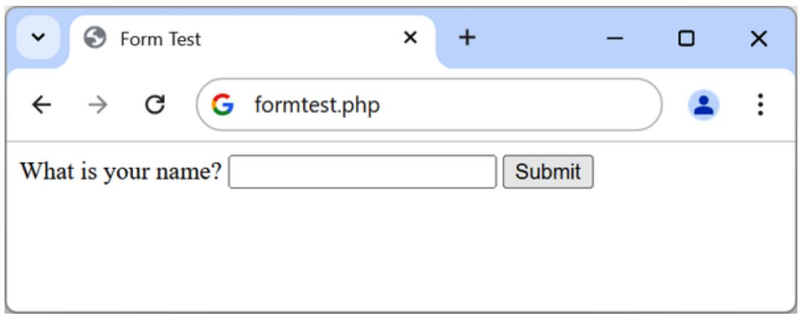

<details>
<summary>text_image</summary>

Form Test
formtest.php
What is your name? 
Submit
</details>

Figure 11-1. The result of opening formtest.php in a web browser

## Retrieving Submitted Data

Example 11-1 is one part of the multi-step form-handling process. If you enter a name and click the submit button, it will appear that nothing will happen other than the form being redisplayed (and the entered data lost). So now it’s time to add some PHP code to process the data submitted by the form.

Example 11-2 expands on the previous program to include data processing. Type it or modify formtest.php by adding in the new lines, save it as formtest2.php, and try the program for yourself. The result of entering a name and clicking Submit is shown in Figure 11-2.

Example 11-2. Updated version of formtest.php  
```php
<?php // formtest2.php
if (!empty($_POST['name'])) $name = htmlentities($_POST['name']);
else $name = "(Not Entered)";
echo <<<_END
<html>
<head>
    <title>Form Test</title>
</head>
<body>
    Your name is: $name<br>
```

```php
<form method="post" action="formtest2.php">
    What is your name?
    <input type="text" name="name">
    <input type="submit">
    </form>
    </body>
</html>
_END;
?>
```

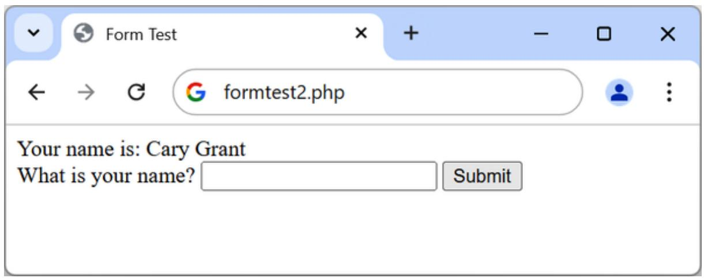

<details>
<summary>text_image</summary>

Form Test
formtest2.php
Your name is: Cary Grant
What is your name? 
Submit
</details>

Figure 11-2. formtest2.php with data handling

The first thing to notice about this example is that, as you have seen in earlier chapters, rather than dropping in and out of PHP code, the echo <<<\_END...\_END heredoc construct is used whenever multiline HTML must be output.

The only other changes are a couple of lines at the start that check the name field of the \$\_POST associative array and echo it back to the user.

Chapter 10 introduced the \$\_POST associative array, which contains an element for each field in an HTML form. In Example 11-2, the input name used was name and the form method was POST, so the element name of the \$\_POST array contains the value in \$\_POST['name'].

The PHP isset function is used to test whether \$\_POST['name'] has been assigned a value. If nothing was posted, the program assigns the value (Not entered); otherwise, it stores the value that was entered. Then a single line has been added after the <body> statement to display that value, which is stored in \$name.

### Default Values

Sometimes it’s convenient to offer your site visitors a default value in a web form. For example, suppose you put up a loan repayment calculator widget on a real estate website. It could make sense to enter default values of, say, 15 years and 3% interest so that the user can simply type either the principal sum to borrow or the amount that they can afford to pay each month.

In this case, the HTML for those two values would be something like Example 11-3.

Example 11-3. Setting default values  
```txt
<form method="post" action="calc.php"><pre>
    Loan Amount <input type="text" name="principal">
    Monthly Repayment <input type="text" name="monthly">
    Number of Years <input type="text" name="years" value="25">
    Interest Rate <input type="text" name="interest" value="6">
    <input type="submit">
</pre></form>
```

Take a look at the third and fourth inputs. By populating the value attribute, you display a default value in the field, which the users can then change if they wish. With sensible default values, you can make your web forms more user-friendly by minimizing unnecessary typing. The result of the previous code looks like Figure 11-3. Of course, this was created to illustrate default values, and, because the program calc.php has not been written, the form will return a 404 error message if you submit it.

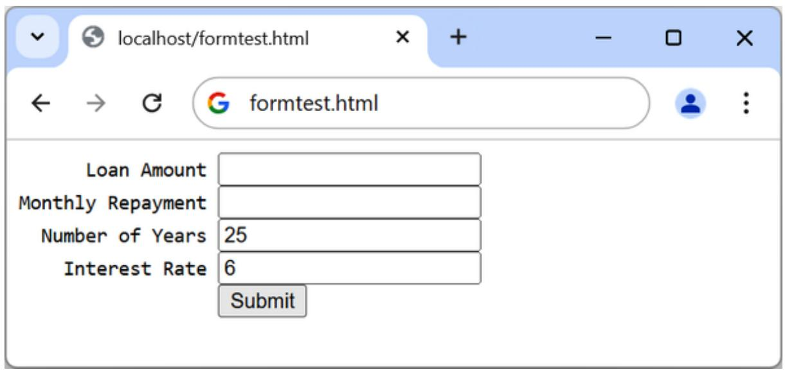

<details>
<summary>text_image</summary>

localhost/formtest.html
formtest.html
Loan Amount
Monthly Repayment
Number of Years 25
Interest Rate 6
Submit
</details>

Figure 11-3. Using default values for selected form fields

### Input Types

HTML forms are very versatile and allow you to submit a wide range of input types, from text boxes and text areas to checkboxes, radio buttons, and more.

**Text boxes**

The input type used most often is the text box. It accepts a wide range of alphanumeric text and other characters in a single-line box. The general format of a text box input is:

```txt
<input type="text" name="name" size="size" maxlength="length" value="value">
```

We’ve already covered the name and value attributes, but two more are introduced here: size and maxlength. The size attribute specifies the width of the box (in characters of the current font) as it should appear on the screen, and maxlength specifies the maximum number of characters that a user is allowed to enter into the field.

The type attribute, which tells the web browser what type of input to expect, can be omitted since text is the default, but it’s recommended to add it even if not required. The name attribute gives the input a name that will be used to process the field upon receipt of the submitted form.

**Text areas**

When you need to accept input of more than a short line of text, use a text area. This is similar to a text box but, because it allows multiple lines, it has some different attributes. Its general format looks like this:

```txt
<textarea name="name" cols="width" rows="height" wrap="type"></textarea>
```

The first thing to notice is that <textarea> has its own tag and is not a subtype of the <input> tag. It therefore requires a closing </textarea> to end input.

Instead of a default attribute, if you have default text to display, you must put it before the closing </textarea>, and it will then be displayed and be editable by the user:

```txt
<textarea name="name" cols="width" rows="height" wrap="type">
This is some default text.
</textarea>
```

To control the width and height, use the cols and rows attributes (or CSS). Both use the character spacing of the current font to determine the size of the area. If you omit these values, a default input box will be created that will vary in dimensions depending on the browser used, so you should always define them to be certain about how your form will appear.

Last, you can control how the text entered into the box will wrap (and how any such wrapping will be sent to the server) using the wrap attribute.

Table 11-1 shows the wrap types available. If you leave out the wrap attribute, soft wrapping is used.

Table 11-1. The wrap types available in a  input

<table><tr><td>Type</td><td>Action</td></tr><tr><td>off</td><td>Text does not wrap, and lines appear exactly as the user types them.</td></tr><tr><td>soft</td><td>Text wraps but is sent to the server as one long string without carriage returns and line feeds.</td></tr><tr><td>hard</td><td>Text wraps and is sent to the server in wrapped format with soft or hard returns and line feeds.</td></tr></table>

**Checkboxes**

When you want to offer a number of different options to a user, from which they can select one or more items, checkboxes are the way to go. Here is the format to use:

```twig
<input type="checkbox" name="name" value="value" checked>
```

By default, checkboxes are square. If you include the checked attribute, the box is already checked when the page is loaded. The string you assign to the attribute should either be surrounded with double or single quotes or the value "checked", or no value should be assigned (just checked). If you don’t include the attribute, the box is shown unchecked. Here is an example of creating an unchecked box; we’ll talk about the <label> tag in a moment:

```html
<label for="agree">I Agree</label>
<input type="checkbox" id="agree" name="agree">
```

If the user doesn’t check the box, no value will be submitted. But if they do, a value of "on" will be submitted for the field named agree. If you prefer to have your own value submitted instead of the word on (such as the number 1), you could use the following syntax:

```twig
<label for="agree">I Agree</label>
<input type="checkbox" id="agree" name="agree" value="1">
```

On the other hand, if you’d like to offer your users a default option to deliver a package to their billing address, for example, you might want to have the checkbox already checked as the default value:

```twig
<label for="same">Deliver to the same address?</label>
<input type="checkbox" id="same" name="sameaddress" checked>
```

If you want to allow groups of items to be selected at one time, assign them all the same name. However, only the last item checked will be submitted, unless you pass an array as the name. For example, Example 11-4 allows the user to select their favorite ice creams (see Figure 11-4 for how it displays in a browser, also note that I have left out the label tags for brevity).

Example 11-4. Offering multiple checkbox choices

```txt
Vanilla <input type="checkbox" name="ice" value="Vanilla">
Chocolate <input type="checkbox" name="ice" value="Chocolate">
Strawberry <input type="checkbox" name="ice" value="Strawberry">
```

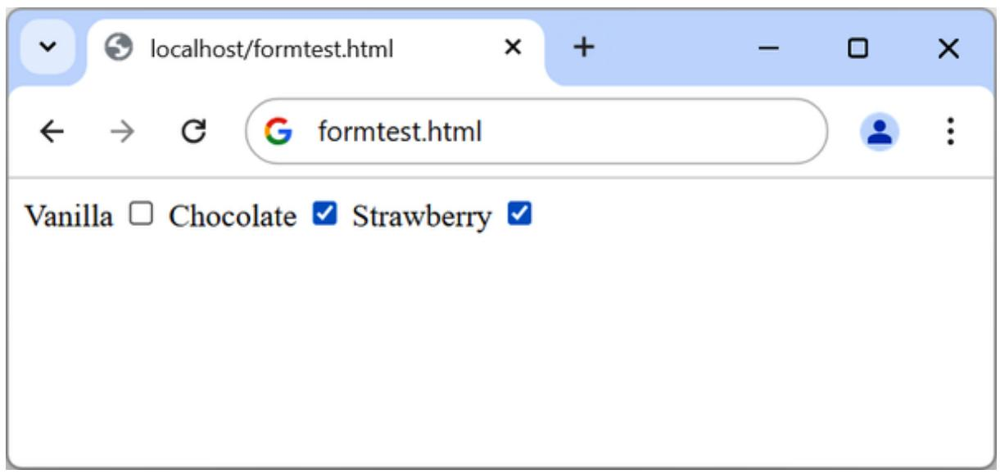

<details>
<summary>text_image</summary>

localhost/formtest.html
formtest.html
Vanilla □ Chocolate ✓ Strawberry ✓
</details>

Figure 11-4. Using checkboxes to make quick selections

If only one of the checkboxes is selected, such as the second one, only that item will be submitted (the field named ice would be assigned the value "Chocolate"). But if two or more are selected, only the last value will be submitted, with prior values being ignored.

If you want exclusive behavior—so that only one item can be submitted— then you should use radio buttons instead (see “Radio buttons”). Otherwise, to allow multiple submissions, you have to slightly alter the HTML, as in Example 11-5 (note the addition of the square brackets, [], following the values of ice, and again label tags left out for brevity).

Example 11-5. Submitting multiple values with an array

```txt
Vanilla <input type="checkbox" name="ice[]" value="Vanilla">
Chocolate <input type="checkbox" name="ice[]" value="Chocolate">
Strawberry <input type="checkbox" name="ice[]" value="Strawberry">
```

Now when the form is submitted, if any of these items have been checked, an array called ice will be submitted that contains all the selected values. You can extract either the single submitted value or the array of values to a variable like this:

```txt
$ice = $_POST['ice'];
```

If the field ice has been posted as a single value, \$ice will be a single string, such as "Strawberry". But if ice was defined in the form as an array (like in Example 11-5), \$ice will be an array, and its number of elements will be the number of values submitted. Table 11-2 shows the seven possible sets of values that could be submitted by this HTML for one, two, or all three selections. In each case, an array of one, two, or three items is created.

Table 11-2. The seven possible sets of values for the array

<table><tr><td>One value submitted</td><td>Two values submitted</td><td>Three values submitted</td></tr><tr><td rowspan="2">$ice[0] =&gt; Vanilla</td><td>$ice[0] =&gt; Vanilla</td><td>$ice[0] =&gt; Vanilla</td></tr><tr><td>$ice[1] =&gt; Chocolate</td><td>$ice[1] =&gt; Chocolate</td></tr><tr><td>$ice[0] =&gt; Chocolate</td><td>$ice[0] =&gt; Vanilla</td><td>$ice[2] =&gt; Strawberry</td></tr><tr><td>$ice[0] =&gt; Strawberry</td><td>$ice[1] =&gt; Strawberry</td><td></td></tr><tr><td></td><td>$ice[0] =&gt; Chocolate</td><td></td></tr><tr><td></td><td>$ice[1] =&gt; Strawberry</td><td></td></tr></table>

If \$ice is an array, the PHP code to display its contents is quite simple and might look like this:

foreach(\$ice as \$item) echo "\$item<br>";

This uses the standard PHP foreach construct to iterate through the array \$ice and pass each element’s value into the variable \$item, which is then displayed via the echo command. The <br> is just an HTML formatting device to force a new line after each flavor in the display.

**Labels**

You can provide an even better user experience by utilizing the <label> tag. Going back to the delivery address example, it uses a label tag, which is explicitly associated with an input (a checkbox in this case) by using the for and id attributes. This allows the user to click the checkbox itself and the associated text:

```twig
<label for="same">Deliver to the same address?</label>
<input type="checkbox" id="same" name="sameaddress" checked>
```

A label tag can also surround a form element (no need for the for and id attributes), making it selectable by clicking any visible part contained between the opening and closing <label> tags:

```txt
<label>
    Deliver to the same address?
    <input type="checkbox" name="sameaddress" checked>
</label>
```

The text will not be underlined like a hyperlink when you add a label, but as the mouse pointer passes over it, it will change to an arrow instead of a text cursor, indicating that the whole item is clickable.

Labels can be added to all form fields, not just checkboxes, and we’ll be using them extensively in the following examples.

**Radio buttons**

Radio buttons are named after the push-in preset buttons found on many older radios, where any previously depressed button pops back up when another is pressed. They are used when you want only a single value to be returned from a selection of two or more options. All the buttons in a group must use the same name, and, because only a single value is returned, you do not have to pass an array.

For example, if your website offers a choice of delivery times for items purchased from your store, you might use HTML like that in Example 11-6 (see Figure 11-5 to see how it displays). By default, radio buttons are round.

Example 11-6. Using radio buttons  
```twig
<label for="morning">8am-Noon</label>
    <input type="radio" id="morning" name="time" value="1">
    <label for="afternoon">Noon-4pm</label>
    <input type="radio" id="afternoon" name="time" value="2" checked>
    <label for="evening">4pm-8pm</label>
    <input type="radio" id="evening" name="time" value="3">
```

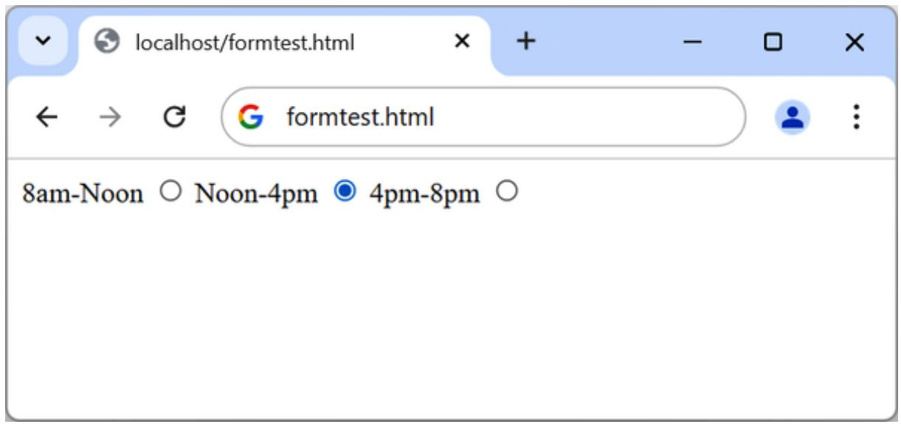

<details>
<summary>text_image</summary>

localhost/formtest.html
formtest.html
8am-Noon ○ Noon-4pm ● 4pm-8pm ○
</details>

Figure 11-5. Selecting a single value with radio buttons

Here, the second option of Noon–4pm has been selected by default. This default choice ensures that at least one delivery time will be chosen by the user, which they can change to one of the other two options if they prefer. Had one of the items not been already checked, the user might forget to select an option, and no value would be submitted for the delivery time.

Unlike checkboxes, once selected, radio buttons cannot be deselected, so if you would like to provide an option like “no preference” you should make it an explicit radio button.

**Hidden fields**

Sometimes it is convenient to have hidden form fields so that you can keep track of the state of form entry. For example, you might wish to know whether a form has already been submitted. You can achieve this by adding some HTML in your PHP code, such as:

```html
<input type="hidden" name="submitted" value="yes">
```

Let’s assume the form was created outside the program, without the hidden field, and displayed to the user. The first time the PHP program receives the input, the hidden field is missing, so there will be no field named submitted. The PHP program re-creates the form, adding the hidden input field. So when the visitor resubmits the form, the PHP program receives it with the submitted field set to "yes". The code can simply check whether the field is present:

```txt
if (isset($_POST['submitted'])) {...
```

Hidden fields can also be useful for storing other details, such as an ID string that you might create to identify a user, and so on.

**WARNING**

Never treat hidden fields as secure—because they are not. Someone could easily view the HTML containing them by using a browser’s View Source feature. A malicious attacker could also craft a post that removes, adds, or changes a hidden field.

**<select>**

The <select> tag lets you create a drop-down list of options, offering either single or multiple selections. It conforms to the following syntax:

```xml
<select name="name" size="size" multiple>
```

The attribute size is the number of lines to display before the dropdown is expanded; the default is 1. Clicking on the display causes a list to drop down, showing all the options. If you use the optional multiple attribute, a user can select multiple options from the list by pressing the Ctrl key when clicking. So, to ask a user for their favorite vegetable from a choice of five, you might use HTML like that in Example 11-7, which offers a single selection.

Example 11-7. Using  
```txt
Vegetables
<select name="veg">
    <option value="Peas">Peas</option>
    <option value="Beans">Beans</option>
    <option value="Carrots">Carrots</option>
    <option value="Cabbage">Cabbage</option>
    <option value="Broccoli">Broccoli</option>
</select>
```

This HTML offers five choices, with the first one, Peas, preselected (due to it being the first item). Figure 11-6 shows the output where the list has been clicked to drop it down, and the option Carrots has been highlighted. If you want to have a different default option offered first (such as Beans), use the selected attribute, like this:

```txt
<option selected value="Beans">Beans</option>
```

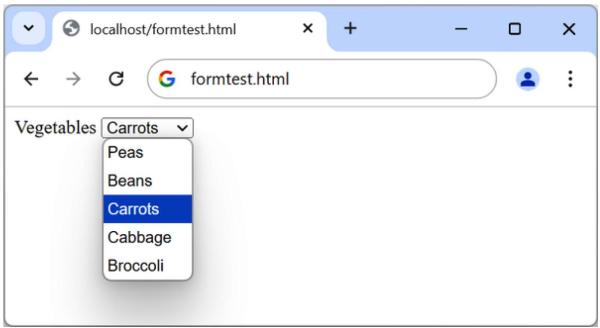

<details>
<summary>text_image</summary>

localhost/formtest.html
formtest.html
Vegetables Carrots
Peas
Beans
Carrots
Cabbage
Broccoli
</details>

Figure 11-6. Creating a drop-down list with

You can also allow users to select more than one item, as in Example 11-8.

Example 11-8. Using  with the  attribute

```xml
Vegetables
<select name="veg" size="5" multiple>
    <option value="Peas">Peas</option>
    <option value="Beans">Beans</option>
    <option value="Carrots">Carrots</option>
    <option value="Cabbage">Cabbage</option>
    <option value="Broccoli">Broccoli</option>
</select>
```

This HTML is not very different; the size has been changed to "5", and the attribute multiple has been added. But, as you can see from Figure 11-7, it is now possible for the user to select more than one option by using the Ctrl key when clicking. You can leave out the size attribute if you wish, and the output will be the same; however, with a larger list, the drop-down box may display more items, so I recommend that you pick a suitable number of rows and stick with it. I also recommend not using multiple select boxes smaller than two rows in height—some browsers may not correctly display the scroll bars needed to access them.

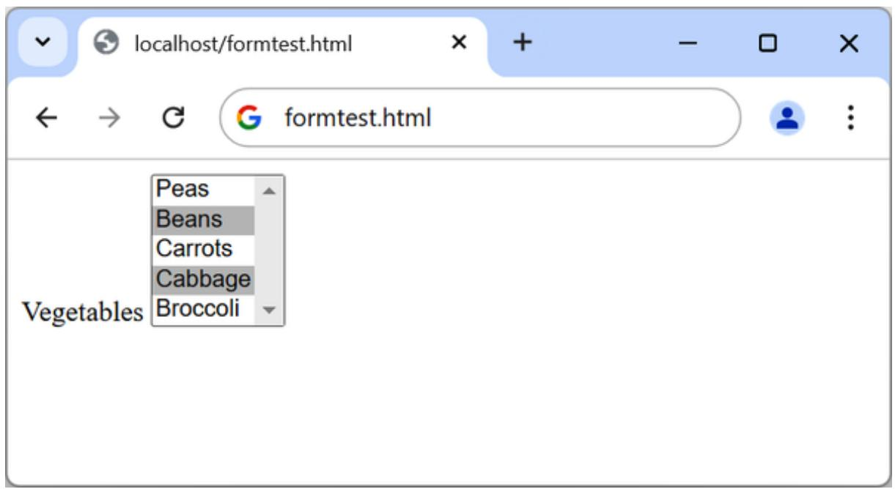

<details>
<summary>text_image</summary>

localhost/formtest.html
formtest.html
Peas
Beans
Carrots
Cabbage
Broccoli
</details>

Figure 11-7. Using a  with the  attribute

You can also use the selected attribute within a multiple select and can, in fact, have more than one option preselected if you wish.

**The submit button**

To match the type of form being submitted, you can change the text of the submit button to anything you like by using the value attribute, like this:

```txt
<input type="submit" value="Search">
```

You can also replace the standard text button with a graphic image of your choice, using HTML:

```html
<input type="image" name="submit" src="image.gif" alt="Submit">
```

Instead of an <input> tag, you can also use a <button> tag to create a submit button; the advantage is that you can use other HTML tags to style the text or even include an image:

```twig
<button><em>Search</em></button>
<button></button>
```

**The autocomplete attribute**

You can apply the autocomplete attribute to the <form> element, or to any of the color, date, email, password, range, search, tel, text, or url types of the <input> element.

With autocomplete enabled, previous user inputs are recalled and automatically entered into fields as suggestions. You can also disable this feature by turning autocomplete off. Here’s how to turn autocomplete on for an entire form but disable it for specific fields (highlighted in bold):

```html
<form action='myform.php' method='post' autocomplete='on'>
    <input type='text' name='type'>
    <input type='text' name='amount' autocomplete='off'>
</form>
```

There are many possible values for the autocomplete attribute, for example email, username, current-password, and new-password to help password managers prefill the fields with respective values. For the full list please visit the MDN page on the autocomplete attribute.

**The autofocus attribute**

The autofocus attribute gives immediate focus to an element when a page loads. It can be applied to any <input>, <textarea>, or <button> element, like this:

```txt
<input type='text' name='query' autofocus='autofocus'>
```

**NOTE**

Browsers that use touch interfaces (such as Android or iOS) usually ignore the autofocus attribute, leaving it to the user to tap on a field to give it focus; otherwise, the zooming, focusing, and pop-up keyboards this attribute would generate could quickly become annoying.

Because this feature will cause the focus to move into an input element, the Backspace key will no longer take the user back a web page (although Alt-Left arrow and Alt-Right arrow will still move backward and forward within the browsing history).

**The placeholder attribute**

The placeholder attribute lets you place into any blank input field a helpful hint to explain to users what they should enter. You use it like this:

```txt
<input type='text' name='name' size='50' placeholder='First & Last name'>
```

The input field will display the placeholder text as a prompt until the user starts typing, at which point the placeholder will disappear.

**The required attribute**

The required attribute ensures that a field has been completed before a form is submitted:

```txt
<input type='text' name='creditcard' required>
```

When the browser detects an attempted form submission where there’s an uncompleted required input, a message is displayed, prompting the user to complete the field.

**Override attributes**

With override attributes, you can override form settings on an element-byelement basis. So, for example, using the formaction attribute, you can specify that a submit button should submit a form to a different URL from the one specified in the form itself, like the following (in which the default and overridden action URLs are bold):

```txt
<form action='url1.php' method='post'>
    <input type='text' name='field'>
    <input type='submit' formaction='url2.php'>
</form>
```

HTML also brings support for the formenctype, formmethod, formnovalidate, and formtarget override attributes, which you can use in exactly the same manner as formaction to override one of these settings.

**The width and height attributes**

Using these new attributes, you can alter the displayed dimensions of an input image, like this:

```html
<input type='image' src='picture.png' width='120' height='80'>
```

**The step attribute**

Often used with min and max, the step attribute supports stepping through number or date values, like this:

```html
<input type='time' name='meeting' value='12:00' min='09:00' max='16:00' step='3600'>
```

When you are stepping through date or time values, each unit represents 1 second.

**The form attribute**

You no longer have to place <input> elements within <form> elements, because you can specify the form to which an input applies by supplying a form attribute. The following code shows a form being created, but with its input outside of the <form> and </form> tags:

```txt
<form action='myscript.php' method='post' id='form1'>
</form>
<input type='text' name='username' form='form1'>
```

To do this, you must give the form an ID using the id attribute and refer to this ID in the form attribute of the input element. This is most useful for adding hidden input fields when you can’t control how or if the field is placed inside the <form> tag in the HTML code, or for using JavaScript to modify forms and inputs on the fly.

**The list attribute**

Attaching lists to inputs enables users to easily select from a predefined list, which you can use like this:

```txt
Select destination:
<input type='url' name='site' list='links'

<datalist id='links'>
    <option label='Google' value='http://google.com'>
    <option label='Yahoo!' value='http://yahoo.com'>
    <option label='Bing' value='http://bing.com'>
    <option label='Ask' value='http://ask.com'>
</datalist>
```

**The color input type**

The color input type calls up a color picker so that you can simply click the color of your choice. After submitting the form, the server receives the color in the hex format. You use the input like this:

Choose a color <input type='color' name='color'>

**The min and max attributes**

With the min and max attributes, you can specify minimum and maximum values for inputs. The browser will then either offer up and down selectors for the range of values allowed or simply disallow values outside of that range or mark such values as invalid. See the following types for example usage.

**The number and range input types**

The number and range input types restrict input to a number and optionally also specify an allowed range, like this:

```txt
<input type='number' name='age'>  
<input type='range' name='num' min='0' max='100' value='50' step='1'>
```

**Date and time pickers**

When you choose an input type of date, month, week, time, datetime, or datetime-local, a picker will pop up on supported browsers from which the user can make a selection, like this one, which inputs the time:

```html
<input type='time' name='time' value='12:34' min='09:00' max='17:00'>
```

Chapter 12 will show you how to use cookies and authentication to store users’ preferences and keep them logged in, and how to maintain a complete user session.

### Sanitizing Input

Now we return to PHP programming. It can’t be emphasized enough that handling user data is a security minefield, and it is essential to learn to treat all such data with the utmost caution from the start. It’s not that difficult to sanitize user input from potential hacking attempts, and it must be done.

Remember that the safest way to secure MySQL from hacking attempts is to use placeholders and prepared statements, as described in Chapter 10. If you do so for all accesses to MySQL, it is not necessary to manually escape data being transferred into or out of the database. You will, however, still need to sanitize input when including it within HTML.

The first thing to remember is that regardless of any constraints you have placed in an HTML form to limit the types and sizes of inputs, it is a trivial matter for a hacker to use their browser’s View Source feature to extract the form and modify it to provide malicious input to your website.

To prevent such attacks, you must never trust any variable that you fetch from either the \$\_GET or \$\_POST arrays until you have sanitized it. If you don’t, users may try to inject JavaScript into the data to interfere with your site’s operation, or even attempt to add MySQL commands to compromise your database.

Preventing SQL injection is easy. Use prepared statements and placeholders as described in Chapter 10. Script injection and XSS attacks can be stopped by using the htmlentities function:

```txt
$variable = htmlentities($variable);
```

For example, this would change a string of interpretable HTML code like <b>hi</b> into &lt;b&gt;hi&lt;/b&gt;, which then displays as text and won’t be interpreted as HTML tags.

The htmlentities function is identical to htmlspecialchars, and both can be used to stop the attacks, but where the former converts all characters which have HTML entity equivalents, the latter converts only the special ones:

**NOTE**

This book uses htmlentities in the following examples as it’s slightly shorter to write, but you could as well use htmlspecialchars.

If you use htmlentities before storing data in your database, and then when the data is retrieved from the database to be rendered to an HTML page, and the component or code that renders it calls htmlentities a second time, you probably won’t get what you want. It’ll double-encode and mangle legitimate quotation marks, ampersands, and angle brackets. You want to call the function just once.

If you legitimately want to allow user-provided HTML to be rendered as HTML (which is common, for example, with popular WYSIWYG editors), look to a robust tool such as the DOMPurify library available on GitHub.

Since the danger in user-provided content is at the time of use (as opposed to the time that it is submitted; or at least PHP handles most of those dangers for you), you may want to consider deferring sanitization until you know the requirements for the output data. You may even use the same piece of data in different contexts: for example, a user-provided field in a database could be rendered to a web page, a mobile app, a text email, an HTML email, and SMS. Each may have different sanitization needs and concerns.

Having solid documentation in your system about the nature of the content in your database is more valuable than rote sanitization. Even such a simple expedient as suffixing fields that may contain HTML with \_html can be helpful. You could expand this by having suffixes like \_safe\_html (after having been run through something like DOMPurify), or \_html\_entities (for text that was run through htmlentities).

If you’d like to dive deeper into XSS prevention, you can check out the article by OWASP (Open Worldwide Application Security Project) published in its Cheat Sheet Series.

**STRIPPING HTML IS NOT ENOUGH**

The function used to strip HTML from an input, strip\_tags, won’t reliably prevent XSS attacks and, depending on the input, can produce mangled HTML.

## An Example Program

Let’s look at how a real-life PHP program integrates with an HTML form by creating the program convert.php listed in Example 11-9. Type it as shown and try it for yourself.

Example 11-9. A program to convert values between Fahrenheit and Celsius

```php
<?php // convert.php
$f = $c = $f_html_entities = $c_html_entities = '';
if (isset($_POST['f'])) {
    $f = $_POST['f'];
    $f_html_entities = htmlentities($f);
}
if (isset($_POST['c'])) {
    $c = $_POST['c'];
    $c_html_entities = htmlentities($c);
}

if (is_numeric($f)) {
    $c = intval((5 / 9) * ($f - 32));
    $out = "$f &deg;F equals $c &deg;C";
} elseif(is_numeric($c)) {
    $f = intval((9 / 5) * $c + 32);
    $out = "$c &deg;C equals $f &deg;F";
} else
    $out = "";
?>
```

```txt
<html>
<head>
    <title>Temperature Converter</title>
</head>
<body>
    <pre>
    Enter either Fahrenheit or Celsius and click on Convert
    <b><?php echo $out; $$;</b>
    <form method="post" action="">
    <label>Fahrenheit <input type="text" name="f" value="<<?php echo $f_html_entities; $$" size="7"></label>
    <label>Celsius <input type="text" name="c" value="<<?php echo $c_html_entities; $$" size="7"></label>
    <input type="submit" value="Convert">
    </form>
    </pre>
    </body>
</html>
```

When you call up convert.php in a browser, the result should look something like Figure 11-8.

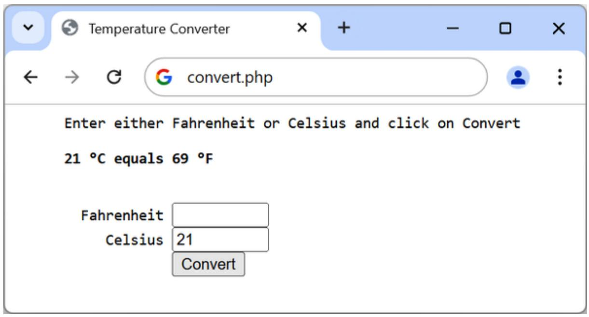

<details>
<summary>text_image</summary>

Temperature Converter
← → G convert.php
Enter either Fahrenheit or Celsius and click on Convert
21 °C equals 69 °F
Fahrenheit
Celsius 21
Convert
</details>

Figure 11-8. The temperature conversion program in action

Let’s break down this code. The first line initializes the variables \$c, \$f, \$f\_html\_entities, and \$c\_html\_entities in case the respective form fields do not get posted to the program. The next two if blocks fetch the values of either the field named f or the one named c, for an input Fahrenheit or Celsius value, and create sanitized values by calling htmlentities. If the user inputs both, the Celsius is simply ignored and the Fahrenheit value is converted. The values will be echoed back to the form later, and the sanitization prevents the XSS attack.

So, having either submitted values or empty strings in both \$f and \$c, the next portion of code constitutes an if...elseif...else structure that first tests whether \$f has a numeric value. If not, it checks \$c; if \$c does not have a numeric value, the variable \$out is set to the empty string (more on that in a moment).

If \$f has a numeric value, the variable \$c is assigned a simple mathematical expression that converts the value of \$f from Fahrenheit to Celsius. The formula used is Celsius = (5 / 9) × (Fahrenheit – 32). The variable \$out is then set to a message string explaining the conversion.

On the other hand, if \$c has a numeric value, a complementary operation is performed to convert the value of \$c from Celsius to Fahrenheit and assign the result to \$f. The formula used is Fahrenheit = (9 / 5) × Celsius + 32. Then again, the string \$out is set to contain a message about the conversion.

In both conversions, the PHP intval function is called to convert the result of the conversion to an integer value. It’s not necessary, but it looks better.

With all the arithmetic done, the program now outputs the HTML, which starts with the basic head and title and then contains some introductory text before displaying the value of \$out. If no temperature conversion was made, \$out will have a value of NULL and nothing will be displayed, which is exactly what we want when the form hasn’t yet been submitted. But if a conversion was made, \$out contains the result, which is displayed.

After this, we come to the form, which is set to submit using the POST method to the program itself (represented by a pair of double quotation marks so that the file can be saved with any name). Within the form, there are two inputs for either a Fahrenheit or a Celsius value to be entered. The original entered value is printed in the value attribute of the respective field and is sanitized, because it’s a user input. A submit button with the text Convert is then displayed, and the form is closed.

Try playing with the example by inputting different values into the fields; for a bit of fun, can you find a value for which Fahrenheit and Celsius are the same? You may also try entering HTML (for example ">XSS here) to see why calling htmlentities is important. Then remove the htmlentities call and try inputting the same HTML again; you should see a broken input field with the HTML you have injected. Don’t forget to put the htmlentities call back after you’re done playing.

**NOTE**

All the examples in this chapter have used the POST method to send form data. I recommend this, as it’s the neatest and most secure method. However, the forms can easily be changed to use the GET method, as long as values are fetched from the \$\_GET array instead of the \$\_POST array. Reasons to do this might include making the result of a search bookmarkable or directly linkable from another page.

At this point, you should be familiar with various form fields and able to process them in PHP. This will be useful in Chapter 12, where you’ll learn about logins and sessions. But before that, let’s refresh what you’ve learned by answering these questions.

## Questions

1. You can submit form data using either the POST or the GET method. Which associative arrays are used to pass this data to PHP?  
2. What is the difference between a text box and a text area?

3. If a form needs to offer three choices to a user, each of which is mutually exclusive so that only one of the three can be selected, which input type would you use, given a choice between checkboxes and radio buttons?  
4. How can you submit a group of selections from a web form using a single field name?  
5. How can you submit a form field without displaying it in the browser?  
6. Which HTML tag is used to encapsulate a form element and supporting text or graphics, making the entire unit selectable with a mouse-click?  
7. Which PHP function converts HTML into a format that can be displayed but will not be interpreted as HTML by a browser, preventing attacks like XSS?  
8. What form attribute can be used to help users complete input fields?  
9. How can you ensure that an input is completed before a form gets submitted?

See “Chapter 11 Answers” in the Appendix A for the answers to these questions.