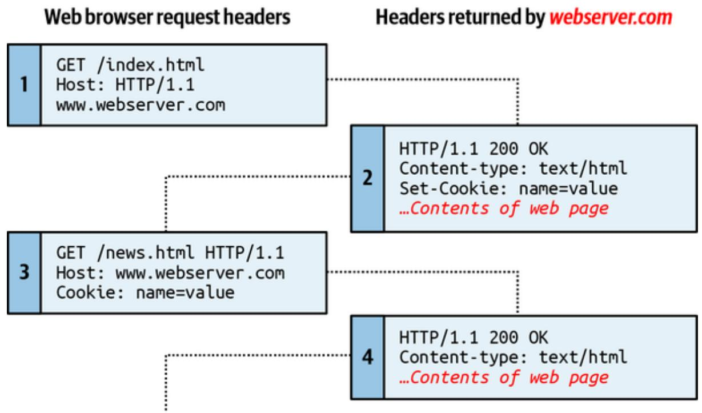
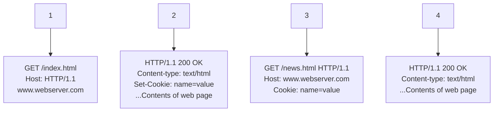
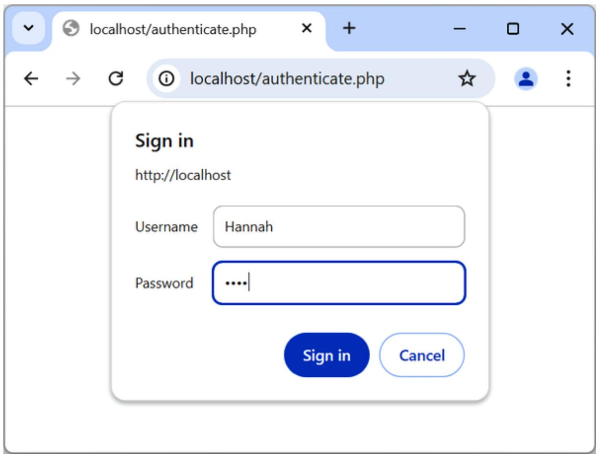
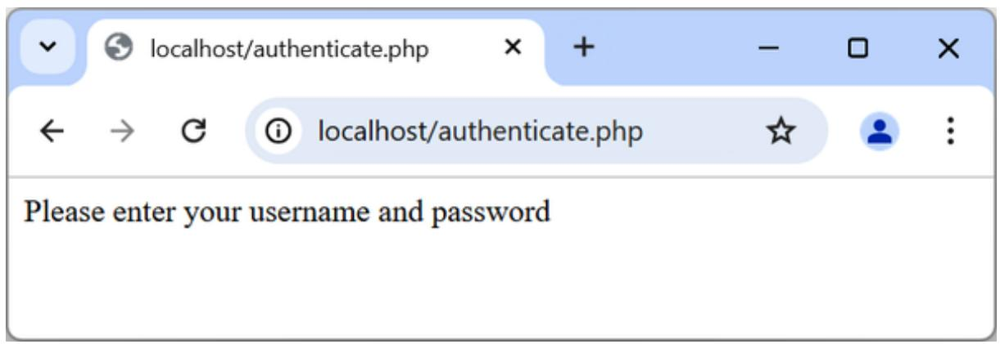
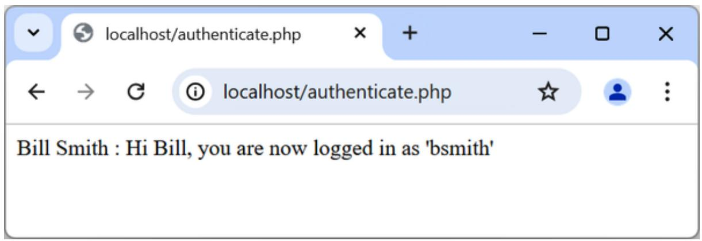
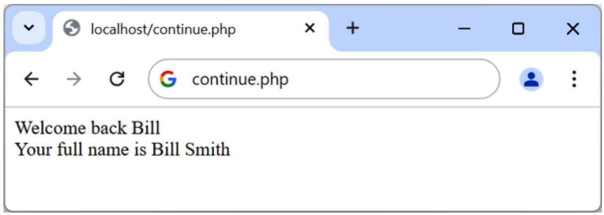

# Chapter 12. Cookies, Sessions, and Authentication

As your web projects grow larger and more complicated, you will find an increasing need to keep track of your users. Even if you aren’t offering logins and passwords, you still will often need to store details about a user’s current session and possibly also recognize them when they return to your site.

Several technologies support this kind of interaction, ranging from simple browser cookies to session handling and HTTP authentication. Between them, they offer the opportunity for you to configure your site to your users’ preferences and ensure a smooth and enjoyable transition through it.

## Using Cookies in PHP

A cookie is an item of data that a web server saves to your computer’s hard disk via a web browser. It can contain almost any alphanumeric information (as long as it’s under 4 KB) and can be retrieved from your computer and returned to the server. Common uses include session tracking and identifiers, maintaining data across multiple visits, holding shopping cart contents, storing non-secure login details (not passwords), and more.

Because of their privacy implications, cookies can be read only from the issuing domain. In other words, if a cookie is issued by, for example, oreilly.com, it can be retrieved only by a web server using that domain. This prevents other websites from gaining access to details for which they are not authorized.

Because of the way the internet works, multiple elements on a web page can be embedded from multiple domains, each of which can issue its own cookies. When this happens, they are referred to as third-party cookies.

Most commonly, these are created by advertising companies to track users across multiple websites or for analytic purposes.

Because of this, most browsers allow users to turn cookies off either for the current server’s domain, third-party servers, or both. Fortunately, most people who disable cookies do so only for third-party websites.

Cookies are exchanged during the transfer of headers, before the actual HTML of a web page is sent in the response body, and it is impossible to send a cookie once any HTML has been transferred. Therefore, careful planning of cookie usage is important. Figure 12-1 illustrates a typical request and response dialog between a web browser and web server passing cookies.



<details>
<summary>flowchart</summary>


</details>

Figure 12-1. A browser/server request/response dialog with cookies

This exchange shows a browser receiving two pages:

1. The browser issues a request to retrieve the main page, index.html, at the website http://www.webserver.com. The first line specifies the file, and the second header specifies the server.

2. When the web server at webserver.com receives this pair of headers, it returns some of its own. The second header defines the type of content to be sent (text/html), and the third one sends a cookie of the name name and with the value value. Only then are the contents of the web page transferred.  
3. Once the browser has received the cookie, it will then return it with every future request made to the issuing server until the cookie expires or is deleted. So, when the browser requests the new page /news.html, it also returns the cookie name with the value value.  
4. Because the cookie has already been set, when the server receives the request to send /news.html, it does not have to resend the cookie but just returns the requested page.

**NOTE**

It is relatively straightforward to edit cookies directly from within the browser by using built-in developer tools or extensions. Therefore, because users can change cookie values, you should not put key information such as usernames in a cookie and trust it blindly without verifying it, or you face the possibility of having your website manipulated in unexpected ways. Cookies are best used for storing data such as language or currency settings.

### Setting a Cookie

Setting a cookie in PHP is simple. As long as no HTML has yet been transferred, you can call the setcookie function (see Table 12-1), which has the following syntax:

setcookie(name, value, expire, path, domain, secure, httponly);

Table 12-1. The  parameters

<table><tr><td>Parameter</td><td>Description</td><td>Example</td></tr><tr><td>name</td><td>The name of the cookie. This is the name that your server will use to access the cookie on subsequent browser requests.</td><td>location</td></tr><tr><td>value</td><td>The value of the cookie or the cookie's contents. This can contain up to 4 KB of alphanumeric text.</td><td>USA</td></tr><tr><td>expire</td><td>(Optional.) The Unix timestamp of the expiration date. Generally, you will probably use time() plus a number of seconds. If not set, the cookie becomes a session cookie that can be deleted when the browser is closed, but you can't rely on that behavior: many browsers will restore session cookies when the browser restarts.</td><td>time() + 2592000</td></tr><tr><td>path</td><td>(Optional.) The path of the cookie on the server. If this is a / (forward slash), the cookie is available over the entire domain, such as www.webserver.com. If it is a subdirectory, the cookie is available only within that subdirectory. The default is the current directory that the cookie is being set in, and this is the setting you will normally use.</td><td>/</td></tr><tr><td>domain</td><td>(Optional.) The internet domain of the cookie. If this is webserver.com, the cookie is available to all of webserver.com and its subdomains, such as www.webserver.com and images.webserver.com. If it is images.webserver.com, the cookie is available only to images.webserver.com and its subdomains, such as sub.images.webserver.com but not, say, to www.webserver.com.</td><td>webserver.com</td></tr><tr><td>secure</td><td>(Optional.) Whether the cookie must use a secure connection (https://). If this value is TRUE, the cookie can be transferred only across a secure connection. The default is FALSE.</td><td>FALSE</td></tr><tr><td>httponly</td><td>(Optional; implemented since PHP version 5.2.0.) Whether the cookie must use the HTTP protocol. If this value is TRUE, scripting languages such as JavaScript cannot access the cookie. The default is FALSE.</td><td>FALSE</td></tr></table>

So, to create a cookie with the name location and the value USA that is accessible across the entire web server on the current domain and that will be removed from the browser’s cache in seven days, use:

setcookie('location', 'USA', time() + 60 \* 60 \* 24 \* 7, '/');

### Accessing a Cookie

Reading the value of a cookie is as simple as accessing the \$\_COOKIE system array. For example, if you wish to see whether the browser that issued the request already stores the cookie called location and, if so, to read its value, use:

```txt
if (isset($_COOKIE['location'])) $location = $_COOKIE['location'];
```

Note that you can read a cookie back only after it has been sent to a web browser. This means when you issue a cookie, you cannot read it in again until the browser reloads the page (or another with access to the cookie) from your website and passes the cookie back to the server in the process.

### Destroying a Cookie

To delete a cookie, you must issue it again and set a date in the past. It is important for all parameters in your new setcookie call except the timestamp to be identical to the parameters when the cookie was first issued; otherwise, the deletion will fail. Therefore, to delete the cookie created earlier, you would use:

```txt
setcookie('location', 'USA', time() - 2592000, '/');
```

As long as the time given is in the past, the cookie should be deleted. However, I have used a time of 2,592,000 seconds (one month) in the past in case the client computer’s date and time are not correctly set. You can also provide an empty string for the cookie value (or a value of FALSE), and PHP will automatically set its time in the past.

## HTTP Authentication

HTTP authentication uses the web server to manage users and passwords for the application. It’s adequate for simple applications that ask users to log in, although most applications will have specialized needs or more stringent security requirements that call for other techniques.

To use HTTP authentication, PHP sends a header request asking to start an authentication dialog with the browser. The server must have this feature turned on for it to work, but because it’s so common, your server is very likely to offer the feature.

**NOTE**

Although it is usually installed with Apache, the HTTP authentication module may not necessarily be installed on the server you use. So, attempting to run these examples could generate an error telling you that the feature is not enabled, in which case you must either install the module and change the configuration file to load it or ask your system administrator to make these changes.

After entering your URL into the browser or visiting the page via a link, the user will see an “Authentication Required” prompt pop-up, requesting two fields: Username and Password (Figure 12-2 shows how this looks in Firefox).



<details>
<summary>text_image</summary>

localhost/authenticate.php
localhost/authenticate.php
Sign in
http://localhost
Username Hannah
Password ....|
Sign in Cancel
</details>

Figure 12-2. An HTTP authentication login prompt

Example 12-1 shows the code to make this happen.

Example 12-1. PHP authentication

```php
<?php
if (isset($_SERVER['PHP_AUTH_USER']) &&
    isset($_SERVER['PHP_AUTH_PW'])) 
{
    echo "Welcome User: " . htmlspecialchars($_SERVER['PHP_AUTH_USER']) .
    " Password: " . htmlspecialchars($_SERVER['PHP_AUTH_PW']); 
}
else 
{
    header('WWW-Authenticate: Basic realm="Restricted Area"); 
    header('HTTP/1.1 401 Unauthorized');
    die("Please enter your username and password");
}
?>
```

The first thing the program does is look for two particular array values: \$\_SERVER['PHP\_AUTH\_USER'] and \$\_SERVER['PHP\_AUTH\_PW']. If they both exist, they represent the username and password entered by a user into an authentication prompt.

**NOTE**

Notice that when being displayed to the screen, the values that have been returned in the \$\_SERVER array are first processed through the htmlspecialchars function. This is because these values have been entered by the user and therefore cannot be trusted, as a hacker could make a cross-site scripting attempt by adding HTML characters and other symbols to the input. htmlspecialchars translates any such input into harmless HTML entities.

If either value does not exist, the user has not yet been authenticated, and you display the prompt in Figure 12-2 by issuing the following header, where Basic realm is the name of the section that is protected and appears as part of the pop-up prompt:

WWW-Authenticate: Basic realm="Restricted Area"

If the user fills out the fields, the PHP program runs again from the top. But if the user clicks the Cancel button, the program proceeds to the following two lines, which send the following header and an error message:

HTTP/1.1 401 Unauthorized

The die statement causes the text “Please enter your username and password” to be displayed (see Figure 12-3).



<details>
<summary>text_image</summary>

localhost/authenticate.php
localhost/authenticate.php
Please enter your username and password
</details>

Figure 12-3. The result of clicking the Cancel button

**NOTE**

Once a user has been authenticated, you will not be able to get the authentication dialog to pop up again unless the user closes and reopens all browser windows, because the web browser will keep returning the same username and password to PHP. You may need to close and reopen your browser a few times as you work through this section and try different things. The easiest way to do this is to open up a new private or anonymous window to run these examples, so you won’t need to close the entire browser.

Now let’s check for a valid username and password. The code in Example 12-1 doesn’t require you to change much to add this check, other than modifying the previous welcome message code to test for a correct username and password and then issuing a welcome message. A failed authentication causes an error message to be sent (see Example 12-2).

Example 12-2. PHP authentication with input checking

```php
<?php
    $username = 'admin';
    $password = 'letmein';

    if (isset($_SERVER['PHP_AUTH_USER']) &&
    isset($_SERVER['PHP_AUTH_PW'])) 
    {
    if ($_SERVER['PHP_AUTH_USER'] === $username &&
    $_SERVER['PHP_AUTH_PW'] === $password)
    echo "You are now logged in";
```

```txt
else die("Invalid username/password combination");
}
else
{
    header('WWW-Authenticate: Basic realm="Restricted Area");
    header('HTTP/1.0 401 Unauthorized');
    die ("Please enter your username and password");
}
?>
```

When comparing usernames and passwords the === (identity) operator is used, rather than the == (equals) operator. This is because we are checking whether the two values match exactly. The equality operator (==) is not suitable for comparing login information, because for example, '0e123' == '0e456' returns true, and this is not a suitable match for either username or password purposes.

In the previous instance, PHP automatically converted the strings to numbers, where 0e123 is 0 times 10 raised to the 123rd power, which results in zero, and 0e456 is 0 times 10 raised to the 456th power, which also evaluates to zero. Therefore, using the == operator, they will match due to their values both evaluating to zero, and so the result of the comparison will be true, but the === operator says that the two parts must be identical in every way, and as these two strings are different, the test will return false.

A mechanism is now in place to authenticate users, but only for a single username and password. Also, the password appears in clear text within the PHP file, and if someone managed to hack into your server, they would instantly know it. So, let’s look at a better way to handle usernames and passwords.

### Storing Usernames and Passwords

MySQL is a natural way to store usernames and passwords. But again, we don’t want to store the passwords as clear text, because our website could be compromised if the database were accessed by a hacker. Instead, we’ll use a neat trick called a one-way function.

This simple function converts a string of text into a seemingly random string. Because they are one-way, such functions are impossible to reverse, so their output can be safely stored in a database—and anyone who steals it will be none the wiser as to the passwords used.

In previous editions of this book, I recommended using the MD5 hashing algorithm for your data security. Time marches on, however, and now MD5 is considered easily hackable and therefore unsafe. Indeed, even its previously recommended replacement of SHA-1 can be hacked.

So, now that PHP 5.5 is pretty much the minimum standard everywhere, I have moved on to using its built-in hashing function, which is vastly more secure and neatly handles everything for you.

Previously, to store a password securely, you would have needed to salt the password, which is a term for adding extra characters to a password that the user did not enter (to further obscure it). You then needed to run that new string through a one-way function to turn it into a seemingly random set of characters, which used to be hard to crack.

For example, code such as the following (which is now very insecure, because modern graphics processing units have such speed and power):

echo hash('ripemd128', 'saltstringmypassword');

would display this value:

9eb8eb0584f82e5d505489e6928741e7

Remember this method is never recommended. Treat this as an example of what not to do, as it is very insecure. Instead, please read on.

Using password\_hash

From version 5.5 of PHP, there’s a far better way to create salted password hashes: the password\_hash function. Supply PASSWORD\_DEFAULT as its second (required) argument to ask the function to select the most secure hashing function currently available. password\_hash will also choose a random salt for every password. (Don’t be tempted to add any more salting of your own, as this could compromise the algorithm’s security.) So, the following code:

echo password\_hash("mypassword", PASSWORD\_DEFAULT);

will return a string such as the following, which includes the salt and all information required for the password to be verified:

\$2y\$10\$k0YljbC2dmmCq8WKGf8oteBGiXlM9Zx0ss4PEtb5kz22EoIkXBtbG

**NOTE**

If you are letting PHP choose the hashing algorithm for you, you should allow for the returned hash to expand in size over time as better security is implemented. The developers of PHP recommend that you store hashes in a database field that can expand to at least 255 characters (even though 60–72 seems to be around the current length at the time of writing). Should you wish, you can manually select the BCRYPT algorithm to guarantee a hash string of only 60 characters by supplying the constant PASSWORD\_BCRYPT as the second argument to the function. However, I don’t recommend this unless you have a very good reason.

You can supply options (in the form of an optional third argument) to further tailor how hashes are calculated, such as the cost or amount of processor time to allocate to the hashing (more time means more security but a slower server). In PHP 8.3 and older, the cost has a default value of 10, which is the minimum you should use with BCRYPT. The default cost value has been increased to 12 in PHP 8.4.

However, I don’t want to confuse you with more information than you need to be able to store password hashes securely with minimal fuss, so please refer to the documentation if you’d like more details on the available options.

**Using password\_verify**

To verify that a password matches a hash, use the password\_verify function, passing it the password string a user has just entered and the stored hash value for that user’s password (generally retrieved from your database).

So, assuming your user had previously entered the (very insecure) password of mypassword, and you now have their password’s hash string (from when the user created their password) stored in the variable \$hash, you could verify that they match, like this:

```txt
if (password_verify("mypassword", $hash))
    echo "Valid";
```

If the correct password for the hash has been supplied, password\_verify returns the value TRUE, so this if statement will display the word “Valid.” If it doesn’t match, then FALSE is returned, and you can ask the user to try again.

### An Example Program

Let’s see how these functions work together when combined with MySQL. First you need to create a new table to store password hashes, so type the program in Example 12-3 and save it as setupusers.php (or download it from GitHub), and then open it in your browser.

Example 12-3. Creating a users table and adding two accounts

```php
<?php //setupusers.php
require_once 'login.php';
```

```perl
try
{
    \(pdo = new PDO($attr, $user, $pass, $opts)\);
}
catch (\PDOException $e)
{
    throw new \PDOException($e->getMessage(), (int)$e->getCode());
}

$query = "CREATE TABLE users (
    forename VARCHAR(32) NOT NULL,
    surname VARCHAR(32) NOT NULL,
    username VARCHAR(32) NOT NULL UNIQUE,
    password VARCHAR(255) NOT NULL
)\);

$result = \(pdo->query($query)\);

.forename = 'Bill';
$surname = 'Smith';
$username = 'bsmith';
$password = 'mysecret';
$hash = password_hash($password, PASSWORD_DEFAULT);

add_user($pdo, $forename, $surname, $username, $hash);

.forename = 'Pauline';
$surname = 'Jones';
$username = 'pjones';
$password = 'acrobat';
$hash = password_hash($password, PASSWORD_DEFAULT);

add_user($pdo, $forename, $surname, $username, $hash);

function add_user($pdo, $fn, $sn, $un, $pw)
{
    \(stmt = $pdo->prepare('INSERT INTO users VALUES(:fn,:sn,:un,:pw)\);
    \(stmt->execute([
    ':fn' => $fn,
    ':sn' => $sn,
    ':un' => $un,
    ':pw' => $pw
])\);
}
```

This program will create the table users within your publications database (or whichever database you set up for the login.php file in Chapter 10). In this table, it will create two users: Bill Smith and Pauline Jones. They have the usernames and passwords of bsmith/mysecret and pjones/acrobat, respectively.

Using the data in this table, we can now modify Example 12-2 to properly authenticate users, and Example 12-4 shows the code needed to do this. Type it in or download it from the companion website, make sure it is saved as authenticate.php, and then call it up in your browser.

Example 12-4. PHP authentication using MySQL  
```php
<?php // authenticate.php
require_once 'login.php';

try
{
    $pdo = new PDO($attr, $user, $pass, $opts);
}
catch (\PDOException $e)
{
    throw new \PDOException($e->getMessage(), (int)$e->getCode());
}

if (isset($_SERVER['PHP_AUTH_USER']) &&
    isset($_SERVER['PHP_AUTH_PW'])
{
    $stmt = $pdo->prepare('SELECT * FROM users WHERE username=:un');
    $stmt->execute([':un' => $_SERVER['PHP_AUTH_USER']])
    if (!$stmt->rowCount()) die("User not found");

    $row = $stmt->fetch();
    $fn = $row['forename'];
    $sn = $row['surname'];
    $un = $row['username'];
    $pw = $row['password']

    if (password_verify($_SERVER['PHP_AUTH_PW'], $pw))
    echo htmlspecialchars("$fn $sn : Hi $fn,
    you are now logged in as '$un'";
    else die("Invalid username/password combination");
```

```txt
}
else
{
    header('WWW-Authenticate: Basic realm="Restricted Area");
    header('HTTP/1.1 401 Unauthorized');
    die ("Please enter your username and password");
}
?>
```

**NOTE**

Depending on hardware, using HTTP authentication will impose approximately an 80 ms penalty on every request when using password\_verify with passwords hashed with BCRYPT, with the default cost of 10. This slowdown serves as a barrier for attackers, preventing them from trying to crack the passwords at maximum speed. Therefore, HTTP authentication is not a good solution on very busy sites, where you will likely prefer to use sessions (see “Using Sessions”).

As you might expect at this point in the book, some of these examples are starting to get quite a bit longer. But don’t be put off. The only lines to really concern yourself with at this point are the ones highlighted in bold. They start by issuing a query (using placeholders and prepared statements) to MySQL to look up the user and, if a result is returned, to assign the first row to \$row. Because usernames are unique, there will be only one row.

Now all that’s necessary is to check the hash value stored in the database, which is in \$row['password'] and is the previous hash value calculated with password\_hash when the user created their password.

If the hash and the password just supplied by the user verify, password\_verify will return TRUE and a friendly welcome string will be output, calling the user by their first name (see Figure 12-4). Otherwise, an error message is displayed.

You can try this by calling up the program in your browser and entering a username of bsmith and password of mysecret (or pjones and acrobat), the values that were saved in the database by Example 12-3.



<details>
<summary>text_image</summary>

localhost/authenticate.php
localhost/authenticate.php
Bill Smith : Hi Bill, you are now logged in as 'bsmith'
</details>

Figure 12-4. Bill Smith has now been authenticated

**NOTE**

By replacing dangerous HTML characters with harmless HTML entities in your data (by calling htmlspecialchars) when sent to the browser you will block any malicious HTML or JavaScript, and by using placeholders and prepared statements when querying MySQL you will block SQL injection attacks.

## Using Sessions

Because your program can’t tell what variables were set in other programs —or even what values the same program set the previous time it ran— you’ll sometimes want to track what your users are doing from one web page to another. You can do this by setting hidden fields in a form, as seen in Chapter 10, and checking the values of the fields after the form is submitted, but PHP provides a much more powerful, more secure, and simpler solution in the form of sessions. These are groups of variables that are stored on the server but relate only to the current user. To ensure that the right variables are applied to the right users, PHP saves a cookie in the users’ web browsers to uniquely identify them.

**NOTE**

Google is now phasing out third-party cookies in its browser with a project called Privacy Sandbox. No doubt other browsers will follow suit, particularly Opera and Microsoft Edge, which both rely on the open source Google Chromium codebase. Google is starting to lump users into groups of 1,000 or so who have similar browser usage and product interests, so that nobody can be uniquely identified or traced. In Google’s own words, “The Privacy Sandbox for the Web will phase out third-party cookies and limit covert tracking. By creating new web standards it will provide publishers with safer alternatives to existing technology, so they can continue building digital businesses while your data stays private.”

This cookie has meaning only to the web server and cannot be used to ascertain any information about a user; the cookie contains just a random, arbitrary ID. You might ask about those users who turned off cookies. Well, today, anyone with cookies disabled should not expect to have the best browsing experience, and if you find them disabled you should probably inform such a user that they require cookies enabled if they wish to fully benefit from your site, rather than trying to find ways around the use of cookies, which could create security issues.

### Starting a Session

Starting a session requires calling the PHP function session\_start before any HTML has been output, similarly to how cookies are sent during header exchanges. Then, to begin saving session variables, you just assign them as part of the \$\_SESSION array, like this:

```txt
$_SESSION['variable'] = $value;
```

They can then be read back just as easily in later program runs, like this:

```txt
$variable = $_SESSION['variable'];
```

Now assume that you have an application that always needs access to the first name and last name of each user, as stored in the table users, which you created a little earlier. Let’s further modify authenticate.php from Example 12-4 to set up a session once a user has been authenticated.

Example 12-5 shows the changes needed. The only difference is the content of the if (password\_verify... section, which we now start by opening a session and saving these variables into it. Type this program (or modify Example 12-4) and save it as authenticate2.php. But don’t run it in your browser yet, as you will also need to create a second program in a moment.

Example 12-5. Setting a session after successful authentication  
```php
<?php // authenticate2.php
require_once 'login.php';

try
{
    $pdo = new PDO($attr, $user, $pass, $opts);
}
catch (\PDOException $e)
{
    throw new \PDOException($e->getMessage(), (int)$e->getCode());
}

if (isset($_SERVER['PHP_AUTH_USER']) &&
    isset($_SERVER['PHP_AUTH_PW'])) 
{
    $stmt = $pdo->prepare('SELECT * FROM users WHERE username=:un');
    $stmt->execute([':un' => $_SERVER['PHP_AUTH_USER']]);
    if (!$stmt->rowCount()) die("User not found");

    $row = $stmt->fetch();
    $fn = $row['forename'];
    $sn = $row['surname'];
    $un = $row['username'];
    $pw = $row['password']

    if (password_verify($_SERVER['PHP_AUTH_PW'], $pw))
    {
    session_start();
```

```txt
$_SESSION['forename'] = $fn;
$_SESSION['surname'] = $sn;

echo htmlspecialchars("$fn $sn : Hi $fn,
    you are now logged in as '$un'");
die "<p><a href='continue.php'>Click here to continue</a></p>");
}
else die("Invalid username/password combination");
}
else
{
header('WWW-Authenticate: Basic realm="Restricted Area'');
header('HTTP/1.0 401 Unauthorized');
die ("Please enter your username and password");
}
?>
```

One other addition to the program is the “Click here to continue” link with a destination URL of continue.php. This will be used to illustrate how the session will transfer to another program or PHP web page. So, create continue.php by typing the program in Example 12-6 and saving it.

Example 12-6. Retrieving session variables  
```php
<?php // continue.php
session_start();

if (isset($_SESSION['forename'])) 
{
    $forename = htmlspecialchars($_SESSION['forename']);
    $surname = htmlspecialchars($_SESSION['surname']);
    echo "Welcome back $forename.<br>
    Your full name is $forename $surname.<br>";
}
else echo "Please <a href='authenticate2.php'>click here</a> to log in.";
?>
```

Now you are ready to call up authenticate2.php into your browser. Enter a username of bsmith and password of mysecret (or pjones and acrobat)

when prompted and click the link to load continue.php. When your browser calls it up, the result should be something like Figure 12-5.



<details>
<summary>text_image</summary>

localhost/continue.php
continue.php
Welcome back Bill
Your full name is Bill Smith
</details>

Figure 12-5. Maintaining user data with sessions

Sessions neatly confine to a single program the extensive code required to authenticate and log in a user. Once a user has been authenticated, and you have created a session, your program code becomes very simple indeed. You need only call up session\_start and look in \$\_SESSION for any variables you need to access.

In Example 12-6, a quick test of whether \$\_SESSION['forename'] has a value is enough to let you know that the current user is authenticated, because session variables are stored on the server (unlike cookies, which are stored in the web browser) and can therefore be trusted.

If \$\_SESSION['forename'] has not been assigned a value, no session is active, so the last line of code in Example 12-6 directs users to the login page at authenticate2.php.

### Ending a Session

When the time comes to end a session, usually when a user requests to log out from your site, you can use the session\_destroy function, as in Example 12-7. This example provides a useful function for totally destroying a session, logging a user out, and unsetting all session variables. The session\_get\_cookie\_params function returns the current session cookie information, and we’ll use it to get the path used to set the cookie.

```php
<?php
function destroy_session_and_data()
{
    $_SESSION = array();
    $params = session_get_cookie_params();
    setcookie(session_name(), '', time() - 2592000, $params['path']);
    session_destroy();
}
?>
```

To see this in action, you could modify continue.php as in Example 12-8.

Example 12-8. Retrieving session variables and then destroying the session

```php
<?php
session_start();

if (isset($_SESSION['forename'])) 
{
    $forename = $_SESSION['forename'];
    $surname = $_SESSION['surname']

    destroy_session_and_data();

    echo htmlspecialchars("Welcome back $forename");
    echo "<br>";
    echo htmlspecialchars("Your full name is $forename $surname.");
}
else echo "Please <a href='authenticate.php'>click here</a> to log in<|vision_start|>

function destroy_session_and_data()
{
    $_SESSION = array();
    $params = session_get_cookie_params();
    setcookie(session_name(), '', time() - 2592000, $params['path']);
    session_destroy();
}
?>
```

The first time you navigate from authenticate2.php to continue.php, it will display all the session variables. But, because of the call to

destroy\_session\_and\_data, if you then click your browser’s Reload button, the session will have been destroyed and you’ll be prompted to return to the login page.

### Setting a Timeout

At other times you might wish to close a user’s session yourself, such as when the user has forgotten or neglected to log out, and you want the program to do so for them for their own security. You do this by setting the timeout after which a logout will automatically occur if there has been no activity. It may also be a good idea to warn the user through a message or a dialog that their session will end soon and allow them to choose to continue the session, but that goes beyond the scope of the following example.

To set a timeout, use the ini\_set function to set the timeout to exactly one day (the letters gc standing for garbage collection):

```txt
ini_set('session.gc_maxlifetime', 60 * 60 * 24);
```

If you wish to know the current timeout period, you can display it using:

```txt
echo ini_get('session.gc_maxlifetime');
```

### Session Security

Although I mentioned that once you had authenticated a user and set up a session you could safely assume that the session variables were trustworthy, this isn’t exactly the case. The reason is that it’s possible to use packet sniffing (sampling of data being transferred across an internet connection) to discover session IDs passing across a network.

The only truly secure way of preventing these from being discovered is to implement Transport Layer Security (TLS, the more secure successor to the

Secure Sockets Layer, or SSL) and run HTTPS instead of HTTP web pages. That’s beyond the scope of this book, although you can refer to the Apache documentation for details on setting up a secure web server.

**Preventing session hijacking**

You can further authenticate users by storing their IP addresses along with their other details by adding a line such as the following when you store their sessions:

```txt
$_SESSION['ip'] = $_SERVER['REMOTE_ADDR'];
```

Then, as an extra check, whenever any page loads and a session is available, perform the following check. It calls the function different\_user if the stored IP address doesn’t match the current one:

```txt
if ($_SESSION['ip'] != $_SERVER['REMOTE_ADDR']) different_user();
```

The code you place in your different\_user function is up to you. I recommend that you either delete the current session and ask the user to log in again due to a technical error or, if you have their email address, email them a link to confirm their identity, which will enable them to retain all the data in the session.

Of course, you need to be aware that users on the same proxy server, or sharing the same IP address on a home or business network, will have the same IP address. And on the other hand, many networks will change the assigned IP address at random and mobile devices can use multiple IP addresses in a given browsing session, so this approach could eventually result in usability problems. Storing IP addresses can also present a privacy challenge because some countries view them as personal information.

You can also store a copy of the browser user-agent string (a string that developers put in their browsers to identify them by type and version), which might also distinguish users due to the wide variety of browser types, versions, and computer platforms in use (although this is not a perfect solution, and the string will change if the browser auto-updates). Use the following to store the user agent:

```javascript
$_SESSION['ua'] = $_SERVER['HTTP_USER_AGENT'];
```

And use this to compare the current user-agent string with the saved one:

```txt
if ($_SESSION['ua'] != $_SERVER['HTTP_USER_AGENT']) different_user();
```

Or, better still, combine the two checks like this and save the combination as a hash hexadecimal string:

```javascript
$hash_algo = 'ripemd128'; // See https://www.php.net/function.hash-algos $_SESSION['check'] = hash($hash_algo, $_SERVER['REMOTE_ADDR'] . $_SERVER['HTTP_USER_AGENT']);
```

And use the following code, which uses the hash\_equals function to safely compare two hashes, the current and stored strings:

```javascript
$hash_algo = 'ripemd128'; // See https://www.php.net/function.hash-algos
$check = hash($hash_algo, $_SERVER['REMOTE_ADDR'] .
$_SERVER['HTTP_USER_AGENT']);
if (!hash_equals($_SESSION['check'], $check)) different_user();
```

**Forcing cookie-only sessions**

You should require your users to enable cookies for your website. It solves a lot of security problems, at least partially, like the session fixation attack mentioned in “Preventing session fixation”. There are two configuration options, session.use\_cookies and session.use\_only\_cookies, both enabled by the default PHP configuration, but it’s recommended to set those explicitly using the ini\_set function, because the PHP could be configured differently on your server:

```txt
ini_set('session.use_cookies', 1);
ini_set('session.use_only_cookies', 1);
```

With the former one (session.use\_cookies) enabled, PHP will use cookies, if available, to store the session ID and otherwise will store it in the URL. With the latter one (session.use\_only\_cookies) enabled, PHP will use only cookies, never the URL, to store the session ID.

If you use this security measure, I also recommend that you inform your users that your site requires cookies (but only if the user has cookies disabled, and especially if the user is in a part of the world that requires cookie notifications), so they know what’s wrong if they don’t get the results they want.

**Preventing session fixation**

Session fixation happens when a malicious third party obtains a valid session ID (which could be server-generated) and makes the user authenticate themselves with that session ID, instead of authenticating with their own. It can happen when an attacker takes advantage of the ability to pass a session ID in the GET part of a URL, like this:

```txt
http://yourserver.com/authenticate.php?PHPSESSID=123456789
```

In this example, the made-up session ID of 123456789 is being passed to the server. This case can be prevented by using only cookies to store session IDs, as already explained, and by using a strict session ID mode.

The following code will enable the strict mode and, once enabled, PHP will reject uninitialized, completely made-up session IDs (like in the previous example), even if passed in a cookie:

```txt
ini_set('session.use_strict_mode', 1);
```

Using the strict session ID mode is recommended; however, the attacker can still visit the application, let it generate a session ID, which is not madeup anymore, and then try to fixate that ID with, for example, an XSS attack even when cookies are used to store the ID. But with the strict mode, they at least have to do more work for their attack to succeed.

To prevent the session fixation attack, change the session ID using session\_regenerate\_id as soon as the user authentication status changes, for example after verifying the password during login. This function keeps all current session variable values but replaces the session ID with a new one that an attacker cannot know.

Example 12-9 shows how to add session\_regenerate\_id to the relevant part of the authenticate2.php file created in Example 12-5.

Example 12-9. Session regeneration  
```php
if (password_verify($_SERVER['PHP_AUTH_PW'], $pw))
{
    session_start();
    session_regenerate_id();

    $_SESSION['forename'] = $fn;
    $_SESSION['surname'] = $sn;

    echo htmlspecialchars("$fn $sn : Hi $fn, you are now logged in as '$un'"); 
    die "<p><a href='continue.php'>Click here to continue</a></p>");
}
```

This way, an attacker can come back to your site using any of the session IDs that they generated, but none of them will call up another user’s session, as they will all have been replaced with regenerated IDs, which you can verify by watching the cookie value change in developer tools after you load the script in your browser.

**Using a shared server**

On a server shared with other accounts, you do not want to save all your session data into the same directory as theirs. Instead, you should choose a directory that only your account has access to (and that is not web-visible) to store your sessions, by placing an ini\_set call near the start of your program, like this:

ini\_set('session.save\_path', '/home/user/myaccount/sessions');

The configuration option will keep this new value only during the program’s execution, and the original configuration will be restored at the program’s ending.

This sessions folder can fill up quickly; you might want to periodically clear out older sessions according to how busy your server gets. The more it’s used, the less time you will want to keep a session stored.

**NOTE**

Remember that your websites can and will be subject to hacking attempts. There are automated bots running riot around the internet, trying to find sites vulnerable to exploits. So, whatever you do, whenever you are handling data that is not 100% generated within your own program, you should always treat it with the utmost caution.

You should now have a very good grasp of both PHP and MySQL, which you can confirm by answering the following questions. Then Chapter 13 introduces the third major technology covered by this book: JavaScript.

## Questions

1. Why must a cookie be transferred at the start of a program?  
2. Which PHP function stores a cookie in a web browser?

3. How can you destroy a cookie?  
4. Where are the username and password stored in a PHP program when you are using HTTP authentication?  
5. Why is the password\_hash function a powerful security measure?  
6. What is meant by salting a string?  
7. What is a PHP session?  
8. How do you initiate a PHP session?  
9. What is session hijacking?  
10. What is session fixation?

See “Chapter 12 Answers” in the Appendix A for the answers to these questions.