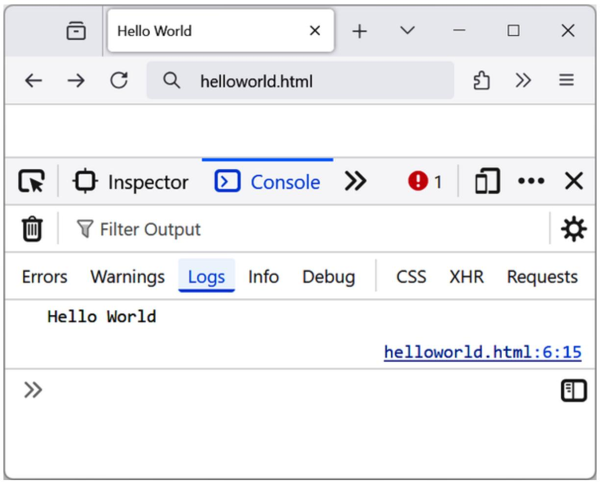
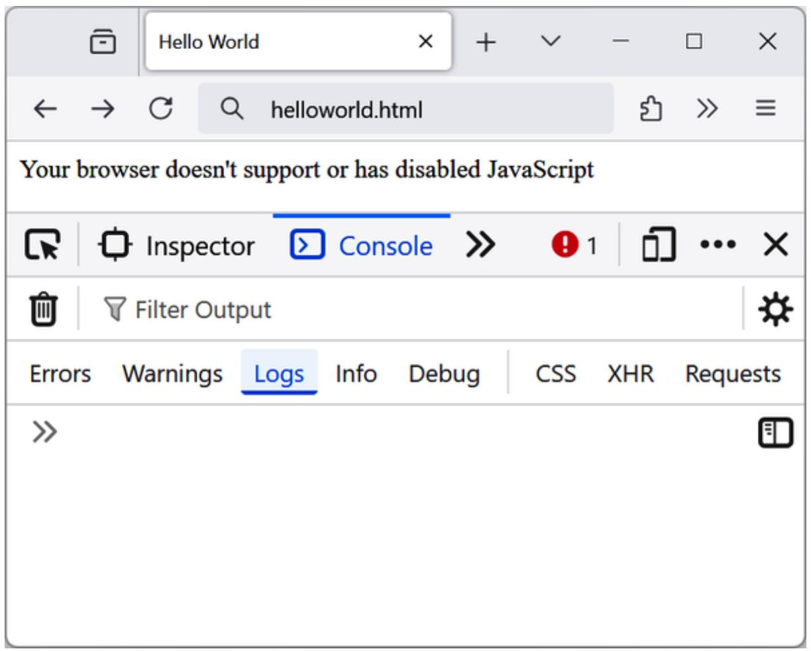
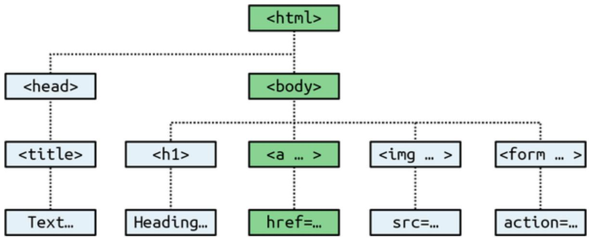

# Chapter 13. Exploring JavaScript

JavaScript brings dynamic functionality to your websites. Every time you see something pop up when you mouse over an item in the browser, or see new text, colors, or images appear on the page in front of your eyes, or grab an object on the page and drag it to a new location—these are done through JavaScript (or CSS). JavaScript offers effects that are not otherwise possible, because it runs inside the browser and has direct access to all the elements in a web document.

JavaScript first appeared in the Netscape Navigator browser in 1995, coinciding with the addition of support for Java technology in the browser. Because of the initial incorrect impression that JavaScript was a spin-off of Java, there has been some long-term confusion over their relationship. However, the naming was just a marketing ploy to help the new scripting language benefit from the popularity of the Java programming language.

JavaScript gained new power when the HTML elements of the web page got a more formal, structured definition in what is called the Document Object Model (DOM). The DOM makes it relatively easy to add a new paragraph or focus on a piece of text and change it.

Because both JavaScript and PHP support much of the structured programming syntax used by the C programming language, they look very similar to each other. They are both fairly high-level languages, too. Also, they are weakly typed, so it’s easy to change a variable to a new type just by using it in a new context.

Now that you have learned PHP, you should find JavaScript even easier. And you’ll be glad you did, because it’s at the heart of the asynchronous communication technology that provides the fluid web frontends that savvy web users expect these days.

## Outputting the Results

When teaching programming, it’s necessary to have a quick and easy way to display the results of expressions. In PHP (for example) there are the echo and print statements, which simply send text to the browser or the terminal if the script is executed from the command line, so that’s easy. In JavaScript, though, there are the following alternatives.

### Using console.log

The console.log function will output the result of any value or expression passed to it in the console of the current browser. This is a special mode with a frame or window separate from the browser window, and in which errors and other messages can be made to display. You can find the console in the browser developer tools, so you may want to open it when trying out the following examples as the console will be used to display the output.

### Using alert

The alert function displays values or expressions passed to it in a pop-up window, which requires you to click a button to close. Clearly this can become quite irritating, and it has the downside of displaying only the current message—previous ones are erased.

### Writing into Elements

It is possible to write directly into the text of an HTML element, which is a fairly elegant solution (and the best one for production websites)—except that for this book every example would require such an element to be created, and some lines of code to access it. This gets in the way of teaching the core of an example and would make the code overly cumbersome and confusing.

### Using document.write

The document.write function writes a value or expression at the current browser location and at first glance seems the perfect choice for quickly displaying results. It keeps all the examples short and sweet by placing the output right there in the browser next to the web content and code.

You may, however, have heard that some developers regard this function as unsafe, because when you call it after a web page is fully loaded, it will overwrite the current document.

I never use document.write in production code (except in the very rarest circumstances where it is necessary). Instead, I almost always use the preceding option of writing directly into a specially prepared element, per the more complex examples in Chapter 17 onward (which access the innerHTML property of elements for program output).

## JavaScript and HTML Text

Executing JavaScript code requires a JavaScript engine. All modern web browsers have a JavaScript engine, allowing the browser itself to execute JavaScript. Node.js, which we will explore later, is a JavaScript engine that doesn’t require a browser and is suitable for desktop or server-side use.

To add a JavaScript code to your web page, you place it between opening <script> and closing </script> HTML tags. Note that a typical “Hello World” document using JavaScript might look like Example 13-1.

Example 13-1. “Hello World” displayed using JavaScript

```html
<html>
<head><title>Hello World</title></head>
<body>
    <script>
    console.log("Hello World")
    </script>
    <noscript>
    Your browser doesn't support or has disabled JavaScript
    </noscript>
```

```txt
</body>
</html>
```

Within the <script> tags is a single line of JavaScript code that uses its equivalent of the PHP echo or print commands, console.log. As you’d expect and as already explained, it simply outputs the supplied string to the browser console, where it is displayed.

You also may have noticed that, unlike with PHP, there is no trailing semicolon (;). This is because a newline often, but not always, serves the same purpose as a semicolon in JavaScript. However, if you wish to have more than one statement on a single line, you do need to place a semicolon after each command except the last one. Of course, if you wish, you can add a semicolon to the end of every statement, and your JavaScript will work fine. My personal preference is to leave out the semicolon because it’s often superfluous. At the end of the day, though, the choice may come down to the team you work on. So, if in doubt, just add the semicolons.

The other thing to note in this example is the <noscript> and </noscript> pair of tags. These are used when you wish to offer alternative HTML to users whose browsers do not support or have disabled JavaScript. Using these tags is up to you, as they are not required, but you ought to use them at least to tell users that JavaScript is required, because in complex apps, providing static HTML alternatives to the operations you provide using JavaScript may be difficult. However, the remaining examples in this book will omit <noscript> tags, because we’re focusing on what you can do with JavaScript, not what you can do without it.

When Example 13-1 is loaded, a web browser with JavaScript enabled will output the following (as shown in Figure 13-1):



<details>
<summary>text_image</summary>

Hello World
← → C Q helloworld.html
Inspector Console 1
Filter Output
Errors Warnings Logs Info Debug CSS XHR Requests
Hello World
helloworld.html:6:15
>>
</details>

Figure 13-1. JavaScript, enabled and working

A browser with JavaScript disabled will display the following message (as shown in Figure 13-2):

Your browser doesn't support or has disabled JavaScript



<details>
<summary>text_image</summary>

Hello World
helloworld.html
Your browser doesn't support or has disabled JavaScript
Inspector Console 1
Filter Output
Errors Warnings Logs Info Debug CSS XHR Requests
>>
</details>

Figure 13-2. JavaScript, disabled

### Using Scripts Within a Document Head

In addition to placing a script within the body of a document, you can put it in the <head> section, which is the ideal place if you wish to execute a script when a page loads.

A generally accepted best practice is to place framework files (like jQuery or React or the like) in the <head> element but actual functionality at the bottom of the page just before the closing </body> tag to wait for the entire page to load and the Document Object Model (we’ll discuss it a bit later) to be available.

### Including JavaScript Files

In addition to writing JavaScript code directly in HTML documents, you can include files of JavaScript code either from your website or from anywhere on the internet. The syntax for this is:

```twig
<script src="script.js"></script>
```

Or, to pull in a file from the internet, use:

```txt
<script src="http://someserver.com/script.js"></script>
```

As for the script files themselves, they must not include any <script> or </script> tags; putting them in the JavaScript files will cause an error.

Including script files is the preferred way to use third-party JavaScript files on your website.

### Debugging JavaScript Errors

When you’re learning JavaScript, it’s important to be able to track typing or other coding errors. Unlike PHP, which displays error messages in the browser, JavaScript displays the errors in the browser console in the developer tools. You can open the console by pressing F12 and selecting the Console tab, or by pressing Ctrl-Shift-J on a PC or Cmd-Shift-J on a Mac.

**DEVELOPER TOOLS IN SAFARI**

To view the JavaScript console in Safari, you first need to enable the Develop menu by selecting “Show features for developers” in Safari → Preferences → Advanced. Then press Cmd-Opt-C, or select the Show JavaScript Console item in the Develop menu in Safari’s menu bar.

Please refer to the browser developers’ documentation on their websites for full details on using them.

## Using Comments

Because of their shared inheritance from the C programming language, PHP and JavaScript have many similarities, one of which is commenting. First, there’s the single-line comment, like this:

// This is a comment

This style uses a pair of forward slash characters (//) to inform JavaScript that everything that follows on the current line is to be ignored. You also have multiline comments, like this:

```txt
/* This is a section of multiline comments that will not be interpreted */
```

You start a multiline comment with the sequence /\* and end it with \*/. Just remember that you cannot nest multiline comments, so make sure that you don’t comment out large sections of code that already contain multiline comments.

A common variant of a multiline comment that is used to document functions and other code is called JSDoc:

```javascript
/**
 * Show a page notification.
 * @param {string} message
 */
```

## Semicolons

Unlike PHP, JavaScript generally does not require semicolons if you have only one statement on a line. Therefore, the following is valid:

$$
x + = 1 0
$$

However, when you wish to place more than one statement on a line, you must separate them with semicolons, like this:

$$
x + = 1 0; y - = 5; z = 0
$$

You can leave the final semicolon off, because the newline terminates the final statement.

**WARNING**

There are exceptions to the semicolon rule. If you write JavaScript bookmarklets or end a statement with a variable or function reference, and the first character of the line below is a left parenthesis or bracket, you must remember to append a semicolon or the JavaScript will fail. When in doubt, use a semicolon.

## Variables

No particular character identifies a variable in JavaScript like the dollar sign does in PHP. Instead, variables use these rules:

A variable may include only the letters a–z, A–Z, 0–9, the \$ symbol, and the underscore (\_).  
No other characters, such as spaces or punctuation, are allowed in a variable name.  
The first character of a variable name can be only a–z, A–Z, \$, or \_ (no numbers).  
Names are case-sensitive. Count, count, and COUNT are all different variables.  
There is no set limit on variable name lengths.

And yes, you’re right: a \$ is in that list of allowed characters. It is allowed by JavaScript and may be the first character of a variable or function name. This lets you port a lot of PHP code more quickly to JavaScript. That said, I don’t recommend keeping the \$ character because it is frequently employed by jQuery as an alias.

### String Variables

JavaScript string variables should be enclosed in either single or double quotation marks, like this:

```toml
greeting = "Hello there"
warning = 'Be careful'
```

You may include a single quote within a double-quoted string or a double quote within a single-quoted string. But you must escape a quote of the same type by using the backslash character, like this:

```txt
greeting = "\"Hello there\" is a greeting"
warning = '\Be careful\' is a warning'
```

To use or copy a string variable, you can assign it to another one, like this:

```txt
newstring = oldstring
```

or you can use it in a function, like this:

```coffeescript
status = "All systems are working"
console.log(status)
```

### Numeric Variables

Creating a numeric variable is as simple as assigning a value, as in these examples:

```hcl
count = 42
temperature = 98.4
```

Like strings, numeric variables can be read from and used in expressions and functions.

### Arrays

JavaScript arrays are also very similar to those in PHP, in that an array can contain string or numeric data, as well as other arrays. To assign values to an array, use the following syntax (which in this case creates an array of strings):

```txt
toys = ['bat', 'ball', 'whistle', 'puzzle', 'doll']
```

To create a multidimensional array (or, more accurately, an array of arrays), nest smaller arrays within a larger one. So, to create a two-dimensional array containing the colors of a single face of a scrambled Rubik’s Cube (where the colors red, green, orange, yellow, blue, and white are represented by their capitalized initial letters), you could use this code:

```txt
face =
[
['R', 'G', 'Y'],
['W', 'R', 'O'],
['Y', 'W', 'G']
]
```

The preceding example has been formatted to make it obvious what is going on, but it could also be written like this:

```python
face = [[ 'R', 'G', 'Y'], ['W', 'R', 'O'], ['Y', 'W', 'G']]
```

or even like this:

```python
top = ['R', 'G', 'Y']
mid = ['W', 'R', 'O']
bot = ['Y', 'W', 'G']
face = [top, mid, bot]
```

To access the element two down and three along in this matrix, you would use the following (because array elements start at position 0):

console.log(face[1][2])

This statement will output the letter O for orange.

**NOTE**

JavaScript arrays are powerful storage structures, and Chapter 15 discusses them in much greater depth.

## Operators

Operators in JavaScript, as in PHP, can involve mathematics, changes to strings, and comparison and logical operations (and, or, etc.). JavaScript mathematical operators look a lot like plain arithmetic—for instance, the following statement outputs 15:

console.log(13 + 2)

The following sections teach you about the various operators.

### Arithmetic Operators

Arithmetic operators are used to perform mathematics. You can use them for the main four operations (addition, subtraction, multiplication, and division) as well as to find the modulus (more precisely, the remainder after a division) and to increment or decrement a value (see Table 13-1).

Table 13-1. Arithmetic operators

<table><tr><td>Operator</td><td>Description</td><td>Example</td></tr><tr><td>+</td><td>Addition</td><td>j + 12</td></tr><tr><td>-</td><td>Subtraction</td><td>j - 22</td></tr><tr><td>*</td><td>Multiplication</td><td>j * 7</td></tr><tr><td>/</td><td>Division</td><td>j / 3.13</td></tr><tr><td>%</td><td>Modulus (division remainder)</td><td>j % 6</td></tr><tr><td>++</td><td>Increment</td><td>++j</td></tr><tr><td>--</td><td>Decrement</td><td>--j</td></tr></table>

### Assignment Operators

The assignment operators are used to assign values to variables. They start with the very simple = and move on to +=, –=, and so on. The operator += adds the value on the right side to the variable on the left, instead of totally replacing the value on the left. Thus, if count starts with the value 6, the statement:

```solidity
count += 1
```

sets count to 7, just like the more familiar assignment statement:

```txt
count = count + 1
```

Table 13-2 lists the assignment operators available.  
Table 13-2. Assignment operators

<table><tr><td>Operator</td><td>Example</td><td>Equivalent to</td></tr><tr><td>=</td><td>j = 99</td><td>j = 99</td></tr><tr><td>+=</td><td>j += 2</td><td>j = j + 2</td></tr><tr><td>+=</td><td>j += &#x27;string&#x27;</td><td>j = j + &#x27;string&#x27;</td></tr><tr><td>-=</td><td>j -= 12</td><td>j = j - 12</td></tr><tr><td>*=</td><td>j *= 2</td><td>j = j * 2</td></tr><tr><td>/=</td><td>j /= 6</td><td>j = j / 6</td></tr><tr><td>%=</td><td>j %= 7</td><td>j = j % 7</td></tr></table>

### Comparison Operators

Comparison operators are used inside a construct such as an if statement, where you need to compare two items. For example, you may wish to know whether a variable you have been incrementing has reached a specific value, or whether another variable is less than a set value, and so on (see Table 13-3).

Table 13-3. Comparison operators

<table><tr><td>Operator</td><td>Description</td><td>Example</td></tr><tr><td>==</td><td>Is equal to</td><td>j == 42</td></tr><tr><td>!=</td><td>Is not equal to</td><td>j != 17</td></tr><tr><td>&gt;</td><td>Is greater than</td><td>j &gt; 0</td></tr><tr><td>&lt;</td><td>Is less than</td><td>j &lt; 100</td></tr><tr><td>&gt;=</td><td>Is greater than or equal to</td><td>j &gt;= 23</td></tr><tr><td>&lt;=</td><td>Is less than or equal to</td><td>j &lt;= 13</td></tr><tr><td>===</td><td>Is equal to (and of the same type)</td><td>j === 56</td></tr><tr><td>!==</td><td>Is not equal to (and of the same type)</td><td>j !== &#x27;1&#x27;</td></tr></table>

### Logical Operators

Unlike PHP, JavaScript’s logical operators do not include and and or equivalents to && and ||, and there is no xor operator (see Table 13-4).

Table 13-4. Logical operators

<table><tr><td>Operator</td><td>Description</td><td>Example</td></tr><tr><td>&amp;&amp;</td><td>And</td><td>j == 1 &amp;&amp; k == 2</td></tr><tr><td>||</td><td>Or</td><td>j &lt; 100 || j &gt; 0</td></tr><tr><td>!</td><td>Not</td><td>!(j == k)</td></tr></table>

### Incrementing, Decrementing, and Shorthand Assignment

The following forms of post- and pre-incrementing and decrementing that you learned to use in PHP are also supported by JavaScript, as are shorthand assignment operators:

```txt
++x
--y
x += 22
y -= 3
```

### String Concatenation

JavaScript handles string concatenation slightly differently from PHP. Instead of the . (period) operator, it uses the plus sign (+), like this:

```coffeescript
console.log("You have " + messages + " messages.")
```

Assuming that the variable messages is set to the value 3, the output from this line of code will be:

You have 3 messages.

Just as you can add a value to a numeric variable with the += operator, you can also append one string to another the same way:

```hcl
name = "James"
name += "Dean"
```

### Escape Characters

Escape characters, which you’ve seen used to insert quotation marks in strings, can also be used to insert various special characters such as tabs, newlines, and carriage returns. Here is an example using tabs to lay out a heading—it is included here merely to illustrate escapes, because in web pages, there are better ways to do layout:

```txt
heading = "Name\tAge\tLocation"
```

Table 13-5 details the escape characters available.

Table 13-5. JavaScript’s escape characters

<table><tr><td>Character</td><td>Meaning</td></tr><tr><td>\b</td><td>Backspace</td></tr><tr><td>\f</td><td>Form feed</td></tr><tr><td>\n</td><td>Newline</td></tr><tr><td>\r</td><td>Carriage return</td></tr><tr><td>\t</td><td>Tab</td></tr><tr><td>\&#x27;</td><td>Single quote (or apostrophe)</td></tr><tr><td>\&quot;</td><td>Double quote</td></tr><tr><td>\\</td><td>Backslash</td></tr><tr><td>\xxx</td><td>An octal number between 000 and 377 that represents the Latin-1 character equivalent (such as \251 for the © symbol)</td></tr><tr><td>\xxx</td><td>A hexadecimal number between 00 and FF that represents the Latin-1 character equivalent (such as \xA9 for the © symbol)</td></tr><tr><td>\uxxxx</td><td>A hexadecimal number between 0000 and FFFF that represents the Unicode character equivalent (such as \u000A9 for the © symbol)</td></tr></table>

## Variable Typing

Like PHP, JavaScript is a very loosely typed language; the type of a variable is determined only when a value is assigned, and it can change as the

variable appears in different contexts. Usually, you don’t have to worry about the type; JavaScript figures out what you want and just does it.

**JAVASCRIPT BUT WITH TYPES**

If you’d like to use JavaScript but also love types, you can use TypeScript, a programming language released in 2012 that adds types to JavaScript.

Take a look at Example 13-2, in which:

1. The variable n is assigned the string value '838102050'. The next line prints out its value, and the typeof operator is used to look up the type.  
2. n is given the value returned when the numbers 12345 and 67890 are multiplied together. This value is also 838102050, but it is a number, not a string. The type of the variable is then looked up and displayed.  
3. Some text is appended to the number n and the result is displayed.

Example 13-2. Setting a variable’s type by assignment

```vue
<script>
    n = '838102050'    // Set 'n' to a string
    console.log('n = ' + n + ', and is a ' + typeof n)
    n = 12345 * 67890;    // Set 'n' to a number
    console.log('n = ' + n + ', and is a ' + typeof n)
    n += ' plus some text' // Change 'n' from a number to a string
    console.log('n = ' + n + ', and is a ' + typeof n)
</script>
```

The output from this script looks like this:

```txt
n = 838102050, and is a string
n = 838102050, and is a number
n = 838102050 plus some text, and is a string
```

If there is ever any doubt about the type of a variable, or you need to ensure that a variable has a particular type, you can force it to that type by using statements such as the following (which, respectively, turn a string into a number and a number into a string):

```hcl
n = "123"
n *= 1 // Convert 'n' into a number
n = 123
n += "" // Convert 'n' into a string
```

Or you can use these functions in the same way:

```txt
n = "123"
n = parseInt(n) // Convert 'n' into an integer number
n = parseFloat(n) // Convert 'n' into a floating point number
n = 123
n = n.toString() // Convert 'n' into a string
```

You can read more about type conversion in JavaScript at javascript.info/type-conversions. And you can always look up a variable’s type by using the typeof operator.

**NOTE**

Using typeof on values like null or [] may give unexpected results as both typeof null and typeof [] return "object".

## Functions

As with PHP, JavaScript functions are used to separate out sections of code that perform a particular task. To create a function, declare it as shown in Example 13-3.

Example 13-3. A simple function declaration

```vue
<script>
    function product(a, b) {
    return a * b
    }
</script>
```

This function takes the two parameters passed, multiplies them together, and returns the product.

## Global Variables

Global variables are ones defined outside of any functions (or defined within functions but without the var keyword). They can be defined as:

```txt
a = 123 // Global scope
var b = 456 // Global scope
if (a == 123) var c = 789 // Global scope
```

Regardless of whether you are using the var keyword, as long as a variable is defined outside of a function, it is global in scope and every part of a script can have access to it.

## Local Variables

Parameters passed to a function automatically have local scope, that is, they can be referenced only from within that function. However, there is one exception. Arrays are passed to a function by reference, so if you modify

any elements in an array parameter, the elements of the original array will be modified.

To define a local variable that has scope only within the current function, and has not been passed as a parameter, use the var keyword. Example 13-4 shows a function that creates one variable with global scope (not recommended to create variables like this) and two with local scope.

Example 13-4. A function creating variables with global and local scope  
```vue
<script>
function test() {
    a = 123 // Global scope, discouraged
    var b = 456 // Local scope
    if (a == 123) var c = 789 // Local scope
}
</script>
```

To test whether scope setting has worked in PHP, we can use the isset function. But in JavaScript there is no such function, so Example 13-5 uses the typeof operator, which returns the string undefined when a variable is not defined.

Example 13-5. Checking the scope of the variables defined in the function test  
```vue
<script>
test()
if (typeof a != 'undefined') console.log('a = '" + a + '"')
if (typeof b != 'undefined') console.log('b = '" + b + '"')
if (typeof c != 'undefined') console.log('c = "' + c + '"')

function test() {
    a = 123
    var b = 456

    if (a == 123) var c = 789
}
</script>
```

The output from this script is the following single line:

```txt
a = "123"
```

This shows that only the variable a was given global scope, which is exactly what we would expect, since the variables b and c were given local scope by being prefaced with the var keyword.

If your browser issues a warning about b being undefined, the warning is correct but it can be ignored.

### Using let

JavaScript now offers two new keywords: let and const, and you should be using them instead of the rather legacy var. The let keyword is pretty much a swap-in for var, but it has the advantage that you cannot redeclare a variable in the same scope once you have done so with let, although you can with var.

You see, the fact that you could redeclare variables using var was leading to obscure bugs, such as:

```javascript
var hello = "Hello there"
var counter = 1
if (counter > 0)
{
    var hello = "How are you?"
}
console.log(hello)
```

Can you see the problem? Because counter is greater than 0 (since we initialized it to 1), the string hello is redefined as “How are you?” which is then displayed in the console.

If you replace the var with let (as follows), the second declaration is seemingly ignored as the string “How are you?” is visible only in the if block, where it is unused. The original string “Hello there” will be displayed instead:

```txt
let hello = "Hello there"
let counter = 1
if (counter > 0)
{
    let hello = "How are you?"
}
console.log(hello)
```

The var keyword is either globally scoped (if outside of any blocks or functions) or function scoped, and variables declared with it are initialized with undefined, so they can be referenced before the var declaration, but the let keyword is either globally or block scoped, and variables are not initialized, meaning variables cannot be referenced before the let declaration.

Any variable assigned using let has scope either within the entire document if declared outside of any block, or, if declared within a block bounded by {} (which includes functions), its scope is limited to that block (and any nested sub-blocks). If you declare a variable within a block but try to access it from outside that block, an error will be returned, as with the following, which will fail at the console.log because hello will have no value:

```hcl
let counter = 1
if (counter > 0)
{
    let hello = "How are you?"
}
```

console.log(hello)

Although the practice is discouraged, you can use let to declare variables of the same name as previously declared ones, as long as it is within a new scope, in which case any previous value assigned to a variable of the same name in the previous scope will become inaccessible to the new scope, because the new variable of the same name is treated as totally different from the previous one. It has scope only within the current block, or any sub-blocks (unless another let is used to declare yet another variable of the same name in a sub-block).

It is good practice to avoid the reuse of meaningful variable names, or you risk causing confusion. However, loop or index variables such as i (or other short and simple names) can be reused in new scopes without causing confusion.

### Using const

You can further increase your control over scope by declaring a variable to have a constant value, that is, one that cannot be changed. This is beneficial when you have created a variable that you are treating as a constant but had declared it only using var or let, because you might have instances in your code where you try to change that value, which would be allowed but would be a bug.

However, if you use the const keyword to declare the variable and assign its value, any attempt to change the value later will be disallowed, and your code will halt with an error message in the console similar to:

Uncaught TypeError: Assignment to constant variable

The following code will cause that error:

const hello = "Hello there"

```txt
let counter = 1
if (counter > 0)
{
    hello = "How are you?"
}
console.log(hello)
```

Unlike strings, arrays and objects can be modified, for example added to, as you don’t modify the variable itself but only change its internals:

```javascript
const array = [1, 2]
array.push(3) // Works, will add 3 to the array
array = [4, 5, 6] // Will throw an error
```

Just like let, const declarations are also block scoped (within {} sections and any sub-blocks), meaning that you can have constant variables of the same name but have different values in different scopes of a piece of code. However, I strongly recommend you try to avoid duplication of names and keep any constant name for one single value throughout each program, using a new constant name wherever you need a new constant.

In summary: var has global or function scope, and let and const have global or block scope. Both var and let can be declared without being initialized, while const must be initialized during declaration. The var keyword can be reused to redeclare a var variable, but let and const cannot. Finally, const can be neither redeclared nor reassigned.

## The Document Object Model

JavaScript’s design is very smart. Rather than creating yet another scripting language (which would have still been a pretty good improvement at the time), there was a vision to build it around the already-existing HTML Document Object Model. This breaks down the parts of an HTML

document into discrete objects, each with its own properties and methods and each subject to JavaScript’s control.

JavaScript separates objects, properties, and methods by using a period (one good reason why + is the string concatenation operator in JavaScript, rather than the period). For example, let’s consider a business card as an object we’ll call card. This object contains properties such as a name, address, phone number, and so on. In the syntax of JavaScript, these properties would look like this:

```ignorefile
card.name
card.phone
card.address
```

Its methods are functions that retrieve, change, and otherwise act on the properties. For instance, to invoke a method that displays the properties of the object card, you might use syntax such as this:

```txt
card.display()
```

Have a look at some of the earlier examples in this chapter and notice where the statement console.log is used. Now that you understand how JavaScript is based around objects, you will see that log is actually a method of the console object.

Within JavaScript, there is a hierarchy of parent and child objects, known as the Document Object Model or DOM (see Figure 13-3).

```mermaid
graph TD
  A["<html>"] --> B["<head>"]
  A --> C["<body>"]
  C --> D["<title>"]
  C --> E["<h1>"]
  C --> F["<a ... >"]
  C --> G["<img ... >"]
  C --> H["<form ... >"]
  D --> I["Text..."]
  D --> J["Heading..."]
  E --> K["href=..."]
  F --> L["src=..."]
  H --> M["action=..."]
```



<details>
<summary>flowchart</summary>


</details>

Figure 13-3. Example of DOM object hierarchy

The figure uses HTML tags you are already familiar with to illustrate the parent/child relationship between the various objects in a document. The last row shows object content "Text..." and "Heading...", and object properties href, src, and action. For example, a URL within a link is part of the body of an HTML document. In JavaScript, it is referenced like this:

```txt
url = document.links.linkname.href
```

Notice how this follows the central column down. The first part, document, refers to the <html> and <body> tags in the figure; links.linkname refers to the <a> tag, and href to the href attribute.

Let’s turn this into some HTML and a script to read a link’s properties. Type Example 13-6 and save it as linktest.html; then call it up in your browser.

Example 13-6. Reading a link URL with JavaScript  
```html
<html>
<head>
    <title>Link Test</title>
</head>
<body>
    <a id="mylink" href="http://mysite.com">Click me</a><br>
    <script>
```

```html
url = document.links.mylink.href
console.log('The URL is ' + url)
</script>
</body>
</html>
```

If you wish, just for the purposes of testing this (and other examples), you could also omit everything outside of the <script> and </script> tags. The output from this example in the browser console is:

The URL is http://mysite.com/

Notice how the code follows the document tree down from document to links to mylink (the id given to the link) to href (the URL destination value).

A short form that works equally well starts with the value in the id attribute: mylink.href. So, you can replace this:

```html
url = document.links.mylink.href
```

with this:

```txt
url = mylink.href
```

### Another Use for the \$ Symbol

As mentioned earlier, the \$ symbol is allowed in JavaScript variable and function names. Because of this, you may sometimes encounter strangelooking code like this:

```makefile
url = $('mylink').href
```

Some enterprising programmers have decided that the getElementById function is so prevalent in JavaScript that they have written a function to replace it called \$, like in jQuery (although jQuery uses the \$ for much more than just getting an element by its ID).

### Using the DOM

The links object is actually an array of URLs, so the mylink URL in Example 13-6 can also be safely referred to in all browsers in the following way (because it’s the first, and only, link):

```html
url = document.links[0].href
```

If you want to know how many links are in an entire document, you can query the length property of the links object, like this:

```txt
numlinks = document.links.length
```

You can extract and display all links in a document, like this:

```javascript
for (j=0 ; j < document.links.length ; ++j)
console.log(document.links[j].href)
```

The length of something is a property of every array, and many objects as well. For example, the number of items in your browser’s web history can be queried like this:

```javascript
console.log(history.length)
```

To stop websites from snooping on your browsing history, the history object stores only the number of sites in the array: you cannot read the full history; you can modify only the current entry with

history.replaceState or add a new entry with history.pushState.

You can also replace the current page with one from the history, if you know what position it has within the history. This can be very useful for cases in which you know that certain pages in the history came from your site, or you simply wish to send the browser back one or more pages, which you do with the go method of the history object. For example, to send the browser back three pages, issue the command:

history.go(-3)

You can also use the following methods to move back or forward a page at a time:

history.back()

history.forward()

Similarly, you can replace the currently loaded URL with one of your choosing, like this:

document.location.href = 'http://google.com'

Of course, there’s a whole lot more to the DOM than reading and modifying links. As you progress through the following chapters on JavaScript, you’ll become quite familiar with the DOM and how to access it.

In Chapter 14 we’ll continue our exploration by looking at how to control program flow and write expressions, but first let’s repeat what you’ve learned by answering the following questions.

## Questions

1. Which tags do you use to enclose JavaScript code?

2. How can you include JavaScript code from another source in your documents?  
3. Which JavaScript function is the equivalent of echo or print used in PHP for quick output of values or expressions?  
4. How can you create a comment in JavaScript?  
5. What is the JavaScript string concatenation operator?  
6. Which keyword can you use within a JavaScript function to define a variable that has local scope?  
7. Give two cross-browser methods to display the URL assigned to the link with an id of thislink.  
8. Which two JavaScript commands will make the browser load the previous page in its history array?  
9. What JavaScript command would you use to replace the current document with the main page at the oreilly.com website?

See “Chapter 13 Answers” in the Appendix A for the answers to these questions.