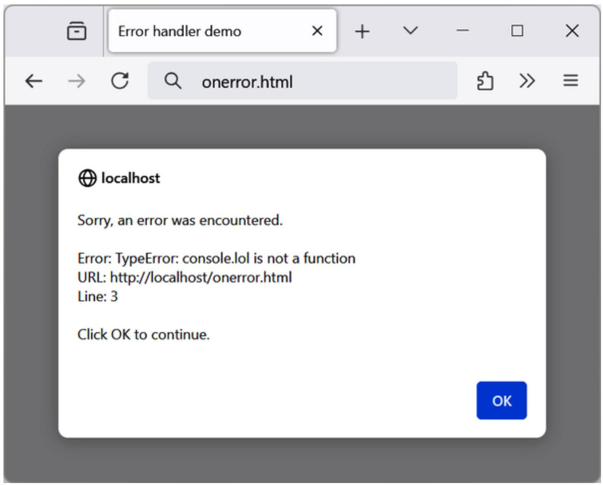

# Chapter 14. Expressions and Control Flow in JavaScript

In Chapter 13, I introduced the basics of JavaScript and the DOM. Now it’s time to look at how to construct complex expressions in JavaScript and how to control the program flow of your scripts by using conditional statements.

## Expressions

JavaScript expressions are very similar to those in PHP. As you learned in Chapter 4, an expression is a combination of values, variables, operators, and functions that results in a value.

Example 14-1 shows some simple expressions. For each line, it prints out a letter between a and d, followed by a colon and the result of the expressions.

Example 14-1. Four simple Boolean expressions

```vue
<script>
    console.log("a: " + (42 > 3))
    console.log("b: " + (91 < 4))
    console.log("c: " + (8 === 2))
    console.log("d: " + (4 < 17))
</script>
```

The output from this code is:

```yaml
a: true
b: false
c: false
d: true
```

Notice that both expressions a: and d: evaluate to true, but b: and c: evaluate to false. Unlike PHP (which would print the number 1 and nothing, respectively), the actual strings true and false are displayed.

In JavaScript, when you are checking whether a value is true or false, all values evaluate to true except the following, which evaluate to false:

0  
–0  
The empty string  
null  
undefined

The string false itself

NaN (Not a Number, a computer engineering concept for the result of an illegal floating-point operation such as division by zero)

Note that I am referring to true and false in lowercase. This is because, unlike in PHP, in JavaScript these values must be lowercase. Therefore, only the first of the two following if statements will display, printing the lowercase word true, because the second will cause a TRUE is not defined error:

```javascript
const foo = true
if (foo === true) console.log('foo is true') // True
if (foo === TRUE) console.log('foo is TRUE') // Will cause an error
```

**NOTE**

Remember that any code snippets you wish to type and try for yourself in an HTML file need to be enclosed within <script> and </script> tags.

## Literals and Variables

The simplest form of an expression is a literal, which means something that evaluates to itself, such as the number 22 or the string "Press Enter". An expression could also be a variable, which evaluates to the value assigned to it. They are both types of expressions, because they return a value.

Example 14-2 shows three different literals and two variables, all of which return values, albeit of different types.

Example 14-2. Five types of literals  
```txt
<script>
const myname = "Peter"
const myage = 24
console.log("a: " + 42) // Numeric literal
console.log("b: " + "Hi") // String literal
console.log("c: " + true) // Boolean literal
console.log("d: " + myname) // String variable
console.log("e: " + myage) // Numeric variable
</script>
```

And, as you’d expect, you see a return value from all of these in the following output:

```yaml
a: 42
b: Hi
c: true
d: Peter
e: 24
```

Operators let you create more complex expressions that evaluate to useful results. In contrast with an expression, a statement is code that does not evaluate to a value. Most control flow constructs in JavaScript are statements.

Example 14-3 shows one of each. The first assigns the result of the expression 366 - day\_number to the variable days\_to\_new\_year, and the second outputs a friendly message only if the expression days\_to\_new\_year < 30 evaluates to true.

Example 14-3. Two simple JavaScript statements  
```vue
<script>
    const day_number = 127 // For example
    const days_to_new_year = 366 - day_number
    if (days_to_new_year < 30) console.log("It's nearly New Year")
    else console.log("A long time to go")
</script>
```

## Operators

JavaScript offers a lot of powerful operators, ranging from arithmetic, string, and logical operators to assignment, comparison, and more (see Table 14-1).

Table 14-1. JavaScript operator types

<table><tr><td>Operator</td><td>Description</td><td>Example</td></tr><tr><td>Arithmetic</td><td>Basic mathematics</td><td>a + b</td></tr><tr><td>Assignment</td><td>Assign values</td><td>a = b + 23</td></tr><tr><td>Bitwise</td><td>Manipulate bits within bytes</td><td>12 ^ 9</td></tr><tr><td>Comparison</td><td>Compare two values</td><td>a &lt; b</td></tr><tr><td>Increment/decrement</td><td>Add or subtract one</td><td>a++ / b--</td></tr><tr><td>Logical</td><td>Boolean</td><td>a &amp;&amp; b</td></tr><tr><td>String</td><td>Concatenation</td><td>a + &#x27;string&#x27;</td></tr></table>

Each operator takes a different number of operands:

Unary operators, such as incrementing (a++) or negation (-a), take a single operand.  
Binary operators, which represent the bulk of JavaScript operators —including addition, subtraction, multiplication, and division— take two operands.  
The one ternary operator, which takes the form ? x : y, requires three operands. It’s a terse single-line if statement that chooses between two expressions depending on a third one.

### Operator Precedence

Like PHP, JavaScript utilizes operator precedence, in which some operators in an expression are processed before others and are therefore evaluated first. Table 14-2 lists JavaScript’s operators and their precedences. Check the MDN page on operator precedence for a detailed description.

Table 14-2. Precedence of JavaScript operators (high to low)

<table><tr><td>Operator(s)</td><td>Type(s)</td></tr><tr><td>() [] .</td><td>Parentheses, call, and member</td></tr><tr><td>++ --</td><td>Increment/decrement</td></tr><tr><td>+ - ~ !</td><td>Unary, bitwise, and logical</td></tr><tr><td>* / %</td><td>Arithmetic</td></tr><tr><td>+ -</td><td>Arithmetic and string</td></tr><tr><td>&lt;&lt; &gt;&gt; &gt;&gt;&gt;</td><td>Bitwise</td></tr><tr><td>&lt; &gt; &lt;= &gt;=</td><td>Comparison</td></tr><tr><td>== != === !==</td><td>Comparison</td></tr><tr><td>&amp; ^ |</td><td>Bitwise</td></tr><tr><td>&amp;&amp;</td><td>Logical</td></tr><tr><td>||</td><td>Logical</td></tr><tr><td>? :</td><td>Ternary</td></tr><tr><td>= += -= *= /= %=</td><td>Assignment</td></tr><tr><td>&lt;&lt;= &gt;&gt;= &gt;&gt;&gt;= &amp;= ^= |=</td><td>Assignment</td></tr><tr><td>,</td><td>Separator</td></tr></table>

### Associativity

Most JavaScript operators are processed in order from left to right in an equation. But some operators require processing from right to left instead. The direction of processing is called the operator’s associativity.

This associativity becomes important where you do not explicitly force precedence (which you should always do, by the way, because it makes code more readable and less error prone). For example, look at the following assignment operators, by which three variables are all set to the value 0:

```txt
level = score = time = 0
```

This multiple assignment is possible only because the rightmost part of the expression is evaluated first and then processing continues in a right-to-left direction. Table 14-3 lists the JavaScript operators and their associativity.

Table 14-3. Operators and associativity

<table><tr><td>Operator</td><td>Description</td><td>Associativity</td></tr><tr><td>++ --</td><td>Increment and decrement</td><td>None</td></tr><tr><td>new</td><td>Create a new object</td><td>Right</td></tr><tr><td>+ - ~ !</td><td>Unary and bitwise</td><td>Right</td></tr><tr><td>?:</td><td>Ternary</td><td>Right</td></tr><tr><td>= *= /= %= += -=</td><td>Assignment</td><td>Right</td></tr><tr><td>&lt;&lt;= &gt;&gt;= &gt;&gt;&gt;= &amp;= ^= |=</td><td>Assignment</td><td>Right</td></tr><tr><td>,</td><td>Separator</td><td>Left</td></tr><tr><td>+ - * / %</td><td>Arithmetic</td><td>Left</td></tr><tr><td>&lt;&lt; &gt;&gt; &gt;&gt;&gt;</td><td>Bitwise</td><td>Left</td></tr><tr><td>&lt; &lt;= &gt; &gt;= == != === !==</td><td>Arithmetic</td><td>Left</td></tr></table>

### Relational Operators

Relational operators test two operands and return a Boolean result of either true or false. There are three types of relational operators: equality, comparison, and logical.

**Equality operators**

The equality operator is == and the strict equality operator (sometimes called identity operator) is === (neither should be confused with the = assignment operator). Similar to PHP, you’re encouraged to always use the strict equality operators === and !== as they are more safe and only very rarely use == and !=. In Example 14-4, the first statement assigns a value, and the second tests it for equality. As it stands, nothing will be printed out, because month is assigned the string value July, and therefore the check for it having a value of October will fail.

Example 14-4. Assigning a value and testing for equality  
```vue
<script>
    const month = "July"
    if (month === "October") console.log("It's the Fall")
</script>
```

If the non-strict equality operator == is used and if the two operands of the expression are of different types, JavaScript will convert them to whatever type makes best sense to it, and this can result in an unexpected behavior. For example, any strings composed entirely of numbers will be converted to numbers whenever compared with a number. In Example 14-5, a and b are two different values (one is a number, and the other is a string, although an empty one), and we would therefore normally expect neither of the if statements to output a result.

Example 14-5. The equality and identity operators  
```vue
<script>
const a = 0
const b = ""
if (a == b) console.log("1")
if (a === b) console.log("2")
</script>
```

However, if you run the example, you will see that it outputs the number 1, which means that the first if statement evaluated to true. This is because the string value of b was temporarily converted to a number, and therefore both halves of the equation had a numerical value of 0.

In contrast, the second if statement uses the identity operator, three equals signs in a row, which prevents JavaScript from automatically converting types. a and b are therefore found to be different, so nothing is output.

To avoid unexpected behavior, you should always use the strict equality (identity) operator.

**Comparison operators**

Using comparison operators, you can test for more than just equality and inequality. JavaScript also gives you > (is greater than), < (is less than), >= (is greater than or equal to), and <= (is less than or equal to) to play with. Example 14-6 shows these operators in use.

Example 14-6. The four comparison operators  
```vue
<script>
    const a = 7
    const b = 11
    if (a > b) console.log("a is greater than b")
    if (a < b) console.log("a is less than b")
    if (a >= b) console.log("a is greater than or equal to b")
    if (a <= b) console.log("a is less than or equal to b")
</script>
```

In this example, where a is 7 and b is 11, the following is output (because 7 is less than 11 and also less than or equal to 11):

```txt
a is less than b
a is less than or equal to b
```

**Truthy and falsy values**

A truthy value is a value that evaluates to true after casting it to Boolean, and vice versa, a falsy value is a value that evaluates to false after casting it to Boolean.

Some truthy values, for example:

true  
Any number except 0, for example 303  
A nonempty string like "hello"  
An array like [1, 2, 3]  
And even an empty array like []

And some falsy values, for example:

false  
null  
undefined  
Number 0  
Empty string "

The following code will take the truthy values from the preceding list and typecast them to Boolean, except the first one which is already a Boolean, and print the result:

```txt
console.log(
    true, // true
    Boolean(303), // true
    Boolean("hello"), // true
    Boolean([1, 2, 3]), // true
    Boolean([]), // true
    Boolean('hello') // true
)
```

And the same for the falsy values:

```txt
console.log(
    false,    // false
    Boolean(null),    // false
```

```txt
Boolean(undefined), // false
Boolean(0), // false
Boolean("") // false
```

**Logical operators**

Logical operators produce truthy or falsy results and are also known as Boolean operators. JavaScript has three of them (see Table 14-4).

Table 14-4. JavaScript’s logical operators

<table><tr><td>Logical operator</td><td>Description</td></tr><tr><td>x &amp;&amp; y (and)</td><td>y if x is truthy, otherwise x</td></tr><tr><td>x || y (or)</td><td>x if x is truthy, otherwise y</td></tr><tr><td>!x (not)</td><td>true if x is falsy, otherwise false</td></tr></table>

You can see how these can be used in Example 14-7, which outputs 0, 1, and true.

Example 14-7. The logical operators in use

```vue
<script>
const a = 1
const b = 0
console.log(a && b)
console.log(a || b)
console.log( !b )
</script>
```

The && statement requires both operands to be true to return a value of true, the || statement will be true if either value is true, and the third statement performs a NOT on the value of b, turning it from 0 into a value of true.

Both the || and && operators can cause unexpected problems, because the second operand will not be evaluated if the first is evaluated as true in case of ||, or as false in case of &&. This is a feature called short-circuit evaluation. In Example 14-8, the getnext function will never be called if finished has a value of 1 (these are just examples, and the action of getnext is irrelevant to this explanation—just think of it as a function that does something when called).

Example 14-8. A statement using the  operator  
```txt
<script>
    if (finished === 1 || getnext() === 1) done = 1
</script>
```

If you need getnext to be called at each if statement, you should rewrite the code as shown in Example 14-9.

Example 14-9. The  statement modified to ensure calling of getnext  
```vue
<script>
    gn = getnext()
    if (finished === 1 || gn === 1) done = 1;
</script>
```

In this case, the code in the function getnext will be executed and its return value stored in gn before the if statement.

Table 14-5 shows all the possible variations of using the logical operators. You should also note that !true equals false and !false equals true.

Table 14-5. All possible logical expressions

<table><tr><td colspan="2">Inputs</td><td colspan="2">Operators and results</td></tr><tr><td>a</td><td>b</td><td>&amp;&amp;</td><td>||</td></tr><tr><td>true</td><td>true</td><td>true</td><td>true</td></tr><tr><td>true</td><td>false</td><td>false</td><td>true</td></tr><tr><td>false</td><td>true</td><td>false</td><td>true</td></tr><tr><td>false</td><td>false</td><td>false</td><td>false</td></tr></table>

## Using onerror

Using either the onerror event or a combination of the try and catch keywords, you can catch JavaScript errors and deal with them yourself.

Events are actions that can be detected by JavaScript. Every element on a web page has certain events that can trigger JavaScript functions. For example, the click event (sometimes rather incorrectly called the onclick event, as the on prefix is used only for event handler property names) of a button element can be set to call a function and make it run whenever a user clicks the button.

Example 14-10 illustrates how to use the onerror event.

Example 14-10. A script employing the  event

```javascript
<script>
onerror = errorHandler
console lol("Welcome to this website") // Deliberate error

function errorHandler(message, url, line)
{
    out = "Sorry, an error was encountered.\n\n";
```

```vue
out += "Error: " + message + "\n";
out += "URL: " + url + "\n";
out += "Line: " + line + "\n\n";
out += "Click OK to continue.\n\n";
alert(out);
return true;
}
</script>
```

The first line of this script tells the error event to use the new errorHandler function from now on. This function takes three parameters —a message, a url, and a line number—so it’s a simple matter to display all these in an alert pop-up.

Then, to test the new function, we deliberately place a syntax error in the code with a call to console.lol instead of console.log (the final g is replaced with l). Figure 14-1 shows the result of running this script in a browser. Using onerror this way can also be quite useful during debugging.



<details>
<summary>text_image</summary>

localhost
Sorry, an error was encountered.
Error: TypeError: console lol is not a function
URL: http://localhost/onerror.html
Line: 3
Click OK to continue.
</details>

Figure 14-1. Using the  event with an alert method pop-up

## Using try...catch

The try and catch keywords are more standard and more flexible than the onerror technique shown in “Using onerror”. These keywords let you trap errors for a selected section of code, rather than all scripts in a document. However, they do not catch syntax errors, for which you need onerror.

The try...catch construct is supported by all major browsers and is handy when you want to catch a certain condition that you are aware could occur in a specific part of your code.

When working with elements, you can use try and catch to do something else if the element is not available. Example 14-11 shows how.

```vue
<script>
    try {
    document.getElementById('el').innerHTML = '...';
    }
    catch(err) {
    alert("Oh no! There's no element with ID 'el'!")
    }
</script>
```

Another keyword associated with try and catch called finally is always executed, regardless of whether an error occurs in the try clause. To use it, for example to clean up some resources, just add something like the following statements after a catch statement:

```txt
finally {
    alert("The 'try' clause was encountered")
}
```

## Conditionals

Conditionals alter program flow. They enable you to ask questions about certain things and respond to the answers you get in different ways. There are three types of nonlooping conditionals: the if statement, the switch statement, and the ? operator.

### The if Statement

Several examples in this chapter have already used if statements. The code within such a statement is executed only if the given expression evaluates to true. Multiline if statements require curly braces around them, but as in PHP, you can omit the braces for single statements, although it’s often a good idea to use them anyway, especially when writing code in which the number of actions within an if statement might change as development proceeds. Therefore, the following statements are valid:

```javascript
if (a > 100) {
    b = 2
    console.log("a is greater than 100")
}
if (b === 10) console.log("b is equal to 10")
```

### The else Statement

When a condition has not been met, you can execute an alternative by using an else statement, like this:

```txt
if (a > 100) {
    console.log("a is greater than 100")
}
else {
    console.log("a is less than or equal to 100")
}
```

Unlike PHP, JavaScript has no elseif statement, but that’s not a problem because you can use an else followed by another if to form the equivalent of an elseif statement, like this:

```txt
if (a > 100) {
    console.log("a is greater than 100")
}
else if (a < 100) {
    console.log("a is less than 100")
}
else {
    console.log("a is equal to 100")
}
```

As you can see, you can use another else after the new if, which could equally be followed by another if statement, and so on. Although I have shown braces on the statements, because each is a single line, the previous example could be written:

```txt
if (a > 100) console.log("a is greater than 100")
else if (a < 100) console.log("a is less than 100")
else console.log("a is equal to 100")
```

### The switch Statement

The switch statement is useful when one variable or the result of an expression can have multiple values and you want to perform a different function for each value.

For example, the following code takes the PHP menu system we put together in Chapter 4 and converts it to JavaScript. It works by passing a single string to the main menu code according to what the user requests. Let’s say the options are Home, About, News, Login, and Links, and we set the variable page to one of these according to the user’s input.

The code for this written using if...else if... will look like Example 14-12.

Example 14-12. A multiline   statement

```vue
<script>
    if (page === "Home") console.log("You selected Home")
    else if (page === "About") console.log("You selected About")
    else if (page === "News") console.log("You selected News")
    else if (page === "Login") console.log("You selected Login")
    else if (page === "Links") console.log("You selected Links")
</script>
```

But using a switch construct, the code could look like Example 14-13.

Example 14-13. A  construct

```txt
<script>
    switch (page) {
```

```vue
case "Home":
    console.log("You selected Home")
    break
case "About":
    console.log("You selected About")
    break
case "News":
    console.log("You selected News")
    break
case "Login":
    console.log("You selected Login")
    break
case "Links":
    console.log("You selected Links")
    break
}
</script>
```

The variable page is mentioned only once at the start of the switch statement. Thereafter, the case command checks for matches. When one occurs, the matching conditional statement is executed. Of course, a real program would have code here to display or jump to a page, rather than simply telling the user what was selected.

**NOTE**

You can also supply multiple cases for a single action; this is called fall-through cases.

For example:

```txt
switch (heroName) {
    case "Superman":
    case "Batman":
    case "Wonder Woman":
    console.log("Justice League")
    break
    case "Iron Man":
    case "Captain America":
    case "Spiderman":
    console.log("The Avengers")
    break
}
```

**Breaking out**

As you can see in Example 14-13, just as with PHP, the break command allows your code to break out of the switch statement once a condition has been satisfied. Remember to include the break unless you want to continue executing the statements under the next case.

**Default action**

When no condition is satisfied, you can specify a default action for a switch statement by using the default keyword. Example 14-14 shows a code snippet that could be inserted into Example 14-13.

Example 14-14. A default statement to add to Example 14-13

default:

console.log("Unrecognized selection")

break

### The ? Operator

The ternary operator, which looks like "condition ? ifTrue : ifFalse" provides a shorthand alternative to if...else. With it you can write an expression to evaluate and then follow it with a ? symbol and the code to execute (ifTrue) if the expression is true. After that, place a : and the code to execute (ifFalse) if the expression evaluates to false.

Example 14-15 shows the ternary operator being used to print out whether the variable a is less than or equal to 5 and prints something either way.

Example 14-15. Using the ternary operator

```vue
<script>
console.log(
    a <= 5
    ? "a is less than or equal to 5"
    : "a is greater than 5"
)
</script>
```

In this example, the statement has been broken into several lines for clarity. However, if the operands are short, it’s common to write ternaries on one line, such as:

```txt
size = a <= 5 ? "short" : "long"
```

## Looping

Again, you will find many close similarities between JavaScript and PHP when it comes to looping. Both languages support while, do...while, and for loops.

### while Loops

A JavaScript while loop first checks the value of an expression and starts executing the statements within the loop only if that expression is true. If it is false, the loop terminates.

Upon completing an iteration of the loop, the expression is again tested to see if it is true, and the process continues until the expression evaluates to false or until execution is otherwise halted. Example 14-16 shows such a loop.

Example 14-16. A  loop  
```vue
<script>
    let counter = 0
while (counter < 5)
{
    console.log("Counter: " + counter)
    ++counter
}
</script>
```

This script outputs this:

```yaml
Counter: 0
Counter: 1
Counter: 2
Counter: 3
Counter: 4
```

**WARNING**

If the variable counter were not incremented within the loop, it is quite possible that some browsers could become unresponsive due to a never-ending loop, and the page might not even be easy to terminate with Escape or the Stop loading page button. So, be careful with your JavaScript loops.

### do...while Loops

When you require a loop to iterate at least once before any tests are made, use a do...while loop, which is similar to a while loop, except that the test expression is checked only after each iteration of the loop. So, to output the first seven results in the 7 times table, you could use code like in Example 14-17.

Example 14-17. A  loop  
```vue
<script>
    let count = 1
do {
    console.log(count + " times 7 is " + count * 7)
} while (++count <= 7)
</script>
```

As you might expect, this loop outputs:

```txt
1 times 7 is 7
2 times 7 is 14
3 times 7 is 21
4 times 7 is 28
5 times 7 is 35
6 times 7 is 42
7 times 7 is 49
```

### for Loops

A for loop gives you extensive control over the loop conditions by providing three parameters:

An initialization expression  
A condition expression  
A modification expression

These are separated by semicolons, like this: for (expr1 ; expr2 ; expr3). The initialization expression is executed at the start of the first iteration of the loop. In the case of the code for the multiplication table for 7, count would be initialized to the value 1. Then, each time around the loop, the condition expression (in this case, count <= 7) is tested, and the loop is entered only if the condition is true. Finally, at the end of each iteration, the modification expression is executed. In the case of the multiplication table for 7, the variable count is incremented. Example 14- 18 shows what the code would look like.

Example 14-18. Using a  loop  
```vue
<script>
    for (count = 1 ; count <= 7 ; ++count) {
    console.log(count + "times 7 is " + count * 7);
    }
</script>
```

As in PHP, you can assign multiple variables in the first parameter of a for loop by separating them with a comma, like this:

```txt
for (i = 1, j = 1; i < 10; i++)
```

Likewise, you can perform multiple modifications in the last parameter, like this:

```javascript
for (i = 1 ; i < 10 ; i++, --j)
```

Or you can do both at the same time:

```txt
for (i = 1, j = 1; i < 10; i++, --j)
```

A variant worth mentioning is the for...of loop. You can use it to loop over values coming from iterable objects, for example, arrays:

```javascript
const array = [1, 2, 3]
for (let value of array) {
    console.log(value)
}
```

### Breaking Out of a Loop

The break command, which you’ll recall is important inside a switch statement, is also available within for loops. You might need to use this, for example, when searching for a match of some kind. Once the match is found, you know that continuing to search will only waste time and make your visitor wait. Example 14-19 shows how to use the break command.

Example 14-19. Using the  command in a  loop

```vue
<script>
const haystack = new Array()
haystack[17] = "Needle"

for (let j = 0 ; j < 20 ; ++j)
{
    if (haystack[j] === "Needle")
    {
    console.log("- Found at location " + j)
    break
    }
    else console.log(j + ", ")
}
</script>
```

This script outputs:

```txt
0, 1, 2, 3, 4, 5, 6, 7, 8, 9, 10, 11, 12, 13, 14, 15, 16,
- Found at location 17
```

### The continue Statement

Sometimes you don’t want to entirely exit from a loop but instead wish to skip the remaining statements just for this iteration of the loop. In such cases, you can use the continue command. Example 14-20 shows this in use.

Example 14-20. Using the  command in a  loop  
```vue
<script>
const haystack = new Array()
haystack[4] = "Needle"
haystack[11] = "Needle"
haystack[17] = "Needle"

for (let j = 0 ; j < 20 ; ++j)
{
    if (haystack[j] === "Needle")
    {
    console.log("- Found at location " + j)
    continue
    }

    console.log(j + ", ")
}
</script>
```

Notice how the second console.log call does not have to be enclosed in an else statement (as it did before), because the continue command will skip it if a match has been found. The output from this script is:

```csv
0, 1, 2, 3,
- Found at location 4
5, 6, 7, 8, 9, 10,
- Found at location 11
12, 13, 14, 15, 16,
- Found at location 17
18, 19,
```

## Explicit Casting

Unlike PHP, JavaScript has no explicit casting of types such as (int) or (float). Instead, when you need a value to be of a certain type, use one of JavaScript’s built-in functions, shown in Table 14-6.

Table 14-6. JavaScript’s type-changing functions

<table><tr><td>Change to type</td><td>Function to use</td></tr><tr><td>Int, Integer</td><td>parseInt()</td></tr><tr><td>Bool, Boolean</td><td>Boolean()</td></tr><tr><td>Float, Double, Real</td><td>parseFloat()</td></tr><tr><td>String</td><td>String()</td></tr><tr><td>Array</td><td>split()</td></tr></table>

So, for example, to change a floating-point number to an integer, you could use the following code (which displays the value 3):

```javascript
n = 3.1415927
i = parseInt(n, 10) // 10 is an optional radix, recommended to always use it
console.log(i)
```

That’s it for control flow and expressions; you can use the following questions to confirm your understanding. Chapter 15 focuses on the use of functions, objects, and arrays in JavaScript.

## Questions

1. How are Boolean values handled differently by PHP and JavaScript?

2. What characters are used to define a JavaScript variable name?

3. What is the difference between unary, binary, and ternary operators?

4. What is the best way to force your own operator precedence?

5. When would you use the === (identity) operator?

6. What are the simplest two forms of expressions?

7. Name the three conditional statement types.

8. How do if and while statements interpret conditional expressions of different data types?

9. When might you prefer a for loop over a while loop, and vice versa?

10. How can you cast one type to another in JavaScript?

See “Chapter 14 Answers” in the Appendix A for the answers to these questions.