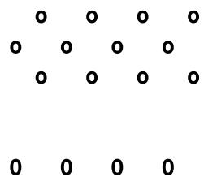
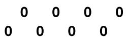

# Chapter 15. JavaScript Functions, Objects, and Arrays

Just like PHP, JavaScript offers access to functions and objects. In JavaScript objects are the primary means for accessing the Document Object Model (DOM), because—as you’ve seen—every element of an HTML document is available to be manipulated as an object.

The usage and syntax are also quite similar to those of PHP, so you should feel right at home as I take you through using functions and objects in JavaScript, as well as through an in-depth exploration of array handling.

## JavaScript Functions

In addition to having access to dozens of built-in functions (or methods), such as log, which you have already seen being used in console.log, you can easily create your own functions. A relatively complex piece of code that is likely to be reused is a candidate for a function.

### Defining a Function

The general syntax for a function is:

```lua
function function_name([parameter [, ...]]) {
    statements
}
```

The first line of the syntax indicates:

A definition starts with the word function.

A name follows that must start with a letter or underscore, followed by any number of letters, digits, dollar signs, or underscores, the same rules as for any other identifier.  
The parentheses are required.  
One or more parameters, separated by commas, are optional (indicated by the square brackets, which are not part of the function syntax).

Like all identifiers in JavaScript, function names are case-sensitive, so all of the following strings refer to different functions: getInput, GETINPUT, and getinput.

JavaScript has a general naming convention for functions: the first letter of each word in a name is capitalized, except for the very first letter, which is lowercase. Therefore, of the previous examples, getInput would be the preferred name used by most programmers. This convention is referred to as camelCase, because the capitalized letters resemble a camel’s humps (or sometimes called bumpyCaps or bumpyCase).

The opening curly brace starts the statements that will execute when you call the function; a matching curly brace must close it. These statements may include one or more return statements, which force the function to cease execution and return to the calling code. If a value is attached to the return statement, the calling code can retrieve it. If a function does not have a return statement it implicitly returns undefined.

**The rest parameter**

With the rest parameter syntax ...params, a function can accept a virtually infinite number of parameters. Take the example of a function called displayItems. Example 15-1 shows one way of writing it, using exactly 5 parameters.

Example 15-1. Defining a function

```vue
<script>
    displayItems("Dog", "Cat", "Pony", "Hamster", "Tortoise")
function displayItems(v1, v2, v3, v4, v5)
{
    console.log(v1)
    console.log(v2)
    console.log(v3)
    console.log(v4)
    console.log(v5)
}
</script>
```

When you call up this script in your browser, it will display the following in the browser console:

```txt
Dog
Cat
Pony
Hamster
Tortoise
```

All of this is fine, but what if you wanted to pass more than five items to the function? Also, reusing the console.log call multiple times instead of employing a loop is wasteful programming. Luckily, the rest parameter syntax ...params, gives you the flexibility to handle a variable number of arguments. You can use any other name, for example ...args; the leading dots ... are the important part of the syntax, not the parameter name.

Inside the function, the rest parameter is available as an array of values passed to the function as parameters when the function is called. Example 15-2 shows how you can use it to rewrite the previous example much more efficiently.

Example 15-2. Modifying the function to use the rest parameter syntax

```txt
<script>
let c = "Car"
```

```vue
displayItems("Bananas", 32.3, c)
function displayItems(...params)
{
    for (j = 0 ; j < params.length ; ++j)
    console.log(params[j])
}
</script>
```

Note the use of the length property, which you encountered in Chapter 14. Also note that I reference the params array using the variable j as an offset into it. And I chose to keep the function short and sweet by not surrounding the contents of the for loop in curly braces, as it contains only a single statement. Remember that because the < operator is used, the loop must stop when j is one less than length, not equal to length.

Using this technique, you now have a function that can take as many (or as few) arguments as you like and act on each argument as you desire.

**The arguments array**

The arguments array is automatically available inside every function and offers a similar way of working with function parameters. Using the array, the displayItems function from Example 15-2 can be written like this:

```javascript
function displayItems()
{
    for (j = 0 ; j < arguments.length ; ++j)
    console.log(arguments[j])
}
```

However, the rest parameter syntax is strongly preferred over the arguments array because the rest parameter is visible when you look at the function parameters, so it’s clear that the function accepts some parameters, unlike when you use the arguments array.

### Returning a Value

Functions are not used just to display things. In fact, they are used mostly to perform calculations or data manipulations and then return a result. The function fixNames in Example 15-3 uses the rest parameter syntax (discussed in “The rest parameter”) to take a series of strings passed to it and return them as a single string. The “fix” it performs is to convert every character in the arguments to lowercase except for the first character of each argument, which is set to a capital letter.

Example 15-3. Cleaning up a full name  
```vue
<script>
console.log(fixNames("the", "DALLAS", "CowBoys"))
function fixNames(...names)
{
    let s = ""
    for (j = 0 ; j < names.length ; ++j)
    s += names[j].charAt(0).toUpperCase() + 
    names[j].substring(1).toLowerCase() + " "
    return s.substring(0, s.length - 1)
}
</script>
```

When called with the parameters the, DALLAS, and CowBoys, for example, the function returns the string The Dallas Cowboys. Let’s walk through the function.

It first initializes the temporary (and local) variable s to the empty string. Then a for loop iterates through each of the passed parameters, isolating the parameter’s first character using the charAt method and converting it to uppercase with the toUpperCase method. The various methods shown in this example are all built into JavaScript and available by default.

Then the substring method is used to fetch the rest of each string, which is converted to lowercase via the toLowerCase method. A fuller version of

the substring method here would specify how many characters are part of the substring as a second argument:

substring(1, (names[j].length) - 1)

In other words, this substring method says, “Start with the character at position 1 (the second character) and return the rest of the string (the length minus one).” As a nice touch, though, the substring method assumes that you want the rest of the string if you omit the second argument.

After the whole argument is converted to the desired case, a space character is added to the end, and the result is appended to the temporary variable s.

Finally, the substring method is used again to return the contents of the variable s, except for the final space—which is unwanted. We remove this by using substring to return the string up to, but not including, the final character.

This example is particularly interesting in that it illustrates the use of multiple properties and methods in a single expression, for example:

names[j].substring(1).toLowerCase()

You have to interpret the statement by mentally dividing it into parts at the periods. JavaScript evaluates these elements of the statement from left to right:

1. Start with the rest parameter names representing an array of fixNames arguments.  
2. Extract element j from the array.  
3. Invoke substring with a parameter of 1 to the extracted element. This passes all but the first character to the next section of the expression.

4. Apply the method toLowerCase to the string that has been passed thus far.

This practice is often referred to as method chaining. So, for example, if the string mixedCASE is passed to the example expression, it will go through the following transformations:

```txt
mixedCASE
ixedCASE
ixedcase
```

In other words, names[j] produces “mixedCASE,” then substring(1) takes “mixedCASE” and produces “ixedCASE,” and finally toLowerCase() takes “ixedCASE” and produces “ixedcase.”

One final reminder: the s variable created inside the function is local and therefore cannot be accessed outside the function. By returning s in the return statement, we made its value available to the caller, which could store or use it any way it wanted. But s itself disappears at the end of the function. Although we could make a function operate on global variables (and sometimes that’s necessary in legacy code for example), it’s much better to just return the values you want to preserve and let JavaScript clean up all the other variables used by the function.

### Returning an Array

In Example 15-3, the function returned only one parameter—but what if you need to return multiple parameters? You can do this by returning an array, as shown in Example 15-4.

Example 15-4. Returning an array of values  
```html
<script>
words = fixNames("the", "DALLAS", "CowBoys")
for (j = 0 ; j < words.length ; ++j)
```

```vue
console.log(words[j])

function fixNames(...names)
{
    let s = []

    for (j = 0 ; j < names.length ; ++j)
    s[j] = names[j].charAt(0).toUpperCase() + names[j].substr(1).toLowerCase()

    return s
}
</script>
```

Here the variable words is automatically defined as an array and populated with the returned result of a call to the function fixNames. Then a for loop iterates through the array and displays each member. You can also use console.log(words) here instead of the for loop to see the full array.

As for the fixNames function, it’s almost identical to Example 15-3, except that the variable s is now an array; after each word has been processed, it is stored as an element of this array, which is returned by the return statement.

This function enables the extraction of individual parameters from its returned values, like the following (the output is simply The Cowboys):

```lua
words = fixNames("the", "DALLAS", "CowBoys")
console.log(words[0] + " " + words[2])
```

## JavaScript Objects

A JavaScript object is more complex than a variable, which can contain only one value at a time. In contrast, objects can contain multiple values and even functions. An object groups data together with the functions needed to manipulate it.

The simplest object you can have in JavaScript is an empty object with no values and no functions. This is how you can create it:

```javascript
const user = {}
console.log(typeof user) // displays "object"
```

Objects created this way are often used to emulate PHP’s associative arrays that JavaScript doesn’t support natively, something we’ll explore later in this chapter.

### Declaring a Class

When writing a code that uses the object-oriented programming approach, you need to design a composite of data and code called a class. Classes should ideally be modeled after real-world items, so you should create different classes for items such as a user, an order, or a cart. Each new object based on such class is called an instance (or occurrence) of that class. As you’ve already seen, the data associated with an object is called its properties, while the functions it uses are called methods.

Let’s look at how to declare the class for an object called User that will contain details about the current user. The class will have three properties, a special method called a constructor (I’ll show later how it’s invoked), and a method to display the data, showUser. Example 15-5 shows the code declaring the class and creating an instance with the new keyword.

Example 15-5. Declaring the  class, its properties and methods, creating an instance

```javascript
<script>
class User {
    constructor(forename, username, timezone) {
    this.forename = forename
    this.username = username
    this.timezone = timezone
    }
```

```vue
showUser() {
    console.log("Forename: " + this.forename)
    console.log("Username: " + this.username)
    console.log("Timezone: " + this.timezone)
}
</script>
```

### Creating an Instance

When you want to work with an instance (or object) of a class, you first need to create it. Here is the line with the new keyword:

```javascript
const user = new User("Fred", "fred303", "UTC")
```

Immediately after creating the instance, the constructor method will be automatically called and the values Fred, fred303, and UTC will be passed to it as the forename, username, and timezone parameters. The constructor is then used to initialize the object properties referencing an object named this, which refers to the instance being created:

```ini
this.forename = forename
this.username = username
this.timezone = timezone
```

The created instance is then assigned to the user variable. The class also contains the showUser method, which will show the values of the object properties in your browser console when called.

You can create multiple instances from the same class by using the new keyword again, possibly passing different values to the constructor, like this:

```javascript
const details = new User("Waldo", "waldo2600", "UTC+2")
```

The naming convention I have used is to start the name of the class itself with a capital letter (User), unlike the instance name (user), which can be different than the class name (for example, details), and keep all properties in lowercase and to use at least one uppercase character in method names, following the camelCase convention mentioned earlier in the chapter.

### Accessing Objects

To access an object, you can refer to its properties, as in the following two unrelated example statements:

```javascript
const name = user.forename
if (user.username === "admin") loginAsAdmin()
```

So, to access the showUser method of an object of class User, you would use the following syntax, in which the object user has already been created and populated with data:

```txt
user.showUser()
```

Assuming the data supplied earlier, this code would display:

```yaml
Forename: Fred
Username: fred303
Timezone: UTC
```

### Static Methods and Properties

When reading about PHP objects, you learned that classes can have static properties and methods as well as properties and methods associated with a particular instance of a class. JavaScript also supports static properties and methods; these are prefixed by the static keyword in the class declaration as you can see in Example 15-6.

Example 15-6. Adding a static property and a static method to the class  
```vue
<script>
class User {
    constructor(forename, username, timezone) {
    this.forename = forename
    this.username = username
    this.timezone = timezone
    }

    static greeting = "Hello";

    showUser() {
    console.log("Forename: " + this.forename)
    console.log("Username: " + this.username)
    console.log("Timezone: " + this.timezone)
    }

    static greet(name) {
    console.log(this.greeting + " " + name)
    }
}
</script>
```

These can be accessed without creating an instance, by referencing the class:

```txt
console.log(User.greeting)
User.greet("Jack")
```

### The Legacy Objects Simulated with Functions

A lot of existing code uses functions to simulate objects and classes seen in the previous sections. I show you the following forms mainly because you are certain to encounter them when perusing other programmers’ code.

When writing a new code, it’s recommended to use the class syntax seen in Example 15-5.

Example 15-7. Declaring the  class using functions

```txt
<script>
    function User(forename, username, timezone)
    {
    this.forename = forename
    this.username = username
    this.timezone = timezone

    this.showUser = function()
    {
    console.log("Forename: " + this.forename)
    console.log("Username: " + this.username)
    console.log("Timezone: " + this.timezone)
    }
    }
    const user = new User("Wolfgang", "w.a.mozart", "UTC+2")
    user.showUser()
</script>
```

Note that there are no class and constructor keywords, the function name serves as the class name, and the User function itself acts similarly to the constructor:

function User(forename, username, timezone)

The User function also emulates methods by storing functions in properties:

this.showUser = function()

Some other existing code also refers to functions defined outside the constructor when setting the method-properties, as in Example 15-8. This approach shouldn’t be used for any new code.

Example 15-8. Separately defining a class and method

```txt
<script>
    function showUser()
    {
    console.log("Forename: " + this.forename)
```

```vue
console.log("Username: " + this.username)
console.log("Timezone: " + this.timezone)
}

function User(forename, username, timezone)
{
    this.forename = forename
    this.username = username
    this.timezone = timezone
    this.showUser = showUser
}
</script>
```

## JavaScript Arrays

Array handling in JavaScript is very similar to PHP, although the syntax is a little different. Nevertheless, given all you have already learned about arrays, this section should be relatively straightforward.

### Arrays

To create a new array, use the following bracket syntax:

```txt
arrayname = []
```

Or you can use the longer form:

```txt
arrayname = new Array()
```

**Assigning element values**

In PHP, you could add a new element to an array by simply assigning it without specifying the element offset, like this:

$arrayname[] = "Element 1";$ $arrayname[] = "Element 2";$

But in JavaScript you use the push method to achieve the same thing:

```lua
arrayname.push("Element 1")
arrayname.push("Element 2")
```

This allows you to keep adding items to an array without having to keep track of the number of items. When you need to know how many elements are in an array, you can use the length property:

```txt
console.log(arrayname.length)
```

Alternatively, if you wish to keep track of the element locations yourself and place them in specific locations, you can use this syntax:

```python
arrayname[0] = "Element 1"
arrayname[1] = "Element 2"
```

Example 15-9 shows a simple script that creates an array, loads it with some values, and then displays them.

Example 15-9. Creating, building, and printing an array

```txt
<script>
    numbers = []
    numbers.push("One")
    numbers.push("Two")
    numbers.push("Three")

    for (j = 0 ; j < numbers.length ; ++j)
    console.log("Element " + j + " = " + numbers[j])
</script>
```

The output from this script is:

```txt
Element 0 = One
```

```ini
Element 1 = Two
Element 2 = Three
```

**Assignment using the array keyword**

You can also create an array together with some initial elements, like this:

```hcl
numbers = ["One", "Two", "Three"]
```

Nothing is stopping you from adding more elements afterward as well.

You’ve now seen a couple of ways you can add items to an array, and one way of referencing them. JavaScript offers many more, which I’ll get to shortly—but first, we’ll look at another type of array.

### Associative Arrays

An associative array is one in which the elements are referenced by name rather than by an integer offset. However, JavaScript doesn’t support such things. Instead, we can achieve a similar result by creating an object with properties that will act the same way.

So, to create an “associative array,” define a block of elements within curly braces. For each element, place the key on the left and the contents on the right of a colon (:). Example 15-10 shows how you might create an “associative array” to hold the contents of the “balls” section of an online sports equipment retailer.

Example 15-10. Creating and displaying an associative array

```vue
<script>
    balls = {golf: "Golf balls, 6",
    tennis: "Tennis balls, 3",
    soccer: "Soccer ball, 1",
    ping: "Ping Pong balls, 1 doz"}
for (const ball in balls)
    console.log(ball + " = " + balls[ball])
</script>
```

I’ve used “associative array” in quotes because we’re actually creating an object, which you can verify with console.log(typeof balls).

To verify that the object has been correctly created and populated, I have used another kind of for loop using the in keyword. This creates a new variable to use only within the loop (ball, in this example) and iterates through all elements of the object to the right of the in keyword (balls, in this example). The loop acts on each element of balls, placing the key value into ball.

Using this property name stored in ball, you can also get the value of the current element of balls. The result of calling up the example script in a browser is:

```txt
golf = Golf balls, 6
tennis = Tennis balls, 3
soccer = Soccer ball, 1
ping = Ping Pong balls, 1 doz
```

To get a specific element of an object, you can specify a key explicitly (in this case, outputting the value Soccer ball, 1):

```txt
console.log(balls.soccer)
```

Or you can use the “array” syntax to access the property, like this:

```javascript
console.log(balls['soccer'])
```

### Multidimensional Arrays

To create a multidimensional (or, more accurately, a nested) array in JavaScript, just place arrays inside other arrays. For example, to create an array to hold the details of a two-dimensional checkerboard (8 × 8 squares), you could use the code in Example 15-11.

```vue
<script>
    checkerboard = [
    [' ', 'o', ' ', 'o', ' ', 'o', ' ', 'o'],
    ['o', ' ', 'o', ' ', 'o', ' ', 'o', ' ],
    [' ', 'o', ' ', 'o', ' ', 'o', ' ', 'o'],
    [' ', ' ', ' ', ' ', ' ', ' ', ' ', ' ],
    [' ', ' ', ' ', ' ', ' ', ' ', ' ', ' ],
    ['0', ' ', '0', ' ', '0', ' ', '0', ' ],
    [' ', '0', ' ', '0', ' ', '0', ' ', '0'],
    ['0', ' ', '0', ' ', '0', ' ', '0', ' ]
]

let s = '';
for (let j = 0 ; j < 8 ; ++j) {
    for (let k = 0 ; k < 8 ; ++k)
    s += checkerboard[j][k] + " "
    s += '\n'
}
console.log(s)
</script>
```

In this example, the lowercase letters represent black pieces, and the uppercase white. A pair of nested for loops walks through the array and builds a string that is then displayed in the console.

The outer loop contains two statements, so curly braces enclose them. The inner loop then processes each square in a row, outputting the character at location [j][k], followed by a space (to square up the printout). This loop contains a single statement, so curly braces are not required to enclose it. The result looks like this:



<details>
<summary>natural_image</summary>

Grid of black dots arranged in four rows and four columns, no text or symbols present
</details>



You can also directly access any element within this array by using square brackets:

console.log(checkerboard[7][2])

This statement outputs the uppercase letter O, the eighth element down and the third along—remember that array indexes start at 0, not 1.

### Using Array Methods

Given the power of arrays, JavaScript comes ready-made with a number of methods for manipulating them and their data. These are almost exclusively used with arrow functions, which will be explained later in this chapter, but we’ll use the regular named functions in the following examples to help you better understand the array methods. Here is a selection of the most useful ones.

**some and every**

When you need to know whether at least one array element matches a certain criterion, you can use the some function, which will test all the elements and automatically stop and return the required value as soon as one matches. When you need to know whether all elements match, you can use every. This saves you from having to write your own code to perform such searches, like this:

```txt
function isBiggerThan10(element)
{
    return element > 10
}

result = [2, 5, 8, 1, 4].some(isBiggerThan10); // result will be false
result = [12, 5, 8, 1, 4].some(isBiggerThan10); // result will be true
```

```javascript
result = [12, 5, 8, 1, 4].every(isBiggerThan10); // result will be false
result = [12, 42, 2600].every(isBiggerThan10); // result will be true
```

**includes**

If you want to know whether an array contains a value, use the includes method:

```javascript
result = [2, 5, 8, 1, 4].includes(7); // result will be false
result = [2, 5, 8, 1, 4].includes(8); // result will be true
result = ['Hello', 'Hi'].includes('Hi'); // result will be true
result = ['Hello', 'Hi'].includes('Bye'); // result will be false
```

**map**

Sometimes, you would like to apply the result of calling a function to all array values. JavaScript offers a map method you can use to return the new array, like this:

```javascript
function add10(element)
{
    return element + 10
}
result = [2, 5, 8, 1, 4].map(add10);
console.log(result) // result is [12, 15, 18, 11, 14]
```

**filter**

You can use the filter method to return a new array that will contain only the elements which, when passed to the provided function, returned true:

```txt
function isBiggerThan10(element)
{
    return element > 10
}

result = [12, 5, 18, 11, 4].filter(isBiggerThan10);
console.log(result) // result is [12, 18, 11]
```

**indexOf**

To find out where an element can be found in an array, you can call the indexOf function on the array, which will return the offset of the located element (starting from 0), or -1 if it is not found. For example, the following gives offset the value 2:

```python
animals = ['cat', 'dog', 'cow', 'horse', 'elephant']
offset = animals.indexOf('cow')
```

**concat**

The concat method concatenates two arrays or a series of values within an array. For example, the following code outputs Banana, Grape, Carrot, Cabbage:

```txt
fruit = ["Banana", "Grape"]
veg = ["Carrot", "Cabbage"]
console.log(fruit.concat(veg))
```

The same can be accomplished with the spread syntax using ... (not to be confused with the rest parameter syntax, which is used only for function parameters), which, when followed by an array name, will be replaced by all array values, as if they were directly written there. The following code outputs the same array as the previous example:

```txt
fruit = ["Banana", "Grape"]
veg = ["Carrot", "Cabbage"]
console.log([...fruit, ...veg])
```

When using concat, you also can specify multiple arrays as arguments, in which case concat adds all their elements in the order that the arrays are specified.

Here’s another way to use concat. This time, plain values are concatenated with the array pets, which outputs Cat, Dog, Fish, Rabbit, Hamster:

```python
pets = ["Cat", "Dog", "Fish"]
more_pets = pets.concat("Rabbit", "Hamster")
console.log(more_pets)
```

**forEach**

The forEach method in JavaScript is another way of achieving functionality similar to the PHP foreach keyword. To use it, you pass it the name of a function, which will be called for each element within the array. Example 15-12 shows how.

Example 15-12. Using the  method  
```vue
<script>
    pets = ["Cat", "Dog", "Rabbit", "Hamster"]
    pets.forEach(output)

    function output(element, index)
    {
    console.log("Element at index " + index + " has the value " + element)
    }
</script>
```

In this case, the function passed to forEach is called output. It takes two parameters: the element and its index. The function may also take a third parameter, array, which contains the array forEach was called upon, but I’ve omitted it as it is unused in this example. All these parameters can be used as required by your function. This example uses and displays just the element and index values using the function console.log.

Once an array has been populated, the method is called, like this:

```txt
pets.forEach(output)
```

This is the output:

```txt
Element at index 0 has the value Cat
Element at index 1 has the value Dog
Element at index 2 has the value Rabbit
Element at index 3 has the value Hamster
```

**join**

With the join method, you can convert all the values in an array to strings and then join them together into one large string, placing an optional separator between them. Example 15-13 shows three ways of using this method.

Example 15-13. Using the  method  
```vue
<script>
    pets = ["Cat", "Dog", "Rabbit", "Hamster"]
    console.log(pets.join())
    console.log(pets.join(' '))
    console.log(pets.join(' : '))
</script>
```

Without a parameter, join uses a comma to separate the elements; otherwise, the string passed to join is inserted between each element. The output of Example 15-13 looks like this:

```txt
Cat, Dog, Rabbit, Hamster
Cat Dog Rabbit Hamster
Cat : Dog : Rabbit : Hamster
```

**push and pop**

You already saw how the push method can be used to insert a value into an array. The inverse method is pop. It removes the last element from an array and returns it. Example 15-14 shows an example of its use.

```vue
<script>
sports = ["Football", "Tennis", "Baseball"]
console.log("Start = " + sports)

sports.push("Hockey")
console.log("After Push = " + sports)

removed = sports.pop()
console.log("After Pop = " + sports)
console.log("Removed = " + removed)

removed = sports.pop()
console.log("After Pop = " + sports)
console.log("Removed = " + removed)
</script>
```

The four main statements of this script are shown in bold type. First, the script creates an array called sports with three elements and then pushes a fourth element into the array. After that, it pops that element back off, and then it pops once more. In the process, the various current values are displayed via console.log. The script outputs the following:

```txt
Start = Football, Tennis, Baseball
After Push = Football, Tennis, Baseball, Hockey
After Pop = Football, Tennis, Baseball
Removed = Hockey
After Pop = Football, Tennis
Removed = Baseball
```

The push and pop functions are useful in situations where you need to divert from some activity to do another and then return. For example, let’s suppose you want to put off some activities until later, while you get on with something more important now. This often happens in real life when we’re going through “to-do” lists, so let’s emulate that in code, with tasks number 2 and 5 in a list of six items being granted priority status, as in Example 15-15.

```txt
<script>
const numbers = []

for (j = 1 ; j < 6 ; ++j) {
    if (j === 2 || j === 5) {
    console.log("Processing 'todo' #" + j)
    }
    else {
    console.log("Putting off 'todo' #" + j + " until later")
    numbers.push(j)
    }
}

console.log("Finished processing the priority tasks.")
console.log("Commencing stored tasks, most recent first.")

console.log("Now processing 'todo' #" + numbers.pop())
console.log("Now processing 'todo' #" + numbers.pop())
console.log("Now processing 'todo' #" + numbers.pop())
</script>
```

Of course, nothing is actually getting processed here, just text being output to the browser, but you get the idea. The output from this example is:

```txt
Putting off 'todo' #1 until later
Processing 'todo' #2
Putting off 'todo' #3 until later
Putting off 'todo' #4 until later
Processing 'todo' #5
Finished processing the priority tasks.
Commencing stored tasks, most recent first.
Now processing 'todo' #4
Now processing 'todo' #3
Now processing 'todo' #1
```

**Using reverse**

The reverse method simply reverses the order of all elements in an array. Example 15-16 shows this in action.

```vue
<script>
sports = ["Football", "Tennis", "Baseball", "Hockey"]
sports.reverse()
console.log(sports)
</script>
```

The original array is modified, and the output from this script is:

Hockey, Baseball, Tennis, Football

**sort**

With the sort method, you can place all the elements of an array in alphabetical order, depending on the parameters used. Example 15-17 shows four types of sort.

Example 15-17. Using the  method

```vue
<script>
    // Alphabetical sort
    sports = ["Football", "Tennis", "Baseball", "Hockey"]
    sports.sort()
    console.log(sports)

    // Reverse alphabetical sort
    sports = ["Football", "Tennis", "Baseball", "Hockey"]
    sports.sort().reverse()
    console.log(sports)
</script>
```

The first of the two example sections uses the default sort method to perform an alphabetical sort, while the second uses the default sort and then applies the reverse method to get a reverse alphabetical sort.

## Anonymous Functions

Some functions do not need a name, because they’re used only once, for example, and coming up with a name would be a waste of time. A function without a name, called an anonymous function, can be used, for example, as a comparison function for sorting arrays with the sort method you’ve already seen in Example 15-17. Let’s take that example but sort the array using a numeric sort this time, which requires an anonymous comparison function. The code is in Example 15-18.

Example 15-18. Using the  method with an anonymous function  
```html
<script>
    // Ascending numeric sort
    numbers = [7, 23, 6, 74]
    numbers.sort(function(a,b){return a - b})
    console.log(numbers)
    // Descending numeric sort
    numbers = [7, 23, 6, 74]
    numbers.sort(function(a,b){return b - a})
    console.log(numbers)
</script>
```

In both cases, the numbers.sort call here uses a function to compare the relationships between a and b. The function doesn’t have a name, because it’s used only in the sort. You have already seen the function named function used to create an anonymous function; we used it to define a method in a class (the showUser method).

Here, function creates an anonymous function meeting the needs of the sort method. If the function returns a value greater than zero, the sort assumes that b comes before a. If the function returns a value less than zero, the sort assumes that a comes before b. The sort runs this function across all the values in the array to determine their order. (Of course, if a and b have the same value, the function returns zero, and it doesn’t matter which value is first.)

By manipulating the value returned (a - b in contrast to b - a), the two sections of Example 15-18 choose between an ascending numerical sort and a descending numerical sort.

## Arrow Functions

The arrow function syntax is a simplified version of the general anonymous function syntax you have just seen. The syntax is very common because it’s short and concise. In the following example, we’ll convert the general anonymous function to use the arrow function syntax. The line with the anonymous function in Example 15-18 looks like this:

numbers.sort(function(a,b){return a - b})

You can remove the function keyword as well as the return keyword and remove the body braces, like this:

numbers.sort((a,b) => a - b)

If the arrow function would have exactly one parameter, you could also omit the parameter parentheses, but that’s not the case here; the function has two parameters, a and b.

And, believe it or not, this represents the end of your introduction to JavaScript. You should now have a core knowledge of the three main technologies covered in this book. Chapter 16 will look at some advanced techniques used across these technologies, such as pattern matching and input validation. But before we continue, let’s try to answer the following questions to repeat the main things you’ve learned in this chapter.

## Questions

1. Are JavaScript functions and variable names case-sensitive or case-insensitive?  
2. How can you write a function that accepts and processes an arbitrary number of parameters?  
3. Describe a way to return multiple values from a function.  
4. When you’re defining a class, what keyword do you use to refer to the current object?  
5. Do all the methods of a class have to be defined within the class definition?  
6. What keyword is used to create an object instance from a class?  
7. How can you create a multidimensional array?  
8. What syntax is used to create an “associative array”?  
9. Write a statement to sort an array of numbers in descending numerical order.

See “Chapter 15 Answers” in the Appendix A for the answers to these questions.