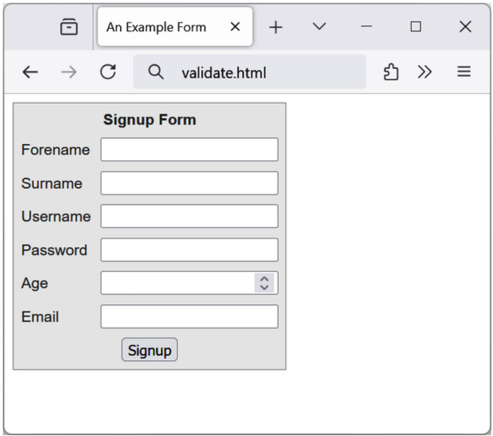
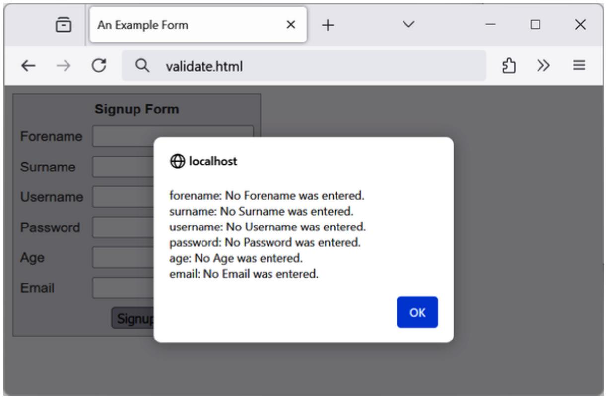
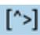
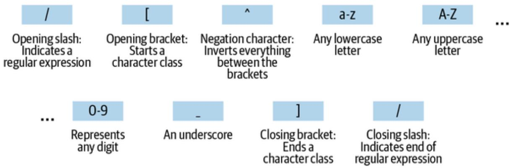
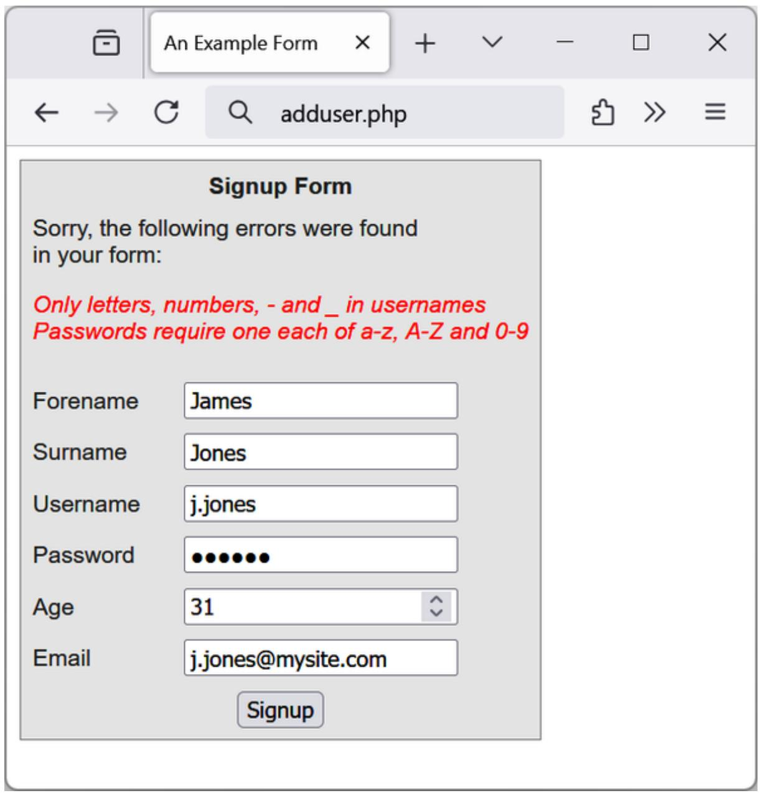

# Chapter 16. JavaScript and PHP Validation and Error Handling

With your solid foundation in both PHP and JavaScript, it’s time to bring these technologies together to create web forms that are as user-friendly as possible.

We’ll be using PHP to create the forms and JavaScript to perform clientside validation to ensure that the data is as complete and correct as it can be before it is submitted. Final validation of the input will then be done by PHP, which will, if necessary, present the form again to the user for further modification.

In the process, this chapter will cover validation and regular expressions in both JavaScript and PHP.

## Validating User Input with JavaScript

JavaScript validation should be considered assistance to your users more than to your websites because, as I have stressed many times, you cannot trust any data submitted to your server, even if it has supposedly been validated with JavaScript. Hackers can quite easily simulate your web forms and submit any data of their choosing.

Another reason you cannot rely on JavaScript to perform all your input validation is that some users disable JavaScript or use browsers that don’t support it.

So, the best types of validation to do in JavaScript are checking that fields have content if they are not to be left empty, ensuring that email addresses conform to the proper format, and ensuring that values entered are within expected bounds.

### The validate.html Document (Part 1)

To keep the code listing easier to follow, this example is split into two parts: the main HTML and associated JavaScript, and the JavaScript functions that get called by the main part. Let’s begin with a general signup form, common on most sites that offer user registration. The inputs requested will be forename, surname, username, password, age, and email address.

Example 16-1 provides a good template for such a form, which you can retrieve from the repo of examples on GitHub. Ensure it is saved as validate.html.

Example 16-1. A form with JavaScript validation (part 1)  
```txt
<!DOCTYPE html>
<html>
<head>
<title>An Example Form</title>
<style>
.signup {
    border: 1px solid #999999;
    font: normal 14px helvetica;
    color: #444444;
    background-color: #eeeeee;
    border-spacing: 5px;
}
 Registration th, .signup td {
    padding: 2px;
}
</style>
</head>
<body>
<form method="post" action="" id="form">
<table class="signup">
<th colspan="2" align="center">Signup Form</th>
<tr><td>Forename</td>
<td><input type="text" maxlength="32" name="forename" required></td>
</tr>
<tr><td>Surname</td>
<td><input type="text" maxlength="32" name="surname" required></td>
</tr>
<tr><td>Username</td>
<td><input type="text" maxlength="16" name="username" required></td>
</tr>
```

```txt
<tr><td>Password</td>
    <td><input type="password" name="password" required></td></tr>
    <tr><td>Age</td>
    <td><input type="number" max="110" name="age" required></td></tr>
    <tr><td>Email</td>
    <td><input type="email" maxlength="64" name="email" required></td>
</tr>
    <tr><td colspan="2" align="center"><input type="submit" value="Signup"></td></tr>
</table>
</form>
<script>
function validateFields(form)
{
    const errors = []
    const elements = {}
    let error = '' 
    for (let element of form.elements)
    elements[element.name] = element.value.trim()

    error = validateForename(elements.forename)
    if (error) errors.push({field: 'forename', message: error})
    error = validateSurname(elements.surname)
    if (error) errors.push({field: 'surname', message: error})
    error = validateUsername(elements.username)
    if (error) errors.push({field: 'username', message: error})
    error = validatePassword(elements.password)
    if (error) errors.push({field: 'password', message: error})
    error = validateAge(elements.age)
    if (error) errors.push({field: 'age', message: error})
    error = validateEmail(elements.email)
    if (error) errors.push({field: 'email', message: error})
    return errors
}

const validate = function(event)
{
    const errors = validateFields(event.target)
    if (errors.length) {
    const alerts = []
    for (error of errors) {
    alerts.push(error.field + ": " + error.message)
    }
    alert(alerts.join("\n"))
    event.preventDefault()
    }
}
```

```html
document.getElementById('form').addEventListener('submit', validate)
</script>
</body>
</html>
```

As it stands, this form will display correctly but will not yet have any JavaScript-based validation, because the main validation functions have not been added. The HTML attributes like required, type="number" and type="email" will provide at least some built-in validation. Even so, save it as validate.html, and when you call it up in your browser, it will look like Figure 16-1.



<details>
<summary>text_image</summary>

An Example Form
← → ↕ validate.html
Signup Form
Forename
Surname
Username
Password
Age
Email
Signup
</details>

Figure 16-1. The output from Example 16-1

Let’s look at how this document is made up. The first few lines set up the document and use a little CSS to make the form look a little less plain. The parts of the document related to JavaScript come next and are shown in bold.

The first part of this example features the HTML for the form, with each field and its name placed within its own row of a table. This is pretty straightforward HTML: it uses correct input types for the age and email fields and adds the required attribute to provide some built-in validation.

Between the <script> and </script> tags lies a function called validateFields that first removes all leading and trailing spaces from all the submitted values by calling the trim method, and it stores the result in the elements “associative array” (in quotes because it’s actually an object). Then it calls up six other functions to validate each of the form’s input fields. We’ll get to these functions shortly. For now I’ll just explain that they return either an empty string if a field validates or an error message if it fails. If an error message is returned, it is added to the errors array as an object together with the input field name. The function then returns the errors array.

The validateFields function is then called in an anonymous function that, if any errors were returned, formats them as "field name: error message", stores them in the alerts array, and eventually uses the alert function to show the error messages to the user, one per line. You could further enhance the anonymous function to, for example, display the error messages below the respective form fields; the validateFields function returns all the information you’d need.

The following line then attaches the anonymous function stored in validate as an event handler (or listener) that’s called when the form is submitted:

The anonymous function receives a parameter I’ve called event, which references the form being submitted in event.target. If the validateFields function returned some errors in the array, besides alerting the messages, we’ll prevent the form values from being submitted to the server by calling the following method on the event object:

event.preventDefault()

If this were omitted, the browser would display the error messages, but then upon closing, the alert pop-up would still submit the form, so the user would have no chance to correct the form data.

As you can see, there’s no JavaScript used within the form’s HTML. Browsers with JavaScript disabled or not available will display the form just fine.

### The validate.html Document (Part 2)

Now we come to Example 16-2, a set of six functions that do the actual form-field validation. I suggest that you type all of this second part and save it in the <script>...</script> section of Example 16-1, which you have saved as validate.html.

Example 16-2. A form with JavaScript validation (part 2)  
```javascript
function validateForename(field)
{
    return (field === "") ? "No Forename was entered." : ""
}

function validateSurname(field)
{
    return (field === "") ? "No Surname was entered." : ""
}

function validateUsername(field)
{
    if (field == "")
    return "No Username was entered."
    else if (field.length < 5)
    return "Usernames must be at least 5 characters."
    else if (/[^a-zA-Z0-9_-]/.test(field))
    return "Only a-z, A-Z, 0-9, - and _ allowed in Usernames."
    return ""
}

function validatePassword(field)
{
    if (field == "")
    return "No Password was entered."
    else if (field.length < 6)
    return "Passwords must be at least 6 characters."
    else if (!/[a-z]/.test(field) || !/[A-Z]/.test(field) ||
    !/[0-9]/.test(field))
    return "Passwords require one each of a-z, A-Z and 0-9."
    return ""
}

function validateAge(field)
{
```

```lua
if (field == "" || isNaN(field))
    return "No Age was entered."
else if (field < 18 || field > 110)
    return "Age must be between 18 and 110."
return ""
}

function validateEmail(field)
{
    return (field === "") ? "No Email was entered." : ""
}
```

We’ll go through each of these functions in turn, starting with validateForename, so you can see how validation works.

**Validating the forename**

validateForename is a short function that accepts the parameter field, which is the value of the forename passed to it by the validate function.

If this value is the empty string, an error message is returned; otherwise, an empty string is returned to signify that no error was encountered.

Remember that spaces are already trimmed in validateFields so even if the user tried to submit a string with leading or trailing spaces, they would be removed before calling validateForename, and the value would be passed to it as an empty string.

Basic check for an empty string is already done by the browser as instructed by the required HTML attribute.

**Validating the surname**

The validateSurname function is almost identical to validateForename in that an error is returned only if the surname supplied was an empty string. I chose not to limit the characters allowed in either of the name fields to allow for possibilities such as non-English and accented characters.

**Validating the username**

The validateUsername function is a little more interesting, because it has a more complicated job. It can allow through only the characters a-z, A-Z, 0-9, \_, and -, and it ensures that usernames are at least five characters long.

The if...else statements commence by returning an error if field has not been filled in. If it’s not the empty string but is fewer than five characters in length, another error message is returned. This also can be done by adding minlength="6" attribute to the input’s HTML instead.

Then the JavaScript test method is called, passing a regular expression (which matches any character that is not one of those allowed) to be matched against field (see “Regular Expressions”). If even one character that isn’t one of the acceptable characters is encountered, the test function returns true, and so validateUser returns an error string. A pattern HTML attribute can be added to the input, which can do the same check in pure HTML, but it’s error message may not be clear to some users.

**Validating the password**

Similar techniques are used in the validatePassword function. First the function checks whether field is empty, and if it is, it returns an error. Next, an error message is returned if the password is shorter than six characters.

One of the requirements we’re imposing on passwords is that they must have at least one each of a lowercase, uppercase, and numerical character, so the test function is called three times, once for each of these cases. If any one of these calls returns false, one of the requirements was not met, and so an error message is returned. Otherwise, the empty string is returned to signify that the password was OK.

The same HTML attributes (minlength, pattern) can also be used in this case.

**Validating the age**

validateAge returns an error message if field is not a number (determined by a call to the isNaN function) or if the age entered is lower than 18 or greater than 110. Your applications may well have different or no age requirements. Again, upon successful validation, the empty string is returned.

Entering numbers and the range is also enforced by the browser itself using the type="number" and $\mathsf { m } \mathsf { a x } \mathsf { = } ^ { \mathsf { m } } \mathsf { 1 } \mathsf { 1 } \mathsf { 0 } ^ { \mathsf { 1 } \mathsf { 1 } }$ HTML attributes. You could also add $m i n = " 1 8 "$ but you’d need to explain the allowed range directly in the form, which I have not done here for brevity; otherwise, users would be wondering why they cannot enter numbers less than min. If adding HTML attributes, make sure the range is the same as the range checked in JavaScript, similar to other attributes like minlength for example.

**Validating the email**

In the last example, the value is validated with validateEmail. Validating email addresses can be a difficult task: did you, for example, know that the plus sign (+) is a valid character of the username part? Addresses like foo+bar@example.com (and more) are valid email addresses, and it’s not recommended you try to validate them with your own code. We’ll check only for empty strings but leave the address format check on the browser’s built-in validation of the <input type="email"> field.

Figure 16-2 shows the result of the user clicking the Signup button without having completed any fields.



<details>
<summary>text_image</summary>

An Example Form
← → O  validate.html
Signup Form
Forename
Surname
Username
Password
Age
Email
localhost
forename: No Forename was entered.
surname: No Surname was entered.
username: No Username was entered.
password: No Password was entered.
age: No Age was entered.
email: No Email was entered.
OK
</details>

Figure 16-2. JavaScript form validation in action

**Using a separate JavaScript file**

Of course, because they are generic in construction and could apply to many types of validations you might require, these six functions make ideal candidates for moving out into a separate JavaScript file. You could name the file something like validate\_functions.js and include it right after the initial script section in Example 16-1, using the following statement:

```txt
<script src="validate_functions.js"></script>
```

## Regular Expressions

Let’s look a little more closely at the pattern matching we have been doing. We’ve achieved it using regular expressions, which are supported by both JavaScript and PHP. They make it possible to construct powerful patternmatching algorithms within a single expression.

### Matching Through Metacharacters

Regular expressions normally must be enclosed in slashes. Within these slashes, certain characters have special meanings; they are called metacharacters. For instance, an asterisk (\*) has a meaning similar to what you have seen if you’ve used a shell or Windows command prompt (but not quite the same). An asterisk means “The text you’re trying to match may have any number of the preceding characters—or none at all.”

For instance, let’s say you’re looking for the name Le Guin and know that someone might spell it with or without a space. Because the text is laid out strangely (for instance, someone may have inserted extra spaces to rightjustify lines), you could have to search for a line such as this:

The difficulty of classifying Le Guin's works

So you need to match LeGuin, as well as Le and Guin separated by any number of spaces. The solution is to follow a space with an asterisk:

/Le \*Guin/

There’s a lot more than the name Le Guin in the line, but that’s OK. As long as the regular expression matches some part of the line, the test function returns a true value. What if it’s important to make sure the line contains nothing but Le Guin? I’ll show you how to ensure that later.

Suppose that you know there is always at least one space. In that case, you could use the plus sign (+), because it requires at least one of the preceding expressions to be present:

/Le +Guin/

### Wildcard Matching

The dot (.) is particularly useful, because it can match anything except a newline. Suppose you are looking for HTML tags, something that generally shouldn’t be done with regular expressions unless you want to do a quick and naive “pseudo-parsing” of HTML. Or unless, of course, you want to learn regular expressions, as HTML provides a lot of opportunities to showcase the usage.

**DO NOT PARSE HTML WITH REGULAR EXPRESSIONS**

You can almost always construct valid HTML that will defeat your regular expression because regular expressions in general are not sufficient to completely parse HTML. This answer to a question posted on StackOverflow explains the details.

To parse HTML, you should use a full-featured parser like the one available in the loadHTML method of PHP’s DOMDocument class.

HTML tags start with < and end with >. A simple way to find them is shown here:

$$
/ <  . ^ {*} > /
$$

The dot matches any character, and the \* expands it to match zero or more characters, so this is saying, “Match anything that lies between < and >, even if there’s nothing.” You will match <>, <em>, <br>, and so on. But if you don’t want to match the empty case, <>, you should use + instead of \*, like this:

$$
/ <  . + > /
$$

The plus sign expands the dot to match one or more characters, saying, “Match anything that lies between < and > as long as there’s at least one character between them.” You will match <em> and </em>, <h1> and </h1>, and tags with attributes, such as:

```txt
<a href="www.mozilla.org">
```

Unfortunately, the plus sign keeps on matching the last > on the line, so you might end up with this:

```erb
<h1><b>Introduction</b></h1>
```

That’s a lot more than one tag! I’ll show a better solution later in this section.

**NOTE**

If you use the dot on its own between the angle brackets, without following it with either a + or \*, then it matches a single character; you will match <b> and <i> but not <em> or <textarea>.

If you want to match the dot character itself (.), you have to escape it by placing a backslash (\) before it, because otherwise it’s a metacharacter and matches anything. For example, suppose you want to match the floatingpoint number 5.0. The regular expression is:

```txt
/5\.0/
```

The backslash can escape any metacharacter, including another backslash (in case you’re trying to match a backslash in text). However, you’ll see later how backslashes sometimes give the following character a special meaning, which can be a bit confusing.

We just matched a floating-point number. But perhaps you want to match 5. as well as 5.0, because both mean the same thing as a floating-point number. You also want to match 5.00, 5.000, and so forth—any number of zeros is allowed. You can do this by adding an asterisk, as you’ve seen:

```txt
/5\.0*/
```

### Grouping Through Parentheses

Suppose you want to match powers of increments of units, such as kilo, mega, giga, and tera. In other words, you want all the following to match:

```csv
1,000
1,000,000
1,000,000,000
1,000,000,000,000
...
```

The plus sign works here, too, but you need to group the string ,000 so the plus sign matches the whole thing. The regular expression is:

```txt
/1(,000)+ /
```

The parentheses mean “Treat this as a group when you apply something such as a plus sign.” Strings like 1,00,000 and 1,000,00 won’t match because the text must have a 1 followed by one or more complete groups of a comma followed by three zeros.

The space after the + character indicates that the match must end when a space is encountered. Without it, 1,000,00 would incorrectly match because only the first 1,000 would be taken into account, and the remaining ,00 would be ignored. Requiring a space afterward ensures that matching will continue right through to the end of a number. If the number can also be followed by a full stop (.), not just by a space, like for example at the

end of the sentence, you’d need to allow the full stop to also end the search using character classes.

### Character Classes

Sometimes you want to match something fuzzy but not so broadly that you want to use a dot. Fuzziness is the great strength of regular expressions: they allow you to be as precise or vague as you want.

One of the key features supporting fuzzy matching is the pair of square brackets, []. It matches a single character, like a dot, but inside the brackets you put a list of things that can match. If any of those characters appears, the text matches. For instance, if you wanted to match both the American spelling gray and the British spelling grey, you could specify:

$/ { \mathfrak { g r } } [ { \mathfrak { a e } } ] { \mathfrak { y } } /$

After the gr in the text you’re matching, there can be either an a or an e. But there must be only one of them: whatever you put inside the brackets matches exactly one character. The group of characters inside the brackets is called a character class.

### Indicating a Range

Inside the brackets, you can use a hyphen (-) to indicate a range. One very common task is matching a single digit, which you can do with a range, as follows:

/[0-9]/

Digits are such a common item in regular expressions that a single character is provided to represent them: \d. You can use it in place of the bracketed regular expression to match a digit:

/\d/

### Negation

One other important feature of the square brackets is negation of a character class. You can turn the whole character class on its head by placing a caret (^) after the opening bracket. Here it means “Match any characters except the following.” So let’s say you want to find instances of Yahoo that lack the following exclamation point. (The name of the company officially contains an exclamation point!) You could do it like this:

/Yahoo[^!]/

The character class consists of a single character—an exclamation point— but it is inverted by the preceding ^. This is actually not a great solution to the problem—for instance, it fails if Yahoo is at the end of the line, because then it’s not followed by anything, whereas the brackets must match a character. A better solution involves negative lookahead (matching something that is not followed by anything else), but that’s beyond the scope of this book, so please refer to the Regular Expressions website, which shows how to apply negative lookahead for a regex in any language.

### Some More Complicated Examples

With an understanding of character classes and negation, you’re ready to see a better solution to the problem of matching an HTML tag. This solution avoids going past the end of a single tag but still matches tags such as <em> and </em> as well as tags with attributes such as:

<a href="www.mozilla.org">

Here is one solution:

$$
/ <   [ ^ {>} ] + > /
$$

That regular expression may look like a cat just sauntered across the keyboard, but it is perfectly valid and very useful. Let’s break it apart.

Figure 16-3 shows the various elements, which I’ll describe one by one.


Opening slash: indicatesa regularexpression


Opening bracket ofHTMLtag: Matched exactly



Characterclass: Matchanything except aclosing anglebracket


Metacharacter: Any#of characters can match the[>]


Closing bracket ofHTMLtag: Matched exactly


Closing slash: Indicates end of regular expression

Figure 16-3. Breakdown of a typical regular expression

The elements are:

/

Opening slash that indicates this is a regular expression.

<

Opening bracket of an HTML tag. This is matched exactly; it’s not a metacharacter.

[^>]

Character class. The embedded ^> means “Match anything except a closing angle bracket.”

+

Allows any number of characters to match the previous [^>], as long as there is at least one of them.

>

Closing bracket of an HTML tag. This is matched exactly.

/

Closing slash that indicates the end of the regular expression.

**NOTE**

Another solution to the problem of matching HTML tags is to use a nongreedy operation. By default, pattern matching is greedy, returning the longest match possible. Nongreedy (or lazy) matching finds the shortest possible match. Its use is beyond the scope of this book, but there are more details on the JavaScript.info website.

We’ll look now at one of the expressions from Example 16-1, where the validateUsername function is used:

```txt
/[^a-zA-Z0-9_-]/
```

Figure 16-4 shows the various elements.  


<details>
<summary>flowchart</summary>

```mermaid
graph TD
  A["/"] --> B["Opening slash: Indicates a regular expression"]
  C["["]] --> D["Opening bracket: Starts a character class"]
  E["^"] --> F["Negation character: Inverts everything between the brackets"]
  G["a-Z"] --> H["Any lowercase letter"]
  I["A-Z"] --> J["Any uppercase letter"]
  K["..."] --> L["0-9 Represents any digit"]
  M["-"] --> N["An underscore"]
  O[]] --> P["Closing bracket: Ends a character class"]
  Q["/"] --> R["Closing slash: Indicates end of regular expression"]
```
</details>

Figure 16-4. Breakdown of the  regular expression

Let’s look at these elements in detail:

/

Opening slash that indicates this is a regular expression.

Opening bracket that starts a character class.

^

Negation character: inverts everything else between the brackets.

a-z

Represents any lowercase letter.

A-Z

Represents any uppercase letter.

0-9

Represents any digit.

An underscore.

A dash.

]

Closing bracket that ends a character class.

/

Closing slash that indicates the end of the regular expression.

Two other important metacharacters “anchor” a regular expression by requiring that it appear in a particular place. If a caret (^) appears at the beginning of the regular expression, the expression has to appear at the beginning of a line of text; otherwise, it doesn’t match. Similarly, if a dollar sign (\$) appears at the end of the regular expression, the expression has to appear at the end of a line of text.

**NOTE**

It may be somewhat confusing that ^ can mean “negate the character class” inside square brackets and “match the beginning of the line” if it’s at the beginning of the regular expression. Unfortunately, the same character is used for two different purposes, so take care when using it.

We’ll finish our exploration of regular expression basics by answering a question raised earlier: suppose you want to make sure there is nothing extra on a line besides the regular expression? What if you want a line that has “Le Guin” and nothing else? We can do that by amending the earlier regular expression to anchor the two ends:

/^Le \*Guin\$/

### Summary of Metacharacters

Table 16-1 shows the metacharacters available in regular expressions.

Table 16-1. Regular expression metacharacters

<table><tr><td>Metacharacters</td><td>Description</td></tr><tr><td>/</td><td>Begins and ends the regular expression</td></tr><tr><td>.</td><td>Matches any single character except the newline</td></tr><tr><td>element*</td><td>Matches element zero or more times</td></tr><tr><td>element+</td><td>Matches element one or more times</td></tr><tr><td>element?</td><td>Matches element zero or one times</td></tr><tr><td>[characters]</td><td>Matches a character out of those contained within the brackets</td></tr><tr><td>[^characters]</td><td>Matches a single character that is not contained within the brackets</td></tr><tr><td>(regex)</td><td>Treats the regex as a group for counting or a following *, +, or ?</td></tr><tr><td>left|right</td><td>Matches either left or right</td></tr><tr><td>[l-r]</td><td>Matches a range of characters between l and r</td></tr><tr><td>^</td><td>Requires match to be at the string's start</td></tr><tr><td>$</td><td>Requires match to be at the string's end</td></tr><tr><td>\b</td><td>Matches a word boundary</td></tr><tr><td>\B</td><td>Matches where there is not a word boundary</td></tr><tr><td>\d</td><td>Matches a single digit</td></tr><tr><td>\D</td><td>Matches a single nondigit</td></tr><tr><td>\n</td><td>Matches a newline character</td></tr><tr><td>\s</td><td>Matches a whitespace character</td></tr><tr><td>\s</td><td>Matches a nonwhitespace character</td></tr><tr><td>\t</td><td>Matches a tab character</td></tr><tr><td>\w</td><td>Matches a word character (a-z, A-Z, 0-9, and_)</td></tr><tr><td>\w</td><td>Matches a nonword character (anything but a-z, A-Z, 0-9, and_)</td></tr><tr><td>\x</td><td>Matches x (useful if x is a metacharacter, but you really want x)</td></tr><tr><td>{n}</td><td>Matches exactly n times</td></tr><tr><td>{n,}</td><td>Matches n times or more</td></tr><tr><td>{min,max}</td><td>Matches at least min and at most max times</td></tr></table>

Provided with this table, and looking again at the expression $/ [ \negmathsf { a } \cdot \mathsf { z A } \cdot \mathsf { Z } \Theta \cdot$ - $9 \_ ] / ,$ , you can see that it could easily be shortened to $/ [ \curvearrowright ] w ] /$ because the single metacharacter $\backslash w$ (with a lowercase w) specifies the characters a-z, A-Z, 0-9, and \_.

In fact, we can be even more clever than that, because the metacharacter $\backslash \mathsf { W }$ (with an uppercase W) specifies all characters except for a-z, A-Z, 0-9, and \_. Therefore, we could also drop the ^ metacharacter and simply use

/[\W]/ for the expression, or go a step further and drop the square brackets, as in /\W/, because it’s a single character.

To give you more ideas of how this all works, Table 16-2 shows a range of expressions and the patterns they match.

Table 16-2. Some example regular expressions

<table><tr><td>Example</td><td>Matches</td></tr><tr><td>r</td><td>The first r in The quick brown</td></tr><tr><td>rec[ei][ei]ve</td><td>Either of receive or recieve (but also receeve or reciive)</td></tr><tr><td>rec[ei]{2}ve</td><td>Either of receive or recieve (but also receive or reciive)</td></tr><tr><td>rec(ei|ie)ve</td><td>Either of receive or recieve (but not receive or reciive)</td></tr><tr><td>cat</td><td>The word cat in I like cats and dogs</td></tr><tr><td>cat|dog</td><td>The word cat in I like cats and dogs (matches either cat or dog, whichever is encountered first)</td></tr><tr><td>\.</td><td>. (the \ is necessary because . is a metacharacter)</td></tr><tr><td>5\.0*</td><td>5., 5.0, 5.00, 5.000, etc.</td></tr><tr><td>[a-f]</td><td>Any of the characters a, b, c, d, e, or f</td></tr><tr><td>cats$</td><td>Only the final cats in My cats are friendly cats</td></tr><tr><td>^my</td><td>Only the first my in my cats are my pets</td></tr><tr><td>\d{2,3}</td><td>Any two- or three-digit number (00 through 999)</td></tr><tr><td>7(,000)+</td><td>7,000; 7,000,000; 7,000,000,000; 7,000,000,000,000; etc.</td></tr><tr><td>[\w]+</td><td>Any word of one or more characters</td></tr><tr><td>[\w]{5}</td><td>Any five-letter word</td></tr></table>

### General Modifiers

Some additional modifiers are available for regular expressions:

/g enables global matching. When using a replace function, specify this modifier to replace all matches, rather than only the first one.  
/i makes the regular expression match case-insensitive. Thus, instead of $/ [ \mathsf { a } - \mathsf { z A } - \mathsf { Z } ] /$ , you could specify $/ [ a - z ] / \dot { \bf 1 }$ or /[A-Z]/i.  
/m enables multiline mode, in which the caret (^) and dollar sign (\$) match before and after any newlines in the subject string. Normally, in a multiline string, ^ matches only at the start of the string, and \$ matches only at the end of the string.

For example, the expression $/ { \mathsf { c a t s } } / { \mathsf { g } }$ will match both occurrences of the word cats in the sentence “I like cats, and cats like me.” Similarly, $/ \mathsf { d o g s } / \mathsf { g i }$ will match both occurrences of the word dogs (Dogs and dogs) in the sentence “Dogs like other dogs,” because you can use these specifiers together.

### Using Regular Expressions in JavaScript

In JavaScript, you will use regular expressions mostly in three methods: test (which you have already seen), match, and replace. Whereas test just tells you whether its argument matches the regular expression, the match method returns the result of matching a string against a regular expression passed as an argument, or null if no match is found.

The following line will try to find whether the sky was cloudy using both possible spellings of the color:

When using match, you can also pass the regular expression as a string enclosed in quotes, not in slashes:

console.log("The sky was grey".match("gr[ae]y"))

The replace method takes a second parameter: the string to replace the text that matches. Like most functions, replace generates a new string as a return value; it does not change the input.

To compare the test and replace methods, the following statement just returns true to let us know that the word cats appears at least once somewhere within the string:

console.log(/cats/i.test("Cats are funny. I like cats."))

But the following statement replaces both occurrences of the word cats with the word dogs, printing the result. The search has to be global (/g) to find all occurrences and case-insensitive (/i) to find the capitalized Cats:

console.log("Cats are friendly. I like cats.".replace(/cats/gi,"dogs"))

If you try out the statement, you’ll see a limitation of replace: because it replaces text with exactly the string you tell it to use, the first word Cats is replaced by dogs instead of Dogs.

### Using Regular Expressions in PHP

The most common regular expression functions that you are likely to use in PHP are preg\_match, preg\_match\_all, and preg\_replace.

To test whether the word cats appears anywhere within a string, in any combination of upper- and lowercase, you could use preg\_match like this:

```txt
$n = preg_match("/cats/i", "Cats are crazy. I like cats.");
```

The function returns 1 if the match was found, 0 if it wasn’t, and FALSE on failure. Because the word cats is in the tested string, the preceding statement sets \$n to 1. The first argument is the regular expression, and the second is the text to match. But preg\_match is actually a good deal more powerful and complicated, because it takes a third argument that shows what text matched:

```javascript
\(n = preg_match("/cats/i", "Cats are curious. I like cats.", \(match\));
echo "\(n Matches: \(match[0]\);
```

The third argument is an array (here, given the name \$match). The function puts the matching text into the first element, so if the match is successful, you can find the text that matched in \$match[0]. In this example, the output lets us know that the matched text was capitalized:

**1 Matches: Cats**

If you wish to locate all matches, you use the preg\_match\_all function, like this:

```txt
\(n = preg_match_all("/cats/i", "Cats are strange. I like cats.", \(match\));
echo "\(n Matches: ";
for (\(j=0 ; \)j < \(n ; ++j) echo \(match[0][\$j]." ";
```

As before, \$match is passed to the function, and the element \$match[0] is assigned the matches made but this time as a subarray. To display the subarray, this example iterates through it with a for loop.

When you want to replace part of a string, you can use preg\_replace, as shown here. This example replaces all occurrences of the word cats with the word dogs, regardless of case:

**NOTE**

The subject of regular expressions is a large one, and entire books have been written about it. If you would like more information, I suggest the Wikipedia entry or Regular-Expressions.info, and I would also recommend the MDN documentation. Also remember that while regular expressions are a useful tool, they should not be used as a general solution to all string-related problems.

## Redisplaying a Form After PHP Validation

OK, back to form validation. So far we’ve created the HTML document validate.html, which will post through to the PHP program adduser.php, but only if JavaScript validates the fields or if JavaScript is disabled or unavailable.

So now it’s time to add PHP code to do its own validation and then present the form again to the visitor if the validation fails. There’s no need to create the form HTML again; you’re supposed to rename (or copy) the validate.html file to adduser.php and continue in that file.

Example 16-3 contains the code that you should type and save (or download from the GitHub repository); the part with the bold typeface is the PHP we’re adding. The form toward the end of the file is almost the same—only the error message output and the value attributes have been added.

**NOTE**

The reason for first creating validate.html and then renaming it to adduser.php is to have two different filenames for each of the stages in case you downloaded the files from the GitHub repository.

```php
<?php // adduser.php

// The PHP functions
function validate_forename($field)
{
    return ($field == '') ? 'No Forename was entered': '';
}

function validate_surname($field)
{
    return ($field == '') ? 'No Surname was entered' : '';
}

function validate_username($field)
{
    if ($field == '')
    return 'No Username was entered';
    else if (strlen($field) < 5)
    return 'Usernames must be at least 5 characters';
    else if (preg_match('/[^a-zA-Z0-9_-]/', $field))
    return 'Only letters, numbers, - and _ in usernames';
    return '';
}

function validate_password($field)
{
    if ($field == '')
    return 'No Password was entered';
    else if (strlen($field) < 6)
    return 'Passwords must be at least 6 characters';
    else if (!preg_match('/[a-z]/', $field)
    || !preg_match('/[A-Z]/', $field)
    || !preg_match('/[0-9]/', $field))
    return 'Passwords require one each of a-z, A-Z and 0-9';
    return '';
}

function validate_age($field)
{
    if ($field == '')
    return 'No Age was entered';
    else if ($field < 18 || $field > 110)
    return 'Age must be between 18 and 110';
```

```txt
return '';
}

function validate_email($field)
{
    if ($field == '')
    return 'No Email was entered';
    else if (!filter_var($field, FILTER_VALIDATE_EMAIL))
    return 'The Email address is invalid';
    return '';
}
```

// The PHP code  
$forename_html_entities = '';$ $surname_html_entities = '';$ $username_html_entities = '';$ $password_html_entities = '';$ $age_html_entities = '';$ $email_html_entities = '';$ $errors = $values =[]$ ;  
if (\$\_POST) { foreach (\$\_POST as \$name => \$value) \$values[\$name] = trim(\$value);

$error$ = validate_forename( $values['forename']$ );
if ( $error$ ) $errors['forename']$ = $error$ ; $error$ = validate_forename( $values['forename']$ );
if ( $error$ ) $errors['forename']$ = $error$ ; $error$ = validate_surname( $values['surname']$ );
if ( $error$ ) $errors['surname']$ = $error$ ; $error$ = validate_username( $values['username']$ );
if ( $error$ ) $errors['username']$ = $error$ ; $error$ = validate_password( $values['password']$ );
if ( $error$ ) $errors['password']$ = $error$ ; $error$ = validate_age( $values['age']$ );
if ( $error$ ) $errors['age']$ = $error$ ; $error$ = validate_email( $values['email']$ );
if ( $error$ ) $errors['email']$ = $error$ ;  
if (!\$errors) { /\*

This is where you would enter the posted fields into a database, reading the \$values array， using password\_hash for the password, then redirecting to a success page.

For example:

```vue
stmt = $pdo->prepare('INSERT INTO users VALUES(:fn, :sn, :un, :pw)');
stmt->execute([
    ':fn' => $values['forename'],
    ':sn' => $values['surname'],
    ':un' => $values['username'],
    ':pw' => password_hash($values['forename'], PASSWORD_DEFAULT)
]);
header('Location: success.php');
exit;

We'll simplify it and just output the data:
*/
echo "<html><body>Form data successfully validated<pre>";
echo hmlentities(print_r($values, true));
echo "</pre></body></html>";
exit;
}

// To echo the values back to the form when validation fails
$forename_html_entities = hmlentities($_POST['forename']);
$surname_html_entities = hmlentities($_POST['surname']);
$username_html_entities = hmlentities($_POST['username']);
$password_html_entities = hmlentities($_POST['password']);
$age_html_entities = hmlentities($_POST['age']);
$email_html_entities = hmlentities($_POST['email']);
}

// The HTML/JavaScript section
?>
<!DOCTYPE html>
<html>
<head>
<title>An Example Form</title>
<style>
 Biagup {
    border: 1px solid #999999;
    font: normal 14px helvetica;
    color: #444444;
    background-color: #eeeeee;
    border-spacing: 5px;
}
 Biagup th, .signup td {
    padding: 2px;
}
.error {
    color: red;
}
</style>
```

```php
</head>
<body>
<form method="post" action="" id="form">
<table class="signup">
<th colspan="2" align="center">Signup Form</th>

<?php if ($errors) { ?>
<tr><td colspan="2">Sorry, the following errors were found<br>in your form:
<p><i class="error">
<?php foreach ($errors as $error) echo htmlentities($error) .'<br>'; ?>
</i></p>
</td></tr>
<?php }?>

<tr><td>Forename</td>
<td><input type="text" maxlength="32" name="forename" required value="<?php echo $forename_html_entities; ?>"></td></tr>
<tr><td>Surname</td>
<td><input type="text" maxlength="32" name="surname" required value="<?php echo $surname_html_entities; ?>"></td></tr>
<tr><td>Username</td>
<td><input type="text" maxlength="16" name="username" required value="<?php echo $username_html_entities; ?>"></td></tr>
<tr><td>Password</td>
<td><input type="password" name="password" required value="<?php echo $password_html_entities; ?>"></td></tr>
<tr><td>Age</td>
<td><input type="number" max="110" name="age" required value="<?php echo $age_html_entities; ?>"></td></tr>
<tr><td>Email</td>
<td><input type="email" maxlength="64" name="email" required value="<?php echo $email_html_entities; ?>"></td></tr>
<tr><td colspan="2" align="center"><input type="submit" value="Signup"></td></tr>
</table>
</form>
<script>
function validateForename(field)
{
    return (field === "") ? "No Forename was entered." : ""
}

function validateSurname(field)
{
    return (field === "") ? "No Surname was entered." : ""
}
```

```javascript
function validateUsername(field)
{
    if (field == "")
    return "No Username was entered."
    else if (field.length < 5)
    return "Usernames must be at least 5 characters."
    else if (/[^a-zA-Z0-9_]/.test(field))
    return "Only a-z, A-Z, 0-9, - and _ allowed in Usernames."
    return ""
}

function validatePassword(field)
{
    if (field == "")
    return "No Password was entered."
    else if (field.length < 6)
    return "Passwords must be at least 6 characters."
    else if (!/[a-z]/.test(field) || !/[A-Z]/.test(field) ||
    !/[0-9]/.test(field))
    return "Passwords require one each of a-z, A-Z and 0-9."
    return ""
}

function validateAge(field)
{
    if (field == "" || isNaN(field))
    return "No Age was entered."
    else if (field < 18 || field > 110)
    return "Age must be between 18 and 110."
    return ""
}

function validateEmail(field)
{
    return (field === "") ? "No Email was entered." : ""
}

function validateFields(form)
{
    const errors = []
    const elements = {}
    let error = ""

    for (let element of form.elements)
    elements[element.name] = element.value.trim()

    error = validateForename(elements.forename)
```

```txt
if (error) errors.push({field: 'forename', message: error})
    error = validateSurname(elements.surname)
    if (error) errors.push({field: 'surname', message: error})
    error = validateUsername(elements.username)
    if (error) errors.push({field: 'username', message: error})
    error = validatePassword(elements.password)
    if (error) errors.push({field: 'password', message: error})
    error = validateAge(elements.age)
    if (error) errors.push({field: 'age', message: error})
    error = validateEmail(elements.email)
    if (error) errors.push({field: 'email', message: error})
    return errors
}

const validate = function(event)
{
    const errors = validateFields(event.target)
    if (errors.length) {
    const alerts = []
    for (error of errors) {
    alerts.push(error.field + ": " + error.message)
    }
    alert(alerts.join("\n"))
    event.preventDefault()
    }
}
document.getElementById('form').addEventListener('submit', validate)
</script>
</body>
</html>
```

**NOTE**

In this example, the input is only trimmed before inserting it into the database; one exception is the password, which is hashed, as there’s no need to sanitize the data against SQL injection attacks when placeholders and prepared statements are used in database queries.

When the form is redisplayed after it has been submitted with errors, and the submitted values are echoed back to the respective input fields, the sanitized values (suffixed with \_html\_entities) are used to prevent XSS attacks, but these sanitized values are not used for anything else.

For the email address, we’ve used the built-in validation provided by type="email" input when validating the email address in the browser. PHP also has a built-in email address validation, as used in the example:

filter\_var(\$field, FILTER\_VALIDATE\_EMAIL)

When called with the FILTER\_VALIDATE\_EMAIL second parameter, the filter\_var function returns the address (passed here as \$field) if it’s valid, or FALSE when \$field is an invalid email address. Again, this much easier and safer than writing the email address check yourself.

The result of submitting the form with JavaScript disabled (and two fields incorrectly completed) is shown in Figure 16-5.

I have highlighted the PHP section of this code (and changes to the HTML section) in bold so that you can more clearly see the difference between this and Examples 16-1 and 16-2.



<details>
<summary>text_image</summary>

An Example Form
+
-
+
adduser.php
≡
Signup Form
Sorry, the following errors were found
in your form:
Only letters, numbers, - and _ in usernames
Passwords require one each of a-z, A-Z and 0-9
Forename James
Surname Jones
Username j.jones
Password ••••••••
Age 31
Email j.jones@mysite.com
Signup
</details>

Figure 16-5. The form as represented after PHP validation fails

Now that you’ve seen how to bring PHP, HTML, and JavaScript together, Chapter 17 will introduce Ajax (Asynchronous JavaScript and XML), which uses JavaScript calls to the server in the background to seamlessly update portions of a web page, without having to resubmit the entire page to the web server. But first, to better remember what you’ve learned, let’s try to answer all the following questions.

## Questions

1. What DOM event can you use to send a form for validation prior to submitting it?  
2. What JavaScript method is used to test a string against a regular expression?  
3. Write a regular expression to match any characters that are not in a word, as defined by regular expression syntax.  
4. Write a regular expression to match either of the words fox or fix.  
5. Write a regular expression to match any single word followed by any nonword character.  
6. Using regular expressions, write a JavaScript function to test whether the word fox exists in the string The quick brown fox.  
7. Using regular expressions, write a PHP function to replace all occurrences of the word the in The cow jumps over the moon with the word my.  
8. What HTML attribute is used to precomplete form fields with a value?

See “Chapter 16 Answers” in the Appendix A for the answers to these questions.