# Chapter 17. Using Asynchronous Communication

The term Ajax was first coined in 2005. It stands for Asynchronous JavaScript and XML, which, in simple terms, means using a set of methods built into JavaScript to transfer data between the browser and a server in the background. This term has now been mostly abandoned in favor of simply talking about asynchronous communication, and one of the reasons is that these days, programmers are more likely to use JavaScript Object Notation (JSON) as their preferred data-interchange format, as it’s a simple subset of JavaScript.

An excellent example of this technology is Google Maps (although there are numerous others), in which new sections of a map are downloaded from the server when needed, without requiring a page refresh.

Using asynchronous communication not only substantially reduces the amount of data that must be sent back and forth but also makes web pages seamlessly dynamic—allowing them to behave more like self-contained applications. The results are a much improved user interface and better responsiveness.

## The Fetch API

In the past, making Ajax calls was a real pain in the neck because there were so many different implementations across various browsers. Luckily things vastly improved around 2015, when the simple fetch function was introduced to modern browsers. It is defined by the Fetch standard, which unifies how requests and responses work across the whole browser.

So, for example, to make a GET request, you use code such as this:

```txt
fetch("https://example.com")
```

Or, for a POST request, you can specify the method and add some fields to the body of the request using the second parameter:

```javascript
const data = new FormData()
data.set("field", "value")
const options = {
    method: "POST",
    body: data
}
fetch("https://example.com", options)
```

### Your First Asynchronous Program

Type and save the code in Example 17-1 as urlpost.html, but don’t load it into your browser yet.

Example 17-1. urlpost.html

```txt
<!DOCTYPE html>
<html> <!-- urlpost.html -->
<head>
    <title>Asynchronous Communication Example</title>
    <style>
    body { text-align:center; }
    </style>
</head>
<body>
    <h1>Loading a web page into a DIV</h1>
    <div id="info">This sentence will be replaced</div>

<script>
    const data = new FormData()
    data.set("url", "cnet.com")
    const options = {
    method: "POST",
    body: data,
    }
    fetch("http://localhost/18/urlpost.php", options)
    .then(response => response.text())
```

```html
.then(text => document.getElementById("info").innerHTML = text)
</script>
</body>
</html>
```

**USE INNERTEXT OR TEXTCONTENT FOR USER INPUT**

This example uses the innerHTML property because we want the data to be rendered as HTML. But assigning user input to this property will create new DOM elements, including the ones that could be used for a successful XSS attack. So if you’re going to display user-entered data or data from untrusted sources, you should instead assign them to the innerText property or the textContent property; either will display the data as plain text only.

Let’s go through this document and look at what it does, starting with the first eleven lines, which simply set up an HTML document and display a heading. The next line creates a <div> with the ID info, containing the text This sentence will be replaced by default. Later on, the text returned from the asynchronous call will be inserted here.

After this, a new FormData object is created called data, which is used to set the request field called url and then stored in the options object as the request body together with the method used to send the request. Calling the fetch function returns an object which we’ll use to call the then method on and pass an anonymous arrow function as the parameter. The arrow function will receive the response object and call the text method on it and pass the result for further processing in the second then call. The second arrow function takes the text parameter, which contains the HTML from the URL that fetch was called with as returned by response.text() in the first arrow function, and displays it in the <div>.

Circling back to the fetch call, the object it returns is a Promise. It represents an asynchronous operation in JavaScript (not necessarily a network operation as you’ll see soon) and, if the operation completed successfully, we say the promise was fulfilled. And when the promise becomes fulfilled, you can execute your own code, which is the first arrow function passed in the then call:

```txt
response => response.text()
```

The text method also returns a promise: that’s why the second then call is needed. Then again, when the second promise is fulfilled, you can run your own code, which now sets the innerHTML property and finally displays the main page of cnet.com. The effect is that only the <div> element of the web page changes, while everything else remains the same.

**NOTE**

If you set up a development server using AMPPS (or a similar WAMP, LAMP, or MAMP) as shown in Chapter 2, downloaded the example files from GitHub and saved them in the document root of the web server (as described in that chapter), the Chapter 18 folder will be in the right place for this code to work correctly. If any part of your setup is different, or you run this code on a development server using a domain of your choice, you will have to change those values in this code accordingly.

### The Server Half of the Asynchronous Process

Now we get to the PHP half of the equation, which you can see in Example 17-2. Type this code and save it as urlpost.php.

Example 17-2. urlpost.php

```php
<?php // urlpost.php
if (isset($_POST['url'])) 
{
echo file_get_contents('http://' . $_POST['url']);
}
?>
```

This program uses the file\_get\_contents PHP function to load in the web page at the URL supplied to it in the variable \$\_POST['url']. The file\_get\_contents function is versatile in that it loads in the entire contents of a file or web page from either a local or a remote server; it even takes into account moved pages and other redirects.

Once you have typed the program, you are ready to call up urlpost.html in your web browser, and after a few seconds you should see the contents of the cnet.com front page loaded into the <div> that we created for that purpose.

To test the program, enter the following into your browser:

http://localhost/18/urlpost.html

It won’t be as fast as directly loading the web page, because it is transferred twice—once to the server and again from the server to your browser—but the result should look somewhat similar to Figure 17-1.


<details>
<summary>text_image</summary>

CNET YOUR GUIDE TO A BETTER FUTURE
Trending AI Tech Money Home Wellness Home Internet Deals Cover Stories More
Banking
How I Furnished My New Home on a Shoestring Budget
Bargain hunting is my flex.
By Laura Michelle Davis
Barbie Phone Reveal: A Vision in Pink,
Complete With Mirror and Malibu Snake Garmin's Fenix 8 Takes on Apple Watch
Ultra 2 With Monthlong Battery Apple's iPhone 16 Event Invites Arrive:
What We Could See on Sept. 9 Snag the Ultenic U10 Ultra Cordless Stick
Vacuum for Just $110 at Amazon Today
</details>

Figure 17-1. The cnet.com front page

Not only have we succeeded in making an asynchronous call and having a response returned to JavaScript, but we’ve also harnessed the power of PHP to merge in a totally unrelated external web page. Incidentally, if we had tried to find a way to asynchronously fetch this web page directly (without recourse to the PHP server-side module), we wouldn’t have succeeded, because there are security blocks preventing cross-origin (sometimes called cross-domain) asynchronous communication. So, this example also illustrates a handy solution to a practical problem.

### Cross-Origin Resource Sharing (CORS)

Cross-origin security makes using Ajax a little harder than it used to be when it was first introduced because your JavaScript code may not be allowed to read the response the server sent you. The mechanism that allows JavaScript code to access the response in such cases is called crossorigin resource sharing (CORS). First let’s explain some of the terms.

**Origin**

An origin means the part of a URL that is a combination of schema (sometimes called protocol), domain, and port, if specified. Given a URL like this:

https://example.com/office/map.html?nonstop=true

the origin part of the URL is https://example.com.

**Same-origin and cross-origin requests**

Two URLs have the same origin when their origin parts are the same, like this:

https://example.com/office/map.html?nonstop=true

https://example.com/contact

When you load a page in your browser and create a request, for example with fetch, which loads a response from a different URL but with the same origin, we say it’s a same-origin request.

A cross-origin request is when you’d load a page in your browser, let’s say https://example.com/contact, and that page created a request to, for example, https://maps.com/location?id=1337 or any other domain that does not have the same origin, either by using fetch, loading an image from that URL, or similar. All the following URLs have different origins. Can you spot why?

https://example.com/office https://www.example.com/contact https://www.example.net/contact http://www.example.net/contact

By default, fetch can access the response only when a same-origin request was sent. This is why you will get an error if you load

http://example.com in your browser, open the browser console, and try to run the following code:

fetch("https://www.cnet.com")

The browser console will show an error message similar to:

Access to fetch at 'https://www.cnet.com/' from origin 'http://localhost' has been blocked by CORS policy

To allow your JavaScript to access the response (shared from a different origin, to tie it back to the CORS mechanism), the www.cnet.com server would need to send a response HTTP header like this:

Access-Control-Allow-Origin: http://localhost

Which roughly translates to “I, www.cnet.com, allow a JavaScript running on pages starting with http://localhost to access the response I’m sending,” and I’m quite sure the www.cnet.com server will never send such header.

However, the server also can allow any origin to access the response, which sometimes happens, but at least at the time of writing, www.cnet.com doesn’t allow that. The header to allow any origin to access the response looks like this:

Access-Control-Allow-Origin: \*

CORS blocking the request is why we’re using the urlpost.php script to load the home page of cnet.com. Because then the page

http://localhost/18/urlpost.html can use fetch to send a request to http://localhost/18/urlpost.php because they have the same origin.

### Using GET Instead of POST

As when you submit any data from a form, you have the option of submitting your data in the form of GET requests, and you will save a few lines of code if you do so. However, there is a possible downside: some browsers may cache GET requests, whereas POST requests will never be cached. You don’t want to cache a request, because the browser will just redisplay what it got the last time instead of going to the server for fresh input. The solution is to use a workaround that adds a random parameter to each request, ensuring that each URL requested is unique. This technique is called cachebusting.

Example 17-3 shows how you would achieve the same result as with Example 17-1 but using a GET request instead of a POST.

Example 17-3. urlget.html

```html
<html> <!-- urlget.html -->
<head>
    <title>Asynchronous Communication Example</title>
    <style>
    body { text-align:center; }
    </style>
</head>
<body>
    <h1>Loading a web page into a DIV</h1>
    <div id="info">This sentence will be replaced</div>

<script>
    const params = new URLSearchParams({
    url: "cnet.com",
    nocache: Math.random() * 1000000
    })
    fetch("http://localhost/18/urlget.php?" + params)
    .then(response => response.text())
    .then(text => document.getElementById("info").innerHTML = text)
    </script>
</body>
</html>
```

The differences to note between the two documents are highlighted in bold and described as follows:

We create the query string by using the URLSearchParams object with the desired parameters passed to the constructor. The advantage of using this as compared to building the string manually is that the values will be properly sanitized automatically if needed.  
The first parameter is the URL, cnet.com, and the second parameter nocache is a random value between 0 and 1 million. This ensures that each URL requested is different and therefore that no requests will be cached.  
We call the fetch function with only one parameter (GET request is the default, no need to specify in the options parameter), supplying a URL that contains a ? symbol followed by the params object that will be converted to parameter/value pairs.

To accompany this new document, the PHP program must be modified to respond to a GET request, as in Example 17-4, urlget.php.

Example 17-4. urlget.php  
```php
<?php // urlget.php
if (isset($_GET['url'])) 
{
echo file_get_contents('http://' . $_GET['url']);
}
?>
```

The only difference between this and Example 17-2 is that the references to \$\_POST have been replaced with \$\_GET. The result of calling up urlget.html in your browser is identical to loading urlpost.html.

To test this revised version of the program, enter the following into your browser. You should see the same result as before, just loaded via a GET rather than a POST request:

http://localhost/18/urlget.html

### Sending JSON Requests

Very often, your JavaScript needs to work with more data than just the HTML seen in the previous fetch examples. This section will show you how you can use JSON to transfer structured data from the server to the browser. For example, besides the HTML of cnet.com home page, we want to receive a color that will be used for our page header indicating success. The color could change based on the time the cnet.com home page was requested, but we’ll simply set it to blue.

Let’s modify the previous example document and PHP program to fetch some JSON data. To do this, first look at the PHP program, jsonget.php, shown in Example 17-5.

Example 17-5. jsonget.php

```php
<?php // jsonget.php
if (isset($_GET['url'])) 
{
    header('Content-Type: application/json');
    $data = [
    'html' => file_get_contents('http://' . $_GET['url']), 'color' => 'blue',
    ];
    echo json_encode($data);
}
?>
```

This program outputs the correct JSON Content-Type header before printing a JSON-encoded associative array with two items: the first is the HTML of the requested page; the second is the color.

On to the HTML document, jsonget.html, shown in Example 17-6.

Example 17-6. jsonget.html

```html
<!DOCTYPE html>
<html> <!-- jsonget.html -->
<head>
    <title>Asynchronous Communication Example</title>
    <style>
    body { text-align:center; }
    </style>
</head>
<body>
    <h1 id="header">Loading a web page into a DIV</h1>
    <div id="info">This sentence will be replaced</div>

<script>
    const params = new URLSearchParams({
    url: "cnet.com",
    nocache: Math.random() * 1000000
    })
    fetch("http://localhost/18/jsonget.php?" + params)
    .then(response => response.json())
    .then(data => {
    document.getElementById("header").style.backgroundColor = data.color
    document.getElementById("info").innerHTML = data.html
    })
</script>
```

```txt
</body>
</html>
```

The differences between this and the previous example are highlighted in bold. As you can see, this code is substantially similar to the previous versions, except that fetch now requests jsonget.php and the first arrow function uses response.json() to parse the JSON in the server response.

The second then call uses an arrow function that receives the parsed JSON in the data parameter, and it uses the data.color property to set the background color of the <h1> header, now with the id="header" attribute, and the data.html property to show the home page HTML, similar to the previous examples.

You may have noticed that the property names color and html match the keys of the array encoded to JSON in the PHP code. You can easily add or use other data as needed.

## Using XMLHttpRequest

Although more rare today, some existing or older code might still employ a different approach to Ajax using the XMLHttpRequest object, sometimes referred to as XHR. Using it for any new development is not recommend as it is a less flexible and less powerful alternative to fetch. It is a legacy way of sending asynchronous requests, so we’ll show it only very shortly. If you’d like to know more, you can always read the MDN web docs.

The code in Example 17-7 performs the same as the code using fetch in Example 17-1 except it uses XMLHttpRequest.

Example 17-7. urlpostxhr.html  
```txt
<!DOCTYPE html>
<html> <!-- urlpostxhr.html -->
<head>
    <title> Asynchronous Communication Example</title>
    <style>
    body { text-align:center; }
```

```txt
</style>
</head>
<body>
<h1>Loading a web page into a DIV</h1>
<div id="info">This sentence will be replaced</div>

<script>
    const xhr = new XMLHttpRequest()
    xhr.open("POST", "http://localhost/18/urlpost.php", true)
    xhr.setRequestHeader("Content-Type", "application/x-www-form-urlencoded")
    xhr.send("url=cnet.com")
    xhr.onload = () => {
    if (xhr.readyState === xhr.DONE && xhr.status === 200) {
    document.getElementById("info").innerHTML = xhr.responseText
    }
    };
</script>
</body>
</html>
```

The HTML is the same as in Example 17-1, except the <script>... </script> block. It uses XMLHttpRequest to send a POST request, but here we also have to set the correct Content-Type header, check the readyState property, and handle the load event.

When using XMLHttpRequest, the xhr.responseXML property contains the XML response, if the server sent back an XML document, parsed into a DOM tree for you if you’d ever need it. If you have a JSON response you’d have to parse it yourself using JSON.parse(); nothing like the response.json() method is offered by the Fetch API.

## Using Frameworks for Asynchronous Communication

Now that you know how to code your own asynchronous routines, you might like to investigate some of the free frameworks available to make it even easier, and that offer many more advanced features. In particular, I suggest you check out React, probably the fastest-growing framework, or Axios. You may also encounter jQuery, which is still very popular in

existing applications but shouldn’t be used for new development as most of the functionality is now available natively.

In Chapter 18 we’ll look at how to apply styling to your websites with CSS, but before moving on, you should try to answer the following questions first to repeat what you’ve learned in this chapter.

## Questions

1. Which function can you use to conduct asynchronous communication between a web server and JavaScript client?  
2. How can you send a POST request using the fetch function?  
3. What does the fetch function return and how do you use it?  
4. Create a function to get the response as parsed JSON that can be passed to the then method called on the promise object returned by fetch.  
5. If your server returned an array with two items called a and b encoded as JSON, how can you access the fields in your JavaScript code after calling fetch?  
6. Given the URL https://book.example/ch18?q=6, what’s the origin part of the URL?  
7. You’ve loaded https://example.com/map into your browser, and JavaScript running on that page would like to send an asynchronous request to https://www.example.com/data. Would that be a same-origin request? Explain why or why not.  
8. What is the best way to allow JavaScript on http://localhost/info to access the fetch response from https://example.com/data?

See “Chapter 17 Answers” in the Appendix A for the answers to these questions.

The first CSS implementation was drawn up in 1996 and released in 1999; it has been supported by all browser releases since 2001. The standard for this version (CSS1) was revised in 2008. In 1998, developers began drawing up the second specification (CSS2); its standard was completed in 2007 and revised in 2009, while development for the CSS3 specification commenced in 2001, with some new features proposed in 2009 and recommendations continuing to be made.

A CSS4 was proposed by the CSS working group, but the naming convention appears to have been dropped as this is not a major leap forward. Rather, it’s simply a development of one part of CSS—the selectors, and therefore mostly referred to as Selectors Level 4.

Thankfully, though, the CSS working group publishes regular snapshots of the CSS modules that it considers stable, and you can see the 2023 snapshot at the World Wide Web Consortium (W3C) website, which is the best place to gauge the current state of play in the world of CSS. You can learn more about how CSS3 has developed in practice as of 2023 (and also what’s coming) at the Chrome Developers Blog.

In this chapter, I’ll take you through the most important CSS3 features that have been adopted by the major browsers, many of which provide functionality that previously could be attained only with JavaScript.

I recommend using CSS, instead of JavaScript, to implement dynamic features. The features CSS provides make document attributes part of the document itself, instead of being tacked on through JavaScript, providing a cleaner design.

**NOTE**

There’s an awful lot to CSS, and browsers implement the various features differently (if at all). When you want to ensure that the CSS you are creating will work in all browsers, first look at the “Can I Use...” website. It maintains a record of what features are available in which browsers, so it will always be more up-to-date than this book, which sees a new edition only every couple of years—and CSS can move a long way in that time.

## Attribute Selectors

In Supplemental Chapter 1, “Introduction to CSS”, (available as a bonus PDF in the GitHub resource for this book), I detail the various CSS attribute selectors, which I will now quickly recap. Selectors are used in CSS to match HTML elements, and there are 10 different types, as listed in Table 18-1.

Table 18-1. CSS selectors, pseudoclasses, and pseudoelements

<table><tr><td>Selector type</td><td>Example</td></tr><tr><td>Universal selector</td><td>* { color:#555; }</td></tr><tr><td>Type selectors</td><td>b { color:red; }</td></tr><tr><td>Class selectors</td><td>.classname { color:blue; }</td></tr><tr><td>ID selectors</td><td>#id { background:cyan; }</td></tr><tr><td>Descendant selectors</td><td>span em { color:green; }</td></tr><tr><td>Child selectors</td><td>div &gt; em { background:lime; }</td></tr><tr><td>Adjacent sibling selectors</td><td>i + b { color:gray; }</td></tr><tr><td>Attribute selectors</td><td>a[href=&#x27;info.htm&#x27;] { color:red; }</td></tr><tr><td>Pseudoclasses</td><td>a:hover { font-weight:bold; }</td></tr><tr><td>Pseudoelements</td><td>P::first-letter { font-size:300%; }</td></tr></table>

The CSS designers decided that most of these selectors worked just fine the way they were, but made three enhancements so that you can more easily match elements based on the contents of their attributes. The following sections examine these.

In CSS2 you can use a selector such as a[href='info.htm'] to match the string info.htm when found in an href attribute, but there’s no way to match only a portion of a string. CSS3 comes to the rescue with three new operators: ^, \$, and \*. If one directly precedes the = symbol, you can match the start, end, or any part of a string, respectively.

### The ^= Operator

The ^= operator matches at the start of a string. So, for example, the following will match any href attribute whose value begins with the string http://website:

```txt
a[href^='http://website']
```

Therefore, the following element will match:

```txt
<a href='http://website.com'>
```

But this will not:

```erb
<a href='http://mywebsite.com'>
```

### The \$= Operator

To match only at the end of a string, you can use a selector such as the following, which will match any img tag whose src attribute ends with .png:

```python
img[src$='.png']
```

For example, the following will match:

```twig

```

But this will not:

```txt

```

### The \*= Operator

To match any substring anywhere in the attribute, you can use a selector such as the following, which finds any links on a page that have the string google anywhere within them:

```txt
a[href*='google']
```

For example, the HTML segment <a href='http://google.com'> will match, while the segment <a href='http://gmail.com'> will not.

## The box-sizing Property

The W3C box model specifies that the width and height of an object should refer only to the dimensions of an element’s content, ignoring any padding or border. But some web designers have expressed a desire to specify dimensions that refer to an entire element, including any padding and border. Figure 18-1 shows two elements of the same width using the different box models.

To provide this feature, CSS lets you choose the box model you wish to use with the box-sizing property. For example, to use the total width and height of an object including padding and borders, use this declaration:

```txt
box-sizing : border-box;
```

Or to have an object’s width and height refer only to its content, use this declaration (the default):

```scss
box-sizing : content-box;
```

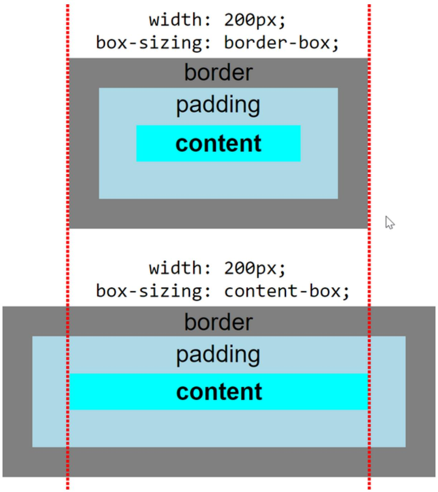

<details>
<summary>text_image</summary>

width: 200px;
box-sizing: border-box;
border
padding
content
width: 200px;
box-sizing: content-box;
border
padding
content
</details>

Figure 18-1. An element with   in the two box models

## CSS Backgrounds

CSS provides two related properties: background-clip and backgroundorigin. Between them, you can specify where a background should start within an element, and how to clip the background so that it doesn’t appear in parts of the box model where you don’t want it to.

To accomplish this, both properties support these values:

border-box

Refers to the outer edge of the border

padding-box

Refers to the outer edge of the padding area

content-box

Refers to the outer edge of the content area

### The background-clip Property

The background-clip property specifies whether the background should be ignored (clipped) if it appears within either the border or padding area of an element. For example, the following declaration states that the background may display in all parts of an element, all the way to the outer edge of the border:

background-clip : border-box;

To keep the background from appearing within the border area of an element, you can restrict it to only the section of an element inside the outer edge of its padding area, like this:

background-clip : padding-box;

To restrict the background to display only within the content area of an element, use this declaration:

background-clip : content-box;

Figure 18-2 shows three rows of elements displayed in the Chrome web browser, in which the first row uses border-box for the background-clip property, the second uses padding-box, and the third uses content-box.  
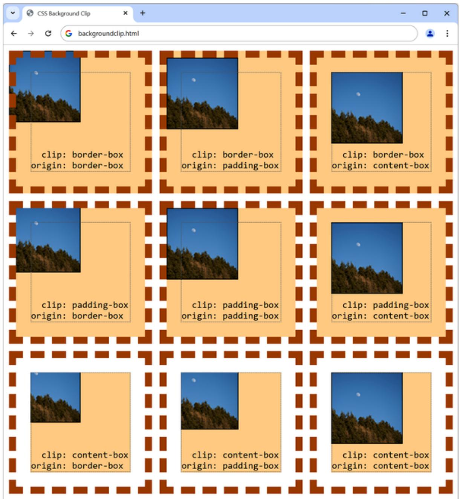

<details>
<summary>text_image</summary>

clip: border-box
origin: border-box
clip: border-box
origin: padding-box
clip: border-box
origin: content-box
clip: padding-box
origin: border-box
clip: padding-box
origin: padding-box
clip: padding-box
origin: content-box
clip: content-box
origin: border-box
clip: content-box
origin: padding-box
clip: content-box
origin: content-box
</details>

Figure 18-2. Different ways of combining CSS background properties

In the first row, the inner box (an image file that has been loaded into the top left of the element, with repeating disabled) is allowed to display anywhere in the element. You can also clearly see it displayed in the border area of the first box because the border has been set to dotted.

In the second row, neither the background image nor the background shading displays in the border area, because they have been clipped to the padding area with a background-clip property value of padding-box.

Then, in the third row, both the background shading and the image have been clipped to display only within the inner content area of each element (shown inside a light-colored, dotted box), using a background-clip property of content-box.

### The background-origin Property

With the background-origin property, you can control where a background image will be located by specifying where the top left of the image should start. For example, the following declaration states that the background image’s origin should be the top-left corner of the outer edge of the border:

background-origin : border-box;

To set the origin of an image to the top-left outer corner of the padding area, use this declaration:

background-origin : padding-box;

Or to set the origin of an image to the top-left corner of an element’s inner content section, use this declaration:

background-origin : content-box;

Looking again at Figure 18-2, you can see in each row the first box uses a background-origin property of border-box, the second uses paddingbox, and the third uses content-box. Consequently, in each row the smaller inner box displays at the top left of the border in the first box, the top left of the padding in the second, and the top left of the content in the third box.

**NOTE**

The only differences to note between the rows, with regard to the origins of the inner box in Figure 18-2, are that in rows 2 and 3 the inner box is clipped to the padding and content areas, respectively; therefore, outside these areas no portion of the box is displayed.

### The background-size Property

In the same way that you can specify the width and height of an image when used in the  tag, in the latest browser versions you can also do so for background images.

Apply the property as follows (where ww is the width and hh is the height):

background-size : wwpx hhpx;

If you prefer, you can use only one argument, and then both dimensions will be set to that value. Also, if you apply this property to a block-level element such as a <div> (rather than one that is inline, such as a <span>), you can specify the width and/or height as a percentage instead of a fixed value. Units such as em (relative to the font size of this element) and rem (relative to the font size of the root element) also can be used. The property allows two special size values, contain and cover, that specify how the image should be sized and scaled. See the MDN page on resizing images with background-size for an example.

### Using the auto Value

If you wish to scale only one dimension of a background image, and then have the other one scale automatically to retain the same proportions, you can use the value auto for the other dimension, like this:

background-size : 100px auto;

This sets the width to 100 pixels and the height to a value proportionate to the increase or decrease in width.

**NOTE**

Different browsers may require different versions of the various background property names, so refer to the “Can I Use...” website to ensure you are applying all the versions required for the browsers you are targeting.

### Multiple Backgrounds

With CSS you can attach multiple backgrounds to an element, each of which can use the previously discussed CSS background properties.

Figure 18-3 shows an example of this; eight different images have been assigned to the background to create the four corners and four edges of the certificate border.

To display multiple background images in a single CSS declaration, separate them with commas. Example 18-1 shows the HTML and CSS used to create the background in Figure 18-3.

Example 18-1. Using multiple images in a background

```txt
<!DOCTYPE html>
<html> <!-- backgroundimages.html -->
<head>
    <title>CSS Multiple Backgrounds Example</title>
    <style>
```

```html
.border {
    font-family: 'Times New Roman';
    font-style :italic;
    font-size :170%;
    text-align :center;
    padding :60px;
    width :350px;
    height :500px;
    background :url('b1.gif') top left no-repeat,
    url('b2.gif') top right no-repeat,
    url('b3.gif') bottom left no-repeat,
    url('b4.gif') bottom right no-repeat,
    url('ba.gif') top repeat-x,
    url('bb.gif') left repeat-y,
    url('bc.gif') right repeat-y,
    url('bd.gif') bottom repeat-x
}
</style>
</head>
<body>
<div class='border'>
<h1>Employee of the month</h1>
<h2>Awarded To:</h2>
<h3>______________</h3>
<h2>Date:</h2>
<h3>__/__/__/__</h3>
</div>
</body>
</html>
```


<details>
<summary>text_image</summary>

Employee of
the month
Awarded To:
_____________
Date:
__/__/__
</details>

Figure 18-3. A background created with multiple images

In the CSS section, the first four lines of the background declaration place the corner images into the four corners of the element, and the final four place the edge images, which are handled last because the order of priority for background images goes from top to bottom. In other words, where they overlap, additional background images will appear behind already placed images. If the GIFs were in the reverse order, the repeating edge images would display on top of the corners, which would be incorrect.

**NOTE**

Using this CSS, you can resize the containing element to any dimensions, and the border will always correctly resize to fit, which is much easier than using tables or multiple elements for the same effect.

## CSS Borders

CSS also brings a lot more flexibility to the way borders can be presented, by allowing you to independently change the colors of all four border edges, display images for the edges and corners, provide a radius value for applying rounded corners to borders, and place box shadows underneath elements.

### The border-color Property

There are two ways to apply colors to a border. First, you can pass a single color to the property:

border-color : #888;

**NOTE**

The shorthand color notation #303 is the same as specifying #330033, so #888 seen in the preceding code snippet is the same as #888888.

This property sets all the borders of an element to mid-gray. You can also set border colors individually, like this (which sets the border colors to various shades of gray):

```scss
border-top-color : #000;
border-left-color : #444;
border-right-color : #888;
border-bottom-color : #ccc;
```

Or you can set all the colors individually with a single declaration:

```scss
border-color:#f00 #0f0 #880 #00f;
```

This declaration sets the top border color to #f00, the right one to #0f0, the bottom one to #880, and the left one to #00f (red, green, orange, and blue, respectively). You can also use color names for the arguments.

### The border-radius Property

Prior to CSS3, talented web developers came up with numerous tweaks and fixes to achieve rounded borders, generally using <table> or <div> tags.

Now adding rounded borders to an element is really simple, and it works in the latest versions of all major browsers, as shown in Figure 18-4, in which a 10-pixel border is displayed in different ways. Example 18-2 shows the HTML for this.

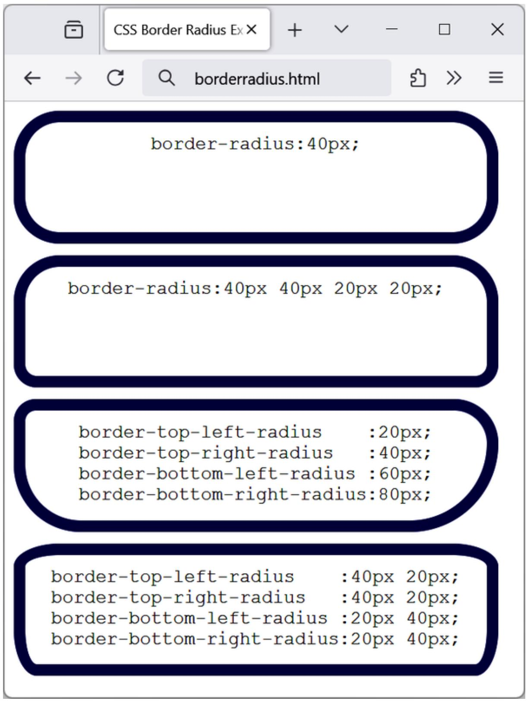

<details>
<summary>text_image</summary>

border-radius:40px;
border-radius:40px 40px 20px 20px;
border-top-left-radius :20px;
border-top-right-radius :40px;
border-bottom-left-radius :60px;
border-bottom-right-radius:80px;
border-top-left-radius :40px 20px;
border-top-right-radius :40px 20px;
border-bottom-left-radius :20px 40px;
border-bottom-right-radius:20px 40px;
</details>

Figure 18-4. Mixing and matching various border radius properties

Example 18-2. The  property

```html
<!DOCTYPE html>
<html> <!-- borderradius.html -->
<head>
    <title>CSS Border Radius Examples</title>
    <style>
    .box {
    margin-bottom : 10px;
    font-family : 'Courier New', monospace;
    font-size : 1rem;
    text-align : center;
    padding : 10px;
    width : 380px;
    height : 75px;
    border : 10px solid #006;
    }
    .b1 {
    border-radius : 40px;
    }
    .b2 {
    border-radius : 40px 40px 20px 20px;
    }
    .b3 {
    border-top-left-radius : 20px;
    border-top-right-radius : 40px;
    border-bottom-left-radius : 60px;
    border-bottom-right-radius : 80px;
    }
    .b4 {
    border-top-left-radius : 40px 20px;
    border-top-right-radius : 40px 20px;
    border-bottom-left-radius : 20px 40px;
    border-bottom-right-radius : n20px 40px;
    }
</style>
</head>
<body>
<div class='box b1'>
border-radius : 40px;
</div>

<div class='box b2'>
border-radius : 40px 40px 20px 20px;
</div>

<div class='box b3'>
border-top-left-radius &nbsp;&nbsp;&nbsp;:20px;<br>
border-top-right-radius &nbsp;&nbsp;:40px;<br>
```

```html
border-bottom-left-radius :60px;<br>
border-bottom-right-radius:80px;
</div>

<div class='box b4'>
border-top-left-radius &nbsp;&nbsp;&nbsp;40px 20px;<br>
border-top-right-radius &nbsp;&nbsp;40px 20px;<br>
border-bottom-left-radius :20px 40px;<br>
border-bottom-right-radius:20px 40px;
</div>
</body>
</html>
```

So, for example, to create a rounded border with a radius of 20 pixels, you can simply use the following declaration:

```scss
border-radius : 20px;
```

You can specify a separate radius for each of the four corners, like this (applied in a clockwise direction starting from the top-left corner):

```txt
border-radius : 10px 20px 30px 40px;
```

If you prefer, you can also address each corner of an element individually, like this:

```scss
border-top-left-radius : 20px;
border-top-right-radius : 40px;
border-bottom-left-radius : 60px;
border-bottom-right-radius : 80px;
```

And, when referencing individual corners, you can supply two arguments to choose a different vertical and horizontal radius (giving more interesting and subtle borders), like this:

```txt
border-top-left-radius : 40px 20px;
border-top-right-radius : 40px 20px;
```

```scss
border-bottom-left-radius : 20px 40px;
border-bottom-right-radius : 20px 40px;
```

The first argument is the horizontal, and the second is the vertical radius.

## Box Shadows

To apply a box shadow, specify a horizontal and vertical offset from the object, the amount of blurring to add to the shadow, and the color to use, like this:

box-shadow : 15px 15px 10px #888;

The two instances of 15px specify the vertical and horizontal offset from the element, and these values can be negative, zero, or positive. The 10px specifies the amount of blurring, with smaller values resulting in less blurring, and #888 is the color for the shadow, which can be any valid color value. The result of this declaration can be seen in Figure 18-5.

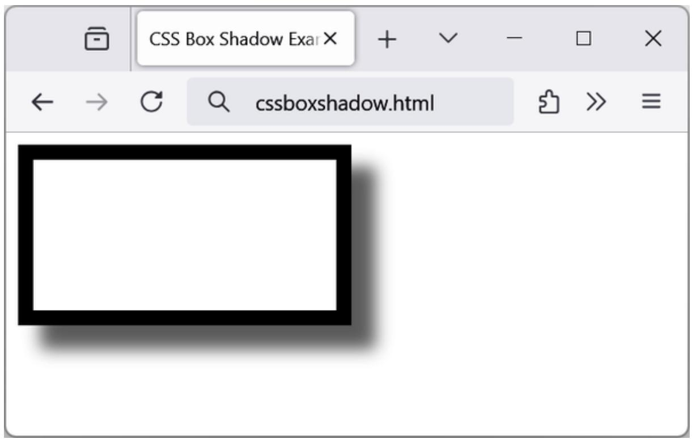

<details>
<summary>text_image</summary>

CSS Box Shadow Exar X
cssboxshadow.html
</details>

Figure 18-5. A box shadow displayed under an element

## Element Overflow

In CSS2, you can indicate what to do when one element is too large to be fully contained by its parent by setting the overflow property to hidden, visible, scroll, or auto. But with CSS3, you can now separately apply these values in the horizontal or vertical directions, as well as with these example declarations:

```txt
overflow-x : hidden;
overflow-x : visible;
overflow-y : auto;
overflow-y : scroll;
```

## Multicolumn Layout

One of the features most requested by web developers is multiple columns, and this was realized in CSS3. Now, flowing text over multiple columns is as easy as specifying the number of columns and then (optionally) choosing the spacing between them and the type of dividing line (if any), as shown in Figure 18-6 (created with Example 18-3).

<table><tr><td colspan="2">Multiple Columns × +</td><td>- □ ×</td></tr><tr><td colspan="2">← → ⬤ multiplecolumns.html</td><td>» ≡</td></tr><tr><td>Now is the winter of our discontent Made glorious summer by this sun of York; And all the clouds that lour&#x27;d upon our house In the deep bosom of the ocean buried. Now are our brows bound with</td><td>victorious wreaths; Our bruised arms hung up for monuments; Our stern alarums changed to merry meetings, Our dreadful marches to delightful measures. Grim-visaged war hath smooth&#x27;d his</td><td>wrinkled front; And now, instead of mounting barded steeds To fright the souls of fearful adversaries, He capers nimbly in a lady&#x27;s chamber To the lascivious pleasing of a lute.</td></tr></table>

Figure 18-6. Flowing text in multiple columns  
Example 18-3. Using CSS to create multiple columns

```html
<!DOCTYPE html>
<html> <!-- multiplecolumns.html -->
<head>
    <title>Multiple Columns</title>
    <style>
    .columns {
    text-align : justify;
    font-size : 1.3rem;
    column-count : 3;
    column-gap : 1em;
    column-rule : 1px solid black;
    }
</style>
</head>
<body>
<div class='columns'>
Now is the winter of our discontent
Made glorious summer by this sun of York;
And all the clouds that lour'd upon our house
In the deep bosom of the ocean buried.
Now are our brows bound with victorious wreaths;
Our bruised arms hung up for monuments;
Our stern alarums changed to merry meetings,
```

```html
Our dreadful marches to delightful measures.
Grim-visaged war hath smooth'd his wrinkled front;
And now, instead of mounting barded steeds
To fright the souls of fearful adversaries,
He capers nimbly in a lady's chamber
To the lascivious pleasing of a lute.
</div>
</body>
</html>
```

Within the .columns class, the first two lines simply tell the browser to right-justify the text and to set it to a font size of 1.3rem. These declarations aren't needed for multiple columns, but they improve the text display. The remaining lines set up the element so that, within it, text will flow over three columns, with a gap of 1em between the columns and with a single-pixel border down the middle of each gap.

## Colors and Opacity

The ways you can define colors have greatly expanded with CSS3, and you can now also use CSS functions to apply colors in the common formats RGB (red, green, and blue), RGBA (red, green, blue, and alpha), HSL (hue, saturation, and luminance), and HSLA (hue, saturation, luminance, and alpha). The alpha value specifies a color's transparency, which allows underlying elements to show through.

### HSL Colors

To define a color with the hsl function, you must first choose a value for the hue between 0 and 359 from a color wheel. Any higher color numbers simply wrap around to the beginning again, so the value of 0 is red, and so are the values 360 and 720.

In a color wheel, the primary colors of red, green, and blue are separated by 120 degrees, so pure red is 0, green is 120, and blue is 240. The numbers between these values represent shades comprising different proportions of the primary colors on either side.

Next you need the saturation level, which is a value between 0 and 100%. This specifies how washed out or vibrant a color will appear. The saturation values commence in the center of the wheel with a mid-gray color (a saturation of 0%) and then become more vivid as they progress to the outer edge (a saturation of 100%).

All that's left then is for you to decide how bright you want the color to be, by choosing a luminance value of between 0 and $100\%$ . A value of $50\%$ for the luminance gives the fullest, brightest color. Decreasing the value (down to a minimum of $0\%$ ) darkens the color until it displays as black, and increasing the value (up to a maximum of $100\%$ ) lightens the color until it shows as white. You can visualize this as if you are mixing levels of either black or white into the color.

Therefore, for example, to choose a fully saturated yellow color with standard percent brightness, you would use a declaration like this:

```javascript
color : hsl(60, 100%, 50%);
```

Or, for a darker blue color, you would use a declaration like this:

```javascript
color : hsl(240, 100%, 40%);
```

You can also use this (and all other CSS color functions) with any property that expects a color, such as background-color and so on.

### HSLA Colors

To provide even further control over how colors appear, you can use the hsla function, supplying it with a fourth (alpha) level for a color, which is a floating-point value between 0 and 1. A value of 0 specifies that the color is totally transparent, while 1 means it is fully opaque.

Here's how you would choose a fully saturated yellow color with standard brightness and $30\%$ opacity:

```javascript
color : hsla(60, 100%, 50%, 0.3);
```

Or, for a fully saturated but lighter blue color with 82% opacity, you could use this declaration:

```solidity
color : hsla(240, 100%, 60%, 0.82);
```

### RGB Colors

You probably are more familiar with the RGB system of selecting a color, as it's similar to the #nnnnnn and #nnn color formats. For example, to apply a yellow color to a property, you can use either of the following declarations (the first supporting 16 million colors, and the second supporting 4,000):

```txt
color : #ffff00;
color : #ff0;
```

You can also use the CSS rgb function to achieve the same result but with decimal numbers instead of hexadecimal (where 255 decimal is ff hexadecimal):

```javascript
color : rgb(255, 255, 0);
```

But even better than that, you don't even have to think in amounts of up to 256 anymore, because you can specify percentage values, like this:

```txt
color : rgb(100%, 100%, 0);
```

In fact, you can now get very close to a desired color by thinking about its primary colors. For example, green and blue make cyan, so to create a color close to cyan, but with more blue in it than green, you could make a good first guess at 0% red, 40% green, and 60% blue and try a declaration like this:

```javascript
color : rgb(0%, 40%, 60%);
```

### RGBA Colors

As with the hsla function, the rgba function supports a fourth alpha argument, so you can, for example, apply the previous cyan-like color with an opacity of 40% by using a declaration such as this:

```txt
color : rgba(0%, 40%, 60%, 0.4);
```

### The opacity Property

The opacity property provides the same alpha control as the hsla and rgba functions but lets you modify an object's opacity (or transparency, if you prefer) separately from its color, as shown in Figure 18-7.

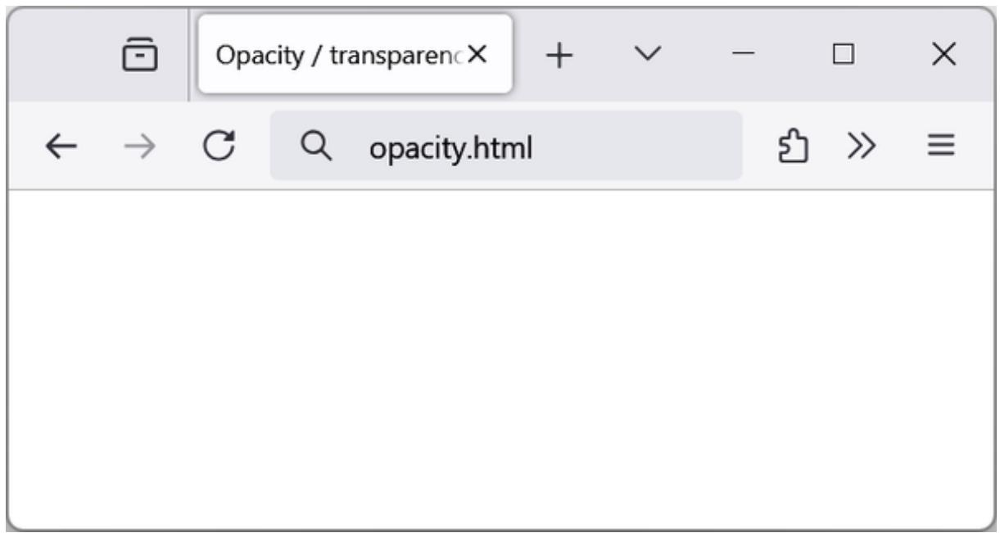

<details>
<summary>text_image</summary>

Opacity / transparenc
← → ⬤ opacity.html
</details>

Figure 18-7. A fully transparent picture with opacity set to 0

To use it, apply a declaration such as the following to an element (which in this example sets the opacity to 25%, or 75% transparent):

opacity : 0.25;

## Text Effects

A number of new effects can now be applied to text with the help of CSS3, including text shadows, text overlapping, and word wrapping.

### The text-shadow Property

The text-shadow property is similar to the box-shadow property and takes the same set of arguments: a horizontal and vertical offset, an amount for the blurring, and the color to use. For example, the following declaration offsets the shadow by 3 pixels both horizontally and vertically and displays the shadow in dark gray, with a blurring of 4 pixels:

text-shadow : 3px 3px 4px #444;

The result of this declaration looks like Figure 18-8 and works in all recent versions of all major browsers (but not IE 9 or lower).

**This is shadowed text**

Figure 18-8. Applying a shadow to text

### The text-overflow Property

When using any of the CSS overflow properties with a value of hidden, you can also use the text-overflow property to place an ellipsis (three dots) just before the cutoff to indicate that some text has been truncated, like this:

text-overflow : ellipsis;

Without this property, when the text “To be, or not to be. That is the question.” is truncated, the result will look like Figure 18-9; with the declaration applied, however, the result looks like Figure 18-10.

**To be, or not to be. That is**

Figure 18-9. Text is automatically truncated

**To be, or not to be. Tha...**

Figure 18-10. Instead of being cut off, text trails off using an ellipsis

For this to work, three things are required:

- The element should have an overflow property that is not visible, such as overflow:hidden.  
- The element must have the white-space:nowrap property set to constrain the text.  
- The width of the element must be less than that of the text to truncate.

### The word-wrap Property

When you have a really long word that is wider than the element containing it, it will either overflow or be truncated. But as an alternative to using the text-overflow property and truncating text, you can use the word-wrap property with a value of break-word to wrap long lines, like this:

For example, in Figure 18-11 the word Honorificabilitudinitatibus is too wide for the containing box (whose righthand edge is shown as a solid vertical line between the letters t and a), and, because no overflow properties have been applied, it has overflowed its bounds.

**Honorificabilitudinitatibus**

Figure 18-11. The word is too wide for its container and has overflowed

But in Figure 18-12, the word-wrap property of the element has been assigned a value of break-word, so the word has neatly wrapped around to the next line.

**Honorificabilitudinit atibus**

Figure 18-12. The word now wraps at the righthand edge

## Web Fonts

The use of CSS web fonts vastly increases the typography available to web designers by allowing fonts to be loaded in and displayed from across the web, not just from the user's computer. To achieve this, declare a web font by using @font-face, like this:

```css
@font-face
{
    font-family : FontName;
    src : url('FontName.otf');
}
```

The url function requires a value containing the path or URL of a font. You can use either TrueType (.ttf) or OpenType (.otf) fonts.

To tell the browser the type of font, you can use the format function, like this for OpenType fonts:

```css
@font-face
{
    font-family : FontName;
    src : url('FontName.otf') format('opentype');
}
```

Or this for TrueType fonts:

```css
@font-face
{
    font-family : FontName;
    src : url('FontName.ttf') format('truetype');
}
```

However, because Internet Explorer accepts only EOT fonts, it ignores @font-face declarations that contain the format function.

## Google Web Fonts

One of the neatest ways to use web fonts is to load them for free from Google's servers. To find out more about this, check out the Google Fonts Website, seen in Figure 18-13, where you can access well over one thousand fonts.

**PRIVACY ISSUES USING A THIRD-PARTY SITE**

If you link to a Google-hosted font, be aware of the privacy and data collection that comes with using the tool; especially if your website is used in Europe you may need to obtain user consent. Consult your legal advisor and the Google Fonts Privacy and Data Collection document. You can also download the selected font and serve the files from your server if you're not sure whether a Google-hosted font is the right choice for you and your users.


<details>
<summary>text_image</summary>

Browse Fonts - Google Fonts
https://fonts.google.com
Reset all
Google Fonts
Search fonts
Sort by
Trending
Filters
Type something
Readability
How type influences
readability
Material design
guidelines
Styling text
Optimize font
loading
Achieve faster page load
times
1714 of 1714 families
About these results
Filter
Language
Writing system
Language
Technology
Variable Color
Decorative stroke
Serif Slab Serif
Sans Serif
Classification
Roboto 12 styles | Christian Robertson
Everyone has the right to freedom of thought,
SUSE Variable (1 axis) | René Bieder
Everyone has the right to freedom of thought,
Mingzat 1 style | SIL International
X(9)( Ø(§)F(§ Ø(§) &(¥)* §*¥ §)
Protest Guerrilla 1 style | Octavio Pardo
Everyone has the right to freedom of thought,
</details>

Figure 18-13. Some of Google's web fonts

To show you how easy it is to use one of these fonts, here's how to load a Google font (in this case, Lobster) into your HTML for use in <h1> headings:

```html
<!DOCTYPE html>
<html>
<head>
    <style>
    h1 { font-family:'Lobster', arial, serif; }
</style>
    <link href='http://fonts.googleapis.com/css?family=Lobster'
    rel='stylesheet'>
</head>
<body>
    <h1>Hello</h1>
</body>
</html>
```

When you select a font from the website, Google provides the <link> tag to copy and paste into the <head> of your web page.

## Transformations

Using transformations, you can skew, rotate, stretch, and squash elements in any of up to three dimensions. This makes it easy to create great effects by stepping out of the uniform rectangular layout of <div> and other elements, because now they can be shown at a variety of angles and in many different forms.

To perform a transformation, use the transform property. You can apply various properties to the transform property, starting with the value none, which resets an object to a nontransformed state:

transform:none;

You can supply one or more of the following functions to the transform property:

matrix

Transforms an object by applying a matrix of values to it

translate

Moves an element's origin

scale

Scales an object

rotate

Rotates an object

skew

**Skews an object**

The only one of these that might cause you to scratch your head is skew. With this function, one coordinate is displaced in one direction in proportion to its distance from a coordinate plane or axis. So, a rectangle, for example, is transformed into a parallelogram when skewed.

There are also single versions of many of these functions, such as translateX, scaleY, and so on.

So, for example, to rotate an element clockwise by 45 degrees, you could apply this declaration to it:

transform : rotate(45deg);

At the same time, you could enlarge this object, as in the following declaration, which enlarges its width by 1.5 times and its height by 2 times and then performs the rotation. Figure 18-14 shows an object before and after the transformations are applied:

transform : scale(1.5, 2) rotate(45deg);

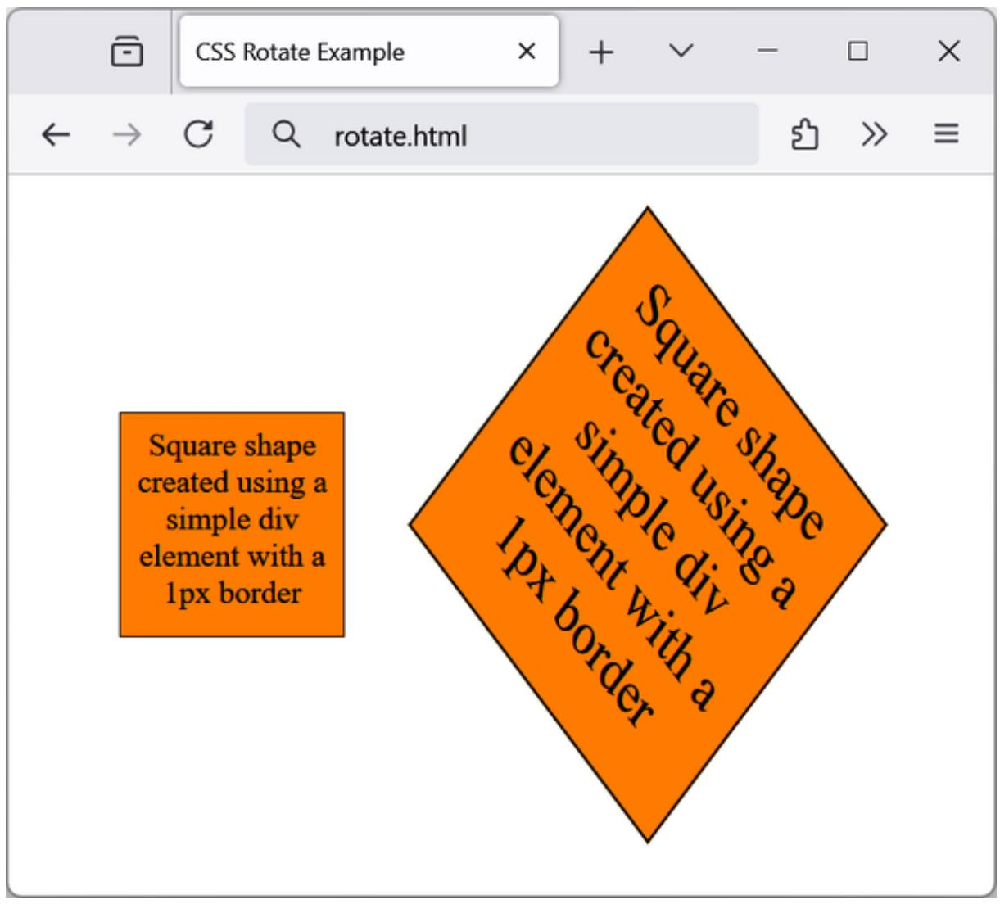

<details>
<summary>text_image</summary>

Square shape
created using a
simple div
element with a
1px border
Square shape
created using a
simple div
element with a
1px border
</details>

Figure 18-14. An object before and after transformation

You can also transform objects in three dimensions by using the following CSS 3D transformation features:

**perspective**

Releases an element from 2D space and creates a third dimension within that it can move. Required to work with 3D CSS functions.

**transform-origin**

Exploits perspective, setting the location at which all lines converge to a single point.

translate3d

Moves an element to another location in its 3D space.

scale3d

Rescales one or more dimensions.

rotate3d

Rotates an element around any of the x-, y-, and z-axes.

Figure 18-15 shows a 2D object that has been rotated in 3D space with a CSS rule like this:

transform: perspective(200px) rotateX(20deg) rotateY(40deg) rotateZ(10deg);

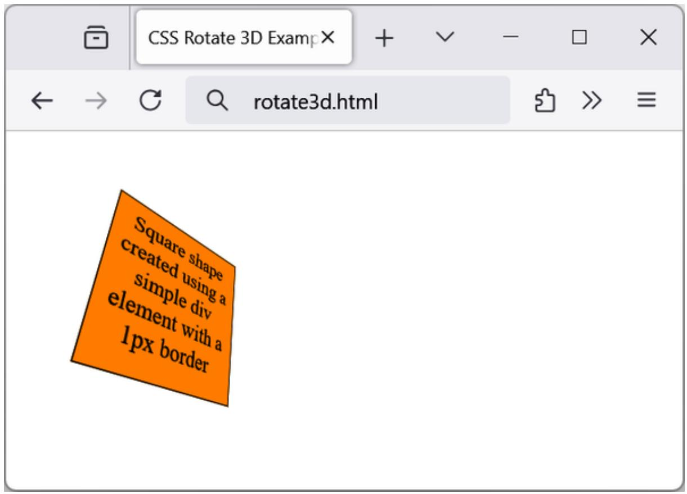

<details>
<summary>text_image</summary>

CSS Rotate 3D Exam p X
+   -   □   ×
←   →   Q   rotate3d.html
Square shape
created using a
simple div
element with a
1px border
</details>

Figure 18-15. A figure rotated in 3D space

## Transitions

Also appearing in all the latest major browser versions is a dynamic new feature called transitions. These specify an animation effect you want to occur when an element is transformed, and the browser will automatically take care of all the in-between frames for you.

The four properties to supply to set up a transition are:

```txt
transition-property : property;
transition-duration : time;
transition-delay : time;
transition-timing-function : type;
```

### Properties to Transition

Transitions have properties such as height and border-color. Specify the properties you want to change in the CSS property named transition-property. (I'm using the word property here in two different ways: for a CSS property and for the transition properties it sets.)

You can include multiple properties by separating them with commas, like this:

transition-property : width, height, opacity;

Or if you want absolutely everything about an element to transition (including colors), use the value all, like this:

transition-property : all;

### Transition Duration

The transition-duration property requires a value of 0 seconds or greater, like the following, which specifies that the transition should take

1.25 seconds to complete:

transition-duration : 1.25s;

### Transition Delay

If the transition-delay property is given a value greater than 0 seconds (the default), it introduces a delay between the initial display of the element and the beginning of the transition. The following starts the transition after a 0.1-second delay:

transition-delay : 0.1s;

If the transition-delay property is given a value of less than 0 seconds (in other words, a negative value), the transition will execute the moment the property is changed but will appear to have begun execution at the specified offset, partway through its cycle.

### Transition Timing

The transition-timing function property requires one of the following values:

ease

Start slowly, get faster, and then end slowly.

linear

Transition at constant speed.

ease-in

Start slowly, and then go quickly until finished.

ease-out

Start quickly, stay fast until near the end, and then end slowly.

ease-in-out

Start slowly, go fast, and then end slowly.

Using any of the values containing the word ease ensures that the transition looks extra fluid and natural, unlike a linear transition that seems more mechanical. And if these aren't sufficiently varied for you, you can also create your own transitions using the cubic-bezier function.

For example, here are the declarations used to create the preceding five transition types, illustrating how you can easily create your own:

```javascript
transition-timing-function:cubic-bezier(0.25, 0.1, 0.25, 1);
transition-timing-function:cubic-bezier(0, 0, 1, 1);
transition-timing-function:cubic-bezier(0.42, 0, 1, 1);
transition-timing-function:cubic-bezier(0, 0, 0.58, 1);
transition-timing-function:cubic-bezier(0.42, 0, 0.58, 1);
```

### Shorthand Syntax

You might find it easier to use the shorthand version of this property and include all the values in a single declaration like the following, which will transition all properties linearly, over a period of 0.3 seconds, after an initial (optional) delay of 0.2 seconds:

transition:all .3s linear .2s;

Doing this will save you the trouble of entering many very similar declarations, particularly if you are supporting all the major browser prefixes.

Example 18-4 illustrates how you might use transitions and transformations together. The CSS creates a square, orange element with some text in it, and a hover pseudoclass specifying that, when the mouse passes over the

object, it should rotate by 180 degrees and change from orange to yellow (see Figure 18-16).

Example 18-4. A transition on hover effect  
```html
<!DOCTYPE html>
<html>
<head>
<title>Transitioning on hover</title>
<style>
#square {
position : absolute;
top : 50px;
left : 50px;
width : 100px;
height : 100px;
padding : 2px;
text-align : center;
border-width : 1px;
border-style : solid;
background : orange;
transition : all .8s ease-in-out;
}
#square:hover {
background : yellow;
transform : rotate(180deg);
}
</style>
</head>
<body>
<div id='square'>
Square shape<br>
created using<br>
a simple div<br>
element with<br>
a 1px border
</div>
</body>
</html>
```

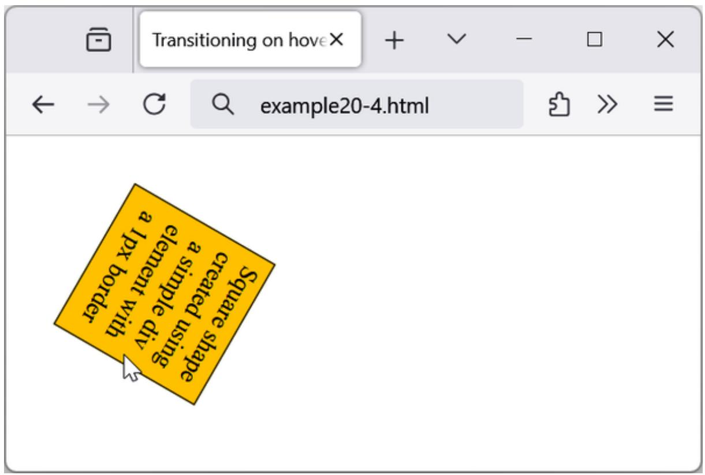

<details>
<summary>text_image</summary>

Transitioning on hove €
example20-4.html
Create shape a simple design with a 1px border
created using a Simplic with create shape
</details>

Figure 18-16. The object rotates and changes color when hovered over

The object will rotate clockwise when hovered over while slowly changing from orange to yellow.

CSS transitions are smart in that when they are canceled, they smoothly return to their original value. So, if you move the mouse away before the transition has completed, it will instantly reverse and transition back to its initial state.

## Flexbox

Flexbox layout allows you to distribute space and align elements within a container element regardless of its dimensions, enabling responsive layouts that work with all viewports, by applying the value flex to its display property, like this:

```scss
display : flex;
}
```

The following examples use a series of <div> elements, where one such element contains three <p> and one <div> element, each with a different background set, which is omitted here for brevity, but the HTML looks like this:

```html
<div>
    <p>Some long text 1 ...</p>
    <div id="div">DIV</div>
    <p>Longer ...</p>
    <p>The longest ...</p>
</div>
```

You can see the result of adding the display: flex property in Figure 18-17.

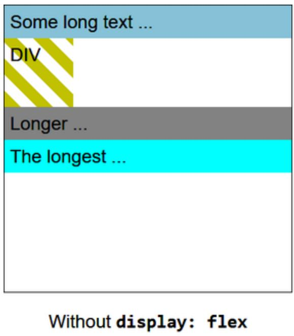

<details>
<summary>text_image</summary>

Some long text ...
DIV
Longer ...
The longest ...
Without display: flex
</details>

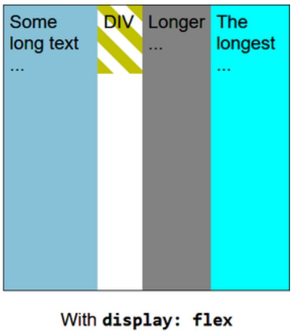

<details>
<summary>stacked bar chart</summary>

| Category | Value |
|---|---|
| Some long text ... | 10 |
| DIV | 5 |
| Longer ... | 10 |
| The longest ... | 20 |
</details>

Figure 18-17. Enabling flexbox

If you're using a Chromium-based browser like Chrome or Edge, you can use the flexbox editor, which is available in developer tools and can be seen in Figure 18-18. Locate the element with display: flex and click the

editor icon next to the display property. A window will appear where you can set the flexbox properties and see how they change the element layout.

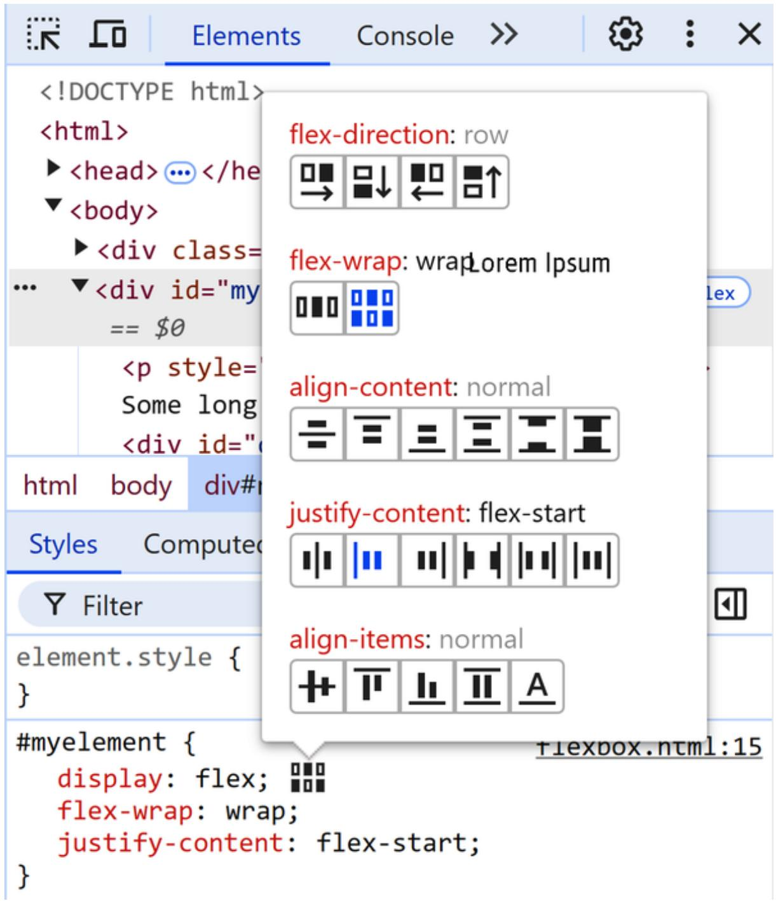

<details>
<summary>text_image</summary>

<?DOCTYPE html>
<html>
  ▶ <head> ⋯ </he
  ▼ <body>
    ▶ <div class=
  ⋯ <div id="my
    == $0
    <p style=
    Some long
    <div id="
html body div#
Styles Computed
  ▼ Filter
element.style {
}
#myelement {
    display: flex;
    flex-wrap: wrap;
    justify-content: flex-start;
}
</details>

Figure 18-18. Flexbox editor in Chrome developer tools

### Flex Items

Flex items are the child elements of a flex container and can be blocks, text, images, or any other HTML elements. You can apply various flex properties to them to specify how and where they should display.

### Flow Direction

In a flex container, there are two primary axes or directions of flow: the main axis and the cross axis. The main axis is defined by the flex direction (either row or column), and the cross axis is perpendicular to the main axis. The flex-direction property sets the direction of the main axis with these supported values:

ΓΟΥ

Items are laid out in a row from left to right (the default).

row-reverse

Items are laid out in a row from right to left.

column

Items are laid out in a column from top to bottom.

column-reverse

Items are laid out in a column from bottom to top.

The various values and the result of applying them can be seen in Figure 18-19.

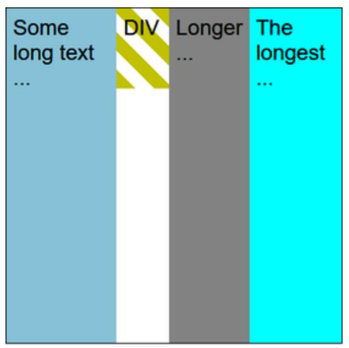

<details>
<summary>stacked bar chart</summary>

| Category | Value |
|---|---|
| Some long text ... | 10 |
| DIV | 3 |
| Longer ... | 5 |
| The longest ... | 10 |
</details>

flex-direction: row

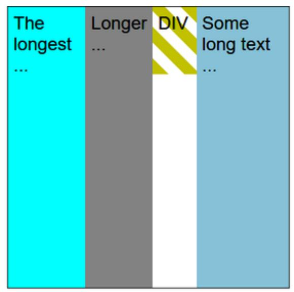

<details>
<summary>text_image</summary>

The longest
...
Longer
...
DIV
Some long text
...
</details>

flex-direction: row-reverse

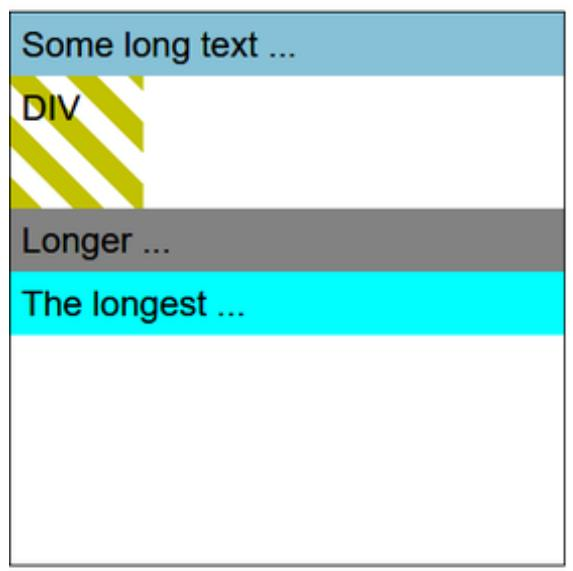

<details>
<summary>text_image</summary>

Some long text ...
DIV
Longer ...
The longest ...
</details>

flex-direction: column

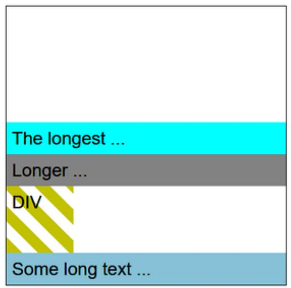

<details>
<summary>text_image</summary>

The longest ...
Longer ...
DIV
Some long text ...
</details>

flex-direction: column-reverse  
Figure 18-19. The flex-direction property

The following creates a flexbox in which items will flow from top to bottom in columns, and the columns will flow from left to right as each column fills:

flex-direction : column;

### Justifying Content

The justify-content property determines how flex items are spaced along the main axis. It can be used to distribute space evenly, align items at the start or end of the container, or center them. Centering helps distribute free space leftover when all the flex items on a line are inflexible, or the items are flexible but have reached their maximum size. Supported values are:

flex-start

Items are packed toward the start (default) taking into account any reverse value.

flex-end

Items are packed toward the end taking into account any reverse value.

start

Items are packed from the start ignoring any reverse.

end

Items are packed to the end ignoring any reverse.

center

Items are centered along the axis.

stretch

Auto-sized items are distributed evenly.

space-between

Items are evenly distributed along the axis, with the first item at the start and last item at the end.

space-around

Items are evenly distributed along the axis with equal space around each.

space-evenly

Items are distributed so that the spacing between each item, and before the first and after the last item is equal.

The effect of applying some of these values to a column of items can be seen in Figure 18-20.

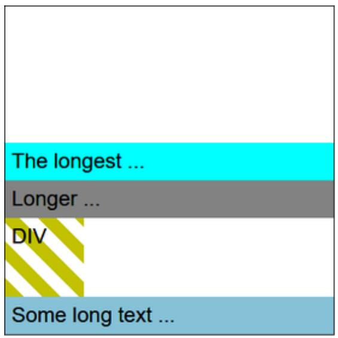

<details>
<summary>text_image</summary>

The longest ...
Longer ...
DIV
Some long text ...
</details>

justify-content: flex-start
flex-direction: column-reverse justify-content: center
flex-direction: column

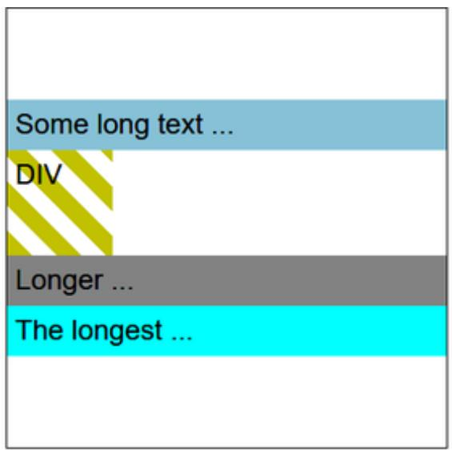

<details>
<summary>text_image</summary>

Some long text ...
DIV
Longer ...
The longest ...
</details>

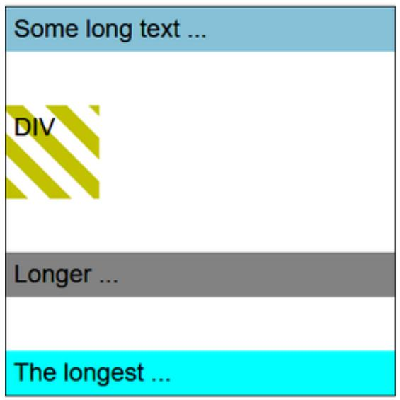

<details>
<summary>text_image</summary>

Some long text ...
DIV
Longer ...
The longest ...
</details>

justify-content: space-between flex-direction: column

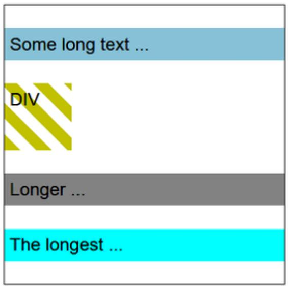

<details>
<summary>text_image</summary>

Some long text ...
DIV
Longer ...
The longest ...
</details>

justify-content: space-evenly
flex-direction: column

Figure 18-20. Selected values of the justify-content property

The following rule equally spaces all items in rows (the default axis), with no space before the first item and none after the last item in each row:

justify-content : space-between;

### Aligning Items

You can control the alignment of flex items along the cross axis of a container with the align-items, while align-self can be applied to individual elements to override the container's alignment. Supported values are:

stretch

Items are separated by equal spaces to fill the available space.

flex-start

Items are aligned flush with the cross-start edge of the line.

flex-end

Items are aligned flush with the cross-end edge of the line.

baseline

Items are aligned such that their baselines align.

center

Items are centered along the flow axis.

start

Items are aligned toward the start of the axis.

end

Items are aligned toward the end of the axis.

Some of the common alignment options can be seen in Figure 18-21.

The following centers a container's items along the flow axis:

```scss
align-items : center;
```

The align-self property overrides the alignment of an individual flex item. The following creates a flexbox in which all its items have center alignment, followed by an individual item from this flexbox with its alignment overridden to end:

```css
#myflexbox {
    display : flex;
    align-items : center;
}
#myflexitem {
    align-self : end;
}
```

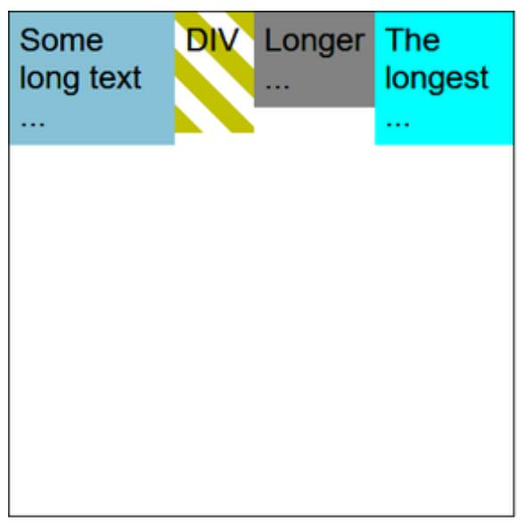

<details>
<summary>text_image</summary>

Some
long text
...
DIV Longer The
longest
... ...
</details>

align-items: start

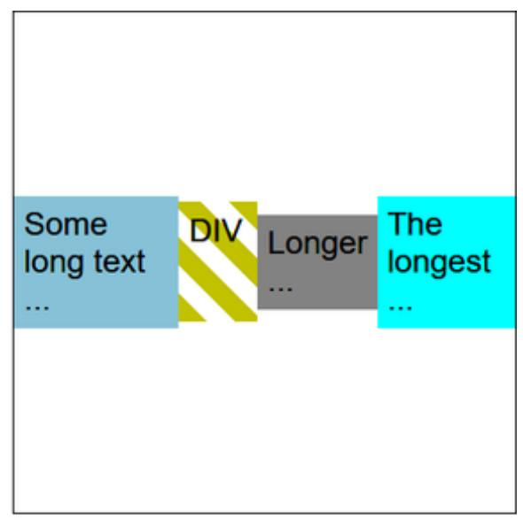

<details>
<summary>flowchart</summary>

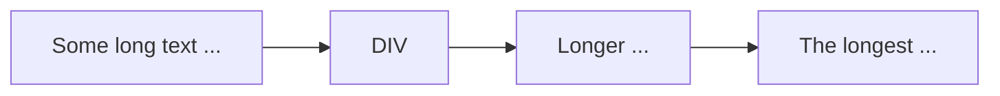
```mermaid
graph LR
  A["Some long text ..."] --> B["DIV"]
  B --> C["Longer ..."]
  C --> D["The longest ..."]
```
</details>

align-items: center

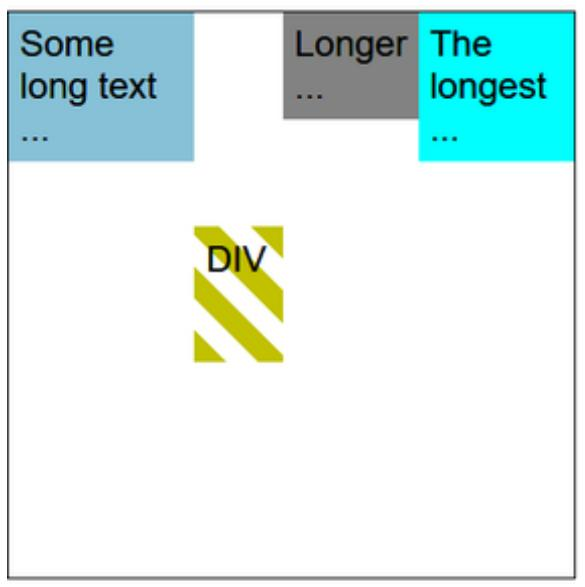

<details>
<summary>text_image</summary>

Some
long text
...
Longer
...
The
longest
...
DIV
</details>

align-items: start
align-self: center on the DIV

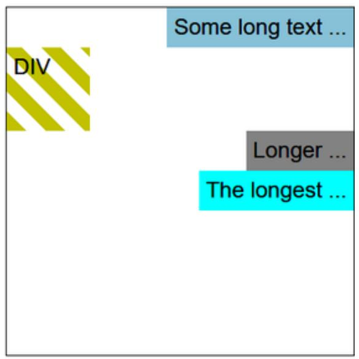

<details>
<summary>text_image</summary>

DIV
Some long text ...
Longer ...
The longest ...
</details>

align-items: end
flex-direction: column
align-self: start on the DIV  
Figure 18-21. Showing some of the align-items values

### Aligning Content

You can use the same values supplied to align-items for the align-content property, which works similarly but acts along the opposite axis to the direction of flow. The following centers items in the default direction, stretching them along the cross axis:

```scss
align-items : center;
align-content : stretch;
```

See “Flex Wrap” for an example using the flex-wrap property.

### Resizing Items

A group of three properties control how individual flex items should expand or shrink to fit or fill the available space:

flex-grow

Specifies how much an item can grow relative to others. The default value is 0, which indicates the default sizing algorithm. Greater values indicate the relative amounts items can grow by to fill available free space. The higher the value the more space given.

flex-shrink

Determines how much an element can shrink when there's not enough space in the flexbox. The default value is 0, which indicates the default sizing algorithm. Greater values indicate the relative amounts items can shrink to fit available space. The higher the value the more that item will shrink.

flex-basis

Sets the initial length or height before any growth or shrinking occurs. This can be any positive CSS size or percentage, auto, max-content (preferred width), min-content (minimum width), fit-content (fit maximally), or content (size automatically). When omitted its value will be 0.

As a shortcut, the main flex property supports three additional values after it to set the flex-grow, flex-shrink, and flex-basis (in that order) of all items to the same set of values. The following will allow all elements to shrink or grow as necessary by equal amounts, starting with a size of 100px:

flex : 1 1 100px;

### Flex Wrap

By default, flex items try to fit in a single line, so the flex-wrap property allows items to wrap onto new lines when there's not enough room.

Supported values are:

nowrap

Forces all items into a single line, which may cause the container to overflow (the default).

wrap

Items break across multiple rows (or columns).

wrap-reverse

Same as wrap, but the order of items is reversed.

Figure 18-22 contains the result of wrapping items as combined with various alignment options.

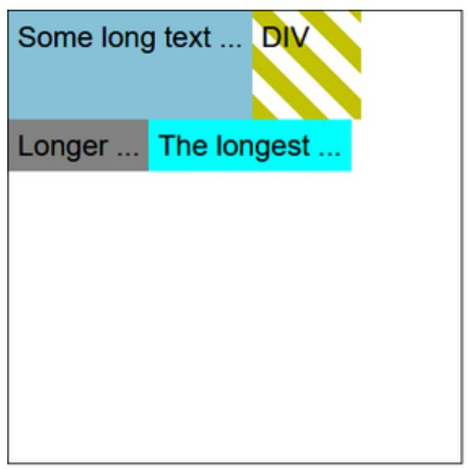

<details>
<summary>text_image</summary>

Some long text ... DIV
Longer ... The longest ...
</details>

align-content: start
flex-wrap: wrap

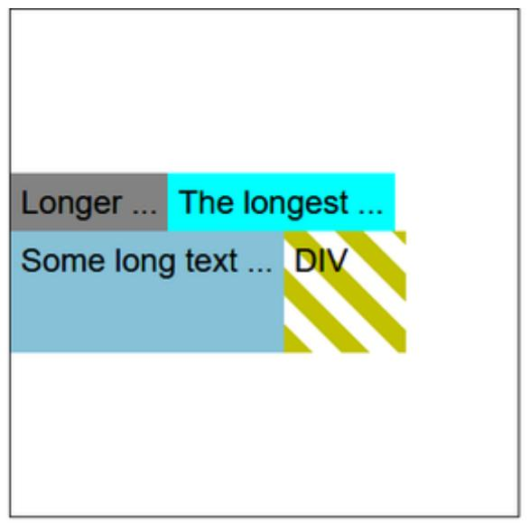

<details>
<summary>text_image</summary>

Longer ... The longest ...
Some long text ... DIV
</details>

align-content: center
flex-wrap: wrap-reverse

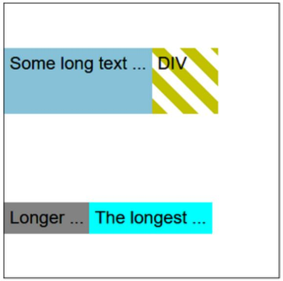

<details>
<summary>text_image</summary>

Some long text ... DIV
Longer ... The longest ...
</details>

align-content: space-around
flex-wrap: wrap

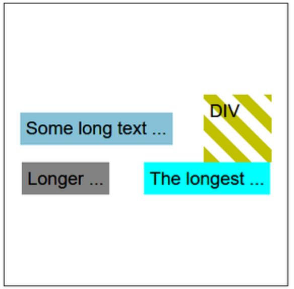

<details>
<summary>text_image</summary>

Some long text ...
Longer ...
DIV
The longest ...
</details>

align-content: center
flex-wrap: wrap
align-items: center
justify-content: space-around  
Figure 18-22. Various values of the align-content property with flex-wrap applied

The following allows items to wrap, appearing in their default order:

flex-wrap : wrap;

You can combine both flex-direction and flex-wrap in the single flex-flow property, as in the following, which flows a column at a time, wrapping to the next column as necessary:

flex-flow : column wrap;

### Order

The order property lets you change the display order of individual flex items without changing their source order in the HTML. Items with lower order values appear earlier in the layout. In the following, the third item is made to appear before the first two:

```css
#item1 { order: 2; }
#item2 { order: 3; }
#item3 { order: 1; }
```

Flex items have a default order value of 0, so items with a value greater than 0 are displayed after any that have not been given an explicit order value. Full details on using flexbox layout are available in the MDN.

In Figure 18-23 you can see how the last element will be moved to the first position when you add order: -1 on it, and how the second item will be moved to the end when order: 1 is applied on it.


<details>
<summary>flowchart</summary>

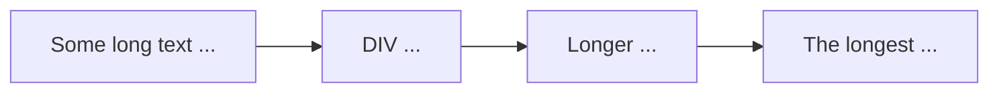
```mermaid
graph LR
  A["Some long text ..."] --> B["DIV ..."]
  B --> C["Longer ..."]
  C --> D["The longest ..."]
```
</details>

align-items: center

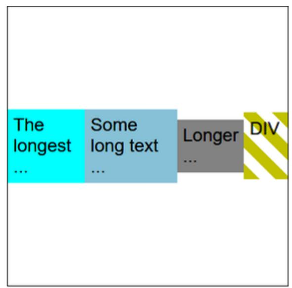

<details>
<summary>flowchart</summary>

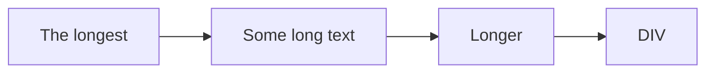
```mermaid
graph LR
  A["The longest"] --> B["Some long text"]
  B --> C["Longer"]
  C --> D["DIV"]
```
</details>

align-items: center
order: -1 on The longest ...
order: 1 on the DIV  
Figure 18-23. Reordered elements using the order CSS property

### Item Gaps

To define the spacing between flex items you can use the gap property (you also could see the older property name grid-gap used extensively, but they both do the same thing), like this:

```scss
gap : 10px;
grid-gap : 10px;
```

Figure 18-24 shows the elements have a gap when the property is added.

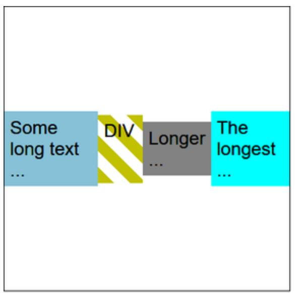

<details>
<summary>flowchart</summary>


```mermaid
graph LR
  A["Some long text ..."] --> B["DIV ..."]
  B --> C["Longer ..."]
  C --> D["The longest ..."]
```
</details>

align-items: center

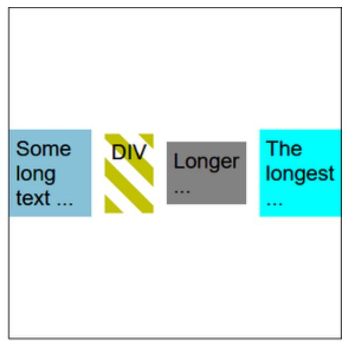

<details>
<summary>flowchart</summary>


```mermaid
graph LR
  A["Some long text ..."] --> B["DIV"]
  B --> C["Longer ..."]
  C --> D["The longest ..."]
```
</details>

align-items: center gap: 10px  
Figure 18-24. Defining the spacing between items with the gap property

Or you can individually set the column or row gaps with the column-gap and row-gap properties:

```scss
column-gap : 10px;
row-gap : 15px;
```

Alternatively you can use gap as a shorthand property to set both values:

```txt
gap : 10px 15px;
```

## CSS Grid

You can create two-dimensional grid layouts using CSS Grid for organizing and aligning content on a web page, providing a more flexible and precise way to design layouts compared to older methods such as floats and positioning. Each grid consists of a container and a number of grid items.

### Grid Container

To create a grid layout, you first define a container element as a grid container by setting its display property to grid or inline-grid, like this:

```scss
#myelement {
    display : grid;
}
```

Similar to the flexbox editor, if you’re using Chrome or a Chromium-based browser like Edge, you can locate the element in the browser developer tools and edit the properties using the grid editor, as seen in Figure 18-25.

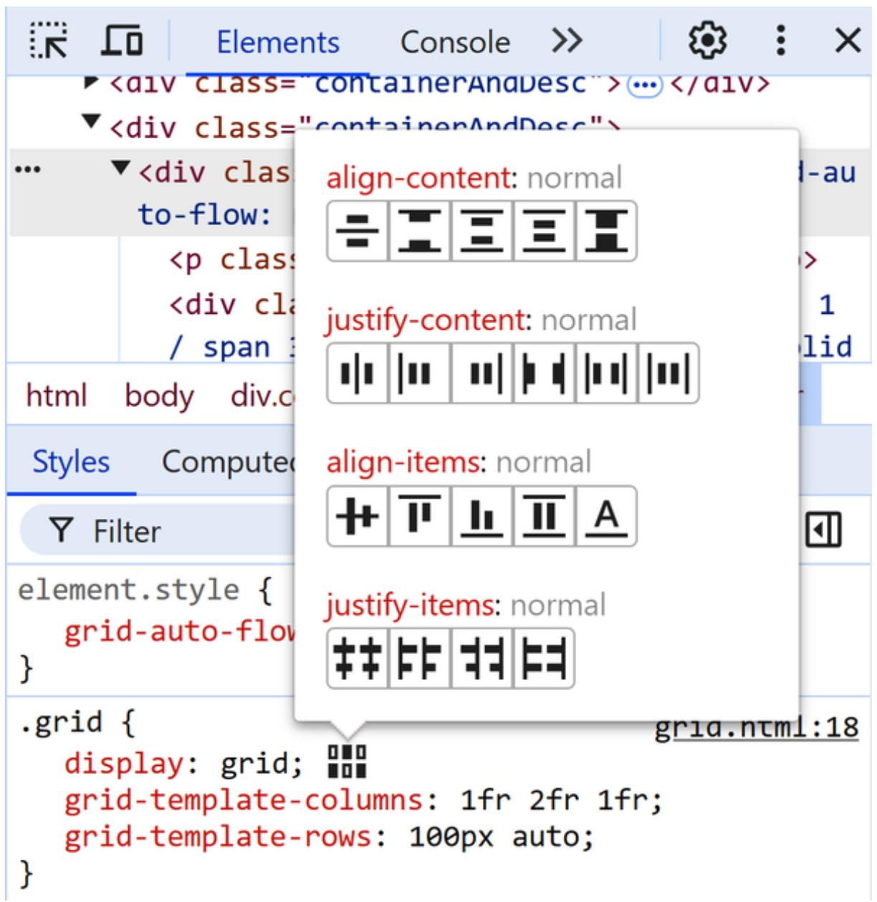

<details>
<summary>text_image</summary>

<div class="containerAndDesc">...</div>
<div class="containerAndDesc">
... 
<div clas
to-flow:
<p clas
<div cla
/ span:
align-content: normal
=  I  E  I  I
justify-content: normal
|| | || | | | | | |
align-items: normal
+   T   L   I   I   A
justify-items: normal
++   F   F   F
. grid {
display: grid;
grid-template-columns: 1fr 2fr 1fr;
grid-template-rows: 100px auto;
}
grid.html:18
</details>

Figure 18-25. Grid editor in Chrome developer tools

### Grid Columns and Rows

Within a container you can define the structure of your grid by specifying the number and size of columns and rows using properties like grid-template-columns and grid-template-rows. You define the size of columns and rows in any standard CSS units, as in the following, which sets up three columns with the middle one twice as wide as the others, and two rows with fixed 100px and auto sizing:

grid-template-columns : 1fr 2fr 1fr;

grid-template-rows : 100px auto;

You can see the result and the grid itself in Figure 18-26.

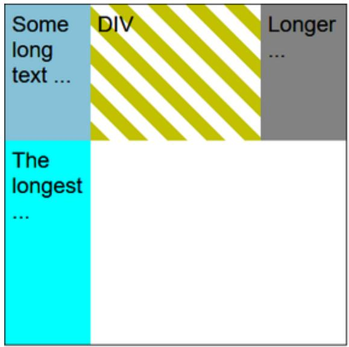

<details>
<summary>text_image</summary>

Some
long
text ...
DIV
Longer
...
The
longest
...
</details>

With display: grid  
Columns: 1fr 2fr 1fr  
Rows: 100px auto

<table><tr><td>Some long text ...</td><td>DIV</td><td>Longer ...</td></tr><tr><td>The longest ...</td><td></td><td></td></tr></table>

The $3 \times 2$ grid  
Columns: 1fr 2fr 1fr  
Rows: 100px auto  
Figure 18-26. Creating a grid with the grid-template-column and grid-template-rows properties

### Grid Flow

The flow direction of a grid is specified by the grid-auto-flow property, which supports these values:

ΓΟΥ

Items are placed, filling each row in turn as necessary (default).

column

Items are placed, filling each column in turn as necessary.

dense

Attempts to fill in holes earlier in the grid, if smaller items come up later.

row dense

Items are placed, filling each row and filling any earlier holes.

column dense

Items are placed, filling each column and filling any earlier holes.

The difference between row and column can be seen in Figure 18-27; notice how the second item DIV changes its position.

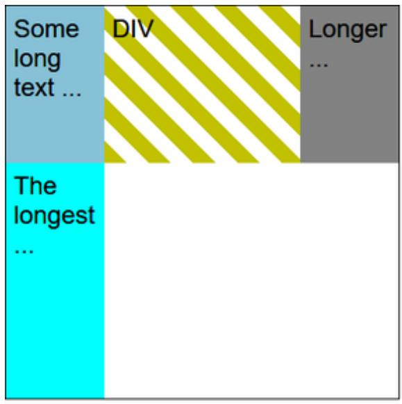

<details>
<summary>text_image</summary>

Some
long
text ...
DIV
Longer
...
The
longest
...
</details>

grid-auto-flow: row

<table><tr><td>Some long text ...</td><td>Longer ...</td><td></td></tr><tr><td>DIV</td><td>The longest ...</td><td></td></tr></table>

grid-auto-flow: column  
Figure 18-27. Setting the flow direction of the grid with the grid-auto-flow property

For example, this rule sets up a dense grid:

grid-auto-flow: dense;

### Placing Grid Items

By default, all direct children of a grid container become grid items. You can have items placed automatically, or you can explicitly place them in specific grid cells using properties such as grid-column and grid-row. Figure 18-28 shows the second item placed in the first row, spanning all three columns and shifting all the other items to the second row.

The following places the item in the second column, spanning across two rows and down two columns:

```scss
grid-column : 2 / span 2;
grid-row : 1 / span 2;
```

For precise item positioning you can use these four properties:

```txt
grid-row-start
```

Specifies a grid item's start position

```txt
grid-row-end
```

Specifies a grid item's end position

```txt
grid-column-start
```

Specifies a grid item's start position within the grid column

```txt
grid-column-end
```

Specifies a grid item's end position within the grid column

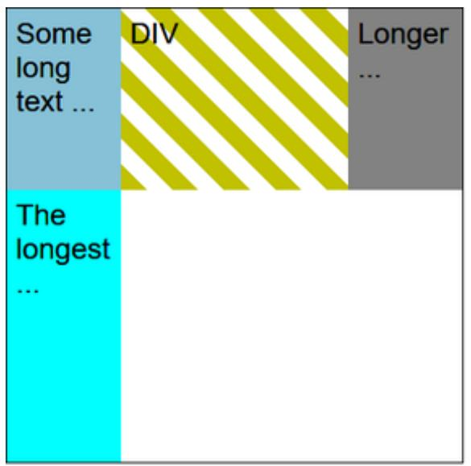

<details>
<summary>text_image</summary>

Some
long
text ...
DIV
Longer
...
The
longest
...
</details>

grid-auto-flow: row

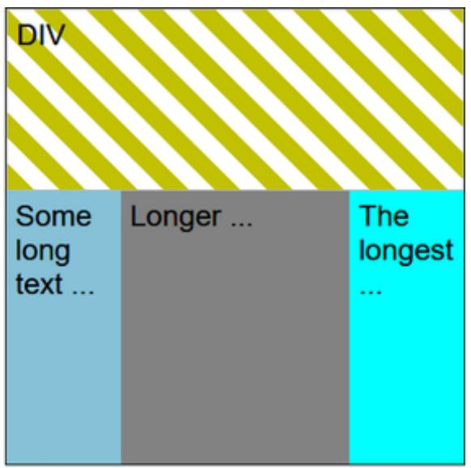

<details>
<summary>text_image</summary>

DIV
Some
long
text ...
Longer ...
The
longest
...
</details>

grid-auto-flow: row
With grid-column: 1 / span 3  
Figure 18-28. Placing the DIV into the first column, spanning all three, using the grid-column property

You can also combine these properties into a single grid-area shorthand property. For example, to make an item begin on the second row down and the second column in, and for it to extend to the fourth row down and fifth column across, you can use a rule such as this:

grid-area : 2 / 2 / 5 / 6;

### Grid Gaps

To define the spacing between grid columns and rows, you can use the gap property (or the older alias grid-gap) as seen in “Item Gaps”. Figure 18-29 shows the gap applied to the row of grid items.


<details>
<summary>text_image</summary>

Some
long
text ...
DIV
Longer
...
The
longest
...
</details>

grid-auto-flow: row

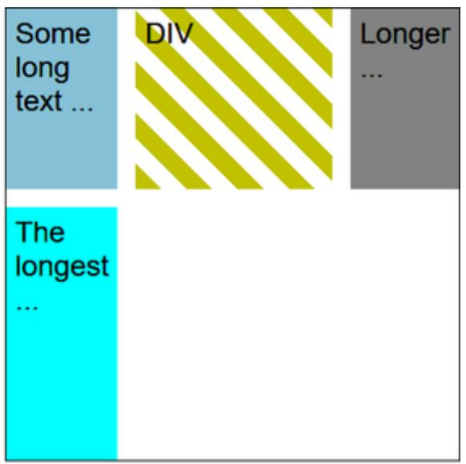

<details>
<summary>text_image</summary>

Some
long
text ...
DIV
Longer
...
The
longest
...
</details>

grid-auto-flow: row gap: 10px  
Figure 18-29. The grid item spacing set to 10 pixels with the gap property

### Alignment

To align items both vertically and horizontally you can use the justify-items and align-items properties, which support these values:

normal

This is the default, as if no justification is set; it defaults to the start edge.

start

Items are flush to each other at the start edge of the container inline axis.

end

Items are flush to each other at the end edge of the container inline axis.

center

Items are flush to each other centered on the inline axis.

left

Items are flush to each other at the start edge of the container.

right

Items are flush to each other at the end edge of the container.

space-between

Items are evenly distributed along the inline axis flush to edges.

space-around

Items are evenly distributed along the inline axis—small edge gap.

space-evenly

Items are evenly distributed along the inline axis—full edge gap.

Figure 18-30 shows items vertically centered in two rows and horizontally centered in two columns.

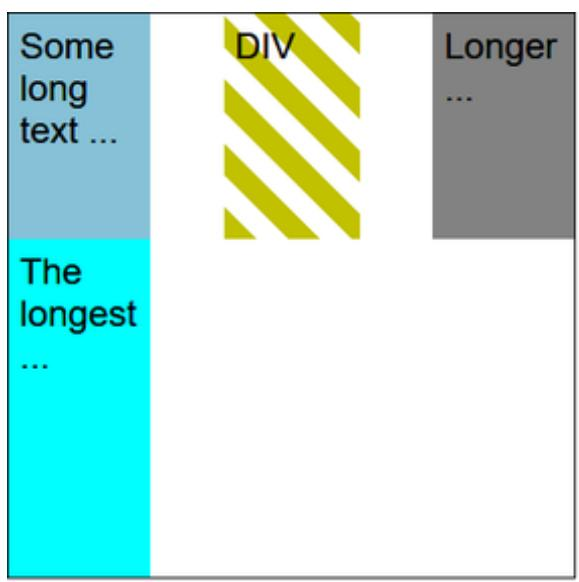

<details>
<summary>text_image</summary>

Some
long
text ...
The
longest
...
DIV
Longer
...
</details>

grid-auto-flow: row justify-items: center

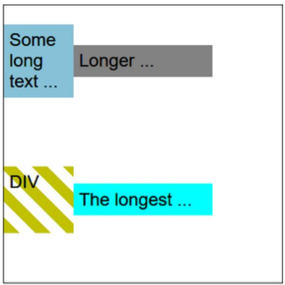

<details>
<summary>text_image</summary>

Some
long
text ...
LONGER ...
DIV The longest ...
</details>

grid-auto-flow: column
align-items: center  
Figure 18-30. The grid items aligned with the justify-items and align-items properties

The following pair of rules will center-justify all elements of a container vertically, while left aligning them in a horizontal plane:

```txt
justify-items : center;
align-items : left;
```

Full details on using CSS grid layout are available on the MDN website. In Chapter 19 we’ll start accessing CSS directly from JavaScript, but first try answering the following questions to test your knowledge, because it will be handy in Chapter 19 as well.

## Questions

1. What do the CSS attribute selector operators ^=, \$=, and \*= do?  
2. What property do you use to specify the size of a background image?  
3. With which property can you specify the radius of a border?

4. How can you flow text over multiple columns?  
5. Name the four functions you can use to specify CSS colors.  
6. How would you create a gray shadow under some text, offset diagonally to the bottom right by 5 pixels, with a blurring of 3 pixels?

7. How can you indicate with an ellipsis that text is truncated?

8. How can you include a Google web font in a web page?

9. What CSS declaration would you use to rotate an object by 90 degrees?

10. How do you set up a transition on an object so that when any of its properties are changed, the change will transition linearly in a half-second?

11. How do you create a flexbox container?

12. How do you define how flex items are spaced along the main axis of a flexbox?

13. How can you control the alignment of flex items along the cross axis of a container?

14. Which two properties determine how much a flexbox element can grow and shrink?

15. How can you change the order of elements in a flexbox container?

16. How do you set up a CSS grid layout?

17. How do you specify the flow direction of a grid container?

18. Which two properties can you use to place items into a grid?

19. Which property allows you to set the gap spacing of a grid, and what is the alternate older name of this property?

20. Which two properties can you use to align grid items vertically and horizontally?

See “Chapter 18 Answers” in the Appendix A for the answers to these questions.

# Chapter 19. Accessing CSS from JavaScript

Now that you have a good understanding of the DOM and CSS, you’ll learn in this chapter how to access both the DOM and CSS directly from JavaScript, enabling you to create highly dynamic, responsive websites.

I'll also show you how to use time-based events so you can create animations or provide any code that must continue running (such as a clock). Finally, I'll explain how you can add new elements to or remove existing ones from the DOM so you don't have to precreate elements in HTML just in case JavaScript might need to access them later.

## Revisiting the getElementById Function

To help with the examples in the rest of this book, I will provide an abbreviated version of the getElementById function (which returns an element object when passed an ID name). This will allow for handling DOM elements and CSS styles quickly and efficiently, without needing to include a framework such as jQuery.

I've selected a name that is short to type yet it still explains what the function does: it returns an object represented by the ID passed to the function when called.

**NOTE**

It is highly unlikely you will use the following functions in development code, because you likely will have a custom-made or third-party framework to provide this functionality, plus a whole lot more. But they serve to keep the examples in this book short and easy to follow, as well as being a simple example of how new JavaScript functions can be added.

### The byld Function

You can see the bare-bones byId function in Example 19-1. The abbreviated version alone saves 19 characters of typing each time it's called.

Example 19-1. The byId function  
```javascript
function byId(id)
{
    return document.getElementById(id)
}
```

### The style Function

The partner function, called style, gives you easy access to the style (or CSS) properties of an object, and is shown in Example 19-2.

Example 19-2. The style function  
```javascript
function style(selector)
{
    return document.querySelector(selector).style
}
```

This function performs the task of returning the style property (or subobject) of the element referred to. Because it uses

the document.querySelector function which uses a CSS selector to find the element to return, you can pass an ID (for example #myobject), class name (for example .myclass), or any other valid CSS selector. If the document has more than one element that matches, for example multiple elements with class="myclass", the document.querySelector function, and the style function, it returns only the first element.

Let's look at what's going on here by taking a <div> element with the ID of myobj and setting its text color to green, like this:

```html
<div id='myobj'>Some text</div>
<script>
byId('myobj').style.color = 'green'
</script>
```

The preceding code will do the job, but it's much simpler to call the new style function, like this:

```coffeescript
style('#myobj').color = 'green'
```

Remember that you have to prefix the ID with #. Otherwise, the style function will be looking for a <myobj> element, which is not what you want.

### The by Function

So far I’ve provided two simple functions that make it easy for you to access any element on a web page and any style property of an element. Sometimes, though, you will want to access more than one element at a time. You can do this by assigning a CSS class name to each such element, like in these examples, both of which employ the class myclass:

```txt
<div class='myclass'>Div contents</div>
<p class='myclass'>Paragraph contents</p>
```

If you want to access all elements on a page that use a particular class, you can use the by function, shown in Example 19-3, which uses the document.querySelectorAll function to return an array containing all the objects that match the selector provided. Similar to the document.querySelector function, the selector must be a valid CSS selector and can be a class name prefixed with a dot (like .myclass), or a tag name (like td).

```javascript
function by(selector)
{
    return document.querySelectorAll(selector)
}
```

To use this function, simply call it as follows, saving the returned array so that you can access each of the elements individually as required or (more likely the case) en masse via a loop:

```python
myarray = by('.myclass')
```

Now you can do whatever you like with the objects returned, such as (for example) setting their textDecoration style property to underline:

```javascript
for (i = 0 ; i < myarray.length ; ++i)
    myarray[i].style.textDecoration = 'underline'
```

This code iterates through the objects in myarray[] and then each one's style property, setting its textDecoration property to underline.

### Including the Functions

I use the-byId and style functions in the examples for the remainder of this chapter, as they make the code shorter and easier to follow. Therefore, I have saved them in the file functions.js (along with the by function, which I think you’ll find extremely useful) in the Chapter 19 folder of the accompanying archive of examples, freely downloadable from the book’s example repository.

You can include these functions in any web page by using the following statement, preferably in its <head> section, anywhere before any script that relies on calling them:

```txt
<script src='functions.js'></script>
```

The contents of functions.js are shown in Example 19-4.

Example 19-4. The functions.js file

```javascript
function byId(id)
{
    return document.getElementById(id)
}

function style(selector)
{
    return document.querySelector(selector).style
}

function by(selector)
{
    return document.querySelectorAll(selector)
}
```