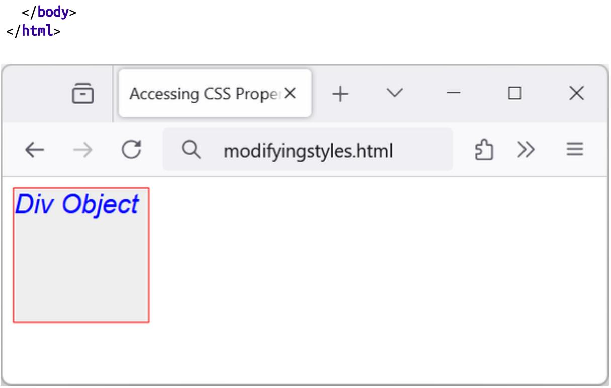
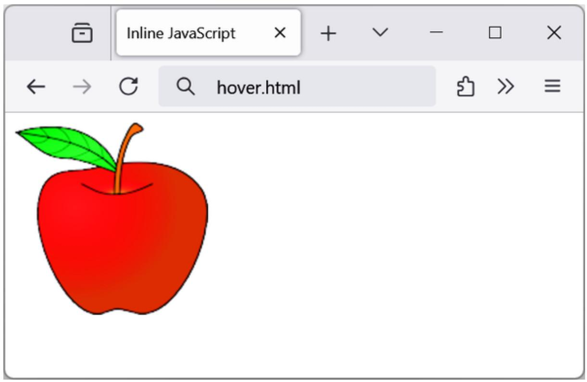
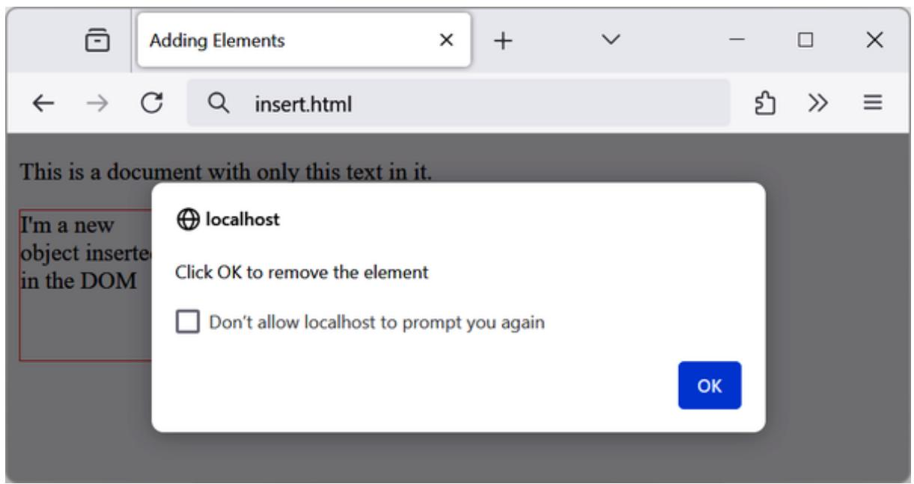
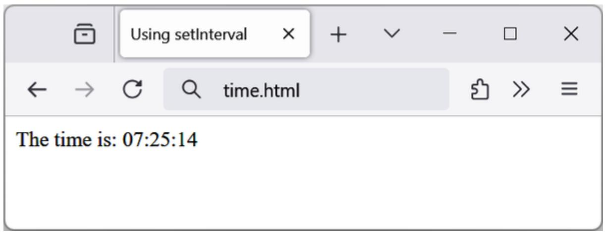
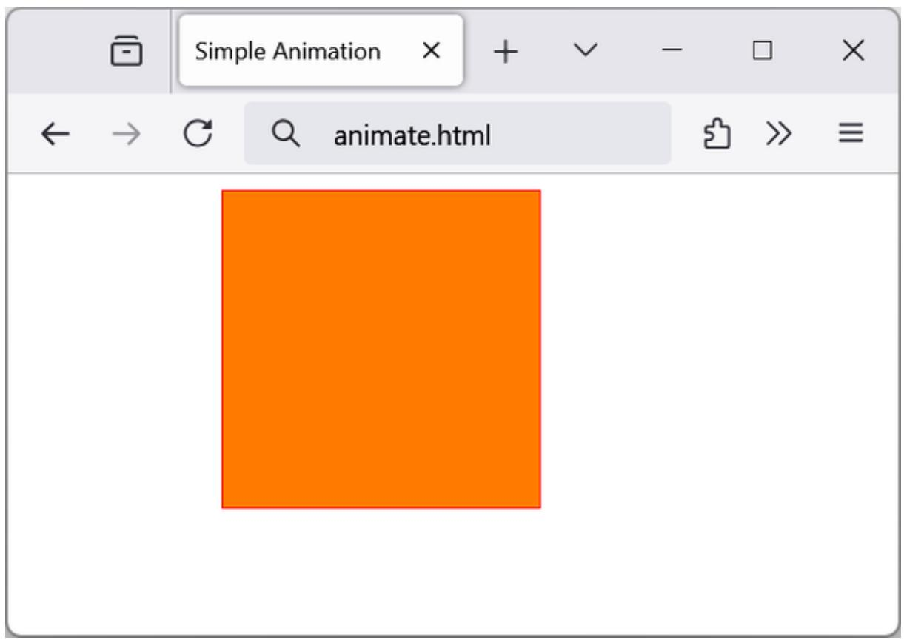

## Accessing CSS Properties from JavaScript

The textDecoration property I used in an earlier example represents a CSS property normally hyphenated like this: text-decoration. But since JavaScript reserves the hyphen character for use as a mathematical operator, whenever you access a hyphenated CSS property, you must convert the name to follow the camelCase notation, that is, to omit the hyphen and set the character immediately following it to uppercase.

Another example of this is the font-size property, which is referenced in JavaScript as fontSize when placed after a period operator, like this:

```txt
myobject.fontSize = '16pt'
```

An alternative is to be more long-winded and use the setAttribute function, which does support (and in fact requires) standard CSS property

names, like this:

myobject.setAttribute('style', 'font-size:16pt')

### Some Common Properties

Using JavaScript, you can modify any property of any element in a web document, similar to using CSS. I’ve already shown you how to access CSS properties using either the JavaScript short form or the setAttribute function to use exact CSS property names, so I won’t detail all of the hundreds of properties. Rather, I’d like to show you how to access just a few of the CSS properties as an overview of some of the things you can do.

First, then, let's look at modifying a few CSS properties from JavaScript using Example 19-5, which loads in the three earlier functions, creates a <div> element, and then issues JavaScript statements within a <script> section of HTML to modify some of its attributes (see Figure 19-1).

Example 19-5. Accessing CSS properties from JavaScript

```txt
<!DOCTYPE html>
<html>
<head>
    <title>Accessing CSS Properties</title>
    <script src='functions.js'></script>
</head>
<body>
    <div id='object'>Div Object</div>

<script>
const o = style('#object')
o.border = 'solid 1px red'
o.width = '100px'
o.height = '100px'
o.background = '#eee'
o.color = 'blue'
o.fontSize = '15pt'
o.fontFamily = 'Helvetica'
o.fontStyle = 'italic'
</script>
```



<details>
<summary>text_image</summary>

<?body>
</html>

Accessing CSS Prope1 X
modifyingstyles.html
Div Object
</details>

Figure 19-1. Modifying styles from JavaScript

You gain nothing by modifying properties like this, because you could just as easily have included some CSS directly, but shortly we’ll be modifying properties in response to user interaction—and then you’ll see the real power of combining JavaScript and CSS.

### Other Properties

JavaScript also opens up access to a very wide range of other properties, such as the width and height of the browser window and in-browser windows or frames, plus handy information such as the parent window (if there is one) and the history of URLs visited in a session.

All these properties are accessed from the window object via the period operator (for example, window.name). Table 19-1 lists some of them and their descriptions.

Table 19-1. Some of the window properties

<table><tr><td>Property</td><td>Description</td></tr><tr><td>closed</td><td>Returns a Boolean value indicating whether or not a window has been closed</td></tr><tr><td>document</td><td>Returns the document object for the window</td></tr><tr><td>frameElement</td><td>Returns the iframe element in which the current window is inserted</td></tr><tr><td>frames</td><td>Returns an array of all the frames and iframes in the window</td></tr><tr><td>history</td><td>Returns the history object for the window</td></tr><tr><td>innerHeight</td><td>Sets or returns the inner height of a window's content area</td></tr><tr><td>innerWidth</td><td>Sets or returns the inner width of a window's content area</td></tr><tr><td>length</td><td>Returns the number of frames and iframes in a window</td></tr><tr><td>localStorage</td><td>Allows saving of key/value pairs in a web browser</td></tr><tr><td>location</td><td>Returns the location object for the window</td></tr><tr><td>name</td><td>Sets or returns the name of a window</td></tr><tr><td>navigator</td><td>Returns the navigator object for the window</td></tr><tr><td>opener</td><td>Returns a reference to the window that created the window</td></tr><tr><td>outerHeight</td><td>Sets or returns the outer height of a window, including toolbars and scroll bars</td></tr><tr><td>outerWidth</td><td>Sets or returns the outer width of a window, including toolbars and scroll bars</td></tr><tr><td>pageXOffset</td><td>Returns the number of pixels the document has been scrolled horizontally from the left of the window</td></tr><tr><td>pageYOffset</td><td>Returns the number of pixels the document has been scrolled vertically from the top of the window</td></tr><tr><td>parent</td><td>Returns the parent window of a window</td></tr><tr><td>screen</td><td>Returns the screen object for the window</td></tr><tr><td>screenLeft</td><td>Returns the x coordinate of the window relative to the screen</td></tr><tr><td>screenTop</td><td>Returns the y coordinate of the window relative to the screen</td></tr><tr><td>screenX</td><td>Returns the x coordinate of the window relative to the screen</td></tr><tr><td>screenY</td><td>Returns the y coordinate of the window relative to the screen</td></tr><tr><td>sessionStorage</td><td>Allows saving of key/value pairs in a web browser</td></tr><tr><td>self</td><td>Returns the current window</td></tr><tr><td>top</td><td>Returns the top browser window</td></tr></table>

There are a few points to note about some of these properties:

- The history object cannot be read from (so you cannot see where your visitors have been surfing). But it supports the length property to determine how long the history is, and the back, forward, and go methods to navigate to specific pages in the history.  
- When you need to know how much space is available in a current window of the web browser, just read the values in window.innerHeight and window.innerHeight. I’ve often used these values for centering in-browser alert or “confirm dialog” windows; today you can also use CSS Grid or flexbox to achieve the same positioning.  
- The screen object supports the read-only properties availHeight, availWidth, colorDepth, height, pixelDepth, and width and is therefore great for determining information about the user's display.

**NOTE**

Many of these properties are invaluable when you're targeting mobile phones and tablet devices, as they will tell you exactly how much screen space you have to work with, the type of browser being used, and more.

These few items of information will get you started and provide you with an idea of the many new and interesting things you can do with JavaScript. Far more properties and methods are available than can be covered in this chapter, but now that you know how to access and use properties, all you need is a resource listing them all. I recommend that you check out the online docs as a good starting point.

## Inline JavaScript

Using <script> tags isn't the only way you can execute JavaScript statements; you can also access JavaScript from within HTML tags, which makes for great dynamic interactivity. For example, to add a quick effect when the mouse passes over an object, you can use code such as that in the  tag in Example 19-6, which displays an apple by default but replaces it with an orange when the mouse passes over the object and restores the apple when the mouse leaves. Note the properties have a prefix before the event name, so for example when I want to add a handler for the mouseover event, I'll have to use the onMouseover property.

Example 19-6. Using inline JavaScript  
```asp
<!DOCTYPE html>
<html>
<head>
    <title>Inline JavaScript</title>
</head>
<body>
    
</body>
</html>
```

### The this Keyword

In the preceding example, you see the this keyword in use. It tells JavaScript to operate on the calling object, namely the  tag. You can see the result in Figure 19-2, where the mouse has yet to pass over the apple.



<details>
<summary>text_image</summary>

Inline JavaScript
← → Q hover.html
</details>

Figure 19-2. Inline mouse hover JavaScript example

### Attaching Events to Objects in a Script

The preceding code is the equivalent of providing an ID to the  tag and then attaching the actions to the tag's mouse events, like in Example 19-7.

Example 19-7. Noninline JavaScript

```html
<!DOCTYPE html>
<html>
<head>
    <title>Non-inline JavaScript</title>
    <script src='functions.js'></script>
</head>
<body>
    
<script>
    const o =ById('object')
    o.onmouseover = function() { this.src = 'orange.png' }
    o.onmouseout = function() { this.src = 'apple.png' }
```

```txt
</script>
</body>
</html>
```

In the HTML section, this example gives the  element an ID of object, and it then proceeds to manipulate it separately in the JavaScript section by attaching anonymous functions to each event. The on property prefix is also used here.

### Attaching to Other Events

Whether you're using inline or separate JavaScript, you can attach actions to several events, providing a wealth of additional features to offer your users. Table 19-2 lists some common events and details when they will be triggered. Note that some events can be triggered on multiple different elements and on multiple occasions. See the MDN for a full list.

Table 19-2. Events, elements they trigger on, and when

<table><tr><td>Event</td><td>Element</td><td>Occurs for example</td></tr><tr><td>abort</td><td>HTMLMediaElement</td><td>When a video's loading is stopped before completion</td></tr><tr><td>blur</td><td>Element</td><td>When an element loses focusa</td></tr><tr><td>change</td><td>HTMLElement</td><td>When any part of a form has changed</td></tr><tr><td>click</td><td>Element</td><td>When an object is clicked</td></tr><tr><td>dblclick</td><td>Element</td><td>When an object is double-clicked</td></tr><tr><td>error</td><td>Window</td><td>When a JavaScript error is encountered</td></tr><tr><td>focus</td><td>Element</td><td>When an element gets focus</td></tr><tr><td>keydown</td><td>Element</td><td>When a key is being pressed (including Shift, Alt, Ctrl, and Esc)</td></tr><tr><td>keypress</td><td>Element</td><td>When a key is being pressed (not including Shift, Alt, Ctrl, and Esc)</td></tr><tr><td>keyup</td><td>Element</td><td>When a key is released</td></tr><tr><td>load</td><td>HTMLMediaElement</td><td>When an object has loaded</td></tr><tr><td>mousedown</td><td>Element</td><td>When the mouse button is pressed over an element</td></tr><tr><td>mousemove</td><td>Element</td><td>When the mouse is moved over an element</td></tr><tr><td>mouseout</td><td>Element</td><td>When the mouse leaves an element</td></tr><tr><td>mouseover</td><td>Element</td><td>When the mouse passes over an element from outside it</td></tr><tr><td>mouseup</td><td>Element</td><td>When the mouse button is released</td></tr><tr><td>reset</td><td>HTMLFormElement</td><td>When a form is reset</td></tr><tr><td>resize</td><td>Window</td><td>When the browser is resized</td></tr><tr><td>scroll</td><td>Document</td><td>When the document is scrolled</td></tr><tr><td>select</td><td>HTMLInputElement</td><td>When some text is selected</td></tr><tr><td>submit</td><td>HTMLFormElement</td><td>When a form is submitted</td></tr></table>

a An element that has focus is one that has been clicked or otherwise entered into, such as an input field.

**WARNING**

Make sure you attach events to objects that make sense. For example, an object that is not a form will not respond to the onsubmit event.

## Adding New Elements

With JavaScript, you are not limited to manipulating the elements and objects supplied to a document in its HTML. In fact, you can create objects at will by inserting them into the DOM.

For example, suppose you need a new <div> element. Example 19-8 shows one way you can add it to a web page.

```html
<!DOCTYPE html>
<head>
    <title>Adding Elements</title>
</head>
<body>
    <p>This is a document with only this text in it.</p>

<script>
    alert('Click OK to add an element')

const newdiv = document.createElement('div')
newdiv.id = 'NewDiv'
document.body.appendChild(newdiv)

newdiv.style.border = 'solid 1px red'
newdiv.style.width = '100px'
newdiv.style.height = '100px'
newdiv.innerHTML = "I'm a new object inserted in the DOM"

setTimeout(function()
{
    alert('Click OK to remove the element')

    newdiv.parentNode Children(newdiv)
}, 1000)
</script>
</body>
</html>
```  
Figure 19-3 shows this code being used to add a new <div> element to a web document. First, the new element is created with createElement; then the appendChild function is called, and the element gets inserted into the DOM.



<details>
<summary>text_image</summary>

Adding Elements
← → ↙ insert.html
This is a document with only this text in it.
I'm a new
object inserted
in the DOM
localhost
Click OK to remove the element
Don't allow localhost to prompt you again
OK
</details>

Figure 19-3. Inserting a new element into the DOM

After this, various properties are assigned to the element, including some text for its inner content. And then, to make sure the new element is instantly revealed, a timeout is set to trigger one second in the future, delaying the running of the remaining code to give the DOM time to update and display, before popping up the alert about removing the element again. See “Using setTimeout” for more on creating and using timeouts.

This newly created element is exactly the same as if it had been included in the original HTML and has all the same properties and methods available.

**NOTE**

This is an alternative to adding an initially hidden <div> to your HTML for this purpose, and it may be a better option if you display multiple modals or display them infrequently.

### Removing Elements

You can also remove elements from the DOM, including ones that you didn't insert using JavaScript; it's even easier than adding an element. It works like this, assuming the element to remove is in the object element:

element.parentNode Children(element)

This code accesses the element's parentNode object so that it can remove the element from that node. Then it calls the removeChild method on that parent object, passing the object to be removed.

### Alternatives to Adding and Removing Elements

Inserting an element is intended for adding totally new objects into a web page. But if all you intend to do is hide and reveal objects according to a mouseover or other event, don't forget there are a couple of CSS properties you can use for this purpose, without taking such drastic measures as creating and deleting DOM elements.

There are two ways to hide and unhide an object: one uses visibility, while the other uses the display property. When you want to make an element invisible but leave it in place (and with all the elements surrounding it remaining in their positions), you can simply set the object's visibility property to hidden, like this:

myobject.visibility = 'hidden'

And to redisplay the object, you can use:

myobject.visibility = 'visible'

With the display property, you can also collapse an element to occupy zero width and height (with all the objects around it filling in the freed-up space), like this:

myobject.display = 'none'

To restore the element to its original dimensions, you would use:

```txt
myobject.display = 'block' // or for example 'flex' or 'grid'
```

And, of course, there's always the innerHTML property, with which you can change the HTML applied to an element, like this, for example:

```typescript
myelement.innerHTML = '<b>Replacement HTML</b>'
```

Or to use the byId function outlined earlier:

```txt
byId('someid').innerHTML = 'New contents'
```

Or you can make an element seem to disappear, like this:

```txt
byId('someid').innerHTML = ''
```

**NOTE**

Don't forget the other useful CSS properties you can access from JavaScript, such as opacity for setting the visibility of an object to somewhere between visible and invisible, or width and height for resizing an object. And, of course, using the position property with values of absolute, static, fixed, sticky, or relative, you can even locate an object anywhere in (or outside) the browser window that you like.

## Time-based Events

JavaScript provides access to time-based events by which you can ask the browser to call your code after a set period of time, or even to keep calling it at specified intervals. This gives you a means of handling background tasks such as asynchronous communications or even things like animating web elements.

There are two types: setTimeout and setInterval, which have accompanying clearTimeout and clearInterval functions for canceling them.

### Using setTimeout

When you call setTimeout, you pass it a function and a value in milliseconds representing how long to wait before the code should be executed, like this:

```txt
setTimeout(dothis, 5000)
```

Your dothis function might look like:

```javascript
function dothis()
{
    alert('This is your wakeup alert!');
}
```

Be aware that you need to pass a function to the setTimeout call, not the result of calling that function. Consider a code like this; you can also run it in browser console for example:

```txt
setTimeout(alert('Hello'), 5000)
```

The alert pop-up will appear immediately, not after 5 seconds like you'd probably expect. The reason is that alert('Hello') is executed immediately and the return value of the alert call is passed to setTimeout to be executed after the specified timeout, but because alert doesn't return anything, nothing will be executed after the 5-second interval.

This is why the previous example uses setTimeout(dothis, 5000), without parentheses after dothis, and not setTimeout(dothis(), 5000).

Only when you provide a function name without parentheses will its code be executed when the timeout occurs.

**Passing an arrow function**

You don't need to pass only a named function. You can also provide an anonymous arrow function to the setTimeout function, which will not be executed until the correct time. For example:

```typescript
setTimeout(() => alert('Hello!'), 5000)
```

In fact, you can provide as many lines of JavaScript code as you need in that arrow function, like this:

```javascript
setTimeout(() => {
    console.log('Starting');
    alert('Hello!')
}, 5000)
```

**DON'T PASS A STRING**

You can also pass a string value to the setTimeout function, but this has been discouraged for many years as it presents an unnecessary security risk and incurs a performance penalty. Always pass a named or an arrow function, as shown in the previous examples.

**Canceling a timeout**

Once a timeout has been set up, you can cancel it if you previously saved the value returned from the initial call to setTimeout, like this:

```javascript
timeoutID = setTimeout(dothis, 5000)
```

Armed with the value in timeoutID (sometimes called a handle), you can cancel the execution at any point until its due time:

clearTimeout(timeoutID)

When you do this, the timeout identifier is completely forgotten, and the code assigned to it will not get executed.

### Using setInterval

An easy way to set up regular execution is to use the setInterval function. It works in the same way as setTimeout, except that having executed after the interval you specify in milliseconds, it will do so again after that interval again passes, and so on forever, until you cancel it.

Example 19-9 uses this function to display a simple clock in the browser, as shown in Figure 19-4.

Example 19-9. A clock created using setInterval

```html
<!DOCTYPE html>
<html>
<head>
    <title>Using setInterval</title>
    <script src='functions.js'></script>
</head>
<body>
    The time is: <span id='time'>...</span><br>

<script>
    setInterval(() => showtime '(byId('time')), 1000)

function showtime(object)
{
    const date = new Date()
    object.innerHTML = date.toString().substr(0,8)
}
</script>
</body>
</html>
```



<details>
<summary>text_image</summary>

Using setInterval × + ∨ - □ ×
← → ○ Q time.html
The time is: 07:25:14
</details>

Figure 19-4. Maintaining the correct time with setInterval

Every time the arrow function is called, it sets the object date to the current date and time with a call to Date:

```javascript
var date = new Date()
```

Then the innerText property of the object passed to showtime (namely, object) is set to the current time in hours, minutes, and seconds, as determined by a call to the function toString. This returns a string such as 09:57:17 UTC+0530, which is then truncated to just the first eight characters with a call to the substr function:

```javascript
object.innerHTML = date.toString().substr(0,8)
```

**Using the function**

To use this function, you first have to create an object whose innerText property will be used for displaying the time, like with this HTML:

```txt
The time is: <span id='time'>...</span>
```

The value ... is simply there to show where and how the time will display. It is not necessary as it will be replaced anyway. Then, from a <script> section of code, call the setInterval function, like this:

```txt
setInterval(() => showtime(bytes('time')), 1000)
```

The script then passes an arrow function to setInterval containing the following statement, which is set to execute once a second (every 1,000 milliseconds):

```txt
showtime (byId('time'))
```

In the rare situation where somebody has disabled JavaScript (which people sometimes do for security reasons), your JavaScript will not run, and the user will just see the original ... placeholder.

**Canceling an interval**

To stop a repeating interval, when you first set up the interval with a call to the function setInterval, you must note the interval's identifier (sometimes also called a handle), like this:

```txt
intervalID = setInterval(() => showtime '(byId('time')), 1000)
```

You can stop the clock at any time by issuing this call:

```kotlin
clearInterval(intervalID)
```

You can even set up a timer to stop the clock after a certain amount of time, like this:

```javascript
setTimeout(() => clearInterval(intervalID), 10000)
```

This statement will execute the code in 10 seconds that will clear the repeating intervals.

### Using Time-Based Events for Animation

By combining a few CSS properties with a repeating code execution, you can produce all manner of animations and effects.

For example, the code in Example 19-10 moves a square shape across the top of the browser window, all the time ballooning in size, as shown in Figure 19-5; when left is reset to 0, the animation restarts.

Example 19-10. A simple animation  
```html
<!DOCTYPE html>
<html>
<head>
    <title>Simple Animation</title>
    <script src='functions.js'></script>
    <style>
    #box {
    position : absolute;
    background : orange;
    border : 1px solid red;
    }
</style>
</head>
<body>
<div id='box'></div>

<script>
    let size = 0
    let left = 0

setInterval(animate, 30)

function animate()
{
    size += 10
    left += 3

    if (size === 200) size = 0
    if (left === 600) left = 0
```

```html
const b = style('#box')
b.width = size + 'px'
b.height = size + 'px'
b.left = left + 'px'
}
</script>
</body>
</html>
```



<details>
<summary>text_image</summary>

Simple Animation
← → ↕ animate.html
</details>

Figure 19-5. This object slides in from the left while changing size

In the <head> section of the document, the box object is set to a background color of orange with a border value of 1px solid red, and its position property is set to absolute so that the animation code that follows can position it precisely.

Then, in the animate function, the global variables size and left are continuously updated and applied to the width, height, and left style attributes of the box object (with 'px' added after each to specify that the values are in pixels), thus animating it at a frequency of once every 30

milliseconds. This results in an animation rate of 33.33 frames per second (1,000/30 milliseconds).

At this point you should be able to use JavaScript to manipulate the document and the CSS to create interactive and dynamic websites. In Chapter 20 we’ll introduce React, a framework that takes all this a step further. Before moving forward, try answering the following questions to refresh what you’ve learned in this chapter.

## Questions

1. Write a function that abbreviates DOM element access by the object ID, using one of the two built-in methods.  
2. Name two ways to modify a CSS attribute of an object.  
3. Which properties provide the width and height available in a browser window?  
4. How can you make something happen when the mouse passes both over and out of an object?  
5. Which JavaScript function creates new elements, and which appends them to the DOM?  
6. How can you make an element (a) invisible and (b) collapse to zero dimensions?  
7. Which function creates a single event at a future time?  
8. Which function sets up repeating events at set intervals?  
9. What is the value of the position CSS property you can use to release an element from its location in a web page to enable it to be moved around?  
10. What delay between events should you set (in milliseconds) to achieve an animation rate of 50 frames per second?

See “Chapter 19 Answers” in the Appendix A for the answers to these questions.