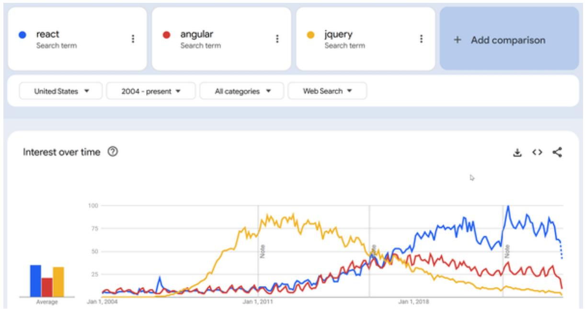

# Chapter 20. Introduction to React

When using JavaScript, HTML, and CSS to build dynamic websites, there comes a time when the creation of the code required to handle the frontend of your websites and apps can become cumbersome and overly verbose, slowing the speed of project development and potentially introducing common bugs.

This is where frameworks come in. Of course, since 2006 there’s been jQuery to help us out, and consequently it’s still installed on many production websites, although these days JavaScript has grown sufficiently in scope and flexibility that programmers need to rely on frameworks like jQuery a lot less. Also, the technology continually improves, and now there are a number of excellent options, such as Angular and, as discussed here, my preferred favorite, React.

jQuery was designed to simplify HTML DOM tree traversal and manipulation, as well as event handling, CSS animation, and Ajax, but some programmers, such as the development team at Google, felt it still wasn’t powerful enough, and they came up with Angular JS in 2010, which evolved into Angular in 2016, and which overtook jQuery around 2019.

Angular uses a hierarchy of components as its primary architectural characteristic. Google's massive AdWords platform is powered by Angular, as are Forbes, Autodesk, Indiegogo, UPS, and many others, and it is indeed extremely powerful.

Facebook had a different vision and came up with React (also known as React JS) as its framework for the development of single-page or mobile applications, basing it around the JSX extension (which stands for JavaScript XML). The React Library (first developed in 2012) divides a web page into single components, simplifying the development of the interface required to serve all of Facebook's advertising and more, and it is now widely adopted by platforms across the web, such as Dropbox, Cloudflare, Airbnb, Netflix, the BBC, PayPal, and many more household names.

Clearly, both Angular and React were driven in their creation and design by solid commercial decisions and were built to handle complex and more sophisticated websites, where it was felt that jQuery simply did not have the oomph the developers were looking for. Interestingly, another contender, the Vue framework (released in 2014), is still around and used almost as much as Angular, so you may also encounter it on certain projects.

Which is the best choice to learn more fully? Google Trends shows React to be way ahead of all the others in popularity and still growing (see Figure 20-1), while the other main frameworks have all peaked. Therefore React is covered in this book. By the way, please don’t confuse the similarly named ReactPHP with React for JavaScript, as it is an entirely separate and unconnected project.



<details>
<summary>line chart</summary>

| Date       | react | angular | jquery |
| ---------- | ----- | ------- | ------ |
| Jan 1, 2004 | 30    | 20      | 35     |
| Jan 1, 2011 | 10    | 15      | 90     |
| Jan 1, 2018 | 60    | 40      | 30     |
</details>

Figure 20-1. The popularity of React compared to other frameworks 2004 to 2024 (see a larger version of this figure in color online)

## What Is the Point of React Anyway?

React allows developers to create large web applications that can easily handle and change data, without reloading the web page that still reflects the application's current state, even if it changes. Its main raisons d'être are component-based architecture, scalability, and simplicity in handling the view layer of single-page web and mobile applications. It also enables the creation of reusable UI components and uses a virtual DOM to manage updates of the real DOM. Some people say you can use it as the V in the MVC (Model, View, Controller) architecture that separates applications into three components.

Instead of developers having to come up with various ways to describe transactions on interfaces, they can simply describe the interfaces in terms of a final state, such that when transactions happen to that state, React updates the UI for you. The net results are faster and less buggy development, speed, reliability, and scalability. Because React is a library and not a framework, learning it is also quick, with just a few functions to master. After that, it’s all down to your JavaScript skills.

The power of a framework such as React often becomes evident only after the project gets bigger. For light projects, React may not always be the best choice, especially if you are already comfortable using jQuery (or another framework), for example. One reason is the extra lines of code needed for set up. But as soon as a project requires massive scaling, with code that many developers can instantly comprehend and work on collaboratively, and with tried, tested, and debugged modules ready to quickly import, then a framework/library such as React can become invaluable.

## Accessing the React Files

React is open source and entirely free to use, and there are a number of services on the web that will serve up the latest (or any) version for you free of charge, so using it can be as easy as placing a couple of extra lines of code in your web page.

Before examining what you can do with React and how to use it, here's how you include it in a web page, pulling the files from unpkg.com:

```txt
<script src="https://unpkg.com/react/umd/react.development.js"></script>
<script src="https://unpkg.com/react-dom/umd/react-dom.development.js"></script>
```

Ideally, these lines should be placed within the <head>...</head> section of a page to ensure they are loaded before the body section. They load in the development versions of React and React DOM (a package used to access and modify the real DOM) to aid you with development and debugging. On a production website, you should replace the word development with production in these URLs, and, to speed up transfer, you can even change development to production.min, which will call up compressed versions of the files, like this:

```txt
<script src="https://unpkg.com/react/umd/react.production.min.js">
</script>
<script src="https://unpkg.com/react-dom/umd/react-dom.production.min.js">
</script>
```

For ease of access and to make the code as brief as possible, I have downloaded the latest (version 18 as I write) of the uncompressed development files to the accompanying archive of examples for this book (on GitHub) so that all the examples will load locally and look like this:

```txt
<script src="react.development.js"></script>
<script src="react-dom.development.js"></script>
```

Now that React is available to your code, we pull in the Babel JSX extension, which allows you to include XML text directly within JavaScript, making your life much easier.

**USING REACT WITHOUT JSX**

JSX is technically not necessary for React development, but unless there is a very specific reason not to use JSX, this is not recommended and would be an advanced approach.

## Including babel.js

The Babel JSX extension adds the ability for you to use XML (very similar to HTML) directly within your JavaScript, saving you from having to call a function each time. In addition, on browsers that have earlier versions of ECMAScript (the official standard of JavaScript) than 6, Babel upgrades them to handle ES6 syntax, so it provides two great benefits in one go.

Once again you can pull the file needed from the unpkg.com server, like this:

```txt
<script src="https://unpkg.com/babel-standalone/babel.min.js"></script>
```

You require only the one minimized version of the Babel code on either a development or a production server. For convenience I have also downloaded the latest version to the companion archive of example files, so examples in this book load locally and look like this:

```txt
<script src="babel.min.js"></script>
```

Now that we can access the React files, let's get on with doing something with them.

**NOTE**

This chapter is intended to teach you the basics of using React to give you a clear understanding of how and why it works and to provide you with a good starting point to take your React development further. Indeed, some of the examples in this chapter are based on (or similar to) examples you can find in the official documentation at the React website so that, should you wish to learn React in greater depth, you can visit the website and will be off to a running start. You can also browse other titles on React available on the O'Reilly Learning Platform.

## Our First React Project

Rather than teaching you all about React and JSX before actually setting about coding, let's approach it by jumping right into our first React project, as shown in Example 20-1, the result of which is to simply display the text "By Jeeves, it works!" in the browser.

Example 20-1. Our first React project  
```html
<!DOCTYPE html>
<html lang="en">
<head>
    <meta charset="utf-8">
    <title>First React Project</title>

    <script src="react.development.js"></script>
    <script src="react-dom.development.js"></script>
    <script src="babel.min.js"></script>

    <script type="text/babel">
    function One() {
    return <p>By Jeeves, it works!</p>
    }

    ReactDOM.render(<One />, document.getElementById('div1'))
</script>
</head>
<body>
    <div id="div1" style='font-family:monospace'></div>
</body>
</html>
```

This is a standard HTML document, which loads in the two React scripts and the Babel script before opening an inline script. Here is where we first need to pay attention because, instead of not specifying a type to the script tag or using type="application/javascript", the tag is given type="text/babel". The browser itself will ignore the tag because it doesn't support the type. But the Babel preprocessor will run through the script, add ES6 functionality to it if necessary, and replace any XML encountered with JavaScript function calls. Only then the contents of the script, which is now a common JavaScript, will be executed.

Within the script, a new function, One, is created, which returns the following JSX (not a string, it's not enclosed in quotes):

<p>By Jeeves, it works!</p>

Finally, within the script, the render function of the ReactDOM class is called, passing it the name of the function that returns the JSX and the element in the body of the document, which has been given the ID of div1. The result is to render the JSX into the div, which causes the browser to automatically update and display the contents, which looks like this:

By Jeeves, it works!

Immediately you should see how including the JSX within the JavaScript makes for code that is much easier and faster to write as well as easier to understand. Without the JSX extension, you would have to do all this using a sequence of JavaScript function calls.

**NOTE**

React treats components starting with lowercase letters as DOM tags. Therefore, for example, <div /> represents an HTML <div> tag, but <One /> represents a component and requires One to be in scope—you cannot use one (with a lowercase o) in the previous example and expect your code to work, as the component needs to start with uppercase and so does any reference to it.

### Using a Class Instead of a Function

You may encounter existing or legacy code that uses classes instead of functions as in Example 20-2; however, classes are not recommended for new development. The main reasons to use functions are simplicity, ease of use, and faster development.

Example 20-2. Using a class instead of a function  
```html
<!DOCTYPE html>
<html lang="en">
<head>
<meta charset="utf-8">
<title>First React Project</title>

<script src="react.development.js"></script>
<script src="react-dom.development.js"></script>
<script src="babel.min.js"></script>

<script type="text/babel">
class Two extends React.Component
{
    render()
    {
    return <p>And this, by Jove!</p>
    }
}

ReactDOM.render(<Two />, document.getElementById('div2'))
</script>
</head>
<body>
<div id="div2" style='font-family:monospace'></div>
</body>
</html>
```

The class, named Two, extends React.Component and contains a method called render that returns the JSX. The result displayed in the browser is:

And this, by Jove!

**EXAMPLES WITH ONLY THE SCRIPT AND RELEVANT ELEMENTS**

In the examples that follow, for the sake of brevity and simplicity, I will show only the contents of the Babel script and the body of the document as if they were both in the body (which works just the same), but the examples in the companion archive will be complete. So they will look like this from now on:

```html
<script type="text/babel">
    function One() {
    return <p>By Jeeves, it works!</p>
    }

    ReactDOM.render(<One/>,
    document.getElementById('div1'))
</script>

<div id="div1"></div>
```

### Pure and Impure Code: A Golden Rule

When you write a normal JavaScript function, it is possible to write either pure or impure code. Pure function code does not change its inputs, doesn't modify global variables, and doesn't have any other side effects, as in the following, which returns a value calculated from its arguments:

function mult(m1, m2) {

```lua
return m1 * m2
}
```

However, the following function is considered impure because it modifies an argument and absolutely should not be used as, or turned into, a React component:

```txt
function assign(obj, val) {
    obj.value = val
}
```

Expressed as a golden rule, all React components must act like pure functions with respect to their props, as explained in “Props and Components”. Unfortunately, React has no mechanism to prevent you from using impure functions as components. So be careful; otherwise, the function may not work as designed.

### Using Both a Class and a Function

You can, of course, use functions and classes pretty much interchangeably, as in Example 20-3.

Example 20-3. Using both classes and functions  
```html
<script type="text/babel">
    function One() {
    return <p>By Jeeves, it works!</p>
    }

    class Two extends React.Component
    {
    render()
    {
    return <p>And this, by Jove!</p>
    }
    }

    ReactDOM.render(<One />, document.getElementById('div1'))
    ReactDOM.render(<Two />, document.getElementById('div2'))
</script>
```

```txt
<div id="div1" style="font-family:monospace"></div>
<div id="div2" style="font-family:monospace"></div>
```

Here there is a function named One and class named Two, which are the same as in the previous two examples. The result of running this displays in the browser as:

By Jeeves, it works!

And this, by Jove!

### Props and Components

A great way to introduce you to what React calls props and components is to build a simple welcome page in which a name is passed to the script and then displayed. Example 20-4 shows one way to do that. Components let you split the UI into separate, reusable parts and work with each part in isolation. They are similar to JavaScript functions and accept arbitrary inputs that are called props (short for properties), returning React elements that describe how elements should appear in the browser.

Example 20-4. Passing props to a function  
```html
<script type="text/babel">
    function Welcome(props) {
    return <h1>Hello, {props.name}</h1>
    }

    ReactDOM.render(<Welcome name='Robin' />,
    document.getElementById('hello'))
</script>

<div id="hello" style='font-family:monospace'></div>
```

In this example, the Welcome function receives an argument of props, which stands for properties, and within its JSX return statement a section inside curly braces fetches the name property from the props object, like this:

return <h1>Hello, {props.name}</h1>

props is an object in React, and next you will see one way to populate it with a property.

**NOTE**

Curly braces let you embed expressions within JSX. In fact, you can place any JavaScript expression inside these curly braces and it will be evaluated (with the exception of for and if statements; however, they're not expressions and cannot be evaluated).

So, in place of props.name in this example, you could enter 76 / 13 or "decode".substr(-4) (which would evaluate to the string "code"). In this instance, however, the property name is retrieved from the props object and returned.

Finally, the render method is passed the name of the Welcome function, followed by assigning the string value 'Robin' to its name property:

ReactDOM.render(<Welcome name='Robin' />, document.getElementById('hello'))

React then renders the Welcome component (which is simply the invocation of the Welcome function), passing it {name: 'Robin'} in props. Welcome then evaluates and returns <h1>Hello, Robin</h1> as its result, which is then rendered into the div called hello and displayed in the browser like this:

Hello, Robin

To make your code tidier you can also, if you wish, first create an element containing the XML to pass to render:

```javascript
const elem = <Welcome name='Robin' />
ReactDOM.render(elem, document.getElementById('hello'))
```

### The Differences Between Using a Class and a Function

The most obvious difference between using a class and a function in React is the syntax. A function is simple JavaScript (possibly incorporating JSX), which can accept a props argument and return a component element.

A class, however, is extended from React.Component and requires a render method to return a component. But this additional code does come with benefits, in that a class allows you to use setState in your component, enabling (for example) the use of timers and other stateful features. Functions in React are called functional stateless components.

In essence, you can do pretty much everything in React using functions, especially if you use React hooks, which replace classes and come with much less additional code. You can learn about hooks in the React documentation.

## React State and Life Cycle

Let's assume you want a ticking clock to be displayed on your web page (an ordinary digital one for simplicity's sake). If you are using stateless code this is not an easy matter, but if you set up your code to retain its state, then the clock counter can be updated once per second and the time rendered equally as often. This is where you would use a class in React rather than a function. So let's build such a clock:

```txt
<script type="text/babel">
class Clock extends React.Component
{
    constructor(props)
    {
    super(props)
    this.state = {date: new Date()}
}
```

```txt
}
render()
{
    return <span> {this.state.date.toLocaleTimeString()} </span>
}
}
ReactDOM.render(<Clock />, document.getElementById('the_time'))
</script>

<p style='font-family:monospace'>The time is: <span id="the_time"></span></p>
```

This code assigns the result returned from calling the Date function to the state property of the constructor's this object, which is props. The JSX content will now be rendered whenever the class's render function is called, and, as long as it is rendered into the same DOM node, only a single instance of the class will be used.

**NOTE**

Did you see the call to super at the start of the constructor? By passing it props, it is now possible to refer to props using the this keyword within the constructor, without which call you could not.

However, as things stand, the time will be displayed only once, and then the code will stop running. So now we need to set up some time-based code to keep the date property updated, which is done by adding a life-cycle method to the class by mounting a timer using componentDidMount, like this:

```typescript
componentDidMount()
{
    this.timerID = setInterval(() => this.tick(), 1000)
}
```

We aren't quite there yet, as we still need to write the tick function, but first, to explain the preceding: mounting is the term React uses to describe the action of adding nodes to the DOM. A class's componentDidMount method is always called if the component is mounted successfully, so it's the ideal place to set up a timer, and, indeed, in the preceding code, this.timerID is assigned the ID returned by calling the setInterval function, passing it the method this.tick to be called every 1,000 milliseconds (once per second).

When a timer is mounted, we must also provide a means for it to be unmounted. In this case when the DOM produced by Clock is removed (that is, the component is unmounted), the method and code we use to stop the timer looks like this:

```kotlin
componentWillUnmount()
{
    clearInterval(this.timerID)
}
```

Here, componentWillUnmount is called by React when the DOM is removed; thus, this is where we place the code to clear the interval stored in this.timerID, which instantly stops tick from being called.

The last piece of the puzzle is the time-based code to be called every 1,000 milliseconds, which is in the method tick:

```javascript
tick()
{
    this.setState({date: new Date()})
}
```

Here the React setState function is called to update the value in the state property with the latest result of calling the Date function once every second.

All this code together in one example is shown in Example 20-5.

```txt
<script type="text/babel">
    class Clock extends React.Component
    {
    constructor(props)
    {
    super(props)
    this.state = {date: new Date()}
    }

    componentDidMount()
    {
    this.timerID = setInterval(() => this.tick(), 1000)
    }

    componentWillUnmount()
    {
    clearInterval(this.timerID)
    }

    tick()
    {
    this.setState({date: new Date()})
    }

    render()
    {
    return <span> {this.state.date.toLocaleTimeString()} </span>
    }
}

ReactDOM.render(<Clock />, document.getElementById('the_time'))
</script>

<p style='font-family:monospace'>The time is: <span id="the_time"></span></p>
```

With the Clock class now complete with a constructor, a timer starter and stopper, a method to update the state property using the timer, and a render function, all that is needed is to call the render method to get the whole thing ticking away, as smooth as clockwork! The result looks like this in the browser:

The clock is automatically updated to screen each time the setState function is called, because components are re-rendered by this function, so you don't have to worry about doing this with your code.

**NOTE**

After the initial state setup, setState is the only legitimate way to update state, because simply modifying a state directly will not cause a component to be re-rendered.

Remember that the only place you can assign this.state is in the constructor. React can bundle multiple setState calls into a single update.

## Events in React

In React, events are named using camelCase, and you use JSX to pass a function as the event handler. Also, React events do not work in exactly the same way as native JavaScript events, in that your handlers are passed instances of a cross-browser wrapper around the browser's native event called syntheticEvent. The reason for this is that React normalizes events to have consistent properties across different browsers. Should you need access to the browser event, however, you can always use the nativeEvent attribute to reach it.

To illustrate the use of events in React, Example 20-6 shows an onClick event that removes or redisplays some text when clicked.

Example 20-6. Setting up an event  
```javascript
<script type="text/babel">
class Toggle extends React.Component
{
    constructor(props)
    {
    super(props)
    this.state = {isVisible: true}
```

```txt
062 001 999 815.000
```

In the constructor of a new class called Toggle, an isVisible property is set to true and assigned to this.state:

```javascript
this.state = {isVisible: true}
```

Then an event handler called handleClick is attached to this using the bind method:

```javascript
this.handleClick = this.handleClick.bind(this)
```

With the constructor finished, the handleClick event handler is next. This has a single-line command to toggle the state of isVisible between true and false:

this.setState(state => ({{isVisible: !state.isVisible}}))

Last, there's the call to the render method, which returns two elements wrapped inside a <div>. It's done this way because render can return only a single component (or XML tag), so the two elements are wrapped into a single element to satisfy that requirement.

The elements returned are a button, which displays either the text DISPLAY if the following text is currently hidden (that is, isVisible is set to false) or HIDE if isVisible is set to true and the text is currently visible.

Following this button, some text is displayed underneath if isVisible is true; otherwise, nothing is shown (in fact, an empty string is returned, which is the same thing).

To decide what button text to display, or whether or not to show the text, the ternary operator is used, which you will recall follows the syntax:

expression ? return this if true : or this if false.

This is done by the single-word expression of the variable show (which retrieved its value from this.state.isVisible). If it evaluates to true, then the button shows HIDE and the text is displayed; otherwise, the button shows DISPLAY and the text is not displayed. When loaded into the browser, the result looks like this (where [HIDE] and [DISPLAY] are buttons):

[ HIDE ]

Here is some text

When the button is pressed, it changes to just the following:

[DISPLAY]

**USING JSX OVER MULTIPLE LINES**

Although you can split your JSX across many lines to improve readability, as in the previous example, the one thing you may not do is move the parenthesis following the return command down a line (or anywhere else). It must stay in its place following return or syntax errors will be reported. The closing parenthesis may, however, appear where you wish.

## Inline JSX Conditional Statements

In JSX there is a way to return only XML if a condition is true, thus enabling conditional rendering. This is achieved because true && expression evaluates to expression, while false && expression evaluates to false.

Therefore, for example, Example 20-7 sets up two variables as if they are in part of a game. this.highScore is set to 90, and this.currentScore is set to 100.

Example 20-7. A conditional JSX statement  
```javascript
<script type="text/babel">
class Setup extends React.Component
{
    constructor(props)
    {
    super(props)
    this.highScore = 90
    this.currentScore = 100
    }

    render()
    {
    return (
    <div>
    {
    this.currentScore > this.highScore &&
    <h1>New High Score</h1>
    }
    </div>
    )
}
```

```html
}
}
ReactDOM.render(<Setup />, document.getElementById('display'))
</script>
<div id='display' style='font-family:monospace'></div>
```

In this instance, if this.currentScore is greater than this.highScore, then the h1 element is returned; otherwise, false is returned. The result of the code looks like this in the browser:

New High Score

Of course, in an actual game you would then proceed to set this.highScore to the value in this.currentScore and would probably do a few other things, too, before going back to the game code.

So, wherever something should be displayed only upon a condition being true, the && operator is a great way to achieve this. And, of course, you have just seen (near the end of “Events in React”) how you can also create an if...then...else block in JSX using a ternary (? :) expression.

**NOTE**

React will not render the literal falsy values undefined, null, or false, but it will render the numeric value 0 even though the value 0 is also falsy. Consider the following code that will render “non-zero” when x is, for example, 5:

```json
{x && <p>non-zero</p>}
```

But it will render 0 when x is zero, which may not be what you want. If you want React to render nothing instead of 0, the easiest way to do that is to make sure the expression evaluates to literal false:

```txt
{x != 0 && <p>non-zero</p>}
```

## Using Lists and Keys

Displaying lists using React is a breeze. In Example 20-8 the array cats contains a list of four types of cat. This is then extracted in the following line of code using the map function, which iterates through the array, returning each item in turn in the variable cat. This results in each iteration being embedded in a pair of <li>...</li> tags and then appended to the listOfCats string.

Example 20-8. Displaying a list  
```html
<script type="text/babel">
    const cats = ['lion', 'tiger', 'cheetah', 'lynx']
    const listOfCats = cats.map((cat) => <li>{cat}</li>)
    ReactDOM.render(<ul>{listOfCats}</ul>, document.getElementById('display'))
</script>
<div id='display' style='font-family:monospace'></div>
```

Finally, ReactDOM.render is called, embedding listOfCats within a pair of <ul>...</ul> tags; the result displays like this:

- lion  
- tiger  
- cheetah  
- lynx

## Unique Keys

If your JavaScript console was open when you ran Example 20-8 (press Ctrl-Shift-J or Option-Command-J on a Mac), you may have noticed the warning message “Each child in a list should have a unique ‘key’ prop.”

Although it’s not required, React works best when you supply a unique key for each sibling list item, which helps it to find references to the appropriate DOM nodes and, when you make a small change, allows for making minor adjustments to the DOM, rather than requiring re-rendering of larger sections. Example 20-9 shows how to provide such a key.

Example 20-9. Using unique keys  
```html
<script type="text/babel">
    const cats = ['lion', 'tiger', 'cheetah', 'lynx']
    const listOfCats = cats.map((cat, i) => <li key={i}>{cat}</li>)
    ReactDOM.render(<ul>{listOfCats}</ul>, document.getElementById('display'))
</script>
<div id='display' style='font-family:monospace'></div>
```

In this example, the arrow function passed to map has a second parameter called i in which the array index will be passed and used for the item key. The displayed output is the same as the previous example, but if you would like to see the keys (just out of interest), you can change the contents of the li element from {cat} to {i + ' ' + cat}, and you will see the following displayed:

- 0 lion  
• 1 tiger  
• 2 cheetah  
• 3 lynx

But what is the point of this, you may ask? Well, consider the case of the following list structure:

```txt
<ul> // Cities In Europe
<li>Birmingham</li>
<li>Paris</li>
<li>Milan</li>
<li>Vienna</li>
</ul>
<ul> // Cities in the USA
<li>Cincinnati</li>
<li>Paris</li>
<li>Chicago</li>
<li>Birmingham</li>
</ul>
```

Here are two sets of lists, each with four unique siblings, but between the lists, both the city names of “Birmingham” and “Paris” are shared at the same level of nesting. When React performs certain reconciliation actions (after reordering or modifying an element perhaps), there are instances when you can gain speed and possibly avoid problems when sibling list items at the same level share the same values. To do this you can provide unique keys for all siblings, which, to React, looks like this:

```html
<ul> // Cities In Europe
<li key="1">Birmingham</li>
<li key="2">Paris</li>
<li key="3">Milan</li>
<li key="4">Vienna</li>
</ul>
<ul> // Cities in the USA
<li key="5">Cincinnati</li>
<li key="6">Paris</li>
<li key="7">Chicago</li>
```

```txt
<li key="8">Birmingham</li>
</ul>
```

Now there is no possibility of confusing Paris in Europe with Paris in the USA (or at least of having to work harder to locate and possibly re-render the correct DOM node), as each array element has a different unique ID for React.

**NOTE**

Don't worry too much about why you are creating these unique keys. Just remember that React works best when you do so, and a good rule to follow is that elements within a map call will need keys. Also, you can reuse your keys for different sets of siblings that are not related in any way. However, you may not have to create your own keys because the data you are working with could well supply them for you, such as book ISBN numbers. As a last resort, you can simply use the index of an item as its key, but reorders could be slow, and you could encounter other issues, so creating your own keys to control what they contain is usually the best option.

## Handling Forms

In React, <input type='text'>, <textarea>, and <select> all work similarly because React's internal state becomes what is known as the "source of truth," and these components are therefore called controlled.

With a controlled component, the input's value is always driven by the React state. This does mean that you need to write a bit more code in React, but the end benefit is that you can then pass values to other UI elements or access them from event handlers.

Normally, without React or any other framework or library loaded, form elements maintain their own state, which is updated based on input received from the user. In React, the mutable state is typically kept in the state property of components and should only be updated using the setState function.

### Using Text Input

Let's look at these three input types, starting with a simple text input:

```txt
<form>
    Name: <input type='text' name='name'>
    <input type='submit'>
</form>
```

This code requests a string of characters to be input, which is then submitted when the submit button is clicked (or the Enter or Return key pressed). Now let's change this to a controlled React component (Example 20-10).

Example 20-10. Using text input  
```javascript
<script type="text/babel">
class GetName extends React.Component
{
    constructor(props)
    {
    super(props)
    this.state = {value: ''}
    this.onChange = this.onChange.bind(this)
    this.onSubmit = this.onSubmit.bind(this)
    }

    onChange(event)
    {
    this.setState({value: event.target.value})
    }

    onSubmit(event)
    {
    alert('You submitted: ' + this.state.value)
    event.preventDefault()
    }

    render()
    {
    return (
    <form onSubmit={this.onSubmit}>
    <label>
    Name:
    )
```

```txt
<input type="text" value={this.state.value}
    onChange={this小幅Change} />
</label>
<input type="submit" />
</form>
)
}
}
ReactDOM.render(<GetName />, document.getElementById('display'))
</script>

<div id='display' style='font-family:monospace'></div>
```

Let me take you through this part by part. First we create a new class called GetName, which will be used to create a form that will prompt for a name to be entered. This class contains two event handlers called onChange and onSubmit. These local handlers are set to override the standard JavaScript handlers of the same named events by using the calls to bind in the constructor, which is also the place the value in value is initialized to the empty string.

When called on the change event, the new onChange handler calls the setState function to update value whenever the input is changed, so that value is always kept up-to-date with the contents in the input field.

When the submit event is triggered, it is handled by the new onSubmit handler, which in this instance issues a pop-up alert window so that we can see it has worked. Because we are dealing with the event and not the system, the event is then prevented from bubbling through to the system by calling preventDefault.

Finally, the render method contains all the HTML code to be rendered into the display <div>. Of course, we use HTML formatted as XML to do this, as that is what Babel expects (namely JSX syntax). In this instance, it simply requires the additional self-closing of the input elements with />.

**NOTE**

We have not globally overridden the onChange and onSubmit events, because we have bound events issued by the rendered code only to local event handlers within the GetName class, so it is safe to use the same names for our event handlers, which helps make our code's purpose more immediately obvious to other developers. But if there is ever any doubt, you might prefer to use different names for your handlers, such as actOnSubmit, etc.

So, as you should see by now, this.state.value will always reflect the state of the input field because, as noted earlier, with a controlled component, value is always driven by the React state.

### Using textarea

One of the ideas behind using React is to maintain cross-browser control over the DOM for quick and simple access as well as to streamline and simplify the development process. By using controlled components, we are in control at all times and can make inputting data of all types work in similar ways.

In Example 20-11, the previous example has been modified to use a <textarea> element for input.

Example 20-11. Using textarea  
```javascript
<script type="text/babel">
class GetText extends React.Component
{
    constructor(props)
    {
    super(props)
    this.state = {value: ''}
    this.onChange = this.onChange.bind(this)
    this.onSubmit = this.onSubmit.bind(this)
    }

    onChange(event)
    {
    this.setState({value: event.target.value})
```

```javascript
onSubmit(event)
{
    alert('You submitted: ' + this.state.value)
    event.preventDefault()
}

render()
{
    return (
    <form onSubmit={this.onSubmit}>
    <label>
    Enter some text:<br />
    <textarea rows='5' cols='40' value={this.state.value}
    onChange={thisonChange} />
    </label><br />
    <input type="submit" />
    </form>
    )
}
}

ReactDOM.render(<GetText />, document.getElementById('display'))
</script>

<div id='display' style='font-family:monospace'></div>
```

This code is very similar to the text input example, with a few simple changes: this class is now called GetText, the text input in the render method is replaced with a <textarea> element that has been set to 40 columns wide by 5 rows high, and a couple of <br> elements have been added for formatting. And that's it—nothing else has required changing to enable us to have full control over the <textarea> input field. As with the previous example, this.state.value will always reflect the state of the input field.

Of course, this type of input supports the use of Enter or Return to input carriage returns into the field, so now the input can only be submitted by clicking the button.

### Using select

Before showing how to use <select> in React, let's first look at a typical snippet of HTML code that offers a few countries from which the user must choose, with USA being the default selection:

```xml
<select>
    <option value="Australia">Australia</option>
    <option value="Canada">Canada</option>
    <option value="UK">United Kingdom</option>
    <option selected value="USA">United States</option>
</select>
```

In React this needs to be handled slightly differently because it uses a value attribute on the select element instead of the selected attribute applied to an option sub-element, as in Example 20-12.

Example 20-12. Using select  
```javascript
<script type="text/babel">
class GetCountry extends React.Component
{
    constructor(props)
    {
    super(props)
    this.state = {value: 'USA'}
    this.onChange = this.onChange.bind(this)
    this.onSubmit = this.onSubmit.bind(this)
    }

    onChange(event)
    {
    this.setState({value: event.target.value})
    }

    onSubmit(event)
    {
    alert('You selected: ' + this.state.value)
    event.preventDefault()
    }

    render()
    {
    return (
    <form onSubmit={this.onSubmit}>
```

```txt
<label>
    Select a country:
    <select value={this.state.value}
    onChange={this.onChange}>
    <option value="Australia">Australia</option>
    <option value="Canada" >Canada</option>
    <option value="UK" >United Kingdom</option>
    <option value="USA" >United States</option>
    </select>
    </label>
    <input type="submit" />
    </form>
    )
    }
}

ReactDOM.render(<GetCountry />, document.getElementById('display'))
</script>

<div id='display' style='font-family:monospace'></div>
```

Once again you will see that very little has changed in this example other than the new class name of GetCountry, that this.state.value is assigned the default value of 'USA', and that the input type is now a <select> but without a selected attribute.

Just as with the previous two examples, this.state.value always reflects the state of the input.

## React Native

React also has a companion product called React Native. With it you can create full-blown applications for both iOS and Android phones and tablets, just using the JSX extended JavaScript language and without needing to understand Java or Kotlin (for Android) or Objective-C or Swift (for iOS).

Full details and explanations of how to do all this and have your apps up and running on a wide range of mobile devices are beyond the scope of this book, but you can work through the tutorial on the React Native website, noting the differences between building apps on Windows and on macOS.

You’ve learned the basics of how to set up and use React, but you can do a great deal more with it (especially if you intend to build React Native apps with it) that is sadly beyond the scope of this book. To continue your React journey, you can visit the react.dev web page, where you can review some of the things discussed here before moving on to applying CSS styles to elements and many even more powerful features.

Remember that you can download all the samples from this chapter (and this book as a whole) on GitHub.

So, with React now in your toolkit (at least enough to get you up and running), let's move to Chapter 21 and all the goodies that HTML brings. But first, try answering the following questions to test your React knowledge.

## Questions

1. What are the main two ways you can incorporate the React scripts in your web page?  
2. How is XML incorporated into JavaScript for use with React?  
3. Instead of <script type="application/javascript">, what value for type should you use for your JSX JavaScript code?  
4. What are two different ways you can extend React to your code?  
5. In React, what is meant by pure and impure code?  
6. How does React keep track of state?  
7. How can you embed an expression within JSX code?  
8. How can you change the state of a value once a class has been constructed?  
9. What must you first do to enable referring to props using the this keyword within a constructor?

10. How can you create a conditional statement in JSX?

See “Chapter 20 Answers” in the Appendix A for the answers to these questions.