# Chapter 21. Introduction to Node.js

Node.js is an open source, cross-platform JavaScript runtime environment that was built on Chrome's V8 JavaScript engine by Ryan Dahl in 2009. It allows developers to execute JavaScript code on the server side, meaning you can run JavaScript both within and outside the web browser.

According to W3Techs, at the time of writing, Node.js is used by 3.5% of websites. This may not sound like much, but a year ago it was 2%, which represents a stunning growth rate of 150% in a year. What’s more, it’s most frequently used on very high-traffic sites such as X/Twitter, Netflix, GitHub, Spotify, TikTok, eBay, Reddit, and over 30 million other equally and less well-known properties. To make an educated guess and extrapolate this usage into potential market share over the next few years, it’s possible that Node.js could be implemented on up to a quarter of all web properties by the 2030s.

Node.js uses an event-driven, nonblocking model, whereas web servers like Apache use a synchronous request-response model, which means each incoming request is processed in a separate thread, and the thread is blocked until the response is ready. Node.js handles requests asynchronously, processing connections without creating a new thread for each request. This makes it highly scalable and ideal for real-time applications, chat applications, gaming servers, and other scenarios where low latency is essential.

For example, a web server like Apache will handle a request to serve up a web page by sending the task to the computer's filesystem, then it will wait for the filesystem to return the file before opening it and sending the contents back to the requesting web browser. Node.js, on the other hand, uses events in such a way that it passes the file request off to the system and immediately goes back to listening for more incoming requests. Then, when the filesystem is ready, it uses an event to notify Node.js, which then opens the file and sends the contents to the requesting web browser.

Node.js also comes with npm (commonly understood as Node Package Manager, but officially it stands for “npm Is Not An Acronym”), a powerful program that allows developers to access and use a vast ecosystem of open source libraries and modules. This extensive collection of packages simplifies development and enables developers to leverage prebuilt solutions for common tasks, significantly speeding up the development process. The downside is that some packages are often poorly maintained, poorly documented, buggy, and may represent security threats. Blindly installing packages from npm without thinking about it can get you into trouble.

**APACHE REMAINS RELEVANT**

While Node.js is an excellent choice for building scalable, real-time applications that require both high concurrency and low latency, Apache remains a strong choice for traditional web applications and scenarios where CPU-bound processing is predominant. In some cases, developers might even choose to use both technologies, with Node.js handling real-time aspects and Apache serving static content or acting as a reverse proxy. Another popular high-performance web server you can use with PHP instead of Apache, and also as a reverse proxy for Node.js, is nginx (pronounced “engine x”).

## Installing Node.js on Windows

To use Node.js you must first install it, just as you installed AMPPS in Chapter 2. You can download the latest release at the Node.js website. You are recommended to install the LTS (Long Term Support) version because, as the name suggests, it will be supported for at least 18 months. You can always try out the latest stable version to access the newest features, but this is not recommended unless you are happy to not necessarily get long-term support for it.

**NODE.JS ON WSL**

If you're using the Windows Subsystem for Linux (WSL) you may prefer to install Node.js there instead of installing directly to Windows. This allows you to install the recommended nvm (Node Version Manager) to manage multiple active versions, for example. However, similar to the section on Linux installation later on, this is not covered here due to the many available installation options.

As of writing, the latest LTS release is version 20.17 and installers are available as msi, ZIP, or source code files. These days you are almost certain to be running a 64-bit operating system so, unless you have a good reason otherwise, Windows users should download and install the recommended msi installer, which may well be a newer version than 20.17 by the time you read this.

Once Node.js is downloaded you need to run the installer, and you should see an intro screen similar to Figure 21-1. Over the lifetime of this edition of the book the installation process for Node.js may change, so use common sense to follow through the installation if it’s much different than the following. For now, click Next to get started.

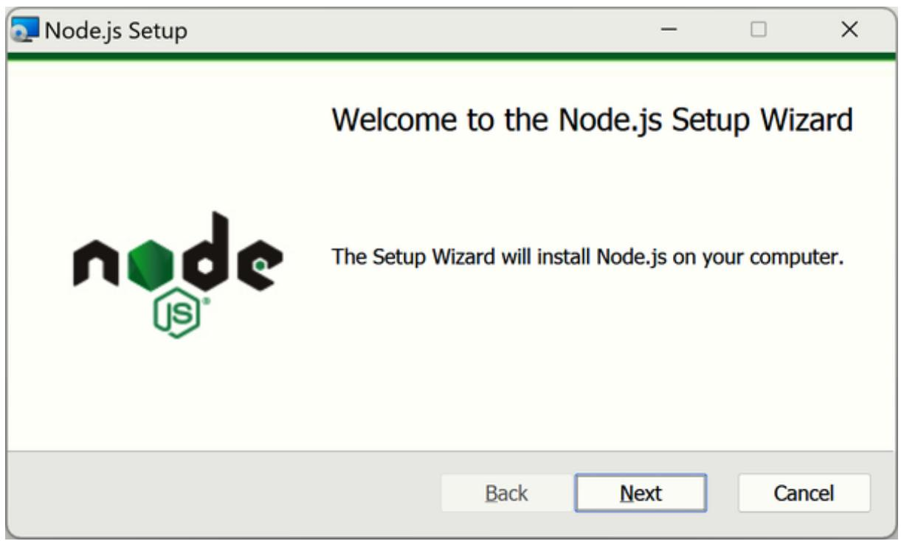

<details>
<summary>text_image</summary>

Node.js Setup
Welcome to the Node.js Setup Wizard
The Setup Wizard will install Node.js on your computer.
Back	Next	Cancel
</details>

Figure 21-1. The Node.js installation wizard

Your first decision is where you would like Node.js to be installed, as shown in Figure 21-2. In most cases you should accept the default directory offered and click Next.

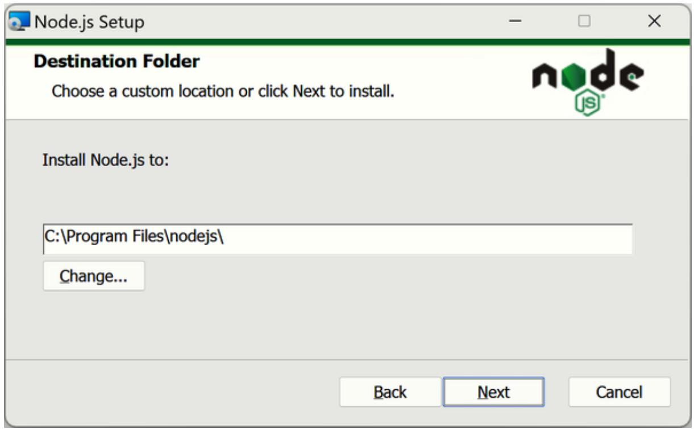

<details>
<summary>text_image</summary>

Node.js Setup
Destination Folder
Choose a custom location or click Next to install.
Install Node.js to:
C:\Program Files\nodejs\
Change...
Back	Next	Cancel
</details>

Figure 21-2. Selecting a destination installation folder

Next, you can customize the features you wish to be installed, as shown in Figure 21-3. Again, unless you have good reason otherwise, just accept the defaults offered and click Next.

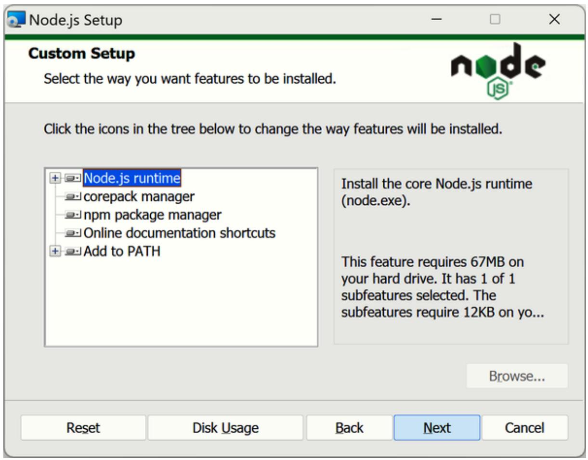

<details>
<summary>text_image</summary>

Node.js Setup
Custom Setup
Select the way you want features to be installed.
Click the icons in the tree below to change the way features will be installed.
Node.js runtime
corepack manager
npm package manager
Online documentation shortcuts
Add to PATH
Install the core Node.js runtime (node.exe).
This feature requires 67MB on your hard drive. It has 1 of 1 subfeatures selected. The subfeatures require 12KB on yo...
Browse...
Reset	Disk Usage	Back	Next	Cancel
</details>

Figure 21-3. Customizing the defaults

I do recommend that you check the box enabling installation of the tools necessary for compiling native modules, as this is a lot simpler than following the set of alternative instructions linked to, as shown in Figure 21-4. Whether or not you opt to enable this, click Next to continue.

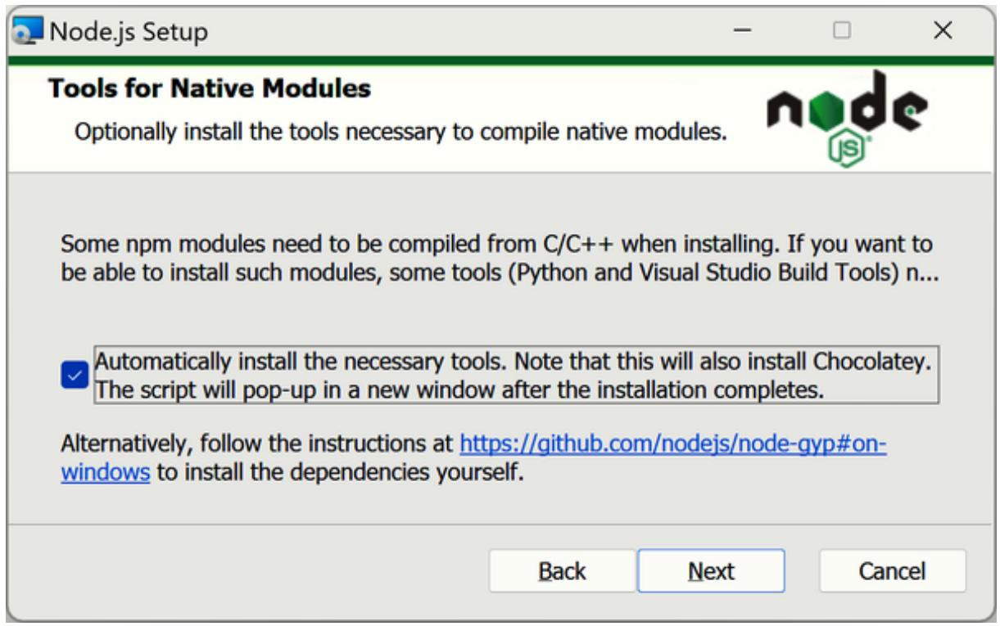

<details>
<summary>text_image</summary>

Node.js Setup
Tools for Native Modules
Optionally install the tools necessary to compile native modules.
Some npm modules need to be compiled from C/C++ when installing. If you want to be able to install such modules, some tools (Python and Visual Studio Build Tools) n...
Automatically install the necessary tools. Note that this will also install Chocolatey.
The script will pop-up in a new window after the installation completes.
Alternatively, follow the instructions at https://github.com/nodejs/node-gyp#on-windows to install the dependencies yourself.
Back	Next	Cancel
</details>

Figure 21-4. Enabling compiling of native modules

If you decide to enable the compiling of native modules then you will see a window similar to Figure 21-5, which tells you what will be installed and the resources required. Press any key when you are ready to continue.

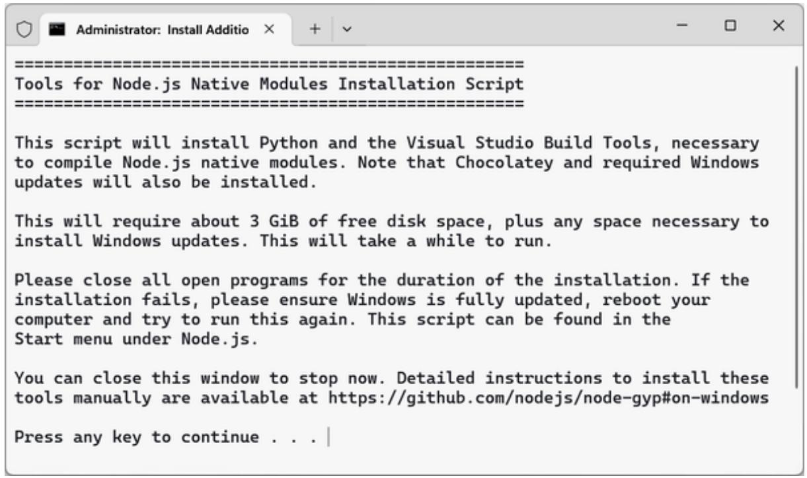

<details>
<summary>text_image</summary>

Tools for Node.js Native Modules Installation Script

This script will install Python and the Visual Studio Build Tools, necessary to compile Node.js native modules. Note that Chocolatey and required Windows updates will also be installed.

This will require about 3 GiB of free disk space, plus any space necessary to install Windows updates. This will take a while to run.

Please close all open programs for the duration of the installation. If the installation fails, please ensure Windows is fully updated, reboot your computer and try to run this again. This script can be found in the Start menu under Node.js.

You can close this window to stop now. Detailed instructions to install these tools manually are available at https://github.com/nodejs/node-gyp#on-windows

Press any key to continue . . .
</details>

Figure 21-5. Installing the tools for Node.js

If you are installing the native module compilation support, a PowerShell window will open, as shown in Figure 21-6, in which you can watch the installation process. Once the installation is finished you can press Enter and installation should be complete.

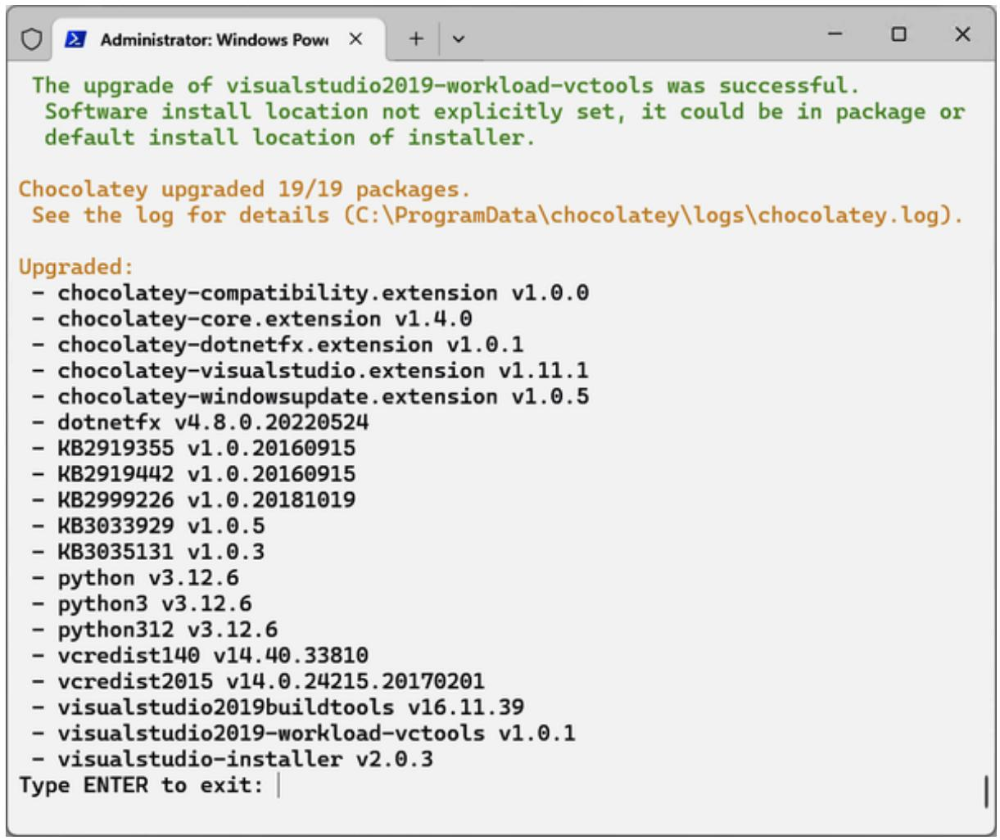

<details>
<summary>text_image</summary>

The upgrade of visualstudio2019-workload-vctools was successful.
Software install location not explicitly set, it could be in package or
default install location of installer.

Chocolatey upgraded 19/19 packages.
See the log for details (C:\ProgramData\chocolatey\logs\chocolatey.log).

Upgraded:
- chocolatey-compatibility.extension v1.0.0
- chocolatey-core.extension v1.4.0
- chocolatey-dotnetfx.extension v1.0.1
- chocolatey-visualstudio.extension v1.11.1
- chocolatey-windowsupdate.extension v1.0.5
- dotnetfx v4.8.0.20220524
- KB2919355 v1.0.20160915
- KB2919442 v1.0.20160915
- KB2999226 v1.0.20181019
- KB3033929 v1.0.5
- KB3035131 v1.0.3
- python v3.12.6
- python3 v3.12.6
- python312 v3.12.6
- vcredist140 v14.40.33810
- vcredist2015 v14.0.24215.20170201
- visualstudio2019buildtools v16.11.39
- visualstudio2019-workload-vctools v1.0.1
- visualstudio-installer v2.0.3

Type ENTER to exit:
</details>

Figure 21-6. Various Python tools are installed

You are now ready to test your new installation of Node.js. To do this, open a PowerShell window and type the information shown in Figure 21-7.

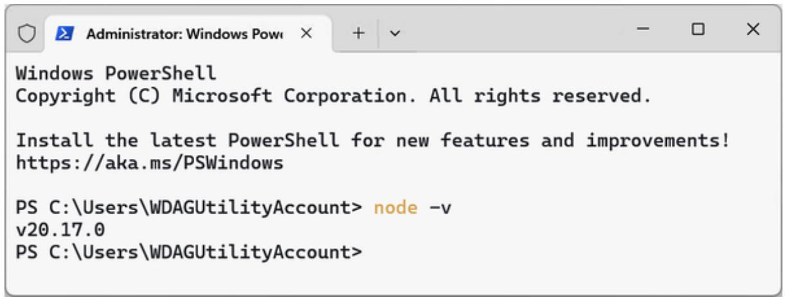

<details>
<summary>text_image</summary>

Windows PowerShell
Copyright (C) Microsoft Corporation. All rights reserved.

Install the latest PowerShell for new features and improvements!
https://aka.ms/PSWindows

PS C:\Users\WDAGUtilityAccount> node -v
v20.17.0

PS C:\Users\WDAGUtilityAccount>
</details>

Figure 21-7. Checking that Node.js is installed

All being well the version number of Node.js will be shown. If you see anything else (such as an error message) you most likely can correct this by restarting the terminal and issuing the command again.

## Installing Node.js on macOS

To use Node.js you must first install it, just as you installed AMPPS in Chapter 2. You can download the latest release at the Node.js website. I recommend that you install the LTS (Long Term Support) version because, as the name suggests, it will be supported for a good time to come. You can always try out the latest stable version to access the newest features, but this is not recommended unless you do not need to get long-term support for it.

As of writing, the latest LTS release is version 20.17 and since the recommended installer works on either Intel or ARM chips, unless you have a good reason to choose the specific installer you need, you should download and install the suggested pkg file, which may well be a newer version than 20.17 by the time you read this.

Once Node.js is downloaded you need to run the installer; you should see an intro screen similar to Figure 21-8. Over the lifetime of this edition of the book the installation process for Node.js might change, so just use common sense to follow through the installation if it’s much different than the following. That said, to get started click Continue.

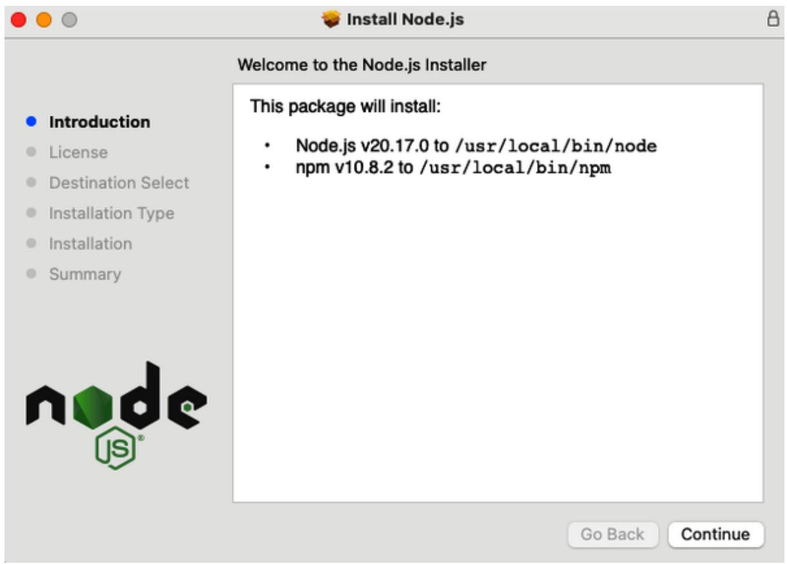

<details>
<summary>text_image</summary>

Install Node.js
Welcome to the Node.js Installer
Introduction
License
Destination Select
Installation Type
Installation
Summary
This package will install:
• Node.js v20.17.0 to /usr/local/bin/node
• npm v10.8.2 to /usr/local/bin/npm
Go Back	Continue
</details>

Figure 21-8. The Node.js installer

Next you will need to read and agree to the software license terms before you can proceed with installation, as shown in Figure 21-9.

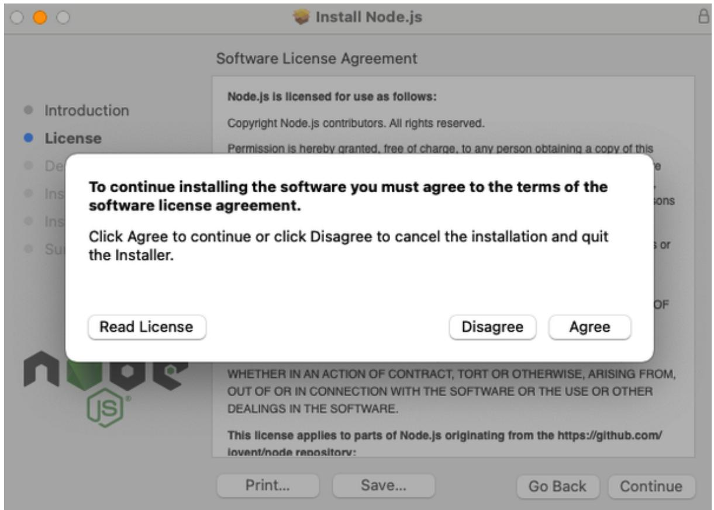

<details>
<summary>text_image</summary>

Install Node.js
Software License Agreement
Node.js is licensed for use as follows:
Copyright Node.js contributors. All rights reserved.
Permission is hereby granted, free of charge, to any person obtaining a copy of this
To continue installing the software you must agree to the terms of the
software license agreement.
Click Agree to continue or click Disagree to cancel the installation and quit
the Installer.
Read License
Disagree
Agree
WHETHER IN AN ACTION OF CONTRACT, TORT OR OTHERWISE, ARISING FROM,
OUT OF OR IN CONNECTION WITH THE SOFTWARE OR THE USE OR OTHER
DEALSING IN THE SOFTWARE.
This license applies to parts of Node.js originating from the https://github.com/
lovent/node repository:
Print...
Save...
Go Back
Continue
</details>

Figure 21-9. Agreeing to the software license

At this point you can choose the destination location and type for the installation. In most cases, unless you have a good reason to do otherwise, you should accept the default location and type offered, as shown in Figure 21-10.

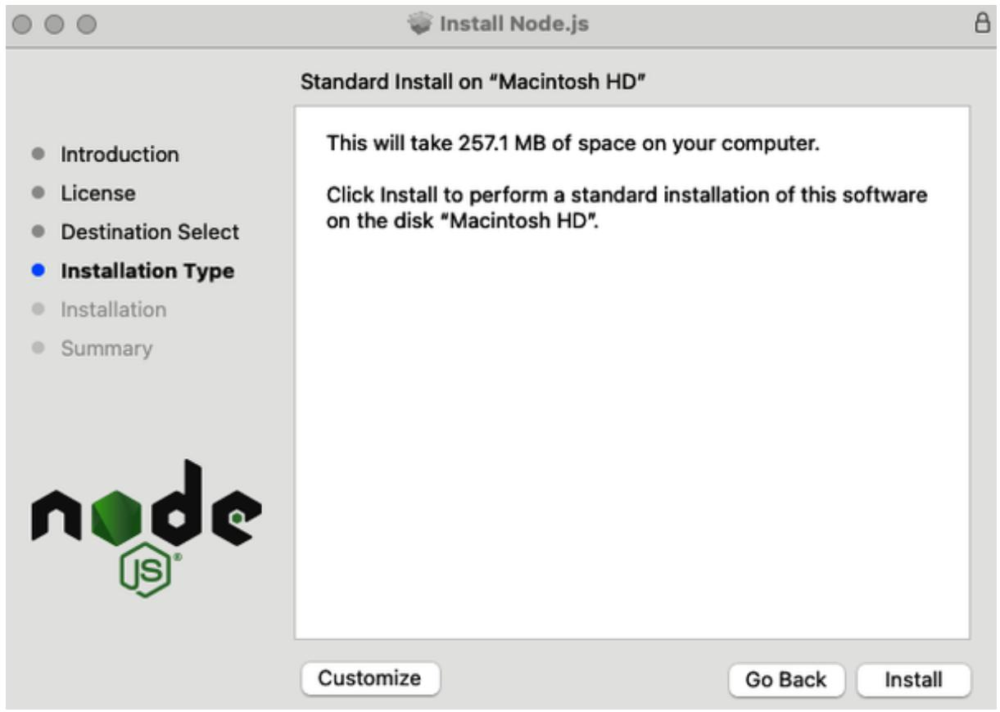

<details>
<summary>text_image</summary>

Install Node.js
Standard Install on "Macintosh HD"
This will take 257.1 MB of space on your computer.
Click Install to perform a standard installation of this software
on the disk "Macintosh HD".
Customize	Go Back	Install
</details>

Figure 21-10. Selecting the installation destination location

For security reasons you must enter your password or use biometric identification to commence the installation, as shown in Figure 21-11.


<details>
<summary>natural_image</summary>

Orange padlock icon with a download arrow and a gray folder symbol (no text or symbols)
</details>

**Installer**

Installer is trying to install new software.

Enter your password to allow this.

robin

Password

Install Software

Cancel

Figure 21-11. You must identify yourself before proceeding

Installation should proceed and after a short while you will be informed it has completed, as shown in Figure 21-12. Click Close to finish.

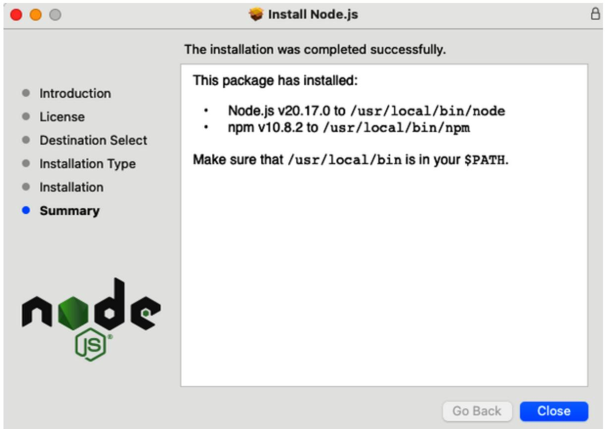

<details>
<summary>text_image</summary>

Install Node.js
The installation was completed successfully.
This package has installed:
• Node.js v20.17.0 to /usr/local/bin/node
• npm v10.8.2 to /usr/local/bin/npm
Make sure that /usr/local/bin is in your $PATH.
Introduction
License
Destination Select
Installation Type
Installation
Summary
Go Back	Close
</details>

Figure 21-12. Installation is complete

You are ready to test your new installation of Node.js. To do this, open a Terminal window and type the information shown in Figure 21-13.

node -v  
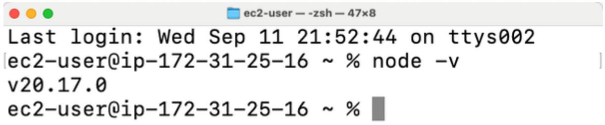

<details>
<summary>text_image</summary>

ec2-user — -zsh — 47×8
Last login: Wed Sep 11 21:52:44 on ttys002
[ec2-user@ip-172-31-25-16 ~ % node -v
v20.17.0
ec2-user@ip-172-31-25-16 ~ %
</details>

Figure 21-13. Verifying the installation

You should see the version number of the software you just installed.

## Installing Node.js on Linux

You can download the latest release at the Node.js website. I recommend you install the LTS (Long Term Support) version because, as the name suggests, it will be supported for a good time to come. You can always try out the latest stable version to access the newest features, but this is not recommended unless you do not need to receive long-term support.

As of writing, the latest LTS release is version 20.17 and a variety of options are available, including Intel and Arm installers, the Node.js source code, a Docker image, Node Version Manager (nvm), Linux on Power LE or System z, and AIX on Power Systems.

Since these are so varied, and it is assumed that as a Linux user you will already be familiar with how to install this type of software, I leave it to you to determine the installer that is best for you and to follow the relevant instructions linked to at the bottom of the download page.

Once Node.js is installed you can verify success by typing the following in a terminal window to be told the version of the software just installed:

node -v

The result of running the command should look similar to the macOS window shown in Figure 21-13.

## Getting Started with Node.js

Creating your first Node.js program is a very simple, straightforward process. We’ll be using ECMAScript modules (ECMAScript is a standardized specification of JavaScript, sometimes abbreviated as ES), the official standard format to write JavaScript code that’s supposed to be reused. Most of the Node.js ecosystem uses these modules. They are also why the following files will use the .mjs extension (m for module) as that’s the easiest way to tell Node.js you’ve created a module.

Let's begin with a single-mission web server that responds with the famous “Hello World” when accessed, as shown in Examples 21-1 and 21-2.

Example 21-1. Hello World in Node.js, the function  
```txt
function helloWorld()
{
    return 'Hello World'
}
export { helloWorld }
```

Type the code and save it in the current directory as helloWorld.mjs. The helloWorld function is simple; it only returns the string, while the next line exports the function from the module, so it can be imported, or reused, by some other module.

The following code represents the main module, the application itself. Save it in the current directory under the name app.mjs.

Example 21-2. Hello World in Node.js, the main application  
```javascript
import * as http from 'http'
import { helloWorld } from './helloWorld.mjs'

const server = http.createServer((request, response) =>
{
    response.writeHead(200, {'Content-Type': 'text/html'})
    response.end(helloWorld())
})

const port = 8000
server.listen(port, () => console.log('Server listening on port' + port))
```

Let's work through this example. The Node.js http module is loaded, or imported, into an identifier called http using the import declaration. Node.js supports a range of modules to provide different functionality, and this one provides a set of functions to manage HTTP connections. The second line imports the helloWorld function from a module created a moment ago.

Next, another object called server is created by a call to the http object's method createServer, passing it a function that takes two arguments, request and response. The response object sets three properties: a status code of 200, an HTTP header string specifying the content type, and a string to respond with as returned by our helloWorld function, applied using the response object's methods writeHead and end.

After this a variable port is created with a port number 8000 the server will listen on. Using a different port than the standard HTTP port (80) is a common practice; it solves port clashes that would otherwise happen with the AMPPS Apache still running. Last, the server object is set to start listening with a call to the listen function, using the port specified, and outputting a string to the console (the command line) after the server starts to listen.

All you need do now is open a command prompt or terminal window, and you can run it with the following instruction:

node app.mjs

All being well you will receive the following response:

Server listening on port 8000

You are now ready to test the server with a simple call to localhost and the selected port 8000 from your web browser, as follows, with the result being “Hello World” displayed in your browser:

localhost:8000

To exit from a Node.js program press Ctrl-C, which you should remember to do each time you modify a program, before then rerunning it, as saving changes to a program will not have any effect until it is restarted. Do this now, as we are about to vastly improve on this server.

## Building a Functioning Web Server

Now that you know how to interact with a Node.js program, let's create a web server that delivers the basic functionality of a program such as Apache by supporting requests for multiple files using different URLs. To do this we'll need access to a couple more modules for URL and file handling (url, fs, and path), as shown, following the loading of the http module at the head of Example 21-3.

Example 21-3. A functioning web server  
```javascript
import http from 'http'
import url from 'url'
import { readFile } from 'fs/promises'
import { resolve, extname } from 'path'

const SCRIPT_DIRECTORY = new URL('./', import.meta.url).pathname

const server = http.createServer(async (request, response) => {
    const fpath = resolve '.' + url.parse(request.url).pathname)
    if (!fpath.startsWith(SCRIPT_DIRECTORY)) {
    response.writeHead(400, { 'Content-Type': 'text/html' })
    response.end('400 Bad Request')
    return
    }
    if (extname(fpath) !== '.html') {
    response.writeHead(400, { 'Content-Type': 'text/html' })
    response.end('Sorry, only <code>.html</code> extension is supported')
    return
    }
    try {
    const data = await readFile(fpath, 'utf8')
    response.writeHead(200, { 'Content-Type': 'text/html' })
    response.end(data)
    } catch (err) {
    response.writeHead(404, { 'Content-Type': 'text/html' })
    response.end('404 Not Found')
    }
})
```

```javascript
const port = 8000
server.listen(port, () => console.log('Server listening on port ' + port))
```

This is a very simple, very small, and very fast event-driven web server for either serving up an HTML file if it exists or otherwise returning a “404 Not Found” error message. It’s not very smart as it supports only HTML files located in the current directory, and it knows nothing about special files such as PHP etc. Also there is no caching of files.

Nevertheless, on a simple website with just a collection of HTML files and associated media, this web server can handle thousands of simultaneous requests, due to there being no log-jam waiting for the filesystem to return requested files, and it will be very fast and effective. Let's save this example as server.mjs so that it can be run from a command prompt, like this:

```batch
node server.mjs
```

To accompany the program we also need a simple HTML file for the server to return, so save Example 21-4 as hello.html and we're ready to test the code.

Example 21-4. A simple HTML file  
```txt
<!DOCTYPE html>
<html>
<head>
    <title>Simple HTML file</title>
</head>
<body>
    <h1>Hello, how are you? </h1>
</body>
</html>
```

Now you can type localhost:8000/hello.html into your web browser and the file will be displayed. Or you can ask for a nonexistent page such as localhost:8000/bye.html, in which case a “404 Not Found” error will be returned. Let’s look at how all this works.

First, after importing the required modules and functions, the variable SCRIPT\_DIRECTORY will be set to contain the path to the current directory. It will be used later for a security check on whether the requested file is in the current directory with the following line:

```typescript
if (!fpath.startsWith(SCRIPT_DIRECTORY)) {
    // return "Bad Request"
}
```

If the check fails, “Bad Request” will be returned instead. If there was no check like this, the application would be vulnerable to an attack called path traversal (sometimes directory traversal), which would allow the attacker to request any file in any directory on the server using paths like .../.../etc/passwd and similar.

The code also checks the extension of the requested file and allows just .html, because otherwise anyone could download the source code by loading localhost:8000/server.mjs, which is not what you want. It uses the extname function from the built-in path module, like this:

```txt
if (extname(fpath) != '.html') {
    // return "Only .html supported"
}
```

Similar to the “Hello World” example, this code creates a server object to process requests, and it also makes calls to the writeHead and end methods of the response object to send the status code, content type, and the page content to the calling web browser.

What's new is how requests are dynamically processed, starting with the variable fpath, which is given its value by calling the parse method of the url module, passing it the url property of the request object to obtain pathname, which is then prefaced with the . character. The path is then resolved to an absolute path by calling resolve on the path module and compared with the SCRIPT\_DIRECTORY variable. The result is that if you, for example, request the URL localhost:8000/hello.html then fpath will contain a full absolute path to the hello.html file in the current directory.

This file handling is managed with a call to the readFile method of the fs module, passing it the value in fpath, and requesting the contents to be delivered in utf8 encoding, with the file data returned in the data variable. The await operator is used to wait for a fulfilled promise (these are the same objects you’ve already encountered in the information about asynchronous functions in Chapter 17). If there is an error, an exception is thrown and caught, and for the sake of brevity and simplicity in this example, it is assumed to be “Not Found,” with a status code of 404.

Of course you don’t have to only serve up preexisting files. It’s quite possible (and highly likely) you will build responses into your Node.js programs. That’s the power of it after all: the ability to write both backend and frontend code in JavaScript. So let’s modify the example one more time to show a simple way of creating a fully self-contained program that acts like a whole website of files, as in Example 21-5.

Example 21-5. A self-contained server  
```javascript
import http from 'http'
const server = http.createServer(async (request, response) => {
    let status = 200
    let output = '404 Not Found'

    switch (request.url) {
    case '/hello.html': output = 'Hello there'
    break
    case '/bye.html': output = 'Goodbye'
    break
    default: status = 404
    }

    response.writeHead(status, { 'Content-Type': 'text/html' })
    response.end(output)
})

const port = 8000
server.listen(port, () => console.log('Server listening on port ' + port))
```

Here the fs, url, and path modules are no longer required, and in place of file handling there is now a simple switch statement in which each case is handled individually by assigning a value to the variable output. There's also no path traversal check, because the code doesn't access any files.

You can include as many cases as you like, but this example just supports requests for hello.html and bye.html with a default status value of 200 (OK) then passing through to the writeHead and end methods. If neither case applies, in other words anything other than these two strings are entered in the web browser, the status code value is set to 404 and the default error string “404 Not Found,” previously assigned to output, both pass through to be returned to the browser.

Of course, your own code will be much more powerful and creative than these examples, but you are now equipped with enough Node.js knowledge to return either full files from a filesystem or construct responses on the fly (or do both), according to your needs. Next we’ll look more closely at Node.js modules, how to manage them using npm, and how to load them into Node.js to interact with a MySQL database.

## Working with Modules

Now that you know how to leverage the frontend JavaScript skills you learned earlier in this book to write backend code, you can use the number three trending language (as I write). Unfortunately, at some point, PHP as a technology (though still widely used across the internet) is no longer even in the top ten trending IEEE languages.

Perhaps it's the strong relationship between PHP and MySQL that keeps PHP installed on so many web properties, but even that may change over the coming years because Node.js can work with MySQL databases too, just by importing a module. In fact, with over two million packages available for Node.js, it offers support for just about any application you can think of.

The way this is achieved is via npm, the Node.js package manager, which is installed when you install Node.js itself. But first let's examine the modules that come with Node.js.

### Built-in Modules

Node.js comes with a number of built-in modules that you can access immediately through the import declaration without having to install them using npm, a few of which you have already encountered. Here's a list of the most commonly used modules:

- crypto handles encrypted data.  
- dns handles name resolution.  
- fs accesses the local filesystem.  
- http transfers data over HTTP.  
- https transfers secure data over HTTP.  
- net transfers servers and clients.  
- os obtains information about the operating system.  
• path works with directory and filepaths.  
- querystring parses URL query strings.  
- url parses and resolves URL strings.  
- util accesses various utility functions.

Please see the official Node.js documentation for full details on using Node.js modules.

### Installing Modules with npm

To import a module to Node.js that is not built-in, use the npm program, which stands for “npm Is Not An Acronym,” although commonly understood as Node Package Manager. For example, to install the mysql2 module, which offers some additional features over the older mysql module, such as prepared statements and placeholders, enter the following at a command prompt:

npm install mysql2

Go ahead and do this now as we'll soon use this module to connect to the database created in Chapter 8 just as easily as we did using PHP. In a few seconds you should see something like:

added 13 packages in 2s

You can now access this module as described in Chapter 20 using the import method.

You can also use npm to create your own packages, although how to do this is beyond the scope of this book. For more information, see the full npm documentation, or you can access a treasure trove of ready-made packages at the npm website.

### Accessing MySQL

If Node.js is truly to able to replace a stack such as AMPPS then it must be able to access databases and, as you’d expect, it does, with great ease and simplicity. It has support for PostgreSQL, DynamoDB, MongoDB, and many other SQL and NoSQL databases. But since this is a book focusing on MySQL, let’s work with MySQL via the mysql2 package you downloaded during “Installing Modules with npm”.

I recommend you add a new user for all your Node.js accesses by calling up MySQL like this, on a PC with AMPPS installed:

C:\\"Program Files\Ampps\mysql\bin\mysql" -u root -pmysql

Or like this on a Mac:

/Applications/ampps/mysql/bin/mysql -u root -pmysql

Or on Linux:

mysql -u root -p

Once you are at the MySQL prompt you can create a new user with the name node and password letmein like this:

CREATE USER 'node'@'localhost' IDENTIFIED BY 'letmein';

GRANT ALL ON publications.\* TO 'node'@'localhost';

You might want to change this user's name or password later, but for the purposes of the following example these are the details we'll work with. Now you can exit from MySQL with the following command:

quit;

Now, let's write a simple Node.js program to log in to the publications database we created in Chapter 8 and extract some data from it, as in Example 21-6. Save the file as mysql.mjs.

Example 21-6. Querying a MySQL database

import mysql from 'mysql2/promise'

```typescript
const connection = await mysql.createConnection({
    host: 'localhost',
    user: 'node',
    password: 'letmein',
    database: 'publications'
```

```javascript
})
try {
    const query = 'SELECT * FROM classics WHERE author = ?'
    const [results, fields] = await connection.execute(
    query,
    ['Jane Austen']
    )
    console.log('Results:', results.length)
    console.log('Data returned:', results)
    console.log('Author:', results[0].author)
    console.log('Title:', results[0].title)
    console.log('Category:', results[0].category)
    console.log('Year:', results[0].year)
    console.log('ISBN:', results[0].isbn)
} catch (error) {
    console.log(error)
}
connection.end()
```

In this example, the first line fetches the mysql2 module and creates the object mysql, creating a matching object called connection from the access details provided. The access details like username and password should not be stored directly in your production code; instead, you should use a special file called .env, or config.env to store them.

**BUILT-IN .ENV SUPPORT**

Starting with version 20.6, Node.js has a built-in .env support. You create a file named, for example, config.env, which follows the INI format with key=value lines like this:

```txt
USER=node
PASSWORD=letmein
```

Execute Node.js with a new command-line parameter:

```batch
node --env-file=config.env mysql.mjs
```

Then you can access the details with process.env, like this:

```javascript
const connection = await mysql.createConnection({
    host: 'localhost',
    user: process.env.USER,
    password: process.env.PASSWORD,
    database: 'publications'
})
```

Next the variable query is assigned a MySQL query string, which is using a placeholder ? instead of a variable (or hardcoded string) to prevent SQL injection, and which when executed with the parameter will return all fields from any rows in which the author field contains “Jane Austen.” The query is passed to MySQL via the execute method of the connection object together with the parameter array. Two objects are returned: results for the results and fields for the fields accessed.

If an error occurred, an exception is thrown and a suitable message logged; otherwise, the returned data is examined. First, the number of results returned is obtained from results.length then, just to show you what the returned data object looks like, results is displayed in its entirety. After that the contents of each of the five fields is individually displayed.

Finally, the connection to the database is closed by calling the end method of the connection object. Unlike a server, the program then ends, returning access to the command prompt, although you will probably include such MySQL accessing code within a server-style program.

The result of running this code should look something like:

```txt
C:\nodesql> node mysql.mjs
Results: 1
Data returned: [
    {
    author: 'Jane Austen',
    title: 'Pride and Prejudice',
    category: 'Classic Fiction',
    year: 1811,
    isbn: '9780582506206'
    }
]
Author: Jane Austen
Title: Pride and Prejudice
Category: Classic Fiction
Year: 1811
ISBN: 9780582506206
```

You now have the means to construct queries, pass them to the database, and retrieve the results.

To further your knowledge in this area, comprehensive documentation on the mysql2 module is available at the npm website.

### Further Information

Of course we can only scratch the surface about software with the power of a program such as Node.js. Nevertheless it's a testament to the simplicity and robustness of Node.js that it has been possible to show you how to create functional web servers that can interact with complex third-party software such as the MySQL relational database.

You are well on your way to creating small, fast, functional, and high-traffic Node.js web properties. To further your knowledge you can browse other titles on the subject available from resources such as the O'Reilly Learning Platform. And you can read the official documentation at the Node.js website.

In Chapter 22 all the technologies covered in this book are brought together to create a simple social network application. But first, try answering the following questions to test your Node.js knowledge.

## Questions

1. After receiving a request for a file from a web browser and passing the request off to the filesystem, what does Node.js do?  
2. What is the method called for including Node.js prewritten modules?  
3. Which three modules does Node.js use to manage HTTP communication, parse URLs, and access the local filesystem?  
4. What is the default HTTP port a server listens to?  
5. Which method of the http Node.js module is used to create a new server object?  
6. Which part of the response must be sent back to a web browser first, before returning data (or an error)?  
7. How do you end a connection to a web browser?  
8. How do you start a Node.js server?  
9. How do you manually terminate a Node.js server?  
10. How do you write messages to the terminal window command line from Node.js?  
11. How do you add external Node.js modules to a project?

12. How do you use Node.js to access a MySQL database?  
13. How do you create a connection to MySQL in Node.js?  
14. How do you query a MySQL database with Node.js?  
15. How do you terminate a connection to a MySQL database?

See “Chapter 21 Answers” in the Appendix A for the answers to these questions.