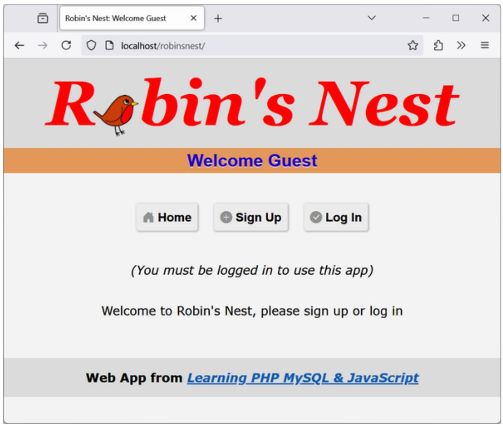
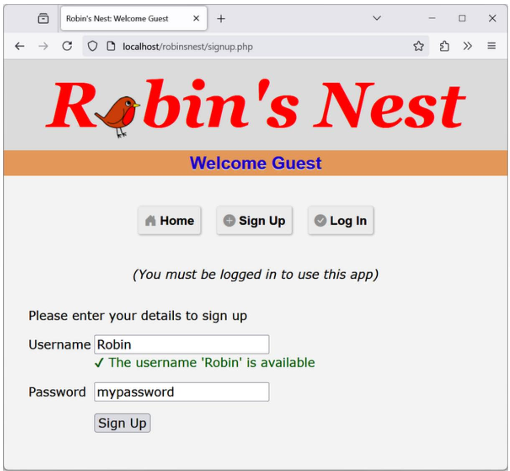
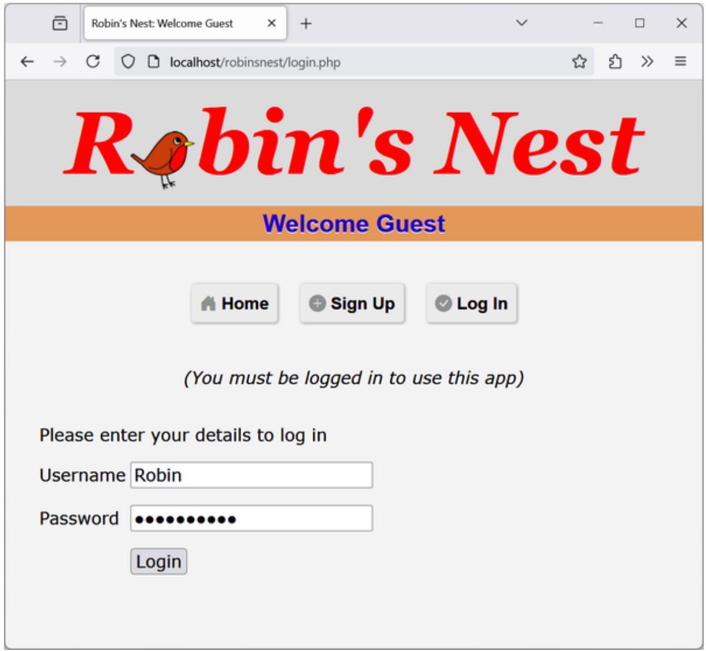
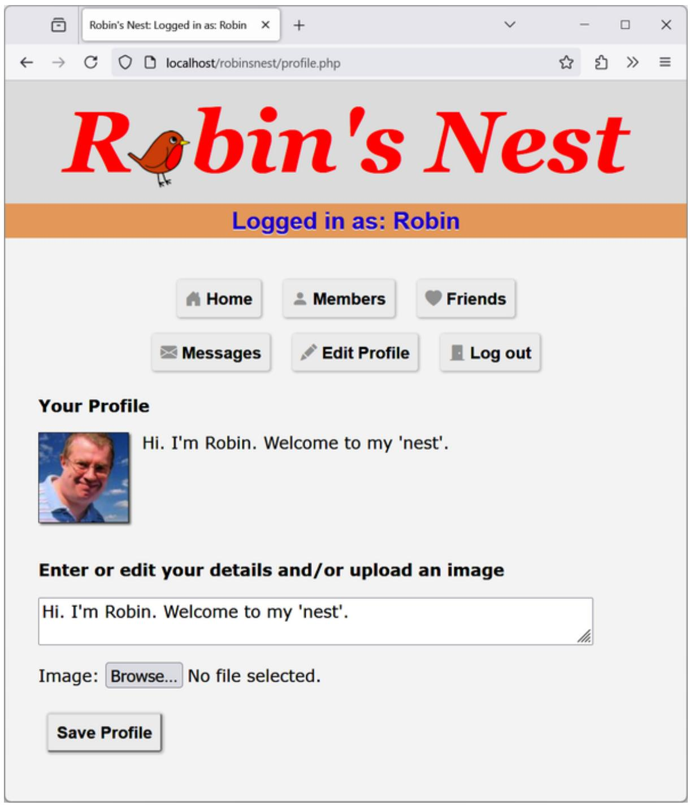
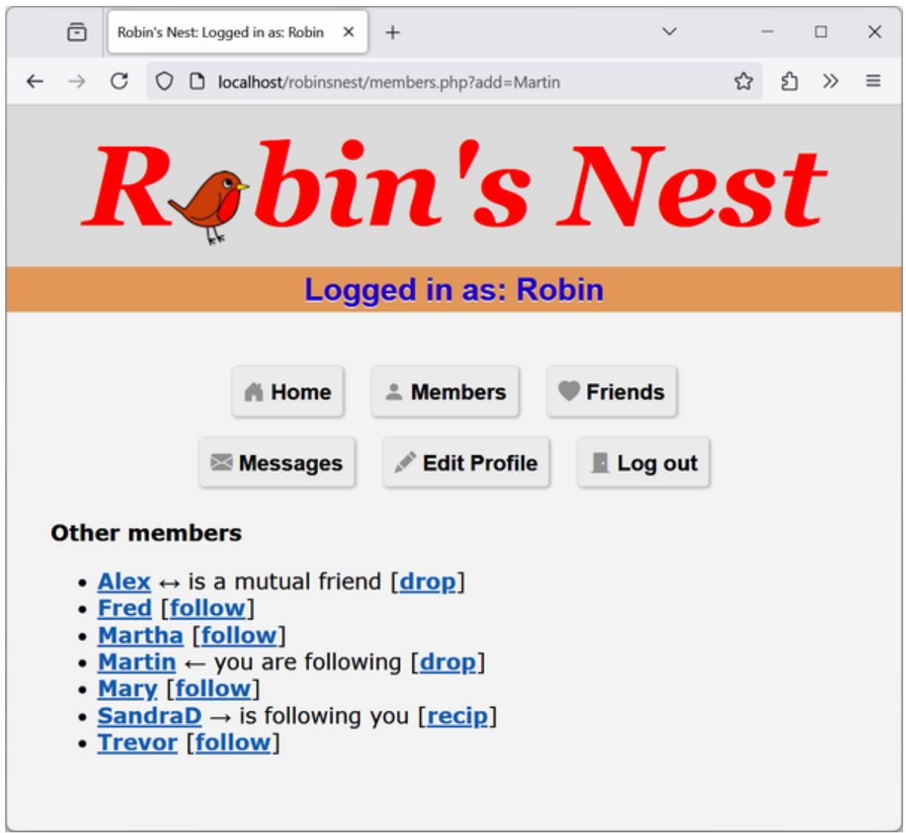
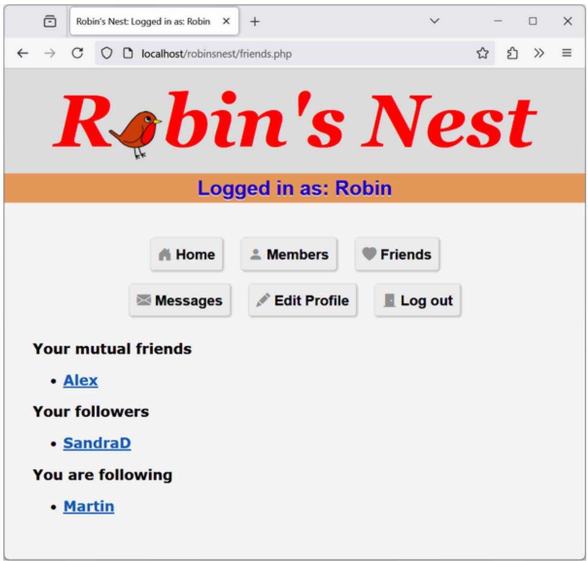
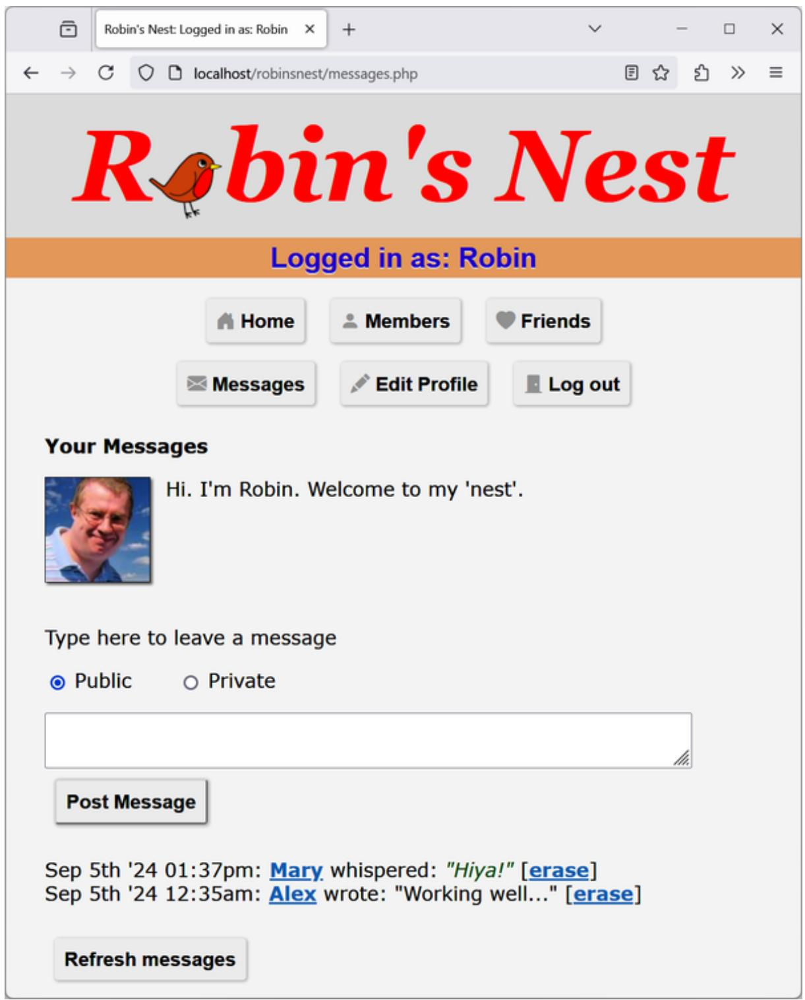

# Chapter 22. Bringing It All Together

Now that you’ve reached the end of this book, your first milestone along the path of the hows, whys, and wherefores of dynamic web programming, I want to leave you with a real example. In fact, it’s a collection of examples, because I’ve put together a simple social networking project comprising all the main features you’d expect from such a site, or more to the point, such a web app.

Across the various files, there are examples of MySQL table creation and database access, CSS, file inclusion, session control, asynchronous calls, event and error handling, file uploading, image manipulation, and a whole lot more.

Each example file is complete and self-contained yet works with all the others to build a fully working social networking site, even including a stylesheet you can modify to completely change the project’s look and feel.

The small, light end product is particularly usable on mobile platforms such as a smartphone or tablet but will run equally well on a full-size desktop computer. To exercise your skills, you may wish to adapt the code further, perhaps using React in some way.

I have tried to keep this code as concise as possible so it’s easy to follow. Consequently, a great deal of improvement could be made to it, such as smoother handling of some of the transitions between being logged on and off—but let’s leave those as the exercises for the reader, particularly since there are no questions at the end of this chapter. Well...just the one!

I leave it up to you to take any pieces of this code you think you can use and expand on them for your own purposes. You might even build on these files to create a social networking site of your own.

## Designing a Social Networking App

Before writing any code, I thought about several things that were essential for a social networking application:

- A signup process  
- A login form  
- A logout facility  
- Session control  
- User profiles with uploaded thumbnails  
• A member directory  
- Adding members as friends  
• Public and private messaging between members  
- Project styling

I named the project Robin's Nest; if you use this code, you will need to modify the name and logo in the index.php and header.php files.

## Online Repository

All the examples in this chapter are available online in a repository at GitHub, where you can download the archive file lpmj7examples.zip, which you should extract to a suitable location on your computer (such as the document root of the AMPPS web server), where it can be easily accessed from your browser.

Of particular interest to this chapter, within the file, you will find a folder called robinsnest, in which all the examples from this chapter have been saved. Once these files are set up (as detailed next), you should be able to type the following into your browser to run the application:

## functions.php

Let's jump right into the project, starting with Example 22-1, functions.php, the included file for the main functions. This file contains a little more than just the functions, though, because I have added the database login details here instead of using a separate file. The first four lines of code define the host and name of the database to use, as well as the username and password.

By default, in this file the MySQL username is set to robinsnest, and the database used by the program is also called robinsnest. Chapter 8 provides detailed instructions on how to create a new user and/or database, but to recap, first create a new database called robinsnest by entering a MySQL command prompt and typing this:

CREATE DATABASE robinsnest;

Then you can create a user called robinsnest capable of accessing this database like this:

CREATE USER 'robinsnest'@'localhost' IDENTIFIED BY 'password';
GRANT ALL PRIVILEGES ON robinsnest.\* TO 'robinsnest'@'localhost';

Obviously you would use a much more secure password for this user than password, but for the sake of simplicity, this is the password used in these examples—just make sure you change it if you use any of this code on a production site.

The project uses two main functions:

destroySession

Destroys a PHP session and clears its data to log users out.

**showProfile**

Looks for an image of the name <user.jpg> (where <user> is the username of the current user) and, if it finds it, displays it. It also displays any “about me” text the user may have saved.

I have ensured that error handling is in place for all the functions that need it so that they can catch any typographical or other errors you may introduce and generate error messages. However, if you use any of this code on a production server, you will want to provide your own error-handling routines to make the code more user-friendly.

So, type in Example 22-1 and save it as functions.php (or download it from the companion website), and you’ll be ready to move to “header.php”.

**Example 22-1. functions.php**

```php
<?php // Example 01: functions.php
$dbhost = 'localhost'; // Change as necessary
$db = 'robinsnest'; // Change as necessary
$dbuser = 'robinsnest'; // Change as necessary
$dbpass = 'password'; // Change as necessary
$chrset = 'utf8mb4';
$dbattr = "mysql:host=$dbhost;dbname=$db;charset=$chrset";
$opts =
[
    PDO::ATTR_ERRMODE => PDO::ERRMODE_EXCEPTION,
    PDO::ATTR_DEFAULT_FETCH_MODE => PDO::FETCH_ASSOC,
    PDO::ATTR_EMULATE_PREPARES => false,
];

try {
    $pdo = new PDO($dbattr, $dbuser, $dbpass, $opts);
} catch (\PDOException $e) {
    throw new \PDOException($e->getMessage(), (int)$e->getCode());
}

function destroySession()
{
    $_SESSION=array();
```

```php
if (session_id() != "" || isset($_COOKIE[session_name()]))
    setcookie(session_name(), '', time()-2592000, '/');
session_destroy();
}

function showProfile($user, $pdo)
{
    if (file_exists("$user.jpg"))
    echo "";
    $stmt = $pdo->prepare("SELECT * FROM profiles WHERE user=?");
    $stmt->execute College[$user]);

    $row = $stmt->fetch();
    if ($row)
    echo htmlentities($row['text']) . "<br style='clear:left;'><br>";
    else
    echo "<p>Nothing to see here, yet</p><br>";
}
?>
```

**NOTE**

If you've read previous editions of this book, in which these examples used the old mysql extension, and later on mysqli, you will see I have moved on to the best solution so far, which is PDO. I'm also using placeholders and prepared statements to protect the application against SQL injection attacks.

To reference the MySQL database using PDO, the showProfile function has a \$pdo parameter you need to pass when calling the function.

## header.php

For uniformity, each page of the project needs to have access to the same set of features. Therefore, I placed these in Example 22-2, header.php. This is the file that is actually included by the other files. It includes

functions.php. This means only a single require\_once is needed in each file.

header.php starts a session by calling the function session\_start. As you’ll recall from Chapter 12, this sets up a session that will remember certain values we want stored across different PHP files. In other words, it represents a visit by a user to the site, and it can time out if the user ignores the site for a period of time.

With the session started, the file of functions (functions.php) is included, and the default string of “Welcome Guest” is assigned to \$userstr.

Next, the code checks whether the session variable user is currently assigned a value. If so, a user has already logged in, so the variable \$loggedin is set to TRUE and the username is retrieved from the session variable user into the PHP variable \$user\_html\_entities (sanitized string for output), with \$userstr updated appropriately. If the user has not yet logged in, then \$loggedin is set to FALSE.

The program then outputs the HTML needed to set up each web page, including loading stylesheets, Bootstrap Icons, the logo, and the greeting.

**BOOTSTRAP ICONS**

The app uses icons from the Bootstrap Icons collection (the latest version 1.11.3 as I write), a free, open source icon library. It can be installed with npm but I'm loading it from the internet for the sake of simplicity. To add an icon, you can use the <i> tag with the class that specifies the icon you want, for example like this for a checkmark icon:

```txt
<i class="bi-check"></i>
```

The are multiple usage methods and many icons to choose from. Visit the Bootstrap Icons website to learn more.

After this, using the value of \$loggedin, an if block displays one of two sets of menus. The non-logged-in set simply offers options of Home, Sign

Up, and Log In, whereas the logged-in version offers full access to the app's features.

The additional styling applied to this file is in the file styles.css

(Example 22-13, detailed at the end of this chapter).

Example 22-2. header.php  
```php
<?php // Example 02: header.php
session_start();
require_once 'functions.php';

$userstr = 'Welcome Guest';

if (isset($_SESSION['user'])) {
    $user_html_entities = hmlentities($_SESSION['user']);
    $loggedin = TRUE;
    $userstr = "Logged in as: $user_html_entities";
}
else 
    $loggedin = FALSE;

?>
<!DOCTYPE html>
<html>
<head>
    <meta charset="utf-8">
    <meta name="viewport" content="width=device-width, initial-scale=1">
    <link rel="stylesheet" href="styles.css">
    <script src="javascript.js"></script>
    <link rel="stylesheet" href="https://cdn.jsdelivr.net/npm/bootstrap-icons@1.11.3/font/bootstrap-icons.min.css">
    <title>Robin's Nest: <?php echo $userstr; ?></title>
</head>
<body>
<div>
<div>
<div id="logo"
class="center">Rbin's Nest</div>
<div class="username Affordablephp echo $userstr; <$div>
</div>
<div class="content">

<?php
```

```txt
if ($loggedin) {
    ?
    <div class="center">
    <a class="button" href="members.php?viewrialphp echo $user_html_entities; ?">>
    <i class="bi-house-door-fill"></i> Home</a>
    <a class="button" href="members.php">
    <i class="bi-person-fill"></i> Members</a>
    <a class="button" href="friends.php">
    <i class="bi-heart-fill"></i> Friends</a><br>
    <a class="button" href="messages.php">
    <i class="bi-envelope-fill"></i> Messages</a>
    <a class="button" href="profile.php">
    <i class="bi-pencil-fill"></i> Edit Profile</a>
    <a class="button" href="logout.php">
    <i class="bi-door-closed-fill"></i> Log out</a>
    </div>
    <?php
    } else {
    ?
    <div class="center">
    <a class="button" href="index.php">
    <i class="bi-house-door-fill"></i> Home</a>
    <a class="button" href="signup.php">
    <i class="bi-plus-circle-fill"></i> Sign Up</a>
    <a class="button" href="login.php">
    <i class="bi-check-circle-fill"></i> Log In</a>
    </div>
    <p class="info"><You must be logged in to use this app)</p>
    <?php
    }
    ?
}
```

## setup.php

With the pair of included files written, it's time to set up the MySQL tables they will use. We do this with Example 22-3, setup.php, which you should type and load into your browser before calling up any other files; otherwise, you'll get numerous MySQL errors.

The tables created are short and sweet, and they have the following names and columns:

members

username user (indexed), password pass (to store a password hash) messages

ID id (indexed), author auth (indexed), recipient recip, message type pm, message message

friends

username user (indexed), friend's username friend

profiles

username user (indexed), “about me” text

Because the SQL query first checks whether a table already exists, this program can be safely called multiple times without generating any errors.

You very likely will need to add many more columns to these tables if you choose to expand this project. If so, remember that you may need to issue a MySQL DROP TABLE command before re-creating a table.

Example 22-3. setup.php  
```txt
<!DOCTYPE html> <!-- Example 03: setup.php -->
<html>
<head>
    <title>Setting up database</title>
</head>
<body>
    <h3>Setting up...</h3>

<?php
require_once 'functions.php';

$pdo->query('CREATE TABLE IF NOT EXISTS members (
    user VARCHAR(16),
    pass VARCHAR(255),
    INDEX(user(6))
)');
```

```php
$pdo->query('CREATE TABLE IF NOT EXISTS messages (
    id INT UNSIGNED AUTO_INCREMENT PRIMARY KEY,
    auth VARCHAR(16),
    recip VARCHAR(16),
    pm CHAR(1),
    time INT UNSIGNED,
    message VARCHAR(4096),
    INDEX(auth(6)),
    INDEX(recip(6))
)');

$pdo->query('CREATE TABLE IF NOT EXISTS friends (
    user VARCHAR(16),
    friend VARCHAR(16),
    INDEX(user(6)),
    INDEX(friend(6))
)');

$pdo->query('CREATE TABLE IF NOT EXISTS profiles (
    user VARCHAR(16),
    text VARCHAR(4096),
    INDEX(user(6))
)');

?>
<br>...done.
</body>
</html>
```

**WARNING**

For this example to work, you must first ensure that you have created the database specified in the variable \$db in Example 22-1 and granted access to the user given the name in \$dbuser, with the password in \$dbpass.

## index.php

The index.php file just displays a simple welcome message, but it is necessary to give the project a home page. In a finished application, this would be where you sell the virtues of your site to encourage signups.

Incidentally, because we have already set up all the MySQL tables and created the included files, you can now load Example 22-4, index.php, into your browser to get your first peek at the new application. It should look like Figure 22-1.

Example 22-4. index.php  
```php
<?php // Example 04: index.php
require_once 'header.php';

echo "<div class='center'>Welcome to Robin's Nest,

if ($loggedin) {
    $user_html_entities = hmlentities($_SESSION['user']);
    echo "$user_html_entities, you are logged in";
} else 
    echo 'please sign up or log in';
?>

</div>
</div>
<h4 id="footer" class="center">Web App from <i>
<a href="https://github.com/RobinNixon/lpmj7" target="_blank">
Learning PHP MySQL & JavaScript</a>
</i></h4>
</body>
</html>
```



<details>
<summary>text_image</summary>

Robin's Nest
Welcome Guest
Home Sign Up Log In
(You must be logged in to use this app)
Welcome to Robin's Nest, please sign up or log in
Web App from Learning PHP MySQL & JavaScript
</details>

Figure 22-1. The main page of the app

## signup.php

Now we need a module to enable users to join our new social network, and that's Example 22-5, signup.php. This is a slightly longer program, but you've seen all its parts before.

Let's start by looking at the end block of HTML. This is a simple form that allows a username and password to be entered. But note the use of the empty <span> given the id of used. This will be the destination of the asynchronous call in this program that checks whether a desired username is available. See Chapter 17 for a complete description of how this works.

### Checking for Username Availability

At the end of the HTML you’ll see a block of JavaScript. It contains an anonymous arrow function that is called on the JavaScript blur event when focus is removed from the username field of the form. The function makes a request to the program checkuser.php, which reports whether the username in user is available. The returned result of the asynchronous call (performed using the fetch function), a friendly message, is then placed in the used <span>.

Go back to the program start: there’s some PHP code you should recognize from the discussion of form validation in Chapter 16. This section also uses placeholders and prepared statements when looking up the username in the database and, if it’s not already taken, inserting the new username and password. The password is not stored in the clear, as that would be a huge security risk. Instead its one-way hash is used (see Chapter 12 for more details).

### Logging In

Upon successfully signing up, the user is then prompted to log in. A more fluid response at this point might be to automatically log in a newly created user, but because I don’t want to overly complicate the code, I have kept the signup and login modules separate. You can easily implement this if you want to, however.

When loaded into a browser (and in conjunction with checkuser.php, shown later), this program will look like Figure 22-2, where you can see that the asynchronous call has identified that the username Robin is available. If you would like the password field to show only asterisks, change its type from text to password.

Remember that you must run setup.php before you can run any of these other PHP program files.



<details>
<summary>text_image</summary>

Robin's Nest
Welcome Guest
Home Sign Up Log In
(You must be logged in to use this app)
Please enter your details to sign up
Username Robin
✓ The username 'Robin' is available
Password mypassword
Sign Up
</details>

Figure 22-2. The signup page

Example 22-5. signup.php  
```php
<?php // Example 05: signup.php
require_once 'header.php';

$error = $user = "";
if (isset($_SESSION['user'])) 
    destroySession();

if (isset($_POST['user'])) {
    $user = $_POST['user'];
    if ($_POST['user'] === "" || $_POST['pass'] === "")
    $error = 'Not all fields were entered';
    else {
```

```php
stmt = $pdo->prepare('SELECT * FROM members WHERE user=?');
stmt->execute(['user]);
if ($stmt->rowCount())
    $error = 'That username already exists<br><br>';
else {
    $stmt = $pdo->prepare('INSERT INTO members VALUES(?, ?)');
    $stmt->execute(['user, password_hash($_POST['pass'], PASSWORD_DEFAULT)]);
    die('<h4>Account created</h4>Please Log in.</div></body></html>');
}
}
$error_html_entities = htmlentities($error);
$user_html_entities = htmlentities($user);

<form method="post" action="signup.php">
<p class="error">
<?php echo $error_html_entities; ?>
</p>
<p>Please enter your details to sign up</p>
<p>
<label>Username</label>
<input type="text" maxlength="16" name="user" id="username" value="<?php echo $user_html_entities; ?>"><br>
<label></label><span id="used">&nbsp;</span>
</p>
<p>
<label>Password</label>
<input type="text" name="pass">
</p>
<p>
<label></label>
<input type="submit" value="Sign Up">
</p>
</form>
<script>
const field =ById('username');
field.onblur = () => {
    if (field.value === '')
    return
    const data = new FormData()
    data.set('user', field.value)
    fetch('checkuser.php', { method: 'post', body: data})
    .then(response => response.text())
    .then(text =>ById('used').innerHTML = text)
}
</script>
</div>
```

```txt
</body>
</html>
```

## checkuser.php

To go with signup.php, here's Example 22-6, checkuser.php, which looks up a username in the database and returns a string indicating whether it has already been taken. Because it relies on the \$pdo variable to use prepared statements, the program first includes the file functions.php.

Then, if the \$\_POST variable user has a value, the function looks it up in the database and, depending on whether it exists as a username, outputs either “Sorry, the username ‘user’ is taken” or “The username ‘user’ is available.” Just checking the value returned by the function call to \$stmt->rowCount is sufficient for this, as it will return 0 if the name is not found or 1 if it is found.

The HTML entities &#x2718; and &#x2714; are also used to preface the string with either a cross or a checkmark, and the string will be displayed in either red for the class taken or green for the class available, as defined in styles.css, shown later in this chapter.

Example 22-6. checkuser.php  
```php
<?php // Example 06: checkuser.php
require_once 'functions.php';

if (isset($_POST['user'])) {
    $stmt = $pdo->prepare('SELECT * FROM members WHERE user=?');
    $stmt->execute([$_POST['user']])
    $user_html_entities = htmlentities($_POST['user']);
    if ($stmt->rowCount())
    echo "<span class='taken'>&nbsp;&#x2718; " .
    "The username '$user_html_entities' is taken</span>";
    else
    echo "<span class='available'>&nbsp;&#x2714; " .
    "The username '$user_html_entities' is available</span>";
}
```

## login.php

With users now able to sign up on the site, Example 22-7, login.php, provides the code needed to let them log in. Like the signup page, it features a simple HTML form and some basic error checking, and it uses prepared statements and placeholders to query the MySQL database.

Two things to note here: first is that to verify a password stored as a one-way hash, the row with the hash needs to be queried from the database by the username. Then the hash from the database, together with the password from the login field, is passed to the password\_verify function, which returns true if the password from the form matches the stored hash. This is a bit more complicated than just comparing two strings, so we'll leave it all to password\_verify.

Second, upon successful verification of the username and password, the session variable user is given the username. As long as the current session remains active, this variable will be accessible by all the programs in the project, allowing them to automatically provide access to logged-in users. Storing the password or the password hash in the session is not needed and would be a security risk as it would be stored in the clear in the session data.

The header function, upon successfully logging in, redirects the user to the home page once logged in. The function sends a special HTTP header Location that will cause the redirection in the browser, followed by a URL, in this case the members.php filename and the username in the view parameter.

When you call this program up in your browser, it should look like Figure 22-3. Note how the input type of password has been used here to mask the password with asterisks to prevent it from being viewed by anyone looking over the user's shoulder.

```php
<?php // Example 07: login.php
require_once 'header.php';
$error = $user = "";
if (isset($_POST['user'])) {
    $user = $_POST['user'];
    if ($user === "" || $_POST['pass'] === "")
    $error = 'Not all fields were entered';
    else {
    $stmt = $pdo->prepare('SELECT user, pass FROM members WHERE user=?');
    $stmt->execute(['user]);
    $result = $stmt->fetchAll();

    if (count($result) === 0
    || !password_verify($_POST['pass'], $result[0]['pass']])
    {
    $error = "Invalid login attempt";
    } else {
    $_SESSION['user'] = $user;
    header('Location: members.php?view=' . $user);
    }
    }
}
$error_html_entities = htmlentities($error);
$user_html_entities = htmlentities($user);

    <form method="post" action="login.php">
    <p class="error">
    <?php echo $error_html_entities;?>
    </p>
    <p>
    Please enter your details to log in
    </p>
    <p>
    <label>Username</label>
    <input type="text" maxlength="16" name="user"
    value="<<?php echo $user_html_entities; ?>">
    </p>
    <p>
    <label>Password</label>
    <input type="password" name="pass">
    </p>
    <p>
    <label></label>
    </p>
    </p>
    </form method="post" action="login.php">
    <p class="error">
    <?php echo $error_html_entities;?>
    </p>
    <p>
    <label>Username</label>
    <input type="text" maxlength="16" name="user"
    value="<<?php echo $user_html_entities; ?>">
    </p>
    <p>
    <label>Password</label>
    <input type="password" name="pass">
    </p>
    <p>
    <label></label>
    </form method="post" action="login.php">
    <p class="error">
    <?php echo $error_html_entities;?>
    </p>
    <p>
    <label>Username</label>
    <input type="text" maxlength="16" name="user"
    value="<<?php echo $user_html_entities; ?>">
    </p>
    <p>
    <label>Password</label>
    <input type="password" name=$pass">
    </p>
    <p>
    <label></label>
</form method="post" action="login.php">
```

```txt
<input type="submit" value="Login">
</p>
</form>
</div>
</body>
</html>
```



<details>
<summary>text_image</summary>

Robin's Nest
Welcome Guest
Home Sign Up Log In
(You must be logged in to use this app)
Please enter your details to log in
Username Robin
Password •••••••••••••
Login
</details>

Figure 22-3. The login page

## profile.php

One of the first things that new users may want to do after signing up and logging in is to create a profile, which can be done via Example 22-8,

profile.php. There's some interesting code here, such as routines to upload, resize, and sharpen images.

Let's start by looking at the main HTML at the end of the code. This is like the forms you've just seen, but this time it has the parameter enctype="multipart/form-data". This allows us to send more than one type of data at a time, enabling the posting of an image as well as text. There's also an input type of file, which creates a Browse button that a user can click to select a file to be uploaded.

When the form is submitted, the code at the start of the program is executed. The first thing it does is ensure that a user is logged in before allowing program execution to proceed. Only then is the page heading displayed.

### Adding the “About Me” Text

Next, the \$\_POST variable text is checked to see whether some text was posted to the program. If so, all long whitespace sequences (including carriage returns and line feeds) are replaced with single spaces. This program checks that the user’s profile already exists in the database and if it does, the text that is the user’s “about me” will be updated; otherwise a new profile text is inserted. Notice how two different queries are prepared, but execute is called only once, because while the queries are different, both use the same data, \$text and \$user.

If no text was posted, the database is queried to see whether any text already exists to prepopulate the <textarea> for the user to edit it. htmlentities is used to sanitize the output against XSS attacks, similar to other outputs in this web application.

### Adding a Profile Image

Next we move on to the section where the \$\_FILES system variable is checked to see whether an image has been uploaded. If so, a string variable called \$saveto is created, based on the user's username followed by the extension .jpg. For example, a user called Jill will cause \$saveto to have the value Jill.jpg. This is the file where the uploaded image will be saved for use in the user's profile.

Following this, the uploaded image type is examined and is accepted only if it is a .jpeg, .png, or .gif image. Besides the image's dimensions, the function getimagesize also returns the image type (as one of the IMAGETYPE\_XXX constants, see the PHP manual for the list) by examining the file itself, as used here.

We store the image’s dimensions in \$w, \$h, and the \$type using the following statement, which is a quick way of assigning values from an array to separate variables:

list(\$w, \$h, \$type) = getimagesize(\$saveto);

**WARNING**

Don't use the \$\_FILES array to get the image type. That may not be correct because that type comes from the browser and could, for example, be modified by the attacker.

Upon success, the variable \$src is populated with the uploaded image using one of the imagecreatefrom functions, according to the image type uploaded. The image is now in a raw format that PHP can process. If the image is not of an allowed type, the flag \$typeok is set to FALSE, preventing the final section of image upload code from being processed.

### Processing the Image

After the correct file is uploaded, using the value of \$max (which is set to 100), we calculate new dimensions that will result in a new image of the same ratio but with no dimension greater than 100 pixels. This results in giving the variables $tw$ and $th$ the new values needed. If you want smaller or larger thumbnails, simply change the value of $max$ accordingly.

Next, the function imagecreatetruecolor is called to create a new, blank canvas \$tw wide and \$th high in \$tmp. Then imagecopyresampled is called to resample the image from \$src to the new \$tmp. Sometimes resampling images can result in a slightly blurred copy, so the next piece of code uses the imageconvolution function to sharpen the image a bit.

Finally, the image is saved as a .jpeg file in the location defined by the variable \$saveto, after which we remove both the original and the resized image canvases from memory using the imagedestroy function, returning the memory that was used.

### Displaying the Current Profile

Last but not least, so that the user can see what the current profile looks like before editing it, the showProfile function from functions.php is called prior to outputting the form HTML. If no profile exists yet, nothing will be displayed.

When a profile image is displayed, CSS is applied to it to provide a border, a shadow, and a margin to its right, to separate the profile text from the image. The result of loading Example 22-8 into a browser is shown in

Figure 22-4, where you can see that the <textarea> has been prepopulated with the “about me” text.

Example 22-8. profile.php

```php
<?php // Example 08: profile.php
require_once 'header.php';
if (!$loggedin)
    die("</div></body></html>");
$user = $_SESSION['user'];
echo "<h3>Your Profile</h3>";
```

```txt
\(stmt = $pdo->prepare('SELECT * FROM profiles WHERE user=?');\)
\(stmt->execute([$user]);\)

if (isset($_POST['text'])) {
    \(text = preg_replace('/\s\s+/', '', $_POST['text']);\)
    \(text_html_entities = htmlentities($_POST['text']);\)

    if (\(stmt->rowCount()\))
    \(stmt2 = $pdo->prepare('UPDATE profiles SET text=:text WHERE user=:user');\)
    else
    \(stmt2 = $pdo->prepare('INSERT INTO profiles VALUES(:user, :text)');\)
    \(stmt2->execute([':text' => \(text, ':user' => \(user]));\)
} else {
    if (\(stmt->rowCount()\ {
    \(row = \(stmt->fetch();\)
    \(text_html_entities = htmlentities($row['text']);\)
    }
    else \(text_html_entities = "";\)
}

if (isset($_FILES['image']['name'])) {
    \(saveto = "$user.jpg";\)
    move_uploaded_file($_FILES['image']['tmp_name'], \(saveto\));
    \(typeok = TRUE;\)

    \(info = getimagesize($saveto);\)
    if (\(info\) {
    list(\(w, $h, $type) = \(info\);
    switch (\(type\) {
    case IMAGETYPE_GIF: \(src = imagecreatefromgif($saveto); break\);
    case IMAGETYPE_JPEG: \(src = imagecreatefromjpeg($saveto); break\);
    case IMAGETYPE_PNG: \(src = imagecreatefrompng($saveto); break\);
    default: \(typeok = FALSE; break;\)
    }
    }
    else
    \(typeok = FALSE;\)

if (\(typeok\) {
    \(max = 100\);
    \(tw = $w\);
    \(th = $h;\)

    if (\(w > $h && $max < $w\) {
    \(th = $max / $w * $h\);
    \(tw = $max;\)
} elseif (\(h > $w && $max < $h\) {
```

```html
\(tw = $max / $h * $w;\)
\(th = $max;\)
} else if (\(max < w\)) {
    \(tw = th = max;\)
}

\(tmp = imagecreatetruecolor(\(tw, $th\)); imagecopyresampled(\(tmp, $src, 0, 0, 0, 0, $tw, $th, $w, $h\)); imageconvolution(\(tmp, array(array(-1, -1, -1), array(-1, 16, -1), array(-1, -1, -1)), 8, 0)\); imagejpeg(\(tmp, $saveto\)); imagedestroy(\(tmp\)); imagedestroy(\(src\));
}
}

showProfile(\(user, $pdo\));

?> <form method="post" action="profile.php" enctype="multipart/form-data">
<h3>Enter or edit your details and/or upload an image</h3>
<textarea name="text" cols="50"><?php echo \(text_html_entities; ?\)></textarea>
<p>Image: <input type="file" name="image" size="14"></p>
<input type="submit" class="button" value="Save Profile">
</form>
</div>
</body>
</html>
```



<details>
<summary>text_image</summary>

Robin's Nest
Logged in as: Robin
Home	Members	Friends
Messages	Edit ProfileLoad out
Your Profile
Hi. I'm Robin. Welcome to my 'nest'.
Enter or edit your details and/or upload an image
Hi. I'm Robin. Welcome to my 'nest'.
Image:Browse... No file selected.
Save Profile
</details>

Figure 22-4. Editing a user profile

## members.php

Using Example 22-9, members.php, your users will be able to find other members and choose to add them as friends (or drop them if they are

already friends). This program has two modes. The first lists all members and their relationships to you, and the second shows a user's profile.

### Viewing a User's Profile

The code for the latter mode comes first, where a test is made for the variable view, retrieved from the \$\_GET array. If it exists, a user wants to view someone's profile, so the program does that using the showProfile function, along with providing a couple of links to the user's friends and messages, sanitizing the URL parameter against malicious input.

### Adding and Dropping Friends

After that, the two \$\_GET parameters add and remove are tested. If one or the other has a value, it will be the username of a user to either add or drop as a friend. We achieve this by looking up the user in the MySQL friends table and either inserting the username or removing it from the table.

And, of course, every database query is done using placeholders and prepared statements to ensure that the data is safe to use with MySQL.

### Listing All Members

The final section of code issues an SQL query to list all usernames. A while loop then iterates through every member, fetching their details and then looking them up in the friends table to see if they are being followed by or are following the user. If someone is both a follower and a followee, they are classed as a mutual friend.

The variable \$t1 is nonzero when the user is following another member, and \$t2 is nonzero when another member is following the user. Depending on these values, text is displayed after each username, showing the relationship (if any) to the current user.

Icons are also displayed to show the relationships. A double-pointing arrow means that the users are mutual friends, a left-pointing arrow indicates the user is following another member, and a right-pointing arrow indicates that another member is following the user.

Finally, depending on whether the user is following another member, a link is provided to either add or drop that member as a friend.

When you call up Example 22-9 in a browser, it will look like Figure 22-5. Note how the user is invited to “follow” a nonfollowing member, but if the member is already following the user, a “recip” link to reciprocate the friendship is offered. In the case of a user already following another member, the user can select “drop” to end the following.



<details>
<summary>text_image</summary>

Robin's Nest
Logged in as: Robin
Home Members Friends
Messages Edit Profile Log out
Other members
• Alex ↔ is a mutual friend [drop]
• Fred [follow]
• Martha [follow]
• Martin ← you are following [drop]
• Mary [follow]
• SandraD → is following you [recip]
• Trevor [follow]
</details>

Figure 22-5. Using the members module

**NOTE**

On a production server, there could be thousands or even millions of users, so you would substantially modify this program to include support for searching the “about me” text, paging the output a screen at a time, and so on.

Example 22-9. members.php  
```php
<?php // Example 09: members.php
require_once 'header.php';

if (!$loggedin)
    die("</div></body></html>");
$user = $_SESSION['user']

if (isset($_GET['view'])) {
    $view = $_GET['view'];
    $view_html_entities = htmlentities($view);

    if ($_GET['view'] === $user)
    $name = "Your";
    else 
    $name = "$view_html_entities's";

    echo "<h3>$name Profile</h3>";
    showProfile($view, $pdo);
    echo "<a class='button'
    href='messages.php?view=$view_html_entities'>View $name messages</a>";
    die("</div></body></html>");
}

if (isset($_GET['add'])) {
    $stmt = $pdo->prepare('SELECT * FROM friends WHERE user=? AND friend=?');
    $stmt->execute(['$_GET['add'], $user]);
    if (!$stmt->rowCount()) {
    $stmt = $pdo->prepare("INSERT INTO friends VALUES (?, ?)");
    $stmt->execute(['$_GET['add'], $user]);
    }
} elseif (isset($_GET['remove'])) {
    $stmt = $pdo->prepare('DELETE FROM friends WHERE user=? AND friend=?');
    $stmt->execute(['$_GET['remove'], $user]);
}
?>
```

```php
<p><strong>Other members</strong></p>
<ul>
<?php
$stmt = $pdo->prepare("SELECT user FROM members ORDER BY user");
$stmt->execute();
if (!$stmt->rowCount()) {
    echo '<li>No other members</li>';
}
while ($row = $stmt->fetch()) {
    if ($row['user'] === $user)
    continue;
    $rowuser_html_entities = htmlentities($row['user']);
echo "<li><a
    href='members.php?
view=$rowuser_html_entities'>$rowuser_html_entities</a>";
    $follow = "follow";

    $stmt2 = $pdo->prepare('SELECT * FROM friends WHERE user=? AND friend=?');
    $stmt2->execute(['row['user'], $user]);
    $t1 = $stmt2->rowCount();

    $stmt2->execute(['user, $row['user']])
    $t2 = $stmt2->rowCount();

    if (($t1 + $t2) > 1)
    echo " &harr; is a mutual friend";
    elseif ($t1)
    echo " &larr; you are following";
    elseif ($t2) {
    echo " &rarr; is following you";
    $follow = "recip";
    }

    if (!$t1)
    echo " [<a href='members.php?add=$rowuser_html_entities'>$follow</a>";
    else
    echo " [<a href='members.php?remove=$rowuser_html_entities' drop</a>";
}
?>
</ul>
</div>
</body>
</html>
```

## friends.php

The module that shows a user's friends and followers is Example 22-10, friends.php. This interrogates the friends table just like the members.php program but only for a single user. It then shows all of that user's mutual friends and followers along with the people they are following.

All the followers are saved into an array called \$followers, and all the people being followed are placed in an array called \$following. Then a neat piece of code is used to extract all of those who are both following and followed by the user, like this:

```txt
$mutual = array_intersect($followers, $following);
```

The array\_intersect function extracts all members common to both arrays and returns a new array containing only those people. This array is then stored in \$mutual. Now it's possible to use the array\_diff function for each of the \$followers and \$following arrays to keep only those people who are not mutual friends, like this:

$followers = array_diff($followers, $mutual);$ $following = array_diff($following, $mutual);$

This results in the array \$mutual containing only mutual friends, \$followers containing only followers (and no mutual friends), and \$following containing only people being followed (and no mutual friends).

With these arrays, it’s a simple matter to separately display each category of members, as in Figure 22-6. The PHP sizeof function (alias of the count function) returns the number of elements in an array; here I use it just to trigger code when the size is nonzero (that is, when friends of that type exist). Note how, by using the variables \$name1, \$name2, and \$name3 in the relevant places, the code can tell when you’re looking at your own friends list, using the words Your and You are, instead of simply displaying the username. The commented line can be uncommented if you wish to display the user's profile information on this screen.

Example 22-10. friends.php  
```php
<?php // Example 10: friends.php
require_once 'header.php';

if (!$loggedin)
    die("</div></body></html>");
$user = $_SESSION['user']

if (isset($_GET['view'])) {
    $view = $_GET['view'];
} else {
    $view = $user;
}
说我_html_entities = hmlentities($view);

if ($view === $user) {
    $name1 = $name2 = "Your";
    $name3 = "You are";
} else {
    $name1 = "<a
    href='members.php?view=$view_html_entities'>$view_html_entities</a>'s";
    $name2 = "$view_html_entities's";
    $name3 = "$view_html_entities is";
}

// Uncomment this line if you wish the user's profile to show here
// showProfile($view);

$followers = $following = [];

$stmt = $pdo->prepare('SELECT * FROM friends WHERE user=?');
$stmt->execute College[($view]);
while ($row = $stmt->fetch()) {
    $followers[] = $row['friend'];
}

$stmt = $pdo->prepare('SELECT * FROM friends WHERE friend=?');
$stmt->execute College[($view]);
while ($row = $stmt->fetch()) {
    $following[] = $row['user'];
```

```txt
}
\(mutual = array_intersect($followers, $following);\)
\(followers = array_diff($followers, $mutual);\)
\(following = array_diff($following, $mutual);\)
\(friends = FALSE;\)

echo "<br>";
if (sizeof(\(mutual\)) {
    echo "<span class='subhead'>\(name2 mutual friends</span><ul>";
    foreach (\(mutual as $friend\)) {
    \(fr_html_entities = hmlentities(\(friend);\)
    echo "<li><a
    href='members.php?view=\(fr_html_entities'>\) \(fr_html_entities</a>";
    }
    echo "</ul>";
    \(friends = TRUE;\)
}

if (sizeof(\(followers\))) {
    echo "<span class='subhead'>\(name2 followers</span><ul>";
    foreach (\(followers as $friend\))
    \(fr_html_entities = hmlentities(\(friend);\)
    echo "<li><a
    href='members.php?view=\(fr_html_entities'>\) \(fr_html_entities</a>";
    echo "</ul>";
    \(friends = TRUE;\)
}

if (sizeof(\(following\))) {
    echo "<span class='subhead'>\(name3 following</span><ul>";
    foreach (\(following as $friend\))
    \(fr_html_entities = hmlentities(\(friend);\)
    echo "<li><a
    href='members.php?view=\(fr_html_entities'>\) \(fr_html_entities</a>";
    echo "</ul>";
    \(friends = TRUE;\)
}

if (!\(friends\))
    echo "<br>You don't have any friends yet.";
?>
</div>
</body>
</html>
```



<details>
<summary>text_image</summary>

Robin's Nest
Logged in as: Robin
Home	Members	Friends
Messages	Edit ProfileLoad out
Your mutual friends
• Alex
Your followers
• SandraD
You are following
• Martin
</details>

Figure 22-6. Displaying a user's friends and followers

## messages.php

The last of the main modules is Example 22-11, messages.php. The program starts by checking whether a message has been posted in the variable text. If so, it is inserted into the messages table. At the same time, the value of pm is also stored. This indicates whether a message is private or public. A 0 represents a public message, and 1 is private.

Next, the user's profile and a form for entering a message are displayed, along with radio buttons to choose between a private or public message.

After this, all the messages are shown, depending on whether they are private or public. If they are public, all users can see them, but private messages are visible only to the sender and recipient. This is all handled by a couple of queries to the MySQL database. Additionally, when a message is private, it is introduced by the word whispered and shown in italic.

Finally, the program displays a couple of links to refresh the messages (in case another user has posted one in the meantime) and to view the user's friends. The trick using the variables \$name1 and \$name2 is used again so that when you view your own profile, the word Your is displayed instead of the username.

Example 22-11. messages.php  
```php
<?php // Example 11: messages.php
require_once 'header.php';

if (!$loggedin)
    die("</div></body></html>");
$user = $_SESSION['user']

if (isset($_GET['view'])) {
    $view = $_GET['view'];
} else {
    $view = $user;
}
说我_html_entities = hmlentities($view);

if (isset($_POST['text']) && $_POST['text'] !== "") {
    $stmt = $pdo->prepare('INSERT INTO messages VALUES(NULL, ?, ?, ?, ?)');
    $stmt->execute([$user, $view, (int)$POST['pm'], time(), $_POST['text']])
}

if ($view !== "") {
    if ($view === $user)
    $name1 = $name2 = "Your";
    else {
    $name1 = "<a
    href='members.php?
    view=$view_html_entities'>$view_html_entities</a>'s";
    $name2 = "$view_html_entities's";
    }
```

```php
echo "<h3>$name1 Messages</h3>";
showProfile($view, $pdo);

    <form method="post"
    action="messages.php?view=<?php echo $view_html_entities; ?>">
    <p>Type here to leave a message</p>
    <p>
    <input type="radio" name="pm" id="public"
    value="0" checked="checked">
    <label for="public">Public</label>
    <input type="radio" name="pm" id="private" value="1">
    <label for="private">Private</label>
    </p>
    <textarea name="text" cols="50"></textarea>
    <br>
    <input type="submit" class="button" value="Post Message">
    </form><br>

<?php
date_default_timezone_set('UTC');

if (isset($_GET['erase'])) {
    $stmt = $pdo->prepare('DELETE FROM messages WHERE id=? AND recip=?');
    $stmt->execute([(int $_GET['erase'], $user]);
}

$stmt = $pdo->prepare('SELECT * FROM messages WHERE recip=? ORDER BY time DESC');
$stmt->execute College[$view];
$num = $stmt->rowCount();

while ($row = $stmt->fetch()) {
    $pm = $row['pm'] === '1';
    $auth_html_entities = hmlentities($row['auth']);
    $message_html_entities = hmlentities($row['message']);
    $id_html_entities = hmlentities($row['id'])

    if (!$pm || $row['auth'] === $user || $row['recip'] === $user) {
    echo date('M jS \y g:ia:', $row['time']);
    echo " <a href='messages.php?view=$auth_html_entities' > $auth_html_entities</a> );

    if (!$pm)
    echo "wrote: &quot;$message_html_entities&quot; ";
    else
    echo "whispered: <span class='whisper' > &quot;$message_html_entities&quot;</span> );

    if ($row['recip'] === $user)
```

```txt
echo "[<a href='messages.php?view=$view_html_entities" . "&erase=$id_html_entities'>erase</a>];

echo "<br>";
}
}

if (!$num)
    echo "<br><span class='info'>No messages yet</span><br><br>";
echo "<br><a class='button'
    href='messages.php?view=$view_html_entities'>Refresh messages</a>";
?>

</div>
</body>
</html>
```

You can see the result of viewing this program with a browser in Figure 22-7. Note how users viewing their own messages are provided with links to erase any they don’t want to keep.



<details>
<summary>text_image</summary>

Robin's Nest
Logged in as: Robin
Home   Members   Friends
Messages   Edit Profile   Log out
Your Messages
Hi. I'm Robin. Welcome to my 'nest'.
Type here to leave a message
● Public    ○ Private
Post Message
Sep 5th '24 01:37pm: Mary whispered: "Hiya!" [erase]
Sep 5th '24 12:35am: Alex wrote: "Working well..." [erase]
Refresh messages
</details>

Figure 22-7. The messaging module

logout.php

The final ingredient in our social networking recipe is Example 22-12, logout.php, the logout page that closes a session and deletes any associated data and cookies. The result of calling up this program is an HTTP redirect to index.php and, unless you're not logged in, there's no other output.

Example 22-12. logout.php  
```php
<?php // Example 12: logout.php
require_once 'header.php';

if (isset($_SESSION['user'])) {
    destroySession();
    header('Location: index.php');
} else 
    echo "<div class='center'>You cannot log out because you are not logged in</div>";
?>
</div>
</body>
</html>
```

## styles.css

The stylesheet used for this project is shown in Example 22-13. Most of the sets of declarations should be clear, but these might require some explanation:

\*

Sets the default font family and size for the project using the universal selector.

**.content**

Sets the maximum width for the page content block which, unlike setting width, allows the content to be smaller if the device screen is smaller. It also centers the block by setting the left and right margins to auto.

.button

The properties set here make sure that links with this CSS class appear as buttons.

.button:hover

If you move your mouse cursor over such button, the background color of the button changes to the color specified here.

.button:focus

Clicking the button will add a blue glow around it, as specified by this declaration.

.button i

The color for the icons (from the Bootstrap Icons collection) in the buttons is set here.

#robin

Aligns the image of the robin in the page title and removes the shadow that's otherwise added to other pictures.

#used

Ensures the element populated by the checkuser.php asynchronous call if a username is already taken is not too close to the field above it.

Example 22-13. styles.css

```css
/* Example 13: styles.css */

* {
    font-family:Verdana, sans-serif;
    font-size :14pt;
}
```

```css
body {
    margin :0;
    padding :0;
}

html {
    background:#f8f8f8
}

img {
    border :1px solid black;
    margin-right :15px;
    box-shadow :2px 2px 2px #888;
}

a {
    color: #38c;
    font-weight: bold;
}

label {
    display :inline-block;
    width :5rem;
    text-align:left;
}

textarea {
    max-width:100%;
}

.content {
    padding :2rem;
    margin :0 auto;
    max-width:700px;
}

.button {
    font-family :Arial, sans-serif;
    background-color:#f3f3f3;
    padding :0.5rem;
    margin :0.5rem;
    text-decoration:none;
    color :black;
    border-radius :0.2rem;
    box-shadow :1px 1px 3px 1px #d3d3d3;
    font-weight :bold;
    white-space :nowrap;
    display :inline-block;
```

```css
button:hover {
    background-color: #e3e3e3;
}
.button:focus {
    box-shadow:0 0 12px #38c;
}
.button i {
    color: #b5b5b5;
}
.username {
    text-align :center;
    background :#eb8;
    color :#40d;
    font-family:helvetica;
    font-size :20pt;
    padding :4px;
    text-shadow:0 1px 0 #eee;
    font-weight:bold;
}
.info {
    font-style :italic;
    margin :40px 0px;
    text-align :center;
}
.center {
    text-align:center;
}
.subhead {
    font-weight:bold;
}
.take, .error {
    color :red;
    font-weight:bold;
}
.available {
    color:green;
}
```

```css
.whisper {
    font-style:italic;
    color :#006600;
}

#logo {
    font-family:Georgia;
    font-weight:bold;
    font-style :italic;
    font-size :97px;
    color :red;
    padding : 0.75rem;
    background-color: #e9e9e9;
}

#robin {
    position :relative;
    border :0px;
    margin-left :-6px;
    margin-right :0px;
    top :17px;
    box-shadow :0px 0px 0px;
}

#used {
    margin-top: 0.2rem;
}

#footer {
    padding: 1rem;
    background-color: #e9e9e9;
}
```

## javascript.js

Finally, there's the JavaScript file (see Example 22-14), which contains thebyId, style, and by functions used throughout this book.

Example 22-14. javascript.js  
```javascript
function byId(id)
{
    return document.getElementById(id)
}
```

```javascript
function style(selector)
{
    return document.querySelector(selector).style
}

function by(selector)
{
    return document.querySelectorAll(selector)
}
```

And that, as they say, is that. If you write anything based on this code or any other examples in this book, or have gained in any other way from it, then I am glad to have been of help, and I thank you for reading this book.

## Questions

1. Have you enjoyed learning from this book?

See “Chapter 22 Answers” in the Appendix A for the answer to this question.