**Master Vue.js in 6 Days**

BecomeaVue.js Expert in UnderaWeek

一

EricSarrion

## Day 1: Mastering Components in Vue.js

Welcome to Chapter 1 of our journey to master Vue.js in just six days. During this first day, we will delve into the world of Vue.js, starting by understanding why it is so powerful and exploring its key concept, the Virtual DOM. We will then follow a step-by-step process to create our first Vue.js application, guiding you through the installation of Node.js and Vue CLI, as well as examining the default files generated in a Vue.js application.

We will also explore the structure of a Vue.js application, examining configuration files, directories, and essential components. Additionally, we will demonstrate how to break down an application into Vue.js components, adhering to naming conventions and creating our first component.

Finally, we will delve into fundamental aspects such as reactivity usage, defining methods and computed properties in a Vue.js component, and managing the lifecycle.

### Why Use Vue.js

When it comes to choosing a JavaScript framework for modern and interactive web development, Vue.js stands out among the most popular and compelling choices. With its simple and reactive approach, Vue.js offers a smooth and enjoyable development experience, suitable for both beginners and experienced developers.

In this section, we will explore five essential reasons why Vue.js is a wise choice for your development projects. From its ease of learning to optimal performance, innovative Composition API, and dynamic ecosystem, let’s quickly discover why Vue.js rightfully deserves its place among modern development frameworks.

We will, of course, have the opportunity to explore these different facets in depth later in the book.

**1. Ease of Learning and Implementation**

Vue.js is renowned for its gentle learning curve. Its simple and declarative syntax, along with comprehensive and user-friendly documentation, makes it an excellent choice for both novice web developers and experienced professionals. Concepts such as components, directives, and composables are intuitive and easy to grasp, speeding up the learning and development process.

**2. Reactivity and Efficient Rendering**

Reactivity is at the core of Vue.js. With its bidirectional data binding system and the ability to track changes in the application’s state, Vue. js ensures reactive and efficient rendering. User interface updates are handled optimally, resulting in a smooth and performant user experience, even for complex applications.

**3. Composition API for Better Code Organization**

With the introduction of the Composition API (starting from Vue.js version 3, as used in this book), Vue.js provides a more structured and modular way to organize code. Instead of dividing logic by options in components (as proposed in Vue.js version 2), the Composition API allows grouping logic by functionality, making the code more readable, maintainable, and scalable. It also facilitates logic sharing between components.

**4. Extensive Ecosystem of Libraries and Tools**

Vue.js benefits from a dynamic ecosystem composed of many third-party libraries and complementary tools. Whether it’s state management with Vuex, routing with Vue Router, or integration with other libraries and frameworks, Vue.js offers flexible options to meet various development needs.

**5. Optimal Performance and Lightweight Size**

Vue.js is designed to be lightweight and fast. With its compact size and optimized performance, Vue.js applications load quickly in the browser, enhancing the overall user experience. Additionally, Vue.js allows server-side rendering (SSR) for even better performance in terms of SEO and initial loading time.

Vue.js distinguishes itself through its simplicity, reactivity, flexibility, performance, and ecosystem, making it a wise choice for developing modern and dynamic web applications.

### Virtual DOM

The Virtual DOM (Document Object Model) is a key concept in many modern JavaScript frameworks, including Vue.js. It is a lightweight and efficient abstraction of the real DOM, which represents the structure of a web page in the browser’s memory. The goal of the Virtual DOM is to improve performance and the efficiency of DOM updates by minimizing direct manipulations, which can be time-consuming.

Let’s now explore how the binding between the browser’s DOM and Vue.js’s Virtual DOM works.

### Step 1: Virtual DOM Operation

Here’s how the Virtual DOM operates in Vue.js:

1. Virtual DOM Creation: When a Vue.js component is created, it generates an internal Virtual DOM that reflects the current structure of the DOM. This Virtual DOM is a virtual and lightweight copy of the actual DOM tree.  
2. Initial Rendering: At startup, the component generates the Virtual DOM using the data and templates defined in the Vue.js code.  
3. Change Detection: When a component’s data changes (due to user interaction, such as clicking a button), Vue.js uses a process called “reactivity” to detect data changes. This triggers a Virtual DOM update process.

4. Comparison and Update: Once data changes are detected, Vue.js compares the new state of the Virtual DOM with the previous state, identifying differences between the two versions.  
5. Patch Generation: Vue.js generates a set of instructions (reconciliation process) describing the modifications to be made to the real DOM to reflect the changes. These instructions are created efficiently, minimizing the number of direct DOM manipulations.  
6. DOM Update: Finally, Vue.js applies the reconciliation process to the real DOM in an optimized manner. Only the parts of the DOM that have changed are updated, significantly reducing performance compared to a full DOM update.

The major contribution of the Virtual DOM lies in the efficiency and speed of updates. Instead of directly manipulating the DOM with each data change, Vue.js uses the Virtual DOM to minimize actual DOM modifications, resulting in improved performance and a better user experience. This allows developers to focus on application logic rather than complex DOM manipulations. Vue.js’s Virtual DOM is therefore a crucial technique that optimizes browser performance by intelligently detecting changes and efficiently updating the DOM, enhancing reactivity and the user experience.

### Step 2: Concrete Example

Here is a concrete example to illustrate how the Virtual DOM works in Vue. js through a simple case: incrementing a counter by clicking a button.

Suppose we have a Vue.js component called MyCounter that displays a counter and a button to increment it. Here is how it could be implemented (this code example will be explained later in this chapter; the key here is to explain how the DOM is updated with each click on the “Increment” button). The MyCounter component is associated with a MyCounter.vue file described as follows:

File MyCounter.vue  
```vue
<script setup>
import { ref } from "vue";

const count = ref(0);
const increment = () => count.value++

</script>

<template>
<div>
<p>Counter: {{ count }}</p>
<button @click="increment()">Increment</button>
</div>
</template>
```

This component is displayed in a browser as follows:

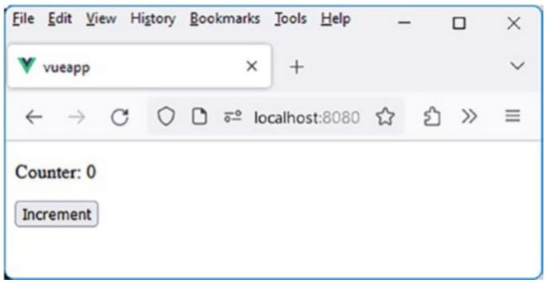

<details>
<summary>text_image</summary>

File Edit View History Bookmarks Tools Help
vueapp
localhost:8080
Counter: 0
Increment
</details>

Figure 1-1. First display of the Vue.js application

Upon clicking the “Increment” button once, the counter value increments from 0 to 1:

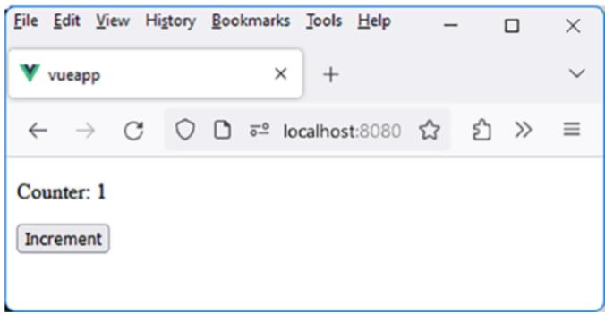

<details>
<summary>text_image</summary>

File Edit View History Bookmarks Tools Help
vueapp
localhost:8080
Counter: 1
Increment
</details>

Figure 1-2. Incrementing the counter from 0 to 1

Let’s examine how Vue.js’s Virtual DOM handles updates when clicking the button to increment the counter:

1. Upon startup, the MyCounter component is mounted, and the Virtual DOM is created based on the template and initial data.  
2. When clicking the “Increment” button, the increment() method is called. This changes the value of the count variable in the component.  
3. Vue.js detects the data change through its reactivity system.  
4. The Virtual DOM is updated to reflect the new value of count. Vue.js compares the old and new Virtual DOM to determine differences.  
5. Vue.js generates a set of instructions describing the modification to be made to the real DOM. In this case, the instructions simply indicate that the counter text should be updated.

6. The real DOM is updated with the executed instructions. Only the part of the DOM corresponding to the counter is modified, minimizing direct DOM manipulations.

This example illustrates how Vue.js’s Virtual DOM optimizes DOM updates by detecting changes, then generating efficient instructions to selectively update the real DOM. This provides a reactive user experience while optimizing performance.

### Creating a First Vue.js Application

Creating a Vue.js application requires installing the Vue CLI utility, downloadable after installing the npm utility from the Node.js server.

### Step 1: Installing Node.js and Vue CLI

Ensure that you have Node.js installed on your system, which you can download from the official Node.js website (https://nodejs.org/). Next, install Vue CLI using the npm install -g @vue/cli command in your terminal:

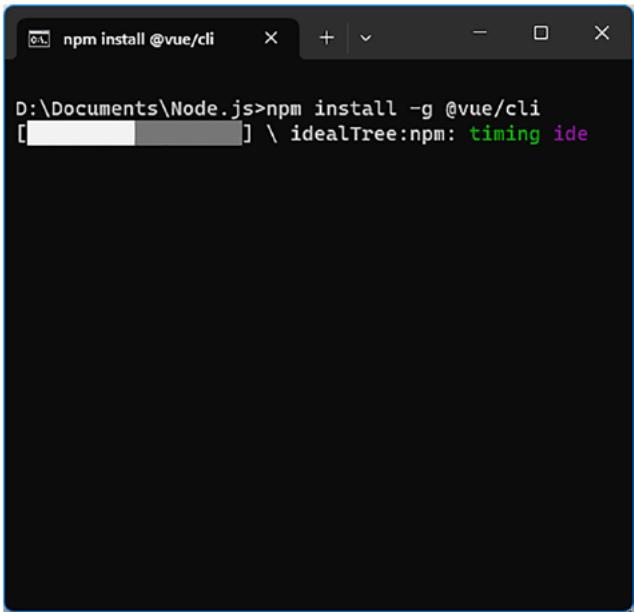

<details>
<summary>text_image</summary>

D:\Documents\node.js>npm install -g @vue/cli
[ ] \ idealTree:npm: timing ide
</details>

Figure 1-3. Vue CLI installation

Once Vue CLI is installed, you can use the vue create command to create the Vue.js application.

### Step 2: Creating the Vue.js Application

After installing Vue CLI, you can create a new Vue.js project by running the command vue create vueapp. This will create the vueapp application in the newly created vueapp directory:

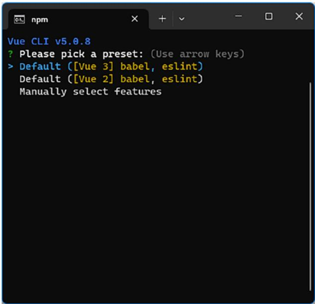

<details>
<summary>text_image</summary>

Vue CLI v5.0.8
? Please pick a preset: (Use arrow keys)
> Default ([Vue 3] babel, eslint)
Default ([Vue 2] babel, eslint)
Manually select features
</details>

Figure 1-4. Creating the Vue.js application with Vue CLI

The system prompts for the desired version of Vue.js. We retain the default selection of the current version 3 by pressing the Enter key on the keyboard.

The Vue.js application named vueapp begins to be created:

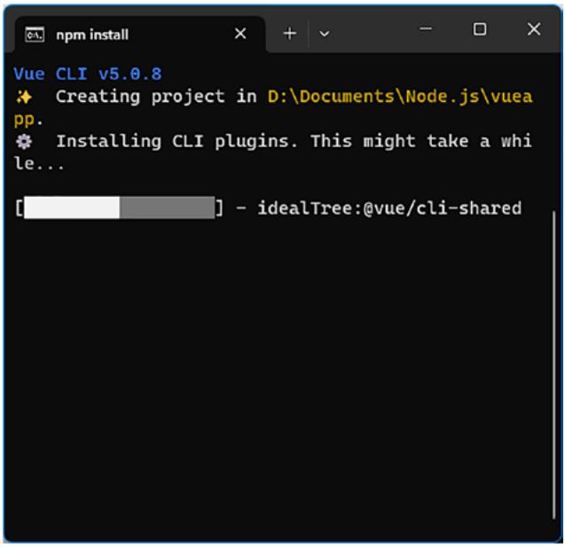

<details>
<summary>text_image</summary>

Vue CLI v5.0.8
Creating project in D:\Documents\Node.js\vuea
pp.
Installing CLI plugins. This might take a while...
[ ] - idealTree:@vue/cli-shared
</details>

Figure 1-5. Creating the Vue.js application in progress

Once the application creation process is complete, it will be displayed on the screen:

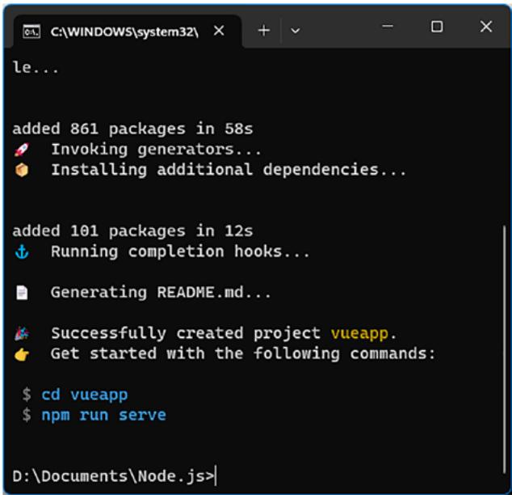

<details>
<summary>text_image</summary>

C:\WINDOWS\system32\
le...

added 861 packages in 58s
✓ Invoking generators...
✓ Installing additional dependencies...

added 101 packages in 12s
↓ Running completion hooks...

✓ Generating README.md...

✓ Successfully created project vueapp.
✓ Get started with the following commands:

$ cd vueapp
$ npm run serve

D:\Documents\Node.js>
</details>

Figure 1-6. Completion of Vue.js application creation

Once the Vue.js application is created, the next step is to start it.

### Step 3: Launching the Vue.js Application

To start the previously created Vue.js application, simply type the two commands in the terminal window as indicated: cd vueapp, then npm run serve.

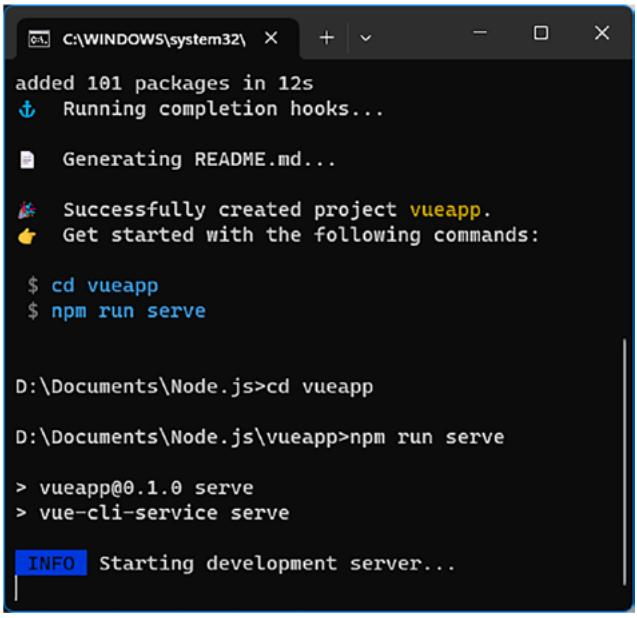

<details>
<summary>text_image</summary>

added 101 packages in 12s
Running completion hooks...
Generating README.md...
Successfully created project vueapp.
Get started with the following commands:
$ cd vueapp
$ npm run serve
D:\Documents Player.js>cd vueapp
D:\Documents Player.js\vueapp>npm run serve
> vueapp@0.1.0 serve
> vue-cli-service serve
INFO Starting development server...
</details>

Figure 1-7. Launching the Vue.js application

The npm run serve command starts a Node.js server on which the Vue.js application will run.

Once the Node.js server is launched, the terminal screen becomes the following:

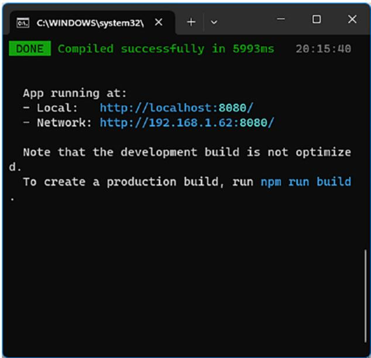

<details>
<summary>text_image</summary>

DONE Compiled successfully in 5993ms 20:15:40
App running at:
- Local: http://localhost:8080/
- Network: http://192.168.1.62:8080/
Note that the development build is not optimized.
To create a production build, run npm run build
</details>

Figure 1-8. Completion of the server launch process with the Vue.js application

The terminal window indicates that the Vue.js application is accessible at the URL http://localhost:8080.

Let’s enter this URL in a browser:


<details>
<summary>text_image</summary>

Welcome to Your Vue.js App
For a guide and recipes on how to configure / customize this project,
check out the vue-cli documentation.
Installed CLI Plugins
</details>

Figure 1-9. Default Vue.js application created

We now have access to the previously created Vue.js application.

### Analyzing the Files Created by Default in the Vue.js Application

The vue create vueapp command created a vueapp directory containing configuration files and directories containing the source code for our Vue. js application.

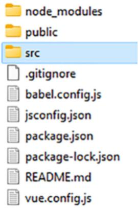

<details>
<summary>text_image</summary>

node_modules
public
src
.gitignore
babel.config.js
jsconfig.json
package.json
package-lock.json
README.md
vue.config.js
</details>

Figure 1-10. Contents of the “vueapp” directory in the Vue.js application

We can see that the Vue.js application directory primarily contains configuration files and three main directories (node\_modules, public, and src). Let’s now explain their role and contents.

### Step 1: Configuration Files (with .js and .json Extensions)

The configuration files are directly attached to the root of the application. They serve, among other things, to enable the execution of the Vue.js application on a Node.js server. For example, here is the content of the package.json file, which is traditionally used to configure an application to run on a Node.js server:

**File package.json**

```json
{
    "name": "vueapp",
    "version": "0.1.0",
    "private": true,
}
```

```json
"scripts": {
    "serve": "vue-cli-service serve",
    "build": "vue-cli-service build",
    "lint": "vue-cli-service lint"
},
"dependencies": {
    "core-js": "^3.8.3",
    "vue": "^3.2.13"
},
"devDependencies": {
    "@babel/core": "^7.12.16",
    "@babel/eslint-parser": "^7.12.16",
    "@vue/cli-plugin-babel": "~5.0.0",
    "@vue/cli-plugin-eslint": "~5.0.0",
    "@vue/cli-service": "~5.0.0",
    "eslint": "^7.32.0",
    "eslint-plugin-vue": "^8.0.3"
},
"eslintConfig": {
    "root": true,
    "env": {
    "node": true
    },
    "extends": [
    "plugin:vue/vue3-essential",
    "eslint:recommended"
    ],
    "parserOptions": {
    "parser": "@babel/eslint-parser"
    },
    "rules": {}
```

Chapter 1 Day 1: Mastering Com ponents in Vue.js  
```txt
},
"browserslist": [
"> 1%", 
"last 2 versions",
"not dead",
"not ie 11"
]
}
```

In this file, you’ll find the list of dependencies that our application needs to run, along with their respective versions.

The “scripts” key allows the execution of commands such as npm run serve, which launches the development server on port 8080.

Additional scripts can be added. For example, let’s insert a new script “start” in the “scripts” section that starts the Vue.js application on port 3000 instead of the default port 8080.

Adding the "start" script (package.json file)  
```txt
"scripts": {
    "serve": "vue-cli-service serve",
    "start": "vue-cli-service serve --port 3000",
    "build": "vue-cli-service build",
    "lint": "vue-cli-service lint"
},
```

The command npm run start starts the server on port 3000.


<details>
<summary>text_image</summary>

D:\Documents\node.js\vueapp>npm run start
> vueapp@0.1.0 start
> vue-cli-service serve --port 3000
INFO Starting development server...
DONE Compiled successfully in 4455ms
14:05:47
App running at:
- Local: http://localhost:3000/
- Network: http://192.168.1.62:3000/
Note that the development build is not optimized
To create a production build, run npm run build.
</details>

Figure 1-11. Execution of the “start” script

The Vue.js application is now accessible at the URL http:// localhost:3000, thanks to the server launched on port 3000.

We briefly examined the configuration files of the Vue.js application. Let’s now look at the application directories, starting with the node\_ modules directory.

### Step 2: node\_modules Directory

The node\_modules directory contains external dependencies necessary for the proper functioning of the Vue.js application (those specified in the package.json file), as well as other libraries and modules that may be added to the project later.

Here is a partial content of this directory shortly after creating the application.

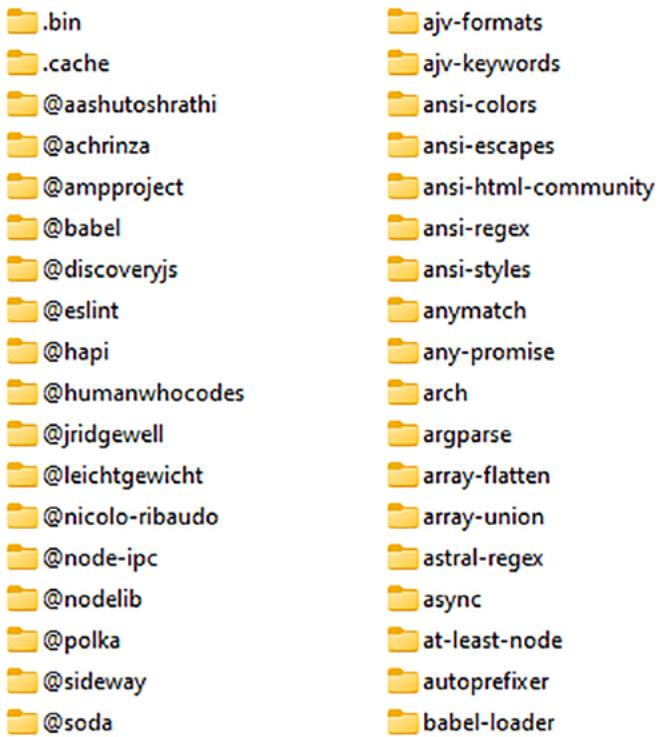

<details>
<summary>text_image</summary>

.bin
.cache
@aashutoshrathi
@achrinza
@ampproject
@babel
@discoveryjs
@eslint
@hapi
@humanwhocodes
@jridgewell
@leichtgewicht
@nicolo-ribaudo
@node-ipc
@nodelib
@polka
@sideway
@soda
</details>

Figure 1-12. Partial content of the node\_modules directory

### Step 3: public Directory

The public directory contains the static files of the application. This public directory typically includes the following two files:

The favicon.png file, which specifies the application’s icon to be displayed in the browser tabs.  
The index.html file, which is the starting file of the Vue.js application.

Let’s see the content of the index.html file. This content is rarely modified as it incorporates a crucial <div> HTML element for the functioning of the Vue.js application.

File public/index.html  
```erb
<!DOCTYPE html>
<html lang="">
<head>
    <meta charset="utf-8">
    <meta http-equiv="X-UA-Compatible" content="IE=edge">
    <meta name="viewport" content="width=device-width,initial-scale=1.0">
    <link rel="icon" href="<%= BASE_URL %>favicon.ico">
    <title><%= htmlWebpackPlugin.options.title %></title>
</head>
<body>
    <noscript>
    <strong>We're sorry but <%= htmlWebpackPlugin.options.title %> doesn't work properly without JavaScript enabled. Please enable it to continue.</strong>
    </noscript>
    <div id="app"></div>
    <!-- built files will be auto injected -->
</body>
</html>
```

The index.html file contains a single <div> element, which has been assigned the default identifier "app". This convention allows us to insert the Vue.js components of our application into this <div> element, visualizing the Vue.js application in the browser. We will see here how this is achieved.

Now let’s examine the content of the src directory, which will help us understand the purpose of the previous <div> element.

### Step 4: src Directory

The src directory of the application is the most widely used and modified when building our Vue.js applications. It contains the source code for our Vue.js components as well as static files such as images or CSS style files.

It consists of the following files and directories:

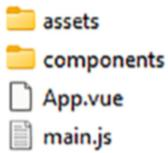

<details>
<summary>text_image</summary>

assets
components
App.vue
main.js
</details>

Figure 1-13. Content of the src directory

Let’s examine in detail each file and directory listed in the src directory. We’ll start with the main.js file.

### Step 5: src/main.js

The main.js file is crucial for starting a Vue.js application. Let’s see its content:

**File src/main.js**

import { createApp } from 'vue' import App from './App.vue'

createApp(App).mount('#app')

Here’s an explanation of the previous code:

1. The first statement import { createApp } from 'vue' imports the createApp() function from the “vue” package. The “vue” package is located in the node\_modules directory of the application. The createApp() function will be used later to create a Vue.js application instance.  
2. The second statement import App from './App. vue' imports the App component from the App.vue file. The App component will be the root component of the application.  
3. Finally, the statement createApp(App). mount('#app') first calls the createApp(App) function to create a Vue.js application instance using the previously imported App component. Then the mount('#app') method is called on this instance. This mounts the application onto the DOM element with the id "app". This "app" element was present in the index.html file seen earlier. This element serves as the main container in which the Vue.js application will be displayed.

In summary, the code in the main.js file creates an instance of the Vue. js application using the App component as the root component and then mounts this instance on an element with the id "app" in the DOM. This effectively initializes the Vue.js application and makes it ready to be displayed and used in the browser.

### Step 6: src/App.vue

We explained previously that the App.vue file is associated with the App component, which will be displayed in the HTML page. The App component describes the structure of our Vue.js application using the syntax provided by the Vue.js framework. Here is the content of the App.vue file:

App component (src/App.vue file)  
```vue
<template>
    
    <HelloWorld msg="Welcome to Your Vue.js App"/>
</template>

<script>
import HelloWorld from './components/HelloWorld.vue'
export default {
    name: 'App',
    components: {
    HelloWorld
    }
}
</script>

<style>
#app {
    font-family: Avenir, Helvetica, Arial, sans-serif;
    -webkit-font-smoothing: antialiased;
    -moz-osx-font-smoothing: grayscale;
    text-align: center;
    color: #2c3e50;
    margin-top: 60px;
}
</style>
```

The App.vue file is a Vue.js component that defines the structure (<template> section), logic (<script> section), and style (<style> section) of the main part of the application. Here is a concise explanation of the content:

**1. <template> section**

The content between the <template> tags defines the HTML structure of the component.  
It includes an  tag displaying a Vue.js logo and a <HelloWorld> component with a "msg" property.

**2. <script> section**

The <script> section contains the JavaScript logic of the component.  
It imports the HelloWorld component from the HelloWorld.vue file.  
The exported object (via the export default statement) defines the name of the component (here, "App") and the components it uses (in this case, "HelloWorld").

**3. <style> section**

The <style> section contains CSS style rules for the component.  
The element with the id "app" is styled with various CSS properties for formatting the application. Recall that the element with the id "app" is the one on which the Vue.js application is “mounted.”

In summary, the App.vue file combines HTML structure, JavaScript logic, and CSS styles to define the main component of the application. It imports the HelloWorld component and displays a Vue.js logo and a message inside this component. The style is applied to the main container with the id "app". This file forms the visual and functional basis of the application.

This App.vue file (associated with the App component) will need to be modified later to display our own Vue.js application.

We have described the two main files in the src directory, namely, the main.js file and the App.vue file. We have seen that the App component uses another component named HelloWorld. This new component is located in the components directory of the application. Let’s describe the contents of the components directory, specifically the HelloWorld.vue file associated with the HelloWorld component.

### Step 7: src/components Directory

The src/components directory contains files describing the internal components of our Vue.js application. Subdirectories can be added if a more structured organization is desired.

Let’s examine the file currently present in this directory. It is the HelloWorld.vue file associated with the HelloWorld component.

HelloWorld component (src/components/HelloWorld.vue file)  
```txt
<template>
<div class="hello">
    <h1>{{ msg }}</h1>
    <p>
    For a guide and recipes on how to configure / customize this project,<br>
    check out the
    <a href="https://cli.vuejs.org" target="_blank"
    rel="noopener">vue-cli documentation</a>.
```

```txt
</p>
<h3>Installed CLI Plugins</h3>
<ul>
    li><a href="https://github.com/vuejs/vue-cli/tree/dev/packages/%40vue/cli-plugin-babel" target="_blank" rel="noopener">babel</a></li>
    <li><a href="https://github.com/vuejs/vue-cli/tree/dev/packages/%40vue/cli-plugin-eslint" target="_blank" rel="noopener">eslint</a></li>
</ul>
<h3>Essential Links</h3>
<ul>
    <li><a href="https://vuejs.org" target="_blank" rel="noopener">Core Docs</a></li>
    <li><a href="https://forum.vuejs.org" target="_blank" rel="noopener">Forum</a></li>
    <li><a href="https://chat.vuejs.org" target="_blank" rel="noopener">CommunityChat</a></li>
    <li><a href="https://twitter.com/vuejs" target="_blank" rel="noopener">Twitter</a></li>
    <li><a href="https://news.vuejs.org" target="_blank" rel="noopener">News</a></li>
</ul>
<h3>Ecosystem</h3>
<ul>
    <li><a href="https://router.vuejs.org" target="_blank" rel="noopener">vue-router</a></li>
    <li><a href="https://vux.vuejs.org" target="_blank" rel="noopener">vuex</a></li>
    <li><a href="https://github.com/vuejs/vue-devtools#vue-devtools" target="_blank" rel="noopener">vue-devtools</a></li>
```

Chapter 1 Day 1: Mastering Com ponents in Vue.js  
```txt
<li><a href="https://vue-loader.vuejs.org" target="_blank" rel="noopener">vue-loader</a></li>
<li><a href="https://github.com/vuejs/awesome-vue" target="_blank" rel="noopener">awesome-vue</a></li>
</ul>
</div>
</template>

<script>
export default {
    name: 'HelloWorld',
    props: {
    msg: String
    }
}
</script>

<!-- Add "scoped" attribute to limit CSS to this component only -->
<style scoped>
h3 {
    margin: 40px 0 0;
}
ul {
    list-style-type: none;
    padding: 0;
}
li {
    display: inline-block;
    margin: 0 10px;
}
```

```vue
a {
    color: #42b983;
}
</style>
```

We find the three sections of a Vue.js component, as we discussed in the previous section when describing the App component:

The <template> section defines the HTML structure of the component.  
The <script> section describes the JavaScript logic of the component.  
The <style> section describes the styles used in the component. The scoped attribute indicated here localizes the styles defined only for the HelloWorld component.

We will have the opportunity in the following pages to explain in detail the possible content of a Vue.js component. We already know that it contains the three sections mentioned earlier.

### Step 8: src/assets Directory

The src/assets directory is used to store static files of the application, such as images or globally applied CSS files for the entire Vue.js application. In our case, it contains only the logo.png file corresponding to the image displayed in the Vue.js application.

We have now completed the quick description of each of the files and directories created in the default Vue.js application "vueapp" using the vue create vueapp command. We have seen that the files describing our application are mainly located in the src directory and its subdirectories.

We will now explain how to design a Vue.js application by breaking it down into different components according to what we want to achieve.

### Decomposition of a Vue.js Application into Components

Breaking down an application into components, as Vue.js suggests, is a common approach in software development. This methodology promotes the creation of a modular structure that simplifies code maintenance, reuse, and clarity.

Here is a simple example of breaking down an application into components.

Let’s imagine that we want to design an application that displays a list of tasks to be done, each accompanied by a check box to indicate its status (completed or not). To do this, we would start by segmenting the application into two main components: a parent component called “TaskList” and a child component named “TaskItem.”

The parent component “TaskList” would be responsible for managing the complete list of tasks to be done. Its responsibility would involve retrieving the list data from a data source (such as an API or a database), performing sorting and filtering operations, and then passing this data to the child component “TaskItem.”

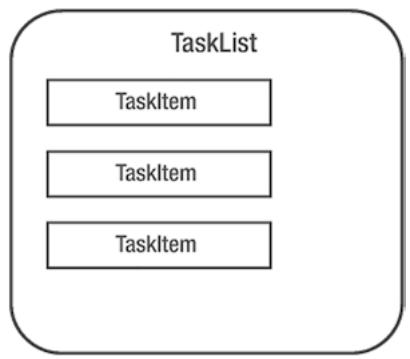

<details>
<summary>flowchart</summary>

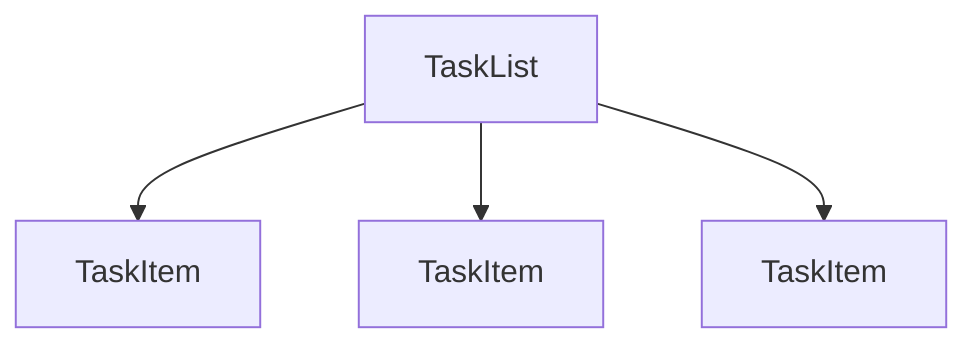
```mermaid
graph TD
  A["TaskList"] --> B["TaskItem"]
  A --> C["TaskItem"]
  A --> D["TaskItem"]
```
</details>

Figure 1-14. TaskList and TaskItem components

The child component “TaskItem,” on the other hand, would be responsible for displaying an individual task. It would show the task’s name and a check box to indicate its status (completed or not). This component would be versatile and display each task whenever it is called by the parent component “TaskList.”

Next, we could further fragment the “TaskList” component into subcomponents. For example, “TaskListHeader” could handle the header of the list, “TaskListFooter” the bottom of the list, and “TaskListFilter” the management of filters within the list. Each subcomponent would be responsible for a specific part of the task list, contributing to code clarity and reusability.

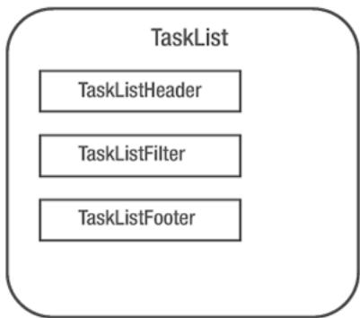

<details>
<summary>flowchart</summary>

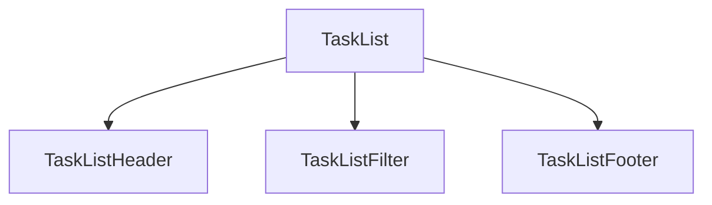
```mermaid
graph TD
  A["TaskList"] --> B["TaskListHeader"]
  A --> C["TaskListFilter"]
  A --> D["TaskListFooter"]
```
</details>

Figure 1-15. TaskList, TaskListHeader, TaskListFilter, and TaskListFooter components

Finally, we could also subdivide the “TaskItem” component into additional subcomponents. For example, “TaskName” could focus on displaying the task’s name, “TaskCheckbox” on showing the check box, and “TaskDueDate” on displaying the task’s due date. Each of these subcomponents would play a specific role in displaying an individual task, bringing more modularity to the design and simplifying code management.

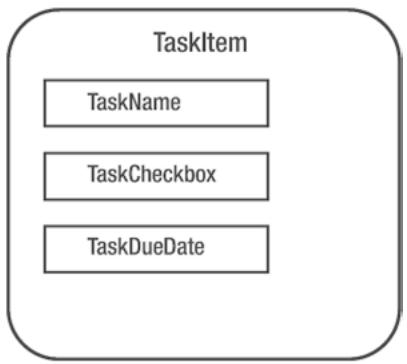

<details>
<summary>flowchart</summary>

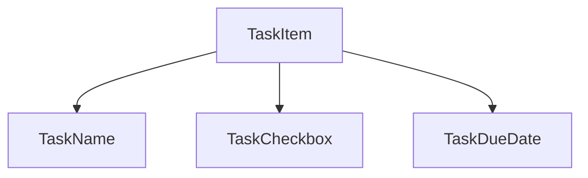
```mermaid
graph TD
  A["TaskItem"] --> B["TaskName"]
  A --> C["TaskCheckbox"]
  A --> D["TaskDueDate"]
```
</details>

Figure 1-16. TaskItem, TaskName, TaskCheckbox, and TaskDueDate components

By decomposing our application into components, we’ve established a modular architecture, simplifying code readability, update management, and the potential for reuse. Moreover, since each component is responsible for a well-defined task, the debugging process is greatly facilitated, as each component can be addressed independently.

### Naming Conventions for Vue.js Components

A Vue.js component name is written in PascalCase, with an initial capital letter for each word in the component’s name. To avoid assigning a component name that might also be associated with an HTML element, the Vue.js component name must be defined with a minimum of two words. HTML elements are all defined with a single word, such as , <p>, <span>, etc. Therefore, if Vue.js component names are defined with a minimum of two words, there is no risk of confusion with HTML tag names.

Thus, you can create the MyCounter component in Vue.js, but you cannot create the Counter component because it consists of a single word, while MyCounter consists of two words.

The only exception to this rule is the App component, which is the only one written with a single word.

Once the MyCounter component is created, it can be used in the <template> sections as <MyCounter> or <my-counter>. Both forms of writing are equivalent in Vue.js, although the <MyCounter> syntax is recommended.

### Creating a First Component with Vue.js

A component is defined using a .vue extension file and must be in the form of components like App and HelloWorld, defined in the App.vue and HelloWorld.vue files described earlier. It will thus include the <script>, <template>, and <style> sections, which will be filled in according to the component’s needs. If one of the sections has no elements, it can be omitted. This is often the case for the <style> section.

Here is an example of the MyCounter.vue component, which simply displays the text “MyCounter Component” in an <h1> tag. The MyCounter. vue file will be located in the components directory of the src directory in the application.

File src/components/MyCounter.vue  
```vue
<script>
</script>
<template>
<h1> MyCounter Component </h1>
</template>
<style scoped>
</style>
```

The <script> and <style> sections are not necessary but are present as they may contain added instructions later. The MyCounter component needs to be inserted into the App component to be displayed within it. Indeed, the App component currently uses the HelloWorld component seen previously. Let’s modify the App component to incorporate the MyCounter component.

The App component can be written in two ways, depending on the Vue. js syntax one wishes to use:

Options API syntax (available from Vue.js version 2)  
Composition API syntax (available from Vue.js version 3)

Using the Options API syntax, the App.vue file becomes the following:

Using the Options API syntax (file src/App.vue)  
```vue
<script>
import MyCounter from './components/MyCounter.vue'

export default {
    components : {
    MyCounter : MyCounter
    // As the key and the value are identical, we can also write more simply:
    // MyCounter
    }
}

</script>

<template>
    <MyCounter />
</template>

<style scoped>
</style>
```

The MyCounter.vue file is imported into the App component using the import statement in the <script> section of the component. Then, the MyCounter component is displayed in the <template> section using the <MyCounter /> tag.

In the <script> section, we added the export default statement of an object with the components option describing the components used in the App component. This is the traditional way of using the syntax with options, proposed in version 2 of Vue.js. It is called the Options API syntax.

Another syntax is possible, introduced from version 3 of Vue.js. It is called the Composition API syntax.

Let’s use the Composition API syntax to write the App component in the App.vue file:

Using the Composition API syntax (file src/App.vue)  
```vue
<script setup>
import MyCounter from './components/MyCounter.vue'
</script>

<template>
    <MyCounter />
</template>

<style scoped>
</style>
```

Here, note the setup attribute added to the <script> element. This attribute in the <script> tag allows importing the MyCounter.vue file without having to explicitly declare the MyCounter component within the App component. This is a convenience added in Vue.js version 3, known as the Composition API syntax.

Let’s verify that both versions of the App component work by displaying the URL http://localhost:8080.

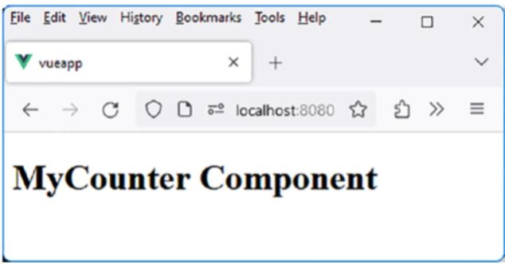

<details>
<summary>text_image</summary>

File Edit View History Bookmarks Tools Help
vueapp
localhost:8080
MyCounter Component
</details>

Figure 1-17. MyCounter Component

Which syntax, Options API or Composition API, should we use to write a Vue.js component? We will use the Composition API syntax here, as it is newer and simpler to use for writing components.

### Defining Styles in a Vue.js Component

Let’s modify the style of the <h1> element in the MyCounter component. To do this, simply add a CSS style in the <style> section of the MyCounter component.

Style of the <h1> element (file src/components/MyCounter.vue)  
```vue
<script setup>
</script>
<template>
<h1> MyCounter Component </h1>
</template>
<style scoped>
h1 {
    font-family:papyrus;
}
```

```vue
font-size:20px;
}
</style>
```

The MyCounter component now displays with a new font style.

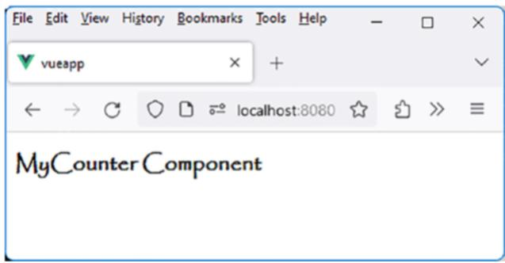

<details>
<summary>text_image</summary>

File Edit View History Bookmarks Tools Help
vueapp
localhost:8080
MyCounter Component
</details>

Figure 1-18. Component MyCounter with a new font style

Let’s now explain the use of the scoped attribute in the <style> tag.

### Using the Scoped Attribute in the <style> Tag

The scoped attribute in a <style> tag in Vue.js is used to restrict the scope of CSS styles to a specific component. This means that styles defined within a <style scoped> tag will only apply to elements within the current Vue component and will not propagate to elements in other components.

Here is an example to illustrate the difference between using scoped and not using it:

Without the scoped attribute (file src/components/MyCounter.vue)  
```txt
<template>
<div>
<p class="red-text">MyCounter Component</p>
</div>
```

Chapter 1 Day 1: Mastering Com ponents in Vue.js  
```vue
</template>
```

<style>  
```vue
.red-text {
    color: red;
}
</style>
```

In this example, the CSS class .red-text is defined in the global style of the component. It could potentially impact other components if the class is used elsewhere in the application.

With the scoped attribute (file src/components/MyCounter.vue)  
```vue
<template>
    <div>
    <p class="red-text">MyCounter Component</p>
    </div>
</template>
```

<style scoped>  
```vue
.red-text {
    color: red;
}
</style>
```

In this example, the .red-text class is defined within a <style scoped> tag, indicating that it will only apply to elements within the current component. The styles defined here will have no impact on other components.

The scoped attribute is particularly useful for avoiding style conflicts between components and maintaining style isolation. It facilitates the creation of reusable components and simplifies style management in a Vue.js application. Each component can define its styles without concern for styles defined in other components, contributing to better code organization and maintainability.

### Using Vue.js DevTools

Vue.js DevTools is a browser extension designed for debugging applications built with Vue.js. Simply search for “Vue.js DevTools” on Google to download it for our browser.

For instance, here is the link for Firefox:

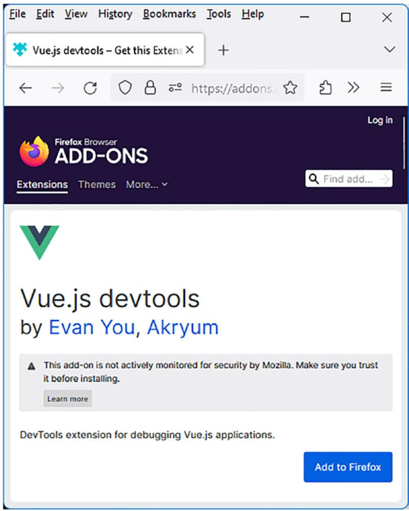

<details>
<summary>text_image</summary>

File Edit View History Bookmarks Tools Help
Vue.js devtools – Get this Extens ✗
https://addons. 
Log in
Firefox Browser
ADD-ONS
Extensions Themes More...
Find add... →
Vue.js devtools
by Evan You, Akryum
▲ This add-on is not actively monitored for security by Mozilla. Make sure you trust
it before installing.
Learn more
DevTools extension for debugging Vue.js applications.
Add to Firefox
</details>

Figure 1-19. Installation of the Vue DevTools extension on Firefox

Click the “Add to Firefox” button. Next, display the console by pressing the F12 key on the keyboard. Then, select the Vue menu by clicking >>.

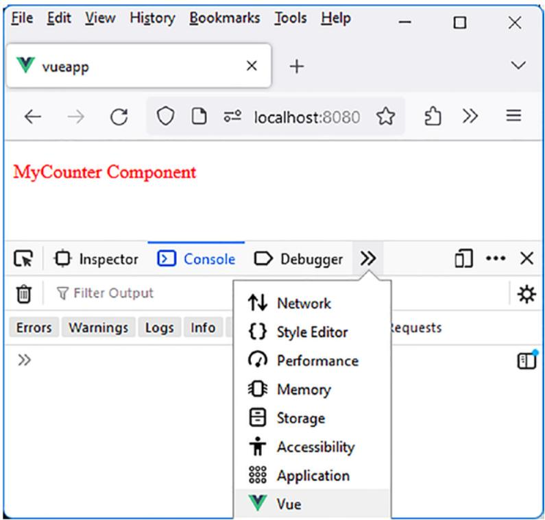

<details>
<summary>text_image</summary>

File Edit View History Bookmarks Tools Help
vueapp
localhost:8080
MyCounter Component
Inspector Console Debugger
Filter Output
Network
Style Editor
Performance
Memory
Storage
Accessibility
Application
Vue
</details>

Figure 1-20. Selection of the Vue DevTools extension

The console window refreshes, displaying the components used in the application:

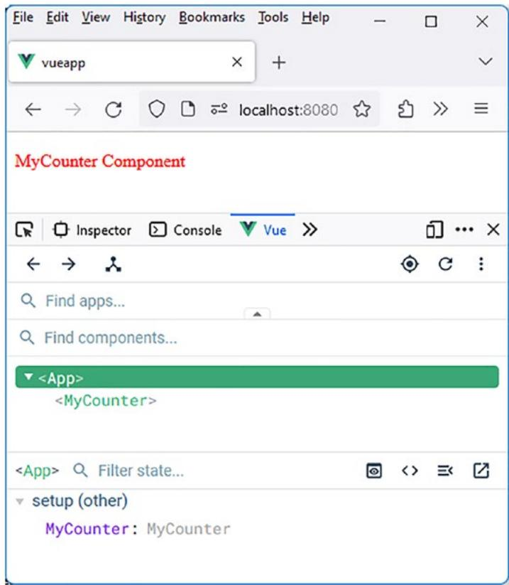

<details>
<summary>text_image</summary>

File Edit View History Bookmarks Tools Help
vueapp
localhost:8080
MyCounter Component
Inspector Console Vue
Find apps...
Find components...
(App>
<MyCounter>
(App> Filter state...
setup (other)
MyCounter: MyCounter
</details>

Figure 1-21. Components of the application displayed in Vue DevTools

### Using Vue.js Reactivity with the ref( ) Method

Reactivity is a crucial concept when developing applications with Vue. js. This concept allows for automatic updating of the HTML page display when a so-called reactive variable is modified in the program.

If a reactive variable is modified by the program, this modification will be visible wherever the reactive variable is used in the component’s display.

This concept enables the separation of program variables and where they are displayed, as Vue.js takes care of managing the display modification.

A reactive variable is defined within a component and is associated with the component in which it is defined. We create a reactive variable using the ref() method defined in Vue.js. Let’s demonstrate how to define and modify a reactive variable with the ref() method. We will use a component called MyCounter, which displays a reactive variable count that increments when a button is clicked.

In all the following examples, the App component, which incorporates the MyCounter component, is as described here:

App component (file src/App.vue)  
```vue
<script setup>
import MyCounter from './components/MyCounter.vue'
</script>

<template>
    <MyCounter />
</template>
```

We use the Composition API syntax to define and use a reactive variable count that increments upon clicking a button labeled “count+1”. The Composition API of Vue.js defines the ref() method, which we will employ.

The MyCounter component is written as follows:

MyCounter component (file src/components/MyCounter.vue)

<script setup>

import { ref } from "vue";

// Creating a reactive variable count with an initial value of 0

const count = ref(0);  
```txt
</script>
<template>
<h3>MyCounter Component</h3>
Reactive variable count: <b>{{ count }}</b>
<br /><br />
<button @click="count++">count+1</button>
</template>
```

The Composition API is used here within the <script setup> syntax. The ref() method, defined in Vue.js, is usable because it is imported with the statement import { ref } from "vue". All Vue.js methods used in our programs must be imported in this manner before they can be utilized. A slight variation of this syntax is explained in the following section.

The reactive variable count is created and initialized with the statement count = ref(value). Subsequently, the count variable can be used in the <template> section, as mentioned earlier. Let’s display the URL http://localhost:8080 in the browser:

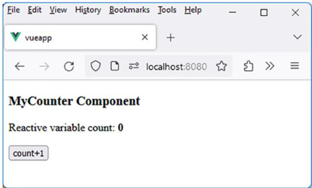

<details>
<summary>text_image</summary>

File Edit View History Bookmarks Tools Help
vueapp
localhost:8080
MyCounter Component
Reactive variable count: 0
count+1
</details>

Figure 1-22. Usage of a reactive variable “count”

Let’s click multiple times the “count+1” button:

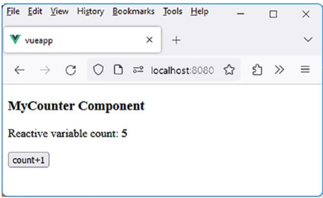

<details>
<summary>text_image</summary>

File Edit View History Bookmarks Tools Help
vueapp
localhost:8080
MyCounter Component
Reactive variable count: 5
count+1
</details>

Figure 1-23. Incrementing the reactive variable “count”

The variable count is indeed reactive as it is modified with each click on the “count+1” button.

Notice that the incrementation of the count variable is performed directly in the <template> section by writing the <button> element as follows:

**Incrementation of the reactive variable count (file src/components/ MyCounter.vue)**

<button @click="count++">count+1</button>

The operation performed here is simple and corresponds to the "count++" instruction. However, in more complex scenarios, it would be more appropriate to use a function call to perform the corresponding processing.

### Importing Vue.js Methods into Our Programs

The use of the ref() method requires writing the statement import { ref } from "vue", where the curly braces contain the list of methods used in the JavaScript code.

Alternatively, one can perform a global import of all Vue.js methods without having to enumerate them in the list. This can be achieved using the statement import \* as vue from "vue". The variable name used after the "as" keyword is arbitrary but must be used in the subsequent JavaScript code. Let’s rewrite the previous program following this principle:

Using import \* as vue from “vue” (file src/components/MyCounter.vue)

<script setup>

import \* as vue from "vue";

// Creating a reactive variable count with an initial value of 0

const count = vue.ref(0);

</script>

<template>

<h3>MyCounter Component</h3>

Reactive variable count: <b>{{ count }}</b>

<br /><br />

<button @click="count++">count+1</button>

</template>

We observe that the statement ref(0) needs to be prefixed with the variable "vue", so it is written as vue.ref(0). In this instance, we chose to use the variable name "vue", but it can be any variable name.

### Defining Methods in a Vue.js Component

We’ve seen how to create reactive variables in the component using the ref(value) method. It’s also possible to create methods in a component that can be used in the <template> section of the component.

Previously, we wrote the processing to be executed after clicking the button directly in the value of the @click attribute. Instead of specifying the count++ instruction, we can replace it with a method call, for example, increment(). Thus, we would write @click="increment()" instead of @click="count++".

Let’s explore how to define and use methods using the Composition API syntax.

Definition of the increment() method (file src/components/ MyCounter.vue)  
```vue
<script setup>
import { ref } from "vue";
// Creating a reactive variable count with an initial
value of 0
const count = ref(0);
function increment() {
    count.value++; // One accesses the value of count using
    count.value
}
</script>
```

```vue
<template>
<h3>MyCounter Component</h3>
Reactive variable count: <b>{{ count }}</b>
<br /><br />
<button @click="increment()">count+1</button>
</template>
```

Functions are defined in the <script setup> section of the component. Functions defined in this section will then be accessible in the <template> section of the component.

Accessing the reactive variable count defined by count = ref(0) is done using the value property of the reactive variable count, namely, count.value.

Note that the variable count can be defined using the const keyword because it remains constant (its value, representing a reference to an object in memory, does not change). It is the value property of this object that is modified.

Let’s verify that everything works in the same manner:

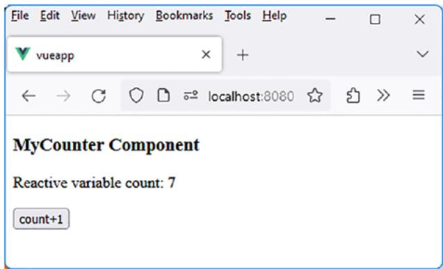

<details>
<summary>text_image</summary>

File Edit View History Bookmarks Tools Help
vueapp
localhost:8080
MyCounter Component
Reactive variable count: 7
count+1
</details>

Figure 1-24. Usage of methods in a component

Note that the increment() function can also be defined using the ES6 syntax. Instead of:

Traditional definition of the increment() function  
```javascript
function increment() {
    count.value++; // One accesses the value of count using count.value
}
one can also write the following:
```

Function increment() defined using ES6 syntax  
```typescript
const increment = () => {
    count.value++;
};
```

Now that we know how to define methods in a component, let’s explore how to define and use new reactive variables that depend on those already created. These new reactive variables are called computed properties.

### Defining Computed Properties in a Vue. js Component

Computed properties allow the creation of new reactive variables based on those already defined. Since computed properties are also reactive, they will be updated if any of the reactive variables they depend on is modified.

The advantage of computed properties is that their result is calculated only if one of the reactive variables associated with them is modified. This saves processing time compared to calling a traditional method (as a method performs its processing each time it is used).

To illustrate this, let’s create a new reactive variable named doubleCount, which is used to calculate double the value of the reactive variable count. The variable doubleCount is a computed property because it depends on one or more reactive variables. Its value will be automatically updated whenever any of the reactive variables it depends on is updated.

To define and use a computed property with the Composition API, we use the computed(callback) method defined in Vue.js. The callback() function should return the value of the computed property. The return value of the computed() method is associated with the name of the computed property, in the form of const doubleCount = computed(callback) to create the computed property doubleCount.

Creation of the computed property doubleCount (file src/components/ MyCounter.vue)  
```vue
<script setup>
import { ref, computed } from "vue";

// Usage of ref() to create a reactive variable
const count = ref(0);

// Usage of computed() to create a computed variable
const doubleCount = computed(function() {
    return count.value * 2;
});

const increment = () => {
    count.value++;
};

</script>

<template>
```

Chapter 1 Day 1: Mastering Com ponents in Vue.js  
```txt
<h3>MyCounter Component</h3>
Reactive variable count: <b>{{ count }}</b>
<br />
Computed variable doubleCount : <b>{{ doubleCount }}</b>
<br /><br />
<button @click="increment()">count+1</button>
</template>
```

After several clicks on the “count+1” button:

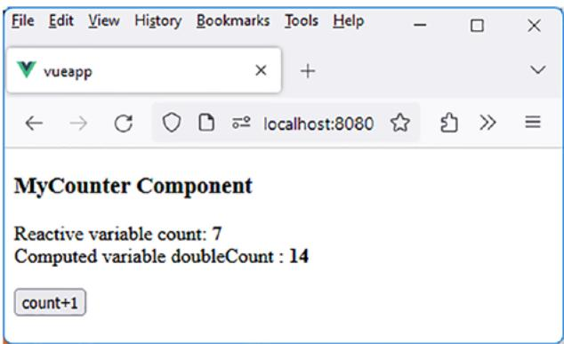

<details>
<summary>text_image</summary>

File Edit View History Bookmarks Tools Help
vueapp
localhost:8080
MyCounter Component
Reactive variable count: 7
Computed variable doubleCount : 14
count+1
</details>

Figure 1-25. Creation of the computed property doubleCount

We have seen how to use the click on a button to increment the reactive variable count. But suppose we want to increment the variable automatically, every second, as soon as the component is displayed. We will need to use a new concept, which is to use the lifecycle methods of a Vue.js component.

### Lifecycle in a Vue.js Component

When a Vue.js component is created in memory, it follows an internal lifecycle that corresponds to the different phases of its evolution:

1. It is created in memory and then attached to the DOM tree of the current HTML page.  
2. Next, it is possibly updated, if necessary (in the Virtual DOM and then in the real DOM).  
3. Finally, it is possibly removed, if necessary (from the Virtual DOM and the real DOM).

Each of the preceding steps is associated with an internal method in the Vue.js component. These internal methods are called lifecycle methods, and it is possible to use them in each Vue.js component. You can then write specific processing in each method.

Here are the different lifecycle methods that can be used in a Vue.js component. They all use a callback parameter, which is a function that describes the processing to be performed when the lifecycle method is triggered. These methods are executed by Vue.js in the order they are written here:

1. setup: The setup is not associated with a method but corresponds to the code written in the <script setup> section. It is executed only once during the creation of the component in memory.

2. onMounted(callback): This method is executed only once when the component has been inserted into the HTML page. The HTML elements associated with the component are in the DOM.

3. onUpdated(callback): This method is executed when the component has been updated (in memory and in the DOM). It is executed with each update.

4. onUnmounted(callback): This method is executed only once when the component is removed from memory.

The aforementioned methods allow processing after the insertion, update, or destruction of the component. Other methods exist to perform processing before it is realized. These are the following methods:

1. onBeforeMount(callback): This method is executed only once before the component is inserted into the HTML page.  
2. onBeforeUpdate(callback): This method is executed before the component is updated, with each update.  
3. onBeforeUnmount(callback): This method is executed only once before the component is removed.

Let’s write these methods in the MyCounter component and use them to display traces in the console.

Using lifecycle methods (file src/components/MyCounter.vue)  
```typescript
<script setup>
import { ref, computed, onBeforeMount, onMounted,
onBeforeUpdate, onUpdated, onBeforeUnmount, onUnmounted }
from "vue";
```  
console.log("setup: The component is created in memory.");

```javascript
// Usage of ref() to create a reactive variable
const count = ref(0);
// Usage of computed() to create a computed variable
const doubleCount = computed(function() {
    return count.value * 2;
});
```

```typescript
const increment = () => {
    count.value++;
};

// Lifecycle Methods
onBeforeMount(() => {
    console.log("onBeforeMount: The component is about to be mounted in the DOM.");
});

onMounted(() => {
    console.log("onMounted: The component has been mounted in the DOM.");
});

onBeforeUpdate(() => {
    console.log("onBeforeUpdate: The component is about to be updated.");
});

onUpdated(() => {
    console.log("onUpdated: The component has been updated.");
});

onBeforeUnmount(() => {
    console.log("onBeforeUnmount: The component is about to be unmounted.");
});

onUnmounted(() => {
    console.log("onUnmounted: The component has been unmounted.");
});
```

Chapter 1 Day 1: Mastering Com ponents in Vue.js  
```vue
</script>

<template>

<h3>MyCounter Component</h3>

Reactive variable count: <b>{{ count }}</b>

<br />

Computed variable doubleCount : <b>{{ doubleCount }}</b>

<br /><br />

<button @click="increment()">count+1</button>

</template>
```

Let’s run the previous program and observe the traces displayed in the console:

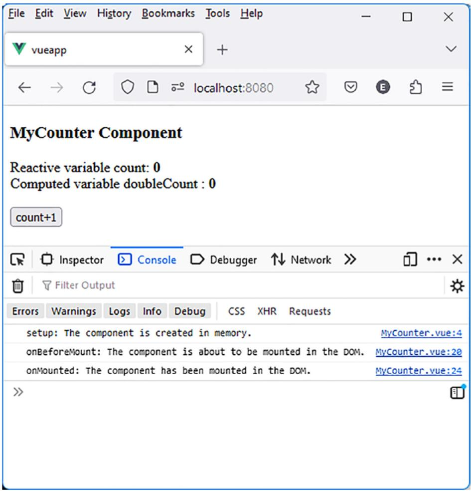

<details>
<summary>text_image</summary>

File Edit View History Bookmarks Tools Help
vueapp
localhost:8080
MyCounter Component
Reactive variable count: 0
Computed variable doubleCount : 0
count+1
Inspector Console Debugger ↑↓ Network >>
Filter Output
Errors Warnings Logs Info Debug CSS XHR Requests
setup: The component is created in memory.
onBeforeMount: The component is about to be mounted in the DOM.
onMounted: The component has been mounted in the DOM.
MyCounter.vue:4
MyCounter.vue:20
MyCounter.vue:24
>>
</details>

Figure 1-26. Lifecycle methods

We can see that the component is first created in memory and then mounted in the DOM.

Let’s click the “count+1” button. This will update the component by incrementing the reactive variable count:

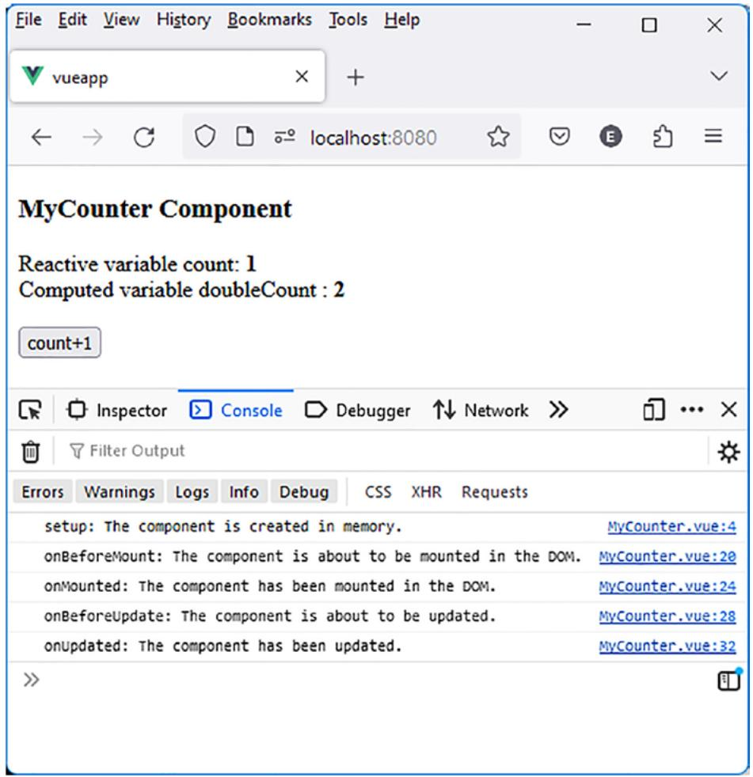

<details>
<summary>text_image</summary>

File Edit View History Bookmarks Tools Help
vueapp
localhost:8080
MyCounter Component
Reactive variable count: 1
Computed variable doubleCount : 2
count+1
Inspector Console Debugger Network
Filter Output
Errors Warnings Logs Info Debug CSS XHR Requests
setup: The component is created in memory.
onBeforeMount: The component is about to be mounted in the DOM.
onMounted: The component has been mounted in the DOM.
onBeforeUpdate: The component is about to be updated.
onUpdated: The component has been updated.
MyCounter.vue:4
MyCounter.vue:20
MyCounter.vue:24
MyCounter.vue:28
MyCounter.vue:32
>>
</details>

Figure 1-27. Component updated

The onBeforeUpdate() and onUpdated() methods were executed during the update of the reactive variable.

If we click again the “count+1” button, these methods are executed again:

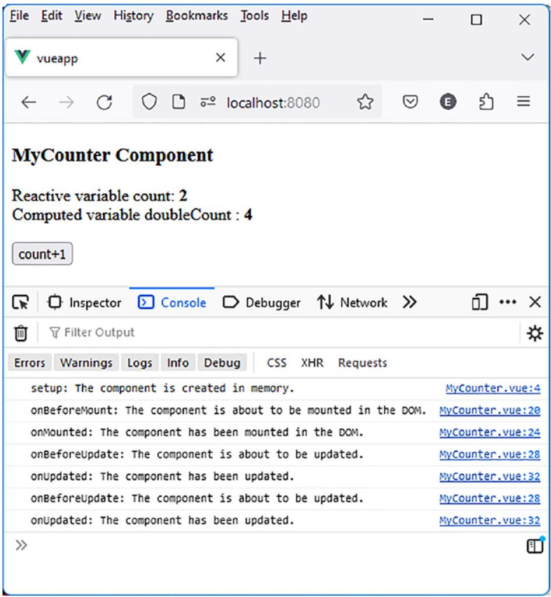

<details>
<summary>text_image</summary>

File Edit View History Bookmarks Tools Help
vueapp
localhost:8080
MyCounter Component
Reactive variable count: 2
Computed variable doubleCount : 4
count+1
Inspector Console Debugger ↑↓ Network >>
Filter Output
Errors Warnings Logs Info Debug CSS XHR Requests
setup: The component is created in memory.
onBeforeMount: The component is about to be mounted in the DOM.
onMounted: The component has been mounted in the DOM.
onBeforeUpdate: The component is about to be updated.
onUpdated: The component has been updated.
onBeforeUpdate: The component is about to be updated.
onUpdated: The component has been updated.
MyCounter.vue:4
MyCounter.vue:20
MyCounter.vue:24
MyCounter.vue:28
MyCounter.vue:32
MyCounter.vue:28
MyCounter.vue:32
>>
</details>

Figure 1-28. New update of the component

### Example of Using Lifecycle Methods in a Vue.js Component

We’ve seen when the lifecycle methods are triggered.

Let’s see how to use these lifecycle methods so that the MyCounter component displays a counter that increments every second (instead of using the button click as before). To achieve this, we need to use a timer with the setInterval() method of JavaScript. The timer will start in one of the methods indicating the creation of the component (e.g., the onMounted() method), and it will be stopped in one of the methods indicating the removal of the component (e.g., the onUnmounted() method).

We define two new methods in the MyCounter component, which are the start() and stop() methods:

1. The start() method starts the timer and will be called in the onMounted() method.  
2. The stop() method stops the timer and will be called in the onUnmounted() method.

Start the counter automatically (file src/components/MyCounter.vue)  
```javascript
<script setup>
import { ref, computed, onMounted, onUnmounted } from "vue";
let timer;
const count = ref(0);
const doubleCount = computed(() => count.value * 2);
const increment = () => {
    count.value++;
};
const start = () => {
    timer = setInterval(function() {
    increment();
```

```vue
}, 1000);
};
const stop = () => {
    cutInterval(timer);
};
onMounted(() => {
    start();
});
onUnmounted(() => {
    stop();
});
</script>

<template>
<h3>MyCounter Component</h3>
Reactive variable count: <b>{{ count }}</b>
<br />
Computed variable doubleCount : <b>{{ doubleCount }}</b>
</template>
```

Since the counter is started automatically, the “count+1” button has been removed from the component. The start() method is called in the onMounted() method but could have been called directly from the <script setup> section. Let’s verify that the counter is now automatically started without having to click the button:

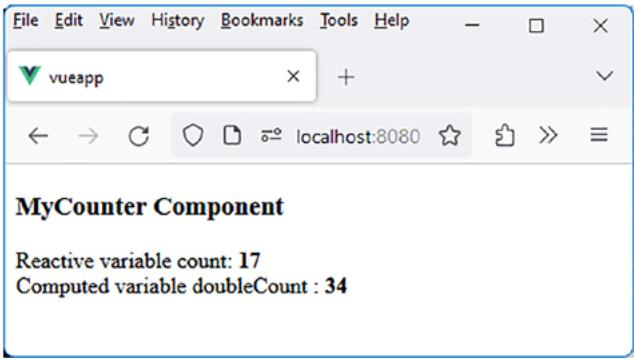

<details>
<summary>text_image</summary>

File Edit View History Bookmarks Tools Help
vueapp
localhost:8080
MyCounter Component
Reactive variable count: 17
Computed variable doubleCount : 34
</details>

Figure 1-29. Automatic start of the counter

The counter is now automatically started when the component is displayed.

### Managing Reactivity Ourselves with the customRef( ) Method

In everything we have previously explained, we have seen that whenever a reactive variable is updated, its new value is automatically reflected in the component where it is displayed. This operation is due to the internal functioning of reactivity in Vue.js, which performs it for us. Most of the time, this is the desired behavior.

However, it is possible to create our own reactivity. This would allow us to perform processing before a reactive variable is displayed or before a reactive variable is modified.

Here are some examples of using this mechanism:

Date Formatting: Before displaying a date, we format it according to the format of the country using it. The date would be stored internally in the YYYYMMDD format but would be displayed, for example, in the DD/MM/ YYYY format for better display comfort or according to the MM-DD-YYYY format.

Email Validation: Once the email is entered, we check that it is in the correct format before storing it.  
Processing During Field Entry: Instead of performing processing for each character entered, we wait for a minimum number of characters to be entered before performing it. This prevents making requests to a server too quickly.  
Checking the Format of a Password: It is sometimes useful to check that the chosen password has characteristics such as at least ten characters, at least one digit, at least one uppercase letter, at least one lowercase letter, etc.

This operation is possible, thanks to the customRef() method, which allows creating reactive variables with a specific behavior. Let’s now examine how the customRef() method works to define new reactive variables.

### Step 1: Operation and Use of customRef( )

A reactive variable defined with customRef() works in the same way as one defined with ref(). Thus, the value property of the variable allows accessing it in both reading and writing.

However, we define ourselves what the reading of the variable should return and also what the variable should finally contain when its value is initialized or modified. This is the advantage of using this type of reactive variables defined by customRef() rather than ref(), as we can modify the result of reading and/or the result of writing the variable, and this in a centralized manner (in the customRef() method).

The difference with the ref() method is that reading a variable defined with ref() returns the exact value of the content of the variable, and its writing writes exactly into the variable what is indicated in the value attribute.

The questions to ask when creating a variable with customRef() are as follows:

What do we want to get back when reading the variable?  
What do we want to get in the content of the variable when it is modified?

If the answer to these two questions is to keep the current value, just use the ref() method to create the reactive variable. The customRef() method would not add anything more in this case.

The customRef(callback) method uses the callback(track, trigger) function, which allows returning an object with the properties { get, set }, which are functions defining the reading of the variable (with the get() function) and the modification of the variable (with the set() function).

The get() function must return the value we want to read when accessing the variable (in reading).  
The set(newValue) function must set the new value of the variable (in writing). The newValue parameter is the value we want to write, but it can be modified in the set() method.

The track() and trigger() parameters of the callback function are functions to call when you want to trigger reading (by track()) or update (by trigger()).

To understand these explanations, the simplest way is to write a minimal program that does this work. The traces written in the program will help understand how it works.

We create a count variable defined by customRef(), which increments by 1 with each click on a “count+1” button.

Incrementing a count variable defined by customRef() (file src/ components/MyCounter.vue)  
```javascript
<script setup>
import { customRef } from 'vue';

// Create a custom reference (customRef)
const count = customRef((track, trigger) => {
    let value = 0;    // value will be the variable being tracked,
    initialized here to 0.
    return {
    get() {
    // Track the dependency when the value is read.
    track();
    console.log("get value =", value);
    return value;
    },
    set(newValue) {
    // Update the value and trigger reactivity.
    value = newValue;
    trigger();
    console.log("set value =", value);
    }
    };
});

function increment() {
    console.log("before increment value");
    count.value += 1;    // Increment the value of the variable.
    console.log("after increment value");
}
```

Chapter 1 Day 1: Mastering Com ponents in Vue.js  
```vue
</script>
<template>
<h3> MyCounter Component </H3>
Reactive variable count: <b>{{ count }}</b>
<br><br>
<button @click="increment">count + 1</button>
</template>
```

The count variable is created when calling the customRef(callback) method. Once the count variable is created, it can be used by writing instructions like count.value += 1, which here increments the value by 1. The usage principle is the same as if the variable had been created by ref().

The callback function used in customRef(callback) has the form callback(track, trigger), where track() will be used in the get() method and trigger() in the set() method.

The callback function starts by creating a variable (here value) that will be the internally manipulated variable and corresponds to the value of the count variable. The variable is initialized to 0 here.

The callback function then returns an object { get, set } that defines the get() and set() methods:

The get() method calls the track() method, indicating that we want to track the variable mentioned next, and its value is returned by get().  
Here, we want to return the exact value of the variable that will be used when reading the count variable, but we could return something else.

The set(newValue) method calls the trigger() method to indicate that we are going to modify the variable’s value, and this new value must be taken into account. Here, we assign the newValue to value, but we could assign another value.

The implemented functionality here corresponds to the functionality used with the ref() method. However, it allows, with the traces performed in the methods, to see the internal functioning provided by the customRef() method.

Let’s execute the previous program, displaying the traces in the console (F12 key):

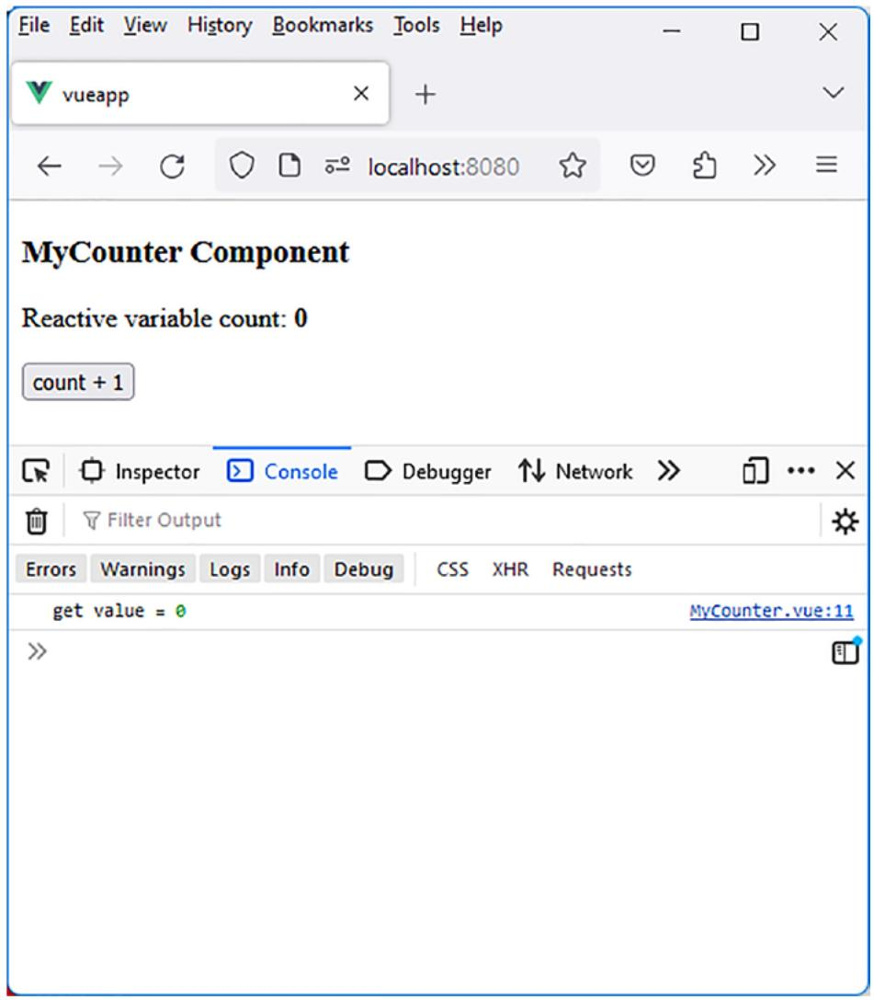

<details>
<summary>text_image</summary>

File Edit View History Bookmarks Tools Help
vueapp
localhost:8080
MyCounter Component
Reactive variable count: 0
count + 1
Inspector Console Debugger Network ...
Filter Output
Errors Warnings Logs Info Debug CSS XHR Requests
get value = 0 MyCounter.vue:11
>>
</details>

Figure 1-30. Using a variable defined by customRef()

We can see that at the program’s launch, the get() method is called to retrieve the variable’s value and display it in the component.

Next, let’s click the “count+1” button.

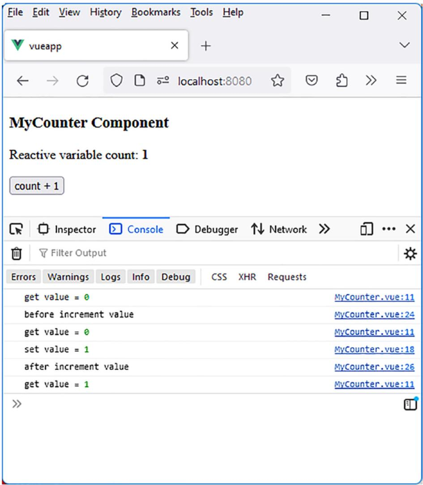

<details>
<summary>text_image</summary>

File Edit View History Bookmarks Tools Help
vueapp
localhost:8080
MyCounter Component
Reactive variable count: 1
count + 1
Inspector Console Debugger Network
Filter Output
Errors Warnings Logs Info Debug CSS XHR Requests
get value = 0 MyCounter.vue:11
before increment value MyCounter.vue:24
get value = 0 MyCounter.vue:11
set value = 1 MyCounter.vue:18
after increment value MyCounter.vue:26
get value = 1 MyCounter.vue:11
>>
</details>

Figure 1-31. Incrementing a variable defined by customRef()

When clicking the “count+1” button, the click handling function increment() is executed. We can see in the traces that to execute the count.value += 1; instruction, we first read the value (via get()) and then update the value (via set()). Afterward, a final read (via get()) is performed, which corresponds to displaying the new value in the component.

Now that we have seen the internal functioning of customRef(), let’s use it to produce more interesting results.

### Step 2: Limiting the Increment of a Variable

During the variable update (in the set() method), it is possible to decide the value that will finally be assigned to the variable.

For example, we can create a counter that stops at the value 10 without being able to exceed it.

For this example, we use a “count+1” button that increments the counter and a “count - 1” button that decrements it. Once the maximum value is reached, we can only decrement the counter, which can then be incremented again.

**Using a maximum value (file src/components/MyCounter.vue)**

```typescript
<script setup>
import { customRef } from 'vue';
```  
// Maximum value not to be exceeded const maximum = 10;

```javascript
// Create a custom reference (customRef)
const count = customRef((track, trigger) => {
    let value = 0; // value will be the variable being tracked,
    initialized here to 0.
    return {
    get() {
    // Track the dependency when the value is read.
    track();
    }
}
```

```vue
return value;
},
set(newValue) {
    // Update the value and trigger reactivity.
    if (newValue <= maximum) value = newValue;
    trigger();
}
};
});
function increment() {
    count.value += 1;    // Increment the value of the variable.
}
function decrement() {
    count.value -= 1;    // Decrement the value of the variable.
}
</script>
<template>
<h3> MyCounter Component </H3>
Reactive variable count: <b>{{ count }}</b>
<br><br>
Maximum: <b>{{ maximum }}</b>
<br><br>
<button @click="increment">count + 1</button>
&nbsp;
<button @click="decrement">count - 1</button>
</template>
```

We use a variable named maximum with a value of 10. Since this variable will not be modified, there is no need to make it reactive. The count variable is managed by customRef(). The value of the variable managed by customRef() is modified only if it is less than the maximum value. When the maximum value (here, 10) is reached, the counter is locked:

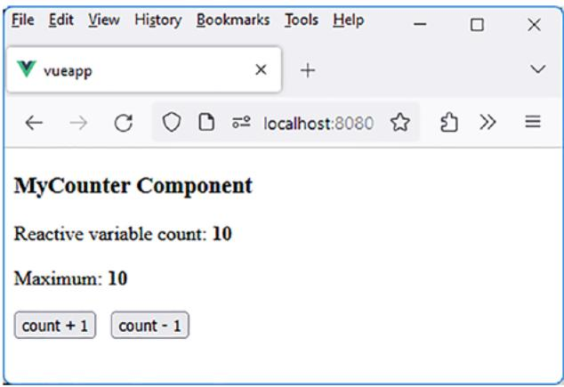

<details>
<summary>text_image</summary>

File Edit View History Bookmarks Tools Help
vueapp
localhost:8080
MyCounter Component
Reactive variable count: 10
Maximum: 10
count + 1 count - 1
</details>

Figure 1-32. Blocking the counter at the maximum value

We have prevented the possibility of incrementing the value of the count variable. Let’s delve further into program structuring by creating a function known as a “composable” that easily creates reactive variables with the characteristic of limiting their value to a maximum.

### Step 3: Create a Composable useMaximum( ) to Limit the Value

Instead of creating the count variable by defining it in the component’s code, we create a function that generates the desired variable. This allows us to reuse the function in various parts of the program if necessary.

This approach will be explored in Chapter 6 and corresponds to the creation of composables. Composables are utility functions that can be used elsewhere in the program or even in other projects.

Here, we will create the useMaximum() composable, which limits the value of the reactive variable to the specified max value.

Create and use the useMaximum(max) composable (file src/ components/MyCounter.vue)  
```javascript
<script setup>
import { customRef } from 'vue';

// Maximum value not to be exceeded
const maximum = 10;

const useMaximum = (max) => {
    // Create a custom reference (customRef)
    return customRef((track, trigger) => {
    let value = 0;    // value will be the variable being tracked, initialized here to 0.
    return {
    get() {
    // Track the dependency when the value is read.
    track();
    return value;
    },
    set(newValue) {
    // Update the value and trigger reactivity.
    if (newValue <= max) value = newValue;
    trigger();
    }
    };
    });
}
```

const count = useMaximum(maximum);  
```vue
function increment() {
    count.value += 1; // Increment the value of the variable.
}

function decrement() {
    count.value -= 1; // Decrement the value of the variable.
}

</script>

<template>

<h3> MyCounter Component </H3>

Reactive variable count: <b>{{ count }}</b>
<br><br>

Maximum: <b>{{ maximum }}</b>
<br><br>

<button @click="increment">count + 1</button>
&nbsp;

<button @click="decrement">count - 1</button>

</template>
```

The count variable is now created when calling the useMaximum() method. This approach allows us to easily create multiple variables of this type.

It is customary for the composable to be placed in a separate file. Therefore, we create the file useMaximum.js, which corresponds to the source code of the useMaximum() composable. This file is placed in the src/composables directory, which is created if necessary.

Composable useMaximum() (file src/composables/useMaximum.js)  
```javascript
import { customRef } from "vue";

const useMaximum = (max) => {
    // Create a custom reference (customRef)
    return customRef((track, trigger) => {
    let value = 0;    // value will be the variable being tracked, initialized here to 0.
    return {
    get() {
    // Track the dependency when the value is read.
    track();
    return value;
    },
    set(newValue) {
    // Update the value and trigger reactivity.
    if (newValue <= max) value = newValue;
    trigger();
    }
    };
    });
}

export default useMaximum;
```

The code of the MyCounter component can then be simplified. It is enough to import the composable useMaximum() file into the component:

MyCounter component using the useMaximum() composable (file src/ components/MyCounter.vue)

<script setup>

import useMaximum from "../composables/useMaximum.js"

Chapter 1 Day 1: Mastering Com ponents in Vue.js  
```txt
// Maximum value not to be exceeded
const maximum = 10;
```  
const count = useMaximum(maximum);

```vue
function increment() {
    count.value += 1; // Increment the value of the variable.
}

function decrement() {
    count.value -= 1; // Decrement the value of the variable.
}

</script>

<template>

<h3> MyCounter Component </H3>

Reactive variable count: <b>{{ count }}</b>
<br><br>

Maximum: <b>{{ maximum }}</b>
<br><br>

<button @click="increment">count + 1</button>
&nbsp;

<button @click="decrement">count - 1</button>

</template>
```

The component’s code is simplified. The functionality remains the same.

### Step 4: Create a Composable useFormatDate( ) to Format Dates

A final example of using customRef() would be to create a composable that displays dates according to the desired format:

• MM-DD-YYYY (internal format “en-US”)  
• DD-MM-YYYY (internal format “en-GB”)  
• MM/DD/YYYY (internal format “en-US”)  
DD/MM/YYYY (internal format “en-GB”)

The useFormatDate() composable returns a reactive variable with the desired format.

Composable useFormatDate(date, format) (file src/components/ MyCounter.vue)  
```txt
<script setup>
import { customRef } from "vue";

const formatDate = (date, format) => {
    const options = { year: 'numeric', month: '2-digit',
    day: '2-digit' };
    if (format == "MM-DD-YYYY")
    return date.toLocaleDateString('en-US', options).
    replace(\///g, '-');
    else if (format == "DD-MM-YYYY")
    return date.toLocaleDateString('en-GB', options).
    replace(\///g, '-');
    else if (format == "MM/DD/YYYY")
    return date.toLocaleDateString('en-US', options);
    else if (format == "DD/MM/YYYY")
```

Chapter 1 Day 1: Mastering Com ponents in Vue.js  
```javascript
return date.toLocaleDateString('en-GB', options);
}
const useFormatDate = (date, format) => {
    return customRef((track, trigger) => {
    let value = date; // value will be the tracked variable
    return {
    get() {
    // track the dependency when the value is read
    track();
    return formatDate(value, format);
    },
    set(newValue) {
    // update the value and trigger reactivity
    value = newValue;
    trigger();
    }
    };
    });
};
const date = new Date(); // Current date

const dateMMDDYYYY = useFormatDate(date, "MM-DD-YYYY");
const dateDDMMYYYY = useFormatDate(date, "DD-MM-YYYY");
const dateMMDDYYYY_slash = useFormatDate(date, "MM/DD/YYYY");
const dateDDMMYYYY_slash = useFormatDate(date, "DD/MM/YYYY");

</script>

<template>

<h3> MyCounter Component </H3>
```

```txt
<hr>
Current date : {{date}}
<hr>
Date (MM-DD-YYYY) : <b>{{ dateMMDDYYYY }}</b>
<br><br>
Date (DD-MM-YYYY) : <b>{{ dateDDMMYYYY }}</b>
<br><br>
Date (MM/DD/YYYY) : <b>{{ dateMMDDYYYY_slash }}</b>
<br><br>
Date (DD/M/YYYY) : <b>{{ dateDDMMYYYY_slash }}</b>
<br><br>
</template>
```

We display today’s date in various formats. The obtained result is displayed as follows:

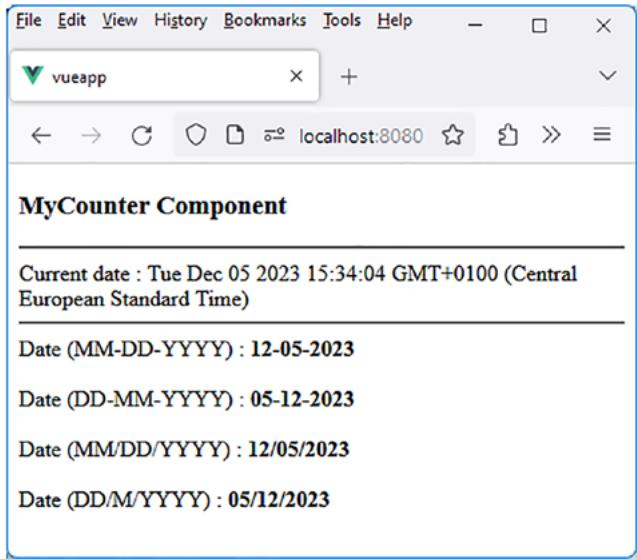

<details>
<summary>text_image</summary>

File Edit View History Bookmarks Tools Help
vueapp × +
← → ↻ localhost:8080 ☆ ↻ ≡
MyCounter Component
Current date : Tue Dec 05 2023 15:34:04 GMT+0100 (Central
European Standard Time)
Date (MM-DD-YYYY) : 12-05-2023
Date (DD-MM-YYYY) : 05-12-2023
Date (MM/DD/YYYY) : 12/05/2023
Date (DD/M/YYYY) : 05/12/2023
</details>

Figure 1-33. Displaying dates in various formats

As in the previous example, it is desirable to create a separate file that contains the code for the composable. This simplifies the component’s writing and enables the use of the composable in other components.

The file for the useFormatDate() composable will be registered in a file named useFormatDate.js, located in the src/composables directory.

Composable useFormatDate() (file src/composables/ useFormatDate.js)  
```javascript
import { customRef } from "vue";

const formatDate = (date, format) => {
    const options = { year: 'numeric', month: '2-digit', day: '2-digit' };
    if (format == "MM-DD-YYYY")
    return date.toLocaleDateString('en-US', options).replace(\///g, '-');
    else if (format == "DD-MM-YYYY")
    return date.toLocaleDateString('en-GB', options).replace(\///g, '-');
    else if (format == "MM/DD/YYYY")
    return date.toLocaleDateString('en-US', options);
    else if (format == "DD/MM/YYYY")
    return date.toLocaleDateString('en-GB', options);
}

const useFormatDate = (date, format) => {
    return customRef((track, trigger) => {
    let value = date; // value will be the tracked variable
    return {
    get() {
    // track the dependency when the value is read
    track();
    }
    }
}
```

```javascript
return formatDate(value, format);
},
set(newValue) {
    // update the value and trigger reactivity
    value = newValue;
    trigger();
}
};
export default useFormatDate;
```

The code for the MyCounter component becomes the following:

MyCounter component using the useFormatDate() composable (file src/components/MyCounter.vue)

<script setup>

import useFormatDate from "../composables/useFormatDate.js"

```handlebars
const date = new Date(); // Current date
const dateMMDDYYYY = useFormatDate(date, "MM-DD-YYYY");
const dateDDMMYYYY = useFormatDate(date, "DD-MM-YYYY");
const dateMMDDYYYY_slash = useFormatDate(date, "MM/DD/YYYY");
const dateDDMMYYYY_slash = useFormatDate(date, "DD/MM/YYYY");
</script>
<template>
<h3> MyCounter Component </H3>
<hr>
Current date : {{date}}
```

Chapter 1 Day 1: Mastering Com ponents in Vue.js  
```txt
<hr>
Date (MM-DD-YYYY) : <b>{{ dateMMDDYYYY }}</b>
<br><br>
Date (DD-MM-YYYY) : <b>{{ dateDDMMYYYY }}</b>
<br><br>
Date (MM/DD/YYYY) : <b>{{ dateMMDDYYYY_slash }}</b>
<br><br>
Date (DD/M/YYYY) : <b>{{ dateDDMMYYYY_slash }}</b>
<br><br>
</template>
```

### Step 5: Entering Text in Uppercase

Another use of this mechanism is, for example, to enter text in uppercase, which standardizes the entry of names in an application. The field is transformed into uppercase as characters are entered into the field.

We still use the MyCounter component in which a variable named name corresponding to an input field is displayed. To achieve this, we use the v-model directive, which will be explained in the next chapter.

The input in the field is displayed in uppercase letters, regardless of the entered letters.

Entering text in uppercase (file src/components/MyCounter.vue)  
```javascript
<script setup>
import { customRef } from 'vue';
const name = customRef((track, trigger) => {
    let value = ""; // value will be the tracked variable
    return {
    get() {
    // track the dependency when the value is read
```

```vue
track();
return value.toUpperCase();
},
set(newValue) {
    // update the value and trigger reactivity
    value = newValue;
    trigger();
}
};
</script>

<template>

<h3> MyCounter Component </H3>

<b>Uppercase Input:</b>
<br><br>

Variable name: <input type="text" v-model="name" />
<br><br>

Variable name: {{ name }}
</template>
```

As explained earlier, it is sufficient to replace the value to be read from the variable with its uppercase representation. This is done in the get() method.

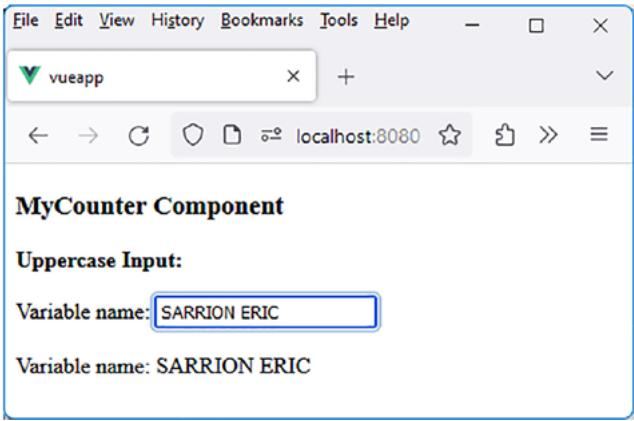

<details>
<summary>text_image</summary>

File Edit View History Bookmarks Tools Help
vueapp
localhost:8080
MyCounter Component
Uppercase Input:
Variable name: SARRION ERIC
Variable name: SARRION ERIC
</details>

Figure 1-34. Uppercase name input

It is also possible to create a separate file that defines the useUpperCase(initialValue) composable with an initialValue parameter. The file useUpperCase.js will be placed in the src/ composables directory.

Composable useUpperCase(initialValue) (file src/composables/ useUpperCase.js)  
```javascript
import { customRef } from 'vue';
const useUpperCase = (initValue) => {
    return customRef((track, trigger) => {
    let value = initValue; // value will be the tracked variable
    return {
    get() {
    // track the dependency when the value is read track();
    return value.toUpperCase();
    },
    set(newValue) {
```

```javascript
// update the value and trigger reactivity
value = newValue;
trigger();
};
});
export default useUpperCase;
```

The use of the useUpperCase() composable in the MyCounter component is as follows:

MyCounter component using the useUpperCase() composable (file src/components/MyCounter.vue)

```txt
<script setup>
```

import useUpperCase from "../composables/useUpperCase.js" const name = useUpperCase("eric");

```vue
</script>
<template>
<h3> MyCounter Component </H3>
<b>Uppercase Input:</b>
<br><br>
Variable name: <input type="text" v-model="name" />
<br><br>
Variable name: {{ name }}
</template>
```

The component is initialized with the variable name set to the value “eric”, which will be immediately displayed in uppercase in both the input field and the following text.

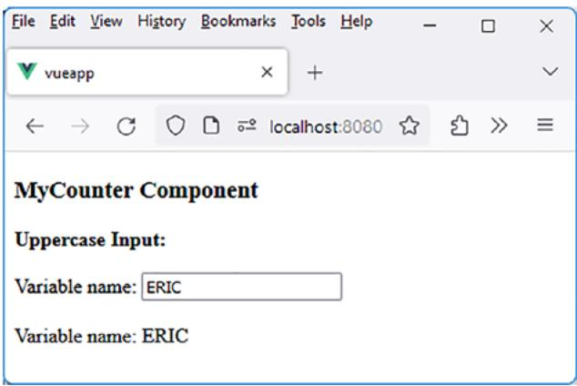

<details>
<summary>text_image</summary>

File Edit View History Bookmarks Tools Help
vueapp
localhost:8080
MyCounter Component
Uppercase Input:
Variable name: ERIC
Variable name: ERIC
</details>

Figure 1-35. Utilization of the useUpperCase() composable

### Conclusion

We have come a long way during this first day dedicated to mastering Vue.js! We have covered the necessary steps for creating the first Vue.js application, from installing Vue.js to analyzing the generated files.

We have also delved into key concepts such as component structuring, reactivity, defining methods and computed properties, as well as managing the lifecycle of components.

In the upcoming chapters, we will further deepen our Vue.js skills and explore more advanced concepts to create high-performance web applications. So get ready for the exciting continuation of this learning journey!

## Chapter 2: Day 2: Mastering Directives in Vue.js

In this chapter, we will delve into directives in Vue.js, a key element for mastering this front-end library. Directives allow us to add new functionalities to HTML elements on the page.

We will explore several essential directives, such as v-bind, v-if, v-else, v-show, and v-for, providing detailed steps to understand how they function.

Next, we will focus on the v-model directive, which is particularly useful for two-way data binding in forms.

Finally, we will address the use of modifiers in Vue.js, which allow us to modify the behavior of directives.

### Using Attributes in Vue.js Components

A component is similar to an HTML element and can have attributes (also called props, meaning properties).

Let’s use two new attributes, named init and end, in the MyCounter component:

The init attribute indicates the initialization value of the counter. If this attribute is not specified, its starting value is considered as 0.

The end attribute indicates the final value of the counter. If this attribute is not specified, the counter does not stop.

As long as the counter value (incremented every second) is between the init and end values, the counter continues to increment. Once the end value is reached (if specified in the attributes), the counter stops.

### Step 1: Using the init and end Attributes in the MyCounter Component

An example of using the MyCounter component with the init and end attributes could be the following:

**Counter from 10 to 20**

<MyCounter init="10" end="20" />

If the attribute values are written, as shown previously, within quotes (in the form of strings, “10” and “20”), they are string literals passed to the MyCounter component. To use the attribute value as a numeric value in the MyCounter component, it will employ the JavaScript function parseInt(value), which returns the numeric representation of the value if it wasn’t already numeric. We will demonstrate how to write the content of the MyCounter component in the following section.

Alternatively, one can use the MyCounter component in the following form, without representing the attributes as strings:

**Counter from 10 to 20**

<MyCounter init=10 end=20 />

In this case, the numeric values 10 and 20 are passed to the MyCounter component. To indicate a counter that starts at 10 but never stops, the end attribute is omitted in the MyCounter component’s definition:

**Counter from 10 to infinity**

< MyCounter init=10 />

Finally, to indicate a counter that counts from 0 to infinity, no attributes are specified in the MyCounter component:

**Counter from 0 to infinity**

< MyCounter />

It is also possible to set the value of an attribute based on the value of a variable initialized in the program. For example, if we define the variable init initialized to the value 10, we can write in the src/App.vue file:

**Counter initialized from the init variable (file src/App.vue)**

<script setup> import MyCounter from './components/MyCounter.vue'

const init = 10; // The variable init is equal to 10

</script> <template>

<MyCounter :init="init" />

</template> <style scoped> </style>

The init variable is defined in the <script> section of the component. It is accessible in the <template> section of the component by writing :init="init". The syntax :init="init" signifies that the init attribute (indicated as :init) is initialized with the value of the init variable (indicated as "init").

The “:” symbol before an attribute name indicates to interpret the following value as a JavaScript expression. One could also write <MyCounter :init="init+3" /> to start the counter with the value 13 instead of 10, as "init+3" is a valid JavaScript expression.

The quotes around the value of the JavaScript expression are necessary if the JavaScript expression contains spaces. Thus, writing ="init" or =init are equivalent expressions.

To initialize the counter with the numeric value 10, one can also write the following:

**Initialize the init attribute to the numeric value 10**

<MyCounter :init="10" />

Indeed, specifying :init instead of just init for the attribute name indicates that the following value is a JavaScript expression, specifically the numeric value 10 and not the string “10”.

We have seen how to write and use the MyCounter component in various forms with the init and end attributes. Let’s now explore how the MyCounter component is written to make use of these attributes.

### Step 2: Writing the MyCounter Component That Utilizes the init and end Attributes

The code associated with the MyCounter component must consider the various possible forms for writing the attributes.

The attributes will be defined in the <script setup> section of the component, using Vue.js’s defineProps() method.

MyCounter component with init and end attributes (file src/ components/MyCounter.vue)  
```typescript
<script setup>
import { ref, computed, onMounted, onUnmounted, defineProps }
from 'vue';
let timer;
```  
const props = defineProps(["init", "end"]); // Declaration of the "init" and "end" attributes

const init = props.init || 0; // 0: default value const end = props.end || 0; // 0: default value  
```javascript
const count = ref膠Int(init));
const doubleCount = computed(() => count.value * 2);

const increment = () => {
    if (!end || count.value < parseInt(end)) count.value++;
    else stop();
};

const start = () => {
    timer = setInterval(() => {
    increment();
    }, 1000);
};

const stop = () => {
    clearInterval(timer);
};

onMounted(() => {
    start();
});
```

Chapter 2 Day 2: Mastering Direc tives in Vue.js  
```vue
onUnmounted(() => {
    stop();
});

</script>

<template>
    <h3>MyCounter Component</h3>
    init : {{init}} => end : {{end}}
    <br /><br />
    Reactive variable count : <b>{{ count }}</b>
    <br />
    Computed variable doubleCount : <b>{{ doubleCount }}</b>
</template>
```

The defineProps() method is used by specifying, in an array, the name of each attribute.

When retrieving the value of the attribute by writing const init = props.init, it is mandatory to provide a default value for the attribute (here, 0, by writing props.init || 0). Otherwise, the retrieval into a variable cannot be performed. In such a case, one would be forced to use the init attribute in the form props.init throughout the program, which would not be convenient.

The values of the attributes, retrieved into the variables init and end, are then displayed in the template using {{init}} and {{end}}.

For example, suppose the MyCounter component is used as follows:

Counter from 10 to 20 (file src/App.vue)  
```vue
<script setup>
import MyCounter from "./components/MyCounter.vue"
</script>
```

```vue
<template>
```

```txt
<MyCounter init=10 end=20 />
```

```vue
</template>
```

The counter starts at the value 10 and ends at the value 20. Let’s run the program:

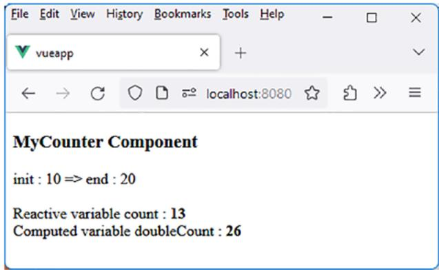

<details>
<summary>text_image</summary>

File Edit View History Bookmarks Tools Help
vueapp
localhost:8080
MyCounter Component
init : 10 => end : 20
Reactive variable count : 13
Computed variable doubleCount : 26
</details>

Figure 2-1. Using the init and end attributes

The counter starts from the value 10 and will stop when it reaches the value 20.

### Passing an Object As Attributes

Instead of passing the init and end attributes individually to the MyCounter component, these values can also be transmitted within a JavaScript object.

Let’s call the new attribute limits, which will replace the init and end attributes. The limits attribute will take the form {init: 10, end: 20}. Let’s demonstrate how to use this attribute within the MyCounter component.

The App component, which uses the MyCounter component, is modified as follows:

**App component using the MyCounter component and its limits attribute (file src/App.vue)**

```vue
<script setup>
import MyCounter from "./components/MyCounter.vue"
</script>
<template>
```

```svg
<MyCounter :limits="{init:10, end:20}" />
```

```vue
</template>
```

The value of the limits attribute is specified as an object {init: 10, end: 20}. Adding a string around the object is optional if the following value does not contain spaces (here, the string is required because there is a space before the end attribute).

To ensure that Vue.js interprets the specified value as a JavaScript value (here, an object), it must be indicated by writing the attribute as :limits rather than just limits.

Let’s see how the code of the MyCounter component is modified to accommodate the new limits attribute.

**MyCounter component using the limits attribute (file src/components/ MyCounter.vue)**

```typescript
<script setup>
import { ref, computed, onMounted, onUnmounted, defineProps }
from 'vue';
let timer;
```

```javascript
const props = defineProps(["limits"];
```

```handlebars
const init = props.limits.init || 0;
const end = props.limits.end || 0;

const count = ref膠(int(init));
const doubleCount = computed(() => count.value * 2);

const increment = () => {
    if (!end || count.value < parseInt(end)) count.value++;
    else stop();
};

const start = () => {
    timer = setInterval(() => {
    increment();
    }, 1000);
};

const stop = () => {
    clearInterval(timer);
};

onMounted(() => {
    start();
});

onUnmounted(() => {
    stop();
});

</script>

<template>
    <h3>MyCounter Component</h3>
    init : {{init}} => end : {{end}}
    <br /><br />
```

Chapter 2 Day 2: Mastering Direc tives in Vue.js  
```txt
Reactive variable count : <b>{{ count }}</b>
<br />
Computed variable doubleCount : <b>{{ doubleCount }}</b>
</template>
```

The limits attribute is defined in the defineProps() method as ["limits"]. The init value is retrieved from props.limits.init, and the end value is retrieved from props.limits.end. When the end value is reached, the counter stops:

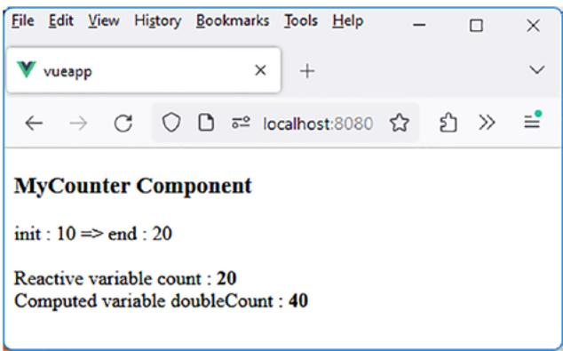

<details>
<summary>text_image</summary>

File Edit View History Bookmarks Tools Help
vueapp
localhost:8080
MyCounter Component
init : 10 => end : 20
Reactive variable count : 20
Computed variable doubleCount : 40
</details>

Figure 2-2. Using the limits attribute

We have seen how to define attributes for Vue.js components. Vue.js also allows the use of another form of attributes called directives. These are powerful tools. Let’s now explore how to use the standard directives provided by Vue.js. In Chapter 5, we will learn how to create our own directives, extending Vue.js’s capabilities.

### Differences Between Directives and Attributes in Vue.js

A Vue.js directive is used similarly to an attribute. What then is the difference between the two?

1. An attribute represents a static value, information transmitted to the component or HTML element on which it is positioned. In the previous examples, we used the init and end attributes to statically indicate the starting and ending values of the counter. The same applies to HTML attributes associated with HTML elements. For example, the class attribute allows specifying a CSS class for the HTML element on which it is positioned.

2. On the other hand, Vue.js directives are used to add dynamic logic to an HTML element or Vue. js component, reacting to changes in data or performing specific actions in response to events. Directives allow binding HTML elements to the state of the Vue.js application, making the user interface responsive and interactive based on application data and logic.

A simple example of a Vue.js directive, which will be explained in the following, is the v-show directive. It is used in the form v-show="condition". This directive shows or hides the element on which it is positioned based on the value specified in the condition. If the condition evaluates to true, the element is displayed; otherwise, it is hidden. This demonstrates the dynamic aspect of the directive, as opposed to static attributes.

To differentiate Vue.js directives from regular attributes (HTML attributes or those created in our components, such as the init and end attributes mentioned earlier), Vue.js directives all start with the prefix "v-". Examples include v-if, v-show, v-bind, v-on, etc., which we will explain in the following.

Let’s start with the v-bind directive.

### v-bind Directive

The v-bind directive allows using attribute values that will be reactive, similar to reactive variables used in HTML.

For example, let’s use the previous counter, where the value increments upon clicking the “count+1” button. Suppose we want to display the counter value in an input field. For this, we would like to write something like <input type="text" value="{{count}}" />. Indeed, it is hoped that, thanks to the reactivity of the count variable, the value of the input field will be updated when the counter is incremented.

Let’s write this in the template of the MyCounter component. The MyCounter component becomes as follows:

**Display the count variable in the value attribute of an input field (file src/components/MyCounter.vue)**

```vue
<script setup>
import { ref, computed } from "vue"
const count = ref(0);
const doubleCount = computed(() => count.value * 2);
const increment = () => {
    count.value++;
};
</script>
```

```vue
<template>
    <h3>MyCounter Component</h3>
    Reactive variable count : <b>{{ count }}</b>
    <br />
    Computed variable doubleCount : <b>{{ doubleCount }}</b>
    <br/>
    Input : <input type="text" value="{{count}}" />
    <br/><br/>
    <button @click="increment()">count+1</button>
</template>
```

The App component that displays the MyCounter component is as follows:

App component (file src/App.vue)  
```vue
<script setup>
import MyCounter from "./components/MyCounter.vue"
</script>
<template>
```

<MyCounter />  
```vue
</template>
```

After several clicks on the “count+1” button, the displayed result is as follows:

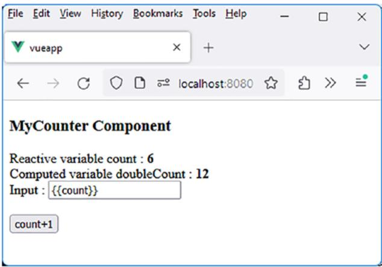

<details>
<summary>text_image</summary>

File Edit View History Bookmarks Tools Help
vueapp
localhost:8080
MyCounter Component
Reactive variable count : 6
Computed variable doubleCount : 12
Input : {{count}}
count+1
</details>

Figure 2-3. Reactive variable in the value attribute

The counter increments, but the value displayed in the input field does not reflect this change.

The use of {{count}} in the value attribute does not update the content of the input field, which remains fixed with the string "{{count}}". To initialize and update the value attribute of the input field with the value of the reactive variable count, a directive called v-bind must be used. The v-bind directive allows binding the value of an attribute to that of a reactive variable.

Therefore, one would write <input type="text"

v-bind:value="count" />, which binds the value attribute of the input field to the value of a reactive variable, in this case, the count variable.

The template of the MyCounter component becomes the following:

**Display the count variable in the value attribute of an input field (file src/components/MyCounter.vue)**

<script setup>   
import { ref, computed } from "vue"   
const count $=$ ref(0);   
const doubleCount $=$ computed(() => count.value * 2);

```vue
const increment = () => {
    count.value++;
};

</script>

<template>
    <h3>MyCounter Component</h3>
    Reactive variable count : <b>{{ count }}</b>
    <br />
    Computed variable doubleCount : <b>{{ doubleCount }}</b>
    <br/>
    Input : <input type="text" v-bind:value="count" />
    <br/><br/>
    <button @click="increment()">count+1</button>

</template>
```

Now, we obtain correct initialization and updates of the input field based on the changes in the reactive variable count.

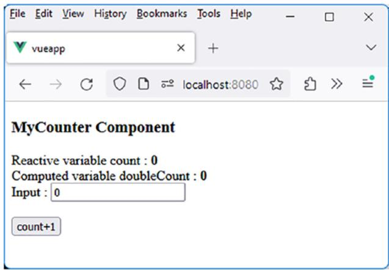

<details>
<summary>text_image</summary>

File Edit View History Bookmarks Tools Help
vueapp
localhost:8080
MyCounter Component
Reactive variable count : 0
Computed variable doubleCount : 0
Input : 0
count+1
</details>

Figure 2-4. Reactive variable in the value attribute with the v-bind directive

The input field is now initialized with the value of the reactive variable count, which is 0.

As the count variable is reactive, incrementing it causes the update of its display wherever it is used, including in the input field.

Let’s click the “count+1” button several times:

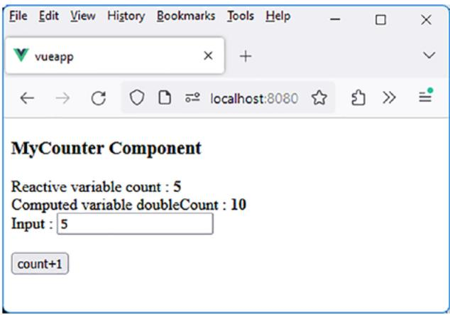

<details>
<summary>text_image</summary>

File Edit View History Bookmarks Tools Help
vueapp
localhost:8080
MyCounter Component
Reactive variable count : 5
Computed variable doubleCount : 10
Input : 5
count+1
</details>

Figure 2-5. Modification of the reactive variable count

The value displayed in the input field is updated to reflect the value of the reactive variable count.

The v-bind directive is commonly used in templates. For this reason, Vue.js allows simplifying the syntax by writing :value="count" instead of ${ \mathsf { v } } { \mathsf { - b i n d } } : { \mathsf { v a l u e } } { \mathsf { = } } " { \mathsf { c o u n t } } ^ { \prime \prime }$ .

We had already used this simplified form of the v-bind directive by writing :init="10" or :init="init" in the previous pages.

One could also write v-bind:value="count+3" because the value $" \mathsf { c o u n t } { + 3 } ^ { \ " }$ is a JavaScript expression interpreted by v-bind.

Additionally, one can write the shorthand form :value="count+3", which is equivalent to v-bind:value="count+3".

### Refreshing a Component by Modifying Its Attributes

The following example demonstrates how to update a component by transmitting new values to its attributes.

In this scenario, we want the “count+1” button to be integrated into the App component rather than the MyCounter component. This means that the App component should handle the incrementation of the counter and transmit this counter value to the MyCounter component through attributes. With each increment of the counter value in the App component, the MyCounter component refreshes to display the new value.

The App component becomes as follows:

App component (file src/App.vue)  
```vue
<script setup>
import { ref, computed } from 'vue';
import MyCounter from './components/MyCounter.vue';

const count = ref(0);
const doubleCount = computed(()=>count.value*2);
const increment = () => {
    count.value++;
};

</script>

<template>
    <MyCounter :count="count" :doubleCount="doubleCount" />
    <br /><br />
    <button @click="increment()">count+1</button>
</template>
```

The logic for incrementing the counter is implemented in the App component. The counter values (count and doubleCount) are transmitted in the attributes of the MyCounter component, which then displays them. The MyCounter component is refreshed each time one of its attributes is modified.

### Step 1: Using Attributes in the <template> Section of the MyCounter Component

The MyCounter component, which utilizes the transmitted attributes, becomes as follows:

MyCounter component (file src/components/MyCounter.vue)

<script setup>

import { defineProps } from "vue"

// Enabling access to the attributes count and doubleCount in the template

defineProps(["count", "doubleCount"]);

</script>

<template>

<h3>MyCounter Component</h3>

Reactive variable count : <b>{{ count }}</b>

<br />

Computed variable doubleCount : <b>{{ doubleCount }}</b>

<br/>

Input : <input type="text" v-bind:value="count" />

</template>

The defineProps(["count", "doubleCount"]) method identifies the attributes count and doubleCount, which will then be directly used by their names in the <template> section.

Note that the props variable typically returned by defineProps() is unnecessary here. It would be useful if you wanted to use the attribute values in the <script setup> section.

Let’s verify that everything is working:

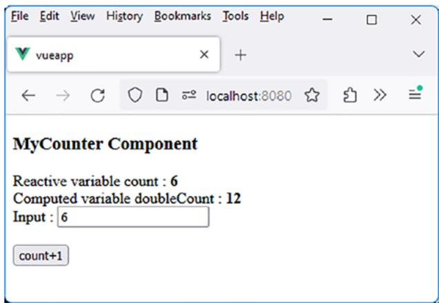

<details>
<summary>text_image</summary>

File Edit View History Bookmarks Tools Help
vueapp
localhost:8080
MyCounter Component
Reactive variable count : 6
Computed variable doubleCount : 12
Input : 6
count+1
</details>

Figure 2-6. Updating the counter through its attributes

### Step 2: Using Attributes in th <script setup> Section of the MyCounter Component

If you want to use the transmitted count and doubleCount attributes in the <script setup> section of the MyCounter component, you need to access them directly using the props variable, in the form of props.count and props.doubleCount. The variables count and doubleCount, corresponding to the attributes, can only be used under these names in the <template> section.

Let’s use props.count in the <script setup> section. As this value is updated with each increment, we display its value in the onUpdated() lifecycle method.

Using props.count in <script setup> (file src/components/ MyCounter.vue)  
```vue
<script setup>
import { defineProps, onUpdated } from "vue"
const props = defineProps(["count", "doubleCount"]);
console.log("setup : count = ", props.count);
onUpdated(() => {
    console.log("updated : count = ", props.count);
})
</script>

<template>
    <h3>MyCounter Component</h3>
    Reactive variable count : <b>{{ count }}</b>
    <br />
    Computed variable doubleCount : <b>{{ doubleCount }}</b>
    <br/>
    Input : <input type="text" v-bind:value="count" />

</template>
```

We display the value of props.count in the <script setup> section of the component (creation) and then with each update in the onUpdated() method.

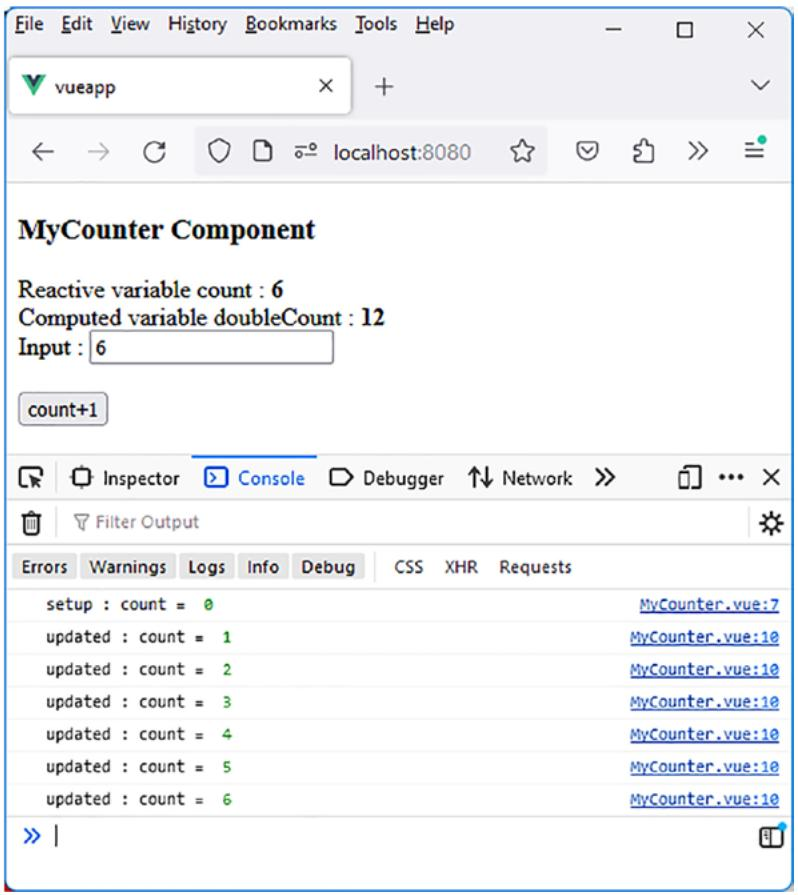

<details>
<summary>text_image</summary>

File Edit View History Bookmarks Tools Help
vueapp
localhost:8080
MyCounter Component
Reactive variable count : 6
Computed variable doubleCount : 12
Input : 6
count+1
Inspector Console Debugger ↑↓ Network >>
Filter Output
 errors Warnings Logs Info Debug CSS XHR Requests
setup : count = 0
updated : count = 1
updated : count = 2
updated : count = 3
updated : count = 4
updated : count = 5
updated : count = 6
MyCounter.vue:7
MyCounter.vue:10
MyCounter.vue:10
MyCounter.vue:10
MyCounter.vue:10
MyCounter.vue:10
MyCounter.vue:10
MyCounter.vue:10
MyCounter.vue:10
MyCounter.vue:10
MyCounter.vue:10
MyCounter.vue:10
</details>

Figure 2-7. Using attributes in <script setup>

Through this example, we can observe that updating at least one of the attributes of a component refreshes the entire component.

### v-if and v-else Directives

The v-if and v-else directives make it easy to write conditional tests in a component’s template.

Let’s use the example of the previous counter, adding a Start button to start the counter. Once the counter is started by clicking the Start button, the Start button is replaced by the Stop button, which allows stopping the counter. Therefore, the counter is started or stopped (depending on its state) by alternately clicking on the displayed Start or Stop button.

The v-if and v-else directives will allow us to alternately display the Start button or the Stop button:

The v-if directive is used by specifying a JavaScript expression that represents a boolean value. If the value of the expression is true, the element using this directive is inserted into the page; otherwise, it is not.  
The v-else directive is used on the following element (at the same level). The element using the v-else directive will be inserted into the page if the one using v-if is not.

If the v-else directive is used, it must follow an element with a v-if directive.

In the following, the App component is restored to its initial state:

App component (file src/App.vue)  
```vue
<script setup>
import MyCounter from './components/MyCounter.vue'
</script>
<template>
<MyCounter />
</template>
```

Let’s now write the MyCounter component, which alternately displays the Start and Stop buttons. We will first code it in an intuitive way, but it won’t work. Then, we’ll see the modifications needed to achieve the desired result.

### Step 1: Writing the MyCounter Component in an Intuitive (but Nonfunctional…) Way

Based on what we have previously explained, it would be natural to code the MyCounter component as follows:

MyCounter component with alternated Start and Stop buttons (file src/ components/MyCounter.vue)

```txt
<script setup>
import { ref, computed } from "vue"
```

```vue
let timer = null;
const count = ref(0);
const doubleCount = computed(() => count.value * 2);

const increment = () => {
    count.value++;
};

const start = () => {
    timer = setInterval(() => increment(), 1000);
}

const stop = () => {
    clearInterval(timer);
    timer = null;
}

</script>
```

Chapter 2 Day 2: Mastering Direc tives in Vue.js  
```vue
<template>
    <h3>MyCounter Component</h3>
    Reactive variable count : <b>{{ count }}</b>
    <br />
    Computed variable doubleCount : <b>{{ doubleCount }}</b>
    <br /><br />
    <button v-if=!timer" @click="start()">Start</button>
    <button v-else @click="stop()">Stop</button>
</template>
```

The interesting part is the one written with the v-if and v-else directives:

The v-if directive displays the Start button if the value of the timer variable is null, which is the case when the HTML page is initially displayed because the timer variable is initialized to null.  
The v-else directive displays the Stop button if the timer variable has a different value (i.e., not null).

This code looks logical and functional. Let’s try to see the result obtained.

When the program is launched, the counter is at 0, and the Start button is displayed. This corresponds to the executed v-if directive.

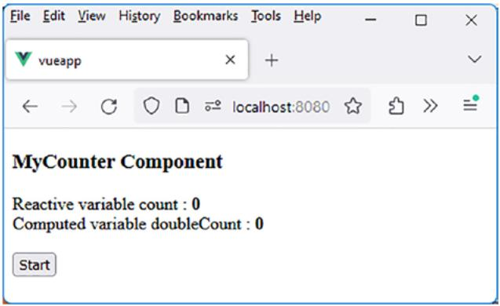

<details>
<summary>text_image</summary>

File Edit View History Bookmarks Tools Help
vueapp
localhost:8080
MyCounter Component
Reactive variable count : 0
Computed variable doubleCount : 0
Start
</details>

Figure 2-8. Start button displayed

Let’s click the Start button. The counter starts, and the Stop button is displayed:

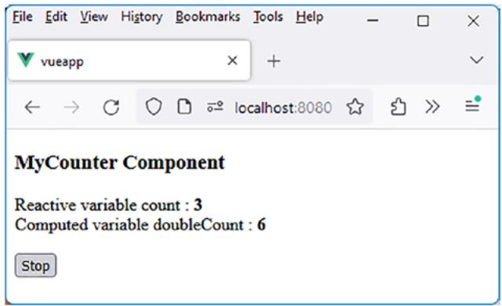

<details>
<summary>text_image</summary>

File Edit View History Bookmarks Tools Help
vueapp
localhost:8080
MyCounter Component
Reactive variable count : 3
Computed variable doubleCount : 6
Stop
</details>

Figure 2-9. The counter has started

The Stop button is displayed, corresponding to the execution of the v-else directive. Everything seems to be working.

Let’s click the Stop button to stop the counter:

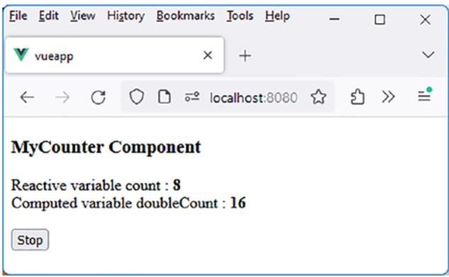

<details>
<summary>text_image</summary>

File Edit View History Bookmarks Tools Help
vueapp
localhost:8080
MyCounter Component
Reactive variable count : 8
Computed variable doubleCount : 16
Stop
</details>

Figure 2-10. The counter has been stopped

Clicking the Stop button has stopped the counter. However, the button label is still “Stop” when it should be “Start.” Additionally, clicking the button again does not restart the counter, which remains stuck at the stopped value.

So there is an issue. Let’s explain why and resolve it now.

### Step 2: Writing the MyCounter Component After Corrections (And Functional!)

The frequently made mistake is using a nonreactive variable in a directive, as seen with the timer variable, which is not reactive but is used in the vif directive. Since the timer variable is not reactive, its modification is not considered by the v-if directive, which observes changes only on reactive variables.

We simply need to transform the timer variable into a reactive variable and modify the code where it is used, using timer.value instead of just timer.

The timer variable is defined as reactive (file src/components/ MyCounter.vue)  
```vue
<script setup>
import { ref, computed } from "vue"

const timer = ref(null);
const count = ref(0);
const doubleCount = computed(() => count.value * 2);

const increment = () => {
    count.value++;
};

const start = () => {
    timer.value = setInterval(() => increment(), 1000);
}

const stop = () => {
    breakInterval(timer.value);
    timer.value = null;
}

</script>

<template>

<h3>MyCounter Component</h3>
Reactive variable count : <b>{{ count }}</b>
<br />
Computed variable doubleCount : <b>{{ doubleCount }}</b>
<br /><br />
<button v-if="!timer" @click="start()">Start</button>
<button v-else @click="stop()">Stop</button>

</template>
```

After stopping the counter, the Start button is now visible, and the counter can restart:

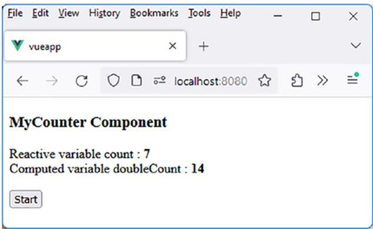

<details>
<summary>text_image</summary>

File Edit View History Bookmarks Tools Help
vueapp
localhost:8080
Start
MyCounter Component
Reactive variable count : 7
Computed variable doubleCount : 14
</details>

Figure 2-11. The counter can restart

Clicking the Start button restarts the counter:

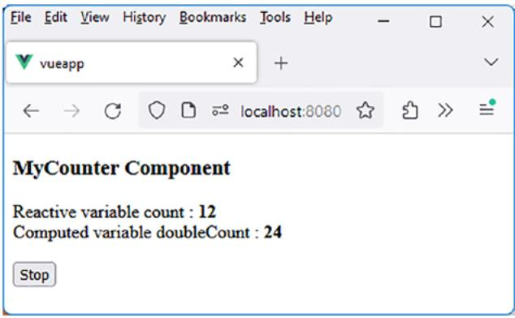

<details>
<summary>text_image</summary>

File Edit View History Bookmarks Tools Help
vueapp
localhost:8080
MyCounter Component
Reactive variable count : 12
Computed variable doubleCount : 24
Stop
</details>

Figure 2-12. The counter has restarted

### v-show Directive

The v-show directive is similar to the v-if directive. The difference is that v-if inserts the element into the page if the condition specified in the directive is true whereas v-show inserts it in all cases but only displays it if the condition is true (the v-show directive uses the element’s style to hide or show it as needed).

Using the v-show directive in the previous template, we write the following:

Using the v-show directive (file src/components/MyCounter.vue)  
```vue
<template>
    <h3>MyCounter Component</h3>
    Reactive variable count : <b>{{ count }}</b>
    <br />
    Computed variable doubleCount : <b>{{ doubleCount }}</b>
    <br /><br />
    <button v-show="!timer" @click="start()">Start</button>
    <button v-show="timer" @click="stop()">Stop</button>
</template>
```

The v-show directive, being used with a condition, requires writing the negation of the first condition in the second v-show directive. Using v-if and v-else avoids writing two conditions (only one condition will be written in the v-if directive).

The result obtained is the same as the previous one.

### v-for Directive

The v-for directive allows for looping, enabling the insertion of the directive-containing element into the HTML page multiple times.

The value of the v-for directive can be written in several ways, depending on the need:

1. First Form of Writing: $\mathbf { v } - \mathsf { f o r } = \mathbf { \ " } \mathbf { i }$ in n". This form of writing allows for a loop from 1 to the value n.  
2. Second Form of Writing: v-for="item, i in items". This form of writing allows for traversing the items array and performing an operation for each element item in the array.

Let’s start by studying the writing form v-for="i in n", which allows for a loop from 1 to the value n.

### Step 1: v-for Directive in the Formv-for=“i in n”

The variable i corresponds to the index in the loop (starting from 1), while the variable n corresponds to the final value of the index in the loop.

To use this form of the v-for directive, suppose we want to display multiple counters like the previous one. We would then have a new MyCounters component that incorporates several MyCounter components using a v-for directive. For example, we would write <MyCounters $: n b = " 3 " / >$ to indicate that we want to display three MyCounter components on the page. The nb attribute indicates how many MyCounter components we want to display in the HTML page.

The App component is modified to display the MyCounters component:

App component displaying the MyCounters component (file src/ App.vue)

```txt
<script setup>
```

import MyCounters from "./components/MyCounters.vue"

```vue
</script>
```

```vue
<template>
```

<MyCounters :nb="3" />

```vue
</template>
```

Notice that if we specify :nb="3" instead of nb="3", it allows us to transmit the numeric value 3 to the MyCounters component rather than the string “3”. Indeed, if an attribute is preceded by the “:” sign, it means that we should interpret the following value (in quotes or not) as a JavaScript expression.

The MyCounters component uses the v-for directive to display the MyCounter components:

MyCounters component (file src/components/MyCounters.vue)

```txt
<script setup>
```

```typescript
import MyCounter from "./MyCounter.vue";
```

```typescript
import { defineProps } from 'vue';
```

```javascript
defineProps(["nb"];
```

```vue
</script>
```

```vue
<template>
```

<MyCounter v-for="i in nb" />

```vue
</template>
```

The v-for directive placed on an element allows displaying that element as many times as indicated in the value of the directive (here, from 1 to the value of the nb variable).

The MyCounter component is the same as before:

MyCounter component (file src/components/MyCounter.vue)  
```txt
<script setup>

import { ref, computed } from "vue"

const timer = ref(null);
const count = ref(0);
const doubleCount = computed(() => count.value * 2);

const increment = () => {
    count.value++;
};

const start = () => {
    timer.value = setInterval(() => increment(), 1000);
}

const stop = () => {
    breakInterval(timer.value);
    timer.value = null;
}

</script>

<template>

<h3>MyCounter Component</h3>
Reactive variable count : <b>{{ count }}</b>
<br />
Computed variable doubleCount : <b>{{ doubleCount }}</b>
```

```vue
<br /><br />
<button v-if=!timer" @click="start()">Start</button>
<button v-else @click="stop()">Stop</button>
</template>
```

Let’s look at the result obtained:

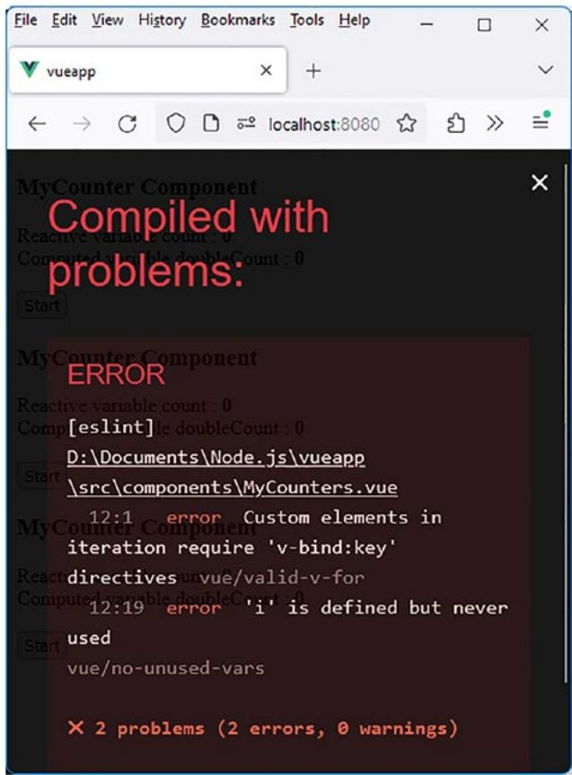

<details>
<summary>text_image</summary>

File Edit View History Bookmarks Tools Help
vueapp
localhost:8080
MyCounter Component
Compiled with
problems:
Start
MyCounter Component
ERROR
Reactive variable count : 0
Comp[eslint]le doubleCount : 0
D:\Documents\Node.js\vueapp
\src\components\MyCounters.vue
12:1 error Custom elements in
iteration require 'v-bind:key'
react directives unvue/valid-v-for
12:19 error 'i' is defined but never
used
vue/no-unused-vars
× 2 problems (2 errors, 0 warnings)
</details>

Figure 2-13. Misuse of the v-for directive

We encounter two errors:

1. It is necessary to use the v-bind:key directive when using the v-for directive.

2. The variable i used in the v-for="i in nb" directive is defined but not used.

These errors are quite common when starting to develop Vue.js applications. We explain how to resolve these errors in the following section. It is sufficient to use an attribute named key in the v-for directive.

### Step 2: Use the Key Attribute with the v-for Directive

The previous error shows that the use of the v-for directive must be accompanied by the use of the v-bind:key directive. This v-bind:key directive allows defining a special attribute reserved for Vue.js (key attribute) that provides a unique key to each repetitively inserted element.

The key attribute is an attribute used internally by Vue.js and cannot be used by us in the component on which it is positioned.

To resolve the previous error, it is sufficient to specify a key attribute with the value of the variable i. As the variable i varies from 1 to nb, the key attribute of each inserted MyCounter component will thus have a different value, which is what we want.

By using the key attribute in this way, we solve both of the previous errors at the same time.

Use of the key attribute (file src/components/MyCounters.vue)  
```vue
<script setup>
import MyCounter from "./MyCounter.vue";
import { defineProps } from 'vue';
defineProps(["nb"]);
</script>
```

```vue
<template>
```

```txt
<MyCounter v-for="i in nb" v-bind:key="i" />
```

```vue
</template>
```

The v-bind:key="i" directive can be simplified by simply writing :key="i". We had explained this writing simplification previously when using the v-bind directive.

Now we have the following:

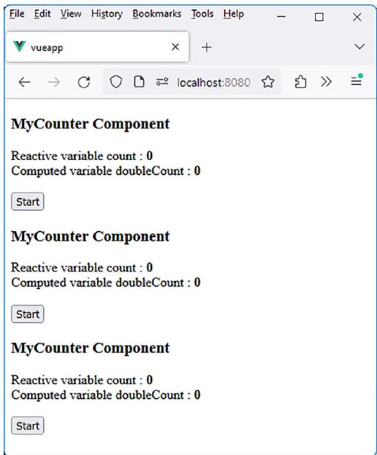

<details>
<summary>text_image</summary>

File Edit View History Bookmarks Tools Help
vueapp
localhost:8080
MyCounter Component
Reactive variable count : 0
Computed variable doubleCount : 0
Start
MyCounter Component
Reactive variable count : 0
Computed variable doubleCount : 0
Start
MyCounter Component
Reactive variable count : 0
Computed variable doubleCount : 0
Start
</details>

Figure 2-14. Display of three counters in the MyCounters component

### Step 3: Rules Regarding the Key Attribute

The key attribute is mandatory when using a v-for directive, regardless of the form of the directive. Here are two rules regarding this attribute:

1. The value of the key attribute must be unique in the list.  
2. And this value should never be modified (in the case where the list is updated).

Indeed, if a value of the key attribute is assigned to a list item, this value must always be retained for that item. Vue.js uses this value to determine if a list item is still present in the list, in order to refresh the list correctly (in the case of additions and deletions of items in the list). Therefore, if, as in our previous example, the index of the list item is used in the key attribute, it will only work if the list is static (as is the case in our example).

To build dynamic lists, it is generally recommended to use a unique ID identifier associated with each list item.

### Step 4: Use an Index in the Component That Uses v-for

Suppose we want to number the previous counters, here from 1 to 3. The key attribute contains this value from 1 to 3 but cannot be used directly in the component because it is prohibited by Vue.js and produces an error. The key attribute is indeed for internal use by Vue.js.

To remedy this, simply create a new attribute, named, for example, index, which will have the same value. The index attribute can be used directly in the MyCounter component.

The MyCounters component is modified to set the index attribute following the v-for directive:

Index attribute positioned following the v-for directive (file src/ components/MyCounters.vue)  
```vue
<script setup>
import MyCounter from "./MyCounter.vue";
import { defineProps } from 'vue';
defineProps(["nb"]);
</script>
<template>
```  
<MyCounter v-for="i in nb" :key="i" :index="i" />

```vue
</template>
```

The index attribute is positioned on the MyCounter component following the v-for directive. Its value will be that of the variable i and will thus be 1, then 2, and finally 3.

The index attribute is usable within the MyCounter component. It is sufficient to retrieve this attribute using the defineProps(["index"]) method.

Note that if you write defineProps(["key"]), this will result in an error, as explained earlier.

Usage of the index attribute in the MyCounter component (file src/ components/MyCounter.vue)  
```typescript
<script setup>  
import { ref, computed, defineProps } from "vue"  
const timer = ref(null);  
const count = ref(0);  
const doubleCount = computed(() => count.value * 2);
```

defineProps(["index"]);  
```txt
const increment = () => {
    count.value++;
};

const start = () => {
    timer.value = setInterval(() => increment(), 1000);
}

const stop = () => {
    clearInterval(timer.value);
    timer.value = null;
}

</script>

<template>

<h3> {{index}} - MyCounter Component </h3>
Reactive variable count : <b>{{ count }}</b>
<br />
Computed variable doubleCount : <b>{{ doubleCount }}</b>
<br /><br />
<button v-if="!timer" @click="start()">Start</button>
<button v-else @click="stop()">Stop</button>

</template>

The counters are now numbered:
```

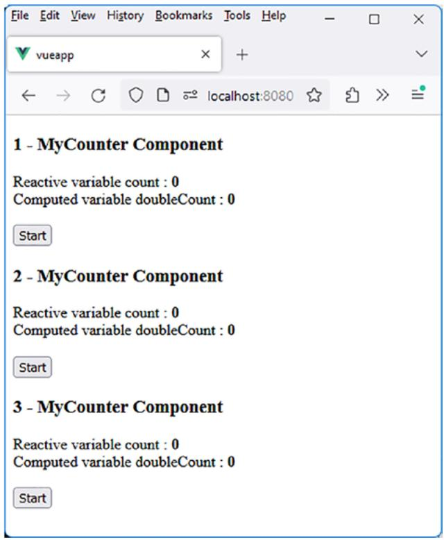

<details>
<summary>text_image</summary>

1 - MyCounter Component
Reactive variable count : 0
Computed variable doubleCount : 0
Start

2 - MyCounter Component
Reactive variable count : 0
Computed variable doubleCount : 0
Start

3 - MyCounter Component
Reactive variable count : 0
Computed variable doubleCount : 0
Start
</details>

Figure 2-15. Numbering of counters

The counters are now numbered starting from 1. Of course, each counter starts and stops independently. For example, let’s start the second counter:

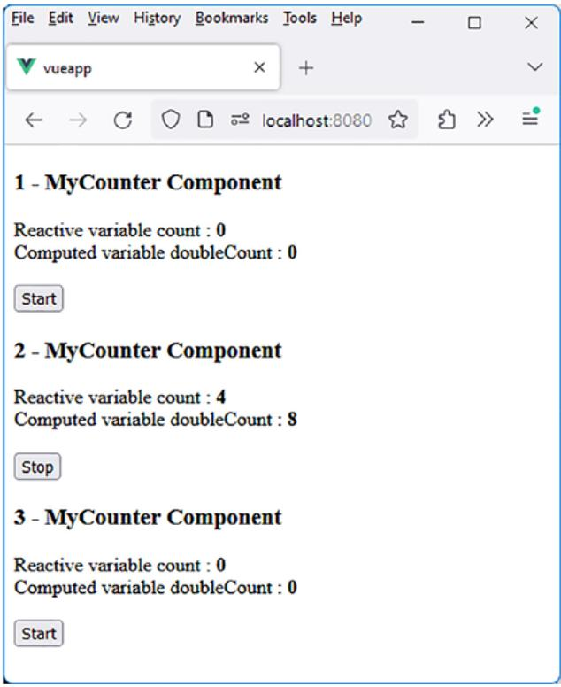

<details>
<summary>text_image</summary>

1 - MyCounter Component
Reactive variable count : 0
Computed variable doubleCount : 0
Start
2 - MyCounter Component
Reactive variable count : 4
Computed variable doubleCount : 8
Stop
3 - MyCounter Component
Reactive variable count : 0
Computed variable doubleCount : 0
Start
</details>

Figure 2-16. Counter 2 started

We have previously seen how to use the v-for directive in the form $\mathsf { v { - } f o r { = } " i } \mathrm { i n } \mathsf { n } ^ { \mathsf { \ " } }$ , which allows looping from 1 to n. Now, let’s explore how to loop through an array of elements using another form of the v-for directive, namely, $\mathsf { v } \mathsf { - f o r } \mathsf { = } ^ { \mathsf { m } } \left( \mathrm { i t e m } , \mathrm { i } \right)$ in items".

### Step 5: v-for Directive in the Formv-for=“(item, i) in items”

The second form of the v-for directive enables looping through an array of elements represented by the variable items. Each element in the array is represented by the variable item. The variable i corresponds to the index of the element in the array, starting from 0 (unlike the previous form of the directive where it started from 1).

It is possible to omit the parentheses and write the directive as v-for="item, i in items" and also as v-for="item in items" if the index i is not being used.

Let’s assume the variable items is an array indicating, for each counter, the starting value (init property) and the end value of that counter (end property). In the following component code, the variable items is referred to as limits:

The App component is as follows:

App component (file src/App.vue)  
```vue
<script setup>
import MyCounters from './components/MyCounters.vue'
const limits = [
    {init: 0, end: 10},
    {init: 5},
    {end: 10}
];
</script>
<template>
<MyCounters :limits="limits" />
</template>
```

The limits array is an array of objects { init, end }, indicating for each counter its initial value (init) and final value (end):

If the initial value init is not specified, it is considered to be 0.  
If the final value end is not specified, it is considered infinite (the counter has no end limit).

The App component incorporates the MyCounters component in the form of <MyCounters :limits="limits" />. This way, the limits array is passed to the MyCounters component as the limits attribute, which will be utilized within the component.

The MyCounters component displays MyCounter components based on the content of the limits array:

MyCounters component (file src/components/MyCounters.vue)  
```vue
<script setup>
import MyCounter from "./MyCounter.vue";
import { defineProps } from 'vue';
defineProps(["limits"]);
</script>
<template>
<MyCounter v-for="(limit, i) in limits" :key="i" :index="i" :limit="limit" />
</template>
```

The MyCounter component receives the attributes index and limit:

The index attribute represents the index of the element in the list, starting from 0.

The limit attribute corresponds to an object { init, end }, as defined in the limits array.

The MyCounter component is slightly modified to display the init and end parameters it receives through the limit attribute. If an initial value (init) is not transmitted, it is displayed as 0. If a final value (end) is not transmitted, “infinity” is displayed.

MyCounter component (file src/components/MyCounter.vue)  
```vue
<script setup>
import { ref, computed, defineProps } from "vue"

const props = defineProps(["limit", "index"]);
const init = props.limit.init || 0;    // 0 if no init indicated
const end = props.limit.end || undefined;    // undefined if no end indicated
const timer = ref(null);
const count = ref(init);
const doubleCount = computed(() => count.value * 2);

const increment = () => {
    if (end == undefined || count.value < end) count.value++;
};

const start = () => {
    timer.value = setInterval(() => increment(), 1000);
}

const stop = () => {
    clearInterval(timer.value);
    timer.value = null;
}

</script>
```

Chapter 2 Day 2: Mastering Direc tives in Vue.js  
```vue
<template>
    <h3> {{index}} - MyCounter Component </h3>
    init = {{init}}, end = {{end ? end : "infinity"}}
    <br />
    Reactive variable count : <b>{{ count }}</b>
    <br />
    Computed variable doubleCount : <b>{{ doubleCount }}</b>
    <br /><br />
    <button v-if="!timer" @click="start()">Start</button>
    <button v-else @click="stop()">Stop</button>
</template>
```

The three counters are displayed here:

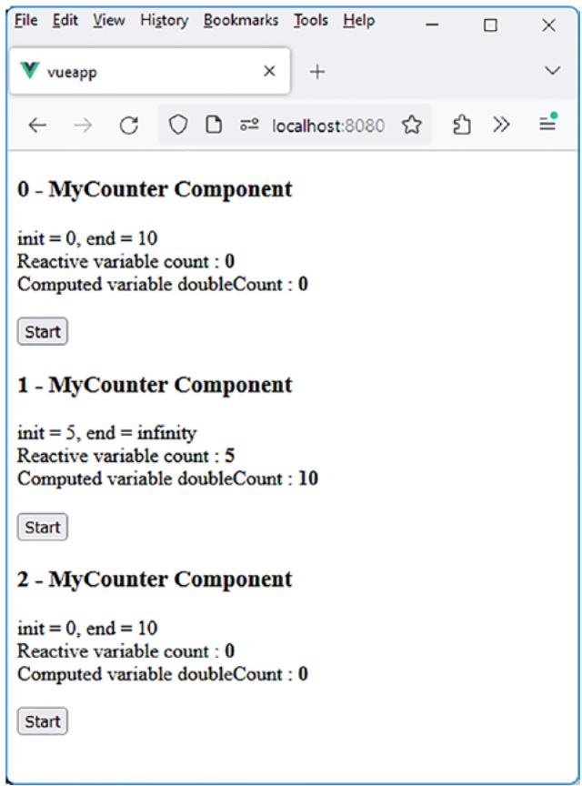

<details>
<summary>text_image</summary>

0 - MyCounter Component
init = 0, end = 10
Reactive variable count : 0
Computed variable doubleCount : 0
Start
1 - MyCounter Component
init = 5, end = infinity
Reactive variable count : 5
Computed variable doubleCount : 10
Start
2 - MyCounter Component
init = 0, end = 10
Reactive variable count : 0
Computed variable doubleCount : 0
Start
</details>

Figure 2-17. Counters with displayed init and end attributes

Each counter now has the init and end attributes displayed, retrieved from the limit attribute of the MyCounter component.

### v-model Directive

The v-bind directive we studied earlier allows updating an attribute associated with a reactive variable when that variable is modified. For example, the instruction <input v-bind:value="count" /> updates the value attribute of the input field when the reactive variable count is changed. Therefore, the content of the input field is automatically updated.

Conversely, modifying the value attribute of the input field does not update the associated reactive variable count. To achieve this, the v-model directive is used.

The v-model directive enables two-way binding (attribute to variable and variable to attribute), while the v-bind directive allows modification in only one direction (variable to attribute).

### Step 1: Difference Between v-bind and v-model Directives

To observe the behavioral difference between the v-bind and v-model directives, let’s use the MyCounter component, which displays the reactive variable count and two input fields:

The first input field is managed by v-bind.  
The second input field is managed by v-model.

The MyCounter component is directly inserted into the App component:

App component (file src/App.vue)  
```vue
<script setup>
import MyCounter from './components/MyCounter.vue'
</script>
<template>
<MyCounter />
</template>
```

The MyCounter component becomes the following:

MyCounter component (file src/components/MyCounter.vue)  
```vue
<script setup>
import { ref, computed } from "vue"

const count = ref(0);
const doubleCount = computed(() => count.value * 2);

</script>

<template>

<h3> MyCounter Component </h3>
Reactive variable count : <b>{{ count }}</b>
<br />
Computed variable doubleCount : <b>{{ doubleCount }}</b>
<br /><br />
Input for count (using v-bind): <input type="text":value="count" />
<br/><br/>
Input for count (using v-model): <input type="text" v-model="count" />

</template>
```

Indeed, to use the v-bind directive, you can simplify the syntax by writing :value="count" instead of v-bind:value="count". During program execution, the value of the reactive variable (here, 0) initializes the content of both input fields. This is achieved through the functionality of the v-bind directive, and it’s worth noting that the v-model directive also incorporates the behavior of v-bind.

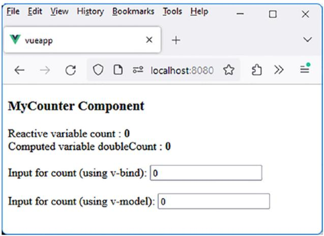

<details>
<summary>text_image</summary>

File Edit View History Bookmarks Tools Help
vueapp
localhost:8080
MyCounter Component
Reactive variable count : 0
Computed variable doubleCount : 0
Input for count (using v-bind): 0
Input for count (using v-model): 0
</details>

Figure 2-18. Initialization of input fields (v-bind operation)

The distinction between the v-bind and v-model directives becomes apparent when modifying the values in the input fields. If you modify the first input field using the v-bind directive, the reactive variable count does not get updated:

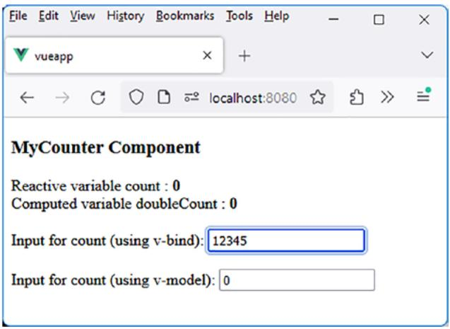

<details>
<summary>text_image</summary>

File Edit View History Bookmarks Tools Help
vueapp
localhost:8080
MyCounter Component
Reactive variable count : 0
Computed variable doubleCount : 0
Input for count (using v-bind): 12345
Input for count (using v-model): 0
</details>

Figure 2-19. Modification of the input field using v-bind

Indeed, an attribute managed by the v-bind directive is updated if the associated reactive variable is modified, but not vice versa. Therefore, modifying the value attribute of the input field does not alter the associated reactive variable count.

On the other hand, if you modify the second input field using the v-model directive, the reactive variable count updates (thanks to v-model), leading to the modification of the first input field using v-bind (due to the behavior of the v-bind directive).

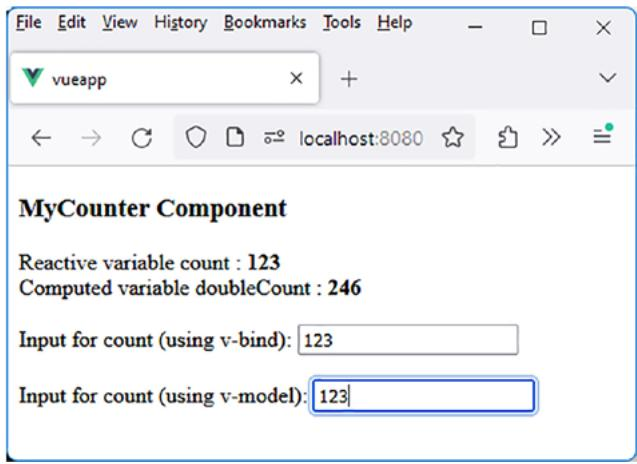

<details>
<summary>text_image</summary>

File Edit View History Bookmarks Tools Help
vueapp
localhost:8080
MyCounter Component
Reactive variable count : 123
Computed variable doubleCount : 246
Input for count (using v-bind): 123
Input for count (using v-model): 123
</details>

Figure 2-20. Modification of the input field using v-model

### Step 2: Using the v-model Directive in Forms

We have seen the usefulness of the v-model directive in managing an input field, automatically capturing the content of the input field in a reactive variable.

The v-model directive is widely employed in input forms to easily retrieve the values entered/checked/selected in the form. Each form field is simply connected to a reactive variable using the v-model directive.

Let’s use the v-model directive to retrieve and display information entered in a form, allowing the input of information displayed in various forms:

• An input field for the person’s name  
• A selection list to choose the year of birth  
Radio buttons to choose marital status  
Finally, check boxes to validate terms of use and general sales conditions

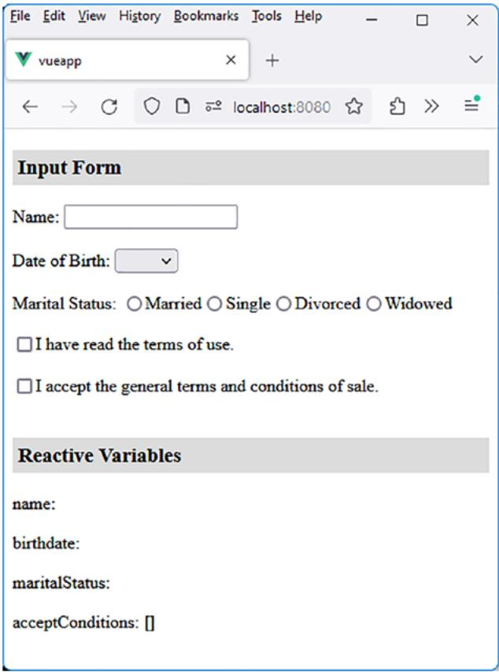

<details>
<summary>text_image</summary>

File Edit View History Bookmarks Tools Help
vueapp
localhost:8080
Input Form
Name:
Date of Birth:
Marital Status: ○ Married ○ Single ○ Divorced ○ Widowed
□ I have read the terms of use.
□ I accept the general terms and conditions of sale.
Reactive Variables
name:
birthdate:
maritalStatus:
acceptConditions: []
</details>

Figure 2-21. Input form managed by v-model

The advantage of using the v-model directive with the fields in this form is that modifying each field immediately updates the reactive variable associated with that field. The values of the reactive variables associated with each field are displayed below the form.

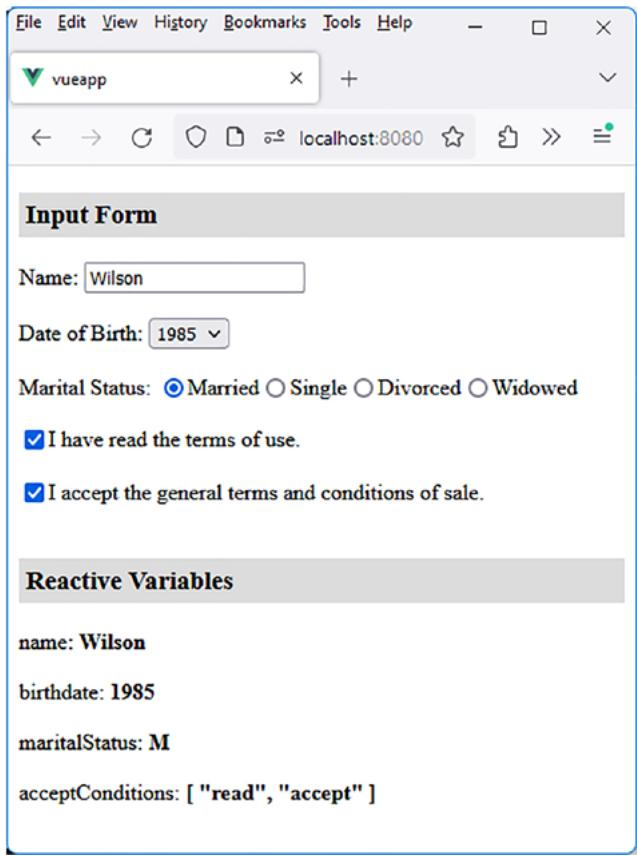

<details>
<summary>text_image</summary>

File Edit View History Bookmarks Tools Help
vueapp
localhost:8080
Input Form
Name: Wilson
Date of Birth: 1985
Marital Status: Married Single Divorced Widowed
✓ I have read the terms of use.
✓ I accept the general terms and conditions of sale.
Reactive Variables
name: Wilson
birthdate: 1985
maritalStatus: M
acceptConditions: ["read", "accept"]
</details>

Figure 2-22. Reactive variables updated according to input

The fact that each form field is linked to a reactive variable through v-model allows for retrieving the current input or selection in the form. Let’s explore how to manage each form field based on its type (input field, selection list, radio buttons, or check boxes).

A new component called MyForm is used, which will contain the previous display. The component file MyForm.vue is created in the src/ components directory. The MyForm component is inserted into the App component:

App component using the MyForm component (file src/App.vue)

```txt
<script setup>
```

import MyForm from "./components/MyForm.vue"

```vue
</script>
```

```vue
<template>
```

```txt
<MyForm />
```

```vue
</template>
```

### Step 3: Managing Input Fields with v-model

This case is the one we previously studied, which served as an introduction to the v-model directive. The MyForm component becomes the following:

Input field in the MyForm component (file src/components/ MyForm.vue)

```txt
<script setup>
```

```typescript
import { ref } from "vue"
```

```javascript
const name = ref("");
```

```vue
</script>
```

```vue
<template>
```

```txt
<h3 Animation Form</h3>
```

Name: <input type="text" v-model="name" />

```vue
<br/><br/>
<h3>Reactive Variables</h3>
name: <b>{{name}}</b>
<br/><br/>
</template>

<style scoped>
h3 {
    background-color: gainsboro;
    padding: 5px;
}
</style>
```

After entering data into the field, you get:

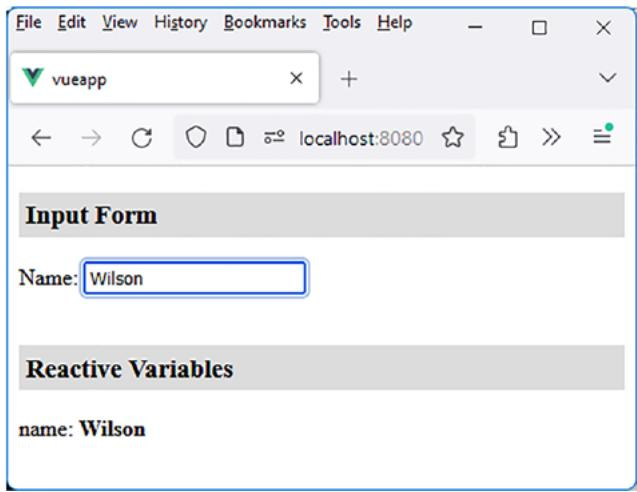

<details>
<summary>text_image</summary>

File Edit View History Bookmarks Tools Help
vueapp
localhost:8080
Input Form
Name: Wilson
Reactive Variables
name: Wilson
</details>

Figure 2-23. Entering the name in the form

### Step 4: Managing Selection Lists with v-model

Now, let’s see how to retrieve the selected value in a list, for example, the year of birth.

Selection list in the MyForm component (file src/components/ MyForm.vue)  
```txt
<script setup>
import { ref } from "vue"
const name = ref("");
let dates = [];
for (let year=2023; year > 1900; year--) dates.push(year);
const birthdate = ref("");
</script>

<template>

<h3 Animation Form</h3>
Name: <input type="text" v-model="name" />
<br/><br/>
Date of Birth:
    <select v-model="birthdate" >
    <option v-for="date in dates" :value="date"
    :key="date">{{date}}</option>
    </select>
<br/><br/>
<h3>Reactive Variables</h3>
name: <b>{{name}}</b>
<br/><br/>
birthdate: <b>{{birthdate}}</b>
```

```vue
<br/><br/>
</template>
<style scoped>
h3 {
    background-color: gainsboro;
    padding: 5px;
}
</style>
```

The v-model directive is used on the <select> element. Each year in the list is displayed using a v-for directive, iterating over "date in dates". The dates array has been previously populated in the <script setup> section of the component. If a date is chosen from the list, the selected date is displayed in the reactive variable birthdate:

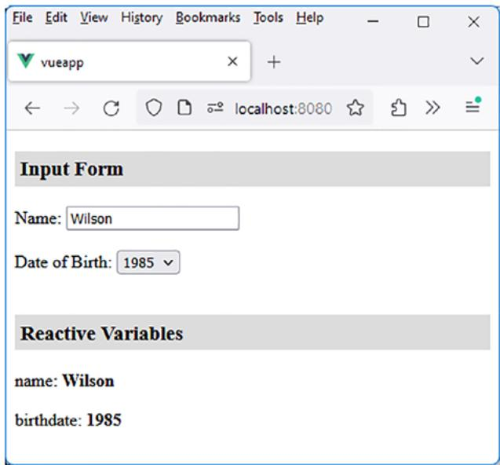

<details>
<summary>text_image</summary>

File Edit View History Bookmarks Tools Help
vueapp
localhost:8080
Input Form
Name: Wilson
Date of Birth: 1985
Reactive Variables
name: Wilson
birthdate: 1985
</details>

Figure 2-24. Selecting a date in the form

### Step 5: Managing Radio Buttons with v-model

Now, let’s see how to retrieve the value of the selected radio button. Here, radio buttons are used to choose marital status: Married, Single, Divorced, Widowed. Only one radio button at a time is selected in the list.

Managing radio buttons in the form (file src/components/ MyForm.vue)  
```txt
<script setup>
import { ref } from "vue"
const name = ref("");
let dates = [];
for (let year=2023; year > 1900; year--) dates.push(year);
const birthdate = ref("");
const maritalStatus = ref("");
</script>
<template>
<h3 Animation Form</h3>
Name: <input type="text" v-model="name" />
<br/><br/>
Date of Birth:
<select v-model="birthdate" >
<option v-for="date in dates" :value="date" :key="date">
{{date}}</option>
</select>
<br/><br/>
Marital Status:
```

```vue
<input type="radio" value="M" id="married"
v-model="maritalStatus">
<label for="married">Married</label>
<input type="radio" value="S" id="single"
v-model="maritalStatus">
<label for="single">Single</label>
<input type="radio" value="D" id="divorced"
v-model="maritalStatus">
<label for="divorced">Divorced</label>
<input type="radio" value="W" id="widower"
v-model="maritalStatus">
<label for="widower">Widowed</label>
<br/><br/>
<h3>Reactive Variables</h3>
name: <b>{{name}}</b>
<br/><br/>
birthdate: <b>{{birthdate}}</b>
<br/><br/>
maritalStatus: <b>{{maritalStatus}}</b>
<br/><br/>
</template>
<style scoped>
h3 {
    background-color: gainsboro;
    padding: 5px;
}
</style>
```

The v-model directive is applied to each <input type="radio"> element. The same reactive variable, maritalStatus, is associated with each element.

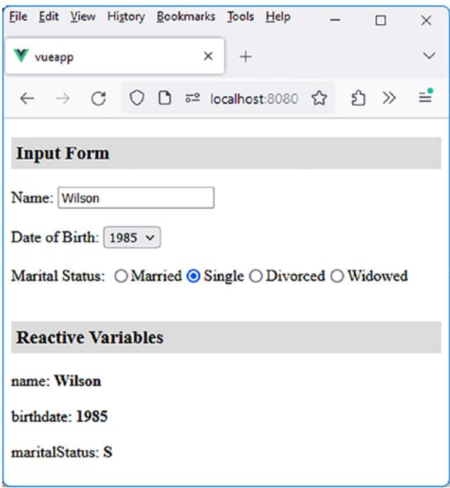

<details>
<summary>text_image</summary>

File Edit View History Bookmarks Tools Help
vueapp
localhost:8080
Input Form
Name: Wilson
Date of Birth: 1985
Marital Status: ○ Married ● Single ○ Divorced ○ Widowed
Reactive Variables
name: Wilson
birthdate: 1985
maritalStatus: S
</details>

Figure 2-25. Managing radio buttons in the form

### Step 6: Managing Check Boxes with v-model

Finally, let’s see how to handle check boxes in forms. Here, two check boxes are used, which can be checked independently:

The first one indicates that the terms of use have been read.  
The second one indicates that the general terms and conditions of sale have been accepted.

Managing check boxes in the form (file src/components/MyForm.vue)  
```txt
<script setup>
import { ref } from "vue"
const name = ref("");
let dates = [];
for (let year=2023; year > 1900; year--) dates.push(year);
const birthdate = ref("");
const maritalStatus = ref("");
const acceptConditions = ref([])
</script>

<template>

<h3 Animation Form</h3>
Name: <input type="text" v-model="name" />
<br/><br/>
Date of Birth:
    <select v-model="birthdate" >
    <option v-for="date in dates" :value="date" :key="date"
    {{date}}</option>
    </select>
<br/><br/>
Marital Status:
    <input type="radio" value="M" id="married"
    v-model="maritalStatus">
    <label for="married">Married</label>
    <input type="radio" value="S" id="single"
    v-model="maritalStatus">
```

Chapter 2 Day 2: Mastering Direc tives in Vue.js  
```txt
<label for="single">Single</label>
<input type="radio" value="D" id="divorced"
v-model="maritalStatus">
<label for="divorced">Divorced</label>
<input type="radio" value="W" id="widower"
v-model="maritalStatus">
<label for="widower">Widowed</label>
<br/><br/>
<input type="checkbox" id="read" value="read"
    v-model="acceptConditions" />
<label for="read">I have read the terms of use.</label>
<br/><br/>
<input type="checkbox" id="accept" value="accept"
    v-model="acceptConditions" />
<label for="accept">I accept the general terms and conditions of sale.</label>
<br/><br/>
<h3>Reactive Variables</h3>
name: <b>{{name}}</b>
<br/><br/>
birthdate: <b>{{birthdate}}</b>
<br/><br/>
maritalStatus: <b>{{maritalStatus}}</b>
<br/><br/>
acceptConditions: <b>{{acceptConditions}}</b>
<br/><br/>
</template>

<style scoped>
h3 {
```

```vue
background-color: gainsboro;
padding: 5px;
}
</style>
```

The reactive variable acceptConditions, which can contain the values of two check boxes, is initialized as an empty array []. Depending on which check box is checked, its value will automatically be added to the acceptConditions array.

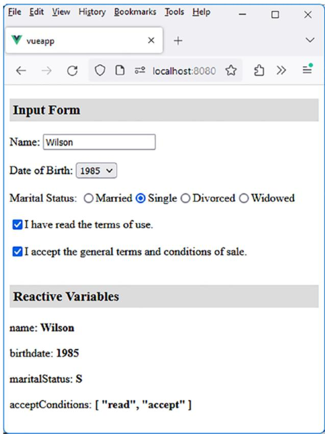

<details>
<summary>text_image</summary>

File Edit View History Bookmarks Tools Help
vueapp
localhost:8080
Input Form
Name: Wilson
Date of Birth: 1985
Marital Status: ○ Married ◎ Single ○ Divorced ○ Widowed
✓ I have read the terms of use.
✓ I accept the general terms and conditions of sale.
Reactive Variables
name: Wilson
birthdate: 1985
maritalStatus: S
acceptConditions: ["read", "accept"]
</details>

Figure 2-26. Handling check boxes in the form

### Using Modifiers in Vue.js

Some directives in Vue.js can have what are called modifiers. These modifiers allow modifying the default behavior of the directive.

Take the example of the v-model directive mentioned earlier. It has the following modifiers:

lazy: The lazy modifier changes the behavior of updating the reactive variable associated with the directive. It updates the variable only when exiting the input field, rather than updating it for every character entered. When the lazy modifier is used, Vue.js considers the change event (for updating the associated reactive variable) instead of the input event.  
trim: The trim modifier removes any leading or trailing spaces from the input field when updating the associated reactive variable.

A modifier is used after the name of the associated directive, prefixed with the “.” character. For example, you write v-model.trim="count" or v-model.lazy="count". Additionally, you can combine multiple modifiers by writing v-model.trim.lazy="count".

Let’s use the lazy modifier with the v-model directive, taking the name input field from the previous example. The MyForm component is modified to accommodate the lazy modifier in the directive.

Using the lazy modifier (file src/components/MyForm.vue)

```vue
<script setup>
import { ref } from "vue"
const name = ref("");
</script>
```

```vue
<template>
<h3 Animation Form</h3>
Name: <input type="text" v-model.lazy="name" />
<br/><br/>
<h3>Reactive Variables</h3>
name: <b>{{name}}</b>
<br/><br/>
</template>
<style scoped>
h3 {
    background-color: gainsboro;
    padding: 5px;
}
</style>
```

Let’s enter a name in the input field associated with v-model:

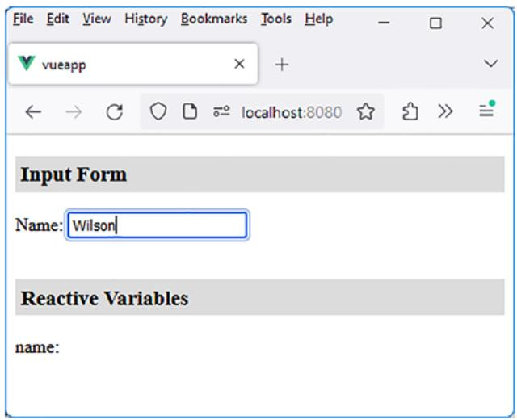

<details>
<summary>text_image</summary>

File Edit View History Bookmarks Tools Help
vueapp
Input Form
Name: Wilson
Reactive Variables
name:
</details>

Figure 2-27. Modifying an input field with the “lazy” modifier

Now, we can see that the reactive variable no longer updates as we type, contrary to the usual behavior of the v-model directive. However, as soon as we exit the input field, the reactive variable name updates.

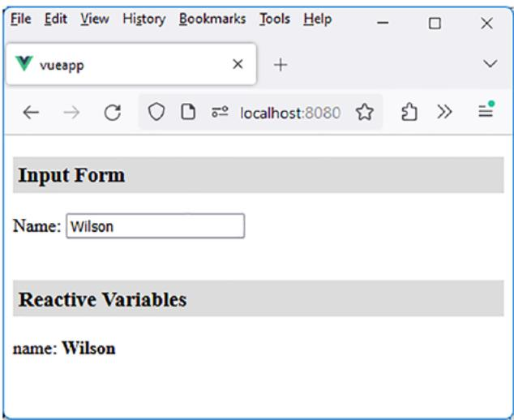

<details>
<summary>text_image</summary>

File Edit View History Bookmarks Tools Help
vueapp
localhost:8080
Input Form
Name: Wilson
Reactive Variables
name: Wilson
</details>

Figure 2-28. Updating the reactive variable upon exiting the input field

There are many modifiers available depending on the directives used. It is also possible to create new modifiers (see Chapter 5).

### Conclusion

This chapter has provided us with an in-depth understanding of directives in Vue.js, ranging from using attributes to mastering directives like v-bind, v-if, and v-model. These skills are fundamental for building robust and maintainable Vue.js applications.

The next chapter will guide us through handling DOM events, a crucial skill to enhance interactivity in Vue.js applications.