# Day 4: Building an Application in Vue.js

In this chapter, we’ll delve into a fundamental aspect of modern web development: communication between the client and server via HTTP requests. You’ll learn how to make requests to retrieve data from a remote server and use it in your Vue.js application.

We’ll build a practical application to implement these concepts. The application will display a list of all countries worldwide, allowing the user to filter this list based on the characters entered in a search field. To achieve this, we’ll use the REST API available at the following URL: https://restcountries.com/v3.1/all.

So not only will you reinforce your Vue.js skills, but you’ll also acquire new skills in JSON data manipulation and interacting with REST APIs.

## Introduction to the REST API

The list of countries is retrieved from the following URL: https:// restcountries.com/v3.1/all. If you enter this URL into a browser, you’ll receive a JSON-formatted response like the following:

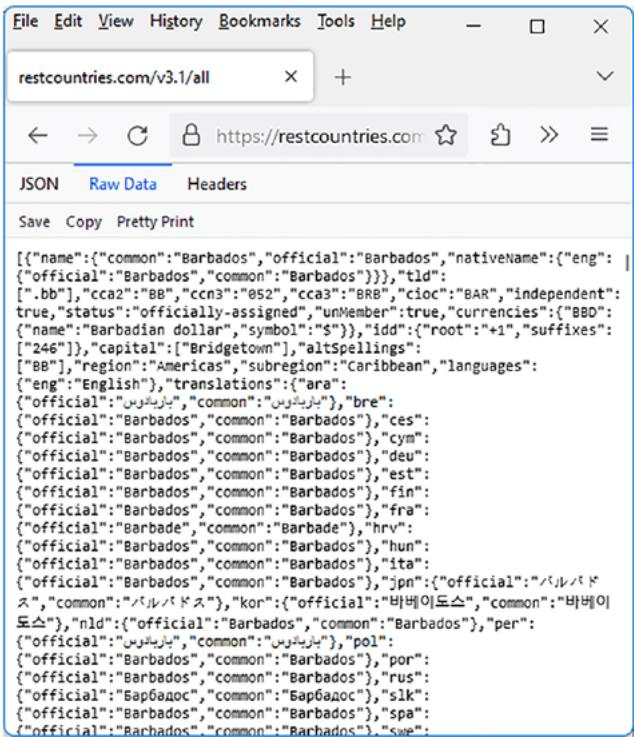

<details>
<summary>text_image</summary>

File Edit View History Bookmarks Tools Help
restcountries.com/v3.1/all
← → ↙ https://restcountries.com ☆ ↖ ≡
JSON Raw Data Headers
Save Copy Pretty Print
[{"name":{"common":"Barbados","official":"Barbados","nativeName":{"eng":{"official":"Barbados","common":"Barbados}}}],"tld:
[".bb"],"cca2":"BB","ccn3":"052","cca3":"BRB","cioc":"BAR","independent":true,"status":"officially-assigned","unMember":true,"currencies":{"BBD":{"name":"Barbadian dollar","symbol":"s}}}],"idd":{"root":"+1","suffixes":["246"]},"capital":["Bridgetown"],"altSpellings":["BB"],"region":"Americas","subregion":"Caribbean","languages":{"eng":"English"},{"translations":{"ara":{"official":"biyadows","common":"biyadows"}],"bre":{"official":"Barbados","common":"Barbados"},{"ces":{"official":"Barbados","common":"Barbados"},{"cym":{"official":"Barbados","common":"Barbados"},{"deu":{"official":"Barbados","common":"Barbados"},{"est":{"official":"Barbados","common":"Barbados"},{"fin":{"official":"Barbados","common":"Barbados"},{"fra":{"official":"Barbade","common":"Barbade"},{"hrv":{"official":"Barbados","common":"Barbados"},{"hun":{"official":"Barbados","common":"Barbados"},{"ita":{"official":"Barbados","common":"Barbados"},{"jpn":{"official":"パルバドス","common":"パルバドス"},{"kor":{"official":"바베이도스","common":"바베이도스"},{"nld":{"official":"Barbados","common":"Barbados"},{"per":{"official":"بازش","common":"بازش"},{"pol":{"official":"Barbados","common":"Barbados"},{"por":{"official":"Barbados","common":"Barbados"},{"rus":{"official":"Барбадос","common":"Барбадос"},{"slk":{"official":"Barbados","common":"Barbados"},{"spa":{"official":"Barbados","common":"Barbados"},{"save:
</details>

Figure 4-1. Response from the URL https://restcountries.com/ v3.1/all

The displayed response shows that the provided data corresponds to an array of JavaScript objects, containing detailed information about each country.

The goal of this example will be to make an HTTP request to this server and then display the response in a browser as a list.

## Application Screens

Here, we describe all the screens of the application, based on user actions.

Upon launching the application, the list of countries is retrieved (Figure 4-2) and displayed (Figure 4-3):

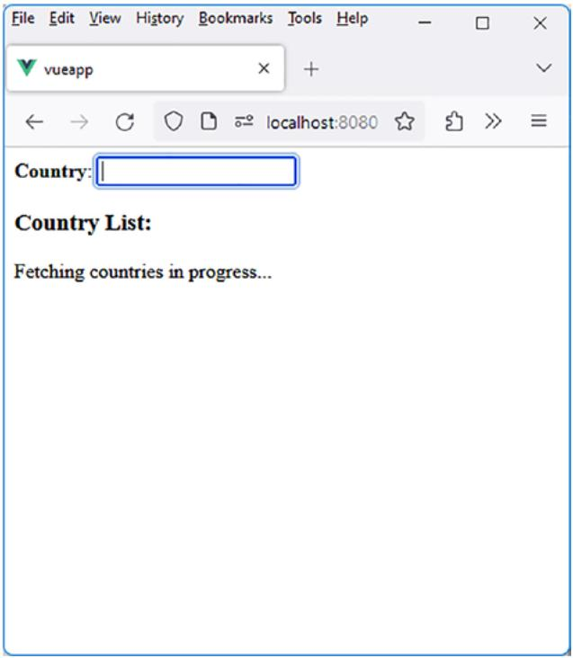

<details>
<summary>text_image</summary>

File Edit View History Bookmarks Tools Help
vueapp
Country:
Country List:
Fetching countries in progress...
</details>

Figure 4-2. Fetching country list

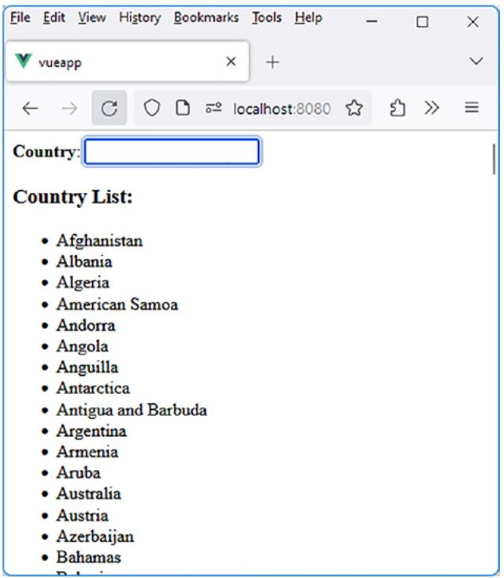

<details>
<summary>text_image</summary>

File Edit View History Bookmarks Tools Help
vueapp
 Country:
Country List:
• Afghanistan
• Albania
• Algeria
• American Samoa
• Andorra
• Angola
• Anguilla
• Antarctica
• Antigua and Barbuda
• Argentina
• Armenia
• Aruba
• Australia
• Austria
• Azerbaijan
• Bahamas
</details>

Figure 4-3. Country list retrieved and displayed

The “Country” input field allows entering the beginning of a country name. The displayed countries in Figure 4-4 will then be those whose names start with the entered letters.

If you type “e” in the field, only countries whose names start with “e” will be displayed:

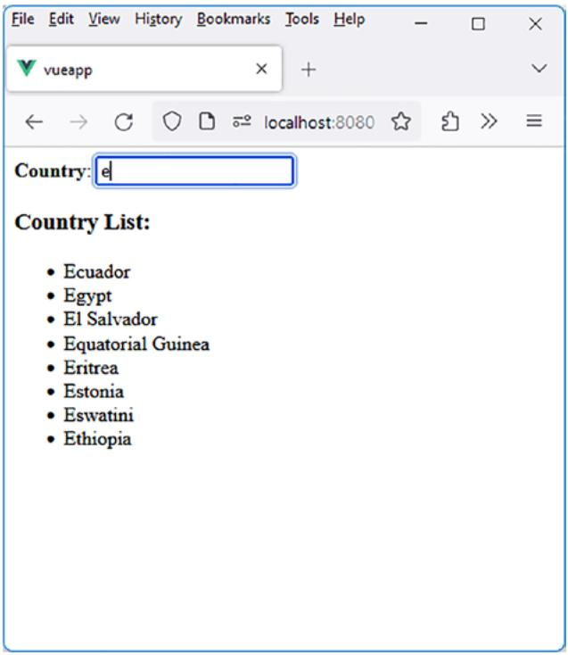

<details>
<summary>text_image</summary>

File Edit View History Bookmarks Tools Help
vueapp
Country: e
Country List:
• Ecuador
• Egypt
• El Salvador
• Equatorial Guinea
• Eritrea
• Estonia
• Eswatini
• Ethiopia
</details>

Figure 4-4. The list of countries is filtered based on the entered beginning of the country's name

The list updates as the input is entered.

Let’s see how to implement this application with Vue.js. We’ll start by breaking down the application into components.

## Breaking Down the Application into Components

The application will consist of two components:

1. The App component containing the overall application. It will include an input field for the country name and a MyCountries component containing the list of countries.  
2. The MyCountries component that contains the list of countries and displays those whose names start with the letters entered in the country name field (from the App component).

To achieve this, the MyCountries component should have an attribute representing the entered country name in the App component. The MyCountries component will automatically refresh whenever the country name is modified in the input field.

We can start writing the App and MyCountries components as follows:

App component (src/App.vue file)  
```vue
<script setup>
import MyCountries from './components/MyCountries.vue'
import { ref } from "vue";
const name = ref("");
</script>
<template>
<b>Country</b>: <input type="text" v-model="name" />
<br>
<MyCountries :name="name" />
</template>
```

The country name input field is associated with a reactive variable, name, updated as the input progresses through the v-model directive. This reactive variable name is passed as an attribute to the MyCountries component, which will be automatically updated whenever the attribute’s value changes.

The MyCountries component is outlined here in a concise manner. Currently, it simply displays the value of the name attribute passed to it, along with the “Retrieving countries...” message displayed until the list of countries is retrieved.

MyCountries component (src/components/MyCountries.vue file)  
```vue
<script setup>
import { defineProps, ref } from "vue";
defineProps(["name"]);
const names = ref([]);    // Countries names displayed in the list
let countries = [];    // All country names (retrieved only once at startup)
</script>
<template>
<h3>Country List</h3>
<div v-show="!countries.length">Fetching countries in progress...</div>
Entered Country: {{name}}
<ul>
<li v-for="n in names" :key="n" <{n}</li>
</ul>
</template>
```

Let’s make some observations about the code of the MyCountries component:

1. The name attribute is retrieved using defineProps(["name"]) and then displayed in the <template> with {{name}}. Indeed, this ensures that communication between the App component and the MyCountries component is established.  
2. The “Fetching countries in progress ...” waiting text will be displayed only when the list of countries has not been retrieved yet. This is achieved using the v-show directive with the condition "!countries. length", meaning that the associated <div> is displayed only if the retrieved list of countries is empty.  
3. The reactive variable names contains the list of all retrieved countries and is updated based on the value of the transmitted name attribute. It is displayed as a list <li> with a v-for directive.  
4. The countries variable represents the list of all country names, retrieved only once during the application’s launch.

Let’s examine the result produced by the implementation of these two components:

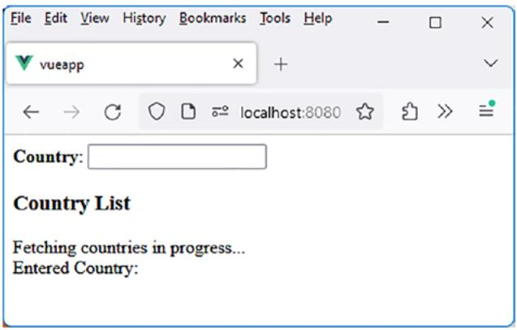

<details>
<summary>text_image</summary>

File Edit View History Bookmarks Tools Help
vueapp
← → ↙ localhost:8080
Country:
Country List
Fetching countries in progress...
Entered Country:
</details>

Figure 4-5. Application launch (temporary)

If we type the beginning of a name in the input field, it should be displayed in the MyCountries component. This demonstrates that attribute-based communication between the App component and the MyCountries component is functioning:

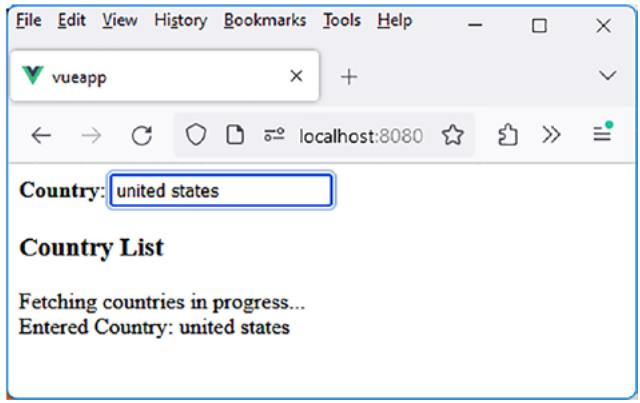

<details>
<summary>text_image</summary>

File Edit View History Bookmarks Tools Help
vueapp
Country: united states
Country List
Fetching countries in progress...
Entered Country: united states
</details>

Figure 4-6. Entering the name of a country

The foundational components are created. Now, let’s enhance them to finalize our application.

## Retrieving the List of Countries

Let’s start by fetching and displaying the list of countries. This list is retrieved only once, at the application’s startup. We perform this operation in the MyCountries component. To ensure it happens only once at startup, we decide to do it in the onMounted() method, which is called when the component is mounted in the DOM.

Retrieve the list of country names (src/components/MyCountries. vue file)  
```javascript
<script setup>

import { defineProps, ref, onMounted } from "vue";
defineProps(["name"]);
const names = ref([]);    // Countries names displayed in the list
let countries = [];    // All country names (retrieved only once at startup)

onMounted(() => {
    var url = "https://restcountries.com/v3.1/all";
    fetch(url)
    .then((res) => res.text())
    .then((data) => {
    countries = JSON.parse(data).map(function(elem) {
    return elem.name.common;
    });
    // In ascending alphabetical order
    countries = countries.sort((n1, n2) => {
    if (n1 > n2) return 1;
    if (n1 < n2) return -1;
    return 0;
    }
    }
}
```

```vue
});
names.value = countries;    // Updating the displayed list.
})
.catch((err) => names.value = [err.toString()]);
});

</script>

<template>

<h3>Country List:</h3>

<div v-show="!countries.length">Fetching countries in progress...</div>

<ul>

<li v-for="n in names" :key="n" >{{n}}</li>

</ul>

</template>
```

We utilize the JavaScript fetch(url) method to make a request to a server. The server’s response is then transformed and placed into an alphabetically sorted array called countries.

Please note that we use elem.name.common to retrieve the country’s name. You can see it by looking at Figure 4-1 that displays the full JSON response.

This array is subsequently transferred to the reactive variable names, which is displayed as a list using the v-for directive in the <template> section of the component. Additionally, since the countries array will be populated with at least one element, the “Fetching countries in progress...” waiting text will be hidden, and the list of countries will be displayed.

In this context, we have employed JavaScript promises, utilizing the then() and catch() methods. An alternative version of this program utilizes JavaScript’s async and await instructions.

Using async and await instructions (src/components/MyCountries. vue file)  
<script setup>   
import { defineProps, ref, onMounted } from "vue";   
defineProps(["name"];   
const names $=$ ref([]); // Countries names displayed in the list   
let countries $=$ []; // All country names (retrieved only once at startup)

```javascript
async function getCountries() {
    var url = "https://restcountries.com/v3.1/all";
    var response = await fetch(url);
    var data = await response.text();
    countries = JSON.parse(data).map(function(elem) {
    return elem.name.common;
    });
    // In ascending alphabetical order
    countries = countries.sort((n1, n2) => {
    if (n1 > n2) return 1;
    if (n1 < n2) return -1;
    return 0;
    });
    return countries;
}
```

```vue
onMounted(async () => {
    names.value = await getCountries();
});

</script>

<template>

<h3>Country List:</h3>

<div v-show="!countries.length">Fetching countries in progress...</div>

<ul>

<li v-for="n in names" :key="n" >{{n}}</li>

</ul>

</template>
```

We have created the function getCountries() as an asynchronous function, called directly in the onMounted() method using the async and await instructions. Regardless of the program version used, the list of countries is retrieved and then displayed:

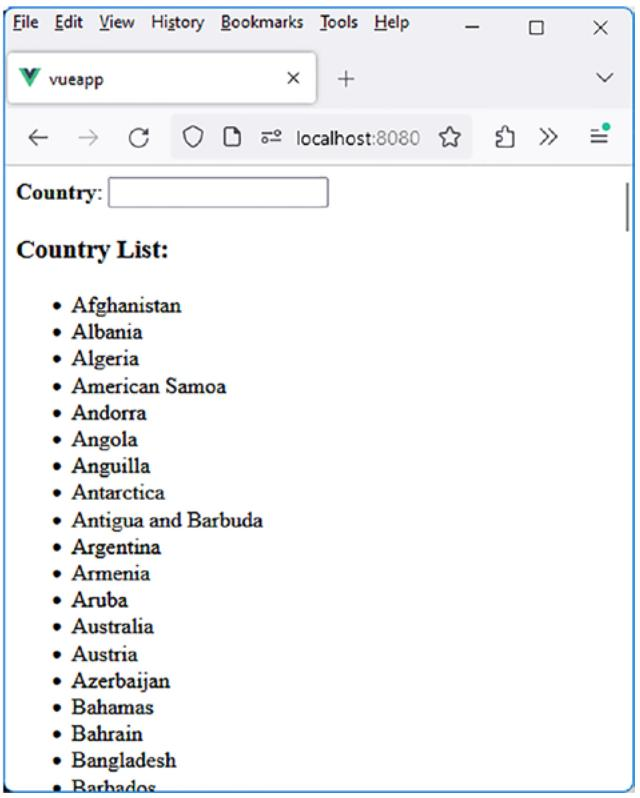

<details>
<summary>text_image</summary>

Country:
Country List:
• Afghanistan
• Albania
• Algeria
• American Samoa
• Andorra
• Angola
• Anguilla
• Antarctica
• Antigua and Barbuda
• Argentina
• Armenia
• Aruba
• Australia
• Austria
• Azerbaijan
• Bahamas
• Bahrain
• Bangladesh
• Barbados
</details>

Figure 4-7. Retrieved and displayed list of countries

The list of countries is now successfully retrieved and displayed. Let’s now explore how to filter the list based on the entered beginning of the country’s name in the Country field.

## Filtering the List of Countries According to the Entered Name

Currently, entering characters in the country name field does not produce any changes to the displayed list. This is expected because the MyCountries component does not yet consider the name attribute that is passed to it.

To filter the list of countries based on the entered name, you would need to execute the following code block:

Filter the list based on the entered name  
```javascript
let countriesFiltered = countries.filter((n) => {
    // Construct the regular expression (regex)
    const reg = new RegExp("^" + props.name, "i");
    if (n.match(reg)) return true;    // We keep the name in the list
    else return false;    // We do not keep the name in the list
});
names.value = countriesFiltered;    // Update the displayed list
```

Let’s provide some explanations for this code block:

1. The variable countriesFiltered contains an array of country names constructed from the initial countries array. For example, if we want to keep in the list the names of countries starting with "fr", we use the regular expression "^fr", where "fr" is the word transmitted in the name attribute and therefore included in props.name.  
2. The "i" parameter used as the second argument in the RegExp class signifies case insensitivity, meaning it ignores uppercase or lowercase distinctions in country names.  
3. The filter() method returns a new array, indicating whether to keep (return true) or reject (return false) the initial element.

4. It then remains to update the reactive variable names with this new list of country names, which is done by writing names.value = countriesFiltered.

Now, the question arises as to where to place this code block. One might be tempted to place it in the onUpdated() method of the component, which is called when the component is updated, but that’s not a good idea. Updating the reactive variable names in this part of the code would result in an infinite loop because it would trigger a new update of the component, leading to a new call to the onUpdated() method.

To avoid such issues, Vue.js has created the watch() method, which allows you to perform a task when a variable is updated. The observed variable here will be props.name, which is the value of the name attribute in the MyCountries component.

## Using the watch( ) Method

The watch(name, callback) method allows observing changes that occur on a reactive variable named name and invoking the processing function callback(newValue, oldValue) when a change occurs:

The newValue parameter corresponds to the new value of the observed reactive variable.  
The oldValue parameter corresponds to the old value of the observed reactive variable.

The watch() method is typically employed to monitor changes on a reactive variable, but it will be demonstrated that it is also possible to observe nonreactive variables (such as props.name) using the watch() method.

Let’s write the previous code block in a watch() function for props. name using the watch() method:

MyCountries component (src/components/MyCountries.vue file)

```javascript
<script setup>

import { defineProps, ref, onMounted, watch } from "vue";
const props = defineProps(["name"]);
const names = ref([]);    // Countries names displayed in the list
let countries = [];    // All country names (retrieved only once at startup)

onMounted(() => {
    var url = "https://restcountries.com/v3.1/all";
    fetch(url)
    .then((res) => res.text())
    .then((data) => {
    countries = JSON.parse(data).map(function(elem) {
    return elem.name.common;
    });
    // In ascending alphabetical order
    countries = countries.sort((n1, n2) => {
    if (n1 > n2) return 1;
    if (n1 < n2) return -1;
    return 0;
    });
    names.value = countries;
    })
    .catch((err) => names.value = [err.toString()];
});

watch(props.name, (newName) => {
    let countriesFiltered = countries.filter((n) => {
    const reg = new RegExp("^" + newName, "i");
    if (n.match(reg)) return true;
    else return false;
```

Chapter 4 Day 4: Build ing an Applic ation in Vue.js  
```html
});  
names.value = countriesFiltered;  
});  
</script>  
<template>  
<h3>Country List:</h3>  
<div v-show="!countries.length">Fetching countries in progress... </div>  
<ul>  
<li v-for="n in names" :key="n" <{{n}}</li>  
</ul>  
</template>
```

Indeed, it’s crucial to test the functionality. Let’s run the program and enter characters in the input field to verify its operation.

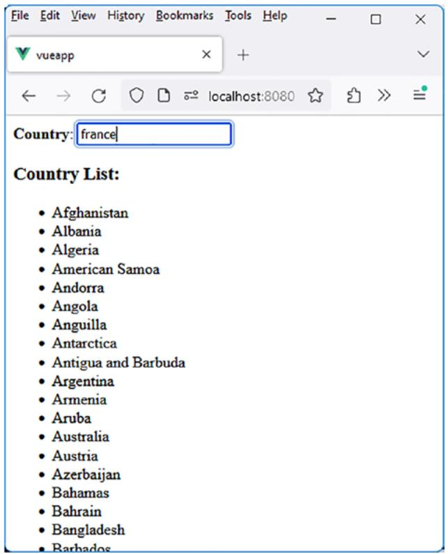

<details>
<summary>text_image</summary>

Country: france
Country List:
• Afghanistan
• Albania
• Algeria
• American Samoa
• Andorra
• Angola
• Anguilla
• Antarctica
• Antigua and Barbuda
• Argentina
• Armenia
• Aruba
• Australia
• Austria
• Azerbaijan
• Bahamas
• Bahrain
• Bangladesh
• Barbados
</details>

Figure 4-8. The list of countries does not update

It appears that the filter is not working. The explanation is as follows.

When we write watch(props.name, callback), we are observing the value of the variable props.name at the moment the watch() function is written, that is, during initialization (or setup). However, as the variable props.name is not reactive, it would be necessary to update the value of props.name based on what is entered in the input field.

To achieve this, we need to create a “getter” function that retrieves the current value of props.name. This can be simply written as ()=>props.name.

Therefore, we write the following:

MyCountries component (src/components/MyCountries.vue file)  
```javascript
<script setup>

import { defineProps, ref, onMounted, watch } from "vue";
const props = defineProps(["name"]);
const names = ref([]);    // Countries names displayed in the list
let countries = [];    // All country names (retrieved only once at startup)

onMounted(() => {
    var url = "https://restcountries.com/v3.1/all";
    fetch(url)
    .then((res) => res.text())
    .then((data) => {
    countries = JSON.parse(data).map(function(elem) {
    return elem.name.common;
    });
    // In ascending alphabetical order
    countries = countries.sort((n1, n2) => {
    if (n1 > n2) return 1;
    if (n1 < n2) return -1;
    return 0;
    });
    names.value = countries;
    })
    .catch((err) => names.value = [err.toString()];
});

watch(()=>props.name, (newName) => {
```

```html
let countriesFiltered = countries.filter((n) => {
    const reg = new RegExp("^" + newName, "i");
    if (n.match(reg)) return true;
    else return false;
});
names.value = countriesFiltered;
});
</script>
<template>
<h3>Country List:</h3>
<div v-show=!countries.length">Fetching countries in progress...</div>
<ul>
<li v-for="n in names":key="n">{{n}}</li>
</ul>
</template>
```

Indeed, using the notation ()=>props.name returns the current value of props.name, allowing it to be observed and compared to the previous value. Let’s verify that this works:

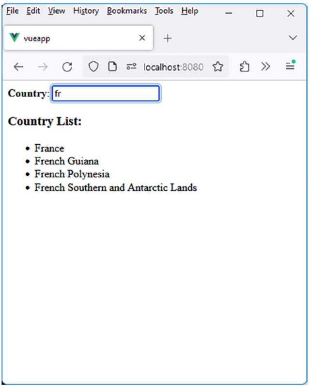

<details>
<summary>text_image</summary>

Country: fr
Country List:
• France
• French Guiana
• French Polynesia
• French Southern and Antarctic Lands
</details>

Figure 4-9. Functional country filter

We have successfully filtered the list based on the characters entered by the user in the input field. The watch() method helped us achieve this. Vue.js also offers another filtering method, which is the watchEffect() method. Let’s see how to use it for list filtering.

## Using the watchEffect( ) Method

The watchEffect(callback) method is similar to the previously discussed watch(name, callback) method, with some differences.

Instead of specifying the name of the observed variable in the parameters, the observed variables (reactive or not) will be those used in the callback function. Vue.js executes the callback function at each component initialization to determine the variables that will be observed.

If variables are used in a part of the callback function that is not executed at startup, these variables will not be observed and will not trigger future executions of the callback function.

The watchEffect() method can be summarized in three points:

1. Automatic Dependency Detection: Unlike watch(), which requires explicitly specifying the variables to observe, watchEffect(callback) automatically detects variables accessed in the callback function.  
2. Initial Execution: watchEffect(callback) executes the callback function once during component initialization to identify the variables to observe.  
3. Unexecuted Parts: If variables are present in code parts that are not executed during initialization (e.g., in an unexecuted conditional branch), these variables will not be recorded as dependencies and will not trigger future executions of the callback function.

Let’s use the watchEffect() method instead of the previous watch() method. We want to observe the props.name variable in watchEffect() to modify the list based on the entered country name. For this, this variable must be used during the first execution of the callback function, which occurs at the initialization of the MyCountries component.

If we replace the direct call to the watch() method with that of the watchEffect() method, it is written as follows:

Using the watchEffect() method (file src/components/  
MyCountries.vue)  
```javascript
<script setup>

import { defineProps, ref, onMounted, watchEffect } from "vue";
const props = defineProps(["name"]);
const names = ref([]);    // Countries names displayed in the list
let countries = [];    // All country names (retrieved only once at startup)

onMounted(() => {
    var url = "https://restcountries.com/v3.1/all";
    fetch(url)
    .then((res) => res.text())
    .then((data) => {
    countries = JSON.parse(data).map(function(elem) {
    return elem.name.common;
    });
    // In ascending alphabetical order
    countries = countries.sort((n1, n2) => {
    if (n1 > n2) return 1;
    if (n1 < n2) return -1;
    return 0;
    });
    names.value = countries;
    })
    .catch((err) => names.value = [err.toString()];
});

watchEffect(() => {
    let countriesFiltered = countries.filter((n) => {
```

```vue
const reg = new RegExp("^" + props.name, "i");
if (n.match(reg)) return true;
else return false;
});
names.value = countriesFiltered;
});
</script>
<template>
<h3>Country List:</h3>
<div v-show=!countries.length">Fetching countries in progress...</div>
<ul>
<li v-for="n in names":key="n">{{n}}</li>
</ul>
</template>
```

One can verify that this does not work, and it is expected, as for the variable props.name to be within a code block executed during the component initialization, the filter() method would need to be executed, which is not the case here because the countries array is initially empty.

A workaround involves the inclusion of the statement console. log(props.name), effectively allowing the utilization of the variable props. name for subsequent observation. The modification to the watchEffect() method is as follows:

Use console.log(props.name) within watchEffect()

```javascript
watchEffect(() => {
    console.log(props.name); // Do not delete: allows the observation of props.name
```

Chapter 4 Day 4: Build ing an Applic ation in Vue.js  
```javascript
let countriesFiltered = countries.filter((n) => {
    const reg = new RegExp("^" + props.name, "i");
    if (n.match(reg)) return true;
    else return false;
});
names.value = countriesFiltered;
});
```

Let’s verify that the variable props.name is now being observed:

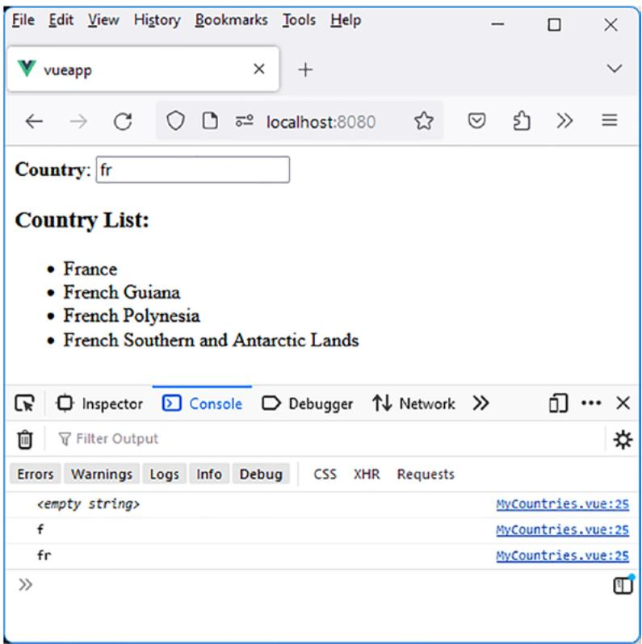

<details>
<summary>text_image</summary>

File Edit View History Bookmarks Tools Help
vueapp
localhost:8080
Country: fr
Country List:
• France
• French Guiana
• French Polynesia
• French Southern and Antarctic Lands
Inspector Console Debugger ↑ Network >>
Filter Output
Errors Warnings Logs Info Debug CSS XHR Requests
<empty string> MyCountries.vue:25
f MyCountries.vue:25
fr MyCountries.vue:25
>>
</details>

Figure 4-10. The variable props.name is observed by watchEffect()

To provide comprehensive explanations, another way to filter the list can also be offered, using the provide() and inject() methods, which enable data sharing between multiple components. Let’s explore how to use them here.

## Using the provide( ) and inject( ) Methods

An alternative program structure is possible by employing the provide() and inject() methods.

Instead of passing the reactive variable name as an attribute to MyCountries, it is transmitted from the App component through the provide() method and retrieved in the MyCountries component using the inject() method.

The App component becomes the following:

App component (file src/App.vue)  
```vue
<script setup>
import MyCountries from './components/MyCountries.vue'
import { ref, provide } from "vue";
const name = ref("");
provide("name", name);
</script>
<template>
<b>Country</b>: <input type="text" v-model="name" />
<br>
<MyCountries />
</template>
```

The MyCountries component is now used without the name attribute. However, this reactive variable is transmitted to child components using the provide("name", name) method and will be retrieved in the MyCountries component through the inject("name") method.

The MyCountries component is modified as follows:

MyCountries component (file src/components/MyCountries.vue)  
<script setup>   
import { ref, onMounted, watch, inject } from "vue";   
const names $=$ ref([]); // Countries names displayed in the list   
let countries $=$ []; // All country names (retrieved only once at startup)  
const name = inject("name"); // The reactive variable name is retrieved

```javascript
onMounted(() => {
    var url = "https://restcountries.com/v3.1/all";
    fetch(url)
    .then((res) => res.text())
    .then((data) => {
    countries = JSON.parse(data).map(function(elem) {
    return elem.name.common;
    });
    // In ascending alphabetical order
    countries = countries.sort((n1, n2) => {
    if (n1 > n2) return 1;
    if (n1 < n2) return -1;
    return 0;
    });
```

```vue
names.value = countries;
})
.catch((err) => names.value = [err.toString()]);
});
watch(name, () => {
    let countriesFiltered = countries.filter((n) => {
    const reg = new RegExp("^" + name.value, "i");
    if (n.match(reg)) return true;
    else return false;
    });
    names.value = countriesFiltered;
});

</script>

<template>

<h3>Country List:</h3>

<div v-show=!countries.length">Fetching countries in progress...</div>

<ul>
<li v-for="n in names" :key="n" <{{n}}</li>
</ul>

</template>
```

The reactive variable name can be directly observed using the watch(name, callback) method, as it is indeed the reactive variable name being observed here, and not an attribute transmitted via props.name as before. Let’s verify that this works:

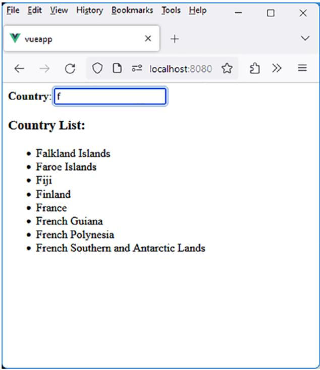

<details>
<summary>text_image</summary>

File Edit View History Bookmarks Tools Help
vueapp
Country: f
Country List:
• Falkland Islands
• Faroe Islands
• Fiji
• Finland
• France
• French Guiana
• French Polynesia
• French Southern and Antarctic Lands
</details>

Figure 4-11. Usage of provide() and inject()

## Giving Focus to the Input Field

The program can be further enhanced by giving focus to the input field as soon as the page is displayed. The focus() method provided by the DOM API is employed for this purpose.

It is necessary to modify the App component that contains the input field to which focus should be given. The onMounted() method is utilized to access the DOM element corresponding to the input field.

Giving focus to the input field (file src/App.vue)  
```vue
<script setup>

import MyCountries from './components/MyCountries.vue'
import { ref, provide, onMounted } from "vue";
const name = ref("");
provide("name", name);

onMounted(()=>document.querySelector("input[type=text])".focus());
</script>

<template>

<b>Country</b>: <input type="text" v-model="name" />
<br>
<MyCountries />
</template>
```

The input field is accessed through the DOM API, for example, by using document.querySelector(selector). All that remains is to use the focus() method of the DOM API on this element to give it focus.

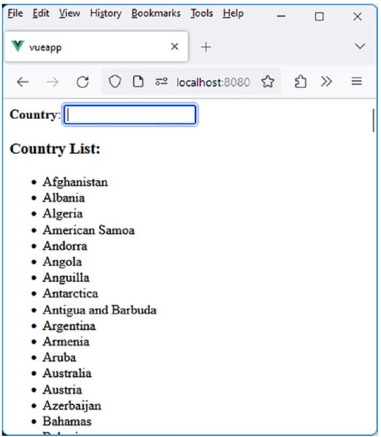

<details>
<summary>text_image</summary>

File Edit View History Bookmarks Tools Help
vueapp
 Country: |
Country List:
• Afghanistan
• Albania
• Algeria
• American Samoa
• Andorra
• Angola
• Anguilla
• Antarctica
• Antigua and Barbuda
• Argentina
• Armenia
• Aruba
• Australia
• Austria
• Azerbaijan
• Bahamas
</details>

Figure 4-12. The input field gains focus directly

In the next chapter, we will explore the creation of a new directive that directly gives focus to the input field, providing a more optimal approach.

## Conclusion

You now have a comprehensive understanding of how to perform HTTP requests in a Vue.js application. You have learned to retrieve data from a remote server and seamlessly integrate it into your application. The example of the country list has allowed you to implement these concepts, providing you with a practical and concrete experience.

While we have explored leveraging data from an external source, the upcoming chapter will take you further into customizing and optimizing Vue.js applications. We will delve into creating new directives and composables, powerful tools that enable you to build advanced features and efficiently reuse your application logic. These techniques will make your code both cleaner and more functional.