# Day 5: Mastering the Creation of Directives in Vue.js

We have covered the main features of Vue.js. Now, let’s explore how these features can be extended by creating new directives. Vue.js provides standard directives such as v-show, v-if, v-for, v-bind, or v-on. It is possible to create custom directives tailored for use in our application components.

## Why Create New Directives?

Creating custom directives offers several advantages that can significantly enhance code quality and maintainability. Some of these benefits include the following:

1. Code Reusability: Encapsulate frequently used behaviors into a directive and reuse them across multiple components.  
2. Clarity and Readability: Using a well-named directive makes the template more readable and expressive.

3. Testability: Directives can be independently tested, facilitating the verification of their correct functionality.  
4. Extensibility: Easily extend existing directive functionalities or create new directives for custom behaviors.

The ability to create custom directives promotes good code organization, reusability, and readability.

Now that we understand the usefulness of writing custom directives, let’s delve into how to organize the code that will be executed when the directive is used.

## Directive Lifecycle

A Vue.js directive is a JavaScript object that can have one or more of the following lifecycle properties. Each property is a method called at different stages of the lifecycle of the DOM element to which the directive is applied. This allows for the execution of specific actions at each stage:

1. beforeMount(el, binding): Called just before the element el is inserted into the DOM  
2. mounted(el, binding): Called when the element el has just been added to the DOM  
3. beforeUpdate(el, binding): Called before the element el is updated, for example, when a reactive variable changes  
4. updated(el, binding): Called after the element el has been updated

5. beforeUnmount(el, binding): Called just before the element el is removed from the DOM  
6. unmounted(el, binding): Called after the element el has been removed from the DOM

The primary method used among the aforementioned is the mounted() method. It runs once when the el element is attached to the DOM.

By using these methods, you can perform specific actions at different moments in the lifecycle of the element to which the directive is applied.

Each of these methods accepts two parameters: el and binding:

el: The DOM element associated with the directive (the one on which the directive is placed).

binding: An object containing additional information about the directive. This object can have several properties, such as the following:

binding.value: The value passed to the directive (the value is indicated after the “=” sign if present after the directive).  
binding.arg: The argument passed to the directive, if used. The argument is separated by the “:” character with the directive. Only one argument can be specified. For example, for the v-bind:value directive, binding. arg is "value".  
binding.modifiers: An object representing the modifiers applied to the directive. Multiple modifiers can be specified, separated by “.”.  
binding.instance: The instance of the component using the directive.  
binding.dir: An object containing information about the directive itself.

One might ask: Where to place a directive?

According to the official Vue.js documentation, directives are primarily designed to be applied to DOM nodes, that is, HTML elements. Although it is possible to apply a directive to a Vue.js component, this use is not explicitly encouraged or recommended by Vue.js.

## Creating a New Directive

To create a new directive, we use the app.directive(name, callback) method. The app object is returned by the createApp(App) method. The createApp(App) method is used in the src/main.js file of the application and is used to create the Vue.js application.

The newly created directives will be centralized from the src/main. js file. They can be either directly specified in this file or imported from a file that contains them. Let’s explore these two possibilities by creating a focus directive that will be used in the form of v-focus in the component templates. This v-focus directive is designed to give focus to the HTML element to which it is applied, such as an input field.

Note that we define the directive in JavaScript programs under the name focus but use it in templates with the name v-focus.

## Step 1: Creating the Directive in the src/ main.js File

Let’s start with the simplest case of inserting the focus directive directly into the src/main.js file. The src/main.js file becomes as follows:

**Focus directive (file src/main.js)**

import { createApp } from 'vue'; import App from './App.vue';

```javascript
const focusDirective = {
    mounted(el) {
    el.focus();
    }
};
const app = createApp(App);
// Creation of the directive within the application
app.directive("focus", focusDirective);
app.mount('#app');
```

The file main.js is modified to retrieve the value of the variable app returned by the createApp(App) method. Subsequently, the app. directive() method is employed to create a new directive usable within the application.

The mounted(el) method is utilized to define the directive. This method is invoked in the lifecycle of the directive when the associated DOM element el is inserted into the DOM.

The directive is then employed in the MyCounter component, which displays an input field with the v-focus directive applied.

MyCounter component (file src/components/MyCounter.vue)  
```vue
<script setup>
</script>

<template>

<h3>MyCounter Component</h3>
Counter value : <input v-focus />

</template>
```

The App component displays the MyCounter component:

App component (file src/App.vue)  
```vue
<script setup>
import MyCounter from './components/MyCounter.vue'
</script>
<template>
<MyCounter />
</template>
```

Let’s launch the application. The input field gains focus automatically without the need for a click.

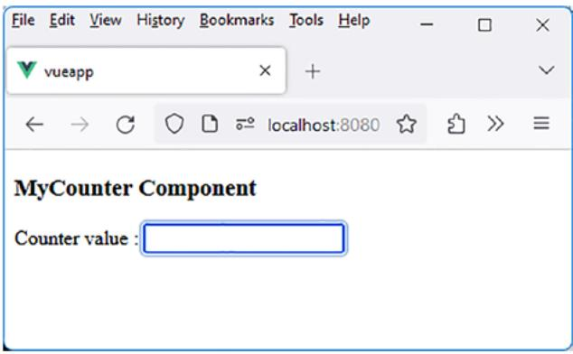

<details>
<summary>text_image</summary>

File Edit View History Bookmarks Tools Help
vueapp
localhost:8080
MyCounter Component
Counter value :
</details>

Figure 5-1. Directive v-focus

We have seen how to insert the new directive directly into the src/ main.js file. However, it is more practical to use another file to avoid modifying, for each added directive, this crucial file for the application’s operation.

## Step 2: Creating the Directive in a Directives File

Let’s now explore another way of defining directives without having to modify the src/main.js file for each new directive added, as done previously.

Create the src/directives.js file that will contain our new directives. This file will be imported into the src/main.js file. Modify the src/main. js file to consider the directives defined in the src/directives.js file.

The src/directives.js file containing the focus directive is as follows:

Focus directive (file src/directives.js)  
```javascript
const focusDirective = {
    mounted(el) {
    el.focus();
    }
};
export default {
    focus : focusDirective,
}
```

The directive is defined as an object, focusDirective, as previously explained. The export default statement is used to convey this functionality to files that utilize it. In this case, it is the src/main.js file that leverages the content of src/directives.js. Here is the description of this file:

Creating the directives defined in src/directives.js (file src/main.js)  
```javascript
import { createApp } from 'vue';
import App from './App.vue';
import directives from "./directives.js"
```

```javascript
const app = createApp(App);
```

```javascript
for (let name in directives) {
    // Creation of the directive name within the application
    app.directive(name, directives[name]);
}
app.mount('#app');
```

The directives.js file is imported, and the obtained directives variable is an object of the form { focus, ... }. We iterate through the properties of this object and use the app.directive(name) method on each property name of the object. This way, only the src/directives.js file will be modified later to add new directives. The src/main.js file will no longer need modification when adding a new directive.

However, it is even more advantageous to place each directive in a separate file, as explained in the following.

## Step 3: Creating the Directive in a Separate File

A variation of the previously created directives file would be to externalize each directive into a separate file. The src/directives.js file would then only need to import the external file associated with each directive.

Let’s create the focus.js file associated with the v-focus directive. Also, create the src/directives directory that will contain files for each directive, each created in a separate file.

Focus directive (file src/directives/focus.js)  
```javascript
const focusDirective = {
    mounted(el) {
    el.focus();
    }
```

```txt
};
```

export default focusDirective;

The directive file must be imported into the src/directives.js file:

**Importing the focus directive (file src/directives.js)**

import focus from "./directives/focus";

```javascript
export default {
    focus,
}
```

If you want to import other directives, you just need to add them to the src/directives.js file in the same manner. The other files, App. vue and MyCounter.vue, remain identical to the previous versions. The functionality remains unchanged.


<details>
<summary>text_image</summary>

File Edit View History Bookmarks Tools Help
vueapp
localhost:8080
MyCounter Component
Counter value :
</details>

Figure 5-2. Directive v-focus in a separate file

To ensure greater maintainability of our Vue.js applications, this latter solution of writing directives in separate files offers better prospects for evolution. Let’s now explore some examples of writing directives using the various possibilities offered by Vue.js.

## Directive v-integers-only Allowing Only Numerical Input

Let’s illustrate our examples by creating a new directive that allows only numerical input in an input field. We will name this directive v-integers-only.

We will use this directive in different forms:

1. v-integers-only: This is the simplest form of the directive. Used in this way, the directive signifies that only digits from 0 to 9 can be used in the input field.  
2. v-integers-only.hexa: When the hexa modifier is used, it means modifying the basic behavior of the directive to also allow hexadecimal characters, that is, the letters from “a” to “f” or “A” to “F”.  
3. v-integers-only.hexa.upper: The upper modifier is used here in addition to the hexa modifier. It means replacing, during input, the characters “a” to “f” with the characters “A” to “F”. Thus, the input “123abc” becomes “123ABC”.

Let’s see how to write these different forms of using the v-integersonly directive.

## Step 1: Directive in the Form v-integers-only

Let’s start by writing the simplest form of the directive. When this directive is present for an input field, it only allows entering digits from 0 to 9 in the field. Any other character, except for movement arrows, is not considered.

Note that we had already created a component that only allowed entering digits in the input field (see Chapter 3). However, we used events to manage the input field, which complicated the writing of the component. Here, we propose moving the event handling to the directive rather than the component.

As a reminder, the MyCounter component was as follows:

MyCounter component (file src/components/MyCounter.vue)  
```vue
<script setup>
import { ref } from "vue"
const count = ref();
const verifyKey = () => {
    const numbers = ["0", "1", "2", "3", "4", "5", "6", "7", "8", "9"];
    const moves = ["Backspace", "ArrowLeft", "ArrowRight", "Delete", "Tab", "Home", "End"];
    let authorized; // Allowed keys in the input field
    authorized = [...numbers, ...moves];
    // If the key is not allowed, do not take it into account.
    // The event object is available here.
    if (!authorized.includes(event.key)) event.preventDefault();
}
</script>
<template>
<h3>MyCounter Component</h3>

Reactive variable count: <input type="text" @keydown="verifyKey()" v-model="count" />
```

Chapter 5 Day 5: Mastering the Creation of Direc tives in Vue.js  
```vue
<br/><br/>
Entered value: <b>{{count}}</b>
</template>
```

The verifyKey() method, placed on the <input> element, filtered keyboard keys to allow only digits or movement and deletion keys.

Let’s create a directive that performs the same treatment. For this purpose, we create the directive file src/directives/integers-only.js, which is then included in the global src/directives.js file.

Directive v-integers-only (file src/directives/integers-only.js)  
```javascript
const integersOnly = {
    mounted(el) {
    el.addEventListener("keydown", (event) => {
    const numbers = ["0", "1", "2", "3", "4", "5", "6", "7", "8", "9"];
    const moves = ["Backspace", "ArrowLeft", "ArrowRight", "Delete", "Tab", "Home", "End"];
    let authorized; // Allowed keys in the input field
    authorized = [...numbers, ...moves];
    // If the key is not allowed, do not take it into account.
    // The event object is available here.
    if (!authorized.includes(event.key)) event.preventDefault();
    });
    },
}
export default integersOnly;
```

We use the addEventListener() method defined in the DOM to listen for the keydown event on the DOM element el passed as a parameter to the mounted(el) method. The rest of the directive’s program is similar to what was done when writing the MyCounter component.

The directive is integrated into the directives file src/directives.js:

Adding the directive to the directives file (file src/directives.js)  
```typescript
import focus from "./directives/focus";
import integersOnly from "./directives/integers-only";
export default {
    focus,
    integersOnly, // It will be used in the form of v-integers-only
}
```

The directive is exported as integersOnly but will be used in the form v-integers-only. Note that using it as v-integersOnly also works but is not recommended.

We use this directive in the MyCounter component, which becomes simpler than before:

Using the v-integers-only directive (file src/components/ MyCounter.vue)  
```vue
<script setup>
import { ref } from "vue"
const count = ref();
</script>
<template>
<h3>MyCounter Component</h3>
```

```vue
Reactive variable count: <input type="text" v-focus v-integers-only v-model="count" />
<br/><br/>
Entered value: <b>{{count}}</b>
</template>
```

We are simultaneously using the two newly created directives: v-focus and v-integers-only.

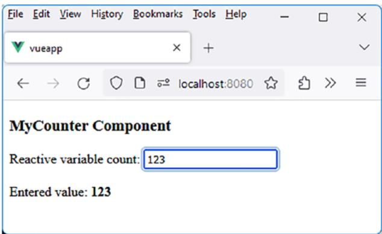

<details>
<summary>text_image</summary>

File Edit View History Bookmarks Tools Help
vueapp
localhost:8080
MyCounter Component
Reactive variable count: 123
Entered value: 123
</details>

Figure 5-3. Using the v-integers-only directive

Only numeric characters and movement arrows are now allowed in the input field.

## Step 2: Directive in the Form v-integers -only.hexa

An improvement to the v-integers-only directive would be to allow input of hexadecimal characters in the field. Instead of writing a new directive (with a new name, e.g., v-integers-hexa-only), Vue.js allows using the same directive name by associating what it calls modifiers. It is sufficient to indicate the name of the modifier used after the directive, separated by a “.”.

The hexa modifier, used in the form v-integers-only.hexa, allows modifying the behavior of the v-integers-only directive to also allow hexadecimal characters in the field, in addition to the digits 0 to 9.

Let’s see how to modify the v-integers-only directive to take into account the hexa modifier when used in the directive.

Each of the lifecycle methods of a directive accepts, as a second argument, the binding parameter, for example, mounted(el, binding). The binding parameter contains additional information about the directive, such as binding.modifiers, which is an object indicating the modifiers used in writing the directive.

Thus, if binding.modifiers.hexa is true, it means that the hexa modifier is used in the directive.

The v-integers-only directive is modified to account for this hexa modifier:

Considering the hexa modifier in the v-integers-only directive (file src/ directives/integers-only.js)  
```javascript
const integersOnly = {
    mounted(el, binding) {
    el.addEventListener("keydown", (event) => {
    const numbers = ["0", "1", "2", "3", "4", "5", "6", "7", "8", "9"];
    const moves = ["Backspace", "ArrowLeft", "ArrowRight", "Delete", "Tab", "Home", "End"];
    const letters = ["a", "b", "c", "d", "e", "f", "A", "B", "C", "D", "E", "F"];
```

let authorized; // Allowed keys in the input field

```javascript
// Allow hexadecimal characters if the hexa modifier is present
if (binding.modifiers.hexa) authorized = [...numbers, ...letters, ...moves];
else authorized = [...numbers, ...moves];

    // If the key is not allowed, do not take it into account.
    // The event object is available here.
    if (!authorized.includes(event.key)) event.
    preventDefault();
    });
},
}

export default integersOnly;
```

The MyCounter component uses this new form of the directive:

Using the v-integers-only.hexa directive (file src/components/ MyCounter.vue)  
```vue
<script setup>
import { ref } from "vue"
const count = ref("");
</script>
<template>
<h3>MyCounter Component</h3>
```

Reactive variable count: <input type="text" v-focus v-integersonly.hexa v-model="count" />

```vue
<br/><br/>
Entered value: <b>{{count}}</b>
</template>
```

We verify that the input field now accepts hexadecimal characters in addition to the digits 0 to 9:

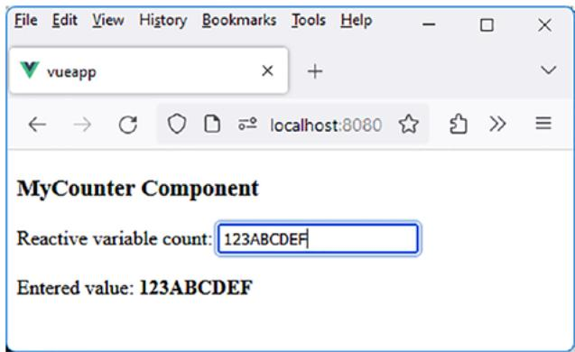

<details>
<summary>text_image</summary>

File Edit View History Bookmarks Tools Help
vueapp
localhost:8080
MyCounter Component
Reactive variable count: 123ABCDEF
Entered value: 123ABCDEF
</details>

Figure 5-4. Considering the hexa modifier in the v-integers-only directive

## Step 3: Directive in the Form v-integers-only.hexa.upper

The upper modifier allows entering characters that will be displayed in uppercase. Thus, the hexadecimal characters “a” to “f” will be transformed and displayed as “A” to “F”.

Let’s modify the MyCounter component to use the upper modifier.

MyCounter component with the upper modifier (file src/components/ MyCounter.vue)

```txt
<script setup>
```

Chapter 5 Day 5: Mastering the Creation of Direc tives in Vue.js  
```vue
import { ref } from "vue"
const count = ref("123abcDEF");
</script>
<template>
<h3>MyCounter Component</h3>
Reactive variable count: <input type="text" v-model="count" v-focus v-integers-only.hexa.upper />
<br/><br/>
Entered value: <b>{{count}}</b>
</template>
```

Note that we positioned the v-model directive first in the input field. Indeed, directives are processed by Vue.js in the order they appear in an element. This allows, first and foremost, to initialize the content of the field with the value of the associated reactive variable, thanks to v-model. The content of the field can then be used by the following directives, which would not be possible if the v-model directive were written at the end.

The v-integers-only directive is modified to account for the upper modifier.

Considering the upper modifier in the directive (file src/directives/ integers-only.js)  
```txt
const integersOnly = {
    mounted(el, binding) {
    if (binding.modifiers.upper) {
    // Convert the displayed field to uppercase with an initial value
    }
}
```

```dart
// (for this to work, the v-model directive must be written before this one in the input field)
el.value = el.value.toUpperCase();
// Simulate an input event to mimic a keyboard keypress
// (necessary for the reactive variable linked to the field to be updated)
el.dispatchEvent(new Event("input"));
}
```

```javascript
el.addEventListener("keydown", (event) => {
    const numbers = ["0", "1", "2", "3", "4", "5", "6", "7", "8", "9"];
    const letters = ["a", "b", "c", "d", "e", "f", "A", "B", "C", "D", "E", "F"];
    const moves = ["Backspace", "ArrowLeft", "ArrowRight", "Delete", "Tab", "Home", "End"];
    let authorized; // Allowed keys in the input field
```

```javascript
// Allow hexadecimal characters if the hexa modifier is present
if (binding.modifiers.hexa) authorized = [...numbers, ...letters, ...moves];
else authorized = [...numbers, ...moves];
```

```javascript
// If the key is not allowed, do not take it into account if (!authorized.includes(event.key)) event.
preventDefault();
```

```txt
// Handle the upper modifier
if (binding.modifiers.upper) {
    // If the key is a hexadecimal letter, convert it to uppercase
```

```typescript
if (letters.includes(event.key)) {
    const start = el.selectionStart;
    const end = el:mm:sselseEnd;
    const text = el.value;

    // Insert the character at the cursor position
    const newText = text.substring(0, start) + event.key + text.substring(end);
    // Update the value of the input field (in uppercase)
    el.value = newText.toUpperCase();
    // Move the cursor after the inserted character
    el.setSelectionRange(start + 1, start + 1);

    // Prevent further processing of the key (as it has already been handled above)
    event.preventDefault();

    // Simulate an input event to mimic a keyboard keypress
    // (necessary for the reactive variable linked to the field to be updated)
    el.dispatchEvent(new Event("input"));
    }
    }
    });
},
export default integersOnly;
```

The upper modifier complicates the writing of the directive! Indeed, we have to handle the insertion of the pressed key into the field ourselves to display it in uppercase.

## Directive v-max-value Limiting the Maximum Value in an Input Field

We want to improve the management of the previous input field by limiting the value entered in the field, using a directive called v-max-value.

We will use this directive in one of the following forms:

1. v-max-value: Used in this form, the maximum value is considered to be 100. Beyond that, the input field turns red.  
2. v-max-value="max": The max value refers to a max variable (reactive or not) defined in the program. If this value is exceeded, the input field turns red.  
3. v-max-value.bold="max": When present in the directive, the bold modifier additionally makes the value entered in the input field bold if the max value is exceeded.

Let’s see how to write these different forms of using the v-max-value directive.

## Step 1: Directive in the Form v-max-value

The first form of the directive is the simplest. It assumes that the maximum value of the field is a fixed value of 100.

The MyCounter component that uses this directive is as follows:

Using the v-max-value directive (file src/components/MyCounter.vue)

```typescript
<script setup>  
import { ref } from "vue"  
const count = ref("");
```

Chapter 5 Day 5: Mastering the Creation of Direc tives in Vue.js  
```vue
</script>
<template>
<h3>MyCounter Component</h3>
Reactive variable count: <input type="text" v-model="count" v-integers-only v-focus v-max-value />
<br/><br/>
Entered value: <b>{{count}}</b>
</template>
```

The order of directive usage is crucial. The v-max-value directive is placed after the v-model directive: indeed, the v-model directive initializes the input field, which the v-max-value directive can then read.

The file for the v-max-value directive is src/directives/maxvalue.js.

v-max-value directive (file src/directives/max-value.js)  
```javascript
const maxValue = {
    mounted(el) {
    const value = el.value || 0; // Value in the field
    if (value > 100) el.style.color = "red";
    else el.style.color = "";
    },
    updated(el) {
    const value = el.value || 0; // Value in the field
    if (value > 100) el.style.color = "red";
    else el.style.color = "";
    },
}
export default maxValue;
```

We are utilizing the mounted() and updated() lifecycle methods. Specifically, during the mounted() phase, it is imperative to validate that the value transmitted for the input field initialization does not exceed the value of 100. This validation must also be conducted during each update of the field within the updated() method.

The procedures within these two methods are identical. Consequently, it is plausible to consolidate the processing into a function named treatment(), invoked within both mounted() and updated().

Other form of the directive (file src/directives/max-value.js)  
```javascript
const treatment = (el) => {
    const value = el.value || 0; // Value in the field
    if (value > 100) el.style.color = "red";
    else el.style.color = "";
}

const maxValue = {
    mounted(el) {
    treatment(el);
    },
    updated(el) {
    treatment(el);
    },
}

export default maxValue;
```

The v-max-value directive is inserted into the src/directives.js file:

File src/directives.js  
```typescript
import focus from "./directives/focus";
import integersOnly from "./directives/integers-only";
import maxValue from "./directives/max-value";
```

Chapter 5 Day 5: Mastering the Creation of Direc tives in Vue.js  
```txt
export default {
    focus,
    integersOnly,
    maxValue,
}
```

Let us verify that this is functional. As soon as the input value exceeds 100, the input field should change its color to red.

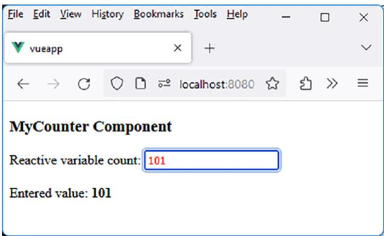

<details>
<summary>text_image</summary>

File Edit View History Bookmarks Tools Help
vueapp
localhost:8080
MyCounter Component
Reactive variable count: 101
Entered value: 101
</details>

Figure 5-5. v-max-value directive

## Step 2: Directive in the Form v-max-value=“max”

Instead of setting the field’s limit to a fixed value (here 100), it is also possible to transmit this value within the directive (after the “=” sign).

The max value indicated here corresponds to the value of a variable (reactive or nonreactive) initialized earlier in the program.

The MyCounter component utilizing this form of the directive becomes the following:

MyCounter component (file src/components/MyCounter.vue)  
```vue
<script setup>
import { ref } from "vue"
const count = ref("201");
const max = 200;
</script>
<template>
<h3>MyCounter Component</h3>
Reactive variable count: <input type="text" v-model="count" v-integers-only v-focus v-max-value="max" />
<br/><br/>
Max value: <b>{{max}}</b>
<br/><br/>
Entered value: <b>{{count}}</b>
</template>
```

The maximum value of the field is initialized here to the value of 200. The v-max-value directive is modified to handle the value assigned to it.

v-max-value directive (file src/directives/max-value.js)  
```txt
const treatment = (el, binding) => {
    const maxValue = binding.value || 100; // 100 by default
    const value = el.value || 0; // Value in the field
    if (value > maxValue) el.style.color = "red";
    else el.style.color = "";
}
```

Chapter 5 Day 5: Mastering the Creation of Direc tives in Vue.js  
```javascript
const maxValue = {
    mounted(el, binding) {
    treatment(el, binding);
    },
    updated(el, binding) {
    treatment(el, binding);
    },
}
export default maxValue;
```

The value assigned to the directive in the template is retrieved using binding.value. If the value is not specified, it defaults to 100 as before.

The input field will turn red as soon as the value of 200 is exceeded in the input field (here, when it reaches 201):

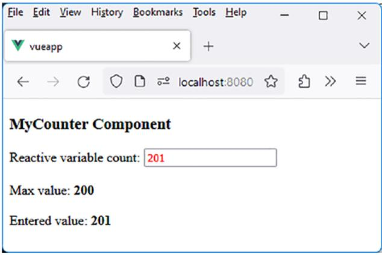

<details>
<summary>text_image</summary>

File Edit View History Bookmarks Tools Help
vueapp
localhost:8080
MyCounter Component
Reactive variable count: 201
Max value: 200
Entered value: 201
</details>

Figure 5-6. v-max-value=“max” Directive

## Step 3: Directive in the Form v-max-value. bold=“max”

This form of the directive is similar to the previous one, but we integrate the bold modifier, which changes the appearance of the input field (making it bold) when the field value exceeds the maximum allowed value:

If the bold modifier is absent from the directive, the behavior is similar to that of the previous example.  
• If the bold modifier is present in the directive, the input field is made bold when the maximum value is exceeded. The previous behavior of the directive is also retained (the input field turns red if the value is exceeded).

Let’s see how to use this new form of the directive in the MyCounter component:

MyCounter component (file src/components/MyCounter.vue)  
```vue
<script setup>
import { ref } from "vue"
const count = ref("201");
const max = 200;
</script>
<template>
<h3>MyCounter Component</h3>
Reactive variable count: <input type="text" v-model="count" v-integers-only v-focus v-max-value.bold="max" />
<br/><br/>
```

Chapter 5 Day 5: Mastering the Creation of Direc tives in Vue.js  
```txt
Max value: <b>{{max}}</b>
<br/><br/>
Entered value: <b>{{count}}</b>
</template>
```

The directive is modified to incorporate the consideration of the bold modifier:

Bold modifier in the v-max-value directive (file src/directives/maxvalue.js)  
```javascript
const treatment = (el, binding) => {
    const maxValue = binding.value || 100; // 100 by default
    const value = el.value || 0; // Value in the field
    const bold = binding.modifiers.bold;
    if (value > maxValue) {
    el.style.color = "red";
    if (bold) {
    el.style.fontWeight = "bold";
    el.style.fontFamily = "arial";
    }
    }
    else {
    el.style.color = "";
    el.style.fontWeight = ""; // Removal of "bold"
    el.style.fontFamily = ""; // Removal of "arial"
    }
}
const maxValue = {
    mounted(el, binding) {
    treatment(el, binding);
},
```

```javascript
updated(el, binding) {
    treatment(el, binding);
},
export default maxValue;
```

When the maximum value is exceeded, we set the font to “bold” and also modify it to “Arial” to make the change even more noticeable on the screen.

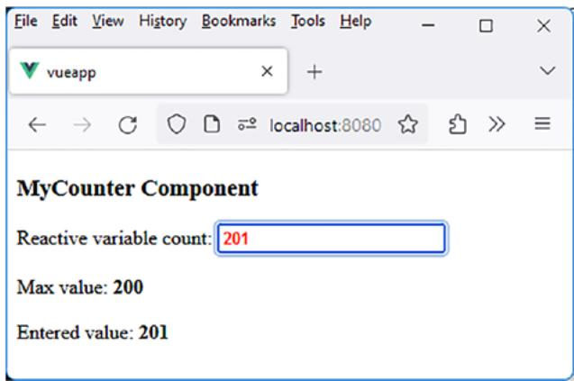

<details>
<summary>text_image</summary>

File Edit View History Bookmarks Tools Help
vueapp
localhost:8080
MyCounter Component
Reactive variable count: 201
Max value: 200
Entered value: 201
</details>

Figure 5-7. Utilization of the “bold” modifier in the directive

The maximum value of 200 having been exceeded, the input field has turned red and bold.

## v-focus Directive for Giving Focus

We have previously created this directive in the preceding pages, using it in the form v-focus. We will use the v-focus directive in one of the following forms:

1. v-focus: This simplest form of the directive gives focus to the input field on which the directive is applied. We have used this form previously.

2. v-focus:color="color": This form of the directive allows specifying a value for the color argument of the directive. The input field gains focus, and the text color becomes the one indicated in the color variable.

3. v-focus:backcolor="bcolor": This form of the directive allows indicating a value for the backcolor argument of the directive. The input field gains focus, and the background color of the text becomes the one indicated in the bcolor variable.

4. v-focus:colors="colors": This form of the directive allows specifying in the colors variable, in the form { color, backgroundcolor }, the text and background colors of the input field when it gains focus.

To enable us to learn additional aspects of directives, we wish to explain here the use of arguments in directives.

## Step 1: What Is an Argument in a Directive?

An argument is used after the directive’s name, separated by the “:”

symbol. For example, we write v-focus:color="'blue'", to indicate that the text color should be blue when the element has focus.

In this case, we say that the v-focus directive has an argument named color, with its value set to "blue".

What is the difference between "'blue'" and "blue"? Note that here we specify the value as "'blue'" and not just "blue". Indeed, if we write it as "blue", it refers to a variable (reactive or nonreactive) named blue, while we intend to assign the string "blue", hence the notation "'blue'". What is written within the string “” must be a JavaScript expression, which is the case with 'blue'.

Why use an argument in a directive? One might think that we could simply write the directive as v-focus="'blue'". However, this is less precise than writing v-focus:color="'blue'" because we might also want to write v-focus:backgroundcolor="'yellow'" to change the background color in that case.

The argument’s name (color, backgroundcolor) helps specify the type of value indicated in the directive, especially when multiple types of values are possible (color, backgroundcolor).

What is the difference between a modifier and an argument? A modifier specifies a behavior in a directive, while an argument provides a value (for that argument). We use an argument to indicate a value and a modifier to specify a specific behavior (making it bold, uppercase, etc.).

Is an argument necessary? If the directive’s value type is unique (e.g., always a maximum value, a color, etc.), there is no need to use an argument. In this case, it suffices to indicate a value to the directive without specifying the argument to which the value corresponds. The argument in a directive serves only to specify what the value corresponds to (color, backgroundcolor).

Now that we have clarified that, let’s use this information to enhance the v-focus directive with new functionalities.

## Step 2: Directive in the Form v-focus

This form of the directive is the one we previously wrote. We rewrite it here to show how it will evolve based on the arguments used later.

The MyCounter component uses the v-focus directive:

Utilization of the v-focus directive in the MyCounter component (file src/components/MyCounter.vue)  
```vue
<script setup>
import { ref } from "vue"
const count = ref("12345");
</script>
<template>
<h3>MyCounter Component</h3>
Reactive variable count: <input type="text" v-model="count" v-focus />
<br/><br/>
Entered value: <b>{{count}}</b>
</template>
```

The v-focus directive is described as follows:

v-focus directive (file src/directives/focus.js)  
```javascript
const focusDirective = {
    mounted(el) {
    el.focus();
    },
};
export default focusDirective;
```

When the MyCounter component is displayed, the input field immediately gains focus.

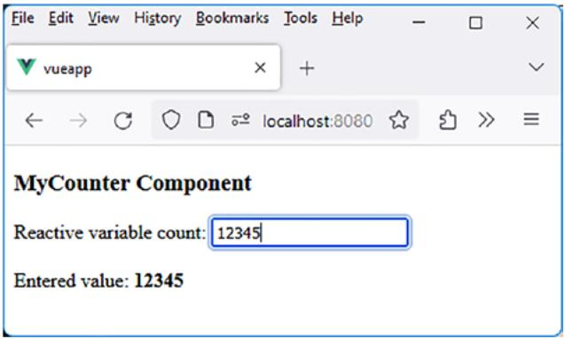

<details>
<summary>text_image</summary>

File Edit View History Bookmarks Tools Help
vueapp
localhost:8080
MyCounter Component
Reactive variable count: 12345
Entered value: 12345
</details>

Figure 5-8. The input field gains focus

## Step 3: Directive in the Form v-focus:color=“color”

This form of the directive allows specifying a value for the directive. As this value is a color, an additional color argument is used to specify the type of the value. Later, we will see that we can also use the arguments backgroundcolor and colors to indicate other types of values, hence the use of arguments to specify the type of value used.

The MyCounter component using this form of the directive is as follows:

MyCounter component (file src/components/MyCounter.vue)  
```vue
<script setup>
import { ref } from "vue"
const count = ref("12345");
const color = "cyan";
</script>
<template>
```

Chapter 5 Day 5: Mastering the Creation of Direc tives in Vue.js  
```txt
<h3>MyCounter Component</h3>

Reactive variable count: <input type="text" v-model="count"
    v-focus:color="color" />

<br/><br/>
Entered value: <b>{{count}}</b>

</template>
```

The directive is specified here in the form v-focus:color="color" because color is a variable defined in the program. If we were to directly specify a value in the directive (without using a variable name), we would write it in the form v-focus:color="'cyan'" as explained earlier.

The directive file is modified to accommodate this new argument:

v-focus directive with the color argument (file src/directives/focus.js)  
```javascript
const focusDirective = {
    mounted(el, binding) {
    el.focus();
    const arg = binding.arg;
    const value = binding.value;
    if (arg == "color") el.style.color = value;
    }
};
export default focusDirective;
```

The input field gains focus, and the input field’s color changes to “cyan”.

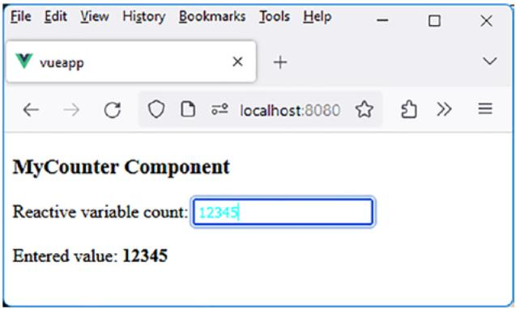

<details>
<summary>text_image</summary>

File Edit View History Bookmarks Tools Help
vueapp
localhost:8080
MyCounter Component
Reactive variable count: 12345
Entered value: 12345
</details>

Figure 5-9. Input field with focus and cyan color

Note in this example that the input field retains its new color even if the input field loses focus. It would be necessary to restore the previous color of the input field when it loses focus.

To achieve this, we need to handle the focus and blur events on the input field. Let’s modify the directive for that purpose.

Handling the focus and blur events in the v-focus directive (file src/ directives/focus.js)  
```javascript
const focusDirective = {
    mounted(el, binding) {
    const arg = binding.arg;
    const value = binding.value;
    // Position the handling of the focus and blur events
    el.addEventListener("focus", () => {
    if (arg == "color") el.style.color = value;
    });
    el.addEventListener("blur", () => {
    if (arg == "color") el.style.color = "";
    }
}
```

```javascript
});
// and then give focus to the input field
el.focus();
}
};
export default focusDirective;
```

We modify the color of the input field upon entering the field (focus event) and then restore the initial color upon leaving the field (blur event). Additionally, we give focus to the input field only after positioning the event handlers; otherwise, they would not be considered during the initial display of the component.

Let’s verify that this is functional. Upon launching the program, the input field gains focus, and the color of the input field is modified:

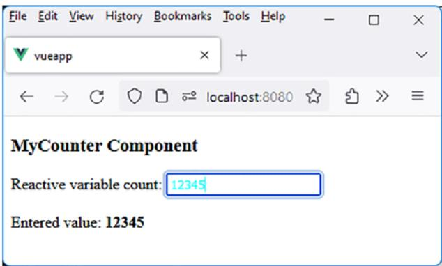

<details>
<summary>text_image</summary>

File Edit View History Bookmarks Tools Help
vueapp
localhost:8080
MyCounter Component
Reactive variable count: 12345
Entered value: 12345
</details>

Figure 5-10. Gaining focus in the input field

Then click outside the input field. The color of the input field is removed.

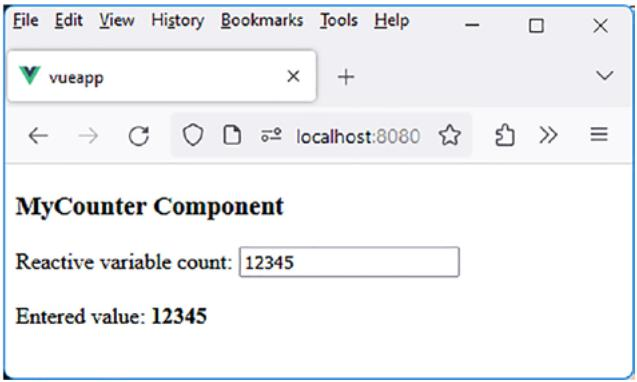

<details>
<summary>text_image</summary>

File Edit View History Bookmarks Tools Help
vueapp
localhost:8080
MyCounter Component
Reactive variable count: 12345
Entered value: 12345
</details>

Figure 5-11. The input field has lost focus

This form of the v-focus directive, using the focus and blur events, will be retained in the following examples.

## Step 4: Directive in the Form v-focus:backgroundcolor=“bcolor”

Another form of the v-focus directive uses the backgroundcolor argument to specify a background color in the directive.

The modifications to the MyCounter component and the directive are similar to those previously made to use the color argument.

The MyCounter component using the backgroundcolor argument in the v-focus directive becomes the following:

MyCounter component (file src/components/MyCounter.vue)  
```vue
<script setup>  
import { ref } from "vue"  
const count = ref("12345");  
const color = "cyan";  
</script>
```

Chapter 5 Day 5: Mastering the Creation of Direc tives in Vue.js  
```vue
<template>
<h3>MyCounter Component</h3>

Reactive variable count: <input type="text" v-model="count"
    v-focus:backgroundcolor="color" />

<br/><br/>
Entered value: <b>{{count}}</b>

</template>
```

The v-focus directive implementing the backgroundcolor argument becomes the following:

v-focus directive using the backgroundcolor argument (file src/ directives/focus.js)  
```javascript
const focusDirective = {
    mounted(el, binding) {
    const arg = binding.arg;
    const value = binding.value;
    // Position the handling of the focus and blur events
    el.addEventListener("focus", () => {
    if (arg == "color") el.style.color = value;
    if (arg == "backgroundcolor") el.style.backgroundColor = value;
    });
    el.addEventListener("blur", () => {
    if (arg == "color") el.style.color = "";
    if (arg == "backgroundcolor") el.style.backgroundColor = "";
    });
    }
);
```

```javascript
// and then give focus to the input field
el.focus();
}
};
export default focusDirective;
```

We have simply added the handling of the backgroundcolor argument in a similar fashion to that of the color argument.

The MyCounter component is now displayed:

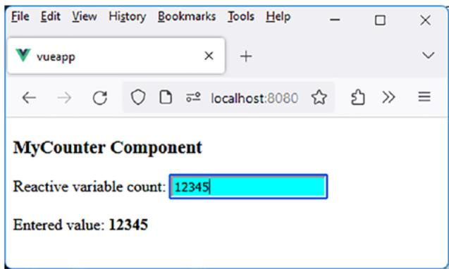

<details>
<summary>text_image</summary>

File Edit View History Bookmarks Tools Help
vueapp
localhost:8080
MyCounter Component
Reactive variable count: 12345
Entered value: 12345
</details>

Figure 5-12. Utilization of the backgroundcolor argument in the v-focus directive

## Step 5: Directive in the Form v-focus:colors=“colors”

The v-focus directive now has both the color and backgroundcolor arguments. However, only one of the two can be specified when using the directive.

Hence, the creation of the new colors argument, which allows specifying the values of both arguments in the form of an object { color, backgroundcolor }.

The MyCounter component becomes the following:

MyCounter component (file src/components/MyCounter.vue)  
```vue
<script setup>
import { ref } from "vue"
const count = ref("12345");
const colors = { color:"cyan", backgroundcolor:"black" };
</script>
<template>
<h3>MyCounter Component</h3>
Reactive variable count: <input type="text" v-model="count" v-focus:colors="colors" />
<br/><br/>
Entered value: <b>{{count}}</b>
</template>
```

The v-focus directive is modified to use this new argument, in addition to the two others:

v-focus directive (file src/directives/focus.js)  
```javascript
const focusDirective = {
    mounted(el, binding) {
    const arg = binding.arg;
    const value = binding.value;
    // Position the handling of the focus and blur events
    el.addEventListener("focus", () => {
    if (arg == "color") el.style.color = value;
```

```javascript
if (arg == "backgroundcolor") el.style.backgroundColor = value;
if (arg == "colors") {
    el.style.color = value.color;
    el.style.backgroundColor = value.backgroundColor;
}
});
el.addEventListener("blur", () => {
    if (arg == "color") el.style.color = "";
    if (arg == "backgroundcolor") el.style.backgroundColor = "";
    if (arg == "colors") {
    el.style.color = "";
    el.style.backgroundColor = "";
    }
});
// and then give focus to the input field
el.focus();
};
export default focusDirective;
```

The MyCounter component now takes into account a new text and background color for the input field:

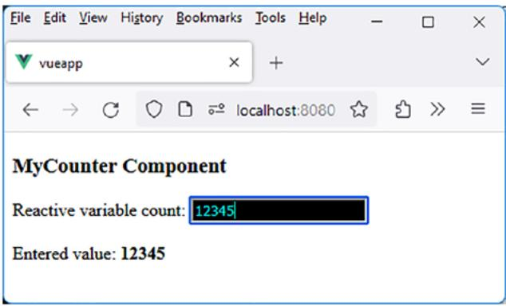

<details>
<summary>text_image</summary>

File Edit View History Bookmarks Tools Help
vueapp
localhost:8080
MyCounter Component
Reactive variable count: 12345
Entered value: 12345
</details>

Figure 5-13. Utilization of the colors argument in the v-focus directive

## v-clearable Directive for Adding a Clear Button to the Input Field

Let’s now demonstrate a new directive that adds a Clear button after an input field, allowing the user to clear the input field’s content. The v-clearable directive inserts the button directly after the input field.

The MyCounter component using the directive would be as follows:

MyCounter component using the v-clearable directive (file src/ components/MyCounter.vue)

```vue
<script setup>
import { ref } from "vue"
const count = ref("Text to be cleared");
</script>
<template>
<h3>MyCounter Component</h3>
```

Reactive variable count: <input type="text" v-model="count" v-clearable v-focus />

<br/><br/>

Entered value: $< b > \{ \{ \mathsf { c o u n t } \} \} < / \mathsf { b } >$

</template>

We display an input field with the v-clearable directive in the template. When the directive v-clearable will be written, the component will appear as follows:

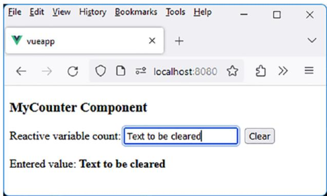

<details>
<summary>text_image</summary>

File Edit View History Bookmarks Tools Help
vueapp
localhost:8080
MyCounter Component
Reactive variable count: Text to be cleared
Clear
Entered value: Text to be cleared
</details>

Figure 5-14. Input field with a Clear button

Clicking the Clear button clears the content of the input field:

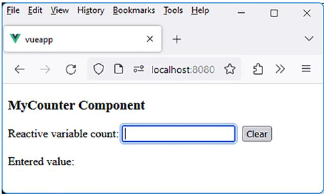

<details>
<summary>text_image</summary>

File Edit View History Bookmarks Tools Help
vueapp
localhost:8080
MyCounter Component
Reactive variable count:
Clear
Entered value:
</details>

Figure 5-15. The input field has been cleared

The v-clearable directive is written in the file src/directives/ clearable.js:

v-clearable directive (file src/directives/clearable.js)  
```javascript
const clearable = {
    mounted(el) {
    const clearButton = document.createElement("button");
    clearButton.innerHTML = "Clear";
    clearButton.style = "position:relative; left:10px";

    // Handle the click on the button (clear the content of the input field).
    clearButton.addEventListener("click", () => {
    // Clear the content of the input field.
    el.value = "";
    // Simulate an input event to mimic a keyboard key press
    // (mandatory to ensure that the reactive variable linked to the input field is updated)
    el.dispatchEvent(new Event("input"));
    // Give focus to the input field
    el.focus();
    }
}
```

```javascript
});
// Insert the button after the input field
el.parentNode.insertBefore(clearButton, el.nextSibling);
};
export default clearable;
```

The v-clearable directive is then inserted into the file src/ directives.js:

File src/directives.js  
```javascript
import focus from "./directives/focus";
import integersOnly from "./directives/integers-only";
import maxValue from "./directives/max-value";
import clearable from "./directives/clearable";
export default {
    focus,
    integersOnly,
    maxValue,
    clearable,
}
```

The v-clearable directive is now ready for being used.

## v-timer Directive for Displaying Real-Time Clock

The v-timer directive replaces the content of the element it is applied to with the current time in the format HH:MM:SS. It has several derived forms:

1. v-timer: This is the simplest form of the directive. It displays the current time in real time, in the format HH:MM:SS.  
2. v-timer.ms: The ms modifier of the directive allows displaying tenths of a second after the seconds.  
3. v-timer.chrono: The chrono modifier starts a stopwatch in the format HH:MM:SS starting from 00:00:00. It increments every second, or every tenth of a second if the ms modifier is present.

Let’s see how to implement these different forms of the v-timer directive.

## Step 1: Directive in the Form v-timer

The MyCounter component using this directive can be written as follows:

Utilization of the v-timer directive (file src/components/ MyCounter.vue)

```erb
<script setup>
</script>
<template>
<h3>MyCounter Component</h3>
```

It is <span v-timer />

```vue
</template>
```

The content of the <span v-timer> element will be replaced by the current time in the format HH:MM:SS.

The v-timer directive is created in the file src/directives/timer.js:

v-timer directive (file src/directives/timer.js)  
```javascript
const timer = {
    mounted(el) {
    // Initialization of the displayed time
    // (allows it to be displayed immediately without waiting for a second)
    let time = getCurrentTime();
    el.innerHTML = time;
    setInterval(() => {
    // Then incrementing the time every second
    let time = getCurrentTime();
    el.innerHTML = time;
    }, 1000); // Every 1000 milliseconds (1 second).
    },
}

function getCurrentTime() {
    // Return the current time in the format HH:MM:SS
    const now = new Date();
    const hours = now.getHours().toString().padStart(2, '0');
    const minutes = now.getMinutes().toString().padStart(2, '0');
    const seconds = now.getSeconds().toString().padStart(2, '0');
    return `${hours}:${minutes}:${seconds Las...
}

export default timer;
```

The getCurrentTime() method returns the current time in the format HH:MM:SS. This time is then displayed in the el element using the v-timer directive. The setInterval(callback) method, with the processing function called every second (1000 milliseconds), refreshes the displayed time.

To function, the directive must be included in the src/directives.

js file:  
Insertion of the directive (file src/directives.js)  
```javascript
import focus from "./directives/focus";
import integersOnly from "./directives/integers-only";
import maxValue from "./directives/max-value";
import clearable from "./directives/clearable";
import timer from "./directives/timer";

export default {
    focus,
    integersOnly,
    maxValue,
    clearable,
    timer,
}
```

Let’s verify that the time is incremented every second:

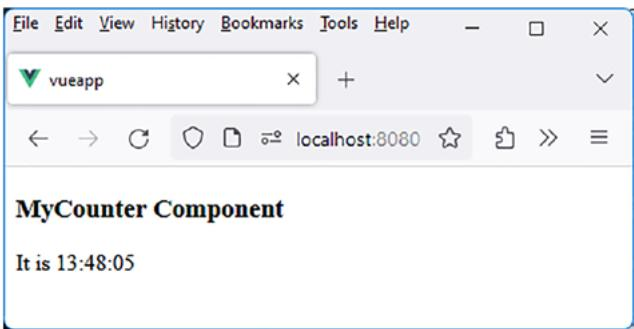

<details>
<summary>text_image</summary>

File Edit View History Bookmarks Tools Help
vueapp
localhost:8080
MyCounter Component
It is 13:48:05
</details>

Figure 5-16. Displaying the time with the v-timer directive

## Step 2: Directive in the Form v-timer.ms

Another form of the directive allows for more precision by also displaying tenths of a second. For this, the ms modifier is used following the v-timer directive.

The v-timer directive is modified:

Using the ms modifier in the v-timer directive (file src/directives/ timer.js)  
```javascript
const timer = {
    mounted(el, binding) {
    const ms = binding.modifiers.ms;
    let time = getCurrentTime(ms);
    el.innerHTML = time;
    setInterval(() => {
    let time = getCurrentTime(ms);
    el.innerHTML = time;
    }, 100);
    },
}

function getCurrentTime(ms = false) {
    const now = new Date();
    const hours = now.getHours().toString().padStart(2, '0');
    const minutes = now.getMinutes().toString().padStart(2, '0');
    const seconds = now.getSeconds().toString().padStart(2, '0');
    let formattedTime = `${hours}:${minutes}:${seconds Lases};
    if (ms) {
    const milliseconds = now.getMilliseconds().toString().
    slice(0, 1); // Obtaining tenths of a second
    formattedTime += `.${milliseconds Lases};
    }
}
```

Chapter 5 Day 5: Mastering the Creation of Direc tives in Vue.js  
```javascript
return formattedTime;
}
export default timer;
```

The getCurrentTime() function is modified to consider the optional ms parameter, indicating to format the time by adding tenths of a second at the end. The ms modifier is taken into account in the v-timer directive, through binding.modifiers.ms, which is true if the ms modifier is present, false otherwise.

Let’s use both forms of the v-timer directive in the MyCounter component:

MyCounter component (file src/components/MyCounter.vue)  
```erb
<script setup>
</script>
<template>
<h3>MyCounter Component</h3>
```

```vue
It is <span v-timer />
<br>
It is <span v-timer.ms /> more precisely
</template>
```

The displayed result is as follows:

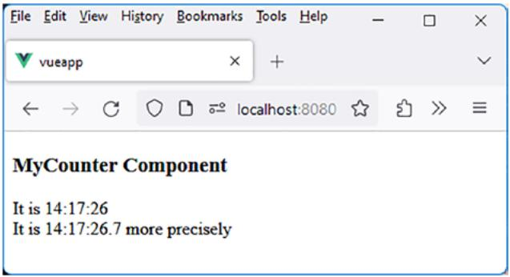

<details>
<summary>text_image</summary>

File Edit View History Bookmarks Tools Help
vueapp
localhost:8080
MyCounter Component
It is 14:17:26
It is 14:17:26.7 more precisely
</details>

Figure 5-17. Using both forms of the v-timer directive

The first timer displays the time every second, while the second displays the time every tenth of a second.

## Step 3: Directive in the Form v-timer.chrono

The chrono modifier in the v-timer directive allows immediately starting a stopwatch.

The MyCounter component file is modified to display it:

Display a stopwatch (file src/components/MyCounter.vue)  
```html
<script setup>
</script>
<template>
<h3>MyCounter Component</h3>
It is <span v-timer />
<br>
It is <span v-timer.ms /> more precisely
<br>
<br>
```

Elapsed time <span v-timer.chrono />  
```html
<br> Elapsed time <span v-timer.chrono.ms /> more precisely
```

```vue
</template>
```

The ms modifier can be used with the chrono modifier to add more precision to the elapsed time. The processing of the chrono modifier is inserted into the v-timer directive file:

Using the chrono modifier in the v-timer directive (file src/directives/ timer.js)  
```javascript
const timer = {
    mounted(el, binding) {
    const ms = binding modifiers.ms;
    const chrono = binding modifiers.chrono;

    // Initialization of the clock or stopwatch.
    if (!chrono) {
    let time = getCurrentTime(ms);
    el.innerHTML = time;
    }
    else {
    if (!ms) el.innerHTML = "00:00:00";
    else el.innerHTML = "00:00:00.0";
    }

    setInterval(() => {
    if (!chrono) {
    let time = getCurrentTime(ms);
    el.innerHTML = time;
    }
    else {
    const chronoTime = getChronoTime(ms);
    }
}
```

```javascript
el.innerHTML = chronoTime;
},
}, 100);
},
}

function getCurrentTime(ms = false) {
    const now = new Date();
    const hours = now.getHours().toString().padStart(2, '0');
    const minutes = now.getMinutes().toString().padStart(2, '0');
    const seconds = now.getSeconds().toString().padStart(2, '0');
    let formattedTime = `${hours}:{minutes}:{seconds Lasars}
    if (ms) {
    const milliseconds = now.getMilliseconds().toString().
    slice(0, 1); // Obtaining tenths of a second
    formattedTime += `.${milliseconds}`;
    }
    return formattedTime;
}
```

**let startChronoTime = new Date(); // Starting time of the stopwatch**

```javascript
function getChronoTime(ms = false) {
    const now = new Date();
    const elapsedMilliseconds = now.getTime() - startChronoTime.
    getTime();

    const hours = Math.floor(elapsedMilliseconds / (3600 * 1000));
    const remainingMilliseconds1 = elapsedMilliseconds % (3600 * 1000);
```

Chapter 5 Day 5: Mastering the Creation of Direc tives in Vue.js  
```javascript
const minutes = Math.floor(remainingMilliseconds1 / (60 * 1000));
const remainingMilliseconds2 = remainingMilliseconds1 % (60 * 1000);

const seconds = Math.floor(remainingMilliseconds2 / 1000);

let formattedTime = `${hours.toString().padStart(2, '0')}:{minutes.toString().padStart(2, '0')}:{seconds.toString().padStart(2, '0')}';

if (ms) {
    const milliseconds = Math.floor(remainingMilliseconds2 % 1000);
    const tenthsOfSecond = Math.floor((milliseconds % 1000) / 100);
    formattedTime += `.${tenthsOfSecond.toString()}`;
}

return formattedTime;
}

export default timer;
```

Following the same principle as the getCurrentTime() function, we create the getChronoTime() function, which allows retrieving the elapsed time in the format HH:MM:SS. After a certain time, the display becomes the following:

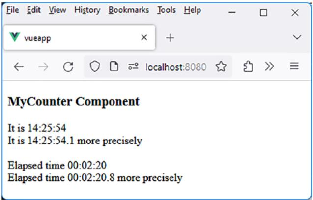

<details>
<summary>text_image</summary>

File Edit View History Bookmarks Tools Help
vueapp
localhost:8080
MyCounter Component
It is 14:25:54
It is 14:25:54.1 more precisely
Elapsed time 00:02:20
Elapsed time 00:02:20.8 more precisely
</details>

Figure 5-18. Displays of the v-timer directive

## Conclusion

We have explained how to create new directives in Vue.js, simplifying the code of our Vue.js components. Thanks to arguments and modifiers, Vue. js directives offer incredible functionalities that allow simple and intuitive use in components.