# Day 6: Mastering the Creation of Composables in Vue.js

As seen in the previous chapter, creating new directives makes it easier to manipulate the HTML elements on which the directives are used. In this chapter, we will explore composables. Composables are also known as composition functions.

Composables defined in our Vue.js components are used to encapsulate application logic in the form of reusable functions. Thus, they are oriented toward internal component logic and data management.

## Why Create Composables?

Creating composables in a Vue.js application is useful for several reasons, as described in the following:

1. Reusability of Code: Composables allow grouping functionalities into reusable modules. This means writing the functionality once and using it in multiple components of the application without repeating it.  
2. State Management: Composables are particularly useful for managing the application state. State management is encapsulated in a composition function, making data management more consistent and predictable. It also facilitates handling the global state of the application.  
3. Ease of Testing: Composables are easy to test in isolation.  
4. Scalability: Composables promote the scalability of the application. New features can be added or existing logic modified in a composition function without having to modify many components.

Composables are a powerful tool for improving the structure, maintainability, and code reuse in Vue.js.

## Differences Between Composables and Directives

Creating composables allows us to write Vue.js component code better, much like directives also allow. However, directives and composables are not used in the same way.

Directives help write HTML code within the <template> section of components, simplifying this code to the maximum.

Composables help write JavaScript code within the <script setup> section of the component, allowing the use of functionalities defined in the functions called composables.

Therefore, with the ability to write new directives and create composables, Vue.js enables us to write the entire code that creates Vue.js components more effectively.

## Creating a Vue.js Composable

A Vue.js composable is a JavaScript function. Like any function, it may have optional input parameters and may return a result.

A composable is meant to provide a service. We create a composable when we have identified a service to provide in our component. This service may also be used in other components, making our composable even more useful.

Because a composable is meant to provide a service, it is customary to start its name with the word "use", followed by the name given to the composable.

For example:

1. useCounter(): This composable manages actions in a component like MyCounter (incrementing, decrementing the counter).  
2. useFetch(): This composable performs an HTTP request and retrieves information from a remote server.

Thus, to create a composable, you must first ask the following questions:

1. What are its parameters?  
2. What data or functionalities does it return?

These questions help identify the parameters and return of the JavaScript function associated with the composable. These are the questions to ask whenever you want to create a new composable.

As a composable can be used in several components, tradition dictates grouping composables in the composables directory within the src directory.

Let’s see, with a simple example, how to create the useCounter() composable to manage the MyCounter component.

## Step 1: Creating the useCounter( ) Composable

The useCounter() composable manages the increment and decrement of the counter associated with the MyCounter component.

Without using composables, the MyCounter component we wrote in Chapter 1 was as follows:

MyCounter component (file src/components/MyCounter.vue)  
```vue
<script setup>
import { ref } from 'vue';
const count = ref(0);
const increment = () => {
    count.value++;
}
const decrement = () => {
    count.value--;
}
</script>
```

```vue
<template>
<h3>MyCounter Component</h3>
Reactive variable count : <b>{{ count }}</b>
<br /><br />
<button @click="increment">count+1</button>
&nbsp;
<button @click="decrement">count-1</button>
</template>
```

The increment() and decrement() functions of the counter are defined in the <script setup> section of the component. They are then used in the <template> section of the component.

The idea behind composables is to externalize data management into external functions called composables. These composable functions will then be available and used in components that require them.

In the case of the MyCounter component, we externalize the management of the count variable, including its increment and decrement, into a composable named useCounter().

Let’s examine the parameters and possible returns of the useCounter() composable. Thus, the useCounter() composable:

1. Will have an init parameter, which is the initialization value of the counter.  
2. Will return as data the current value count of the counter (managed within the composable, hence made available as a return value), and the functions increment() and decrement() allowing to increment or decrement the counter value. These elements will be accessible in the component that uses this composable.

Let’s write the MyCounter component that uses the useCounter() composable.

Usage of the useCounter() composable in the MyCounter component (file src/components/MyCounter.vue)

```txt
<script setup>
```

import useCounter from "../composables/useCounter.js"

const [count, increment, decrement] = useCounter(0); // 0 = Initialization of the counter

```vue
</script>

<template>

<h3>MyCounter Component</h3>

Reactive variable count : <b>{{ count }}</b>
<br /><br />

<button @click="increment">count+1</button>
&nbsp;
<button @click="decrement">count-1</button>
</template>
```

The <script setup> section of the MyCounter component has now become simpler, thanks to the use of the useCounter() composable:

1. The useCounter() composable is first imported into the component.  
2. The useCounter(0) function of the composable is called with the initialization value 0 and returns, in the form of an array, the values [count, increment, decrement], which, respectively, correspond to the current value of the counter and the increment() and decrement() functions of the counter.

The count variable is then used in the template of the component, as well as the increment() and decrement() functions, which are called when clicking the “count+1” or “count-1” button of the component.

The useCounter() composable is created in the useCounter.js file in the src/composables directory. It is written as follows:

useCounter() composable (file src/composables/useCounter.js)  
```javascript
import { ref } from "vue";
const useCounter = (init) => {
    const count = ref(init);
    const increment = () => {
    count.value++;
    }
    const decrement = () => {
    count.value--;
    }
    return [count, increment, decrement];
}
export default useCounter;
```

It is evident that the complete management of the reactive variable count is integrated into the composable, which streamlines the code of the MyCounter component.

Let us verify that the component functions:

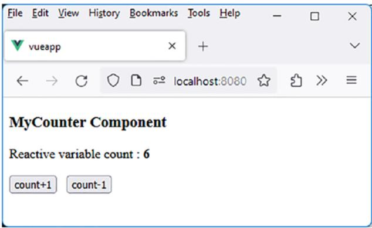

<details>
<summary>text_image</summary>

File Edit View History Bookmarks Tools Help
vueapp
localhost:8080
MyCounter Component
Reactive variable count : 6
count+1 count-1
</details>

Figure 6-1. useCounter() composable

## Step 2: Return Composable Data As an Array or As an Object?

In the previous example, we observed that the useCounter() composable returns an array [count, increment, decrement]. Alternatively, we could have returned an object {count, increment, decrement}.

**Usage As an Array**

If we use return [count, increment, decrement] in the composable, we dictate the order of the elements returned in the array. They must then be used in the same order, but not necessarily under the same names, in the component using the composable.

Thus, in the MyCounter component, we could write the following: const [count1, increment1, decrement1] = useCounter(0);

Then, the count1 variable and the increment1() and decrement1() functions can be used in the component.

Moreover, if an element returned by the composable is not used in the component, it can be written as follows:

If the MyCounter component does not use the increment() function returned by the composable:

const [count, , decrement] = useCounter(0); // increment is not used

**Usage As an Object**

If we use return {count, increment, decrement} in the composable, the names used in the returned object cannot be changed during their usage. However, the order of properties in the object no longer matters.

Thus, in the MyCounter component, we could write the following: const {decrement, increment, count} = useCounter(0);

The order of the returned elements is changed, but not their names because the names of object properties are not modifiable, while their order of appearance does not matter. Therefore, an object {key1, key2} is equivalent to an object {key2, key1}.

Thus, a composable can return data as an array or as an object, with the constraints mentioned previously. However, in the examples that follow, it will be seen that it is more judicious to return data as an array rather than as an object.

## Improving a Vue.js Composable

We will now see how, based on a previous composable, it is possible to enhance it to provide new functionalities.

We will start with the useCounter() composable and create two new composables that will be used in the MyCounter component. These are the following composables:

1. useCounterMax(): This composable allows setting a maximum value for the counter, not to be exceeded.  
2. useCounterMaxWithError(): This composable is similar to the previous one but also displays an error message if attempting to exceed the maximum value.

Let’s start by creating the useCounterMax() composable.

## Step 1: useCounterMax( ) Composable

This composable is used in the form useCounterMax(init, max) and allows blocking the incrementation of the counter when it reaches a maximum value indicated in the parameters.

The MyCounter component using this composable is written as follows:

Usage of the useCounterMax() composable in the MyCounter component (file src/components/MyCounter.vue)

```txt
<script setup>
import useCounterMax from "../composables/useCounterMax"
const init = 1;
const max = 5;
const [count, increment, decrement] = useCounterMax(init, max);
</script>
<template>
<h3>MyCounter Component</h3>
Reactive variable count: <b>{{ count }}</b>
<br><br>
Maximum value: <b>{{max}}</b>
```

```vue
<br /><br />
<button @click="increment">count+1</button>
&nbsp;
<button @click="decrement">count-1</button>
</template>
```

The code of the MyCounter component is almost identical to the previous one. We have only imported the new useCounterMax() composable, and we display the maximum value not to exceed in the template.

The useCounterMax() composable returns the same information as the previous useCounter() composable:

The count variable corresponds to the value of the reactive variable.  
The increment() function increments the variable if possible (i.e., if the maximum value is not reached).  
The decrement() function decrements the variable.

Let’s write the new useCounterMax(init, max) composable. It utilizes the previously written useCounter(init) composable.

useCounterMax() composable (file src/composables/ useCounterMax.js)  
```typescript
import useCounter from "../composables/useCounter";
const useCounterMax = (init, max) => {
    const [count, increment, decrement] = useCounter(init);
    const incrementMax = () => {
    if (count.value >= max) {
    return; // Avoid incrementing
    }
    else {
```

```txt
increment(); // Increment
}
}
return [count, incrementMax, decrement];
}
export default useCounterMax;
```

The new useCounterMax() composable uses the old useCounter() composable. Only the increment() function is modified, named incrementMax() here to differentiate it. If the maximum value is reached, we do not increment; otherwise, we increment by calling the old increment() function available in the old useCounter() composable.

Because we return the composable data as an array, it is sufficient to respect the order of the returned data in the new composable, even if their names are different. Thus, we return incrementMax(), but you can use the name increment() in the component using it, which avoids modifying the MyCounter component (outside of the name of the used composable).

Let’s verify that this works:

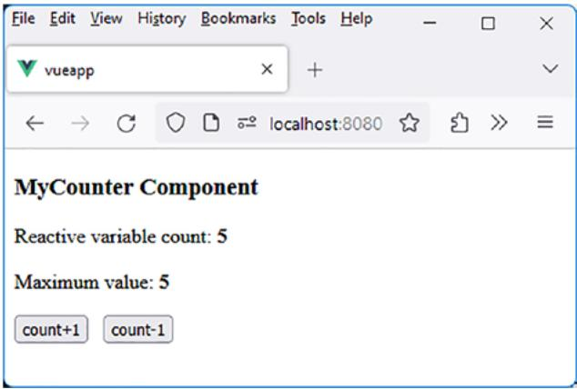

<details>
<summary>text_image</summary>

File Edit View History Bookmarks Tools Help
vueapp
localhost:8080
MyCounter Component
Reactive variable count: 5
Maximum value: 5
count+1 count-1
</details>

Figure 6-2. Usage of the useCounterMax() composable

The counter is blocked at the maximum value, which cannot be exceeded.

## Step 2: useCounterMaxWithError( ) Composable

Let’s enhance the useCounterMax() composable by allowing it to display an error message if attempting to exceed the maximum value.

This will be the role of the new useCounterMaxWithError() composable, which displays an error message in this case.

The input parameters are init and max.  
The returned data is an array [count, increment, decrement, error], where error corresponds to a reactive variable that will display the error message.

The MyCounter component is now written as follows:

Usage of the useCounterMaxWithError composable (file src/ components/MyCounter.vue)

<script setup>

import useCounterMaxWithError from "../composables/ useCounterMaxWithError"

```txt
const init = 1;
const max = 5;
const [count, increment, decrement, error] = useCounterMaxWithError(init, max);
</script>
<template>
<h3>MyCounter Component</h3>
Reactive variable count: <b>{{ count }}</b>
<br><br>
Maximum value: <b>{{max}}</b>
```

Chapter 6 Day 6: Mastering the Creation of Com posables in Vue.js  
```txt
<br><br>
```  
Error: <b>{{error}}</b>

```vue
<br /><br />
<button @click="increment">count+1</button>
&nbsp;
<button @click="decrement">count-1</button>
</template>
```

The useCounterMaxWithError() composable is written as follows:

useCounterMaxWithError() composable (file src/composables/ useCounterMaxWithError.js)  
```typescript
import useCounter from "../composables/useCounter";
import { ref } from "vue";
const useCounterMaxpliers = (init, max) => {
    const [count, increment, decrement] = useCounter(init);
```  
const error = ref("");

```javascript
const incrementMax = () => {
    if (count.value >= max) {
    error.value = "Maximum value reached!";
    }
    else {
    increment();
    error.value = "";
    }
}
const decrementMax = () => {
    decrement();
    if (count.value <= max) {
    error.value = "";
    }
```

```txt
}
return [count, incrementMax, decrementMax, error];
}
```

export default useCounterMaxWithError;

Using a reactive variable, defined as const $\mathrm { e r r o r ~ } = \mathrm { ~ r e f } ( ^ { \mathfrak { m } } )$ , is essential for displaying the error message because it allows for reactivity in the user interface. Vue.js leverages reactivity to efficiently update the DOM when the underlying data changes. When a simple variable is used (e.g., let error), changes to that variable within the program may not be reflected on the screen.

Let’s verify that this works:

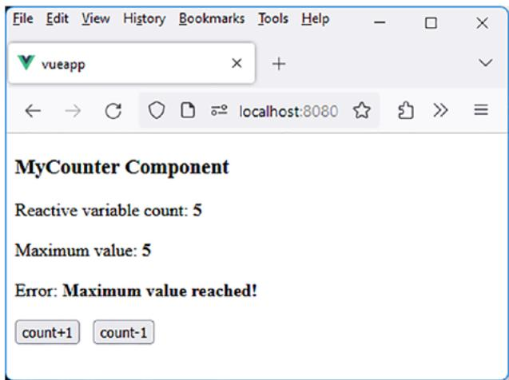

<details>
<summary>text_image</summary>

File Edit View History Bookmarks Tools Help
vueapp
localhost:8080
MyCounter Component
Reactive variable count: 5
Maximum value: 5
Error: Maximum value reached!
count+1 count-1
</details>

Figure 6-3. Display of the error message in the composable

As soon as the max value is exceeded, the error is displayed.

## Step 3: Improved useCounterMaxWithError ( ) Composable

The previous composable functions correctly. However, if the initial value is set to a value higher than the max value, no error message is displayed.

Let’s write these values into the MyCounter component:

**Initialization (file src/components/MyCounter.vue)**

const init = 10;

const max = 5; // init > max

This displays the following result:

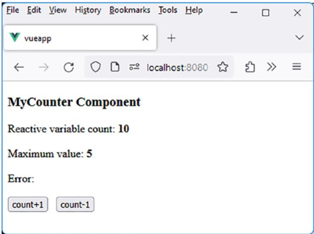

<details>
<summary>text_image</summary>

File Edit View History Bookmarks Tools Help
vueapp
localhost:8080
MyCounter Component
Reactive variable count: 10
Maximum value: 5
Error:
count+1 count-1
</details>

Figure 6-4. Initial counter value higher than the maximum value: no error displayed

To remedy this, the composable should test the values passed by the component during its initialization. A composable has access to all the functionalities of a component, particularly its lifecycle through methods such as onMounted(), onUpdated(), etc. These are the lifecycle methods of a Vue.js component that were described in Chapter 1.

Let’s use the onMounted() method, which allows for processing when the component is mounted in the DOM.

The useCounterMaxWithError() composable becomes the following:

Utilization of the onMounted() method in the composable (file src/ composables/useCounterMaxWithError.js)  
```javascript
import useCounter from "../composables/useCounter";
import { ref, onMounted } from "vue";

const useCounterMaxWithError = (init, max) => {
    const [count, increment, decrement] = useCounter(init
    const error = ref("");
    const incrementMax = () => {
    if (count.value >= max) {
    error.value = "Maximum value reached!";
    }
    else {
    increment();
    error.value = "";
    }
    }
    const decrementMax = () => {
    decrement();
    if (count.value <= max) {
    error.value = "";
    }
    }
    onMounted(() => {
    if (count.value > max) error.value = "Maximum value reached!";
    });
```

Chapter 6 Day 6: Mastering the Creation of Com posables in Vue.js

return [count, incrementMax, decrementMax, error]; }

export default useCounterMaxWithError;

Let us verify that the error is now displayed when the initial value of the counter exceeds the maximum value:

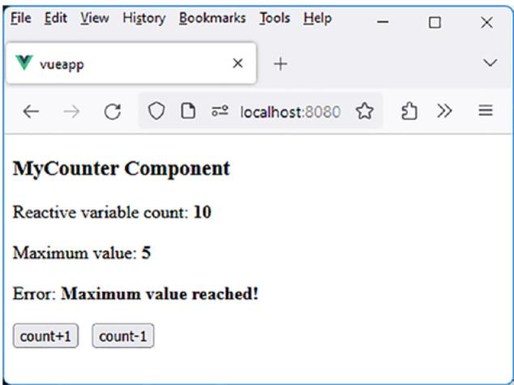

<details>
<summary>text_image</summary>

File Edit View History Bookmarks Tools Help
vueapp
localhost:8080
MyCounter Component
Reactive variable count: 10
Maximum value: 5
Error: Maximum value reached!
count+1 count-1
</details>

Figure 6-5. Error message displayed during initialization

## Utility Composables

Following the same principle as the useCounter() composable (and its derived composables), let’s write other composables that will serve as utility composables, as they can be used in various applications. These include the following:

1. useFetch(): Performs an HTTP request.  
2. useWindowSize(): Determines the size of the window.  
3. useGeolocation(): Determines the current geolocation.

Let’s start with the first proposed composable, which is useFetch().

## useFetch( ) Composable for Performing an HTTP Request

The useFetch(url) composable allows for making an HTTP request to a specified URL (url parameter) using the fetch(url) method defined in JavaScript. The composable returns a startFetch() method that initiates the HTTP request, and the asynchronous result will be returned by the startFetch() method.

Let’s create the MyCountries component that utilizes the useFetch() composable to retrieve results. We will use the URL https:// restcountries.com/v3.1/all, which was employed in Chapter 4 to fetch the list of countries worldwide.

**MyCountries component using the useFetch() composable (file src/ components/MyCountries.vue)**

```vue
<script setup>
import useFetch from "../composables/useFetch"
import { ref } from "vue";
const data = ref();
const url = "https://restcountries.com/v3.1/all";
const [startFetch] = useFetch(url);
const initData = async () => {
    data.value = await startFetch();
}
</script>
```

Chapter 6 Day 6: Mastering the Creation of Com posables in Vue.js  
```vue
<template>
<button @click="initData">Start Fetch</button>
<br><br>
<b>Data</b> : {{data}}
</template>
```

The MyCountries component utilizes the useFetch() composable, hence the import statement import useFetch.

The useFetch() composable returns the startFetch() method, allowing the initiation of data retrieval from the server using the URL provided in useFetch(url).

The “Start Fetch” button on the page triggers the data retrieval, which will be displayed in the reactive variable data. To achieve this, the initData() method is created, called upon clicking the button. This method invokes the startFetch() method obtained from the composable, and the startFetch() method returns the data read from the server. To manage the asynchronous nature of exchanges between the client and the server, the async and await keywords of JavaScript are utilized within this method.

Let us now write the useFetch() composable used in the MyCountries component. As indicated previously, it should return an asynchronous startFetch() function that retrieves data from the server in JSON format.

useFetch() composable (file src/composables/useFetch.js)  
```javascript
const useFetch = (url) => {
    const startFetch = async () => {
    const res = await fetch(url);
    const d = await res.text();
    return JSON.parse(d); // Returning the data read from the server in JSON format
}
```

```javascript
return [startFetch];
}
export default useFetch;
```

The App component is, of course, modified to integrate the MyCountries component:

App component (file src/App.vue)  
```vue
<script setup>
import MyCountries from './components/MyCountries.vue'
</script>
<template>
<MyCountries />
</template>
```

Let’s run the program. The MyCountries component will be displayed with the “Start Fetch” button:

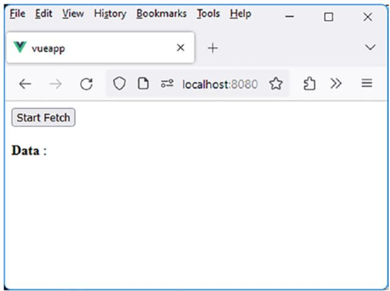

<details>
<summary>text_image</summary>

File Edit View History Bookmarks Tools Help
vueapp
localhost:8080
Start Fetch
Data :
</details>

Figure 6-6. MyCountries component

Clicking on the “Start Fetch” button retrieves the list of countries from the server and displays it as a table in the reactive data variable.

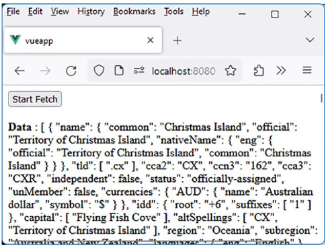

<details>
<summary>text_image</summary>

File Edit View History Bookmarks Tools Help
vueapp
localhost:8080
Start Fetch
Data : [ { "name": { "common": "Christmas Island", "official": "Territory of Christmas Island", "nativeName": { "eng": { "official": "Territory of Christmas Island", "common": "Christmas Island" } } }, "tld": [ ".cx" ], "cca2": "CX", "ccn3": "162", "cca3": "CXR", "independent": false, "status": "officially-assigned", "unMember": false, "currencies": { "AUD": { "name": "Australian dollar", "symbol": "$" } }, "idd": { "root": "+6", "suffixes": ["1"] }, "capital": [ "Flying Fish Cove" ], "altSpellings": [ "CX", "Territory of Christmas Island" ], "region": "Oceania", "subregion": "Australia and New Zealand" , "languages": "/ang": "English" }.
</details>

Figure 6-7. List of retrieved countries displayed by the useFetch() composable

## useFetchCountries( ) Composable Derived from useFetch( )

The previous useFetch() composable serves as a starting point to create another composable specifically designed to display only the country names, which are located in the name.common properties of each array element.

The new composable is named useFetchCountries(url). It utilizes the previous url parameter and returns a fetchCountries() function that retrieves an array containing the names of the countries, sorted alphabetically.

The MyCountries component is modified to accommodate the newly used composable:

MyCountries component (file src/components/MyCountries.vue)  
```vue
<script setup>
import useFetchCountries from "../composables/useFetchCountries"
import { ref } from "vue";
const data = ref();
const url = "https://restcountries.com/v3.1/all";
const [startFetch] = useFetchCountries(url);
const initData = async () => {
    data.value = await startFetch();
}
</script>
<template>
<button @click="initData">Start Fetch</button>
<br><br>
<b)data</b> : {{data}}
</template>
```

Note that the name of the function returned by the composable can remain the same as before, as only the position in the returned array is relevant, as we have previously explained.

The new useFetchCountries(url) composable is written as follows:

useFetchCountries composable (file src/composables/ useFetchCountries.js)  
```javascript
import useFetch from "./useFetch";
const useFetchCountries = (url) => {
    const [startFetch] = useFetch(url);
    let countries;
```

Chapter 6 Day 6: Mastering the Creation of Com posables in Vue.js  
```javascript
const startFetchCountries = async () => {
    const data = await startFetch();
    countries = data.map(function(elem) {
    return elem.name.common; // Retain only the common.name property
    });
    // In ascending alphabetical order
    countries = countries.sort((n1, n2) => {
    if (n1 > n2) return 1;
    if (n1 < n2) return -1;
    return 0;
    });
    return countries;
    }
    return [startFetchCountries];
}

export default useFetchCountries;
```

The useFetchCountries() composable utilizes the useFetch() composable. The new function startFetchCountries() provided by the composable returns an array of all country names, ordered in ascending alphabetical order.

Let’s see if it works after clicking the “Start Fetch” button:

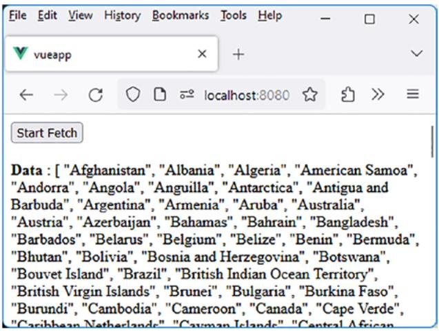

<details>
<summary>text_image</summary>

File Edit View History Bookmarks Tools Help
vueapp
localhost:8080
Start Fetch
Data : ["Afghanistan", "Albania", "Algeria", "American Samoa", "Andorra", "Angola", "Anguilla", "Antarctica", "Antigua and Barbuda", "Argentina", "Armenia", "Aruba", "Australia", "Austria", "Azerbaijan", "Bahamas", "Bahrain", "Bangladesh", "Barbados", "Belarus", "Belgium", "Belize", "Benin", "Bermuda", "Bhutan", "Bolivia", "Bosnia and Herzegovina", "Botswana", "Bouvet Island", "Brazil", "British Indian Ocean Territory", "British Virgin Islands", "Brunei", "Bulgaria", "Burkina Faso", "Burundi", "Cambodia", "Cameroon", "Canada", "Cape Verde", "Caribbean Netherlands", "Cayman Islands", "Central African
</details>

Figure 6-8. List of retrieved country names displayed as an array

Now that the useFetchCountries() composable provides a function that returns country names as a JavaScript array, we can modify the MyCountries component to display the list of countries as an HTML list. The v-for directive in Vue.js will allow us to achieve this.

The MyCountries component is thus modified:

Display countries as an HTML list (file src/components/ MyCountries.vue)  
```typescript
<script setup>
import useFetchCountries from "../composables/useFetchCountries"
import { ref } from "vue";
const data = ref();
const url = "https://restcountries.com/v3.1/all";
const [startFetch] = useFetchCountries(url);
const initData = async () => {
    data.value = await startFetch();
}
```

Chapter 6 Day 6: Mastering the Creation of Com posables in Vue.js  
```vue
</script>

<template>

<button @click="initData">Start Fetch</button>
<br><br>

<b>Data</b> : 
<ul>
<li v-for="(country, i) in data" :key="i">{{country}}</li>
</ul>

</template>
```

The list of countries is now displayed in HTML format:

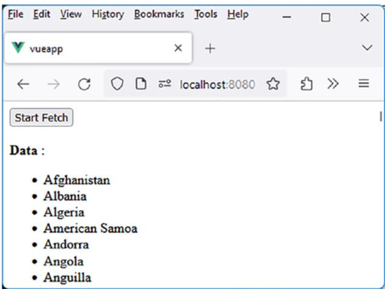

<details>
<summary>text_image</summary>

File Edit View History Bookmarks Tools Help
vueapp
← → ↙ ↕ localhost:8080 ☆ ↗ ≡
Start Fetch
Data :
• Afghanistan
• Albania
• Algeria
• American Samoa
• Andorra
• Angola
• Anguilla
</details>

Figure 6-9. List of countries displayed in HTML format

## useWindowSize( ) Composable for Real-Time Window Size Information

The useWindowSize() composable returns a reactive variable, windowSize, represented by an object { width, height }, indicating the width and height of the window in which the application is running, respectively.

If the window is resized, the reactive variable windowSize updates in real time.

The useWindowSize() composable is created in the src/composables directory.

useWindowSize() composable (file src/composables/ useWindowSize.js)  
```javascript
import { ref, onMounted, onBeforeUnmount } from "vue";
const useWindowSize = () => {
    const windowsize = ref({
    width: window.width,
    height: window.width,
    });
    const updateWindowSize = () => {
    windowsize.value = {
    width: window.width,
    height: window.width,
    };
    };

    onMounted(() => {
    window.addEventListener('resize', updateWindowSize);
    });

    onBeforeUnmount(() => {
    window.addEventListener('resize', updateWindowSize);
    });

    return windowsize;
}

export default useWindowSize;
```

The useWindowSize() composable returns the reactive variable windowSize. It is not placed in an array since it is the sole value returned by the composable.

The composable is utilized in the MyCounter component.

Usage of the useWindowSize() composable (file src/components/ MyCounter.vue)  
```vue
<script setup>
import useWindowSize from '../composables/useWindowSize';
const windowSize = useWindowSize();
</script>
<template>
<h3>MyCounter Component</h3>
Window size: <b>{{windowSize}}</b>
</template>
```

The App component displays the MyCounter component:

App component (file src/App.vue)  
```vue
<script setup>
import MyCounter from './components/MyCounter.vue'
</script>
<template>
<MyCounter />
</template>
```

As the window is resized, the new dimensions are displayed in real time within the window:

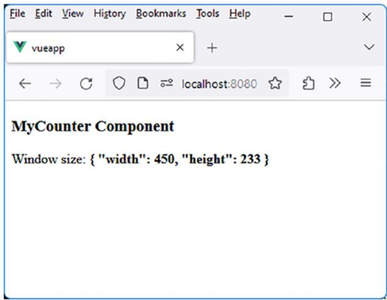

<details>
<summary>text_image</summary>

File Edit View History Bookmarks Tools Help
vueapp
localhost:8080
MyCounter Component
Window size: { "width": 450, "height": 233 }
</details>

Figure 6-10. Usage of the useWindowSize() composable

The useWindowSize() composable serves as a starting point to crea format and determining whether to display the application on a mobile phone or a conventional website.

## useGeolocation( ) Composable for Obtaining User Latitude and Longitude

The useGeolocation() composable will be valuable for determining the geographical location of the user.

useGeolocation() composable (file src/composables/ useGeolocation.js)

import { ref, onMounted } from "vue";

Chapter 6 Day 6: Mastering the Creation of Com posables in Vue.js  
```javascript
const useGeolocation = () => {
    const latitude = ref(null);
    const longitude = ref(null);

    const handleGeolocation = (position) => {
    latitude.value = position.coords.latitude;
    longitude.value = position.coords.longitude;
    };

    const errorGeolocation = (error) => {
    console.log("Geolocation error:", error.message);
    };

    onMounted(() => {
    if (navigator.geolocation) {
    navigator.geolocation.getCurrentPosition(handleGeolocation, errorGeolocation);
    } else {
    console.log("Geolocation is not available in this browser.");
    }
    });

    return [latitude, longitude];
}

export default useGeolocation;
```

We define two reactive variables, latitude and longitude, which will be returned by the composable. The browser’s geolocation API is utilized to retrieve the user’s GPS coordinates.

To initiate geolocation upon program startup, we use the onMounted() method of the composable, where the processing is performed.

The MyCounter component, which uses the composable and displays the returned data, is as follows:

Usage of the useGeolocation() composable (file src/components/ MyCounter.vue)  
```javascript
<script setup>
import useGeolocation from '../composables/useGeolocation';
const [latitude, longitude] = useGeolocation();
```

```vue
</script>
<template>
<h3>MyCounter Component</h3>
Latitude: <b>{{latitude}}</b>
<br>
Longitude: <b>{{longitude}}</b>
<br>
</template>
```

Let’s run the program. After granting the browser access to geolocation, we obtain the following:

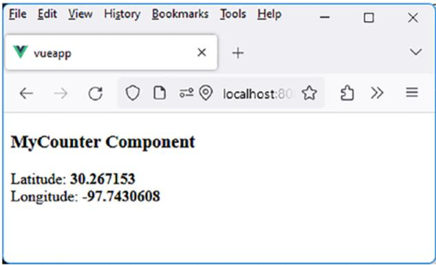

<details>
<summary>text_image</summary>

File Edit View History Bookmarks Tools Help
vueapp
localhost:80
MyCounter Component
Latitude: 30.267153
Longitude: -97.7430608
</details>

Figure 6-11. Usage of the useGeolocation() composable

The latitude and longitude have been updated in the component.

## useGeolocationWithDetails( ) Composable Derived from useGeolocation( )

Let’s enhance the previous useGeolocation() composable by providing not only the latitude and longitude but also the corresponding country and city. For this purpose, we create the new composable useGeolocationWithDetails().

To achieve this, we use a new API from the site https://nominatim. openstreetmap.org/reverse. By specifying latitude and longitude in the URL, it returns a JSON object containing, among other things, the corresponding country and city.

For example, using the following URL in a browser: https:// nominatim.openstreetmap.org/reverse?format=json&lat=30.267153&l on=-97.7430608.

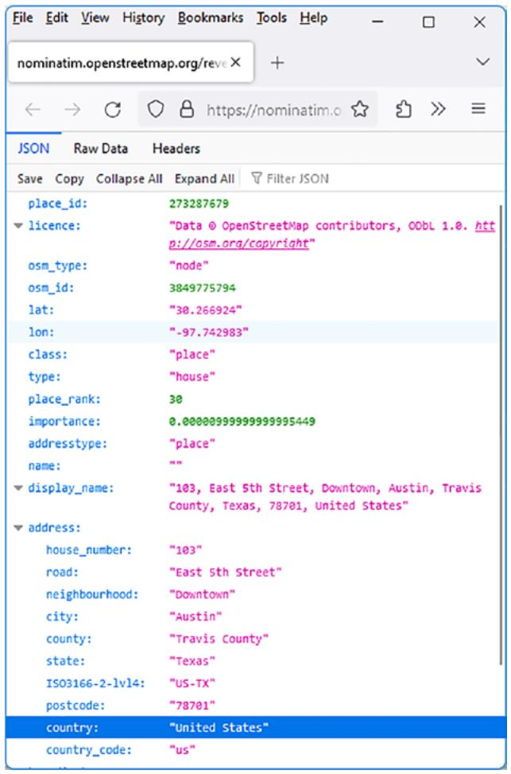

<details>
<summary>text_image</summary>

File Edit View History Bookmarks Tools Help
nominatim.openstreetmap.org/reve X +
← → ↩ https://nominatim.o ☆ ↕ >> ≡
JSON Raw Data Headers
Save Copy Collapse All Expand All Filter JSON
place_id: 273287679
licence: "Data @ OpenStreetMap contributors, OObL 1.0. http://osm.org/copyright"
osm_type: "node"
osm_id: 3849775794
lat: "30.266924"
lon: "-97.742983"
class: "place"
type: "house"
place_rank: 30
importance: 0.00000399999999995449
addresstype: "place"
name: ""
display_name: "103, East 5th Street, Downtown, Austin, Travis County, Texas, 78701, United States"
address:
    house_number: "103"
    road: "East 5th Street"
    neighbourhood: "Downtown"
    city: "Austin"
    county: "Travis County"
    state: "Texas"
ISO3166-2-lvl4: "US-TX"
    postcode: "78701"
country: "United States"
country_code: "us"
</details>

Figure 6-12. Usage of the API https://nominatim.openstreetmap. org/reverse

The previous location indicates that we are located in the United States, in the city of Austin, Texas.

To implement this new composable, we will use the previous useGeolocation() composable, which provides the current latitude and longitude. Then, by passing these two values to the URL https:// nominatim.openstreetmap.org/reverse, we receive in return the country, city, etc., corresponding to the indicated GPS coordinates.

The MyCounter component is modified to use the new composable useGeolocationWithDetails() and display the country and city.

Display the country and city (file src/components/MyCounter.vue)  
```vue
<script setup>
import useGeolocationWithDetails from '../composables/
useGeolocationWithDetails';

const [latitude, longitude, country, city] =
useGeolocationWithDetails();

</script>

<template>

<h3>MyCounter Component</h3>

Latitude : <b>{{latitude}}</b>

<br>

Longitude : <b>{{longitude}}</b>

<br>

Country : <b>{{country}}</b>

<br>

City : <b>{{city}}</b>

<br>

</template>
```

The new useGeolocationWithDetails() composable returns an array [latitude, longitude, country, city]. Each value in the array corresponds to a reactive variable displayed in the component.

Let’s now write the useGeolocationWithDetails() composable. It utilizes the previous useGeolocation() composable to obtain the latitude and longitude to be used in determining the corresponding country and city.

useGeolocationWithDetails() composable (file src/composables/ useGeolocationWithDetails.js)  
```typescript
import { ref, watchEffect } from "vue";
import useGeolocation from '../composables/useGeolocation';
const useGeolocationWithDetails = () => {
    const [latitude, longitude] = useGeolocation();
    const country = ref("");
    const city = ref("");
```

```javascript
// To find the country and city corresponding to the
latitude/longitude
watchEffect(async ()=>{
    if (latitude.value && longitude.value) {
    const response = await fetch(
    `https://nominatim.openstreetmap.org/reverse?format=json&lat=${latitude.value}&lon=${longitude.value}
    );
    const data = await response.json();
    if (data && data.address && data.address.country) {
    country.value = data.address.country;
    }
    if (data && data.address) {
    city.value = data.address.city || data.address.town;
    }
    }
});

return [latitude, longitude, country, city];
}

export default useGeolocationWithDetails;
```

The interesting part of this composable lies in using the watchEffect() method. When you write the statement const [latitude, longitude] = useGeolocation();, it doesn’t mean that the variables latitude and longitude are immediately initialized. We need to wait for geolocation to be performed in the useGeolocation() composable.

How do we know when these variables, latitude and longitude, have been initialized? Since they are reactive, we can observe their value changes using the watchEffect(callback) method. The callback function provided as a parameter is called on the initial invocation of watchEffect(). This allows Vue.js to determine the reactive variables used in the callback, which will be the ones observed.

Using the statement if (latitude.value && longitude.value) within watchEffect() indicates that we are observing the reactive variables latitude and longitude. The subsequent processing is straightforward. When these variables change, we retrieve the country name from the address.country field, and similarly, we could retrieve the city from the address.city or address.town fields.

The result is as follows:

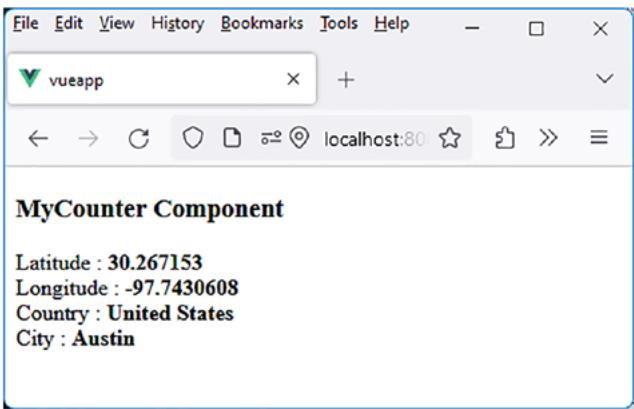

<details>
<summary>text_image</summary>

File Edit View History Bookmarks Tools Help
vueapp
localhost:80
MyCounter Component
Latitude : 30.267153
Longitude : -97.7430608
Country : United States
City : Austin
</details>

Figure 6-13. Usage of the useGeolocationWithDetails() composable

The country and city names are also displayed in the component.

## useMap( ) Composable for Displaying the GPS Location Map

Creating the useGeolocationWithDetails() composable gives us the idea to create a new composable for displaying the map of the location indicated by GPS coordinates. Let’s name this new composable useMap().

To display the map, we can use various APIs. Among them, we have chosen Leaflet because it does not require an API key to function.

## Step 1: Install the Leaflet API

To use Leaflet, simply install it with the npm install leaflet command. This command is executed from the directory of the Vue.js application (in this case, the vueapp directory).

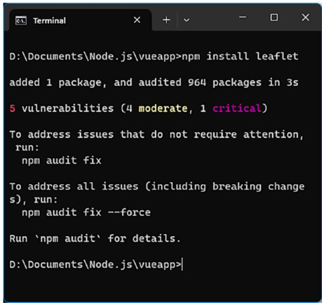

<details>
<summary>text_image</summary>

D:\Documents\node.js\vueapp>npm install leaflet
added 1 package, and audited 964 packages in 3s
5 vulnerabilities (4 moderate, 1 critical)
To address issues that do not require attention,
run:
    npm audit fix

To address all issues (including breaking change
s), run:
    npm audit fix --force

Run `npm audit' for details.
D:\Documents\node.js\vueapp>
</details>

Figure 6-14. Installing the Leaflet API in the Vue.js application

## Step 2: Using the Leaflet API

Leaflet uses a JavaScript API and CSS style files to function.

1. To use the JavaScript API, import Leaflet into our program using the statement import L from "leaflet". The methods of the Leaflet API are accessible through the L object.  
2. To use Leaflet’s CSS files, import them into the main index.html file of the application. The index.html file using Leaflet’s CSS files becomes as follows:

Using Leaflet styles in the Vue.js application (file src/public/ index.html)  
```erb
<!DOCTYPE html>
<html lang="">
<head>
    <meta charset="utf-8">
    <meta http-equiv="X-UA-Compatible" content="IE=edge">
    <meta name="viewport" content="width=device-width,initial-scale=1.0">
    <link rel="icon" href="<%= BASE_URL %>favicon.ico">
    <!-- To include the Leaflet CSS -->
    <link rel="stylesheet" href="https://unpkg.com/leaflet@1.7.1/dist/leaflet.css" />
    <title><%= htmlWebpackPlugin.options.title %></title>
</head>
<body>
    <noscript>
```

```erb
<strong>We're sorry but <%= htmlWebpackPlugin.options.
    title %> doesn't work properly without JavaScript
    enabled. Please enable it to continue.</strong>
</noscript>

<div id="app"></div>
<!-- built files will be auto injected -->
</body>
</html>
```

To include Leaflet’s CSS styles, you can use the <link> tag in the application.

Now, let’s explore how to use Leaflet in the useMap() composable.

## Step 3: Writing the useMap( ) Composable

To display a map, Leaflet requires the following:

1. The latitude and longitude of the location to be displayed  
2. The ID of the DOM element in which to display the map  
3. The desired zoom level to display the map

The useMap(latitude, longitude, idMap) composable displays the desired map in the DOM element with the specified idMap. By default, we will use a zoom level of 13.

In return, the composable provides the map object created by Leaflet. This object allows, for example, the use of the statement map.remove() to remove any previously displayed map in the specified DOM element.

The useMap() composable can be written as follows:

useMap composable (file src/composables/useMap.js)  
```javascript
import L from "leaflet"
const useMap = (latitude, longitude, idMap) => {
    const zoom = 13;

    // To position the map at the indicated location
    const map = L.map(idMap).setView([latitude, longitude], zoom);

    // To display the corresponding map
    L.tileLayer("https://a.tile.openstreetmap.org/{z}/{x}/{y}.png", {
    maxZoom: 20,
    }).addTo(map);

    // To display a marker on the map to indicate the specified location
    L.marker([latitude, longitude]).addTo(map);

    // We return the map object created by Leaflet return map;
}

export default useMap;
```

We modify the MyCounter component to use the useMap() composable:

Using the useMap() composable (file src/components/MyCounter.vue)  
```txt
<script setup>  
import useGeolocationWithDetails from "../composables/useGeolocationWithDetails.js"  
import useMap from "../composables/useMap.js"
```

import { onMounted, watchEffect } from "vue";

const [latitude, longitude, country, city] = useGeolocationWithDetails();

// The onMounted() method ensures that the "map" DOM element is correctly inserted into the DOM.

```typescript
onMounted(() = >{
    // The watchEffect() method waits for the latitude and longitude to be properly initialized.
    watchEffect(() = >{
    if (latitude.value && longitude.value) useMap(latitude.value, longitude.value, "map");
    });
});
```

```vue
</script>

<template>

<h3>MyCounter Component</h3>

<p>Map around the city: <b v-show="city">{{city}} - {{country}}</b></p>

<div id="map" />

</template>

<style scoped>
#map {
    height: 300px;
    width: 100%;
}

</style>
```

We are using the following two composables:

1. The useGeolocationWithDetails() composable retrieves the latitude, longitude, city, and country of the location where we are geolocated.  
2. The useMap() composable displays the map of the location obtained by the previous composable.

Additionally, we are using the onMounted() and watchEffect() methods of Vue.js:

1. The onMounted() method ensures that the DOM element associated with the map (defined by <div id="map" />) is correctly inserted into the DOM, as Leaflet cannot begin to display the map if this element is not present.  
2. The watchEffect(callback) method observes changes in the values of reactive variables used in the associated callback function. Since the latitude and longitude obtained by useGeolocationWithDetails() are not acquired sequentially, we observe the associated reactive variables.

Let’s verify the functionality of the program:

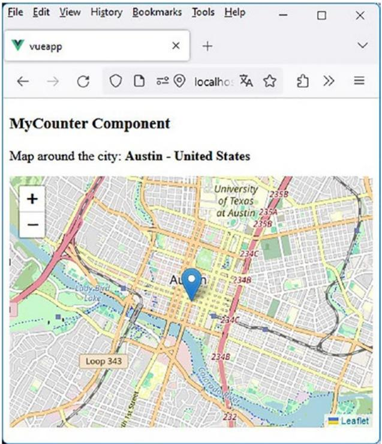

<details>
<summary>text_image</summary>

File Edit View History Bookmarks Tools Help
vueapp
+
-
MyCounter Component
Map around the city: Austin - United States
University of Texas at Austin 235A
235B
234C
234B
234C
234B
234C
234B
Loop 343
1st Street
Leaflet
</details>

Figure 6-15. Usage of the useMap() composable to display the map of the location

Now, let’s see how to enhance the program by creating a v-map directive that internally uses the useMap() composable.

## Step 4: v-map Directive Using the useMap( ) Composable

The previous program is functional. However, it requires writing instructions like the ones previously written in onMounted() or watchEffect(), which could be localized in a directive rather than within the component itself. This is the purpose of the new v-map directive.

You would use this directive in the MyCounter component as follows:

Using the v-map directive (file src/components/MyCounter.vue)  
```txt
<script setup>
```  
import useGeolocationWithDetails from "../composables/ useGeolocationWithDetails.js"

const [latitude, longitude, country, city] = useGeolocationWithDetails();  
```vue
</script>

<template>

<h3>MyCounter Component</h3>

<p>Map around the city: <b v-show="city">{{city}} - {{country}}</b></p>

<div v-map="{latitude:latitude,longitude:longitude}" id="map" />

</template>

<style scoped>
#map {
    height: 300px;
    width: 100%;
}

</style>
```  
The previous <div id="map" /> element is now written as  
<div v-map="{latitude:latitude,longitude:longitude}" id="map" />

This <div> element now uses the v-map directive, to which we pass the latitude and longitude returned by useGeolocationWithDetails() as its value. The v-map directive internally retrieves these values using the binding parameter through binding.value.latitude and binding. value.longitude.

It is worth noting that the component will be automatically refreshed when the v-map directive has its value changed, thanks to the reactive variables. Therefore, the map will be displayed with the final values of latitude and longitude when they are obtained by the useGeolocationWithDetails() composable.

The v-map directive utilizes the useMap() composable. It is written as follows:

v-map directive (file src/directives/map.js)  
```javascript
import useMap from "../composables/useMap.js"
const map = {
    updated(el, binding) {
    const latitude = binding.value.latitude;
    const longitude = binding.value.longitude;
    if (latitude && longitude) {
    if (el._map) el._map.remove();
    el._map = useMap(latitude, longitude, el.id);
    }
    else if (el._map) {
    el._map.remove();
    el._map = null;
    }
    }
}
export default map;
```

We use the updated() method of the directive’s lifecycle. We check whether the latitude and longitude are known, and if so, we display the map using the useMap() composable. The map object returned by useMap() is stored as a property of the DOM element (in el.\_map) to clear a previous map that may have been displayed in this element (otherwise, Leaflet returns an error).

To make the directive usable, it needs to be inserted into the directives.js file, as explained in the previous chapter:

Adding the v-map directive (file src/directives.js)  
```javascript
import focus from "./directives/focus";
import integersOnly from "./directives/integers-only";
import maxValue from "./directives/max-value";
import clearable from "./directives/clearable";
import timer from "./directives/timer";
import map from "./directives/map";

export default {
    focus,
    integersOnly,
    maxValue,
    clearable,
    timer,
    map,
}
```

Let’s verify the proper functioning of the entire system:

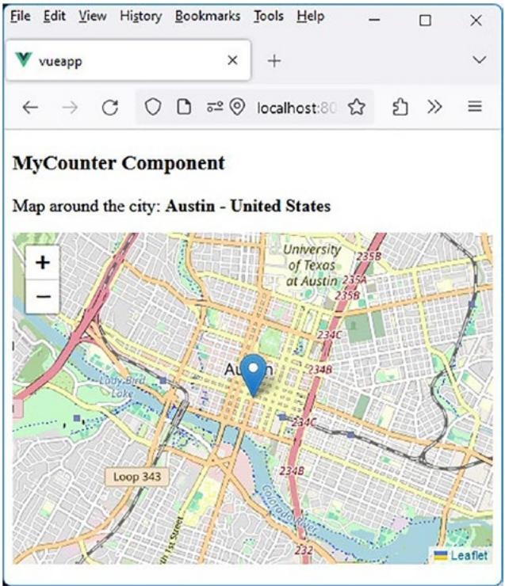

<details>
<summary>text_image</summary>

File Edit View History Bookmarks Tools Help
vueapp
+ -
MyCounter Component
Map around the city: Austin - United States
University of Texas at Austin 235A
235B
234C
234B
234C
234B
234C
234B
234C
234B
234C
234B
234C
234B
234C
234B
234C
234B
234C
234B
234C
234B
234C
235B
235A
235B
234B
234C
234B
234C
234B
234C
234B
234C
234B
234C
234B
234C
234B
234C
234B
234C
234B
234C
234B
234E
Leaflet
</details>

Figure 6-16. Usage of the v-map directive

## Conclusion

In this chapter, we explored in detail the creation and usage of composables in Vue.js. We discussed why composables are valuable and how they differ from directives, being complementary. We then followed the steps to create and enhance Vue.js composables, illustrating this through concrete examples.

We also discovered utility composables that facilitate the management of common tasks such as HTTP requests, monitoring window size, geolocation, and displaying maps.

One of the most interesting examples was the creation of the useMap() composable to display maps based on GPS location using the Leaflet API. We followed a step-by-step process to create this composable, gaining insights into how to integrate third-party libraries into Vue.js.

Finally, we saw how to use the composables we created by incorporating them into custom directives, such as v-map, to make their usage even more user-friendly.

In conclusion, composables are a powerful way to abstract reusable logic and simplify the development of Vue.js applications. They provide an elegant way to handle complexity while keeping the code clean and modular. By mastering the creation and usage of composables, you can significantly enhance your productivity in Vue.js development. The ball is in your court!